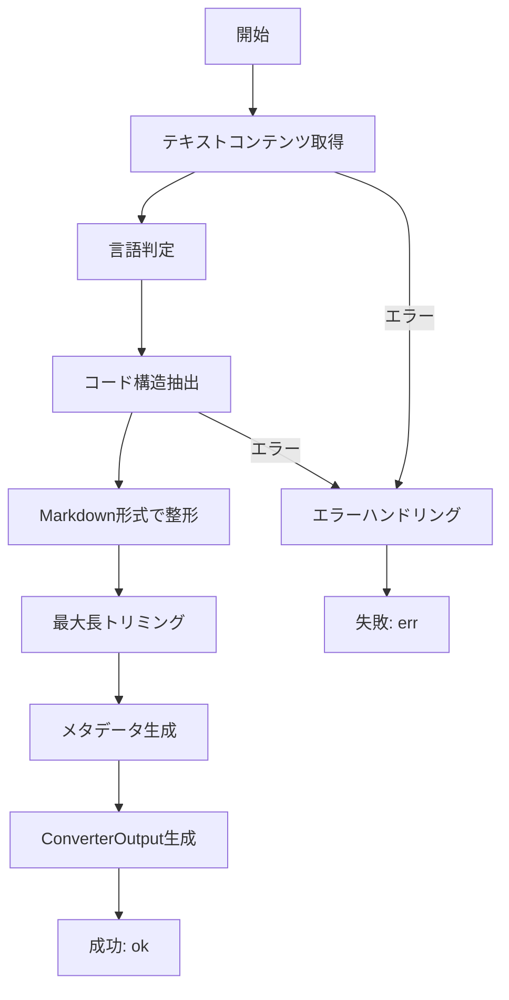
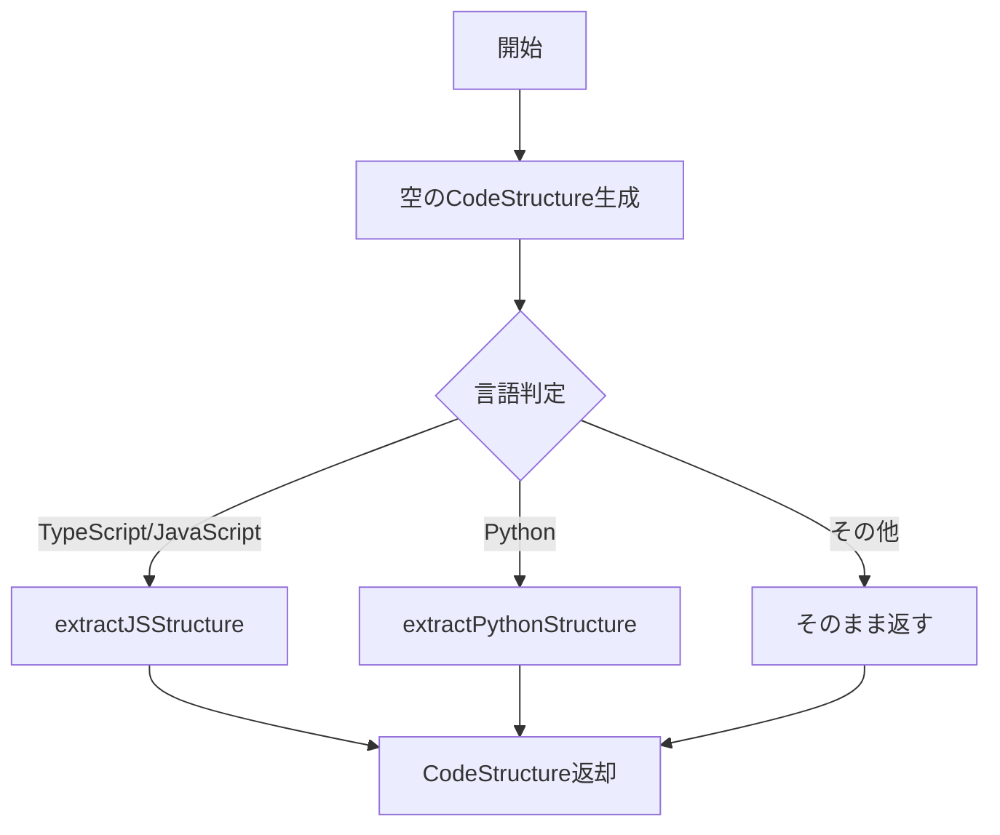

# CodeConverter 詳細設計書

## メタ情報

| 項目         | 内容                                                             |
| ------------ | ---------------------------------------------------------------- |
| タスクID     | CONV-02-03 / T-01-2                                              |
| ドキュメント | CodeConverter詳細設計                                            |
| 作成日       | 2025-12-25                                                       |
| ステータス   | Phase 1: 設計完了                                                |
| 前提         | Phase 0: 要件定義完了 (requirements-markdown-code-converters.md) |

---

## 1. 概要

### 1.1 責務

CodeConverterは、TypeScript、JavaScript、Pythonのソースコードファイルを処理し、コード構造（関数、クラス、インポート、エクスポート）を抽出してRAG検索に適した形式に変換するコンバーターである。

### 1.2 設計方針

- **BaseConverter継承**: 既存のコンバーター基盤を活用
- **正規表現ベース**: AST解析を使用せず、正規表現で構造抽出（簡易実装）
- **拡張性考慮**: 将来的なAST解析への移行を考慮した設計
- **Markdown出力**: コード構造サマリー + ソースコードをMarkdown形式で出力

### 1.3 対応言語

| 言語       | 拡張子                        | MIMEタイプ                                                       |
| ---------- | ----------------------------- | ---------------------------------------------------------------- |
| TypeScript | `.ts`, `.tsx`, `.mts`, `.cts` | `text/x-typescript`, `text/typescript`, `application/typescript` |
| JavaScript | `.js`, `.jsx`, `.mjs`, `.cjs` | `text/javascript`, `application/javascript`                      |
| Python     | `.py`                         | `text/x-python`, `text/x-python-script`, `application/x-python`  |

---

## 2. クラス設計

### 2.1 クラス図

```
┌─────────────────────────────────────────────────────────────────────┐
│                        BaseConverter                                 │
│                          (abstract)                                  │
├─────────────────────────────────────────────────────────────────────┤
│ + id: string                                                         │
│ + name: string                                                       │
│ + supportedMimeTypes: readonly string[]                              │
│ + priority: number                                                   │
│ + convert(input, options): Promise<Result<ConverterOutput, RAGError>>│
│ # doConvert(input, options): Promise<Result<ConverterOutput, RAGError>>│
│ # getTextContent(input): string                                      │
│ # trimContent(content, maxLength): string                            │
│ # handleError(error, input): Result<never, RAGError>                 │
└─────────────────────────────────────────────────────────────────────┘
                                    ▲
                                    │ extends
                                    │
┌─────────────────────────────────────────────────────────────────────┐
│                         CodeConverter                                │
├─────────────────────────────────────────────────────────────────────┤
│ + id = "code-converter"                                              │
│ + name = "Code File Converter"                                       │
│ + supportedMimeTypes = [...]                                         │
│ + priority = 10                                                      │
├─────────────────────────────────────────────────────────────────────┤
│ # doConvert(input, options): Promise<Result<ConverterOutput, RAGError>>│
│ # getDescription(): string                                           │
│ - detectLanguage(mimeType, filePath): string                         │
│ - extractCodeStructure(content, language): CodeStructure             │
│ - extractJSStructure(content, structure): void                       │
│ - extractPythonStructure(content, structure): void                   │
│ - formatAsMarkdown(content, language, structure): string             │
│ - createMetadata(content, language, structure): ExtractedMetadata    │
└─────────────────────────────────────────────────────────────────────┘

┌─────────────────────────────────────────────────────────────────────┐
│                         CodeStructure                                │
│                         (interface)                                  │
├─────────────────────────────────────────────────────────────────────┤
│ + functions: string[]                                                │
│ + classes: string[]                                                  │
│ + imports: string[]                                                  │
│ + exports: string[]                                                  │
│ + comments: string[]                                                 │
└─────────────────────────────────────────────────────────────────────┘
```

### 2.2 依存関係

```
CodeConverter
    ├── BaseConverter (継承)
    ├── types.ts (型: ConverterInput, ConverterOutput, ExtractedMetadata, ConverterOptions)
    └── rag/index.ts (型: Result, RAGError, ok, err, createRAGError, ErrorCodes)
```

---

## 3. 型定義

### 3.1 CodeStructure インターフェース

```typescript
/**
 * コード構造
 *
 * ソースコードから抽出された構造情報を格納。
 * 正規表現ベースの簡易抽出のため、完全性は保証しない。
 */
interface CodeStructure {
  /** 関数名の配列（通常関数、アロー関数含む） */
  functions: string[];

  /** クラス名の配列 */
  classes: string[];

  /** インポート元モジュール名の配列 */
  imports: string[];

  /** エクスポート名の配列 */
  exports: string[];

  /** コメント（将来拡張用、現在は未使用） */
  comments: string[];
}
```

---

## 4. プロパティ設計

### 4.1 静的プロパティ

```typescript
/**
 * コンバーターID
 */
readonly id = "code-converter";

/**
 * コンバーター名（表示用）
 */
readonly name = "Code File Converter";

/**
 * サポートするMIMEタイプ
 */
readonly supportedMimeTypes = [
  // TypeScript
  "text/x-typescript",
  "text/typescript",
  "application/typescript",
  // JavaScript
  "text/javascript",
  "application/javascript",
  // Python
  "text/x-python",
  "text/x-python-script",
  "application/x-python",
] as const;

/**
 * 優先度
 * - 10: 高優先度（コード専用コンバーター）
 */
readonly priority = 10;
```

---

## 5. メソッド設計

### 5.1 doConvert() - メイン変換処理

#### シグネチャ

```typescript
protected async doConvert(
  input: ConverterInput,
  options: ConverterOptions,
): Promise<Result<ConverterOutput, RAGError>>
```

#### 処理フロー



#### 実装設計

```typescript
protected async doConvert(
  input: ConverterInput,
  options: ConverterOptions,
): Promise<Result<ConverterOutput, RAGError>> {
  try {
    // 1. テキストコンテンツ取得
    const content = this.getTextContent(input);

    // 2. 言語判定
    const language = this.detectLanguage(input.mimeType, input.filePath);

    // 3. コード構造抽出
    const structure = this.extractCodeStructure(content, language);

    // 4. Markdown形式で整形
    const formattedContent = this.formatAsMarkdown(content, language, structure);

    // 5. 最大長トリミング
    const trimmedContent = this.trimContent(
      formattedContent,
      options.maxContentLength,
    );

    // 6. メタデータ生成
    const extractedMetadata = this.createMetadata(content, language, structure);

    // 7. ConverterOutput生成
    return ok({
      convertedContent: trimmedContent,
      extractedMetadata,
      processingTime: 0, // BaseConverterが自動設定
    });
  } catch (error) {
    return err(
      createRAGError(
        ErrorCodes.CONVERSION_FAILED,
        `Failed to convert code: ${error instanceof Error ? error.message : String(error)}`,
        {
          converterId: this.id,
          fileId: input.fileId,
          mimeType: input.mimeType,
        },
        error as Error,
      ),
    );
  }
}
```

---

### 5.2 detectLanguage() - 言語判定

#### シグネチャ

```typescript
private detectLanguage(mimeType: string, filePath: string): string
```

#### 処理内容

1. ファイルパスから拡張子を抽出
2. 拡張子に基づいて言語を判定
3. 判定できない場合は `"text"` を返す

#### 言語マッピング

| 拡張子 | 言語       |
| ------ | ---------- |
| `.ts`  | typescript |
| `.tsx` | typescript |
| `.mts` | typescript |
| `.cts` | typescript |
| `.js`  | javascript |
| `.jsx` | javascript |
| `.mjs` | javascript |
| `.cjs` | javascript |
| `.py`  | python     |
| その他 | text       |

#### 実装設計

```typescript
private detectLanguage(mimeType: string, filePath: string): string {
  const ext = filePath.split(".").pop()?.toLowerCase();

  const languageMap: Record<string, string> = {
    ts: "typescript",
    tsx: "typescript",
    mts: "typescript",
    cts: "typescript",
    js: "javascript",
    jsx: "javascript",
    mjs: "javascript",
    cjs: "javascript",
    py: "python",
  };

  return languageMap[ext ?? ""] ?? "text";
}
```

---

### 5.3 extractCodeStructure() - コード構造抽出

#### シグネチャ

```typescript
private extractCodeStructure(content: string, language: string): CodeStructure
```

#### 処理フロー



#### 実装設計

```typescript
private extractCodeStructure(content: string, language: string): CodeStructure {
  const structure: CodeStructure = {
    functions: [],
    classes: [],
    imports: [],
    exports: [],
    comments: [],
  };

  if (language === "typescript" || language === "javascript") {
    this.extractJSStructure(content, structure);
  } else if (language === "python") {
    this.extractPythonStructure(content, structure);
  }

  return structure;
}
```

---

### 5.4 extractJSStructure() - JavaScript/TypeScript構造抽出

#### シグネチャ

```typescript
private extractJSStructure(content: string, structure: CodeStructure): void
```

#### 抽出対象と正規表現パターン

##### 関数定義

```typescript
// 通常関数: function foo(), export function bar(), export async function baz()
const FUNCTION_REGEX = /(?:export\s+)?(?:async\s+)?function\s+(\w+)/g;
```

**マッチ例**:

- `function foo()` → `foo`
- `export function bar()` → `bar`
- `export async function baz()` → `baz`
- `async function qux()` → `qux`

##### アロー関数

```typescript
// アロー関数: const foo = () =>, export const bar = async () =>
const ARROW_FUNCTION_REGEX =
  /(?:export\s+)?const\s+(\w+)\s*=\s*(?:async\s*)?\(/g;
```

**マッチ例**:

- `const foo = () =>` → `foo`
- `export const bar = async () =>` → `bar`
- `const baz = (x) =>` → `baz`

##### クラス定義

```typescript
// クラス: class Foo, export class Bar
const CLASS_REGEX = /(?:export\s+)?class\s+(\w+)/g;
```

**マッチ例**:

- `class Foo` → `Foo`
- `export class Bar` → `Bar`

##### インポート

```typescript
// インポート: import foo from "bar", import "baz"
const IMPORT_REGEX = /import\s+(?:.*?from\s+)?['"]([^'"]+)['"]/g;
```

**マッチ例**:

- `import foo from "bar"` → `bar`
- `import { a, b } from "module"` → `module`
- `import "side-effect"` → `side-effect`

##### エクスポート

```typescript
// エクスポート: export const foo, export default function bar
const EXPORT_REGEX =
  /export\s+(?:default\s+)?(?:const|let|var|function|class|interface|type)\s+(\w+)/g;
```

**マッチ例**:

- `export const foo` → `foo`
- `export default class Bar` → `Bar`
- `export function baz` → `baz`
- `export interface IFoo` → `IFoo`
- `export type MyType` → `MyType`

#### 実装設計

```typescript
private extractJSStructure(content: string, structure: CodeStructure): void {
  let match;

  // 関数定義
  const functionRegex = /(?:export\s+)?(?:async\s+)?function\s+(\w+)/g;
  while ((match = functionRegex.exec(content)) !== null) {
    structure.functions.push(match[1]);
  }

  // アロー関数
  const arrowRegex = /(?:export\s+)?const\s+(\w+)\s*=\s*(?:async\s*)?\(/g;
  while ((match = arrowRegex.exec(content)) !== null) {
    structure.functions.push(match[1]);
  }

  // クラス定義
  const classRegex = /(?:export\s+)?class\s+(\w+)/g;
  while ((match = classRegex.exec(content)) !== null) {
    structure.classes.push(match[1]);
  }

  // インポート
  const importRegex = /import\s+(?:.*?from\s+)?['"]([^'"]+)['"]/g;
  while ((match = importRegex.exec(content)) !== null) {
    structure.imports.push(match[1]);
  }

  // エクスポート
  const exportRegex = /export\s+(?:default\s+)?(?:const|let|var|function|class|interface|type)\s+(\w+)/g;
  while ((match = exportRegex.exec(content)) !== null) {
    structure.exports.push(match[1]);
  }
}
```

---

### 5.5 extractPythonStructure() - Python構造抽出

#### シグネチャ

```typescript
private extractPythonStructure(content: string, structure: CodeStructure): void
```

#### 抽出対象と正規表現パターン

##### 関数定義

```typescript
// 関数定義: def foo():
const PYTHON_FUNCTION_REGEX = /def\s+(\w+)\s*\(/g;
```

**マッチ例**:

- `def foo():` → `foo`
- `def bar(x, y):` → `bar`
- `async def baz():` → マッチしない（`async`は別途対応可能）

##### クラス定義

```typescript
// クラス定義: class Foo:, class Bar(Base):
const PYTHON_CLASS_REGEX = /class\s+(\w+)/g;
```

**マッチ例**:

- `class Foo:` → `Foo`
- `class Bar(Base):` → `Bar`

##### インポート

```typescript
// インポート: from foo import bar, import baz
const PYTHON_IMPORT_REGEX = /(?:from\s+(\S+)\s+)?import\s+(.+)/g;
```

**マッチ例**:

- `from foo import bar` → `foo`
- `import baz` → `baz`
- `from os.path import join` → `os.path`

#### 実装設計

```typescript
private extractPythonStructure(content: string, structure: CodeStructure): void {
  let match;

  // 関数定義
  const functionRegex = /def\s+(\w+)\s*\(/g;
  while ((match = functionRegex.exec(content)) !== null) {
    structure.functions.push(match[1]);
  }

  // クラス定義
  const classRegex = /class\s+(\w+)/g;
  while ((match = classRegex.exec(content)) !== null) {
    structure.classes.push(match[1]);
  }

  // インポート
  const importRegex = /(?:from\s+(\S+)\s+)?import\s+(.+)/g;
  while ((match = importRegex.exec(content)) !== null) {
    // from X import Y の場合は X を、import X の場合は X を取得
    const module = match[1] || match[2].split(",")[0].trim();
    structure.imports.push(module);
  }
}
```

---

### 5.6 formatAsMarkdown() - Markdown形式で整形

#### シグネチャ

```typescript
private formatAsMarkdown(
  content: string,
  language: string,
  structure: CodeStructure,
): string
```

#### 出力フォーマット

````markdown
## Code Structure

### Classes

- `ClassName1`
- `ClassName2`

### Functions

- `functionName1`
- `functionName2`

## Source Code

```typescript
// 元のソースコード
```
````

````

#### 実装設計

```typescript
private formatAsMarkdown(
  content: string,
  language: string,
  structure: CodeStructure,
): string {
  const parts: string[] = [];

  // 構造情報サマリー
  if (structure.classes.length > 0 || structure.functions.length > 0) {
    parts.push("## Code Structure\n");

    if (structure.classes.length > 0) {
      parts.push("### Classes");
      parts.push(structure.classes.map(c => `- \`${c}\``).join("\n"));
      parts.push("");
    }

    if (structure.functions.length > 0) {
      parts.push("### Functions");
      parts.push(structure.functions.map(f => `- \`${f}\``).join("\n"));
      parts.push("");
    }
  }

  // コード本体
  parts.push("## Source Code\n");
  parts.push(`\`\`\`${language}`);
  parts.push(content);
  parts.push("```");

  return parts.join("\n");
}
````

---

### 5.7 createMetadata() - メタデータ生成

#### シグネチャ

```typescript
private createMetadata(
  content: string,
  language: string,
  structure: CodeStructure,
): ExtractedMetadata
```

#### メタデータマッピング

| ExtractedMetadataフィールド | 値                                          |
| --------------------------- | ------------------------------------------- |
| `title`                     | `null` (コードファイルにはタイトルなし)     |
| `author`                    | `null`                                      |
| `language`                  | `"en"` (コードは通常英語)                   |
| `wordCount`                 | 空白区切りの単語数                          |
| `lineCount`                 | 行数                                        |
| `charCount`                 | 文字数                                      |
| `headers`                   | クラス・関数を見出しとして扱う              |
| `codeBlocks`                | `1` (ソースコード全体を1つのコードブロック) |
| `links`                     | `[]` (コードファイルにはリンクなし)         |
| `custom`                    | 言語名、クラス数、関数数、インポート数等    |

#### 実装設計

```typescript
private createMetadata(
  content: string,
  language: string,
  structure: CodeStructure,
): ExtractedMetadata {
  const lines = content.split("\n");

  // クラスと関数を見出しとして扱う
  const headers: Array<{ level: number; text: string }> = [
    ...structure.classes.map(c => ({ level: 2, text: `class ${c}` })),
    ...structure.functions.map(f => ({ level: 2, text: `function ${f}` })),
  ];

  return {
    title: null,
    author: null,
    language: "en", // コードは通常英語（型定義に準拠: "ja" | "en"）
    wordCount: content.split(/\s+/).filter(w => w.length > 0).length,
    lineCount: lines.length,
    charCount: content.length,
    headers,
    codeBlocks: 1, // ソースコード全体を1つのコードブロックとして扱う
    links: [],
    custom: {
      language,                           // 実際の言語名
      classCount: structure.classes.length,
      functionCount: structure.functions.length,
      importCount: structure.imports.length,
      exportCount: structure.exports.length,
      classes: structure.classes,
      functions: structure.functions,
    },
  };
}
```

---

## 6. 正規表現パターン一覧

### 6.1 JavaScript/TypeScript用

| パターン名           | 正規表現                                                                                   | 用途             |
| -------------------- | ------------------------------------------------------------------------------------------ | ---------------- |
| FUNCTION_REGEX       | `/(?:export\s+)?(?:async\s+)?function\s+(\w+)/g`                                           | 関数定義抽出     |
| ARROW_FUNCTION_REGEX | `/(?:export\s+)?const\s+(\w+)\s*=\s*(?:async\s*)?\(/g`                                     | アロー関数抽出   |
| CLASS_REGEX          | `/(?:export\s+)?class\s+(\w+)/g`                                                           | クラス定義抽出   |
| IMPORT_REGEX         | `/import\s+(?:.*?from\s+)?['"]([^'"]+)['"]/g`                                              | インポート抽出   |
| EXPORT_REGEX         | `/export\s+(?:default\s+)?(?:const\|let\|var\|function\|class\|interface\|type)\s+(\w+)/g` | エクスポート抽出 |

### 6.2 Python用

| パターン名            | 正規表現                               | 用途           |
| --------------------- | -------------------------------------- | -------------- |
| PYTHON_FUNCTION_REGEX | `/def\s+(\w+)\s*\(/g`                  | 関数定義抽出   |
| PYTHON_CLASS_REGEX    | `/class\s+(\w+)/g`                     | クラス定義抽出 |
| PYTHON_IMPORT_REGEX   | `/(?:from\s+(\S+)\s+)?import\s+(.+)/g` | インポート抽出 |

---

## 7. エラーハンドリング

### 7.1 エラーケース

| エラーケース   | エラーコード      | メッセージ例                  |
| -------------- | ----------------- | ----------------------------- |
| デコード失敗   | CONVERSION_FAILED | "Failed to convert code: ..." |
| 予期しない例外 | CONVERSION_FAILED | "Failed to convert code: ..." |

### 7.2 エラーレスポンス

```typescript
return err(
  createRAGError(
    ErrorCodes.CONVERSION_FAILED,
    `Failed to convert code: ${error instanceof Error ? error.message : String(error)}`,
    {
      converterId: this.id,
      fileId: input.fileId,
      mimeType: input.mimeType,
    },
    error as Error,
  ),
);
```

---

## 8. テスト設計

### 8.1 テストケース

#### 正常系

| テストケース               | 入力例                     | 期待結果                         |
| -------------------------- | -------------------------- | -------------------------------- |
| TypeScript関数抽出         | `function foo() {}`        | functions: ["foo"]               |
| TypeScriptアロー関数抽出   | `const bar = () => {}`     | functions: ["bar"]               |
| TypeScriptクラス抽出       | `class MyClass {}`         | classes: ["MyClass"]             |
| TypeScriptインポート抽出   | `import foo from "module"` | imports: ["module"]              |
| TypeScriptエクスポート抽出 | `export const baz = 1`     | exports: ["baz"]                 |
| Python関数抽出             | `def foo():`               | functions: ["foo"]               |
| Pythonクラス抽出           | `class MyClass:`           | classes: ["MyClass"]             |
| Pythonインポート抽出       | `from os import path`      | imports: ["os"]                  |
| Markdown形式出力           | TypeScriptファイル         | Code Structure + Source Code形式 |

#### エッジケース

| テストケース         | 入力例                             | 期待結果                       |
| -------------------- | ---------------------------------- | ------------------------------ |
| 空ファイル           | ``                                 | 空の構造                       |
| 関数なし             | `const x = 1;`                     | functions: []                  |
| 複数言語混在（不正） | TypeScriptファイル内にPython風構文 | TypeScript構造のみ抽出         |
| 未知の拡張子         | `.unknown`                         | language: "text", 構造抽出なし |

#### 異常系

| テストケース | 条件     | 期待結果             |
| ------------ | -------- | -------------------- |
| 変換エラー   | 例外発生 | Result.err(RAGError) |

---

## 9. パフォーマンス考慮

### 9.1 大規模ファイル対応

- `maxContentLength` オプションでコンテンツ長を制限
- 正規表現は非貪欲マッチング（`*?`）を使用

### 9.2 正規表現の制限

- 正規表現ベースのため、以下のケースは検出できない可能性がある:
  - 文字列リテラル内の構文
  - コメント内の構文
  - 複雑なネスト構造

---

## 10. 拡張性

### 10.1 将来の拡張候補

- **AST解析への移行**: TypeScript Compiler API、@babel/parser、Pythonのastモジュール
- **コメント抽出**: JSDoc、Pythonドキュメンテーション文字列
- **メソッド抽出**: クラス内のメソッド定義
- **型定義抽出**: TypeScriptのinterface、type定義

### 10.2 拡張ポイント

- `extractCodeStructure()` メソッドを言語ごとにプラグイン化可能
- `CodeStructure` インターフェースにフィールド追加可能
- `custom` フィールドで追加メタデータ格納

---

## 11. 実装ファイル構成

```
packages/shared/src/services/conversion/converters/
├── code-converter.ts           # CodeConverter実装
└── __tests__/
    └── code-converter.test.ts  # ユニットテスト
```

---

## 12. 完了条件チェックリスト

- [x] 言語判定ロジックが明確に定義されている
  - ファイル拡張子ベースの判定（9種類の拡張子対応）
- [x] 各言語の構造抽出ロジックが明確に定義されている
  - JavaScript/TypeScript: 関数、アロー関数、クラス、インポート、エクスポート
  - Python: 関数、クラス、インポート
- [x] 正規表現パターンが設計されている
  - JavaScript/TypeScript用: 5パターン
  - Python用: 3パターン
- [x] Markdown形式の整形ロジックが設計されている
  - Code Structure + Source Code形式

---

## 変更履歴

| 日付       | バージョン | 変更内容                      |
| ---------- | ---------- | ----------------------------- |
| 2025-12-25 | 1.0.0      | 初版作成（Phase 1: 設計完了） |
