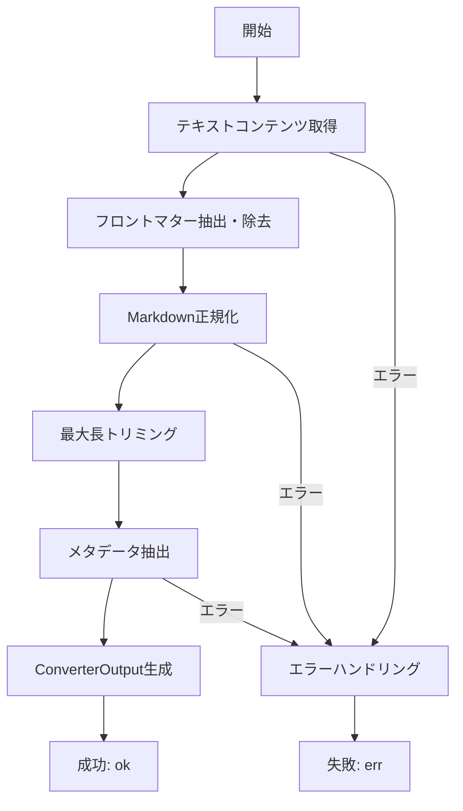
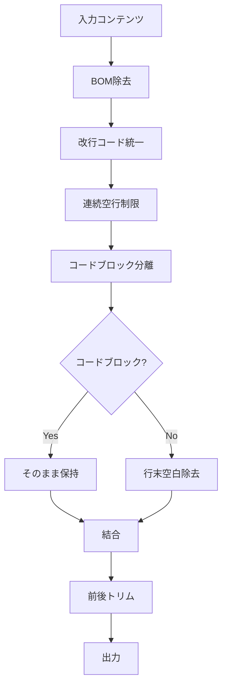

# MarkdownConverter 詳細設計書

## メタ情報

| 項目         | 内容                                                             |
| ------------ | ---------------------------------------------------------------- |
| タスクID     | CONV-02-03 / T-01-1                                              |
| ドキュメント | MarkdownConverter詳細設計                                        |
| 作成日       | 2025-12-25                                                       |
| ステータス   | Phase 1: 設計完了                                                |
| 前提         | Phase 0: 要件定義完了 (requirements-markdown-code-converters.md) |

---

## 1. 概要

### 1.1 責務

MarkdownConverterは、Markdownファイルを正規化し、RAG検索に必要な構造情報（見出し、リンク、コードブロック等）を抽出するコンバーターである。

### 1.2 設計方針

- **BaseConverter継承**: 既存のコンバーター基盤を活用
- **MetadataExtractor活用**: 共通のメタデータ抽出ロジックを再利用
- **単一責務**: Markdownの正規化と構造抽出のみを担当
- **外部ライブラリ不使用**: 正規表現ベースの簡易実装（将来的にmarked等の導入も検討可能）

---

## 2. クラス設計

### 2.1 クラス図

```
┌─────────────────────────────────────────────────────────────────────┐
│                        BaseConverter                                 │
│                          (abstract)                                  │
├─────────────────────────────────────────────────────────────────────┤
│ + id: string                                                         │
│ + name: string                                                       │
│ + supportedMimeTypes: readonly string[]                              │
│ + priority: number                                                   │
│ + convert(input, options): Promise<Result<ConverterOutput, RAGError>>│
│ # doConvert(input, options): Promise<Result<ConverterOutput, RAGError>>│
│ # getTextContent(input): string                                      │
│ # trimContent(content, maxLength): string                            │
│ # handleError(error, input): Result<never, RAGError>                 │
└─────────────────────────────────────────────────────────────────────┘
                                    ▲
                                    │ extends
                                    │
┌─────────────────────────────────────────────────────────────────────┐
│                       MarkdownConverter                              │
├─────────────────────────────────────────────────────────────────────┤
│ + id = "markdown-converter"                                          │
│ + name = "Markdown Converter"                                        │
│ + supportedMimeTypes = ["text/markdown", "text/x-markdown"]          │
│ + priority = 10                                                      │
├─────────────────────────────────────────────────────────────────────┤
│ # doConvert(input, options): Promise<Result<ConverterOutput, RAGError>>│
│ # getDescription(): string                                           │
│ - normalizeMarkdown(content, options): string                        │
│ - normalizeTextPart(text): string                                    │
│ - extractFrontmatter(content): { frontmatter: string | null; body: string }│
│ - extractMarkdownMetadata(content, options): ExtractedMetadata       │
│ - extractHeaders(content): Array<{ level: number; text: string }>    │
│ - extractTitle(headers): string | null                               │
│ - extractLinks(content): string[]                                    │
│ - countCodeBlocks(content): number                                   │
│ - detectLanguage(content): "ja" | "en"                               │
│ - countWords(content): number                                        │
└─────────────────────────────────────────────────────────────────────┘
```

### 2.2 依存関係

```
MarkdownConverter
    ├── BaseConverter (継承)
    ├── MetadataExtractor (利用: 共通メタデータ抽出)
    ├── types.ts (型: ConverterInput, ConverterOutput, ExtractedMetadata, ConverterOptions)
    └── rag/index.ts (型: Result, RAGError, ok, err, createRAGError, ErrorCodes)
```

---

## 3. プロパティ設計

### 3.1 静的プロパティ

```typescript
/**
 * コンバーターID
 * - 形式: ケバブケース
 * - 一意性: ConverterRegistry内で一意
 */
readonly id = "markdown-converter";

/**
 * コンバーター名（表示用）
 */
readonly name = "Markdown Converter";

/**
 * サポートするMIMEタイプ
 * - text/markdown: 標準MIMEタイプ
 * - text/x-markdown: 非標準だが広く使用
 */
readonly supportedMimeTypes = ["text/markdown", "text/x-markdown"] as const;

/**
 * 優先度
 * - 10: 高優先度（Markdown専用コンバーター）
 * - PlainTextConverter(-10)よりも優先
 */
readonly priority = 10;
```

---

## 4. メソッド設計

### 4.1 doConvert() - メイン変換処理

#### シグネチャ

```typescript
protected async doConvert(
  input: ConverterInput,
  options: ConverterOptions,
): Promise<Result<ConverterOutput, RAGError>>
```

#### 処理フロー



#### 実装設計

```typescript
protected async doConvert(
  input: ConverterInput,
  options: ConverterOptions,
): Promise<Result<ConverterOutput, RAGError>> {
  try {
    // 1. テキストコンテンツ取得
    const rawContent = this.getTextContent(input);

    // 2. フロントマター抽出・除去
    const { frontmatter, body } = this.extractFrontmatter(rawContent);

    // 3. Markdown正規化
    const normalizedContent = this.normalizeMarkdown(body, options);

    // 4. 最大長トリミング
    const trimmedContent = this.trimContent(
      normalizedContent,
      options.maxContentLength,
    );

    // 5. メタデータ抽出
    const extractedMetadata = this.extractMarkdownMetadata(
      trimmedContent,
      options,
      frontmatter,
    );

    // 6. ConverterOutput生成
    return ok({
      convertedContent: trimmedContent,
      extractedMetadata,
      processingTime: 0, // BaseConverterが自動設定
    });
  } catch (error) {
    return err(
      createRAGError(
        ErrorCodes.CONVERSION_FAILED,
        `Failed to convert Markdown: ${error instanceof Error ? error.message : String(error)}`,
        {
          converterId: this.id,
          fileId: input.fileId,
          mimeType: input.mimeType,
        },
        error as Error,
      ),
    );
  }
}
```

---

### 4.2 extractFrontmatter() - フロントマター抽出

#### シグネチャ

```typescript
private extractFrontmatter(content: string): {
  frontmatter: string | null;
  body: string;
}
```

#### 処理内容

1. YAML形式のフロントマター（`---\n...\n---\n`）を検出
2. フロントマターを抽出して返す
3. 本文からフロントマターを除去

#### 正規表現パターン

```typescript
const FRONTMATTER_REGEX = /^---\n([\s\S]*?)\n---\n/;
```

#### 実装設計

```typescript
private extractFrontmatter(content: string): {
  frontmatter: string | null;
  body: string;
} {
  const match = content.match(/^---\n([\s\S]*?)\n---\n/);

  if (match) {
    return {
      frontmatter: match[1],
      body: content.slice(match[0].length),
    };
  }

  return {
    frontmatter: null,
    body: content,
  };
}
```

---

### 4.3 normalizeMarkdown() - Markdown正規化

#### シグネチャ

```typescript
private normalizeMarkdown(content: string, options: ConverterOptions): string
```

#### 処理内容

1. BOM除去
2. 改行コード統一
3. 連続空行制限
4. コードブロック内外の分離処理
5. 行末空白除去（コードブロック外のみ）
6. 前後の空白トリム

#### 処理フロー



#### 正規表現パターン

````typescript
// BOM除去
const BOM_REGEX = /^\uFEFF/;

// 改行コード統一
const CRLF_REGEX = /\r\n/g;
const CR_REGEX = /\r/g;

// 連続空行制限
const MULTIPLE_NEWLINES_REGEX = /\n{3,}/g;

// コードブロック検出
const CODE_BLOCK_REGEX = /```[\s\S]*?```/g;
````

#### 実装設計

````typescript
private normalizeMarkdown(content: string, options: ConverterOptions): string {
  let normalized = content;

  // 1. BOM除去
  normalized = normalized.replace(/^\uFEFF/, "");

  // 2. 改行コード統一
  normalized = normalized.replace(/\r\n/g, "\n").replace(/\r/g, "\n");

  // 3. 連続空行制限
  normalized = normalized.replace(/\n{3,}/g, "\n\n");

  // 4. コードブロック内外の分離処理
  const parts: string[] = [];
  const codeBlockRegex = /```[\s\S]*?```/g;
  let lastIndex = 0;
  let match;

  while ((match = codeBlockRegex.exec(normalized)) !== null) {
    // コードブロック前のテキスト → normalizeTextPart()
    parts.push(this.normalizeTextPart(normalized.slice(lastIndex, match.index)));
    // コードブロックはそのまま
    parts.push(match[0]);
    lastIndex = match.index + match[0].length;
  }

  // 残りのテキスト
  parts.push(this.normalizeTextPart(normalized.slice(lastIndex)));

  return parts.join("").trim();
}

private normalizeTextPart(text: string): string {
  // 行末空白除去
  return text.split("\n")
    .map(line => line.trimEnd())
    .join("\n");
}
````

---

### 4.4 extractMarkdownMetadata() - メタデータ抽出

#### シグネチャ

```typescript
private extractMarkdownMetadata(
  content: string,
  options: ConverterOptions,
  frontmatter: string | null,
): ExtractedMetadata
```

#### 処理内容

1. 見出し抽出（h1〜h6）
2. タイトル抽出（最初のh1）
3. リンク抽出（外部URLのみ）
4. コードブロックカウント
5. 言語検出（日本語/英語）
6. ワードカウント
7. 行数・文字数カウント

#### 実装設計

```typescript
private extractMarkdownMetadata(
  content: string,
  options: ConverterOptions,
  frontmatter: string | null,
): ExtractedMetadata {
  const lines = content.split("\n");

  // 見出し抽出
  const headers = options.extractHeaders !== false
    ? this.extractHeaders(content)
    : [];

  // タイトル抽出
  const title = this.extractTitle(headers);

  // リンク抽出
  const links = options.extractLinks !== false
    ? this.extractLinks(content)
    : [];

  // コードブロックカウント
  const codeBlocks = this.countCodeBlocks(content);

  // 言語検出
  const language = this.detectLanguage(content);

  // ワードカウント（コードブロック除外）
  const wordCount = this.countWords(content);

  return {
    title,
    author: null,
    language,
    wordCount,
    lineCount: lines.length,
    charCount: content.length,
    headers,
    codeBlocks,
    links,
    custom: {
      hasFrontmatter: frontmatter !== null,
      hasCodeBlocks: codeBlocks > 0,
      headerCount: headers.length,
    },
  };
}
```

---

### 4.5 extractHeaders() - 見出し抽出

#### シグネチャ

```typescript
private extractHeaders(content: string): Array<{ level: number; text: string }>
```

#### 正規表現パターン

```typescript
const HEADER_REGEX = /^(#{1,6})\s+(.+)$/gm;
```

#### 実装設計

```typescript
private extractHeaders(content: string): Array<{ level: number; text: string }> {
  const headers: Array<{ level: number; text: string }> = [];
  const headerRegex = /^(#{1,6})\s+(.+)$/gm;
  let match;

  while ((match = headerRegex.exec(content)) !== null) {
    headers.push({
      level: match[1].length,
      text: match[2].trim(),
    });
  }

  return headers;
}
```

---

### 4.6 extractTitle() - タイトル抽出

#### シグネチャ

```typescript
private extractTitle(headers: Array<{ level: number; text: string }>): string | null
```

#### 処理内容

- 最初のh1見出しをタイトルとする
- h1がない場合はnull

#### 実装設計

```typescript
private extractTitle(headers: Array<{ level: number; text: string }>): string | null {
  const h1 = headers.find(h => h.level === 1);
  return h1 ? h1.text : null;
}
```

---

### 4.7 extractLinks() - リンク抽出

#### シグネチャ

```typescript
private extractLinks(content: string): string[]
```

#### 正規表現パターン

```typescript
const LINK_REGEX = /\[([^\]]+)\]\(([^)]+)\)/g;
```

#### 処理内容

1. Markdownリンク形式 `[text](url)` を検出
2. `http` または `https` で始まるURLのみ抽出
3. 重複除去

#### 実装設計

```typescript
private extractLinks(content: string): string[] {
  const linkRegex = /\[([^\]]+)\]\(([^)]+)\)/g;
  const links: string[] = [];
  let match;

  while ((match = linkRegex.exec(content)) !== null) {
    const url = match[2];
    if (url.startsWith("http://") || url.startsWith("https://")) {
      links.push(url);
    }
  }

  // 重複除去
  return [...new Set(links)];
}
```

---

### 4.8 countCodeBlocks() - コードブロックカウント

#### シグネチャ

```typescript
private countCodeBlocks(content: string): number
```

#### 正規表現パターン

````typescript
const CODE_BLOCK_REGEX = /```[\s\S]*?```/g;
````

#### 実装設計

````typescript
private countCodeBlocks(content: string): number {
  const matches = content.match(/```[\s\S]*?```/g);
  return matches ? matches.length : 0;
}
````

---

### 4.9 detectLanguage() - 言語検出

#### シグネチャ

```typescript
private detectLanguage(content: string): "ja" | "en"
```

#### 処理内容

- 日本語文字（ひらがな、カタカナ、漢字）が100文字以上あれば "ja"
- それ以外は "en"

#### 正規表現パターン

```typescript
const JAPANESE_REGEX = /[\u3040-\u309F\u30A0-\u30FF\u4E00-\u9FFF]/g;
```

#### 実装設計

```typescript
private detectLanguage(content: string): "ja" | "en" {
  const japaneseChars = content.match(/[\u3040-\u309F\u30A0-\u30FF\u4E00-\u9FFF]/g);
  if (japaneseChars && japaneseChars.length > 100) {
    return "ja";
  }
  return "en";
}
```

---

### 4.10 countWords() - ワードカウント

#### シグネチャ

```typescript
private countWords(content: string): number
```

#### 処理内容

1. コードブロックを除外
2. 空白で分割
3. 空文字列を除外してカウント

#### 実装設計

````typescript
private countWords(content: string): number {
  // コードブロック除外
  const textWithoutCode = content.replace(/```[\s\S]*?```/g, "");
  // 空白で分割してカウント
  const words = textWithoutCode.split(/\s+/).filter(w => w.length > 0);
  return words.length;
}
````

---

## 5. 正規表現パターン一覧

| パターン名              | 正規表現                                       | 用途               |
| ----------------------- | ---------------------------------------------- | ------------------ |
| FRONTMATTER_REGEX       | `/^---\n([\s\S]*?)\n---\n/`                    | フロントマター検出 |
| BOM_REGEX               | `/^\uFEFF/`                                    | BOM除去            |
| CRLF_REGEX              | `/\r\n/g`                                      | CRLF→LF変換        |
| CR_REGEX                | `/\r/g`                                        | CR→LF変換          |
| MULTIPLE_NEWLINES_REGEX | `/\n{3,}/g`                                    | 連続空行制限       |
| CODE_BLOCK_REGEX        | `/```[\s\S]*?```/g`                            | コードブロック検出 |
| HEADER_REGEX            | `/^(#{1,6})\s+(.+)$/gm`                        | 見出し抽出         |
| LINK_REGEX              | `/\[([^\]]+)\]\(([^)]+)\)/g`                   | リンク抽出         |
| JAPANESE_REGEX          | `/[\u3040-\u309F\u30A0-\u30FF\u4E00-\u9FFF]/g` | 日本語文字検出     |

---

## 6. エラーハンドリング

### 6.1 エラーケース

| エラーケース   | エラーコード      | メッセージ例                      |
| -------------- | ----------------- | --------------------------------- |
| デコード失敗   | CONVERSION_FAILED | "Failed to convert Markdown: ..." |
| 予期しない例外 | CONVERSION_FAILED | "Failed to convert Markdown: ..." |

### 6.2 エラーレスポンス

```typescript
return err(
  createRAGError(
    ErrorCodes.CONVERSION_FAILED,
    `Failed to convert Markdown: ${error instanceof Error ? error.message : String(error)}`,
    {
      converterId: this.id,
      fileId: input.fileId,
      mimeType: input.mimeType,
    },
    error as Error,
  ),
);
```

---

## 7. テスト設計

### 7.1 テストケース

#### 正常系

| テストケース         | 入力例                                      | 期待結果                                       |
| -------------------- | ------------------------------------------- | ---------------------------------------------- |
| 基本的なMarkdown変換 | `# Title\n\nParagraph`                      | 正規化されたMarkdown                           |
| フロントマター除去   | `---\ntitle: Test\n---\n# Title`            | フロントマター除去、custom.hasFrontmatter=true |
| 見出し抽出           | `# H1\n## H2\n### H3`                       | headers配列に3つの見出し                       |
| リンク抽出           | `[Link](https://example.com)`               | links配列にURL                                 |
| コードブロック保護   | ` ```\ncode\n``` `                          | コードブロック内は正規化対象外                 |
| 日本語検出           | `これは日本語のテキストです。` ×100文字以上 | language="ja"                                  |

#### エッジケース

| テストケース       | 入力例      | 期待結果               |
| ------------------ | ----------- | ---------------------- |
| 空ファイル         | ``          | 空のconvertedContent   |
| 見出しなし         | `Paragraph` | title=null, headers=[] |
| コードブロックなし | `Text`      | codeBlocks=0           |
| 連続空行           | `\n\n\n\n`  | 2行に正規化            |

#### 異常系

| テストケース | 条件     | 期待結果             |
| ------------ | -------- | -------------------- |
| 変換エラー   | 例外発生 | Result.err(RAGError) |

### 7.2 モック

- `MetadataExtractor`: 必要に応じてモック化

---

## 8. パフォーマンス考慮

### 8.1 大規模ファイル対応

- `maxContentLength` オプションでコンテンツ長を制限
- 正規表現は非貪欲マッチング（`*?`）を使用

### 8.2 メモリ効率

- 文字列の不要なコピーを避ける
- コードブロック分離処理で部分文字列を使用

---

## 9. 拡張性

### 9.1 将来の拡張候補

- **marked/remark統合**: 正規表現ベースからAST解析への移行
- **GFM対応**: GitHub Flavored Markdown特有の構文対応
- **フロントマターパース**: YAMLパースによるメタデータ抽出
- **多言語検出**: 日本語/英語以外の言語検出

### 9.2 拡張ポイント

- `preprocess()` / `postprocess()` フックの活用
- `custom` フィールドでの追加メタデータ格納

---

## 10. 実装ファイル構成

```
packages/shared/src/services/conversion/converters/
├── markdown-converter.ts           # MarkdownConverter実装
└── __tests__/
    └── markdown-converter.test.ts  # ユニットテスト
```

---

## 11. 完了条件チェックリスト

- [x] 正規化ロジックが明確に定義されている
  - BOM除去、改行統一、連続空行制限、行末空白除去
- [x] メタデータ抽出ロジックが明確に定義されている
  - 見出し、タイトル、リンク、コードブロック、言語、ワードカウント
- [x] 正規表現パターンが設計されている
  - 7つの正規表現パターンを定義
- [x] エラーハンドリングが設計されている
  - try-catch + Result型

---

## 変更履歴

| 日付       | バージョン | 変更内容                      |
| ---------- | ---------- | ----------------------------- |
| 2025-12-25 | 1.0.0      | 初版作成（Phase 1: 設計完了） |
