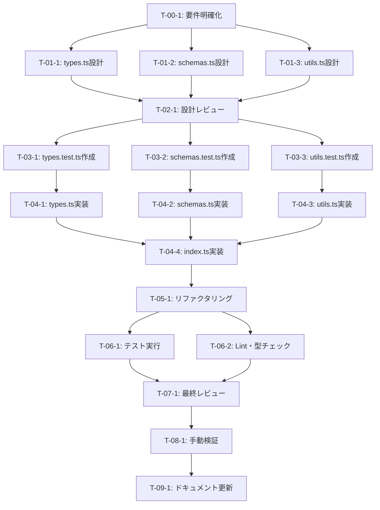

# CONV-03-04: エンティティ・関係スキーマ定義 - タスク実行仕様書

## ユーザーからの元の指示

```
@docs/30-workflows/unassigned-task/task-03-04-entity-relation-schemas.md のタスクを実行する
```

## メタ情報

| 項目         | 内容                                |
| ------------ | ----------------------------------- |
| タスクID     | CONV-03-04                          |
| タスク名     | エンティティ・関係スキーマ定義      |
| 分類         | 要件（型定義・スキーマ定義）        |
| 対象機能     | RAG Knowledge Graph                 |
| 優先度       | 中                                  |
| 見積もり規模 | 小規模                              |
| ステータス   | 未実施                              |
| 発見元       | 要件定義（CONV-03シリーズ）         |
| 発見日       | 2025-12-18                          |
| 依存タスク   | CONV-03-01（RAG基本型・共通IF定義） |

---

## タスク概要

### 目的

Knowledge Graph構築に必要なエンティティ（Entity）、関係（Relation）、コミュニティ（Community）の型定義とZodスキーマを作成し、CONV-08（Knowledge Graph構築）の基盤を確立する。

### 背景

Knowledge Graphは文書から抽出したエンティティとその関係を構造化して保存するシステム。これにより、単なるベクトル検索以上の意味的なナビゲーションや推論が可能になる。本タスクでは、そのグラフ構造を表現するための型とスキーマを定義する。

### 最終ゴール

- `packages/shared/src/types/rag/graph/` 配下に以下のファイルを作成
  - `types.ts`: TypeScript型定義
  - `schemas.ts`: Zodスキーマ定義
  - `utils.ts`: ユーティリティ関数
  - `index.ts`: バレルエクスポート
- 単体テストがすべて成功
- Lint・型チェッククリア

### 成果物一覧

| 種別         | 成果物                                                               | 配置先                                           |
| ------------ | -------------------------------------------------------------------- | ------------------------------------------------ |
| 機能         | types.ts, schemas.ts, utils.ts, index.ts                             | `packages/shared/src/types/rag/graph/`           |
| テスト       | types.test.ts, schemas.test.ts, utils.test.ts                        | `packages/shared/src/types/rag/graph/__tests__/` |
| ドキュメント | 更新された 05-architecture.md, 06-core-interfaces.md（必要に応じて） | `docs/00-requirements/`                          |

---

## 参照ファイル

本仕様書のコマンド・エージェント・スキル選定は以下を参照：

- `docs/00-requirements/master_system_design.md` - システム要件
- `.claude/commands/ai/command_list.md` - /ai:コマンド定義
- `.claude/agents/agent_list.md` - エージェント定義
- `.claude/skills/skill_list.md` - スキル定義

---

## タスク分解サマリー

| ID     | フェーズ                    | サブタスク名                         | 責務                                    | 依存       |
| ------ | --------------------------- | ------------------------------------ | --------------------------------------- | ---------- |
| T-00-1 | Phase 0: 要件定義           | エンティティ・関係モデル要件の明確化 | Knowledge Graphの構造要件を明文化       | -          |
| T-01-1 | Phase 1: 設計               | 型定義設計（types.ts）               | EntityEntity, RelationEntity等の型設計  | T-00-1     |
| T-01-2 | Phase 1: 設計               | Zodスキーマ設計（schemas.ts）        | Zodバリデーションスキーマ設計           | T-00-1     |
| T-01-3 | Phase 1: 設計               | ユーティリティ関数設計（utils.ts）   | 正規化・計算ロジック設計                | T-00-1     |
| T-02-1 | Phase 2: 設計レビューゲート | 設計レビュー実施                     | 型設計・DDD原則・データ整合性レビュー   | T-01-\*    |
| T-03-1 | Phase 3: テスト作成         | types.test.ts作成（Red）             | 型定義のテストケース作成                | T-02-1     |
| T-03-2 | Phase 3: テスト作成         | schemas.test.ts作成（Red）           | Zodスキーマのバリデーションテスト作成   | T-02-1     |
| T-03-3 | Phase 3: テスト作成         | utils.test.ts作成（Red）             | ユーティリティ関数のテスト作成          | T-02-1     |
| T-04-1 | Phase 4: 実装               | types.ts実装（Green）                | TypeScript型定義実装                    | T-03-\*    |
| T-04-2 | Phase 4: 実装               | schemas.ts実装（Green）              | Zodスキーマ実装                         | T-03-\*    |
| T-04-3 | Phase 4: 実装               | utils.ts実装（Green）                | ユーティリティ関数実装                  | T-03-\*    |
| T-04-4 | Phase 4: 実装               | index.ts実装（バレルエクスポート）   | バレルエクスポート作成                  | T-04-1,2,3 |
| T-05-1 | Phase 5: リファクタリング   | コード品質向上                       | 重複排除、命名改善、コメント整理        | T-04-\*    |
| T-06-1 | Phase 6: 品質保証           | 全テスト実行                         | ユニットテスト全成功確認                | T-05-1     |
| T-06-2 | Phase 6: 品質保証           | Lint・型チェック実行                 | ESLint・TypeScriptエラーゼロ確認        | T-05-1     |
| T-07-1 | Phase 7: 最終レビューゲート | 最終レビュー実施                     | コード品質・型安全性・DDD準拠確認       | T-06-\*    |
| T-08-1 | Phase 8: 手動テスト検証     | 型・スキーマの手動検証               | VSCodeでの型推論、Zodバリデーション確認 | T-07-1     |
| T-09-1 | Phase 9: ドキュメント更新   | システムドキュメント更新             | 05-architecture.md等に型定義を反映      | T-08-1     |

**総サブタスク数**: 18個

---

## 実行フロー図



---

## Phase 0: 要件定義

### T-00-1: エンティティ・関係モデル要件の明確化

#### 目的

Knowledge Graphで扱うエンティティ、関係、コミュニティの構造要件を詳細に定義し、設計の基礎を確立する。

#### 背景

Knowledge Graphは文書からエンティティを抽出し、それらの関係を構造化して保存する。GraphRAGアーキテクチャに基づき、エンティティの重要度スコア、関係の証拠（出典チャンク）、コミュニティ検出（Leidenアルゴリズム）を考慮する必要がある。

#### 責務（単一責務）

Knowledge Graphのデータ構造要件を明文化する。

#### Claude Code スラッシュコマンド

> ⚠️ 以下はターミナルコマンドではなく、Claude Code内で実行するスラッシュコマンドです

```
/ai:write-spec entity-relation-model
```

- **参照**: `.claude/commands/ai/command_list.md`

#### 使用エージェント

- **エージェント**: .claude/agents/req-analyst.md
- **選定理由**: 要件を検証可能な形式に落とし込む専門家。曖昧な要求を明確な仕様に変換する能力が本タスクに最適。
- **参照**: `.claude/agents/agent_list.md`

#### 活用スキル

| スキル名                                   | 活用方法                                               |
| ------------------------------------------ | ------------------------------------------------------ |
| **.claude/skills/requirements-engineering/SKILL.md**               | MoSCoW優先度付け、トリアージフレームワーク             |
| **.claude/skills/functional-non-functional-requirements/SKILL.md** | 機能要件（型定義）と非機能要件（パフォーマンス）の分類 |
| **.claude/skills/requirements-verification/SKILL.md**              | 要件の一貫性・完全性・検証可能性の評価                 |

- **参照**: `.claude/skills/skill_list.md`

#### 成果物

| 成果物                             | パス                                                                    | 内容                                               |
| ---------------------------------- | ----------------------------------------------------------------------- | -------------------------------------------------- |
| エンティティ・関係モデル要件仕様書 | `docs/30-workflows/rag-knowledge-graph/task-step1-requirements-spec.md` | エンティティ型、関係型、コミュニティ構造の詳細要件 |

#### 完了条件

- [ ] エンティティの種類（PERSON, ORGANIZATION, TECHNOLOGY等）が列挙されている
- [ ] 関係の種類（RELATED_TO, USES, IMPLEMENTS等）が列挙されている
- [ ] エンティティの属性（name, type, importance, embedding等）が定義されている
- [ ] 関係の属性（sourceId, targetId, weight, evidence等）が定義されている
- [ ] コミュニティ構造（階層レベル、メンバー、サマリー）が定義されている
- [ ] 受け入れ基準が具体的かつ検証可能である

#### 依存関係

- **前提**: なし
- **後続**: T-01-1, T-01-2, T-01-3

---

## Phase 1: 設計

### T-01-1: 型定義設計（types.ts）

#### 目的

TypeScript型定義（EntityEntity, RelationEntity, CommunityEntity等）を設計し、Knowledge Graphの構造を型レベルで表現する。

#### 背景

型定義はスキーマ実装の基盤となる。CONV-03-01で定義した共通インターフェース（Timestamped, WithMetadata）を継承し、一貫性のある設計を実現する。

#### 責務（単一責務）

TypeScript型定義の設計。

#### Claude Code スラッシュコマンド

> ⚠️ 以下はターミナルコマンドではなく、Claude Code内で実行するスラッシュコマンドです

```
/ai:design-domain-model graph-entity
```

- **参照**: `.claude/commands/ai/command_list.md`

#### 使用エージェント

- **エージェント**: .claude/agents/domain-modeler.md
- **選定理由**: DDD原則に基づくエンティティ設計の専門家。Knowledge GraphのエンティティをValue Object・Entity・Aggregateとして適切に設計できる。
- **参照**: `.claude/agents/agent_list.md`

#### 活用スキル

| スキル名                  | 活用方法                                    |
| ------------------------- | ------------------------------------------- |
| **.claude/skills/domain-driven-design/SKILL.md**  | Entity, Value Object, Aggregateの適切な分類 |
| **.claude/skills/value-object-patterns/SKILL.md** | 不変性、型安全性、ビジネスルールカプセル化  |
| **.claude/skills/type-safety-patterns/SKILL.md**  | TypeScript厳格モード、型ガード、Union型     |

- **参照**: `.claude/skills/skill_list.md`

#### 成果物

| 成果物       | パス                                                               | 内容                                                    |
| ------------ | ------------------------------------------------------------------ | ------------------------------------------------------- |
| 型定義設計書 | `docs/30-workflows/rag-knowledge-graph/task-step2-types-design.md` | types.ts の詳細設計（型一覧、継承関係、ユビキタス言語） |

#### 完了条件

- [ ] EntityEntity, RelationEntity, CommunityEntity型が設計されている
- [ ] EntityType, RelationType列挙型が設計されている
- [ ] ChunkEntityRelation, EntityMention型が設計されている
- [ ] Timestamped, WithMetadataインターフェースを継承している
- [ ] Float32Array型を適切に使用している（embedding用）
- [ ] readonly修飾子を適切に使用している

#### 依存関係

- **前提**: T-00-1
- **後続**: T-02-1

---

### T-01-2: Zodスキーマ設計（schemas.ts）

#### 目的

Zodスキーマ（entityEntitySchema, relationEntitySchema等）を設計し、ランタイムバリデーションとTypeScript型推論を両立させる。

#### 背景

Zodスキーマは、外部入力の検証、データベース読み書き時のバリデーション、API入出力の型安全性を保証する。types.tsと完全に一致する必要がある。

#### 責務（単一責務）

Zodスキーマ定義の設計。

#### Claude Code スラッシュコマンド

> ⚠️ 以下はターミナルコマンドではなく、Claude Code内で実行するスラッシュコマンドです

```
/ai:create-schema entity-relation
```

- **参照**: `.claude/commands/ai/command_list.md`

#### 使用エージェント

- **エージェント**: .claude/agents/schema-def.md
- **選定理由**: Zodスキーマ定義とバリデーション設計の専門家。型安全性と入力検証を両立させる能力が本タスクに最適。
- **参照**: `.claude/agents/agent_list.md`

#### 活用スキル

| スキル名                 | 活用方法                                 |
| ------------------------ | ---------------------------------------- |
| **.claude/skills/zod-validation/SKILL.md**       | Zodスキーマ定義、カスタムバリデーション  |
| **.claude/skills/type-safety-patterns/SKILL.md** | TypeScript型推論、Discriminated Unions   |
| **.claude/skills/input-sanitization/SKILL.md**   | データサニタイゼーション、エスケープ処理 |

- **参照**: `.claude/skills/skill_list.md`

#### 成果物

| 成果物            | パス                                                                 | 内容                                                        |
| ----------------- | -------------------------------------------------------------------- | ----------------------------------------------------------- |
| Zodスキーマ設計書 | `docs/30-workflows/rag-knowledge-graph/task-step3-schemas-design.md` | schemas.ts の詳細設計（スキーマ一覧、バリデーションルール） |

#### 完了条件

- [ ] entityEntitySchema, relationEntitySchema, communityEntitySchema が設計されている
- [ ] entityTypeSchema, relationTypeSchema（z.enum）が設計されている
- [ ] entityMentionSchema, relationEvidenceSchema が設計されている
- [ ] timestampedSchema, metadataSchemaをマージしている
- [ ] バリデーション制約（min, max, regex等）が適切に定義されている
- [ ] カスタムバリデーション（例: embedding配列の次元数チェック）が設計されている

#### 依存関係

- **前提**: T-00-1
- **後続**: T-02-1

---

### T-01-3: ユーティリティ関数設計（utils.ts）

#### 目的

エンティティ名の正規化、逆関係取得、重要度計算、グラフ密度計算等のユーティリティ関数を設計する。

#### 背景

Knowledge Graph処理には、エンティティ名の統一化（正規化）、関係の双方向処理、重要度スコアリング等のロジックが必要。これらを再利用可能な関数として提供する。

#### 責務（単一責務）

ユーティリティ関数の設計。

#### Claude Code スラッシュコマンド

> ⚠️ 以下はターミナルコマンドではなく、Claude Code内で実行するスラッシュコマンドです

```
/ai:write-spec graph-utils
```

- **参照**: `.claude/commands/ai/command_list.md`

#### 使用エージェント

- **エージェント**: .claude/agents/logic-dev.md
- **選定理由**: ビジネスロジック実装の専門家。複雑な計算ロジックを可読性・保守性の高い形で設計できる。
- **参照**: `.claude/agents/agent_list.md`

#### 活用スキル

| スキル名                 | 活用方法                             |
| ------------------------ | ------------------------------------ |
| **.claude/skills/clean-code-practices/SKILL.md** | 意味のある命名、小さな関数、DRY原則  |
| **.claude/skills/test-doubles/SKILL.md**         | ユーティリティ関数のテスト容易性設計 |

- **参照**: `.claude/skills/skill_list.md`

#### 成果物

| 成果物                   | パス                                                               | 内容                                                  |
| ------------------------ | ------------------------------------------------------------------ | ----------------------------------------------------- |
| ユーティリティ関数設計書 | `docs/30-workflows/rag-knowledge-graph/task-step4-utils-design.md` | utils.ts の詳細設計（関数一覧、アルゴリズム、計算式） |

#### 完了条件

- [ ] normalizeEntityName関数が設計されている
- [ ] getInverseRelationType関数が設計されている
- [ ] calculateEntityImportance関数が設計されている（PageRankアルゴリズム）
- [ ] generateCommunityName関数が設計されている
- [ ] getEntityTypeCategory関数が設計されている
- [ ] calculateGraphDensity関数が設計されている
- [ ] 各関数の入出力が明確に定義されている

#### 依存関係

- **前提**: T-00-1
- **後続**: T-02-1

---

## Phase 2: 設計レビューゲート

### T-02-1: 設計レビュー実施

#### 目的

型定義、Zodスキーマ、ユーティリティ関数の設計が要件を満たし、DDD原則・クリーンアーキテクチャに準拠していることを検証する。

#### 背景

設計ミスが実装後に発見されると修正コストが大幅に増加する。「Shift Left」原則に基づき、問題を可能な限り早期に検出する。

#### レビュー参加エージェント

| エージェント    | レビュー観点         | 選定理由                                                 |
| --------------- | -------------------- | -------------------------------------------------------- |
| .claude/agents/arch-police.md    | アーキテクチャ整合性 | 依存関係逆転の原則（DIP）、レイヤー違反の検出            |
| .claude/agents/domain-modeler.md | ドメインモデル妥当性 | エンティティ・値オブジェクトの境界、ユビキタス言語の適用 |
| .claude/agents/schema-def.md     | スキーマ設計品質     | Zodバリデーションの網羅性、型推論の正確性                |

- **参照**: `.claude/agents/agent_list.md`

#### レビューチェックリスト

**アーキテクチャ整合性** (.claude/agents/arch-police.md)

- [ ] 依存関係が内向き（types.ts → schemas.ts → utils.ts）になっているか
- [ ] CONV-03-01の共通インターフェースを適切に継承しているか
- [ ] 循環依存が発生していないか

**ドメインモデル妥当性** (.claude/agents/domain-modeler.md)

- [ ] EntityEntity, RelationEntity, CommunityEntityの境界が適切か
- [ ] ユビキタス言語（Entity, Relation, Community）が一貫して使用されているか
- [ ] 値オブジェクト（EntityType, RelationType）が適切に定義されているか

**スキーマ設計品質** (.claude/agents/schema-def.md)

- [ ] Zodスキーマがtypes.tsの型定義と完全に一致しているか
- [ ] バリデーションルール（min, max, regex）が適切に設定されているか
- [ ] カスタムバリデーションが必要な箇所（embedding次元数等）が実装されているか

#### レビュー結果

- **判定**: 未実施
- **指摘事項**: 未実施
- **対応方針**: 未実施

#### 戻り先決定（MAJORの場合）

| 問題の種類           | 戻り先            |
| -------------------- | ----------------- |
| 要件の問題           | Phase 0（T-00-1） |
| 型設計の問題         | Phase 1（T-01-1） |
| スキーマの問題       | Phase 1（T-01-2） |
| ユーティリティの問題 | Phase 1（T-01-3） |

#### 完了条件

- [ ] 全レビュー観点でPASSまたはMINOR判定
- [ ] MINOR指摘事項が対応済み
- [ ] レビュー結果が記録されている

#### 依存関係

- **前提**: T-01-1, T-01-2, T-01-3
- **後続**: T-03-1, T-03-2, T-03-3

---

## Phase 3: テスト作成 (TDD: Red)

### T-03-1: types.test.ts作成（Red）

#### 目的

型定義のテストケースを作成し、型の正確性を検証する。テストが失敗する（Red）状態を確認する。

#### 背景

TypeScriptの型システムは静的検査だが、ランタイムの動作も検証する必要がある。特にFloat32Array、readonly修飾子、Union型の挙動を確認する。

#### 責務（単一責務）

型定義のテストケース作成。

#### Claude Code スラッシュコマンド

> ⚠️ 以下はターミナルコマンドではなく、Claude Code内で実行するスラッシュコマンドです

```
/ai:generate-unit-tests packages/shared/src/types/rag/graph/types.ts
```

- **参照**: `.claude/commands/ai/command_list.md`

#### 使用エージェント

- **エージェント**: .claude/agents/unit-tester.md
- **選定理由**: TDD原則に基づくユニットテスト作成の専門家。境界値分析・等価分割を適用したテストケース設計が可能。
- **参照**: `.claude/agents/agent_list.md`

#### 活用スキル

| スキル名                    | 活用方法                                     |
| --------------------------- | -------------------------------------------- |
| **.claude/skills/tdd-principles/SKILL.md**          | Red-Green-Refactorサイクル、テストファースト |
| **.claude/skills/boundary-value-analysis/SKILL.md** | 境界値テスト（importance: 0, 0.5, 1等）      |
| **.claude/skills/vitest-advanced/SKILL.md**         | テスト構造、型アサーション、非同期テスト     |

- **参照**: `.claude/skills/skill_list.md`

#### 成果物

| 成果物         | パス                                                          | 内容                 |
| -------------- | ------------------------------------------------------------- | -------------------- |
| ユニットテスト | `packages/shared/src/types/rag/graph/__tests__/types.test.ts` | 型定義のテストケース |

#### TDD検証: Red状態確認

```bash
pnpm --filter @repo/shared test:run types.test.ts
```

- [ ] テストが失敗することを確認（Red状態）

#### 完了条件

- [ ] EntityEntity型のテストケースが作成されている
- [ ] RelationEntity型のテストケースが作成されている
- [ ] CommunityEntity型のテストケースが作成されている
- [ ] Union型（EntityType, RelationType）のテストケースが作成されている
- [ ] Float32Array型のテストケースが作成されている
- [ ] テストが失敗する（Red状態）ことを確認している

#### 依存関係

- **前提**: T-02-1
- **後続**: T-04-1

---

### T-03-2: schemas.test.ts作成（Red）

#### 目的

Zodスキーマのバリデーションテストを作成し、正常系・異常系のパターンを網羅する。テストが失敗する（Red）状態を確認する。

#### 背景

Zodスキーマは外部入力の検証に使用されるため、正常系だけでなく異常系（不正な型、範囲外の値、必須項目欠落等）のテストが重要。

#### 責務（単一責務）

Zodスキーマのバリデーションテスト作成。

#### Claude Code スラッシュコマンド

> ⚠️ 以下はターミナルコマンドではなく、Claude Code内で実行するスラッシュコマンドです

```
/ai:generate-unit-tests packages/shared/src/types/rag/graph/schemas.ts
```

- **参照**: `.claude/commands/ai/command_list.md`

#### 使用エージェント

- **エージェント**: .claude/agents/unit-tester.md
- **選定理由**: Zodバリデーションの正常系・異常系を網羅的にテストする能力。
- **参照**: `.claude/agents/agent_list.md`

#### 活用スキル

| スキル名                    | 活用方法                            |
| --------------------------- | ----------------------------------- |
| **.claude/skills/tdd-principles/SKILL.md**          | Red-Green-Refactorサイクル          |
| **.claude/skills/boundary-value-analysis/SKILL.md** | 境界値テスト（min, max, 範囲外）    |
| **.claude/skills/vitest-advanced/SKILL.md**         | Zodバリデーション結果のアサーション |

- **参照**: `.claude/skills/skill_list.md`

#### 成果物

| 成果物         | パス                                                            | 内容                                    |
| -------------- | --------------------------------------------------------------- | --------------------------------------- |
| ユニットテスト | `packages/shared/src/types/rag/graph/__tests__/schemas.test.ts` | Zodスキーマのバリデーションテストケース |

#### TDD検証: Red状態確認

```bash
pnpm --filter @repo/shared test:run schemas.test.ts
```

- [ ] テストが失敗することを確認（Red状態）

#### 完了条件

- [ ] entityEntitySchemaの正常系・異常系テストが作成されている
- [ ] relationEntitySchemaの正常系・異常系テストが作成されている
- [ ] communityEntitySchemaの正常系・異常系テストが作成されている
- [ ] z.enumスキーマ（entityTypeSchema, relationTypeSchema）のテストが作成されている
- [ ] カスタムバリデーションのテストが作成されている
- [ ] テストが失敗する（Red状態）ことを確認している

#### 依存関係

- **前提**: T-02-1
- **後続**: T-04-2

---

### T-03-3: utils.test.ts作成（Red）

#### 目的

ユーティリティ関数のテストケースを作成し、計算ロジック・文字列処理の正確性を検証する。テストが失敗する（Red）状態を確認する。

#### 背景

ユーティリティ関数は純粋関数として設計されるため、入力→出力のパターンテストが有効。特に境界値（空文字列、0、負数等）の挙動を確認する。

#### 責務（単一責務）

ユーティリティ関数のテストケース作成。

#### Claude Code スラッシュコマンド

> ⚠️ 以下はターミナルコマンドではなく、Claude Code内で実行するスラッシュコマンドです

```
/ai:generate-unit-tests packages/shared/src/types/rag/graph/utils.ts
```

- **参照**: `.claude/commands/ai/command_list.md`

#### 使用エージェント

- **エージェント**: .claude/agents/unit-tester.md
- **選定理由**: 純粋関数のテストケース設計の専門家。境界値分析を適用したテストパターン作成が可能。
- **参照**: `.claude/agents/agent_list.md`

#### 活用スキル

| スキル名                    | 活用方法                                             |
| --------------------------- | ---------------------------------------------------- |
| **.claude/skills/tdd-principles/SKILL.md**          | Red-Green-Refactorサイクル                           |
| **.claude/skills/boundary-value-analysis/SKILL.md** | 境界値テスト（空配列、0、負数、null等）              |
| **.claude/skills/test-doubles/SKILL.md**            | モックデータの作成（EntityEntity, RelationEntity等） |

- **参照**: `.claude/skills/skill_list.md`

#### 成果物

| 成果物         | パス                                                          | 内容                             |
| -------------- | ------------------------------------------------------------- | -------------------------------- |
| ユニットテスト | `packages/shared/src/types/rag/graph/__tests__/utils.test.ts` | ユーティリティ関数のテストケース |

#### TDD検証: Red状態確認

```bash
pnpm --filter @repo/shared test:run utils.test.ts
```

- [ ] テストが失敗することを確認（Red状態）

#### 完了条件

- [ ] normalizeEntityName関数のテストが作成されている
- [ ] getInverseRelationType関数のテストが作成されている
- [ ] calculateEntityImportance関数のテストが作成されている
- [ ] generateCommunityName関数のテストが作成されている
- [ ] calculateGraphDensity関数のテストが作成されている
- [ ] 境界値・異常系テストが含まれている
- [ ] テストが失敗する（Red状態）ことを確認している

#### 依存関係

- **前提**: T-02-1
- **後続**: T-04-3

---

## Phase 4: 実装 (TDD: Green)

### T-04-1: types.ts実装（Green）

#### 目的

TypeScript型定義を実装し、テストが成功する（Green）状態にする。

#### 背景

T-01-1の設計書、T-03-1のテストケースに基づいて、types.tsを実装する。

#### 責務（単一責務）

TypeScript型定義の実装。

#### Claude Code スラッシュコマンド

> ⚠️ 以下はターミナルコマンドではなく、Claude Code内で実行するスラッシュコマンドです

```
/ai:implement-business-logic entity-types
```

- **参照**: `.claude/commands/ai/command_list.md`

#### 使用エージェント

- **エージェント**: .claude/agents/domain-modeler.md
- **選定理由**: DDD原則に基づくエンティティ実装の専門家。設計書に忠実な実装が可能。
- **参照**: `.claude/agents/agent_list.md`

#### 活用スキル

| スキル名                  | 活用方法                                |
| ------------------------- | --------------------------------------- |
| **.claude/skills/domain-driven-design/SKILL.md**  | Entity, Value Object実装                |
| **.claude/skills/type-safety-patterns/SKILL.md**  | TypeScript厳格モード、readonly、Union型 |
| **.claude/skills/value-object-patterns/SKILL.md** | 不変性の保証                            |

- **参照**: `.claude/skills/skill_list.md`

#### 成果物

| 成果物     | パス                                           | 内容                   |
| ---------- | ---------------------------------------------- | ---------------------- |
| 型定義実装 | `packages/shared/src/types/rag/graph/types.ts` | TypeScript型定義の実装 |

#### TDD検証: Green状態確認

```bash
pnpm --filter @repo/shared test:run types.test.ts
```

- [ ] テストが成功することを確認（Green状態）

#### 完了条件

- [ ] EntityEntity, RelationEntity, CommunityEntity型が実装されている
- [ ] EntityTypes, RelationTypes列挙型が実装されている
- [ ] ChunkEntityRelation, EntityMention型が実装されている
- [ ] GraphStatistics型が実装されている
- [ ] readonly修飾子が適切に使用されている
- [ ] 全テストが成功している

#### 依存関係

- **前提**: T-03-1
- **後続**: T-04-4

---

### T-04-2: schemas.ts実装（Green）

#### 目的

Zodスキーマを実装し、テストが成功する（Green）状態にする。

#### 背景

T-01-2の設計書、T-03-2のテストケースに基づいて、schemas.tsを実装する。

#### 責務（単一責務）

Zodスキーマの実装。

#### Claude Code スラッシュコマンド

> ⚠️ 以下はターミナルコマンドではなく、Claude Code内で実行するスラッシュコマンドです

```
/ai:create-schema entity-relation
```

- **参照**: `.claude/commands/ai/command_list.md`

#### 使用エージェント

- **エージェント**: .claude/agents/schema-def.md
- **選定理由**: Zodスキーマ実装の専門家。バリデーションルールを正確に実装する能力。
- **参照**: `.claude/agents/agent_list.md`

#### 活用スキル

| スキル名                 | 活用方法                                |
| ------------------------ | --------------------------------------- |
| **.claude/skills/zod-validation/SKILL.md**       | Zodスキーマ定義、カスタムバリデーション |
| **.claude/skills/type-safety-patterns/SKILL.md** | TypeScript型推論                        |
| **.claude/skills/input-sanitization/SKILL.md**   | データサニタイゼーション                |

- **参照**: `.claude/skills/skill_list.md`

#### 成果物

| 成果物          | パス                                             | 内容              |
| --------------- | ------------------------------------------------ | ----------------- |
| Zodスキーマ実装 | `packages/shared/src/types/rag/graph/schemas.ts` | Zodスキーマの実装 |

#### TDD検証: Green状態確認

```bash
pnpm --filter @repo/shared test:run schemas.test.ts
```

- [ ] テストが成功することを確認（Green状態）

#### 完了条件

- [ ] entityEntitySchema, relationEntitySchema, communityEntitySchema が実装されている
- [ ] entityTypeSchema, relationTypeSchema（z.enum）が実装されている
- [ ] entityMentionSchema, relationEvidenceSchema が実装されている
- [ ] timestampedSchema, metadataSchemaをマージしている
- [ ] バリデーション制約（min, max, regex）が実装されている
- [ ] 全テストが成功している

#### 依存関係

- **前提**: T-03-2
- **後続**: T-04-4

---

### T-04-3: utils.ts実装（Green）

#### 目的

ユーティリティ関数を実装し、テストが成功する（Green）状態にする。

#### 背景

T-01-3の設計書、T-03-3のテストケースに基づいて、utils.tsを実装する。

#### 責務（単一責務）

ユーティリティ関数の実装。

#### Claude Code スラッシュコマンド

> ⚠️ 以下はターミナルコマンドではなく、Claude Code内で実行するスラッシュコマンドです

```
/ai:implement-business-logic graph-utils
```

- **参照**: `.claude/commands/ai/command_list.md`

#### 使用エージェント

- **エージェント**: .claude/agents/logic-dev.md
- **選定理由**: ビジネスロジック実装の専門家。複雑な計算ロジックを可読性高く実装できる。
- **参照**: `.claude/agents/agent_list.md`

#### 活用スキル

| スキル名                   | 活用方法                                |
| -------------------------- | --------------------------------------- |
| **.claude/skills/clean-code-practices/SKILL.md**   | 意味のある命名、小さな関数、DRY原則     |
| **.claude/skills/refactoring-techniques/SKILL.md** | Extract Method、Replace Temp with Query |

- **参照**: `.claude/skills/skill_list.md`

#### 成果物

| 成果物                 | パス                                           | 内容                     |
| ---------------------- | ---------------------------------------------- | ------------------------ |
| ユーティリティ関数実装 | `packages/shared/src/types/rag/graph/utils.ts` | ユーティリティ関数の実装 |

#### TDD検証: Green状態確認

```bash
pnpm --filter @repo/shared test:run utils.test.ts
```

- [ ] テストが成功することを確認（Green状態）

#### 完了条件

- [ ] normalizeEntityName関数が実装されている
- [ ] getInverseRelationType関数が実装されている
- [ ] calculateEntityImportance関数が実装されている
- [ ] generateCommunityName関数が実装されている
- [ ] getEntityTypeCategory関数が実装されている
- [ ] calculateGraphDensity関数が実装されている
- [ ] 全テストが成功している

#### 依存関係

- **前提**: T-03-3
- **後続**: T-04-4

---

### T-04-4: index.ts実装（バレルエクスポート）

#### 目的

バレルエクスポートファイル（index.ts）を作成し、外部からの利用を簡潔にする。

#### 背景

`packages/shared/src/types/rag/graph/index.ts` から types.ts, schemas.ts, utils.ts を一括エクスポートし、`import { EntityEntity } from '@repo/shared/types/rag/graph'` の形式で利用可能にする。

#### 責務（単一責務）

バレルエクスポートの実装。

#### Claude Code スラッシュコマンド

> ⚠️ 以下はターミナルコマンドではなく、Claude Code内で実行するスラッシュコマンドです

```
（直接実装：スラッシュコマンド不使用）
```

- **参照**: `.claude/commands/ai/command_list.md`

#### 使用エージェント

- **エージェント**: .claude/agents/logic-dev.md
- **選定理由**: シンプルなエクスポート処理の実装。
- **参照**: `.claude/agents/agent_list.md`

#### 活用スキル

| スキル名                 | 活用方法                   |
| ------------------------ | -------------------------- |
| **.claude/skills/clean-code-practices/SKILL.md** | シンプルなエクスポート構造 |

- **参照**: `.claude/skills/skill_list.md`

#### 成果物

| 成果物             | パス                                           | 内容                    |
| ------------------ | ---------------------------------------------- | ----------------------- |
| バレルエクスポート | `packages/shared/src/types/rag/graph/index.ts` | export \* from ... 形式 |

#### TDD検証: Green状態確認

```bash
pnpm --filter @repo/shared test:run
```

- [ ] 全テストが成功することを確認（Green状態）

#### 完了条件

- [ ] types.ts, schemas.ts, utils.ts を export \* している
- [ ] 全テストが成功している

#### 依存関係

- **前提**: T-04-1, T-04-2, T-04-3
- **後続**: T-05-1

---

## Phase 5: リファクタリング (TDD: Refactor)

### T-05-1: コード品質向上

#### 目的

動作を変えずにコード品質を改善する。重複排除、命名改善、コメント整理を実施する。

#### 背景

実装が完了した時点で、コードの可読性・保守性を高めるリファクタリングを実施する。テストが継続して成功することを確認しながら進める。

#### 責務（単一責務）

コード品質の向上（動作は変えない）。

#### Claude Code スラッシュコマンド

> ⚠️ 以下はターミナルコマンドではなく、Claude Code内で実行するスラッシュコマンドです

```
/ai:refactor packages/shared/src/types/rag/graph/
```

- **参照**: `.claude/commands/ai/command_list.md`

#### 使用エージェント

- **エージェント**: .claude/agents/code-quality.md
- **選定理由**: コード品質管理の専門家。Clean Code原則・SOLID原則に基づくリファクタリングが可能。
- **参照**: `.claude/agents/agent_list.md`

#### 活用スキル

| スキル名                   | 活用方法                                |
| -------------------------- | --------------------------------------- |
| **.claude/skills/clean-code-practices/SKILL.md**   | 意味のある命名、小さな関数、DRY原則     |
| **.claude/skills/refactoring-techniques/SKILL.md** | Extract Method、Replace Temp with Query |
| **.claude/skills/eslint-configuration/SKILL.md**   | ESLintルール適用、自動修正              |

- **参照**: `.claude/skills/skill_list.md`

#### 成果物

| 成果物                   | パス                                       | 内容               |
| ------------------------ | ------------------------------------------ | ------------------ |
| リファクタリング後コード | `packages/shared/src/types/rag/graph/*.ts` | 品質改善後のコード |

#### TDD検証: 継続Green確認

```bash
pnpm --filter @repo/shared test:run
```

- [ ] リファクタリング後もテストが成功することを確認

#### 完了条件

- [ ] 重複コードが排除されている
- [ ] 変数名・関数名が明確で意味がある
- [ ] JSDocコメントが必要箇所に追加されている
- [ ] マジックナンバーが定数化されている
- [ ] 全テストが継続して成功している

#### 依存関係

- **前提**: T-04-4
- **後続**: T-06-1, T-06-2

---

## Phase 6: 品質保証

### T-06-1: 全テスト実行

#### 目的

全ユニットテストを実行し、すべてのテストが成功することを確認する。

#### 背景

品質ゲートの第一関門。すべてのテストが成功していることが次フェーズへの必須条件。

#### 責務（単一責務）

全テストの実行と成功確認。

#### Claude Code スラッシュコマンド

> ⚠️ 以下はターミナルコマンドではなく、Claude Code内で実行するスラッシュコマンドです

```
/ai:run-all-tests --coverage
```

- **参照**: `.claude/commands/ai/command_list.md`

#### 使用エージェント

- **エージェント**: .claude/agents/unit-tester.md
- **選定理由**: テスト実行とカバレッジ分析の専門家。
- **参照**: `.claude/agents/agent_list.md`

#### 活用スキル

| スキル名            | 活用方法                             |
| ------------------- | ------------------------------------ |
| **.claude/skills/vitest-advanced/SKILL.md** | カバレッジレポート、テスト実行最適化 |

- **参照**: `.claude/skills/skill_list.md`

#### 成果物

| 成果物             | パス                        | 内容                     |
| ------------------ | --------------------------- | ------------------------ |
| カバレッジレポート | `packages/shared/coverage/` | テストカバレッジレポート |

#### 完了条件

- [ ] types.test.ts がすべて成功
- [ ] schemas.test.ts がすべて成功
- [ ] utils.test.ts がすべて成功
- [ ] カバレッジが80%以上
- [ ] カバレッジレポートが生成されている

#### 依存関係

- **前提**: T-05-1
- **後続**: T-07-1

---

### T-06-2: Lint・型チェック実行

#### 目的

ESLint、TypeScriptエラーがゼロであることを確認する。

#### 背景

品質ゲートの第二関門。静的解析ツールのエラーがゼロであることが必須条件。

#### 責務（単一責務）

Lint・型チェックの実行とエラーゼロ確認。

#### Claude Code スラッシュコマンド

> ⚠️ 以下はターミナルコマンドではなく、Claude Code内で実行するスラッシュコマンドです

```
/ai:lint --fix
```

- **参照**: `.claude/commands/ai/command_list.md`

#### 使用エージェント

- **エージェント**: .claude/agents/code-quality.md
- **選定理由**: Lint・型チェックの専門家。
- **参照**: `.claude/agents/agent_list.md`

#### 活用スキル

| スキル名                 | 活用方法                       |
| ------------------------ | ------------------------------ |
| **.claude/skills/eslint-configuration/SKILL.md** | ESLintルール適用、自動修正     |
| **.claude/skills/static-analysis/SKILL.md**      | 循環的複雑度、認知的複雑度評価 |

- **参照**: `.claude/skills/skill_list.md`

#### 成果物

| 成果物       | パス     | 内容           |
| ------------ | -------- | -------------- |
| Lintレポート | 標準出力 | ESLint実行結果 |

#### 完了条件

- [ ] ESLintエラーがゼロ
- [ ] TypeScriptエラーがゼロ
- [ ] 警告（Warning）がゼロまたは正当化されている

#### 依存関係

- **前提**: T-05-1
- **後続**: T-07-1

---

## 品質ゲートチェックリスト

### 機能検証

- [ ] 全ユニットテスト成功

### コード品質

- [ ] Lintエラーなし
- [ ] 型エラーなし
- [ ] コードフォーマット適用済み

### テスト網羅性

- [ ] カバレッジ80%以上達成

---

## Phase 7: 最終レビューゲート

### T-07-1: 最終レビュー実施

#### 目的

実装完了後、コード品質・型安全性・DDD準拠を最終確認する。

#### 背景

Phase 6の自動検証だけでは検出できない設計判断やベストプラクティス違反を人間的視点（エージェント視点）で確認する。

#### レビュー参加エージェント

| エージェント  | レビュー観点       | 選定理由                                   |
| ------------- | ------------------ | ------------------------------------------ |
| .claude/agents/code-quality.md | コード品質         | 可読性・保守性・Clean Code原則の確認       |
| .claude/agents/arch-police.md  | アーキテクチャ遵守 | 依存関係・レイヤー分離の確認               |
| .claude/agents/unit-tester.md  | テスト品質         | テストカバレッジ・テストケース適切性の確認 |

- **参照**: `.claude/agents/agent_list.md`

#### レビューチェックリスト

**コード品質** (.claude/agents/code-quality.md)

- [ ] コーディング規約への準拠
- [ ] 可読性・保守性の確保
- [ ] 適切なエラーハンドリング
- [ ] 過度な複雑性の有無

**アーキテクチャ遵守** (.claude/agents/arch-police.md)

- [ ] 実装が設計に従っているか
- [ ] 依存関係が適切か（内向き）
- [ ] SOLID原則への準拠

**テスト品質** (.claude/agents/unit-tester.md)

- [ ] テストカバレッジが80%以上
- [ ] テストケースが適切に設計されているか
- [ ] 境界値・異常系のテストがあるか

#### レビュー結果

- **判定**: 未実施
- **指摘事項**: 未実施
- **対応方針**: 未実施

#### 戻り先決定（MAJOR/CRITICALの場合）

| 問題の種類       | 戻り先             |
| ---------------- | ------------------ |
| 要件の問題       | Phase 0（T-00-1）  |
| 設計の問題       | Phase 1（T-01-\*） |
| テスト設計の問題 | Phase 3（T-03-\*） |
| 実装の問題       | Phase 4（T-04-\*） |
| コード品質の問題 | Phase 5（T-05-1）  |

#### エスカレーション条件

- 戻り先の判断が困難な場合
- 複数フェーズにまたがる問題の場合
- 要件自体の見直しが必要な場合

手順: ユーザーに問題を報告し、戻り先と対応方針を協議する

#### 完了条件

- [ ] 全レビュー観点でPASSまたはMINOR判定
- [ ] MINOR指摘事項が対応済み
- [ ] レビュー結果が記録されている

#### 依存関係

- **前提**: T-06-1, T-06-2
- **後続**: T-08-1

---

## Phase 8: 手動テスト検証

### T-08-1: 型・スキーマの手動検証

#### 目的

自動テストでは検証できないVSCodeでの型推論、Zodバリデーションの実際の動作を手動で確認する。

#### 背景

自動テストはロジックの正しさを検証するが、以下は手動確認が必要：

- VSCodeでの型補完・型推論の正確性
- Zodバリデーションのエラーメッセージの分かりやすさ
- Float32Array型の実際の挙動

#### テスト分類

機能テスト

#### 使用エージェント

- **エージェント**: .claude/agents/unit-tester.md
- **選定理由**: 型システムの動作確認の専門家。
- **参照**: `.claude/agents/agent_list.md`

#### 手動テストケース

| No  | カテゴリ          | テスト項目                      | 前提条件          | 操作手順                                                | 期待結果                                   | 実行結果 | 備考 |
| --- | ----------------- | ------------------------------- | ----------------- | ------------------------------------------------------- | ------------------------------------------ | -------- | ---- |
| 1   | 型推論            | EntityEntity型の自動補完確認    | VSCode起動        | EntityEntity型の変数を宣言し、プロパティにアクセス      | プロパティが自動補完される                 |          |      |
| 2   | 型推論            | Union型（EntityType）の推論確認 | VSCode起動        | EntityType型の変数に値を代入                            | 列挙値が自動補完される                     |          |      |
| 3   | Zodバリデーション | entityEntitySchemaの正常系確認  | スキーマ定義済み  | 正常なオブジェクトをparse()                             | バリデーション成功                         |          |      |
| 4   | Zodバリデーション | entityEntitySchemaの異常系確認  | スキーマ定義済み  | 不正なオブジェクト（importance > 1）をparse()           | バリデーションエラー、エラーメッセージ明確 |          |      |
| 5   | Float32Array      | Float32Array型の実際の動作確認  | embedding定義済み | Float32Array型の配列を作成し、embeddingプロパティに代入 | 型エラーなく代入可能                       |          |      |

#### テスト実行手順

1. VSCodeで `packages/shared/src/types/rag/graph/types.ts` を開く
2. テストケース1〜5を順次実行
3. 実行結果を記録

#### 成果物

| 成果物         | パス                                                                     | 内容                 |
| -------------- | ------------------------------------------------------------------------ | -------------------- |
| 手動テスト結果 | `docs/30-workflows/rag-knowledge-graph/task-step8-manual-test-result.md` | 手動テストの実行結果 |

#### 完了条件

- [ ] すべてのテストケースが実行済み
- [ ] すべてのテストケースがPASS
- [ ] 発見された不具合がゼロまたは未完了タスクとして記録済み

#### 依存関係

- **前提**: T-07-1
- **後続**: T-09-1

---

## Phase 9: ドキュメント更新・未完了タスク記録

### T-09-1: システムドキュメント更新

#### 目的

タスク完了後、実装した型定義・スキーマをシステム要件ドキュメントに反映する。

#### 前提条件

- [ ] Phase 6の品質ゲートをすべて通過
- [ ] Phase 7の最終レビューゲートを通過
- [ ] Phase 8の手動テストが完了
- [ ] すべてのテストが成功

---

#### サブタスク 9.1: システムドキュメント更新

##### 更新対象ドキュメント

- `docs/00-requirements/05-architecture.md` - Knowledge Graph型定義を追記
- `docs/00-requirements/06-core-interfaces.md` - EntityEntity, RelationEntity, CommunityEntity型を追記（必要に応じて）

##### Claude Code スラッシュコマンド

> ⚠️ 以下はターミナルコマンドではなく、Claude Code内で実行するスラッシュコマンドです

```
/ai:update-all-docs
```

- **参照**: `.claude/commands/ai/command_list.md`

##### 使用エージェント

- **エージェント**: .claude/agents/spec-writer.md
- **選定理由**: 仕様書作成・更新の専門家。Documentation as Code原則に基づく更新が可能。
- **参照**: `.claude/agents/agent_list.md`

##### 更新原則

- 概要のみ記載（詳細な実装説明は不要）
- システム構築に必要十分な情報のみ追記
- 既存ドキュメントの構造・フォーマットを維持
- Single Source of Truth原則を遵守（重複記載禁止）

---

#### サブタスク 9.2: 未完了タスク・追加タスク記録

##### 出力先

`docs/30-workflows/unassigned-task/`

##### 記録対象タスク一覧

現時点では未完了タスクなし（レビュー結果に応じて記録）

##### ファイル命名規則

- 要件系: `requirements-{{機能領域}}.md`
- 改善系: `task-{{改善領域}}-improvements.md`

##### Claude Code スラッシュコマンド

> ⚠️ 以下はターミナルコマンドではなく、Claude Code内で実行するスラッシュコマンドです

```
（該当する場合のみ）
```

- **参照**: `.claude/commands/ai/command_list.md`

##### 使用エージェント

（該当する場合のみ）

##### 活用スキル

（該当する場合のみ）

---

#### 完了条件

- [ ] 05-architecture.md にKnowledge Graph型定義が追記されている
- [ ] 06-core-interfaces.md に必要な型が追記されている（該当する場合のみ）
- [ ] 未完了タスクが記録されている（該当する場合のみ）

---

## リスクと対策

| リスク                           | 影響度 | 発生確率 | 対策                                               | 対応サブタスク |
| -------------------------------- | ------ | -------- | -------------------------------------------------- | -------------- |
| Float32Array型の扱いが複雑       | 中     | 中       | テストケースで境界値・型推論を確認                 | T-03-1         |
| Zodスキーマとtypes.tsの型不一致  | 高     | 中       | スキーマ定義時にtypes.tsを参照、テストで厳密に検証 | T-03-2         |
| PageRankアルゴリズムの実装複雑度 | 中     | 低       | 簡易実装（接続数ベース）から開始、将来的に本格実装 | T-04-3         |
| CONV-03-01の共通IF変更           | 高     | 低       | CONV-03-01の型定義を固定化してから本タスクを開始   | T-00-1         |

---

## 前提条件

- CONV-03-01（RAG基本型・共通インターフェース定義）が完了している
- `packages/shared/src/types/rag/` ディレクトリが存在する
- `packages/shared/src/types/rag/branded.ts`, `interfaces.ts`, `schemas.ts` が存在する

---

## 備考

### 技術的制約

- Float32Array型はTypeScript標準型だが、Zodでの扱いは `z.array(z.number())` として定義する
- readonly修飾子はTypeScriptの静的チェックのみ有効（ランタイムでは強制されない）
- PageRankアルゴリズムの完全実装は複雑なため、簡易版（接続数ベース）から開始する

### 参考資料

- [GraphRAG論文](https://arxiv.org/abs/2404.16130)
- [Leiden Community Detection Algorithm](https://www.nature.com/articles/s41598-019-41695-z)
- [Zod公式ドキュメント](https://zod.dev/)
- [TypeScript Handbook - Utility Types](https://www.typescriptlang.org/docs/handbook/utility-types.html)
