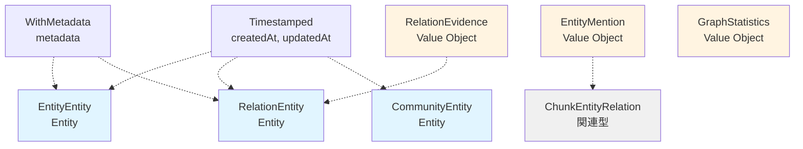

# 型定義設計書（types.ts）

**タスクID**: T-01-1 (CONV-03-04)
**フェーズ**: Phase 1 - 設計
**作成日**: 2025-12-18
**ステータス**: 完了

---

## 1. 目的

TypeScript型定義（EntityEntity, RelationEntity, CommunityEntity等）を設計し、Knowledge Graphの構造を型レベルで表現する。DDD原則に基づき、Entity、Value Object、Aggregateを適切に分類する。

---

## 2. DDDにおける分類

### 2.1 Entity（エンティティ）

**定義**: 同一性（Identity）を持つドメインオブジェクト。IDによって区別される。

| 型名              | 分類   | 理由                                                          |
| ----------------- | ------ | ------------------------------------------------------------- |
| `EntityEntity`    | Entity | IDを持ち、時間経過で属性が変化する（importance, embedding等） |
| `RelationEntity`  | Entity | IDを持ち、weight（関係の強さ）が変化しうる                    |
| `CommunityEntity` | Entity | IDを持ち、memberCountやsummaryが変化しうる                    |

### 2.2 Value Object（値オブジェクト）

**定義**: 同一性を持たず、属性の値のみで区別される不変オブジェクト。

| 型名               | 分類         | 理由                                        |
| ------------------ | ------------ | ------------------------------------------- |
| `EntityType`       | Value Object | 列挙型、不変、値のみで等価性判定            |
| `RelationType`     | Value Object | 列挙型、不変、値のみで等価性判定            |
| `EntityMention`    | Value Object | startChar, endChar, surfaceFormで一意、不変 |
| `RelationEvidence` | Value Object | chunkId, excerpt, confidenceで一意、不変    |
| `GraphStatistics`  | Value Object | 計算結果の集合、不変                        |

### 2.3 Aggregate（集約）

**定義**: 関連するEntityとValue Objectをまとめた境界。整合性の単位。

| Aggregate Root    | 含まれる要素                               |
| ----------------- | ------------------------------------------ |
| `EntityEntity`    | aliases（別名リスト）、metadata            |
| `RelationEntity`  | evidence（RelationEvidence配列）、metadata |
| `CommunityEntity` | memberEntityIds（メンバーIDリスト）        |

### 2.4 関連型（Association）

| 型名                  | 分類   | 理由                                                |
| --------------------- | ------ | --------------------------------------------------- |
| `ChunkEntityRelation` | 関連型 | ChunkとEntityEntityの多対多関連、中間テーブル的存在 |

---

## 3. 型定義一覧

### 3.1 列挙型（Enum）

#### EntityTypes（48種類）

```typescript
export const EntityTypes = {
  // 1. 人物・組織カテゴリ (4種類)
  PERSON: "person",
  ORGANIZATION: "organization",
  ROLE: "role",
  TEAM: "team",

  // 2. 場所・時間カテゴリ (3種類)
  LOCATION: "location",
  DATE: "date",
  EVENT: "event",

  // 3. ビジネス・経営カテゴリ (9種類)
  COMPANY: "company",
  PRODUCT: "product",
  SERVICE: "service",
  BRAND: "brand",
  STRATEGY: "strategy",
  METRIC: "metric",
  BUSINESS_PROCESS: "business_process",
  MARKET: "market",
  CUSTOMER: "customer",

  // 4. 技術全般カテゴリ (5種類)
  TECHNOLOGY: "technology",
  TOOL: "tool",
  METHOD: "method",
  STANDARD: "standard",
  PROTOCOL: "protocol",

  // 5. コード・ソフトウェアカテゴリ (7種類)
  PROGRAMMING_LANGUAGE: "programming_language",
  FRAMEWORK: "framework",
  LIBRARY: "library",
  API: "api",
  FUNCTION: "function",
  CLASS: "class",
  MODULE: "module",

  // 6. 抽象概念カテゴリ (5種類)
  CONCEPT: "concept",
  THEORY: "theory",
  PRINCIPLE: "principle",
  PATTERN: "pattern",
  MODEL: "model",

  // 7. ドキュメント構造カテゴリ (5種類)
  DOCUMENT: "document",
  CHAPTER: "chapter",
  SECTION: "section",
  PARAGRAPH: "paragraph",
  HEADING: "heading",

  // 8. ドキュメント要素カテゴリ (9種類)
  KEYWORD: "keyword",
  SUMMARY: "summary",
  FIGURE: "figure",
  TABLE: "table",
  LIST: "list",
  QUOTE: "quote",
  CODE_SNIPPET: "code_snippet",
  FORMULA: "formula",
  EXAMPLE: "example",

  // 9. メディアカテゴリ (4種類)
  IMAGE: "image",
  VIDEO: "video",
  AUDIO: "audio",
  DIAGRAM: "diagram",

  // 10. その他カテゴリ (1種類)
  OTHER: "other",
} as const;

export type EntityType = (typeof EntityTypes)[keyof typeof EntityTypes];
```

**設計ポイント**:

- `as const`でリテラル型として扱う（型安全性向上）
- 値はsnake_case（データベース、JSON出力での可読性）
- カテゴリごとにコメントで分類（保守性向上）

#### RelationTypes（23種類）

```typescript
export const RelationTypes = {
  // 汎用関係 (4種類)
  RELATED_TO: "related_to",
  PART_OF: "part_of",
  HAS_PART: "has_part",
  BELONGS_TO: "belongs_to",

  // 時間的関係 (3種類)
  PRECEDED_BY: "preceded_by",
  FOLLOWED_BY: "followed_by",
  CONCURRENT_WITH: "concurrent_with",

  // 技術的関係 (7種類)
  USES: "uses",
  USED_BY: "used_by",
  IMPLEMENTS: "implements",
  EXTENDS: "extends",
  DEPENDS_ON: "depends_on",
  CALLS: "calls",
  IMPORTS: "imports",

  // 階層関係 (2種類)
  PARENT_OF: "parent_of",
  CHILD_OF: "child_of",

  // 参照関係 (4種類)
  REFERENCES: "references",
  REFERENCED_BY: "referenced_by",
  DEFINES: "defines",
  DEFINED_BY: "defined_by",

  // 人物関係 (3種類)
  AUTHORED_BY: "authored_by",
  WORKS_FOR: "works_for",
  COLLABORATES_WITH: "collaborates_with",
} as const;

export type RelationType = (typeof RelationTypes)[keyof typeof RelationTypes];
```

### 3.2 Entity型

#### EntityEntity（エンティティエンティティ）

```typescript
export interface EntityEntity extends Timestamped, WithMetadata {
  readonly id: EntityId;
  readonly name: string;
  readonly normalizedName: string;
  readonly type: EntityType;
  readonly description: string | null;
  readonly aliases: readonly string[];
  readonly embedding: Float32Array | null;
  readonly importance: number;
}
```

**設計ポイント**:

- `Timestamped`継承 → createdAt, updatedAt自動付与
- `WithMetadata`継承 → metadata（任意のJSON）自動付与
- `readonly`修飾子 → 不変性保証（TypeScriptレベル）
- `Float32Array | null` → 埋め込みベクトルは後から生成される可能性
- `aliases: readonly string[]` → 配列自体も要素も変更不可

**属性詳細**:

| 属性名           | 型                        | 制約                         | 説明                                       |
| ---------------- | ------------------------- | ---------------------------- | ------------------------------------------ |
| `id`             | `EntityId`                | 必須、UUID形式               | エンティティの一意識別子                   |
| `name`           | `string`                  | 必須、1〜255文字             | エンティティ名                             |
| `normalizedName` | `string`                  | 必須、1〜255文字             | 正規化名（小文字、空白統一、特殊文字除去） |
| `type`           | `EntityType`              | 必須、48種類のいずれか       | エンティティタイプ                         |
| `description`    | `string \| null`          | 省略可、最大1000文字         | エンティティの説明                         |
| `aliases`        | `readonly string[]`       | 必須、空配列可、各1〜255文字 | 別名リスト                                 |
| `embedding`      | `Float32Array \| null`    | 省略可、次元数はAI APIに依存 | 埋め込みベクトル                           |
| `importance`     | `number`                  | 必須、0.0〜1.0               | 重要度スコア（PageRankベース）             |
| `metadata`       | `Record<string, unknown>` | 必須（WithMetadata継承）     | 任意のメタデータ                           |
| `createdAt`      | `Date`                    | 必須（Timestamped継承）      | 作成日時                                   |
| `updatedAt`      | `Date`                    | 必須（Timestamped継承）      | 更新日時                                   |

#### RelationEntity（関係エンティティ）

```typescript
export interface RelationEntity extends Timestamped, WithMetadata {
  readonly id: RelationId;
  readonly sourceId: EntityId;
  readonly targetId: EntityId;
  readonly type: RelationType;
  readonly description: string | null;
  readonly weight: number;
  readonly bidirectional: boolean;
  readonly evidence: readonly RelationEvidence[];
}
```

**設計ポイント**:

- `sourceId`, `targetId` → EntityIdのBranded Type使用（型安全性）
- `evidence: readonly RelationEvidence[]` → 証拠配列は不変
- `bidirectional` → 双方向関係の明示

**属性詳細**:

| 属性名          | 型                            | 制約                     | 説明                                     |
| --------------- | ----------------------------- | ------------------------ | ---------------------------------------- |
| `id`            | `RelationId`                  | 必須、UUID形式           | 関係の一意識別子                         |
| `sourceId`      | `EntityId`                    | 必須、存在するEntityId   | 関係の始点エンティティID                 |
| `targetId`      | `EntityId`                    | 必須、存在するEntityId   | 関係の終点エンティティID                 |
| `type`          | `RelationType`                | 必須、23種類のいずれか   | 関係タイプ                               |
| `description`   | `string \| null`              | 省略可、最大500文字      | 関係の説明                               |
| `weight`        | `number`                      | 必須、0.0〜1.0           | 関係の強さ（evidence数と信頼度から計算） |
| `bidirectional` | `boolean`                     | 必須                     | 双方向関係か                             |
| `evidence`      | `readonly RelationEvidence[]` | 必須、最低1件            | 関係の証拠（出典チャンク）リスト         |
| `metadata`      | `Record<string, unknown>`     | 必須（WithMetadata継承） | 任意のメタデータ                         |
| `createdAt`     | `Date`                        | 必須（Timestamped継承）  | 作成日時                                 |
| `updatedAt`     | `Date`                        | 必須（Timestamped継承）  | 更新日時                                 |

#### CommunityEntity（コミュニティエンティティ）

```typescript
export interface CommunityEntity extends Timestamped {
  readonly id: CommunityId;
  readonly level: number;
  readonly parentId: CommunityId | null;
  readonly name: string;
  readonly summary: string;
  readonly memberEntityIds: readonly EntityId[];
  readonly memberCount: number;
  readonly embedding: Float32Array | null;
}
```

**設計ポイント**:

- `WithMetadata`を**継承しない**（コミュニティは自動生成され、カスタムメタデータは不要）
- `parentId: CommunityId | null` → 階層構造を表現
- `memberEntityIds: readonly EntityId[]` → メンバーリストは不変

**属性詳細**:

| 属性名            | 型                     | 制約                                   | 説明                                     |
| ----------------- | ---------------------- | -------------------------------------- | ---------------------------------------- |
| `id`              | `CommunityId`          | 必須、UUID形式                         | コミュニティの一意識別子                 |
| `level`           | `number`               | 必須、非負整数                         | 階層レベル（0: 最下層）                  |
| `parentId`        | `CommunityId \| null`  | level > 0の場合必須、level = 0ならnull | 親コミュニティID                         |
| `name`            | `string`               | 必須、1〜255文字                       | コミュニティ名（自動生成または手動命名） |
| `summary`         | `string`               | 必須、最大2000文字                     | コミュニティサマリー（LLM生成）          |
| `memberEntityIds` | `readonly EntityId[]`  | 必須、最低1件                          | メンバーエンティティIDリスト             |
| `memberCount`     | `number`               | 必須、正の整数                         | メンバー数（memberEntityIds.length）     |
| `embedding`       | `Float32Array \| null` | 省略可                                 | コミュニティ埋め込み（メンバーの平均）   |
| `createdAt`       | `Date`                 | 必須（Timestamped継承）                | 作成日時                                 |
| `updatedAt`       | `Date`                 | 必須（Timestamped継承）                | 更新日時                                 |

### 3.3 Value Object型

#### EntityMention（エンティティメンション）

```typescript
export interface EntityMention {
  readonly startChar: number;
  readonly endChar: number;
  readonly surfaceForm: string;
}
```

**不変条件（Invariant）**:

- `startChar >= 0`
- `endChar > startChar`
- `surfaceForm.length >= 1`

**用途**:

- エンティティの文書内出現位置を記録
- ハイライト表示、コンテキスト抽出に使用

#### RelationEvidence（関係の証拠）

```typescript
export interface RelationEvidence {
  readonly chunkId: ChunkId;
  readonly excerpt: string;
  readonly confidence: number;
}
```

**不変条件（Invariant）**:

- `chunkId`は存在する`ChunkId`
- `excerpt.length >= 1 && excerpt.length <= 500`
- `confidence >= 0.0 && confidence <= 1.0`

**用途**:

- 関係が抽出された文書箇所を記録
- トレーサビリティ、信頼度評価に使用

#### GraphStatistics（グラフ統計情報）

```typescript
export interface GraphStatistics {
  readonly entityCount: number;
  readonly relationCount: number;
  readonly communityCount: number;
  readonly averageDegree: number;
  readonly density: number;
  readonly connectedComponents: number;
}
```

**不変条件（Invariant）**:

- すべてのカウント値は非負整数
- `averageDegree >= 0.0`
- `density >= 0.0 && density <= 1.0`
- `connectedComponents >= 0`

**用途**:

- Knowledge Graph全体の健全性監視
- パフォーマンス分析、可視化

### 3.4 関連型

#### ChunkEntityRelation（チャンク-エンティティ関連）

```typescript
export interface ChunkEntityRelation {
  readonly chunkId: ChunkId;
  readonly entityId: EntityId;
  readonly mentionCount: number;
  readonly positions: readonly EntityMention[];
}
```

**不変条件（Invariant）**:

- `chunkId`は存在する`ChunkId`
- `entityId`は存在する`EntityId`
- `mentionCount >= 1`
- `positions.length === mentionCount`

**用途**:

- 文書チャンクとエンティティの多対多関連
- エンティティ出現頻度分析、コンテキスト抽出

---

## 4. 型の継承関係

### 4.1 継承図



**凡例**:

- 青: Entity（同一性を持つ）
- オレンジ: Value Object（値のみで区別）
- グレー: 関連型

### 4.2 継承方針

**Timestamped継承**:

- 対象: EntityEntity, RelationEntity, CommunityEntity
- 理由: すべてのグラフ要素は作成日時・更新日時を持つ
- 実装: `extends Timestamped`

**WithMetadata継承**:

- 対象: EntityEntity, RelationEntity
- 非対象: CommunityEntity（自動生成、カスタムメタデータ不要）
- 理由: ユーザーが任意のメタデータを追加できる柔軟性
- 実装: `extends Timestamped, WithMetadata`

**継承しない型**:

- EntityMention, RelationEvidence, GraphStatistics, ChunkEntityRelation
- 理由: Value Object・関連型であり、タイムスタンプ・メタデータ不要

---

## 5. Float32Array型の使用方針

### 5.1 型定義

```typescript
embedding: Float32Array | null;
```

**選定理由**:

- JavaScript標準のTypedArray（高速、メモリ効率的）
- ベクトル演算（類似度計算）に最適
- nullableにすることで、埋め込み未生成状態を許容

### 5.2 型推論とバリデーション

**TypeScript型チェック**:

```typescript
const entity: EntityEntity = {
  // ...
  embedding: new Float32Array([0.1, 0.2, 0.3]), // OK
  // embedding: [0.1, 0.2, 0.3], // NG: number[]はFloat32Arrayではない
};
```

**Zodでのバリデーション**:

```typescript
// schemas.tsでの定義（後続タスク）
embedding: z.array(z.number()).nullable(), // Float32ArrayはArrayとして扱う
```

**実行時の変換**:

```typescript
// Zodパース後、Float32Arrayに変換
const parsed = entityEntitySchema.parse(input);
const entity: EntityEntity = {
  ...parsed,
  embedding: parsed.embedding ? new Float32Array(parsed.embedding) : null,
};
```

### 5.3 次元数の扱い

**制約**:

- 次元数はAI APIに依存（OpenAI: 1536, Anthropic: 未公開、Google: 768等）
- 型定義では次元数を指定しない（柔軟性確保）

**バリデーション方針**:

- Zodスキーマでは `z.array(z.number())` のみ
- 実行時チェックでembedding.lengthを検証（Application層）

---

## 6. readonly修飾子の使用方針

### 6.1 使用箇所

**オブジェクトプロパティ**:

```typescript
readonly id: EntityId; // プロパティ自体を再代入不可
```

**配列プロパティ**:

```typescript
readonly aliases: readonly string[]; // 配列と要素の両方を変更不可
```

### 6.2 効果と制限

**効果**:

- コンパイル時に誤った代入を検出
- 意図しない変更を防止（保守性向上）

**制限**:

- **ランタイムでは強制されない**（TypeScriptの静的チェックのみ）
- Deep Freeze等のランタイム保護が必要な場合は別途実装

**推奨パターン**:

```typescript
// 新しいオブジェクトを生成（イミュータブル）
const updatedEntity: EntityEntity = {
  ...originalEntity,
  importance: newImportance,
  updatedAt: new Date(),
};
```

---

## 7. ユビキタス言語（Ubiquitous Language）

### 7.1 ドメイン用語

| 日本語       | 英語（コード）  | 説明                                     |
| ------------ | --------------- | ---------------------------------------- |
| エンティティ | Entity          | Knowledge Graphのノード（頂点）          |
| 関係         | Relation        | Knowledge Graphのエッジ（辺）            |
| コミュニティ | Community       | 意味的に関連するエンティティのクラスター |
| 重要度       | Importance      | エンティティの重要度スコア（PageRank）   |
| 証拠         | Evidence        | 関係の出典（文書チャンク）               |
| 正規化名     | Normalized Name | 検索用に統一化されたエンティティ名       |
| 埋め込み     | Embedding       | ベクトル表現（意味的類似度計算用）       |
| 出現位置     | Mention         | エンティティが文書に出現した箇所         |
| 双方向関係   | Bidirectional   | A ↔ B の相互関係                         |
| 階層レベル   | Level           | コミュニティの抽象度（0: 最下層）        |

### 7.2 命名規則

**Entity名**:

- パターン: `[ドメイン概念]Entity`
- 例: EntityEntity, RelationEntity, CommunityEntity
- 理由: ドメイン概念を明確に表現、Entityとの区別

**Value Object名**:

- パターン: `[概念][詳細]`
- 例: EntityMention, RelationEvidence, GraphStatistics
- 理由: 簡潔、Value Objectであることが自明

**列挙型名**:

- パターン: `[概念]Type` または `[概念]Types`
- 例: EntityType, RelationType, EntityTypes（定数オブジェクト）
- 理由: 型であることを明示

---

## 8. 不変条件（Invariant）とビジネスルール

### 8.1 EntityEntityの不変条件

| 不変条件                     | バリデーション                                     | 例外処理        |
| ---------------------------- | -------------------------------------------------- | --------------- |
| name長さ: 1〜255文字         | Zodスキーマ: `z.string().min(1).max(255)`          | ValidationError |
| importance: 0.0〜1.0         | Zodスキーマ: `z.number().min(0).max(1)`            | ValidationError |
| normalizedName: name正規化版 | ユーティリティ関数で自動生成                       | -               |
| aliases各要素: 1〜255文字    | Zodスキーマ: `z.array(z.string().min(1).max(255))` | ValidationError |

### 8.2 RelationEntityの不変条件

| 不変条件                                 | バリデーション                          | 例外処理               |
| ---------------------------------------- | --------------------------------------- | ---------------------- |
| sourceId ≠ targetId                      | Application層でチェック                 | InvalidRelationError   |
| weight: 0.0〜1.0                         | Zodスキーマ: `z.number().min(0).max(1)` | ValidationError        |
| evidence.length >= 1                     | Zodスキーマ: `z.array(...).min(1)`      | ValidationError        |
| bidirectional = trueの場合、逆関係も存在 | Application層でチェック                 | InconsistentGraphError |

### 8.3 CommunityEntityの不変条件

| 不変条件                             | バリデーション                         | 例外処理               |
| ------------------------------------ | -------------------------------------- | ---------------------- |
| level = 0 → parentId = null          | Application層でチェック                | InvalidHierarchyError  |
| level > 0 → parentId ≠ null          | Application層でチェック                | InvalidHierarchyError  |
| memberCount >= 1                     | Zodスキーマ: `z.number().int().min(1)` | ValidationError        |
| memberCount = memberEntityIds.length | Application層でチェック                | DataInconsistencyError |

---

## 9. 型定義の配置

### 9.1 ファイル構造

```
packages/shared/src/types/rag/graph/
├── index.ts              # バレルエクスポート
├── types.ts              # 本タスクの成果物（型定義）
├── schemas.ts            # 後続タスク（Zodスキーマ）
└── utils.ts              # 後続タスク（ユーティリティ関数）
```

### 9.2 types.tsの構造

```typescript
// packages/shared/src/types/rag/graph/types.ts

import type { EntityId, RelationId, CommunityId, ChunkId } from "../branded";
import type { Timestamped, WithMetadata } from "../interfaces";

// =============================================================================
// 列挙型（Enum）
// =============================================================================

/**
 * エンティティタイプ（48種類）
 */
export const EntityTypes = {
  // ...（セクション3.1参照）
} as const;

export type EntityType = (typeof EntityTypes)[keyof typeof EntityTypes];

/**
 * 関係タイプ（23種類）
 */
export const RelationTypes = {
  // ...（セクション3.1参照）
} as const;

export type RelationType = (typeof RelationTypes)[keyof typeof RelationTypes];

// =============================================================================
// Entity型
// =============================================================================

/**
 * エンティティエンティティ
 * Knowledge Graphのノード（頂点）
 */
export interface EntityEntity extends Timestamped, WithMetadata {
  // ...（セクション3.2参照）
}

/**
 * 関係エンティティ
 * Knowledge Graphのエッジ（辺）
 */
export interface RelationEntity extends Timestamped, WithMetadata {
  // ...（セクション3.2参照）
}

/**
 * コミュニティエンティティ
 * 意味的に関連するエンティティのクラスター
 */
export interface CommunityEntity extends Timestamped {
  // ...（セクション3.2参照）
}

// =============================================================================
// Value Object型
// =============================================================================

/**
 * エンティティメンション
 * エンティティの文書内出現位置
 */
export interface EntityMention {
  // ...（セクション3.3参照）
}

/**
 * 関係の証拠
 * 関係が抽出された文書箇所
 */
export interface RelationEvidence {
  // ...（セクション3.3参照）
}

/**
 * グラフ統計情報
 * Knowledge Graph全体のメトリクス
 */
export interface GraphStatistics {
  // ...（セクション3.3参照）
}

// =============================================================================
// 関連型
// =============================================================================

/**
 * チャンク-エンティティ関連
 * 文書チャンクとエンティティの多対多関連
 */
export interface ChunkEntityRelation {
  // ...（セクション3.4参照）
}
```

---

## 10. DDD戦術的設計パターンの適用

### 10.1 Entityパターン

**適用対象**: EntityEntity, RelationEntity, CommunityEntity

**実装方針**:

- `readonly id`でIdentityを保証
- `extends Timestamped`でライフサイクル管理
- すべてのプロパティを`readonly`で不変性を推奨

**Entityの等価性**:

```typescript
// IDが同じなら同じEntity（属性値が異なっても）
const isSameEntity = (a: EntityEntity, b: EntityEntity): boolean => {
  return a.id === b.id;
};
```

### 10.2 Value Objectパターン

**適用対象**: EntityType, RelationType, EntityMention, RelationEvidence, GraphStatistics

**実装方針**:

- IDを持たない
- すべてのプロパティを`readonly`で不変性保証
- 構造的等価性（全属性が同じなら等しい）

**Value Objectの等価性**:

```typescript
// すべての属性が同じなら等しい
const isSameMention = (a: EntityMention, b: EntityMention): boolean => {
  return (
    a.startChar === b.startChar &&
    a.endChar === b.endChar &&
    a.surfaceForm === b.surfaceForm
  );
};
```

### 10.3 Aggregateパターン

**Aggregate Root**: EntityEntity, RelationEntity, CommunityEntity

**境界**:

- EntityEntity Aggregate: EntityEntity + aliases配列
- RelationEntity Aggregate: RelationEntity + evidence配列
- CommunityEntity Aggregate: CommunityEntity + memberEntityIds配列

**整合性ルール**:

- Aggregate外部からは、Aggregate Root（Entity）のIDのみを参照
- Aggregate内の要素（aliases, evidence, memberEntityIds）は、Root経由でのみ変更

---

## 11. 型安全性の強化

### 11.1 Branded Type活用

**適用箇所**: id, sourceId, targetId, chunkId, entityId, parentId, memberEntityIds

**効果**:

```typescript
// 誤用をコンパイル時に検出
const entityId: EntityId = generateEntityId();
const relationId: RelationId = generateRelationId();

// NG: 異なるID型は代入不可
// const wrongId: EntityId = relationId; // コンパイルエラー
```

### 11.2 Union型とLiteral型

**EntityType, RelationType**:

```typescript
// Literal型のUnion → 型安全な列挙
type EntityType = "person" | "organization" | ... | "other";

// 自動補完が効く
const type: EntityType = "person"; // OK
// const type: EntityType = "unknown"; // コンパイルエラー
```

### 11.3 Null Safety

**nullable属性**:

- `description: string | null`
- `embedding: Float32Array | null`
- `parentId: CommunityId | null`

**非null保証**:

```typescript
// Optional Chainingで安全にアクセス
const desc = entity.description?.toUpperCase() ?? "No description";

// Null Check後の型の絞り込み
if (entity.embedding !== null) {
  const dim = entity.embedding.length; // Float32Array型として扱える
}
```

---

## 12. テスト容易性の考慮

### 12.1 テストデータ生成

**Factory関数パターン**（utils.tsで実装）:

```typescript
export const createMockEntityEntity = (
  overrides?: Partial<EntityEntity>,
): EntityEntity => ({
  id: generateEntityId(),
  name: "Test Entity",
  normalizedName: "test entity",
  type: EntityTypes.CONCEPT,
  description: null,
  aliases: [],
  embedding: null,
  importance: 0.5,
  metadata: {},
  createdAt: new Date(),
  updatedAt: new Date(),
  ...overrides,
});
```

### 12.2 境界値テスト

**テスト対象**:

- `importance: 0.0, 0.5, 1.0`（境界値）
- `importance: -0.1, 1.1`（範囲外、エラー期待）
- `name: "", "a", "a".repeat(255), "a".repeat(256)`（長さ境界）
- `embedding: null, new Float32Array([]), new Float32Array([0.1, 0.2])`

---

## 13. パフォーマンス考慮事項

### 13.1 Float32Array vs number[]

| 比較項目    | Float32Array       | number[]                  |
| ----------- | ------------------ | ------------------------- |
| メモリ効率  | 高（固定サイズ）   | 低（動的サイズ）          |
| 速度        | 速（ネイティブ）   | 遅（Box化オーバーヘッド） |
| 型安全性    | 高（専用型）       | 低（汎用配列）            |
| Zodサポート | 間接的（変換必要） | 直接的                    |

**結論**: 埋め込みベクトルは高速・省メモリが重要 → Float32Array採用

### 13.2 readonly配列のパフォーマンス

**影響**:

- `readonly`修飾子はコンパイル時のみ有効、ランタイムコストゼロ
- 配列のコピー（スプレッド構文）は必要に応じて実施

---

## 14. 設計判断の記録（ADR）

### 14.1 Float32Array採用

**決定事項**: embeddingの型をFloat32Arrayとする

**理由**:

- ベクトル演算の高速化（類似度計算が頻繁）
- メモリ効率（100万エンティティ × 1536次元 = 約6GB削減）

**トレードオフ**:

- Zodでのバリデーションがやや複雑（number[]として受け取り、変換）
- ブラウザ環境でも動作（TypedArrayは標準）

### 14.2 CommunityEntityはWithMetadataを継承しない

**決定事項**: CommunityEntityはWithMetadataを継承しない

**理由**:

- コミュニティはLeidenアルゴリズムで自動生成される
- カスタムメタデータを追加するユースケースが想定されない
- データモデルをシンプルに保つ

**トレードオフ**:

- 将来的にメタデータが必要になった場合、破壊的変更が必要

### 14.3 48種類のEntityType定義

**決定事項**: EntityTypeを14種類から48種類に拡張

**理由**:

- システム開発以外の様々な分野（ビジネス、経営、教育、医療等）に対応
- ドキュメント要素（図、表、数式等）を詳細に分類

**トレードオフ**:

- 型定義が大きくなる（保守コスト増）
- 分類が曖昧な場合の判断が難しい（例: "API"は`service`か`api`か）

---

## 15. 完了条件チェックリスト

- [x] EntityEntity, RelationEntity, CommunityEntity型が設計されている
- [x] EntityType, RelationType列挙型が設計されている（48種類、23種類）
- [x] ChunkEntityRelation, EntityMention型が設計されている
- [x] Timestamped, WithMetadataインターフェースを継承している
- [x] Float32Array型を適切に使用している（embedding用）
- [x] readonly修飾子を適切に使用している
- [x] DDDの分類（Entity, Value Object, Aggregate）が明確である
- [x] 不変条件とビジネスルールが定義されている
- [x] ユビキタス言語が確立されている
- [x] 設計判断がADRとして記録されている

---

## 16. 次のステップ

本設計書に基づき、以下のタスクを実施：

1. **T-01-2: Zodスキーマ設計（schemas.ts）**
   - types.tsの型定義に対応するZodスキーマを作成
   - バリデーションルール（min, max, regex）を実装

2. **T-01-3: ユーティリティ関数設計（utils.ts）**
   - normalizeEntityName, getInverseRelationType等を設計

3. **T-02-1: 設計レビューゲート**
   - @arch-police, @domain-modeler, @schema-defによるレビュー

---

## 17. 参考資料

- [Domain-Driven Design (Eric Evans)](https://www.domainlanguage.com/ddd/)
- [TypeScript Handbook - Utility Types](https://www.typescriptlang.org/docs/handbook/utility-types.html)
- [TypedArray - MDN](https://developer.mozilla.org/en-US/docs/Web/JavaScript/Reference/Global_Objects/TypedArray)
- CONV-03-01: RAG基本型・共通インターフェース定義

---

**ステータス**: ✅ 完了
**レビュアー**: （Phase 2で設定）
**承認日**: （Phase 2で設定）
