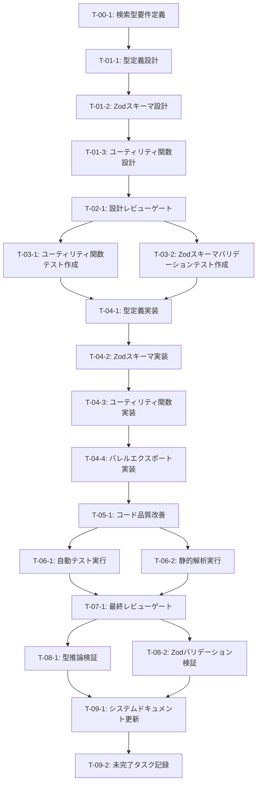

# 検索クエリ・結果スキーマ定義 - タスク実行仕様書

## ユーザーからの元の指示

```
@docs/30-workflows/unassigned-task/task-03-05-search-query-result-schemas.md のタスクを実行するために、次のプロンプトを使ってタスク仕様書を作成してください。タスク仕様書のみ作成して、次のステップには移らないようにしてほしいです。タスク仕様書は指定のフォーマットに従って作成するようにしてください。 .kamui/prompt/custom-prompt.txt
```

## メタ情報

| 項目         | 内容                                    |
| ------------ | --------------------------------------- |
| タスクID     | CONV-03-05                              |
| タスク名     | 検索クエリ・結果スキーマ定義            |
| 分類         | 新規機能実装（型定義・スキーマ定義）    |
| 対象機能     | RAG検索システムの型基盤                 |
| 優先度       | 高                                      |
| 見積もり規模 | 中規模                                  |
| ステータス   | 未実施                                  |
| 発見元       | CONV-03-05タスクドキュメント            |
| 発見日       | 2025-12-18                              |
| 出力場所     | `packages/shared/src/types/rag/search/` |

---

## タスク概要

### 目的

HybridRAG検索エンジンで使用する検索クエリ、検索結果、リランキングの型とZodスキーマを定義し、CONV-07（HybridRAG検索エンジン）の型安全な基盤を構築する。

### 背景

- RAG検索システムでは、クエリ分類、検索戦略選択、結果融合、リランキングなど多段階の処理が存在する
- 各段階で扱うデータ構造を厳密に型定義することで、実装時のバグを防ぎ、型安全性を確保する必要がある
- Zodスキーマによるランタイムバリデーションにより、外部入力の安全性を保証する
- CONV-03-01（基本型・共通インターフェース定義）で定義されたBranded Type（ChunkId, EntityId等）を活用し、型の一貫性を維持する

### 最終ゴール

以下の成果物を完成させ、CONV-07の各検索戦略実装がこれらの型定義を参照できる状態にする:

1. `types.ts`: 検索クエリ・結果・メトリクス関連の全型定義
2. `schemas.ts`: Zodスキーマによるバリデーション定義
3. `utils.ts`: RRFスコア計算・正規化・重複排除などのユーティリティ関数
4. 単体テスト: 全ユーティリティ関数のテストカバレッジ80%以上

### 成果物一覧

| 種別         | 成果物                                  | 配置先                                                              |
| ------------ | --------------------------------------- | ------------------------------------------------------------------- |
| 機能         | 型定義ファイル（types.ts）              | `packages/shared/src/types/rag/search/types.ts`                     |
| 機能         | Zodスキーマファイル（schemas.ts）       | `packages/shared/src/types/rag/search/schemas.ts`                   |
| 機能         | ユーティリティ関数（utils.ts）          | `packages/shared/src/types/rag/search/utils.ts`                     |
| 機能         | バレルエクスポート（index.ts）          | `packages/shared/src/types/rag/search/index.ts`                     |
| テスト       | ユニットテストファイル（utils.test.ts） | `packages/shared/src/types/rag/search/__tests__/utils.test.ts`      |
| ドキュメント | 型設計ドキュメント                      | `docs/30-workflows/rag-search-system/task-step02-type-design.md`    |
| ドキュメント | 設計レビューレポート                    | `docs/30-workflows/rag-search-system/task-step03-design-review.md`  |
| ドキュメント | テスト設計ドキュメント                  | `docs/30-workflows/rag-search-system/task-step04-test-design.md`    |
| ドキュメント | 実装完了レポート                        | `docs/30-workflows/rag-search-system/task-step05-implementation.md` |
| ドキュメント | 品質レポート                            | `docs/30-workflows/rag-search-system/task-step06-quality-report.md` |
| ドキュメント | 最終レビューレポート                    | `docs/30-workflows/rag-search-system/task-step07-final-review.md`   |
| ドキュメント | 手動テスト結果レポート                  | `docs/30-workflows/rag-search-system/task-step08-manual-test.md`    |

---

## 参照ファイル

本仕様書のコマンド・エージェント・スキル選定は以下を参照：

- `docs/00-requirements/master_system_design.md` - システム要件
- `.claude/commands/ai/command_list.md` - /ai:コマンド定義
- `.claude/agents/agent_list.md` - エージェント定義
- `.claude/skills/skill_list.md` - スキル定義

---

## タスク分解サマリー

| ID     | フェーズ                  | サブタスク名                        | 責務                                                                 | 依存   |
| ------ | ------------------------- | ----------------------------------- | -------------------------------------------------------------------- | ------ |
| T-00-1 | Phase 0: 要件定義         | 検索型要件定義                      | SearchQuery、SearchResult、QueryType等の要件を明文化                 | なし   |
| T-01-1 | Phase 1: 設計             | 型定義設計                          | 全型インターフェース設計、Branded Type活用方針策定                   | T-00-1 |
| T-01-2 | Phase 1: 設計             | Zodスキーマ設計                     | 全Zodスキーマ設計、バリデーションルール定義                          | T-01-1 |
| T-01-3 | Phase 1: 設計             | ユーティリティ関数設計              | RRF計算・正規化・重複排除等の関数仕様設計                            | T-01-1 |
| T-02-1 | Phase 2: 設計レビュー     | 設計レビューゲート                  | 型設計・スキーマ設計の妥当性検証、CONV-03-01との整合性確認           | T-01-3 |
| T-03-1 | Phase 3: テスト作成       | ユーティリティ関数テスト作成        | calculateRRFScore、normalizeScores等のテストケース作成               | T-02-1 |
| T-03-2 | Phase 3: テスト作成       | Zodスキーマバリデーションテスト作成 | 各Zodスキーマの正常系・異常系テスト作成                              | T-02-1 |
| T-04-1 | Phase 4: 実装             | 型定義実装                          | types.tsの全型定義実装                                               | T-03-2 |
| T-04-2 | Phase 4: 実装             | Zodスキーマ実装                     | schemas.tsの全Zodスキーマ実装                                        | T-04-1 |
| T-04-3 | Phase 4: 実装             | ユーティリティ関数実装              | utils.tsの全ユーティリティ関数実装                                   | T-04-2 |
| T-04-4 | Phase 4: 実装             | バレルエクスポート実装              | index.tsのエクスポート設定                                           | T-04-3 |
| T-05-1 | Phase 5: リファクタリング | コード品質改善                      | 命名改善、型安全性強化、重複コード排除                               | T-04-4 |
| T-06-1 | Phase 6: 品質保証         | 自動テスト実行                      | 全テストスイート実行、カバレッジ80%以上確認                          | T-05-1 |
| T-06-2 | Phase 6: 品質保証         | 静的解析実行                        | ESLint、TypeScript型チェック実行                                     | T-05-1 |
| T-07-1 | Phase 7: 最終レビュー     | 最終レビューゲート                  | コード品質、型安全性、アーキテクチャ整合性、テスト品質の総合レビュー | T-06-2 |
| T-08-1 | Phase 8: 手動テスト       | 型推論検証                          | TypeScript型推論が正しく機能することを手動確認                       | T-07-1 |
| T-08-2 | Phase 8: 手動テスト       | Zodバリデーション検証               | 異常データ投入時のZodバリデーション動作確認                          | T-07-1 |
| T-09-1 | Phase 9: ドキュメント更新 | システムドキュメント更新            | docs/00-requirements/配下の関連ドキュメント更新                      | T-08-2 |
| T-09-2 | Phase 9: ドキュメント更新 | 未完了タスク記録                    | レビューで発見された改善タスクをdocs/30-workflows/unassigned-task/に | T-08-2 |

**総サブタスク数**: 18個

---

## 実行フロー図



---

## Phase 0: 要件定義

### T-00-1: 検索型要件定義

#### 目的

HybridRAG検索エンジンで使用する全型（SearchQuery、SearchResult、QueryType、SearchStrategy等）の要件を明文化し、実装の基準を確立する。

#### 背景

- 検索システムでは、クエリ分類→検索戦略選択→結果融合→リランキングという複数段階の処理が存在
- 各段階で扱うデータ構造が曖昧なままでは、後続のCONV-07実装時に設計のブレが発生する
- 型要件を先に明確化することで、設計段階での手戻りを防ぐ

#### 責務（単一責務）

検索クエリ、検索結果、検索戦略、メトリクス、RRF/CRAG関連の型要件を明文化する。

#### Claude Code スラッシュコマンド

> ⚠️ 以下はターミナルコマンドではなく、Claude Code内で実行するスラッシュコマンドです

```
/ai:write-spec search-query-result-types
```

- **参照**: `.claude/commands/ai/command_list.md`

#### 使用エージェント

- **エージェント**: .claude/agents/req-analyst.md
- **選定理由**:
  - 要求工学の専門家（Karl Wiegers方法論）であり、曖昧性検出・トリアージフレームワークに精通
  - Given-When-Then形式による検証可能な受け入れ基準を記述できる
  - 型定義という技術的要件を、後続実装者が迷わない粒度で明文化できる
- **参照**: `.claude/agents/agent_list.md`

#### 活用スキル

| スキル名                                   | 活用方法                                                                       |
| ------------------------------------------ | ------------------------------------------------------------------------------ |
| **.claude/skills/requirements-engineering/SKILL.md**               | MoSCoW優先度付け、曖昧性検出、検証可能な要件文の作成                           |
| **.claude/skills/functional-non-functional-requirements/SKILL.md** | 機能要件（型定義）と非機能要件（パフォーマンス、保守性）の分離                 |
| **.claude/skills/acceptance-criteria-writing/SKILL.md**            | Given-When-Then形式での受け入れ基準記述（例: Given型定義、When利用、Then推論） |

- **参照**: `.claude/skills/skill_list.md`

#### 成果物

| 成果物           | パス                                                              | 内容                                                                           |
| ---------------- | ----------------------------------------------------------------- | ------------------------------------------------------------------------------ |
| 要件ドキュメント | `docs/30-workflows/rag-search-system/task-step01-requirements.md` | SearchQuery、SearchResult、QueryType等の型要件、受け入れ基準、非機能要件を記載 |

#### 完了条件

- [ ] 全型（SearchQuery、SearchResult、QueryType、SearchStrategy、RRFConfig、CRAGScore等）の要件が明文化されている
- [ ] 各型の受け入れ基準がGiven-When-Then形式で記述されている
- [ ] CONV-03-01で定義されたBranded Type（ChunkId、EntityId等）との整合性要件が記載されている
- [ ] 非機能要件（型安全性、パフォーマンス、保守性）が定義されている

#### 依存関係

- **前提**: なし
- **後続**: T-01-1（型定義設計）

---

## Phase 1: 設計

### T-01-1: 型定義設計

#### 目的

要件ドキュメントに基づき、TypeScript型定義（interface、type、enum）の詳細設計を行い、型安全性とCONV-03-01との整合性を確保する。

#### 背景

- TypeScriptの型システムを最大限活用し、コンパイル時にエラーを検出する設計が必要
- CONV-03-01で定義されたBranded Type（ChunkId、EntityId等）を参照し、型の一貫性を維持する
- readonly修飾子の適切な使用により、不変性を保証する

#### 責務（単一責務）

types.tsの全型インターフェース・列挙型の設計を行う。

#### Claude Code スラッシュコマンド

> ⚠️ 以下はターミナルコマンドではなく、Claude Code内で実行するスラッシュコマンドです

```
/ai:design-architecture clean
```

- **参照**: `.claude/commands/ai/command_list.md`

#### 使用エージェント

- **エージェント**: .claude/agents/schema-def.md
- **選定理由**:
  - Zod・TypeScript厳格モードの専門家であり、型安全性パターンに精通
  - Discriminated Unions、型ガード、Branded Typeの適切な使用を設計できる
  - Clean Architecture原則に基づいた型設計（外部依存を持たないドメイン型）を実現できる
- **参照**: `.claude/agents/agent_list.md`

#### 活用スキル

| スキル名                 | 活用方法                                                             |
| ------------------------ | -------------------------------------------------------------------- |
| **.claude/skills/type-safety-patterns/SKILL.md** | Discriminated Unions、型ガード、Branded Type活用による型安全性の強化 |
| **.claude/skills/zod-validation/SKILL.md**       | Zodスキーマと型定義の整合性を保つための設計（型推論の最大活用）      |

- **参照**: `.claude/skills/skill_list.md`

#### 成果物

| 成果物             | パス                                                             | 内容                                                   |
| ------------------ | ---------------------------------------------------------------- | ------------------------------------------------------ |
| 型設計ドキュメント | `docs/30-workflows/rag-search-system/task-step02-type-design.md` | 全型インターフェースの設計、Branded Type活用方針を記載 |

#### 完了条件

- [ ] SearchQuery、SearchResult、SearchResultItem等の全型インターフェースが設計されている
- [ ] QueryType、SearchStrategy、SearchResultType等の列挙型が設計されている
- [ ] CONV-03-01のBranded Type（ChunkId、EntityId、CommunityId、FileId）が正しく参照されている
- [ ] readonly修飾子が適切に使用され、不変性が保証されている
- [ ] 型設計ドキュメントにUML図（クラス図）が含まれている

#### 依存関係

- **前提**: T-00-1（検索型要件定義）
- **後続**: T-01-2（Zodスキーマ設計）

---

### T-01-2: Zodスキーマ設計

#### 目的

型定義に対応するZodスキーマを設計し、ランタイムバリデーションとTypeScript型推論の両立を実現する。

#### 背景

- TypeScriptの型定義はコンパイル時のみ有効であり、ランタイムで不正なデータを防げない
- Zodスキーマを定義することで、外部入力（API、ユーザー入力）の安全性を保証する
- z.infer<typeof schema>を活用し、Zodスキーマから型を自動推論することで、型とスキーマの二重管理を防ぐ

#### 責務（単一責務）

schemas.tsの全Zodスキーマとバリデーションルールを設計する。

#### Claude Code スラッシュコマンド

> ⚠️ 以下はターミナルコマンドではなく、Claude Code内で実行するスラッシュコマンドです

```
/ai:create-schema search-query-result
```

- **参照**: `.claude/commands/ai/command_list.md`

#### 使用エージェント

- **エージェント**: .claude/agents/schema-def.md
- **選定理由**:
  - Zod専門家であり、カスタムバリデーション（refine、superRefine）の設計に精通
  - 型推論を最大限活用し、型とスキーマの一貫性を保つ設計ができる
  - エラーメッセージの国際化対応（i18n）や、ユーザーフレンドリーなエラーメッセージ設計ができる
- **参照**: `.claude/agents/agent_list.md`

#### 活用スキル

| スキル名                 | 活用方法                                                                 |
| ------------------------ | ------------------------------------------------------------------------ |
| **.claude/skills/zod-validation/SKILL.md**       | Zodスキーマ定義、カスタムバリデーション（refine）、型推論の活用          |
| **.claude/skills/error-message-design/SKILL.md** | ユーザーフレンドリーなバリデーションエラーメッセージの設計（日本語対応） |

- **参照**: `.claude/skills/skill_list.md`

#### 成果物

| 成果物                   | パス                                                               | 内容                                                                |
| ------------------------ | ------------------------------------------------------------------ | ------------------------------------------------------------------- |
| スキーマ設計ドキュメント | `docs/30-workflows/rag-search-system/task-step02-schema-design.md` | 全Zodスキーマ設計、バリデーションルール、エラーメッセージ設計を記載 |

#### 完了条件

- [ ] 全型に対応するZodスキーマが設計されている
- [ ] searchWeightsSchemaに「重みの合計が1.0」のrefineバリデーションが定義されている
- [ ] dateRangeSchemaに「start ≤ end」のrefineバリデーションが定義されている
- [ ] エラーメッセージが日本語で記述されている
- [ ] スキーマバージョニング戦略（将来的な拡張）が検討されている

#### 依存関係

- **前提**: T-01-1（型定義設計）
- **後続**: T-01-3（ユーティリティ関数設計）

---

### T-01-3: ユーティリティ関数設計

#### 目的

RRFスコア計算、スコア正規化、重複排除、クエリ拡張などのユーティリティ関数の仕様を設計し、実装の基準を確立する。

#### 背景

- RRF（Reciprocal Rank Fusion）は複数検索戦略の結果を融合する重要なアルゴリズム
- スコア正規化・重複排除は検索品質に直結するため、明確な仕様定義が必要
- 単体テストが容易な純粋関数として設計する

#### 責務（単一責務）

utils.tsの全ユーティリティ関数（calculateRRFScore、normalizeScores、deduplicateResults等）の仕様設計を行う。

#### Claude Code スラッシュコマンド

> ⚠️ 以下はターミナルコマンドではなく、Claude Code内で実行するスラッシュコマンドです

```
/ai:design-api utils
```

- **参照**: `.claude/commands/ai/command_list.md`

#### 使用エージェント

- **エージェント**: .claude/agents/logic-dev.md
- **選定理由**:
  - ビジネスロジック実装の専門家（Martin Fowler）であり、純粋関数設計に精通
  - TDDサイクル（Red-Green-Refactor）を前提とした設計ができる
  - 境界値分析・等価分割によるテストケース設計を同時に行える
- **参照**: `.claude/agents/agent_list.md`

#### 活用スキル

| スキル名                   | 活用方法                                  |
| -------------------------- | ----------------------------------------- |
| **.claude/skills/clean-code-practices/SKILL.md**   | 小さな関数、意味のある命名、DRY原則の適用 |
| **.claude/skills/tdd-red-green-refactor/SKILL.md** | テストケースを前提とした関数仕様設計      |

- **参照**: `.claude/skills/skill_list.md`

#### 成果物

| 成果物                             | パス                                                              | 内容                                                                        |
| ---------------------------------- | ----------------------------------------------------------------- | --------------------------------------------------------------------------- |
| ユーティリティ関数設計ドキュメント | `docs/30-workflows/rag-search-system/task-step02-utils-design.md` | calculateRRFScore等の全関数仕様、入出力例、境界値、エラーハンドリングを記載 |

#### 完了条件

- [ ] calculateRRFScore関数の仕様（引数、戻り値、アルゴリズム）が設計されている
- [ ] normalizeScores関数の仕様（0-1正規化、空配列対応）が設計されている
- [ ] deduplicateResults関数の仕様（max_score/sum_score戦略）が設計されている
- [ ] 各関数の境界値・エッジケースが明記されている
- [ ] 純粋関数として設計されている（副作用なし）

#### 依存関係

- **前提**: T-01-2（Zodスキーマ設計）
- **後続**: T-02-1（設計レビューゲート）

---

## Phase 2: 設計レビューゲート

### T-02-1: 設計レビューゲート

#### 目的

Phase 1で設計した型定義、Zodスキーマ、ユーティリティ関数の妥当性を多角的にレビューし、実装開始前に設計上の問題を検出する。

#### 背景

- 設計ミスが実装後に発見されると、修正コストが大幅に増加する
- 複数のエージェントによる専門的な視点からのレビューにより、見落としを防ぐ
- CONV-03-01（基本型・共通インターフェース定義）との整合性を確認する

#### レビュー参加エージェント

| エージェント  | レビュー観点           | 選定理由                                                                            |
| ------------- | ---------------------- | ----------------------------------------------------------------------------------- |
| .claude/agents/req-analyst.md  | 要件充足性             | 要件定義段階で定義した全要件が設計に反映されているか確認                            |
| .claude/agents/arch-police.md  | アーキテクチャ整合性   | Clean Architecture原則遵守、依存関係逆転の原則（DIP）確認、CONV-03-01との整合性検証 |
| .claude/agents/schema-def.md   | 型安全性・スキーマ設計 | TypeScript型推論、Zodバリデーションルールの妥当性、readonly修飾子の適切性確認       |
| .claude/agents/db-architect.md | データ構造設計         | JSON活用設計、インデックス戦略（将来的な検索最適化）の考慮確認                      |

- **参照**: `.claude/agents/agent_list.md`

#### レビューチェックリスト

**要件充足性** (.claude/agents/req-analyst.md)

- [ ] T-00-1で定義した全型要件が設計に含まれているか
- [ ] 受け入れ基準（Given-When-Then）が満たされる設計か
- [ ] スコープ外の機能が含まれていないか

**アーキテクチャ整合性** (.claude/agents/arch-police.md)

- [ ] CONV-03-01のBranded Type（ChunkId、EntityId等）が正しく参照されているか
- [ ] 外部依存（データベース、API）への依存がドメイン型に混入していないか
- [ ] 依存関係逆転の原則（DIP）が守られているか

**型安全性・スキーマ設計** (.claude/agents/schema-def.md)

- [ ] readonly修飾子が適切に使用され、不変性が保証されているか
- [ ] Discriminated Unions、型ガードが適切に設計されているか
- [ ] Zodスキーマと型定義が一貫しているか（z.inferで推論可能か）
- [ ] カスタムバリデーション（refine）が適切に設計されているか

**データ構造設計** (.claude/agents/db-architect.md)

- [ ] JSON活用設計（SQLite JSON1拡張対応）が考慮されているか
- [ ] 将来的なインデックス設計（検索最適化）に適した構造か

#### レビュー結果

- **判定**: {{判定結果: PASS/MINOR/MAJOR}}
- **指摘事項**: {{指摘内容}}
- **対応方針**: {{対応内容}}

#### 戻り先決定（MAJORの場合）

| 問題の種類               | 戻り先                  |
| ------------------------ | ----------------------- |
| 要件の問題               | Phase 0（要件定義）     |
| 型設計の問題             | Phase 1（型定義設計）   |
| スキーマ設計の問題       | Phase 1（スキーマ設計） |
| ユーティリティ関数の問題 | Phase 1（関数設計）     |

#### 完了条件

- [ ] 全レビュー観点でチェックリストが確認されている
- [ ] 指摘事項が全て対応済み、またはMINOR判定である
- [ ] 判定結果がPASSまたはMINORである

#### 依存関係

- **前提**: T-01-3（ユーティリティ関数設計）
- **後続**: T-03-1（ユーティリティ関数テスト作成）、T-03-2（Zodスキーマバリデーションテスト作成）

---

## Phase 3: テスト作成 (TDD: Red)

### T-03-1: ユーティリティ関数テスト作成

#### 目的

calculateRRFScore、normalizeScores、deduplicateResults等のユーティリティ関数のテストケースを実装より先に作成し、期待される動作を明確化する。

#### 背景

- TDD原則に従い、テストを先に書くことで、関数の仕様を実装前に明確化する
- 境界値分析・等価分割により、エッジケースを網羅的にテストする
- テストが失敗することを確認し、Red状態を確立する

#### 責務（単一責務）

utils.tsの全ユーティリティ関数のテストケース（正常系・異常系・境界値）を作成する。

#### Claude Code スラッシュコマンド

> ⚠️ 以下はターミナルコマンドではなく、Claude Code内で実行するスラッシュコマンドです

```
/ai:generate-unit-tests packages/shared/src/types/rag/search/utils.ts
```

- **参照**: `.claude/commands/ai/command_list.md`

#### 使用エージェント

- **エージェント**: .claude/agents/unit-tester.md
- **選定理由**:
  - TDD専門家（Kent Beck）であり、Red-Green-Refactorサイクルに精通
  - 境界値分析・等価分割によるテストケース設計ができる
  - Vitest、Test Doubles（Mock、Stub）の活用に精通
- **参照**: `.claude/agents/agent_list.md`

#### 活用スキル

| スキル名                    | 活用方法                                                 |
| --------------------------- | -------------------------------------------------------- |
| **.claude/skills/tdd-principles/SKILL.md**          | Red-Green-Refactorサイクル、テストファースト設計         |
| **.claude/skills/boundary-value-analysis/SKILL.md** | 境界値テスト（空配列、最小値、最大値、null等）、等価分割 |
| **.claude/skills/vitest-advanced/SKILL.md**         | Vitestテスト構造、非同期テスト、モッキング               |

- **参照**: `.claude/skills/skill_list.md`

#### 成果物

| 成果物                 | パス                                                             | 内容                                      |
| ---------------------- | ---------------------------------------------------------------- | ----------------------------------------- |
| ユニットテストファイル | `packages/shared/src/types/rag/search/__tests__/utils.test.ts`   | calculateRRFScore等の全関数のテストケース |
| テスト設計ドキュメント | `docs/30-workflows/rag-search-system/task-step04-test-design.md` | テストケース一覧、境界値、期待結果を記載  |

#### TDD検証: Red状態確認

```bash
pnpm --filter @repo/shared test:run utils.test.ts
```

- [ ] テストが失敗することを確認（Red状態）

#### 完了条件

- [ ] calculateRRFScore関数のテストケースが作成されている（正常系・境界値・異常系）
- [ ] normalizeScores関数のテストケースが作成されている（空配列、範囲0のケース等）
- [ ] deduplicateResults関数のテストケースが作成されている（max_score/sum_score戦略）
- [ ] テスト実行時にRed状態（失敗）が確認されている
- [ ] テストカバレッジ80%以上を目指したテストケースが設計されている

#### 依存関係

- **前提**: T-02-1（設計レビューゲート）
- **後続**: T-04-1（型定義実装）

---

### T-03-2: Zodスキーマバリデーションテスト作成

#### 目的

Zodスキーマの正常系・異常系バリデーションをテストケースとして作成し、ランタイムバリデーションの期待動作を明確化する。

#### 背景

- Zodスキーマのバリデーションロジック（refine、superRefine）が正しく機能することを確認する必要がある
- 異常データ投入時に適切なエラーメッセージが返されることを検証する
- TDD原則に従い、テストを先に書くことで、スキーマの仕様を実装前に明確化する

#### 責務（単一責務）

schemas.tsの全Zodスキーマの正常系・異常系バリデーションテストを作成する。

#### Claude Code スラッシュコマンド

> ⚠️ 以下はターミナルコマンドではなく、Claude Code内で実行するスラッシュコマンドです

```
/ai:generate-unit-tests packages/shared/src/types/rag/search/schemas.ts
```

- **参照**: `.claude/commands/ai/command_list.md`

#### 使用エージェント

- **エージェント**: .claude/agents/schema-def.md
- **選定理由**:
  - Zodバリデーション専門家であり、refine、superRefineのテストケース設計に精通
  - エラーメッセージの検証、型推論のテストケース設計ができる
- **参照**: `.claude/agents/agent_list.md`

#### 活用スキル

| スキル名            | 活用方法                                              |
| ------------------- | ----------------------------------------------------- |
| **.claude/skills/zod-validation/SKILL.md**  | Zodスキーマバリデーションテスト、エラーメッセージ検証 |
| **.claude/skills/vitest-advanced/SKILL.md** | Vitestテスト構造、非同期テスト                        |

- **参照**: `.claude/skills/skill_list.md`

#### 成果物

| 成果物                               | パス                                                             | 内容                                              |
| ------------------------------------ | ---------------------------------------------------------------- | ------------------------------------------------- |
| スキーマバリデーションテストファイル | `packages/shared/src/types/rag/search/__tests__/schemas.test.ts` | 全Zodスキーマの正常系・異常系バリデーションテスト |

#### TDD検証: Red状態確認

```bash
pnpm --filter @repo/shared test:run schemas.test.ts
```

- [ ] テストが失敗することを確認（Red状態）

#### 完了条件

- [ ] searchWeightsSchemaの「重みの合計が1.0」バリデーションテストが作成されている
- [ ] dateRangeSchemaの「start ≤ end」バリデーションテストが作成されている
- [ ] 異常データ投入時のエラーメッセージ検証テストが作成されている
- [ ] テスト実行時にRed状態（失敗）が確認されている

#### 依存関係

- **前提**: T-02-1（設計レビューゲート）
- **後続**: T-04-1（型定義実装）

---

## Phase 4: 実装 (TDD: Green)

### T-04-1: 型定義実装

#### 目的

types.tsの全型定義（interface、type、enum）を実装し、TypeScript型推論が正しく機能することを確認する。

#### 背景

- Phase 1で設計した型定義を、TypeScript構文で実装する
- readonly修飾子、Branded Typeを適切に活用し、型安全性を確保する
- CONV-03-01で定義されたBranded Type（ChunkId、EntityId等）を正しくimportする

#### 責務（単一責務）

types.tsの全型定義を実装する。

#### Claude Code スラッシュコマンド

> ⚠️ 以下はターミナルコマンドではなく、Claude Code内で実行するスラッシュコマンドです

```
/ai:implement-business-logic search-types
```

- **参照**: `.claude/commands/ai/command_list.md`

#### 使用エージェント

- **エージェント**: .claude/agents/schema-def.md
- **選定理由**:
  - TypeScript型定義の専門家であり、Discriminated Unions、型ガード、Branded Typeの実装に精通
  - Clean Architecture原則に基づいた型定義（外部依存を持たないドメイン型）を実装できる
- **参照**: `.claude/agents/agent_list.md`

#### 活用スキル

| スキル名                 | 活用方法                                         |
| ------------------------ | ------------------------------------------------ |
| **.claude/skills/type-safety-patterns/SKILL.md** | Discriminated Unions、型ガード、Branded Type実装 |

- **参照**: `.claude/skills/skill_list.md`

#### 成果物

| 成果物         | パス                                            | 内容           |
| -------------- | ----------------------------------------------- | -------------- |
| 型定義ファイル | `packages/shared/src/types/rag/search/types.ts` | 全型定義の実装 |

#### TDD検証: Green状態確認

```bash
pnpm --filter @repo/shared test:run
```

- [ ] 型チェックが成功することを確認（Green状態）

#### 完了条件

- [ ] SearchQuery、SearchResult、SearchResultItem等の全型インターフェースが実装されている
- [ ] QueryType、SearchStrategy、SearchResultType等の列挙型が実装されている
- [ ] CONV-03-01のBranded Type（ChunkId、EntityId、CommunityId、FileId）が正しくimportされている
- [ ] readonly修飾子が適切に使用され、不変性が保証されている
- [ ] TypeScript型チェックがエラーなく通過している

#### 依存関係

- **前提**: T-03-1（ユーティリティ関数テスト作成）、T-03-2（Zodスキーマバリデーションテスト作成）
- **後続**: T-04-2（Zodスキーマ実装）

---

### T-04-2: Zodスキーマ実装

#### 目的

schemas.tsの全Zodスキーマとバリデーションルールを実装し、T-03-2で作成したテストが成功することを確認する。

#### 背景

- Zodスキーマを実装することで、ランタイムバリデーションを実現する
- refine、superRefineを活用し、カスタムバリデーションロジックを実装する
- z.infer<typeof schema>で型を自動推論し、型とスキーマの一貫性を保つ

#### 責務（単一責務）

schemas.tsの全Zodスキーマを実装する。

#### Claude Code スラッシュコマンド

> ⚠️ 以下はターミナルコマンドではなく、Claude Code内で実行するスラッシュコマンドです

```
/ai:create-schema search-query-result
```

- **参照**: `.claude/commands/ai/command_list.md`

#### 使用エージェント

- **エージェント**: .claude/agents/schema-def.md
- **選定理由**:
  - Zod専門家であり、カスタムバリデーション（refine、superRefine）の実装に精通
  - エラーメッセージの国際化対応（日本語）ができる
- **参照**: `.claude/agents/agent_list.md`

#### 活用スキル

| スキル名                 | 活用方法                                                                 |
| ------------------------ | ------------------------------------------------------------------------ |
| **.claude/skills/zod-validation/SKILL.md**       | Zodスキーマ実装、カスタムバリデーション（refine）、型推論の活用          |
| **.claude/skills/error-message-design/SKILL.md** | ユーザーフレンドリーなバリデーションエラーメッセージの実装（日本語対応） |

- **参照**: `.claude/skills/skill_list.md`

#### 成果物

| 成果物           | パス                                              | 内容                |
| ---------------- | ------------------------------------------------- | ------------------- |
| スキーマファイル | `packages/shared/src/types/rag/search/schemas.ts` | 全Zodスキーマの実装 |

#### TDD検証: Green状態確認

```bash
pnpm --filter @repo/shared test:run schemas.test.ts
```

- [ ] テストが成功することを確認（Green状態）

#### 完了条件

- [ ] 全型に対応するZodスキーマが実装されている
- [ ] searchWeightsSchemaに「重みの合計が1.0」のrefineバリデーションが実装されている
- [ ] dateRangeSchemaに「start ≤ end」のrefineバリデーションが実装されている
- [ ] エラーメッセージが日本語で実装されている
- [ ] T-03-2で作成したテストが全て成功している

#### 依存関係

- **前提**: T-04-1（型定義実装）
- **後続**: T-04-3（ユーティリティ関数実装）

---

### T-04-3: ユーティリティ関数実装

#### 目的

utils.tsの全ユーティリティ関数（calculateRRFScore、normalizeScores、deduplicateResults等）を実装し、T-03-1で作成したテストが成功することを確認する。

#### 背景

- RRF（Reciprocal Rank Fusion）アルゴリズムを正確に実装する
- スコア正規化・重複排除ロジックを効率的に実装する
- 純粋関数として実装し、副作用を持たないようにする

#### 責務（単一責務）

utils.tsの全ユーティリティ関数を実装する。

#### Claude Code スラッシュコマンド

> ⚠️ 以下はターミナルコマンドではなく、Claude Code内で実行するスラッシュコマンドです

```
/ai:implement-business-logic search-utils
```

- **参照**: `.claude/commands/ai/command_list.md`

#### 使用エージェント

- **エージェント**: .claude/agents/logic-dev.md
- **選定理由**:
  - ビジネスロジック実装の専門家（Martin Fowler）であり、純粋関数設計に精通
  - TDDサイクル（Red-Green-Refactor）に従った実装ができる
  - Clean Code原則（小さな関数、意味のある命名、DRY原則）を適用できる
- **参照**: `.claude/agents/agent_list.md`

#### 活用スキル

| スキル名                   | 活用方法                                         |
| -------------------------- | ------------------------------------------------ |
| **.claude/skills/clean-code-practices/SKILL.md**   | 小さな関数、意味のある命名、DRY原則の適用        |
| **.claude/skills/tdd-red-green-refactor/SKILL.md** | Red-Green-Refactorサイクル、テストファースト実装 |

- **参照**: `.claude/skills/skill_list.md`

#### 成果物

| 成果物                 | パス                                            | 内容                       |
| ---------------------- | ----------------------------------------------- | -------------------------- |
| ユーティリティファイル | `packages/shared/src/types/rag/search/utils.ts` | 全ユーティリティ関数の実装 |

#### TDD検証: Green状態確認

```bash
pnpm --filter @repo/shared test:run utils.test.ts
```

- [ ] テストが成功することを確認（Green状態）

#### 完了条件

- [ ] calculateRRFScore関数が実装されている（RRFアルゴリズム準拠）
- [ ] normalizeScores関数が実装されている（0-1正規化、空配列対応）
- [ ] deduplicateResults関数が実装されている（max_score/sum_score戦略）
- [ ] 全関数が純粋関数として実装されている（副作用なし）
- [ ] T-03-1で作成したテストが全て成功している

#### 依存関係

- **前提**: T-04-2（Zodスキーマ実装）
- **後続**: T-04-4（バレルエクスポート実装）

---

### T-04-4: バレルエクスポート実装

#### 目的

index.tsにバレルエクスポートを設定し、他モジュールからの型・スキーマ・ユーティリティのimportを簡潔にする。

#### 背景

- `packages/shared/src/types/rag/search/index.ts` から全型・スキーマ・ユーティリティをエクスポートする
- 他モジュールから `import { SearchQuery, searchQuerySchema, calculateRRFScore } from '@repo/shared/types/rag/search'` のように簡潔にimportできるようにする

#### 責務（単一責務）

index.tsのバレルエクスポート設定を実装する。

#### Claude Code スラッシュコマンド

> ⚠️ 以下はターミナルコマンドではなく、Claude Code内で実行するスラッシュコマンドです

```
（手動実装）
```

#### 使用エージェント

- **エージェント**: .claude/agents/logic-dev.md
- **選定理由**:
  - TypeScriptモジュールシステムに精通しており、バレルエクスポートのベストプラクティスを適用できる
- **参照**: `.claude/agents/agent_list.md`

#### 成果物

| 成果物                     | パス                                            | 内容                                           |
| -------------------------- | ----------------------------------------------- | ---------------------------------------------- |
| バレルエクスポートファイル | `packages/shared/src/types/rag/search/index.ts` | types.ts、schemas.ts、utils.tsの全エクスポート |

#### 完了条件

- [ ] types.tsの全型がエクスポートされている
- [ ] schemas.tsの全Zodスキーマがエクスポートされている
- [ ] utils.tsの全ユーティリティ関数がエクスポートされている
- [ ] TypeScript型チェックがエラーなく通過している

#### 依存関係

- **前提**: T-04-3（ユーティリティ関数実装）
- **後続**: T-05-1（コード品質改善）

---

## Phase 5: リファクタリング (TDD: Refactor)

### T-05-1: コード品質改善

#### 目的

実装したコードの品質を改善し、保守性・可読性を向上させる。テストが継続して成功することを確認しながら、リファクタリングを行う。

#### 背景

- TDDサイクルのRefactorフェーズとして、動作を変えずにコード品質を改善する
- Clean Code原則（意味のある命名、小さな関数、DRY原則）を適用する
- テストが継続して成功することで、リファクタリングの安全性を保証する

#### 責務（単一責務）

命名改善、型安全性強化、重複コード排除を行い、コード品質を向上させる。

#### Claude Code スラッシュコマンド

> ⚠️ 以下はターミナルコマンドではなく、Claude Code内で実行するスラッシュコマンドです

```
/ai:refactor packages/shared/src/types/rag/search/
```

- **参照**: `.claude/commands/ai/command_list.md`

#### 使用エージェント

- **エージェント**: .claude/agents/code-quality.md
- **選定理由**:
  - コード品質管理の専門家（Nicholas C. Zakas）であり、ESLint、Prettier、静的解析に精通
  - Clean Code原則（意味のある命名、小さな関数、DRY原則）を適用できる
  - リファクタリング技法（Extract Method、Replace Temp with Query等）に精通
- **参照**: `.claude/agents/agent_list.md`

#### 活用スキル

| スキル名                   | 活用方法                                                            |
| -------------------------- | ------------------------------------------------------------------- |
| **.claude/skills/clean-code-practices/SKILL.md**   | 意味のある命名、小さな関数、DRY原則の適用                           |
| **.claude/skills/refactoring-techniques/SKILL.md** | Extract Method、Replace Temp with Query、Introduce Parameter Object |
| **.claude/skills/eslint-configuration/SKILL.md**   | ESLintルール設定、自動修正、競合解決                                |

- **参照**: `.claude/skills/skill_list.md`

#### 成果物

| 成果物                     | パス                                                     | 内容                 |
| -------------------------- | -------------------------------------------------------- | -------------------- |
| リファクタリング後のコード | `packages/shared/src/types/rag/search/` 配下の全ファイル | 品質改善されたコード |

#### TDD検証: 継続Green確認

```bash
pnpm --filter @repo/shared test:run
```

- [ ] リファクタリング後もテストが成功することを確認

#### 完了条件

- [ ] 命名が改善されている（意味のある変数名、関数名）
- [ ] 重複コードが排除されている（DRY原則）
- [ ] 型安全性が強化されている（any型の排除、型ガードの追加）
- [ ] ESLintエラーが0件である
- [ ] リファクタリング後もテストが全て成功している

#### 依存関係

- **前提**: T-04-4（バレルエクスポート実装）
- **後続**: T-06-1（自動テスト実行）、T-06-2（静的解析実行）

---

## Phase 6: 品質保証

### T-06-1: 自動テスト実行

#### 目的

全テストスイートを実行し、カバレッジ80%以上を確認し、品質基準を満たすことを検証する。

#### 背景

- 品質ゲートの第一基準として、全テストが成功することを確認する
- テストカバレッジ80%以上を達成し、十分なテスト網羅性を保証する

#### 責務（単一責務）

全テストスイート実行、カバレッジ測定を行う。

#### Claude Code スラッシュコマンド

> ⚠️ 以下はターミナルコマンドではなく、Claude Code内で実行するスラッシュコマンドです

```
/ai:run-all-tests --coverage
```

- **参照**: `.claude/commands/ai/command_list.md`

#### 使用エージェント

- **エージェント**: .claude/agents/unit-tester.md
- **選定理由**:
  - TDD専門家であり、テストカバレッジ最適化に精通
  - Vitestカバレッジレポートの分析ができる
- **参照**: `.claude/agents/agent_list.md`

#### 成果物

| 成果物                     | パス                                                                | 内容                           |
| -------------------------- | ------------------------------------------------------------------- | ------------------------------ |
| 品質レポート（テスト部分） | `docs/30-workflows/rag-search-system/task-step06-quality-report.md` | テスト結果、カバレッジレポート |

#### 完了条件

- [ ] 全ユニットテストが成功している
- [ ] テストカバレッジが80%以上である
- [ ] カバレッジレポートが生成されている

#### 依存関係

- **前提**: T-05-1（コード品質改善）
- **後続**: T-07-1（最終レビューゲート）

---

### T-06-2: 静的解析実行

#### 目的

ESLint、TypeScript型チェックを実行し、コード品質基準を満たすことを検証する。

#### 背景

- 品質ゲートの第二基準として、静的解析でエラー0件を確認する
- ESLintルール違反、TypeScript型エラーが存在しないことを保証する

#### 責務（単一責務）

ESLint、TypeScript型チェックを実行する。

#### Claude Code スラッシュコマンド

> ⚠️ 以下はターミナルコマンドではなく、Claude Code内で実行するスラッシュコマンドです

```
/ai:lint
```

- **参照**: `.claude/commands/ai/command_list.md`

#### 使用エージェント

- **エージェント**: .claude/agents/code-quality.md
- **選定理由**:
  - ESLint、TypeScript型チェックの専門家
  - 静的解析結果の分析ができる
- **参照**: `.claude/agents/agent_list.md`

#### 成果物

| 成果物                       | パス                                                                | 内容                   |
| ---------------------------- | ------------------------------------------------------------------- | ---------------------- |
| 品質レポート（静的解析部分） | `docs/30-workflows/rag-search-system/task-step06-quality-report.md` | ESLint、型チェック結果 |

#### 完了条件

- [ ] ESLintエラーが0件である
- [ ] TypeScript型チェックエラーが0件である

#### 依存関係

- **前提**: T-05-1（コード品質改善）
- **後続**: T-07-1（最終レビューゲート）

---

## 品質ゲートチェックリスト

### 機能検証

- [ ] 全ユニットテスト成功

### コード品質

- [ ] Lintエラーなし
- [ ] 型エラーなし
- [ ] コードフォーマット適用済み

### テスト網羅性

- [ ] カバレッジ基準達成（80%以上）

### セキュリティ

- [ ] 脆弱性スキャン完了
- [ ] 重大な脆弱性なし

---

## Phase 7: 最終レビューゲート

### T-07-1: 最終レビューゲート

#### 目的

実装完了後、ドキュメント更新前に全体的な品質・整合性を複数エージェントで検証し、見落としを防ぐ。

#### 背景

- Phase 6の自動検証だけでは検出できない設計判断やベストプラクティス違反を確認する
- 複数の専門エージェントによる多角的レビューで品質を保証する

#### レビュー参加エージェント

| エージェント  | レビュー観点           | 選定理由                                                                      |
| ------------- | ---------------------- | ----------------------------------------------------------------------------- |
| .claude/agents/code-quality.md | コード品質             | Clean Code原則、可読性、保守性の確認                                          |
| .claude/agents/arch-police.md  | アーキテクチャ遵守     | Clean Architecture原則、CONV-03-01との整合性確認                              |
| .claude/agents/unit-tester.md  | テスト品質             | テストカバレッジ、境界値テスト、テストの可読性確認                            |
| .claude/agents/schema-def.md   | 型安全性・スキーマ設計 | TypeScript型推論、Zodバリデーションルールの妥当性、readonly修飾子の適切性確認 |

- **参照**: `.claude/agents/agent_list.md`

#### レビューチェックリスト

**コード品質** (.claude/agents/code-quality.md)

- [ ] Clean Code原則（意味のある命名、小さな関数、DRY原則）が適用されているか
- [ ] 可読性・保守性が確保されているか
- [ ] 適切なエラーハンドリングがあるか
- [ ] 過度な複雑性がないか

**アーキテクチャ遵守** (.claude/agents/arch-police.md)

- [ ] 実装がアーキテクチャ設計に従っているか
- [ ] CONV-03-01のBranded Typeが正しく使用されているか
- [ ] SOLID原則への準拠がなされているか

**テスト品質** (.claude/agents/unit-tester.md)

- [ ] テストカバレッジが十分か（80%以上）
- [ ] テストケースが適切に設計されているか
- [ ] 境界値・異常系のテストがあるか
- [ ] テストの可読性・保守性が確保されているか

**型安全性・スキーマ設計** (.claude/agents/schema-def.md)

- [ ] TypeScript型推論が正しく機能しているか
- [ ] Zodスキーマと型定義が一貫しているか
- [ ] readonly修飾子が適切に使用されているか

#### レビュー結果

- **判定**: {{判定結果: PASS/MINOR/MAJOR/CRITICAL}}
- **指摘事項**: {{指摘内容}}
- **対応方針**: {{対応内容}}
- **未完了タスク数**: {{未完了タスク数}}件

#### 戻り先決定（MAJOR/CRITICALの場合）

| 問題の種類       | 戻り先                      |
| ---------------- | --------------------------- |
| 要件の問題       | Phase 0（要件定義）         |
| 設計の問題       | Phase 1（設計）             |
| テスト設計の問題 | Phase 3（テスト作成）       |
| 実装の問題       | Phase 4（実装）             |
| コード品質の問題 | Phase 5（リファクタリング） |

#### エスカレーション条件

以下の場合、ユーザーに判断を仰ぐ:

- 戻り先の判断が困難な場合
- 複数フェーズにまたがる問題の場合
- 要件自体の見直しが必要な場合

#### 完了条件

- [ ] 全レビュー観点でチェックリストが確認されている
- [ ] 指摘事項が全て対応済み、またはMINOR判定である
- [ ] 判定結果がPASSまたはMINORである

#### 依存関係

- **前提**: T-06-1（自動テスト実行）、T-06-2（静的解析実行）
- **後続**: T-08-1（型推論検証）、T-08-2（Zodバリデーション検証）

---

## Phase 8: 手動テスト検証

### T-08-1: 型推論検証

#### 目的

TypeScript型推論が実際のコードエディタ（VSCode）で正しく機能することを手動で確認する。

#### 背景

- 自動テストでは型推論の動作を完全に検証できない
- 実際のコードエディタで型推論が機能することを確認する必要がある
- z.infer<typeof schema>による型推論が正しく機能することを確認する

#### テスト分類

機能テスト

#### 使用エージェント

- **エージェント**: .claude/agents/schema-def.md
- **選定理由**:
  - TypeScript型推論の専門家であり、型推論の動作確認ができる
- **参照**: `.claude/agents/agent_list.md`

#### 手動テストケース

| No  | カテゴリ | テスト項目              | 前提条件                             | 操作手順                                                                                    | 期待結果                                                  | 実行結果 | 備考 |
| --- | -------- | ----------------------- | ------------------------------------ | ------------------------------------------------------------------------------------------- | --------------------------------------------------------- | -------- | ---- |
| 1   | 型推論   | SearchQuery型推論       | VSCodeで型定義ファイルを開いている   | const query: SearchQuery = ... と入力し、プロパティの補完を確認                             | text、type、embedding等のプロパティが補完候補に表示される |          |      |
| 2   | 型推論   | Zodスキーマからの型推論 | VSCodeでスキーマファイルを開いている | type Query = z.infer<typeof searchQuerySchema> と入力し、型推論を確認                       | SearchQuery型と同等の型が推論される                       |          |      |
| 3   | 型推論   | Branded Type推論        | VSCodeで型定義ファイルを開いている   | const chunkId: ChunkId = ... と入力し、型エラーが表示されることを確認                       | string型を直接代入するとエラーが表示される                |          |      |
| 4   | 型推論   | readonly修飾子検証      | VSCodeで型定義ファイルを開いている   | const query: SearchQuery = ...; query.text = "new" と入力し、型エラーが表示されることを確認 | readonly修飾子により代入エラーが表示される                |          |      |

#### テスト実行手順

1. VSCodeで `packages/shared/src/types/rag/search/types.ts` を開く
2. 上記テストケースの操作手順を実行
3. 期待結果と一致することを確認
4. 結果をドキュメントに記録

#### 成果物

| 成果物                 | パス                                                             | 内容                 |
| ---------------------- | ---------------------------------------------------------------- | -------------------- |
| 手動テスト結果レポート | `docs/30-workflows/rag-search-system/task-step08-manual-test.md` | 型推論検証結果を記載 |

#### 完了条件

- [ ] 全テストケースが実行済み
- [ ] 全テストケースがPASS
- [ ] 結果がドキュメントに記録済み

#### 依存関係

- **前提**: T-07-1（最終レビューゲート）
- **後続**: T-09-1（システムドキュメント更新）

---

### T-08-2: Zodバリデーション検証

#### 目的

異常データ投入時のZodバリデーションが正しく機能し、適切なエラーメッセージが返されることを手動で確認する。

#### 背景

- 自動テストでは全エッジケースを網羅できない可能性がある
- 実際に異常データを投入し、エラーメッセージが日本語で表示されることを確認する

#### テスト分類

機能テスト

#### 使用エージェント

- **エージェント**: .claude/agents/schema-def.md
- **選定理由**:
  - Zodバリデーション専門家であり、エラーメッセージの検証ができる
- **参照**: `.claude/agents/agent_list.md`

#### 手動テストケース

| No  | カテゴリ       | テスト項目                | 前提条件                  | 操作手順                                                              | 期待結果                                                 | 実行結果 | 備考 |
| --- | -------------- | ------------------------- | ------------------------- | --------------------------------------------------------------------- | -------------------------------------------------------- | -------- | ---- |
| 1   | バリデーション | 重みの合計が1.0でない場合 | searchWeightsSchemaを使用 | { keyword: 0.5, semantic: 0.3, graph: 0.3 } を投入                    | 「Weights must sum to 1.0」エラーが返される              |          |      |
| 2   | バリデーション | start > end の場合        | dateRangeSchemaを使用     | { start: new Date('2024-01-02'), end: new Date('2024-01-01') } を投入 | 「start must be before or equal to end」エラーが返される |          |      |
| 3   | バリデーション | 空文字列をtextに投入      | searchQuerySchemaを使用   | { text: "", type: "local", ... } を投入                               | 「text must not be empty」エラーが返される               |          |      |
| 4   | バリデーション | limitが範囲外（101）      | searchOptionsSchemaを使用 | { limit: 101, ... } を投入                                            | 「limit must be between 1 and 100」エラーが返される      |          |      |

#### テスト実行手順

1. Node.js REPLまたはテストファイルで上記テストケースを実行
2. エラーメッセージが日本語で表示されることを確認
3. 結果をドキュメントに記録

#### 成果物

| 成果物                 | パス                                                             | 内容                            |
| ---------------------- | ---------------------------------------------------------------- | ------------------------------- |
| 手動テスト結果レポート | `docs/30-workflows/rag-search-system/task-step08-manual-test.md` | Zodバリデーション検証結果を記載 |

#### 完了条件

- [ ] 全テストケースが実行済み
- [ ] 全テストケースがPASS
- [ ] エラーメッセージが日本語で表示されている
- [ ] 結果がドキュメントに記録済み

#### 依存関係

- **前提**: T-07-1（最終レビューゲート）
- **後続**: T-09-1（システムドキュメント更新）

---

## Phase 9: ドキュメント更新・未完了タスク記録

### T-09-1: システムドキュメント更新

#### 目的

タスク完了後、実装した内容をシステム要件ドキュメント（docs/00-requirements/配下）に反映する。

#### 前提条件

- [ ] Phase 6の品質ゲートをすべて通過
- [ ] Phase 7の最終レビューゲートを通過
- [ ] Phase 8の手動テストが完了
- [ ] すべてのテストが成功

---

#### サブタスク 9.1: システムドキュメント更新

##### 更新対象ドキュメント

以下のドキュメントを更新する必要があるか確認し、必要に応じて更新する:

- `docs/00-requirements/06-core-interfaces.md`: 新しい型インターフェース（SearchQuery、SearchResult等）の概要を追記
- `docs/00-requirements/05-architecture.md`: RAG検索システムのアーキテクチャ図に型定義層を追記

##### Claude Code スラッシュコマンド

> ⚠️ 以下はターミナルコマンドではなく、Claude Code内で実行するスラッシュコマンドです

```
/ai:update-all-docs
```

- **参照**: `.claude/commands/ai/command_list.md`

##### 使用エージェント

- **エージェント**: .claude/agents/spec-writer.md
- **選定理由**:
  - テクニカルライター専門家であり、Documentation as Code実践者
  - 既存ドキュメント構造を維持しながら、概要のみを追記できる
- **参照**: `.claude/agents/agent_list.md`

##### 更新原則

- 概要のみ記載（詳細な実装説明は不要）
- システム構築に必要十分な情報のみ追記
- 既存ドキュメントの構造・フォーマットを維持
- Single Source of Truth原則を遵守（重複記載禁止）

---

#### サブタスク 9.2: 未完了タスク・追加タスク記録

##### 出力先

`docs/30-workflows/unassigned-task/`

##### 記録対象タスク一覧

Phase 7レビューまたはPhase 8手動テストで発見された未完了タスクを記録する。
例:

- Zodスキーマのバージョニング戦略の詳細設計
- クエリ拡張機能の性能最適化
- エラーメッセージの多言語対応（英語追加）

##### ファイル命名規則

- 要件系: `requirements-{{機能領域}}.md`
- 改善系: `task-{{改善領域}}-improvements.md`

##### Claude Code スラッシュコマンド

> ⚠️ 以下はターミナルコマンドではなく、Claude Code内で実行するスラッシュコマンドです

```
（未完了タスクが存在する場合のみ実行）
/ai:write-spec {{未完了タスク名}}
```

- **参照**: `.claude/commands/ai/command_list.md`

##### 使用エージェント

- **エージェント**: .claude/agents/spec-writer.md
- **選定理由**:
  - 100人中100人が実行可能な粒度でタスク指示書を作成できる
  - Why-What-Howの構造でタスクを明確化できる
- **参照**: `.claude/agents/agent_list.md`

##### 活用スキル

| スキル名                        | 活用方法                               |
| ------------------------------- | -------------------------------------- |
| **.claude/skills/requirements-engineering/SKILL.md**    | タスク要件の明確化、受け入れ基準の記述 |
| **.claude/skills/acceptance-criteria-writing/SKILL.md** | Given-When-Then形式での完了条件記述    |

- **参照**: `.claude/skills/skill_list.md`

##### 指示書としての品質基準

生成されるタスク指示書は以下を満たすこと：

**Why（なぜ必要か）**

- [ ] 背景が明確に記述されている
- [ ] 問題点・課題が具体的に説明されている
- [ ] 放置した場合の影響が記載されている

**What（何を達成するか）**

- [ ] 目的が明確に定義されている
- [ ] 最終ゴールが具体的に記述されている
- [ ] スコープ（含む/含まない）が明記されている
- [ ] 成果物が一覧化されている

**How（どのように実行するか）**

- [ ] 前提条件が明記されている
- [ ] 依存タスクが特定されている
- [ ] 必要な知識・スキルが記載されている
- [ ] 推奨アプローチが説明されている

**実行手順**

- [ ] フェーズ構成が明確である
- [ ] 各フェーズにClaude Codeスラッシュコマンド（/ai:xxx形式）が記載されている
- [ ] 使用エージェント・スキルが選定されている
- [ ] 各フェーズの成果物・完了条件が定義されている

**検証・完了**

- [ ] 完了条件チェックリストがある
- [ ] テストケース/検証方法が記載されている
- [ ] リスクと対策が検討されている

##### 各タスクの詳細

（レビュー・手動テスト完了後、未完了タスクが明確になった時点で記載）

---

#### 完了条件

- [ ] システムドキュメント（docs/00-requirements/配下）が更新されている
- [ ] 未完了タスクが全て記録されている（未完了タスクがない場合は不要）
- [ ] 未完了タスク指示書が品質基準を満たしている

---

## リスクと対策

| リスク                               | 影響度 | 発生確率 | 対策                                                                     | 対応サブタスク |
| ------------------------------------ | ------ | -------- | ------------------------------------------------------------------------ | -------------- |
| CONV-03-01のBranded Type定義が不完全 | 高     | 低       | Phase 2設計レビューでCONV-03-01との整合性を厳密に確認                    | T-02-1         |
| RRFアルゴリズムの実装ミス            | 高     | 中       | Phase 3でRRF計算ロジックのテストケースを詳細に作成、Phase 8で手動検証    | T-03-1、T-08-1 |
| ZodスキーマとTypeScript型定義の乖離  | 中     | 中       | z.infer<typeof schema>を活用し、型定義とスキーマを自動同期               | T-04-2         |
| テストカバレッジ不足                 | 中     | 低       | Phase 3で境界値分析・等価分割を徹底、Phase 6でカバレッジ80%以上を確認    | T-03-1、T-06-1 |
| 将来的なスキーマ拡張への対応不足     | 低     | 中       | Phase 1でスキーマバージョニング戦略を検討、Phase 7レビューで拡張性を確認 | T-01-2、T-07-1 |

---

## 前提条件

- CONV-03-01（RAG基本型・共通インターフェース定義）が完了していること
- `packages/shared/src/types/rag/` ディレクトリが存在すること
- pnpm、TypeScript、Vitest、ESLintがセットアップ済みであること
- Zodライブラリがインストール済みであること

---

## 備考

### 技術的制約

- TypeScript 5.x以上を使用すること
- Zod 3.x以上を使用すること
- readonly修飾子を多用し、不変性を保証すること
- Branded Type（CONV-03-01定義）を活用し、型安全性を強化すること

### 参考資料

- [CONV-03-01: RAG基本型・共通インターフェース定義](../unassigned-task/task-03-01-rag-basic-types.md)
- [Zod Documentation](https://zod.dev/)
- [TypeScript Handbook - Advanced Types](https://www.typescriptlang.org/docs/handbook/2/types-from-types.html)
- [RRF（Reciprocal Rank Fusion）論文](https://plg.uwaterloo.ca/~gvcormac/cormacksigir09-rrf.pdf)
