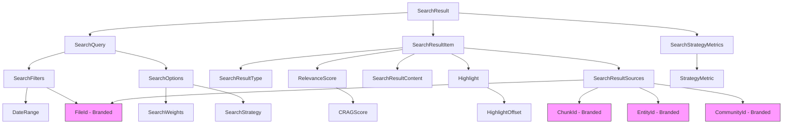
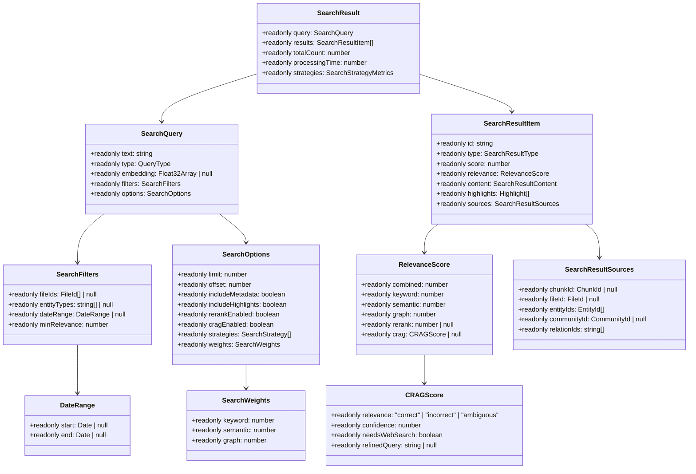

# CONV-03-05: 型定義設計書

**バージョン**: 1.0.0
**作成日**: 2025-12-18
**最終更新**: 2025-12-18
**作成者**: Schema Definition Agent
**前提ドキュメント**: task-step01-requirements.md

---

## 1. 概要

### 1.1 目的

本ドキュメントは、HybridRAG検索エンジンの検索クエリ・結果スキーマに関するTypeScript型定義を設計する。
CONV-03-01のBranded Types統合、型安全性、イミュータビリティを重視した設計とする。

### 1.2 設計原則

| 原則                  | 説明                                                      |
| --------------------- | --------------------------------------------------------- |
| **Type Safety**       | 厳密な型定義により、コンパイル時に型エラーを検出          |
| **Immutability**      | readonly修飾子により、不変性を保証                        |
| **Branded Types**     | CONV-03-01のBranded Typesを活用し、異なるID型の誤用を防止 |
| **Zod Compatibility** | Zodスキーマから型を推論可能な構造                         |

---

## 2. 型定義一覧

### 2.1 列挙型・定数型

#### 2.1.1 QueryType（クエリタイプ）

```typescript
/**
 * ユーザーの検索意図を分類するクエリタイプ
 */
export const QueryTypes = {
  LOCAL: "local",
  GLOBAL: "global",
  RELATIONSHIP: "relationship",
  HYBRID: "hybrid",
} as const;

export type QueryType = (typeof QueryTypes)[keyof typeof QueryTypes];
```

#### 2.1.2 SearchStrategy（検索戦略）

```typescript
/**
 * 検索アルゴリズムを識別する戦略タイプ
 */
export const SearchStrategies = {
  KEYWORD: "keyword",
  SEMANTIC: "semantic",
  GRAPH: "graph",
  HYBRID: "hybrid",
} as const;

export type SearchStrategy =
  (typeof SearchStrategies)[keyof typeof SearchStrategies];
```

#### 2.1.3 SearchResultType（検索結果タイプ）

```typescript
/**
 * 検索結果アイテムの種類を識別するタイプ
 */
export const SearchResultTypes = {
  CHUNK: "chunk",
  ENTITY: "entity",
  COMMUNITY: "community",
} as const;

export type SearchResultType =
  (typeof SearchResultTypes)[keyof typeof SearchResultTypes];
```

---

### 2.2 検索クエリ関連型

#### 2.2.1 SearchQuery

```typescript
/**
 * 検索クエリインターフェース
 *
 * @example
 * const query: SearchQuery = {
 *   text: "機械学習",
 *   type: "local",
 *   embedding: null,
 *   filters: { fileIds: null, entityTypes: null, dateRange: null, minRelevance: 0.3 },
 *   options: defaultSearchOptions
 * };
 */
export interface SearchQuery {
  readonly text: string;
  readonly type: QueryType;
  readonly embedding: Float32Array | null;
  readonly filters: SearchFilters;
  readonly options: SearchOptions;
}
```

#### 2.2.2 SearchFilters

```typescript
import type { FileId } from "../branded-types";

/**
 * 検索フィルター
 */
export interface SearchFilters {
  readonly fileIds: ReadonlyArray<FileId> | null;
  readonly entityTypes: ReadonlyArray<string> | null;
  readonly dateRange: DateRange | null;
  readonly minRelevance: number; // 0.0-1.0
}
```

#### 2.2.3 DateRange

```typescript
/**
 * 日付範囲フィルター
 */
export interface DateRange {
  readonly start: Date | null;
  readonly end: Date | null;
}
```

#### 2.2.4 SearchOptions

```typescript
/**
 * 検索オプション
 */
export interface SearchOptions {
  readonly limit: number; // 1-100
  readonly offset: number; // 0以上
  readonly includeMetadata: boolean;
  readonly includeHighlights: boolean;
  readonly rerankEnabled: boolean;
  readonly cragEnabled: boolean;
  readonly strategies: ReadonlyArray<SearchStrategy>;
  readonly weights: SearchWeights;
}
```

#### 2.2.5 SearchWeights

```typescript
/**
 * 検索戦略の重み（合計1.0）
 */
export interface SearchWeights {
  readonly keyword: number; // 0.0-1.0
  readonly semantic: number; // 0.0-1.0
  readonly graph: number; // 0.0-1.0
}
```

#### 2.2.6 QueryClassification

```typescript
/**
 * クエリ分類結果
 */
export interface QueryClassification {
  readonly originalQuery: string;
  readonly type: QueryType;
  readonly confidence: number; // 0.0-1.0
  readonly extractedEntities: ReadonlyArray<string>;
  readonly suggestedWeights: SearchWeights;
  readonly expandedQueries: ReadonlyArray<string>;
}
```

---

### 2.3 検索結果関連型

#### 2.3.1 SearchResult

```typescript
/**
 * 統合検索結果
 */
export interface SearchResult {
  readonly query: SearchQuery;
  readonly results: ReadonlyArray<SearchResultItem>;
  readonly totalCount: number;
  readonly processingTime: number; // ミリ秒
  readonly strategies: SearchStrategyMetrics;
}
```

#### 2.3.2 SearchResultItem

```typescript
/**
 * 個別検索結果アイテム
 */
export interface SearchResultItem {
  readonly id: string;
  readonly type: SearchResultType;
  readonly score: number; // 0.0-1.0
  readonly relevance: RelevanceScore;
  readonly content: SearchResultContent;
  readonly highlights: ReadonlyArray<Highlight>;
  readonly sources: SearchResultSources;
}
```

#### 2.3.3 RelevanceScore

```typescript
/**
 * 関連度スコア詳細
 */
export interface RelevanceScore {
  readonly combined: number; // 0.0-1.0
  readonly keyword: number; // 0.0-1.0
  readonly semantic: number; // 0.0-1.0
  readonly graph: number; // 0.0-1.0
  readonly rerank: number | null; // 0.0-1.0
  readonly crag: CRAGScore | null;
}
```

#### 2.3.4 CRAGScore

```typescript
/**
 * CRAG評価スコア
 */
export interface CRAGScore {
  readonly relevance: "correct" | "incorrect" | "ambiguous";
  readonly confidence: number; // 0.0-1.0
  readonly needsWebSearch: boolean;
  readonly refinedQuery: string | null;
}
```

#### 2.3.5 SearchResultContent

```typescript
/**
 * 検索結果コンテンツ
 */
export interface SearchResultContent {
  readonly text: string;
  readonly summary: string | null;
  readonly contextBefore: string | null;
  readonly contextAfter: string | null;
}
```

#### 2.3.6 Highlight

```typescript
/**
 * ハイライト情報
 */
export interface Highlight {
  readonly field: string;
  readonly fragment: string;
  readonly offsets: ReadonlyArray<HighlightOffset>;
}
```

#### 2.3.7 HighlightOffset

```typescript
/**
 * ハイライトオフセット
 */
export interface HighlightOffset {
  readonly start: number; // 0以上
  readonly end: number; // start < end
}
```

#### 2.3.8 SearchResultSources

```typescript
import type { ChunkId, FileId, EntityId, CommunityId } from "../branded-types";

/**
 * 検索結果ソース情報
 */
export interface SearchResultSources {
  readonly chunkId: ChunkId | null;
  readonly fileId: FileId | null;
  readonly entityIds: ReadonlyArray<EntityId>;
  readonly communityId: CommunityId | null;
  readonly relationIds: ReadonlyArray<string>;
}
```

---

### 2.4 メトリクス・設定関連型

#### 2.4.1 SearchStrategyMetrics

```typescript
/**
 * 検索戦略メトリクス
 */
export interface SearchStrategyMetrics {
  readonly keyword: StrategyMetric;
  readonly semantic: StrategyMetric;
  readonly graph: StrategyMetric;
}
```

#### 2.4.2 StrategyMetric

```typescript
/**
 * 個別戦略メトリクス
 */
export interface StrategyMetric {
  readonly enabled: boolean;
  readonly resultCount: number;
  readonly processingTime: number; // ミリ秒
  readonly topScore: number; // 0.0-1.0
}
```

#### 2.4.3 RRFConfig

```typescript
/**
 * RRF設定
 */
export interface RRFConfig {
  readonly k: number; // 1-1000
  readonly normalizeScores: boolean;
}
```

#### 2.4.4 RerankConfig

```typescript
/**
 * リランキング設定
 */
export interface RerankConfig {
  readonly enabled: boolean;
  readonly model: string;
  readonly topK: number; // 1-100
  readonly batchSize: number; // 1-32
}
```

---

## 3. 型の依存関係図



---

## 4. CONV-03-01 Branded Types統合

### 4.1 使用するBranded Types

| Branded Type | 用途                     | インポート元     |
| ------------ | ------------------------ | ---------------- |
| ChunkId      | テキストチャンクID       | ../branded-types |
| EntityId     | 知識グラフエンティティID | ../branded-types |
| CommunityId  | コミュニティID           | ../branded-types |
| FileId       | ファイルID               | ../branded-types |

### 4.2 型の互換性

```typescript
// CONV-03-01のBranded Typesをインポート
import type { ChunkId, EntityId, CommunityId, FileId } from "../branded-types";

// SearchResultSourcesでBranded Typesを使用
export interface SearchResultSources {
  readonly chunkId: ChunkId | null;
  readonly fileId: FileId | null;
  readonly entityIds: ReadonlyArray<EntityId>;
  readonly communityId: CommunityId | null;
  readonly relationIds: ReadonlyArray<string>;
}
```

---

## 5. Zodスキーマとの対応

| TypeScript型          | Zodスキーマ                 | 備考                           |
| --------------------- | --------------------------- | ------------------------------ |
| QueryType             | queryTypeSchema             | z.enum()                       |
| SearchStrategy        | searchStrategySchema        | z.enum()                       |
| SearchResultType      | searchResultTypeSchema      | z.enum()                       |
| SearchQuery           | searchQuerySchema           | z.object() + refine            |
| SearchFilters         | searchFiltersSchema         | z.object()                     |
| DateRange             | dateRangeSchema             | z.object() + refine            |
| SearchOptions         | searchOptionsSchema         | z.object() + default values    |
| SearchWeights         | searchWeightsSchema         | z.object() + refine(sum=1.0)   |
| SearchResult          | searchResultSchema          | z.object()                     |
| SearchResultItem      | searchResultItemSchema      | z.object()                     |
| RelevanceScore        | relevanceScoreSchema        | z.object()                     |
| CRAGScore             | cragScoreSchema             | z.object()                     |
| Highlight             | highlightSchema             | z.object()                     |
| HighlightOffset       | highlightOffsetSchema       | z.object() + refine(start<end) |
| SearchResultSources   | searchResultSourcesSchema   | z.object() + Branded Types     |
| SearchStrategyMetrics | searchStrategyMetricsSchema | z.object()                     |
| StrategyMetric        | strategyMetricSchema        | z.object()                     |
| RRFConfig             | rrfConfigSchema             | z.object() + default values    |
| RerankConfig          | rerankConfigSchema          | z.object() + default values    |

---

## 6. UMLクラス図



---

## 7. デフォルト値

```typescript
/**
 * デフォルトの検索オプション
 */
export const DEFAULT_SEARCH_OPTIONS: SearchOptions = {
  limit: 20,
  offset: 0,
  includeMetadata: true,
  includeHighlights: true,
  rerankEnabled: true,
  cragEnabled: false,
  strategies: ["hybrid"],
  weights: {
    keyword: 0.35,
    semantic: 0.35,
    graph: 0.3,
  },
} as const;

/**
 * デフォルトのRRF設定
 */
export const DEFAULT_RRF_CONFIG: RRFConfig = {
  k: 60,
  normalizeScores: true,
} as const;

/**
 * デフォルトのリランキング設定
 */
export const DEFAULT_RERANK_CONFIG: RerankConfig = {
  enabled: true,
  model: "cross-encoder/ms-marco-MiniLM-L-6-v2",
  topK: 50,
  batchSize: 16,
} as const;
```

---

## 8. 型ガード

```typescript
/**
 * SearchResultItemの型ガード
 */
export function isChunkResult(
  item: SearchResultItem,
): item is SearchResultItem & { sources: { chunkId: ChunkId } } {
  return item.type === "chunk" && item.sources.chunkId !== null;
}

export function isEntityResult(
  item: SearchResultItem,
): item is SearchResultItem & { sources: { entityIds: EntityId[] } } {
  return item.type === "entity" && item.sources.entityIds.length > 0;
}

export function isCommunityResult(
  item: SearchResultItem,
): item is SearchResultItem & { sources: { communityId: CommunityId } } {
  return item.type === "community" && item.sources.communityId !== null;
}
```

---

## 9. エクスポート構成

```typescript
// packages/shared/src/types/rag/search/types.ts

// 列挙型エクスポート
export { QueryTypes, QueryType } from "./enums/query-type";
export { SearchStrategies, SearchStrategy } from "./enums/search-strategy";
export {
  SearchResultTypes,
  SearchResultType,
} from "./enums/search-result-type";

// インターフェースエクスポート
export type {
  SearchQuery,
  SearchFilters,
  DateRange,
  SearchOptions,
  SearchWeights,
  QueryClassification,
  SearchResult,
  SearchResultItem,
  RelevanceScore,
  CRAGScore,
  SearchResultContent,
  Highlight,
  HighlightOffset,
  SearchResultSources,
  SearchStrategyMetrics,
  StrategyMetric,
  RRFConfig,
  RerankConfig,
} from "./interfaces";

// デフォルト値エクスポート
export {
  DEFAULT_SEARCH_OPTIONS,
  DEFAULT_RRF_CONFIG,
  DEFAULT_RERANK_CONFIG,
} from "./defaults";

// 型ガードエクスポート
export { isChunkResult, isEntityResult, isCommunityResult } from "./guards";
```

---

## 10. 変更履歴

| バージョン | 日付       | 変更者                  | 変更内容 |
| ---------- | ---------- | ----------------------- | -------- |
| 1.0.0      | 2025-12-18 | Schema Definition Agent | 初版作成 |
