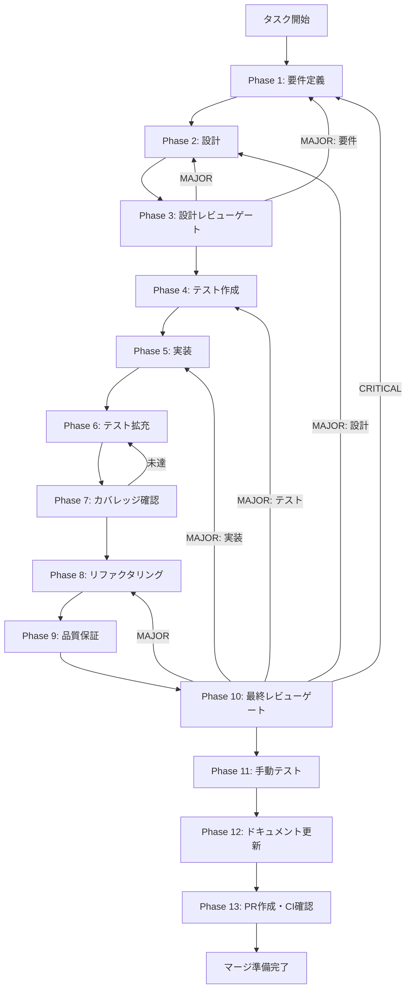

# react-context-di - タスク実行仕様書

## ユーザーからの元の指示

```
React Context DIの実装
- ChatHistoryContextによるDI基盤の構築
- ChatHistoryProviderコンポーネントの実装
- useChatHistory Custom Hookの実装
- Use Cases（5種類）へのアクセスを提供
- テスト用モックプロバイダーの実装
```

## メタ情報

| 項目         | 内容                             |
| ------------ | -------------------------------- |
| タスクID     | UT-006                           |
| タスク名     | React Context DI実装             |
| 分類         | リファクタリング                 |
| 対象機能     | チャット履歴機能（chat-history） |
| 優先度       | 高                               |
| 見積もり規模 | 中規模                           |
| ステータス   | 未実施                           |
| 作成日       | 2026-01-22                       |
| 関連Issue    | #402                             |
| 依存タスク   | UT-005 Drizzle Repository実装    |

---

## タスク概要

### 目的

ReactのContext APIを使用して、Clean ArchitectureのUse CasesとRepositoriesをコンポーネントツリー全体に注入可能にする依存性注入（DI）基盤を構築する。

### 背景

ARCH-001 Clean Architectureリファクタリングにて、`packages/shared`にチャット履歴機能のDomain/Application/Infrastructure層が実装された。これらのUse CaseやリポジトリをElectronアプリ（`apps/desktop`）から利用するには、依存性注入（Dependency Injection）の仕組みが必要である。Clean Architecture設計では、Presentation層（React UI）がApplication層（Use Cases）に依存するが、具体的なRepositoryやServiceの実装は外部から注入される必要がある。

### 最終ゴール

- `ChatHistoryContext`によるDI基盤の構築
- `ChatHistoryProvider`コンポーネントの実装
- `useChatHistory` Custom Hookの実装
- 5種類のUse Cases（CreateChatSession, AddUserMessage, AddAssistantMessage, TogglePinned, SearchSessions）へのアクセスを提供
- テスト用`MockChatHistoryProvider`の実装

### 成果物一覧

| 種別         | 成果物                      | 配置先                                                      |
| ------------ | --------------------------- | ----------------------------------------------------------- |
| Context      | ChatHistoryContext.tsx      | `apps/desktop/src/features/chat-history/context/`           |
| Provider     | ChatHistoryProvider.tsx     | `apps/desktop/src/features/chat-history/context/`           |
| Hook         | useChatHistory.ts           | `apps/desktop/src/features/chat-history/hooks/`             |
| Hook         | useChatHistoryFactory.ts    | `apps/desktop/src/features/chat-history/hooks/`             |
| Mock         | MockChatHistoryProvider.tsx | `apps/desktop/src/features/chat-history/context/__mocks__/` |
| テスト       | ChatHistoryContext.test.tsx | `apps/desktop/src/features/chat-history/context/__tests__/` |
| テスト       | useChatHistory.test.ts      | `apps/desktop/src/features/chat-history/hooks/__tests__/`   |
| ドキュメント | 実装ガイド                  | `outputs/phase-12/`                                         |
| PR           | GitHub Pull Request         | GitHub UI                                                   |

---

## 参照ファイル

本仕様書の実装は以下を参照:

### システム仕様（aiworkflow-requirements）

| 参照資料               | パス                                                                             | 内容                   |
| ---------------------- | -------------------------------------------------------------------------------- | ---------------------- |
| アーキテクチャ仕様     | `.claude/skills/aiworkflow-requirements/references/architecture-chat-history.md` | Clean Architecture構成 |
| インターフェース仕様   | `.claude/skills/aiworkflow-requirements/references/interfaces-chat-history.md`   | 型定義・Repository IF  |
| API仕様                | `.claude/skills/aiworkflow-requirements/references/api-chat-history.md`          | Use Case API詳細       |
| アーキテクチャパターン | `.claude/skills/aiworkflow-requirements/references/architecture-patterns.md`     | Repository Pattern     |

### 関連タスク仕様書

| 参照資料           | パス                                                                          | 内容                 |
| ------------------ | ----------------------------------------------------------------------------- | -------------------- |
| Drizzle Repository | `docs/30-workflows/unassigned-task/task-drizzle-repository-implementation.md` | Repository実装タスク |

---

## タスク分解サマリー

| ID     | フェーズ | サブタスク名       | 責務                               | 依存 |
| ------ | -------- | ------------------ | ---------------------------------- | ---- |
| T-01-1 | Phase 1  | 要件定義           | スコープ・受け入れ基準定義         | -    |
| T-02-1 | Phase 2  | 設計               | Context/Provider/Hook設計          | T-01 |
| T-03-1 | Phase 3  | 設計レビューゲート | 設計妥当性検証                     | T-02 |
| T-04-1 | Phase 4  | テスト作成         | TDD Red（失敗テスト作成）          | T-03 |
| T-05-1 | Phase 5  | 実装               | TDD Green（Context/Provider/Hook） | T-04 |
| T-06-1 | Phase 6  | テスト拡充         | カバレッジ向上テスト追加           | T-05 |
| T-07-1 | Phase 7  | カバレッジ確認     | カバレッジ目標検証                 | T-06 |
| T-08-1 | Phase 8  | リファクタリング   | TDD Refactor（品質改善）           | T-07 |
| T-09-1 | Phase 9  | 品質保証           | 静的解析・型チェック               | T-08 |
| T-10-1 | Phase 10 | 最終レビューゲート | 全体品質・整合性検証               | T-09 |
| T-11-1 | Phase 11 | 手動テスト検証     | 実環境動作確認                     | T-10 |
| T-12-1 | Phase 12 | ドキュメント更新   | 実装ガイド・仕様書更新             | T-11 |
| T-13-1 | Phase 13 | PR作成             | コミット・PR・CI確認               | T-12 |

**総サブタスク数**: 13個

---

## 実行フロー図



---

## Phase一覧

| Phase | 名称               | 仕様書                                                 | ステータス |
| ----- | ------------------ | ------------------------------------------------------ | ---------- |
| 1     | 要件定義           | [phase-1-requirements.md](phase-1-requirements.md)     | 未実施     |
| 2     | 設計               | [phase-2-design.md](phase-2-design.md)                 | 未実施     |
| 3     | 設計レビューゲート | [phase-3-design-review.md](phase-3-design-review.md)   | 未実施     |
| 4     | テスト作成         | [phase-4-test-creation.md](phase-4-test-creation.md)   | 未実施     |
| 5     | 実装               | [phase-5-implementation.md](phase-5-implementation.md) | 未実施     |
| 6     | テスト拡充         | [phase-6-test-expansion.md](phase-6-test-expansion.md) | 未実施     |
| 7     | カバレッジ確認     | [phase-7-coverage-check.md](phase-7-coverage-check.md) | 未実施     |
| 8     | リファクタリング   | [phase-8-refactoring.md](phase-8-refactoring.md)       | 未実施     |
| 9     | 品質保証           | [phase-9-quality.md](phase-9-quality.md)               | 未実施     |
| 10    | 最終レビューゲート | [phase-10-final-review.md](phase-10-final-review.md)   | 未実施     |
| 11    | 手動テスト         | [phase-11-manual-test.md](phase-11-manual-test.md)     | 未実施     |
| 12    | ドキュメント更新   | [phase-12-documentation.md](phase-12-documentation.md) | 未実施     |
| 13    | PR作成             | [phase-13-pr-creation.md](phase-13-pr-creation.md)     | 未実施     |

---

## テストカバレッジ目標

### ユニットテスト

| 指標              | 最低基準 | 推奨基準 |
| ----------------- | -------- | -------- |
| Line Coverage     | 80%      | 90%      |
| Branch Coverage   | 60%      | 70%      |
| Function Coverage | 80%      | 90%      |

### 結合テスト

| 指標                         | 目標 |
| ---------------------------- | ---- |
| Context/Provider連携         | 100% |
| Hook動作                     | 100% |
| 正常系シナリオ               | 100% |
| 異常系シナリオ（Provider外） | 100% |

---

## 統合テスト連携（Phase 1〜11で必須）

各Phaseで以下の統合テスト連携アクションを実施すること:

| Phase | 統合テスト連携アクション                    |
| ----- | ------------------------------------------- |
| 1     | packages/shared Use Casesとの連携要件を明記 |
| 2     | Context/Provider/Hook間の契約を設計に反映   |
| 3     | 統合テスト観点のレビューゲートを実施        |
| 4     | Provider内Use Cases呼び出しテストを作成     |
| 5     | Use Cases連携実装とモック対応               |
| 6     | 統合テストの拡充（エラーケース含む）        |
| 7     | 統合テストの再実行とゲート判定              |
| 8     | リファクタ後の統合テスト継続成功を確認      |
| 9     | 品質保証で統合テスト結果を確認              |
| 10    | 最終レビューで統合テスト結果を確認          |
| 11    | 手動統合テスト（Provider注入確認）を実施    |

---

## Phase完了時の必須アクション

**各Phase完了時に以下を必ず実行すること:**

1. **タスク100%実行**: Phase内で指定された全タスクを完全に実行
2. **成果物確認**: 全ての必須成果物が生成されていることを検証
3. **実行記録**: 実行タスクの結果を記録
4. **artifacts.json更新**: Phase完了ステータスを更新
5. **Phase末端の実行確認**: 各タスクを100%実行し、各タスクを完遂した旨を必ず明記

```bash
# Phase完了時の検証コマンド
node .claude/skills/task-specification-creator/scripts/validate-phase-output.js docs/30-workflows/react-context-di --phase {{PHASE_NUMBER}}

# Phase完了・成果物登録
node .claude/skills/task-specification-creator/scripts/complete-phase.js \
  --workflow docs/30-workflows/react-context-di --phase {{PHASE_NUMBER}} --artifacts "..."
```

---

## 前提条件

本タスク実行前に以下が完了していること:

| 前提条件                | ステータス | 備考                     |
| ----------------------- | ---------- | ------------------------ |
| ARCH-001 Clean Arch完了 | 完了       | packages/shared実装済み  |
| UT-005 Drizzle Repo実装 | 未着手     | Repository実装が必要     |
| Use Cases exports確認   | 未確認     | packages/shared/index.ts |

---

## リスクと対策

| リスク                          | 影響度 | 発生確率 | 対策                                    |
| ------------------------------- | ------ | -------- | --------------------------------------- |
| Use Cases型がexportされていない | 高     | 低       | packages/shared/index.tsを確認・修正    |
| DB接続の初期化タイミング問題    | 中     | 中       | isReadyフラグで初期化完了を管理         |
| テスト時のモック設定が複雑      | 中     | 中       | MockProviderでoverridesを提供           |
| パフォーマンス問題              | 低     | 低       | useMemo/useCallbackで最適化（将来対応） |
