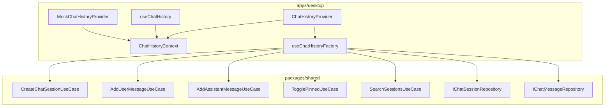

# Phase 1 - 成果物・ディレクトリ構成定義

## 確認日時

2026-01-22

---

## 1. 成果物一覧

| No. | 成果物                      | 種別     | 配置先                                                      |
| --- | --------------------------- | -------- | ----------------------------------------------------------- |
| 1   | ChatHistoryContext.tsx      | Context  | `apps/desktop/src/features/chat-history/context/`           |
| 2   | ChatHistoryProvider.tsx     | Provider | `apps/desktop/src/features/chat-history/context/`           |
| 3   | useChatHistory.ts           | Hook     | `apps/desktop/src/features/chat-history/hooks/`             |
| 4   | useChatHistoryFactory.ts    | Hook     | `apps/desktop/src/features/chat-history/hooks/`             |
| 5   | MockChatHistoryProvider.tsx | Mock     | `apps/desktop/src/features/chat-history/context/__mocks__/` |
| 6   | ChatHistoryContext.test.tsx | Test     | `apps/desktop/src/features/chat-history/context/__tests__/` |
| 7   | useChatHistory.test.ts      | Test     | `apps/desktop/src/features/chat-history/hooks/__tests__/`   |
| 8   | index.ts (context)          | Barrel   | `apps/desktop/src/features/chat-history/context/`           |
| 9   | index.ts (hooks)            | Barrel   | `apps/desktop/src/features/chat-history/hooks/`             |

---

## 2. ディレクトリ構成

```
apps/desktop/src/features/chat-history/
├── context/
│   ├── __mocks__/
│   │   └── MockChatHistoryProvider.tsx
│   ├── __tests__/
│   │   └── ChatHistoryContext.test.tsx
│   ├── ChatHistoryContext.tsx
│   ├── ChatHistoryProvider.tsx
│   └── index.ts
└── hooks/
    ├── __tests__/
    │   └── useChatHistory.test.ts
    ├── useChatHistory.ts
    ├── useChatHistoryFactory.ts
    └── index.ts
```

---

## 3. 成果物詳細

### 3.1 ChatHistoryContext.tsx

**目的**: Context型定義とContext作成

**内容**:

- `ChatHistoryContextValue`型定義
- `ChatHistoryContext`の作成（`createContext`）
- Context初期値（`null`）

**依存関係**:

- `@repo/shared`のUse Cases型

---

### 3.2 ChatHistoryProvider.tsx

**目的**: Use Casesを子コンポーネントに提供

**内容**:

- `ChatHistoryProviderProps`型定義
- Repository受け取りとUse Cases生成
- Context.Providerのラップ

**依存関係**:

- `ChatHistoryContext`
- `useChatHistoryFactory`
- `@repo/shared`のRepository IF

---

### 3.3 useChatHistory.ts

**目的**: Context値を取得するCustom Hook

**内容**:

- `useContext`でContext値取得
- Provider外使用時のエラースロー
- 型安全な戻り値

**依存関係**:

- `ChatHistoryContext`

---

### 3.4 useChatHistoryFactory.ts

**目的**: Use Casesインスタンスの生成

**内容**:

- Repositoryを受け取りUse Casesを生成
- `useMemo`で最適化（オプション）
- 5種のUse Casesを返す

**依存関係**:

- `@repo/shared`のUse Cases
- `@repo/shared`のRepository IF

---

### 3.5 MockChatHistoryProvider.tsx

**目的**: テスト用モックProvider

**内容**:

- デフォルトモック実装
- オーバーライド可能なProps
- スパイ関数対応

**依存関係**:

- `ChatHistoryContext`

---

### 3.6 ChatHistoryContext.test.tsx

**目的**: Context/Providerの結合テスト

**テストケース**:

- Providerが5種Use Casesを提供する
- Provider外でHook使用時にエラー
- MockProviderでオーバーライド可能

---

### 3.7 useChatHistory.test.ts

**目的**: Custom Hookのユニットテスト

**テストケース**:

- Context値の型安全な取得
- 各Use Casesメソッドへのアクセス
- エラースロー動作

---

### 3.8 index.ts (context)

**目的**: Context関連のbarrel export

**Export対象**:

- `ChatHistoryContext`
- `ChatHistoryContextValue`型
- `ChatHistoryProvider`
- `ChatHistoryProviderProps`型

---

### 3.9 index.ts (hooks)

**目的**: Hooks関連のbarrel export

**Export対象**:

- `useChatHistory`
- `useChatHistoryFactory`

---

## 4. 依存関係図



---

## 5. ファイル命名規則

| 種別     | 命名規則                 | 例                          |
| -------- | ------------------------ | --------------------------- |
| Context  | `{Feature}Context.tsx`   | ChatHistoryContext.tsx      |
| Provider | `{Feature}Provider.tsx`  | ChatHistoryProvider.tsx     |
| Hook     | `use{Feature}.ts`        | useChatHistory.ts           |
| Factory  | `use{Feature}Factory.ts` | useChatHistoryFactory.ts    |
| Mock     | `Mock{Feature}*.tsx`     | MockChatHistoryProvider.tsx |
| Test     | `*.test.tsx`/`*.test.ts` | ChatHistoryContext.test.tsx |

---

## 結論

**Phase 1 タスク4: 完了**

成果物一覧とディレクトリ構成が定義され、実装時のファイル配置が明確になった。
