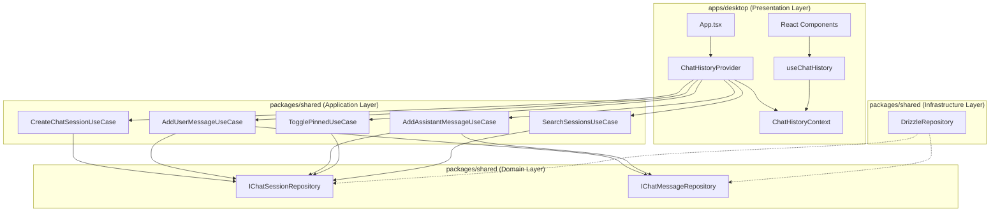
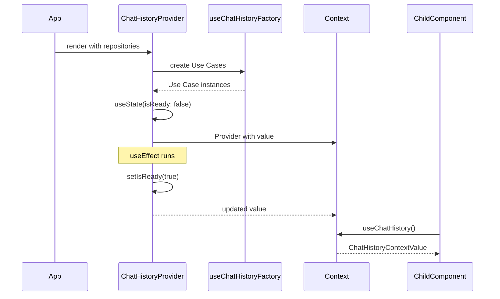
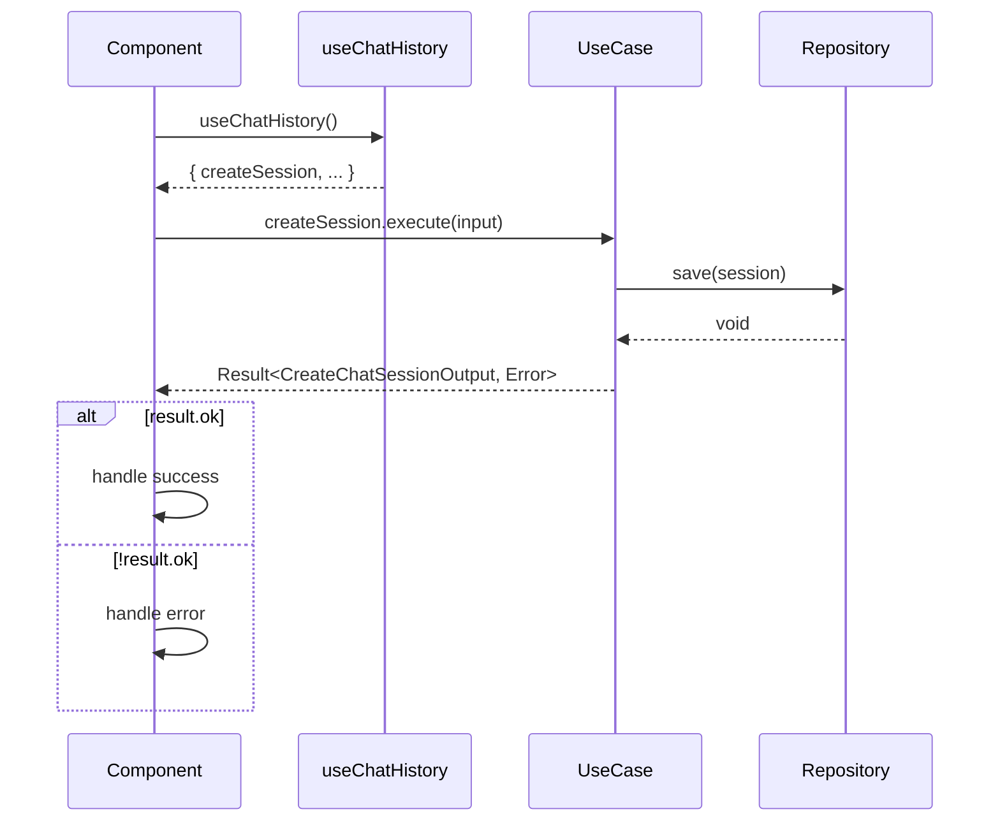

# Phase 2 - 設計ドキュメント

## 確認日時

2026-01-22

---

## 1. 概要

本ドキュメントは、React Context DIの詳細設計を集約したものである。Phase 1で定義した要件に基づき、Context/Provider/Hookの実装設計を記載する。

---

## 2. コンポーネント図

### 2.1 全体アーキテクチャ



### 2.2 ファイル構成

```
apps/desktop/src/features/chat-history/
├── context/
│   ├── __mocks__/
│   │   └── MockChatHistoryProvider.tsx
│   ├── __tests__/
│   │   └── ChatHistoryContext.test.tsx
│   ├── ChatHistoryContext.tsx      # Context定義
│   ├── ChatHistoryProvider.tsx     # Provider実装
│   └── index.ts                    # Barrel export
└── hooks/
    ├── __tests__/
    │   └── useChatHistory.test.ts
    ├── useChatHistory.ts           # Custom Hook
    ├── useChatHistoryFactory.ts    # Factory Hook
    └── index.ts                    # Barrel export
```

---

## 3. 型定義一覧

### 3.1 Context型

```typescript
// ChatHistoryContext.tsx
export interface ChatHistoryContextValue {
  createSession: CreateChatSessionUseCase;
  addUserMessage: AddUserMessageUseCase;
  addAssistantMessage: AddAssistantMessageUseCase;
  togglePinned: TogglePinnedUseCase;
  searchSessions: SearchSessionsUseCase;
  isReady: boolean;
}

export const ChatHistoryContext = createContext<ChatHistoryContextValue | null>(
  null,
);
```

### 3.2 Provider Props型

```typescript
// ChatHistoryProvider.tsx
export interface ChatHistoryProviderProps {
  children: ReactNode;
  sessionRepository?: IChatSessionRepository;
  messageRepository?: IChatMessageRepository;
}
```

### 3.3 MockProvider Props型

```typescript
// MockChatHistoryProvider.tsx
export interface MockChatHistoryProviderProps {
  children: ReactNode;
  overrides?: Partial<ChatHistoryContextValue>;
}
```

### 3.4 Factory Options型

```typescript
// useChatHistoryFactory.ts
interface UseChatHistoryFactoryOptions {
  sessionRepository?: IChatSessionRepository;
  messageRepository?: IChatMessageRepository;
}

interface UseChatHistoryFactoryResult {
  createSession: CreateChatSessionUseCase;
  addUserMessage: AddUserMessageUseCase;
  addAssistantMessage: AddAssistantMessageUseCase;
  togglePinned: TogglePinnedUseCase;
  searchSessions: SearchSessionsUseCase;
}
```

---

## 4. データフロー

### 4.1 初期化フロー



### 4.2 Use Case実行フロー



---

## 5. エラーハンドリング方針

### 5.1 Provider外使用エラー

```typescript
// useChatHistory.ts
if (context === null) {
  throw new Error("useChatHistory must be used within a ChatHistoryProvider");
}
```

| 状況                 | 処理                   |
| -------------------- | ---------------------- |
| Provider外でHook使用 | Errorをスロー          |
| エラーメッセージ     | 英語で明確なガイダンス |
| 回復方法             | Providerでラップする   |

### 5.2 Use Case実行エラー

```typescript
const result = await useCase.execute(input);

if (!result.ok) {
  // result.error.code による分岐
  switch (result.error.code) {
    case "SESSION_NOT_FOUND":
      // セッション未発見
      break;
    case "REPOSITORY_ERROR":
      // DB関連エラー
      break;
    default:
    // その他のエラー
  }
}
```

| エラーコード        | 対処方法            |
| ------------------- | ------------------- |
| INVALID_USER_ID     | ユーザーIDの検証    |
| INVALID_TITLE       | タイトルの検証      |
| INVALID_SESSION_ID  | セッションIDの検証  |
| SESSION_NOT_FOUND   | セッションの再取得  |
| MAX_PINNED_SESSIONS | ピン留め解除の案内  |
| REPOSITORY_ERROR    | リトライ/エラー表示 |

### 5.3 初期化エラー

```typescript
// ChatHistoryProvider.tsx
useEffect(() => {
  const initialize = async () => {
    try {
      // 初期化処理
      setIsReady(true);
    } catch (error) {
      console.error("ChatHistoryProvider initialization failed:", error);
      // 将来: エラー状態の管理
    }
  };
  initialize();
}, []);
```

---

## 6. テスト設計

### 6.1 テストカテゴリ

| カテゴリ       | 対象                | ツール |
| -------------- | ------------------- | ------ |
| ユニットテスト | useChatHistory Hook | Vitest |
| 結合テスト     | Provider + Hook連携 | RTL    |
| モックテスト   | MockProvider動作    | Vitest |

### 6.2 テストケース概要

**ChatHistoryContext.test.tsx**

1. Providerが5種Use Casesを提供する
2. Provider外でHook使用時にエラー
3. isReadyがtrueになる
4. MockProviderでオーバーライド可能

**useChatHistory.test.ts**

1. Context値の型安全な取得
2. 各Use Casesメソッドへのアクセス
3. エラースロー動作

---

## 7. パフォーマンス考慮事項

### 7.1 メモ化戦略

| コンポーネント        | メモ化手法 | 目的                      |
| --------------------- | ---------- | ------------------------- |
| useChatHistoryFactory | useMemo    | Use Cases再生成防止       |
| Provider contextValue | useMemo    | Context値の不要な更新防止 |

### 7.2 最適化方針

- **Phase 5での最適化**: 基本実装後、必要に応じてuseMemo/useCallbackを追加
- **過度な最適化回避**: 仕様書に従い、過度なuseMemoは避ける

---

## 8. 設計成果物一覧

| 成果物               | パス                                         | 内容                 |
| -------------------- | -------------------------------------------- | -------------------- |
| Context型設計        | `outputs/phase-2/context-type-design.md`     | Context型定義        |
| Provider設計         | `outputs/phase-2/provider-design.md`         | Provider設計         |
| Hook設計             | `outputs/phase-2/hook-design.md`             | Custom Hook設計      |
| MockProvider設計     | `outputs/phase-2/mock-provider-design.md`    | テスト用Provider設計 |
| インターフェース整合 | `outputs/phase-2/interface-compatibility.md` | 型整合性確認         |
| 設計ドキュメント     | `outputs/phase-2/design-document.md`         | 本文書（集約）       |

---

## 9. Phase 2完了確認

### 9.1 完了タスク

| タスク                        | ステータス | 成果物                       |
| ----------------------------- | ---------- | ---------------------------- |
| タスク1: Context型設計        | ✅ 完了    | context-type-design.md       |
| タスク2: Provider設計         | ✅ 完了    | provider-design.md           |
| タスク3: Hook設計             | ✅ 完了    | hook-design.md               |
| タスク4: MockProvider設計     | ✅ 完了    | mock-provider-design.md      |
| タスク5: インターフェース確認 | ✅ 完了    | interface-compatibility.md   |
| タスク6: 設計ドキュメント     | ✅ 完了    | design-document.md（本文書） |

### 9.2 成果物配置確認

```
outputs/phase-2/
├── context-type-design.md      ✅
├── provider-design.md          ✅
├── hook-design.md              ✅
├── mock-provider-design.md     ✅
├── interface-compatibility.md  ✅
└── design-document.md          ✅
```

---

## 結論

**Phase 2: 設計 - 完了**

全6タスクを100%実行完了し、必要な成果物を全て生成した。
次のPhase 3（設計レビューゲート）への準備が整った。
