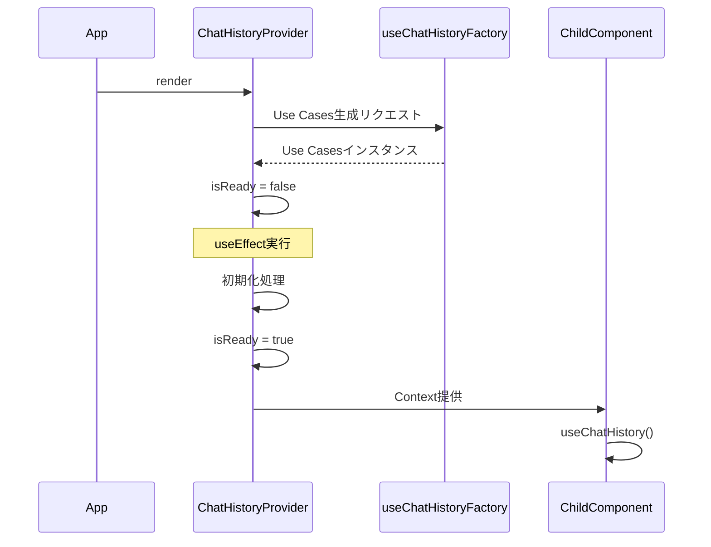

# Phase 2 - Provider設計

## 確認日時

2026-01-22

---

## 1. ChatHistoryProvider Props型

### 1.1 型定義

```typescript
import type { ReactNode } from "react";
import type {
  IChatSessionRepository,
  IChatMessageRepository,
} from "@repo/shared";

/**
 * ChatHistoryProvider Props
 */
export interface ChatHistoryProviderProps {
  /**
   * 子コンポーネント
   */
  children: ReactNode;

  /**
   * カスタムセッションリポジトリ（テスト・開発用）
   * 未指定時はデフォルトリポジトリを使用
   */
  sessionRepository?: IChatSessionRepository;

  /**
   * カスタムメッセージリポジトリ（テスト・開発用）
   * 未指定時はデフォルトリポジトリを使用
   */
  messageRepository?: IChatMessageRepository;
}
```

### 1.2 設計根拠

| Props             | 必須 | 説明                             |
| ----------------- | ---- | -------------------------------- |
| children          | ✅   | Reactの子コンポーネント          |
| sessionRepository | -    | DI用（テスト・開発環境で上書き） |
| messageRepository | -    | DI用（テスト・開発環境で上書き） |

---

## 2. Provider実装設計

### 2.1 コンポーネント構造

```typescript
import { type ReactNode, useMemo, useState, useEffect } from "react";
import { ChatHistoryContext, type ChatHistoryContextValue } from "./ChatHistoryContext";
import { useChatHistoryFactory } from "../hooks/useChatHistoryFactory";
import type {
  IChatSessionRepository,
  IChatMessageRepository,
} from "@repo/shared";

export function ChatHistoryProvider({
  children,
  sessionRepository,
  messageRepository,
}: ChatHistoryProviderProps): JSX.Element {
  const [isReady, setIsReady] = useState(false);

  // Use Casesの生成（Factory Hook使用）
  const useCases = useChatHistoryFactory({
    sessionRepository,
    messageRepository,
  });

  // 初期化処理
  useEffect(() => {
    // Repository初期化完了を待機
    // 将来的にはDB接続確認等を実施
    setIsReady(true);
  }, []);

  // Context値をメモ化
  const contextValue = useMemo<ChatHistoryContextValue>(
    () => ({
      ...useCases,
      isReady,
    }),
    [useCases, isReady]
  );

  return (
    <ChatHistoryContext.Provider value={contextValue}>
      {children}
    </ChatHistoryContext.Provider>
  );
}
```

### 2.2 設計ポイント

| ポイント         | 説明                                        |
| ---------------- | ------------------------------------------- |
| useMemo使用      | Context値の不要な再生成を防止               |
| Factory Hook分離 | Use Cases生成ロジックを分離（テスト容易性） |
| isReadyフラグ    | 初期化完了を子コンポーネントに通知          |

---

## 3. 初期化フロー

### 3.1 フロー図



### 3.2 状態遷移

```
[マウント] → isReady: false → [初期化完了] → isReady: true
```

---

## 4. Factory Hook設計

### 4.1 useChatHistoryFactory

```typescript
import { useMemo } from "react";
import {
  CreateChatSessionUseCase,
  AddUserMessageUseCase,
  AddAssistantMessageUseCase,
  TogglePinnedUseCase,
  SearchSessionsUseCase,
  type IChatSessionRepository,
  type IChatMessageRepository,
} from "@repo/shared";

interface UseChatHistoryFactoryOptions {
  sessionRepository?: IChatSessionRepository;
  messageRepository?: IChatMessageRepository;
}

interface UseChatHistoryFactoryResult {
  createSession: CreateChatSessionUseCase;
  addUserMessage: AddUserMessageUseCase;
  addAssistantMessage: AddAssistantMessageUseCase;
  togglePinned: TogglePinnedUseCase;
  searchSessions: SearchSessionsUseCase;
}

export function useChatHistoryFactory(
  options: UseChatHistoryFactoryOptions = {},
): UseChatHistoryFactoryResult {
  const { sessionRepository, messageRepository } = options;

  return useMemo(() => {
    // デフォルトリポジトリの取得（将来実装）
    const sessionRepo = sessionRepository ?? getDefaultSessionRepository();
    const messageRepo = messageRepository ?? getDefaultMessageRepository();

    return {
      createSession: new CreateChatSessionUseCase(sessionRepo),
      addUserMessage: new AddUserMessageUseCase(sessionRepo, messageRepo),
      addAssistantMessage: new AddAssistantMessageUseCase(
        sessionRepo,
        messageRepo,
      ),
      togglePinned: new TogglePinnedUseCase(sessionRepo),
      searchSessions: new SearchSessionsUseCase(sessionRepo),
    };
  }, [sessionRepository, messageRepository]);
}
```

### 4.2 デフォルトリポジトリ

```typescript
// 将来のDrizzle Repository実装用プレースホルダー
function getDefaultSessionRepository(): IChatSessionRepository {
  // UT-005完了後に実装
  throw new Error("Default SessionRepository not implemented yet");
}

function getDefaultMessageRepository(): IChatMessageRepository {
  // UT-005完了後に実装
  throw new Error("Default MessageRepository not implemented yet");
}
```

---

## 5. Repository注入パターン

### 5.1 本番環境

```tsx
// apps/desktop/src/App.tsx
import { ChatHistoryProvider } from "@/features/chat-history/context";
import {
  DrizzleSessionRepository,
  DrizzleMessageRepository,
} from "@repo/shared";

function App() {
  return (
    <ChatHistoryProvider
      sessionRepository={new DrizzleSessionRepository(db)}
      messageRepository={new DrizzleMessageRepository(db)}
    >
      <MainContent />
    </ChatHistoryProvider>
  );
}
```

### 5.2 テスト環境

```tsx
// テストファイル
import { MockChatHistoryProvider } from "@/features/chat-history/context/__mocks__";

describe("ChatComponent", () => {
  it("should render", () => {
    render(
      <MockChatHistoryProvider>
        <ChatComponent />
      </MockChatHistoryProvider>,
    );
  });
});
```

---

## 6. エラーハンドリング

### 6.1 Repository未提供時

```typescript
// 開発時は警告を出力
if (process.env.NODE_ENV === "development") {
  if (!sessionRepository || !messageRepository) {
    console.warn(
      "ChatHistoryProvider: Using mock repositories. " +
        "Provide real repositories for production.",
    );
  }
}
```

### 6.2 初期化エラー

```typescript
useEffect(() => {
  const initialize = async () => {
    try {
      // 初期化処理
      setIsReady(true);
    } catch (error) {
      console.error("ChatHistoryProvider initialization failed:", error);
      // エラー状態の管理は将来対応
    }
  };

  initialize();
}, []);
```

---

## 結論

**Phase 2 タスク2: 完了**

ChatHistoryProviderのコンポーネント設計とFactory Hook設計が完了した。
