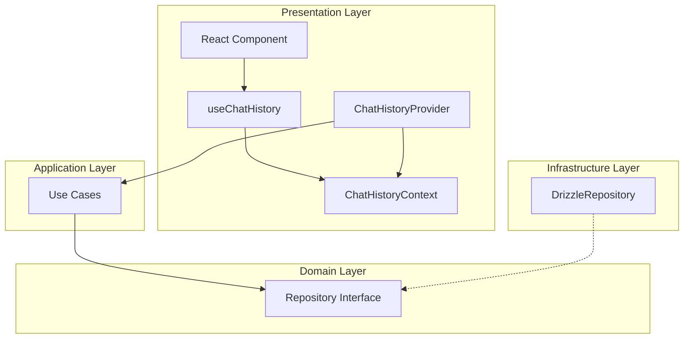

# Phase 3 - アーキテクチャレビュー

## 確認日時

2026-01-22

---

## 1. 参照資料

| 参照資料           | パス                                                                             |
| ------------------ | -------------------------------------------------------------------------------- |
| アーキテクチャ仕様 | `.claude/skills/aiworkflow-requirements/references/architecture-chat-history.md` |
| 設計ドキュメント   | `outputs/phase-2/design-document.md`                                             |

---

## 2. Clean Architecture原則との整合性

### 2.1 依存性逆転の原則（DIP）

| 確認項目                                 | 設計での対応                                   | 判定 |
| ---------------------------------------- | ---------------------------------------------- | ---- |
| Presentation層→Application層依存         | Context/HookがUse Casesに依存                  | ✅   |
| Use CasesがInterface経由でRepository使用 | IChatSessionRepository, IChatMessageRepository | ✅   |
| 具体的な実装への非依存                   | DrizzleRepoはProviderで注入                    | ✅   |

**判定**: ✅ PASS

### 2.2 層間の依存方向

```
Presentation Layer (apps/desktop)
    ↓ 依存
Application Layer (packages/shared - Use Cases)
    ↓ 依存
Domain Layer (packages/shared - Entities, Repositories IF)
    ↓ 実装
Infrastructure Layer (packages/shared - DrizzleRepository)
```

| 確認項目                | 設計での対応                       | 判定 |
| ----------------------- | ---------------------------------- | ---- |
| 外側→内側への依存       | ✅ Presentation→Application→Domain | ✅   |
| 内側→外側への非依存     | ✅ Domain層はInfraに依存しない     | ✅   |
| Interface経由の依存逆転 | ✅ Repository IFで逆転             | ✅   |

**判定**: ✅ PASS

### 2.3 Repository Pattern

| 確認項目                 | 設計での対応                           | 判定 |
| ------------------------ | -------------------------------------- | ---- |
| Repository Interface定義 | Domain層でIChatSessionRepository等定義 | ✅   |
| Repository実装の分離     | Infrastructure層にDrizzleRepo          | ✅   |
| Provider経由での注入     | ChatHistoryProviderPropsで受け取り     | ✅   |
| テスト時のモック注入     | MockChatHistoryProviderでモック提供    | ✅   |

**判定**: ✅ PASS

### 2.4 Use Case単一責務

| Use Case                   | 責務                       | 単一責務 | 判定 |
| -------------------------- | -------------------------- | -------- | ---- |
| CreateChatSessionUseCase   | セッション作成             | ✅       | ✅   |
| AddUserMessageUseCase      | ユーザーメッセージ追加     | ✅       | ✅   |
| AddAssistantMessageUseCase | アシスタントメッセージ追加 | ✅       | ✅   |
| TogglePinnedUseCase        | ピン留めトグル             | ✅       | ✅   |
| SearchSessionsUseCase      | セッション検索             | ✅       | ✅   |

**判定**: ✅ PASS

---

## 3. コンポーネント依存関係

### 3.1 依存関係図



### 3.2 依存関係の妥当性

| 依存関係                  | 妥当性                         | 判定 |
| ------------------------- | ------------------------------ | ---- |
| Component → Hook          | ✅ 自然な依存                  | ✅   |
| Hook → Context            | ✅ Context APIの標準的な使用   | ✅   |
| Provider → Use Cases      | ✅ Application層への正しい依存 | ✅   |
| Use Cases → Repository IF | ✅ 依存性逆転の正しい実装      | ✅   |
| RepoImpl → Repository IF  | ✅ インターフェースの実装      | ✅   |

---

## 4. 統合テスト観点

### 4.1 統合テスト可能性

| テスト観点                 | 設計での対応                 | 判定 |
| -------------------------- | ---------------------------- | ---- |
| Context/Provider連携テスト | renderHookで検証可能         | ✅   |
| Use Cases呼び出しテスト    | MockProviderでモック可能     | ✅   |
| Repository注入テスト       | Provider Propsで注入可能     | ✅   |
| エラーケーステスト         | Result型でエラーをテスト可能 | ✅   |

### 4.2 データフロー検証可能性

| フロー             | 検証方法                     | 判定 |
| ------------------ | ---------------------------- | ---- |
| Provider → Context | Context.Provider valueの検証 | ✅   |
| Hook → Context     | useContext結果の検証         | ✅   |
| Use Case実行       | vi.fn()でモック・検証        | ✅   |
| エラー伝播         | Result.errorの検証           | ✅   |

---

## 5. アーキテクチャ上の懸念事項

### 5.1 検出された問題

**なし** - 設計はClean Architecture原則に準拠している。

### 5.2 改善提案（将来対応）

| 項目                 | 現状                | 改善案             | 優先度 |
| -------------------- | ------------------- | ------------------ | ------ |
| デフォルトRepository | 未実装（UT-005）    | UT-005完了後に連携 | 中     |
| エラーバウンダリ     | スコープ外          | 将来タスクで対応   | 低     |
| パフォーマンス最適化 | 基本的なuseMemoのみ | 必要に応じて追加   | 低     |

---

## 6. 総合判定

| カテゴリ           | 項目数 | PASS   | FAIL  |
| ------------------ | ------ | ------ | ----- |
| 依存性逆転         | 3      | 3      | 0     |
| 層間依存           | 3      | 3      | 0     |
| Repository Pattern | 4      | 4      | 0     |
| Use Case単一責務   | 5      | 5      | 0     |
| 依存関係妥当性     | 5      | 5      | 0     |
| 統合テスト可能性   | 4      | 4      | 0     |
| **合計**           | **24** | **24** | **0** |

---

## 結論

**Phase 3 タスク2: 完了**

アーキテクチャレビュー結果: **PASS**

設計はClean Architecture原則に完全に準拠しており、依存性逆転・層間依存・Repository Patternが正しく実装されている。
