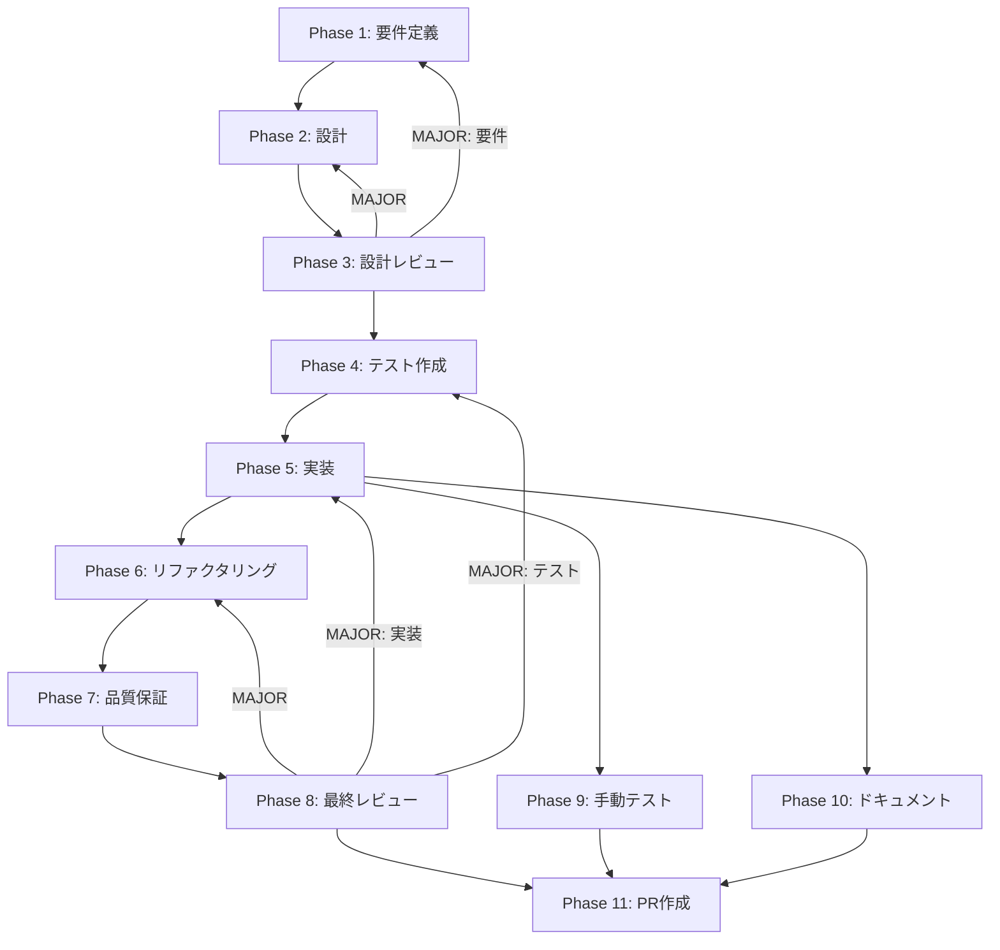

# Repository パターン実装 - ワークフローインデックス

## タスク概要

| 項目       | 内容                                           |
| ---------- | ---------------------------------------------- |
| タスクID   | CONV-04-06                                     |
| タスク名   | Repository パターン実装                        |
| 依存       | CONV-04-02, CONV-04-03, CONV-04-04, CONV-04-05 |
| 規模       | 中                                             |
| 出力場所   | `packages/shared/src/db/repositories/`         |
| ステータス | 未実施                                         |
| 作成日     | 2026-01-05                                     |

## 目的

各テーブルに対するCRUD操作を抽象化したRepositoryクラスを実装する。
データアクセス層とビジネスロジック層を分離し、テスタビリティを向上させる。

## 成果物一覧

| 種別         | 成果物               | 配置先                                  |
| ------------ | -------------------- | --------------------------------------- |
| コード       | BaseRepository       | `packages/shared/src/db/repositories/`  |
| コード       | FileRepository       | `packages/shared/src/db/repositories/`  |
| コード       | ChunkRepository      | `packages/shared/src/db/repositories/`  |
| コード       | EntityRepository     | `packages/shared/src/db/repositories/`  |
| コード       | Repositoryファクトリ | `packages/shared/src/db/repositories/`  |
| テスト       | Repository単体テスト | `packages/shared/src/db/repositories/`  |
| ドキュメント | Phase成果物          | `docs/30-workflows/repository-pattern/` |

## Phase一覧

| Phase | 名称               | ステータス | 仕様書                                                         |
| ----- | ------------------ | ---------- | -------------------------------------------------------------- |
| 1     | 要件定義           | 未実施     | [phase-1-requirements.md](./phase-1-requirements.md)           |
| 2     | 設計               | 未実施     | [phase-2-design.md](./phase-2-design.md)                       |
| 3     | 設計レビューゲート | 未実施     | [phase-3-review-gate.md](./phase-3-review-gate.md)             |
| 4     | テスト作成         | 未実施     | [phase-4-test-creation.md](./phase-4-test-creation.md)         |
| 5     | 実装               | 未実施     | [phase-5-implementation.md](./phase-5-implementation.md)       |
| 6     | リファクタリング   | 未実施     | [phase-6-refactoring.md](./phase-6-refactoring.md)             |
| 7     | 品質保証           | 未実施     | [phase-7-quality-assurance.md](./phase-7-quality-assurance.md) |
| 8     | 最終レビューゲート | 未実施     | [phase-8-final-review.md](./phase-8-final-review.md)           |
| 9     | 手動テスト検証     | 未実施     | [phase-9-manual-test.md](./phase-9-manual-test.md)             |
| 10    | ドキュメント更新   | 未実施     | [phase-10-documentation.md](./phase-10-documentation.md)       |
| 11    | PR作成             | 未実施     | [phase-11-pr-creation.md](./phase-11-pr-creation.md)           |

## 使用スキル一覧

| Phase | スキル名                         | 用途                     |
| ----- | -------------------------------- | ------------------------ |
| 1     | requirements-engineering         | 要件抽出・仕様化         |
| 1     | acceptance-criteria-writing      | 受け入れ基準作成         |
| 2     | repository-pattern               | Repositoryパターン設計   |
| 2     | drizzle-orm                      | Drizzle ORMスキーマ設計  |
| 2     | type-safety-patterns             | TypeScript型安全パターン |
| 3     | design-review                    | 設計レビュー実施         |
| 4     | tdd-principles                   | TDD原則適用              |
| 4     | test-doubles                     | モック・スタブ設計       |
| 5     | repository-pattern               | Repository実装           |
| 5     | error-handling-patterns          | エラーハンドリング実装   |
| 6     | refactoring-patterns             | リファクタリング実施     |
| 6     | clean-code-practices             | コード品質改善           |
| 7     | static-analysis                  | 静的解析実施             |
| 10    | api-documentation-best-practices | API ドキュメント作成     |

## 依存関係図

## 参照資料

| 資料名                  | パス                                                                 |
| ----------------------- | -------------------------------------------------------------------- |
| 未タスク指示書          | `docs/30-workflows/unassigned-task/task-04-06-repository-pattern.md` |
| aiworkflow-requirements | `.claude/skills/aiworkflow-requirements/`                            |
| RAG型定義               | `packages/shared/src/types/rag/`                                     |
| DBスキーマ              | `packages/shared/src/db/schema/`                                     |
