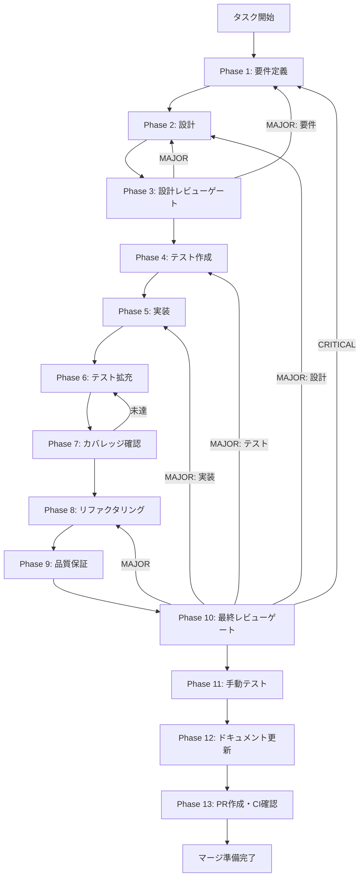

# RRF Fusion + Reranking - タスク実行仕様書

## ユーザーからの元の指示

```
3つの検索戦略（キーワード・ベクトル・グラフ）の結果をReciprocal Rank Fusion (RRF)で統合し、Cross-Encoder Rerankingで最終順位を決定する機能を実装する。
```

## メタ情報

| 項目         | 内容                               |
| ------------ | ---------------------------------- |
| タスクID     | CONV-07-05                         |
| タスク名     | rrf-fusion-reranking               |
| 分類         | 新機能                             |
| 対象機能     | HybridRAG検索エンジン              |
| 親タスク     | CONV-07 (HybridRAG検索エンジン)    |
| 依存タスク   | CONV-07-02, CONV-07-03, CONV-07-04 |
| 優先度       | 高                                 |
| 見積もり規模 | 中規模（0.5日）                    |
| ステータス   | 未実施                             |
| 作成日       | 2026-01-13                         |

---

## タスク概要

### 目的

3つの検索戦略（Keyword検索・Semantic検索・Graph検索）からの結果を統合し、最も関連性の高い検索結果を返す。RRF (Reciprocal Rank Fusion) アルゴリズムで複数検索結果を統合し、Cross-Encoder Rerankingでクエリとの関連性を再評価して最終順位を決定する。

### 背景

HybridRAG検索エンジンでは、3つの異なる検索戦略がそれぞれ異なる観点から関連ドキュメントを検索する:

1. **Keyword検索**: FTS5/BM25による全文検索（正確なキーワードマッチ）
2. **Semantic検索**: DiskANNベクトル検索（意味的類似性）
3. **Graph検索**: Knowledge Graphベースの検索（エンティティ関係性）

これらの結果を単純に結合すると、スコア分布の違いや重複結果の扱いが問題となる。RRFはランク情報のみを使用するため、異なるスコア分布を持つ結果セットを公平に統合できる。さらに、Rerankingによりクエリと各候補の関連性を直接評価することで、検索精度を向上させる。

### 最終ゴール

1. `RRFFusion`クラスによる複数検索結果の統合
2. `WeightedScoreFusion`クラスによる代替統合方式
3. `IReranker`インターフェースと複数実装（LLM/Cohere/Voyage/NoOp）
4. 統合テスト・ユニットテストによる品質保証
5. TypeScript型安全性・ESLint/Prettier準拠

### 成果物一覧

| 種別         | 成果物                         | 配置先                                                                    |
| ------------ | ------------------------------ | ------------------------------------------------------------------------- |
| 機能         | RRFFusion                      | `packages/shared/src/services/search/fusion/rrf-fusion.ts`                |
| 機能         | WeightedScoreFusion            | `packages/shared/src/services/search/fusion/rrf-fusion.ts`                |
| 機能         | LLMReranker                    | `packages/shared/src/services/search/reranking/cross-encoder-reranker.ts` |
| 機能         | CohereReranker                 | `packages/shared/src/services/search/reranking/cross-encoder-reranker.ts` |
| 機能         | VoyageReranker                 | `packages/shared/src/services/search/reranking/cross-encoder-reranker.ts` |
| 機能         | NoOpReranker                   | `packages/shared/src/services/search/reranking/cross-encoder-reranker.ts` |
| 型定義       | FusedSearchResult, IReranker等 | `packages/shared/src/services/search/types.ts`                            |
| テスト       | Fusion/Rerankerテスト          | `packages/shared/src/services/search/**/__tests__/`                       |
| ドキュメント | 実装ガイド・API仕様            | `outputs/phase-*/`                                                        |
| PR           | GitHub Pull Request            | GitHub UI                                                                 |

---

## 参照ファイル

本仕様書のコマンド選定は以下を参照:

- `docs/00-requirements/master_system_design.md` - システム要件
- `.claude/skills/aiworkflow-requirements/references/` - システム仕様
- `docs/30-workflows/unassigned-task/task-07-05-rrf-fusion-reranking.md` - タスク指示書

---

## タスク分解サマリー

| ID     | フェーズ | サブタスク名               | 責務                   | 依存 |
| ------ | -------- | -------------------------- | ---------------------- | ---- |
| T-01-1 | Phase 1  | 要件定義・受け入れ基準策定 | スコープ・基準定義     | -    |
| T-02-1 | Phase 2  | アーキテクチャ・詳細設計   | 設計ドキュメント作成   | T-01 |
| T-03-1 | Phase 3  | 設計レビュー               | 設計妥当性検証         | T-02 |
| T-04-1 | Phase 4  | テストケース作成（Red）    | 失敗するテスト作成     | T-03 |
| T-05-1 | Phase 5  | 実装（Green）              | テストを通す実装       | T-04 |
| T-06-1 | Phase 6  | テスト拡充                 | カバレッジ向上         | T-05 |
| T-07-1 | Phase 7  | カバレッジ確認ゲート       | カバレッジ基準検証     | T-06 |
| T-08-1 | Phase 8  | リファクタリング           | コード品質改善         | T-07 |
| T-09-1 | Phase 9  | 品質保証                   | 静的解析・セキュリティ | T-08 |
| T-10-1 | Phase 10 | 最終レビューゲート         | 全体品質検証           | T-09 |
| T-11-1 | Phase 11 | 手動テスト検証             | 実環境動作確認         | T-10 |
| T-12-1 | Phase 12 | ドキュメント更新           | 実装ガイド・仕様更新   | T-11 |
| T-13-1 | Phase 13 | PR作成・CI確認             | マージ準備             | T-12 |

**総サブタスク数**: 13個

---

## 実行フロー図



---

## Phase一覧

| Phase | 名称               | 仕様書                                                 | ステータス |
| ----- | ------------------ | ------------------------------------------------------ | ---------- |
| 1     | 要件定義           | [phase-1-requirements.md](phase-1-requirements.md)     | 未実施     |
| 2     | 設計               | [phase-2-design.md](phase-2-design.md)                 | 未実施     |
| 3     | 設計レビューゲート | [phase-3-design-review.md](phase-3-design-review.md)   | 未実施     |
| 4     | テスト作成         | [phase-4-test-creation.md](phase-4-test-creation.md)   | 未実施     |
| 5     | 実装               | [phase-5-implementation.md](phase-5-implementation.md) | 未実施     |
| 6     | テスト拡充         | [phase-6-test-expansion.md](phase-6-test-expansion.md) | 未実施     |
| 7     | カバレッジ確認     | [phase-7-coverage-check.md](phase-7-coverage-check.md) | 未実施     |
| 8     | リファクタリング   | [phase-8-refactoring.md](phase-8-refactoring.md)       | 未実施     |
| 9     | 品質保証           | [phase-9-quality.md](phase-9-quality.md)               | 未実施     |
| 10    | 最終レビューゲート | [phase-10-final-review.md](phase-10-final-review.md)   | 未実施     |
| 11    | 手動テスト         | [phase-11-manual-test.md](phase-11-manual-test.md)     | 未実施     |
| 12    | ドキュメント更新   | [phase-12-documentation.md](phase-12-documentation.md) | 未実施     |
| 13    | PR作成             | [phase-13-pr-creation.md](phase-13-pr-creation.md)     | 未実施     |

---

## テストカバレッジ目標

### ユニットテスト

| 指標              | 最低基準 | 推奨基準 |
| ----------------- | -------- | -------- |
| Line Coverage     | 80%      | 90%      |
| Branch Coverage   | 60%      | 70%      |
| Function Coverage | 80%      | 90%      |

### 結合テスト

| 指標                         | 目標 |
| ---------------------------- | ---- |
| APIエンドポイント            | 100% |
| モジュール間インターフェース | 100% |
| 正常系シナリオ               | 100% |
| 異常系シナリオ               | 80%+ |
| 外部連携ポイント             | 100% |

---

## 統合テスト連携（Phase 1〜11で必須）

各Phaseで以下の統合テスト連携アクションを実施すること:

| Phase | 統合テスト連携アクション                        |
| ----- | ----------------------------------------------- |
| 1     | 接続要件（API/認証/データフロー）を要件に明記   |
| 2     | 統合ポイント/契約（API・スキーマ）を設計に反映  |
| 3     | 統合テスト観点のレビューゲートを実施            |
| 4     | 統合テストシナリオを全カテゴリで作成            |
| 5     | フロント/バック接続の実装とテスト支援コード整備 |
| 6     | 統合テストの拡充（全カテゴリのカバレッジ向上）  |
| 7     | 統合テストの再実行とゲート判定                  |
| 8     | リファクタ後の統合テスト継続成功を確認          |
| 9     | 品質保証で統合テスト結果を確認                  |
| 10    | 最終レビューで統合テスト結果を確認              |
| 11    | 手動統合テスト（UI/API接続）を確認              |

---

## Phase完了時の必須アクション

**各Phase完了時に以下を必ず実行すること:**

1. **タスク100%実行**: Phase内で指定された全タスクを完全に実行
2. **成果物確認**: 全ての必須成果物が生成されていることを検証
3. **実行記録**: 実行タスクの結果を記録
4. **artifacts.json更新**: Phase完了ステータスを更新
5. **Phase末端の実行確認**: 各タスクを100%実行し、各タスクを完遂した旨を必ず明記

```bash
# Phase完了時の検証コマンド
node .claude/skills/task-specification-creator/scripts/validate-phase-output.mjs docs/30-workflows/rrf-fusion-reranking --phase {{PHASE_NUMBER}}

# Phase完了・成果物登録
node .claude/skills/task-specification-creator/scripts/complete-phase.mjs \
  --workflow docs/30-workflows/rrf-fusion-reranking --phase {{PHASE_NUMBER}} --artifacts "..."
```

---

## 関連システム仕様

> 実装前に必ず以下のシステム仕様を確認し、既存設計との整合性を確保してください。

| 参照資料                | パス                                                                         | 内容                           |
| ----------------------- | ---------------------------------------------------------------------------- | ------------------------------ |
| RAG検索インターフェース | `.claude/skills/aiworkflow-requirements/references/interfaces-rag-search.md` | SearchQuery/SearchResult型定義 |
| RAGアーキテクチャ       | `.claude/skills/aiworkflow-requirements/references/architecture-rag.md`      | HybridRAG全体設計              |
| コアインターフェース    | `.claude/skills/aiworkflow-requirements/references/interfaces-core.md`       | Result型等のコア型定義         |

**仕様検索**: `node .claude/skills/aiworkflow-requirements/scripts/search-spec.mjs "RRF"`

---

## 次のステップ

Phase 1の仕様書（[phase-1-requirements.md](phase-1-requirements.md)）から実行を開始してください。
