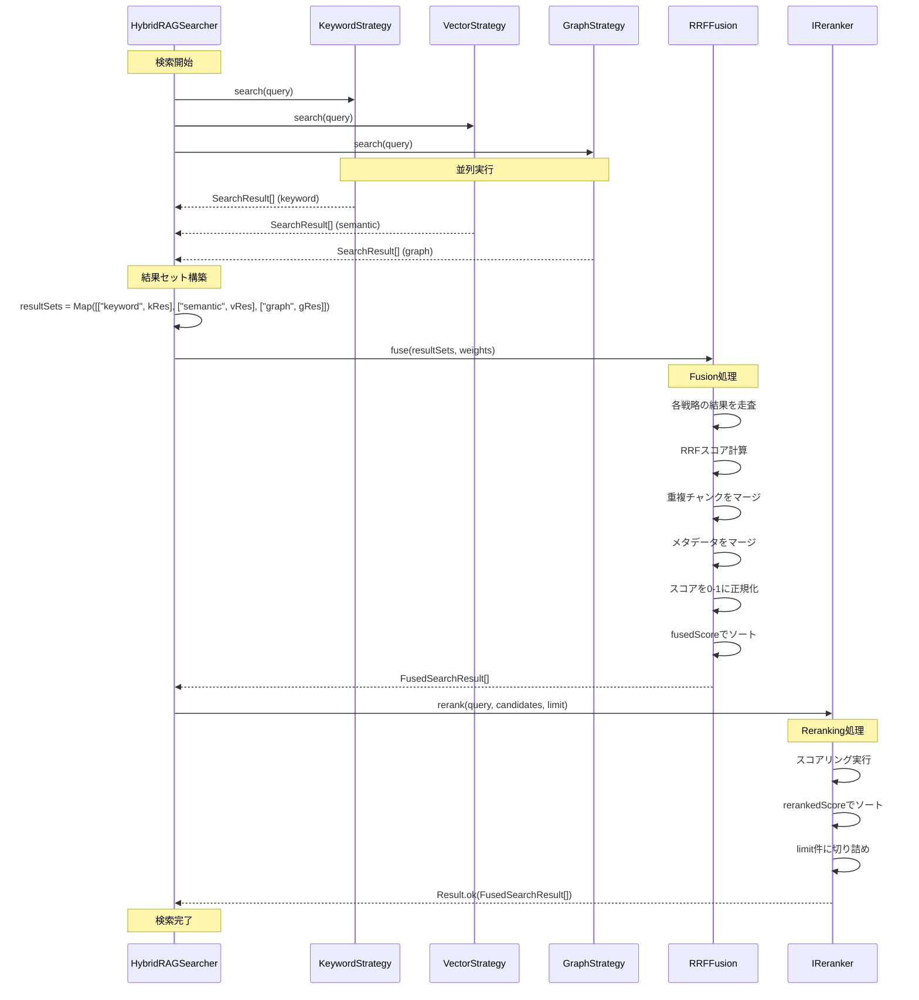
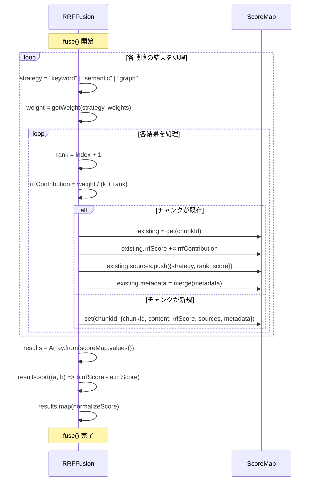
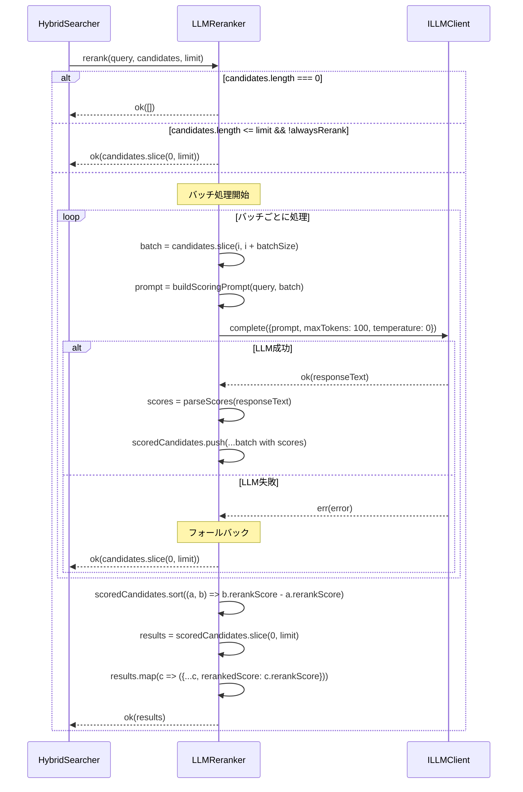
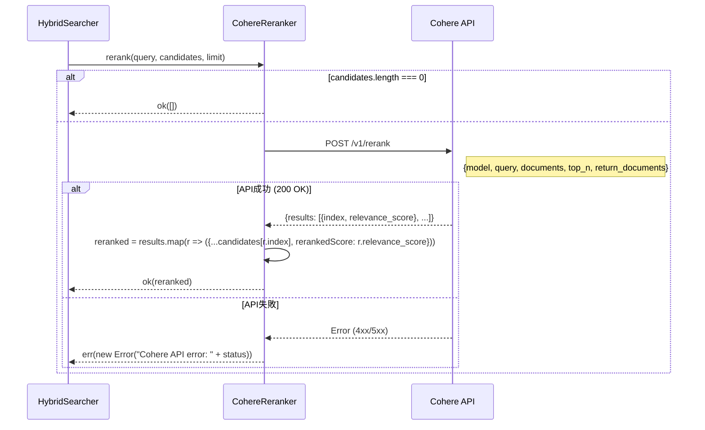
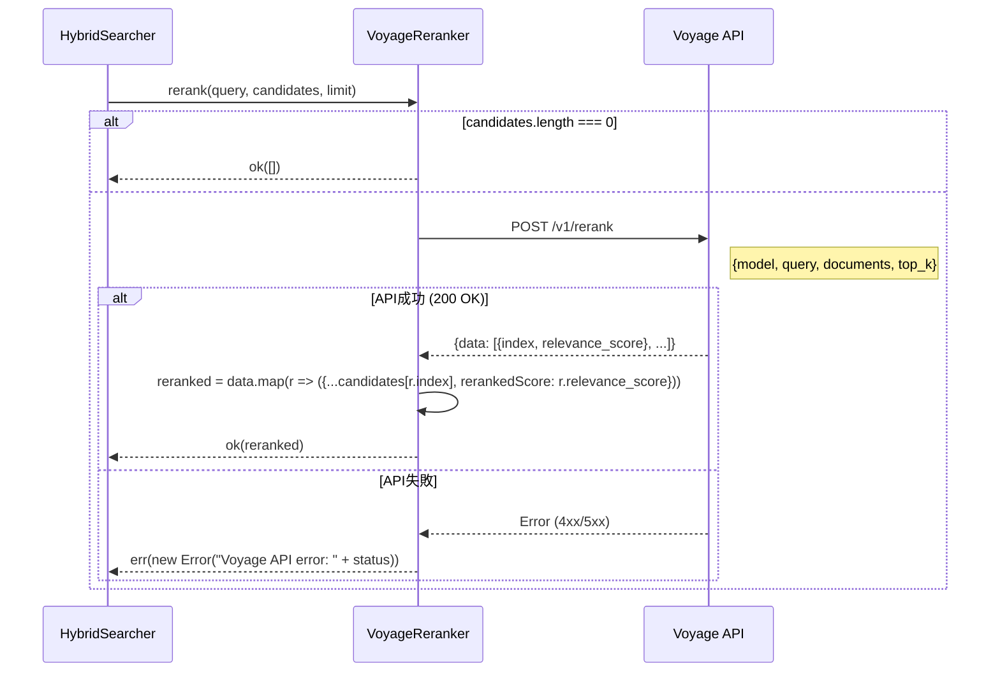
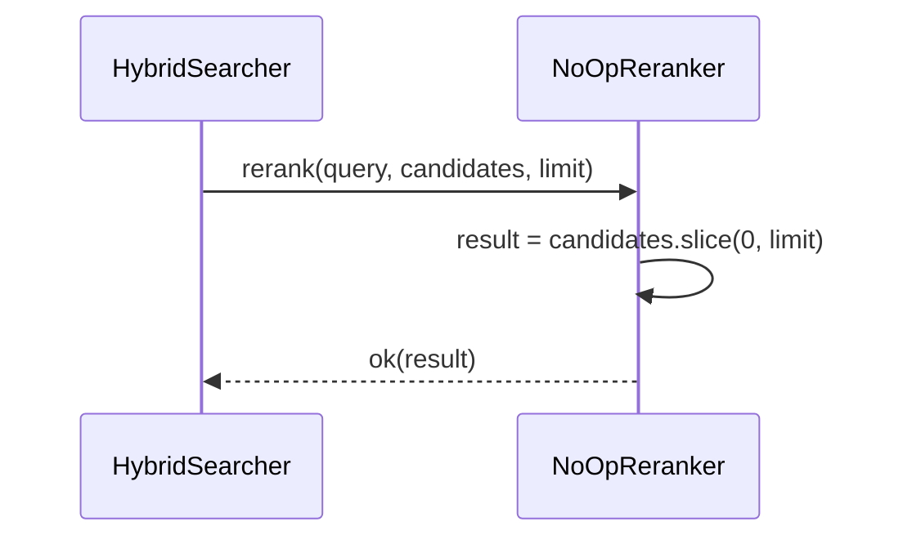
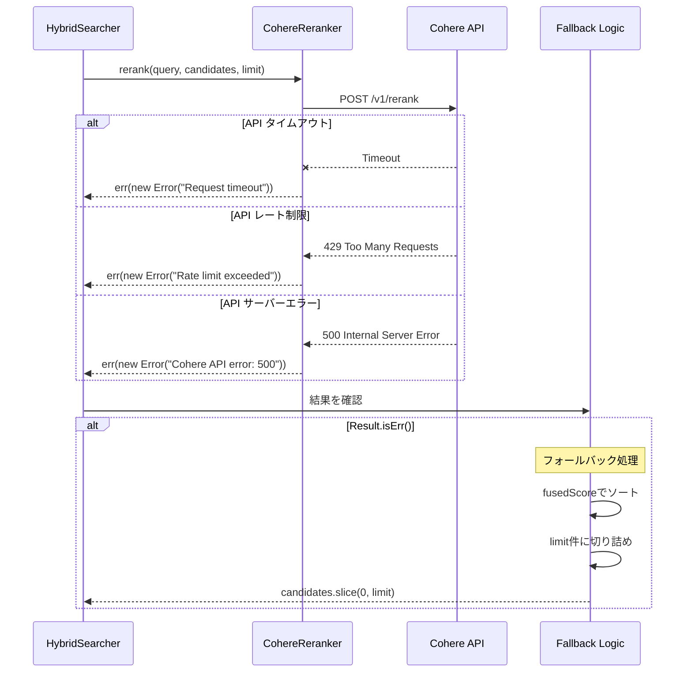
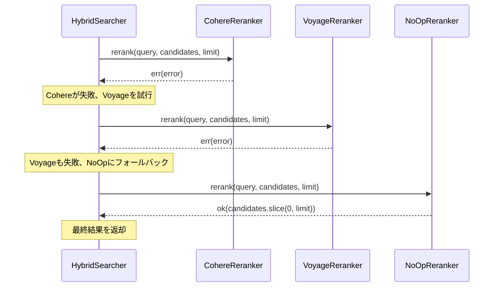
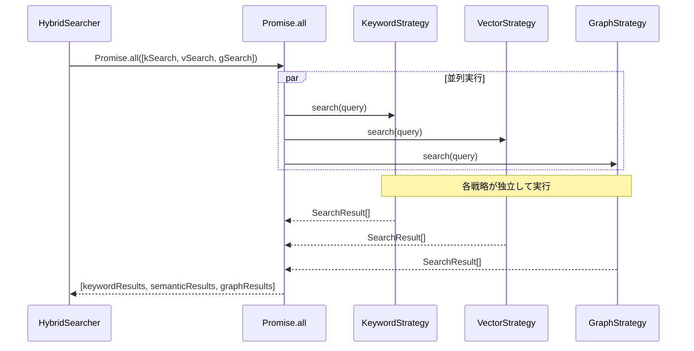

# RRF Fusion + Reranking - シーケンス設計

## メタ情報

| 項目       | 内容       |
| ---------- | ---------- |
| タスクID   | CONV-07-05 |
| フェーズ   | Phase 2    |
| 作成日     | 2026-01-13 |
| ステータス | 完了       |

---

## 1. 正常系シーケンス

### 1.1 RRF Fusionシーケンス



### 1.2 RRFスコア計算詳細



---

## 2. Reranker別シーケンス

### 2.1 LLMRerankerシーケンス



### 2.2 CohereRerankerシーケンス



### 2.3 VoyageRerankerシーケンス



### 2.4 NoOpRerankerシーケンス



---

## 3. エラーハンドリングシーケンス

### 3.1 Reranker失敗時のフォールバック



### 3.2 複数Reranker切り替え



---

## 4. 並列処理シーケンス

### 4.1 検索戦略の並列実行



---

## 5. 状態遷移

### 5.1 Fusion処理の状態遷移

```
┌─────────┐     resultSets, weights     ┌─────────────┐
│  IDLE   │ ─────────────────────────▶  │  PROCESSING │
└─────────┘                             └──────┬──────┘
                                               │
                     ┌─────────────────────────┼─────────────────────────┐
                     │                         │                         │
                     ▼                         ▼                         ▼
              ┌─────────────┐         ┌─────────────┐           ┌─────────────┐
              │  SCORING    │         │  MERGING    │           │  SORTING    │
              └──────┬──────┘         └──────┬──────┘           └──────┬──────┘
                     │                         │                         │
                     └─────────────────────────┴─────────────────────────┘
                                               │
                                               ▼
                                       ┌─────────────┐
                                       │  COMPLETED  │
                                       └─────────────┘
```

### 5.2 Reranking処理の状態遷移

```
┌─────────┐     query, candidates       ┌─────────────┐
│  IDLE   │ ─────────────────────────▶  │  VALIDATING │
└─────────┘                             └──────┬──────┘
                                               │
                         ┌─────────────────────┼─────────────────────────┐
                         │                     │                         │
                         ▼                     ▼                         ▼
                  ┌─────────────┐       ┌─────────────┐          ┌─────────────┐
                  │ EMPTY_INPUT │       │  SKIP_RERANK│          │  SCORING    │
                  │ (ok([]))    │       │ (ok(slice)) │          └──────┬──────┘
                  └─────────────┘       └─────────────┘                 │
                                                                ┌──────┴──────┐
                                                                │             │
                                                                ▼             ▼
                                                         ┌─────────┐   ┌─────────┐
                                                         │ SUCCESS │   │ FAILURE │
                                                         │ ok()    │   │ err()   │
                                                         └─────────┘   └────┬────┘
                                                                            │
                                                                            ▼
                                                                     ┌─────────────┐
                                                                     │  FALLBACK   │
                                                                     │  ok(slice)  │
                                                                     └─────────────┘
```

---

## 変更履歴

| 日付       | バージョン | 変更内容 |
| ---------- | ---------- | -------- |
| 2026-01-13 | 1.0.0      | 初版作成 |
