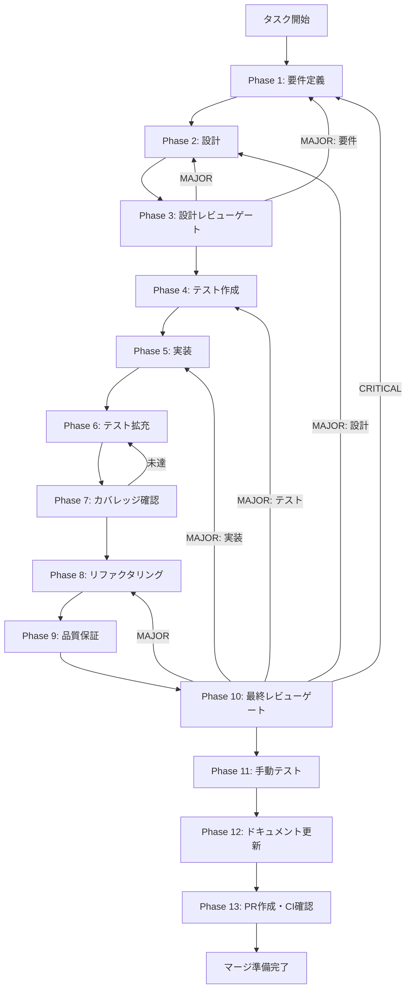

# rt-04-authkey-component-dedup - タスク実行仕様書

## ユーザーからの元の指示

```
Issue #1903: [TASK-RT-04-AUTHKEY-COMPONENT-DEDUP-001]
AuthKeySection と ApiKeySettingsPanel の重複解消

TASK-RT-04（API キー管理 UI）の実装完了後、AuthKeySection（SettingsView 主導線）と
ApiKeySettingsPanel（SkillLifecyclePanel 補助導線）の2つの類似コンポーネントが並存する状態になっている。
両コンポーネントは同じ IPC チャネルを呼び出し、ほぼ同じ UI フローを実装しているため、
共通ロジックを抽出して統合する。
```

## メタ情報

| 項目         | 内容                                                            |
| ------------ | --------------------------------------------------------------- |
| タスクID     | TASK-RT-04-AUTHKEY-COMPONENT-DEDUP-001                          |
| タスク名     | rt-04-authkey-component-dedup                                   |
| 分類         | リファクタリング                                                |
| 対象機能     | AuthKeySection / ApiKeySettingsPanel 重複解消                   |
| 優先度       | 中                                                              |
| 見積もり規模 | 中規模                                                          |
| ステータス   | 未実施                                                          |
| 作成日       | 2026-04-06                                                      |
| 参照Issue    | https://github.com/daishiman/AIWorkflowOrchestrator/issues/1903 |

---

## タスク概要

### 目的

- `AuthKeySection` と `ApiKeySettingsPanel` の共通ロジックを `useAuthKeyManagement` カスタムフックに統合する
- `ApiKeyStatus` 型を `packages/shared` に統一し、`AuthKeyStatus` ローカル型を廃止する
- IPC 仕様変更時の修正コストを2箇所から1箇所に削減する

### 背景

TASK-RT-04（API キー管理 UI）実装後、以下の2コンポーネントが並存している:

1. **AuthKeySection** (`apps/desktop/src/renderer/components/settings/AuthKeySection/index.tsx`)
   - SettingsView の主導線
   - ローカル型 `AuthKeyStatus = "saved" | "env-fallback" | "not-set" | "check-failed"`
   - `useAuthModeStatus` store フックを使用
   - password 表示切替機能あり

2. **ApiKeySettingsPanel** (`apps/desktop/src/renderer/components/skill/ApiKeySettingsPanel.tsx`)
   - SkillLifecyclePanel の補助導線
   - shared 型 `ApiKeyStatus = "not_set" | "validating" | "configured" | "error"`
   - `onStatusChange` props あり
   - sk- プレフィックスバリデーション関数あり

両者は同一 IPC チャネル（`window.electronAPI.authKey.{exists, set, delete}`）を呼び出すが、型値が完全に異なりドリフトリスクが高い。

### 最終ゴール

- `useAuthKeyManagement` カスタムフック（共通ロジック）が `packages/shared` または `apps/desktop` hooks に実装されている
- `AuthKeySection` が `onStatusChange` props を受け付けられるよう拡張されている
- `ApiKeySettingsPanel` が `AuthKeySection` に委譲されている（または廃止されている）
- `ApiKeyStatus` 型が `packages/shared` に一元定義され、両コンポーネントが共有している
- 既存テストが全 PASS、重複テストがクリーンアップされている

### 成果物一覧

| 種別           | 成果物                     | 配置先                                                                                 |
| -------------- | -------------------------- | -------------------------------------------------------------------------------------- |
| フック         | `useAuthKeyManagement`     | `apps/desktop/src/renderer/hooks/useAuthKeyManagement.ts`                              |
| 型定義         | 統一 `ApiKeyStatus`        | `packages/shared/src/types/skillCreator.ts`                                            |
| コンポーネント | 拡張 `AuthKeySection`      | `apps/desktop/src/renderer/components/settings/AuthKeySection/index.tsx`               |
| コンポーネント | 委譲 `ApiKeySettingsPanel` | `apps/desktop/src/renderer/components/skill/ApiKeySettingsPanel.tsx`                   |
| テスト         | フックテスト               | `apps/desktop/src/renderer/hooks/__tests__/useAuthKeyManagement.test.ts`               |
| テスト         | 更新 AuthKeySection テスト | `apps/desktop/src/renderer/components/settings/AuthKeySection/AuthKeySection.test.tsx` |
| ドキュメント   | 仕様更新サマリー           | `outputs/phase-12/system-spec-update-summary.md`                                       |
| ドキュメント   | 実装ガイド                 | `outputs/phase-12/implementation-guide.md`                                             |
| ドキュメント   | 更新履歴                   | `outputs/phase-12/documentation-changelog.md`                                          |
| ドキュメント   | 未タスク検出               | `outputs/phase-12/unassigned-task-detection.md`                                        |
| ドキュメント   | スキルフィードバック       | `outputs/phase-12/skill-feedback-report.md`                                            |
| ドキュメント   | 準拠確認                   | `outputs/phase-12/phase12-task-spec-compliance-check.md`                               |
| PR             | GitHub Pull Request        | GitHub UI                                                                              |

---

## 参照ファイル

本仕様書のコマンド選定は以下を参照：

- `apps/desktop/src/renderer/components/settings/AuthKeySection/index.tsx` - 主導線コンポーネント
- `apps/desktop/src/renderer/components/skill/ApiKeySettingsPanel.tsx` - 補助導線コンポーネント
- `packages/shared/src/types/skillCreator.ts` - 共有型定義（ApiKeyStatus）
- `.claude/skills/aiworkflow-requirements/references/` - システム仕様

---

## タスク分解サマリー

| ID     | フェーズ | サブタスク名          | 責務                                           | 依存 |
| ------ | -------- | --------------------- | ---------------------------------------------- | ---- |
| T-01-1 | Phase 1  | 要件定義・差分分析    | 2コンポーネントの差分と統合要件を確定          | -    |
| T-02-1 | Phase 2  | アーキテクチャ設計    | フック設計・型統一・委譲パターン設計           | T-01 |
| T-03-1 | Phase 3  | 設計レビューゲート    | Phase 4 進行可否判定                           | T-02 |
| T-04-1 | Phase 4  | テスト作成（TDD Red） | フック・コンポーネント全テストケース作成       | T-03 |
| T-05-1 | Phase 5  | 実装                  | フック・型・コンポーネント実装                 | T-04 |
| T-06-1 | Phase 6  | テスト拡充            | fail path・回帰ガード追加                      | T-05 |
| T-07-1 | Phase 7  | カバレッジ確認        | Line/Branch/Function カバレッジ検証            | T-06 |
| T-08-1 | Phase 8  | リファクタリング      | 重複除去・型整合                               | T-07 |
| T-09-1 | Phase 9  | 品質保証              | lint/typecheck/test 一括確認                   | T-08 |
| T-10-1 | Phase 10 | 最終レビューゲート    | 受入条件チェック・MAJOR/MINOR 判定             | T-09 |
| T-11-1 | Phase 11 | 手動テスト            | UI 動作確認（NON_VISUAL 判定の場合は自動代替） | T-10 |
| T-12-1 | Phase 12 | ドキュメント更新      | 実装ガイド・spec sync・未タスク検出            | T-11 |
| T-13-1 | Phase 13 | PR 作成               | ユーザー承認後のみ実施                         | T-12 |

**総サブタスク数**: 13個

---

## 実行フロー図



---

## Phase一覧

| Phase | 名称               | 仕様書                                                       | ステータス |
| ----- | ------------------ | ------------------------------------------------------------ | ---------- |
| 1     | 要件定義           | [phase-1-requirements.md](phase-1-requirements.md)           | 未実施     |
| 2     | 設計               | [phase-2-design.md](phase-2-design.md)                       | 未実施     |
| 3     | 設計レビューゲート | [phase-3-design-review.md](phase-3-design-review.md)         | 未実施     |
| 4     | テスト作成         | [phase-4-test-creation.md](phase-4-test-creation.md)         | 未実施     |
| 5     | 実装               | [phase-5-implementation.md](phase-5-implementation.md)       | 未実施     |
| 6     | テスト拡充         | [phase-6-test-expansion.md](phase-6-test-expansion.md)       | 未実施     |
| 7     | カバレッジ確認     | [phase-7-coverage-check.md](phase-7-coverage-check.md)       | 未実施     |
| 8     | リファクタリング   | [phase-8-refactoring.md](phase-8-refactoring.md)             | 未実施     |
| 9     | 品質保証           | [phase-9-quality-assurance.md](phase-9-quality-assurance.md) | 未実施     |
| 10    | 最終レビューゲート | [phase-10-final-review.md](phase-10-final-review.md)         | 未実施     |
| 11    | 手動テスト         | [phase-11-manual-test.md](phase-11-manual-test.md)           | 未実施     |
| 12    | ドキュメント更新   | [phase-12-documentation.md](phase-12-documentation.md)       | 未実施     |
| 13    | PR 作成            | [phase-13-pr-creation.md](phase-13-pr-creation.md)           | 未実施     |

---

## テストカバレッジ目標

### ユニットテスト

| 指標              | 最低基準 | 推奨基準 |
| ----------------- | -------- | -------- |
| Line Coverage     | 80%      | 90%      |
| Branch Coverage   | 60%      | 70%      |
| Function Coverage | 80%      | 90%      |

---

## Phase完了時の必須アクション

**各Phase完了時に以下を必ず実行すること:**

1. **タスク100%実行**: Phase内で指定された全タスクを完全に実行
2. **成果物確認**: 全ての必須成果物が生成されていることを検証
3. **実行記録**: 実行タスクの結果を記録
4. **artifacts.json更新**: Phase完了ステータスを更新

```bash
# Phase完了時の検証コマンド
node .claude/skills/task-specification-creator/scripts/validate-phase-output.js \
  docs/30-workflows/rt-04-authkey-component-dedup --phase <PHASE_NUMBER>
```
