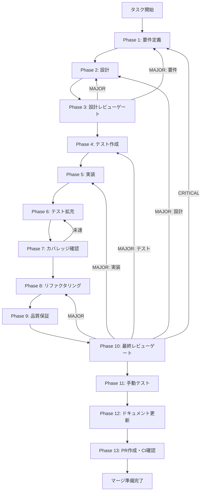

# safety-gov-production-integration - タスク実行仕様書

## ユーザーからの元の指示

```
UT-IMP-SAFETY-GOV-PRODUCTION-INTEGRATION-001のタスク仕様書を作成してください。
タスクやイシューは完了になっていますが管理上完了にしているだけでまだ完了していません。
```

## メタ情報

| 項目         | 内容                                         |
| ------------ | -------------------------------------------- |
| タスクID     | UT-IMP-SAFETY-GOV-PRODUCTION-INTEGRATION-001 |
| タスク名     | safety-gov-production-integration            |
| 分類         | 改善                                         |
| 対象機能     | ExecutionConsole                             |
| 優先度       | 高                                           |
| 見積もり規模 | 大規模                                       |
| ステータス   | Phase 1-12 完了（Phase 13 blocked）          |
| 作成日       | 2026-03-31                                   |

## 元タスク

TASK-IMP-ADVANCED-CONSOLE-SAFETY-GOVERNANCE-001 のPhase 12 UT-6〜UT-9で残課題として記録された production 統合ステップ。
GitHub Issue: https://github.com/daishiman/AIWorkflowOrchestrator/issues/1609

---

## タスク概要

### 目的

TASK-IMP-ADVANCED-CONSOLE-SAFETY-GOVERNANCE-001 で実装した ApprovalGate・IPC handler・Renderer コンポーネントを production コードに統合する。現在は独立した設計コードとして存在するが、Main Process 起動パスへの接続・Preload contextBridge への公開・Push 通知の実装・セッション終了時のクリーンアップが未接続のため、機能が実際には動作しない状態。

### 背景

元タスクでは ApprovalGate / approvalHandlers / disclosureHandlers / advancedConsoleHandlers を個別に実装し、85テストが全パスする状態まで到達した。しかし以下の production 統合ステップが未実施:

1. **IPC Handler 登録（UT-6）**: `main/ipc/index.ts` への3ハンドラ追加。ApprovalGate のインスタンスを DI で注入する必要あり
2. **Preload API 公開（UT-7）**: `preload/index.ts` の `electronAPI` に `execution` 名前空間を追加。safeInvoke/safeOn パターンに従う必要あり
3. **Approval Request Push（UT-8）**: Main → Renderer への `approval:request` push 通知。`webContents.send()` を使用し、ALLOWED_ON_CHANNELS に登録済み
4. **revokeAll() セッション終了（UT-9）**: abort/done 遷移時に `ApprovalGate.revokeAll(sessionId)` を呼び出してトークンを無効化

### 最終ゴール

- 3つの IPC handler が `main/ipc/index.ts` から登録されている
- ApprovalGate が DI でハンドラに注入されている
- Preload の contextBridge に execution API が公開されている
- Main → Renderer の approval:request push が動作する
- セッション終了時に revokeAll() が呼び出される
- 既存 85 テスト + 新規統合テストが PASS する

## 一次結論

### 真の論点

既存の ApprovalGate 系実装は個別要素として成立している一方で、Main / IPC / Preload / Renderer の接続責務が分散したまま残っており、production 起動経路に統合されていないことが主問題である。

### 依存関係・責務境界の問題点

- ApprovalGate の owner が Main Process に固定されていない
- handler 登録責務と preload 公開責務が別々に未完了で、4層契約が閉じていない
- push 通知と session cleanup が実行 lifecycle へ接続されておらず、実装済み要素が runtime で孤立している

### 価値とコストの不均衡

- 価値が高いのは「既存実装を実際に動く統合面へ接続すること」であり、新規機能追加ではない
- コストが大きいのは revokeAll() の state owner 特定と preload / renderer 接続の回帰検証である
- したがって初回スコープは UT-6〜UT-9 の production 統合に限定し、UT-10 は別 concern として分離する

### 改善優先順位

1. Main 側の handler 登録と ApprovalGate owner 固定
2. Preload execution namespace 公開
3. Renderer hook 接続
4. approval:request push と revokeAll() lifecycle 統合
5. テスト拡充と Phase 12 same-wave sync

### 4条件の初期評価

| 条件         | 初期評価     | 根拠                                                               |
| ------------ | ------------ | ------------------------------------------------------------------ |
| 矛盾なし     | 条件付きPASS | ApprovalGate / channel 定義は存在するが、production 統合面が未接続 |
| 漏れなし     | FAIL         | UT-6〜UT-9 が未実装のまま残っている                                |
| 整合性あり   | 条件付きPASS | 個別実装の naming / channel 契約はあるが、4層接続が閉じていない    |
| 依存関係整合 | FAIL         | Main / Preload / Renderer / session cleanup の依存が未完了         |

### 成果物一覧

| 種別         | 成果物                        | 配置先                                                  |
| ------------ | ----------------------------- | ------------------------------------------------------- |
| 機能         | IPC handler 登録（3ハンドラ） | `apps/desktop/src/main/ipc/index.ts`                    |
| 機能         | ApprovalGate singleton        | `apps/desktop/src/main/index.ts`                        |
| 機能         | Preload execution API         | `apps/desktop/src/preload/index.ts`                     |
| 機能         | Preload execution 型定義      | `apps/desktop/src/preload/types.ts`                     |
| 機能         | useApprovalFlow hook 更新     | `apps/desktop/src/renderer/hooks/useApprovalFlow.ts`    |
| 機能         | useAdvancedConsole hook 更新  | `apps/desktop/src/renderer/hooks/useAdvancedConsole.ts` |
| テスト       | IPC handler 統合テスト        | `apps/desktop/src/main/ipc/__tests__/`                  |
| テスト       | Preload API 統合テスト        | `apps/desktop/src/preload/__tests__/`                   |
| ドキュメント | 各Phase成果物                 | `outputs/phase-*/`                                      |
| PR           | GitHub Pull Request           | GitHub UI                                               |

---

## 参照ファイル

- `docs/30-workflows/completed-tasks/UT-IMP-SAFETY-GOV-PRODUCTION-INTEGRATION-001.md` - 元タスク仕様書
- `apps/desktop/src/main/ipc/approvalHandlers.ts` - 既実装ハンドラ
- `apps/desktop/src/main/ipc/disclosureHandlers.ts` - 既実装ハンドラ
- `apps/desktop/src/main/ipc/advancedConsoleHandlers.ts` - 既実装ハンドラ
- `apps/desktop/src/main/services/runtime/ApprovalGate.ts` - 既実装サービス
- `apps/desktop/src/preload/channels.ts` - IPC チャンネル定数
- `packages/shared/src/ipc/channels.ts` - 共有 IPC チャンネル定数

---

## タスク分解サマリー

| ID     | フェーズ | サブタスク名             | 責務                                | 依存 |
| ------ | -------- | ------------------------ | ----------------------------------- | ---- |
| T-01-1 | Phase 1  | 要件定義・既存コード調査 | scope・受入条件・既存実装状態確認   | -    |
| T-02-1 | Phase 2  | IPC 統合設計             | 4層整合性・DI設計・型定義設計       | T-01 |
| T-03-1 | Phase 3  | 設計レビューゲート       | Phase 4 進行可否判定                | T-02 |
| T-04-1 | Phase 4  | 統合テスト作成           | handler 登録テスト・push 通知テスト | T-03 |
| T-05-1 | Phase 5  | production 統合実装      | 6ファイル修正・handler 登録・型追加 | T-04 |
| T-06-1 | Phase 6  | テスト拡充               | fail path・revokeAll テスト追加     | T-05 |
| T-07-1 | Phase 7  | カバレッジ確認           | 既存85テスト + 新規テスト PASS 確認 | T-06 |
| T-08-1 | Phase 8  | リファクタリング         | DI パターン統一・重複除去           | T-07 |
| T-09-1 | Phase 9  | 品質保証                 | typecheck・lint・全テスト PASS      | T-08 |
| T-10-1 | Phase 10 | 最終レビューゲート       | 受入条件 6項目の最終確認            | T-09 |
| T-11-1 | Phase 11 | 手動テスト               | Electron 起動・approval フロー確認  | T-10 |
| T-12-1 | Phase 12 | ドキュメント更新         | 実装ガイド・仕様同期・未タスク検出  | T-11 |
| T-13-1 | Phase 13 | PR作成                   | ユーザー承認後 PR 作成              | T-12 |

**総サブタスク数**: 13個

## SubAgent 実行設計

| Lane   | 役割                                                            | 主担当Phase    | 実行形態                                 |
| ------ | --------------------------------------------------------------- | -------------- | ---------------------------------------- |
| Lane A | skill準拠検証（workflow pack / artifacts / Phase 12 close-out） | 1, 3, 10, 12   | Phase 1-3 は直列、監査は並列             |
| Lane B | production 統合設計・実装                                       | 2, 5, 8        | Phase 5 以降は直列                       |
| Lane C | テスト・品質・証跡                                              | 4, 6, 7, 9, 11 | Phase 4/6/7/9 は一部並列、最終判定は直列 |

並列実行は Phase 2 の設計検証と Phase 4 のテスト設計、Phase 12 の same-wave sync 事前棚卸しに限定する。Phase 3 / 10 / 12 の gate は単一判断として直列で締める。

## 30種の思考法適用マトリクス

| カテゴリ     | 思考法                                                               | 本タスクでの適用対象                                            |
| ------------ | -------------------------------------------------------------------- | --------------------------------------------------------------- |
| 論理分析系   | 批判的思考、演繹思考、帰納的思考、アブダクション、垂直思考           | UT-6〜UT-9 の真の未完了箇所特定、既存実装からの妥当推論         |
| 構造分解系   | 要素分解、MECE、2軸思考、プロセス思考                                | Main/Preload/Renderer/Session と 実装/テスト の軸で漏れなく分解 |
| メタ・抽象系 | メタ思考、抽象化思考、ダブル・ループ思考                             | 「個別実装済みなのに動かない」構造問題の再定義                  |
| 発想・拡張系 | ブレインストーミング、水平思考、逆説思考、類推思考、if思考、素人思考 | singleton 配置、push timing、degraded fallback の代替案比較     |
| システム系   | システム思考、因果関係分析、因果ループ                               | approval request 発火から cleanup までの循環確認                |
| 戦略・価値系 | トレードオン思考、プラスサム思考、価値提案思考、戦略的思考           | 新規機能追加を避け、接続面統合へ集中する判断                    |
| 問題解決系   | why思考、改善思考、仮説思考、論点思考、KJ法                          | gap の原因整理、優先順位付け、未タスク切り出し                  |

---

## 実行フロー図



---

## Phase一覧

| Phase | 名称               | 仕様書                                                       | ステータス |
| ----- | ------------------ | ------------------------------------------------------------ | ---------- |
| 1     | 要件定義           | [phase-1-requirements.md](phase-1-requirements.md)           | 完了       |
| 2     | 設計               | [phase-2-design.md](phase-2-design.md)                       | 完了       |
| 3     | 設計レビューゲート | [phase-3-design-review.md](phase-3-design-review.md)         | 完了       |
| 4     | テスト作成         | [phase-4-test-creation.md](phase-4-test-creation.md)         | 完了       |
| 5     | 実装               | [phase-5-implementation.md](phase-5-implementation.md)       | 完了       |
| 6     | テスト拡充         | [phase-6-test-expansion.md](phase-6-test-expansion.md)       | 完了       |
| 7     | カバレッジ確認     | [phase-7-coverage-check.md](phase-7-coverage-check.md)       | 完了       |
| 8     | リファクタリング   | [phase-8-refactoring.md](phase-8-refactoring.md)             | 完了       |
| 9     | 品質保証           | [phase-9-quality-assurance.md](phase-9-quality-assurance.md) | 完了       |
| 10    | 最終レビューゲート | [phase-10-final-review.md](phase-10-final-review.md)         | 完了       |
| 11    | 手動テスト         | [phase-11-manual-test.md](phase-11-manual-test.md)           | 完了       |
| 12    | ドキュメント更新   | [phase-12-documentation.md](phase-12-documentation.md)       | 完了       |
| 13    | PR作成             | [phase-13-pr-creation.md](phase-13-pr-creation.md)           | blocked    |

---

## テストカバレッジ目標

### ユニットテスト

| 指標              | 最低基準 | 推奨基準 |
| ----------------- | -------- | -------- |
| Line Coverage     | 80%      | 90%      |
| Branch Coverage   | 60%      | 70%      |
| Function Coverage | 80%      | 90%      |

### 結合テスト

| 指標                       | 目標 |
| -------------------------- | ---- |
| IPC ハンドラ登録確認       | 100% |
| Preload API 公開確認       | 100% |
| Push 通知正常系            | 100% |
| セッション終了 revokeAll   | 100% |
| 異常系（未認証・検証失敗） | 80%+ |

---

## 統合テスト連携（Phase 1〜11で必須）

| Phase | 統合テスト連携アクション                                 |
| ----- | -------------------------------------------------------- |
| 1     | IPC チャンネル依存関係・Push 通知要件を要件に明記        |
| 2     | IPC 4層整合性・型契約を設計に反映                        |
| 3     | IPC 統合テスト観点のレビューゲートを実施                 |
| 4     | IPC handler 登録・Preload API・Push 通知の統合テスト作成 |
| 5     | handler 登録実装とテスト支援コード整備                   |
| 6     | revokeAll・fail path テスト拡充                          |
| 7     | 統合テスト再実行とゲート判定                             |
| 8     | リファクタ後の統合テスト継続成功を確認                   |
| 9     | 品質保証で統合テスト結果を確認                           |
| 10    | 最終レビューで統合テスト結果を確認                       |
| 11    | 手動統合テスト（Electron起動・approval フロー）を確認    |

---

## Phase完了時の必須アクション

1. **タスク100%実行**: Phase内で指定された全タスクを完全に実行
2. **成果物確認**: 全ての必須成果物が生成されていることを検証
3. **実行記録**: 実行タスクの結果を記録
4. **artifacts.json更新**: Phase完了ステータスを更新

```bash
node .claude/skills/task-specification-creator/scripts/validate-phase-output.js \
  docs/30-workflows/safety-gov-production-integration --phase {{PHASE_NUMBER}}

node .claude/skills/task-specification-creator/scripts/complete-phase.js \
  --workflow docs/30-workflows/safety-gov-production-integration \
  --phase {{PHASE_NUMBER}} --artifacts "..."
```
