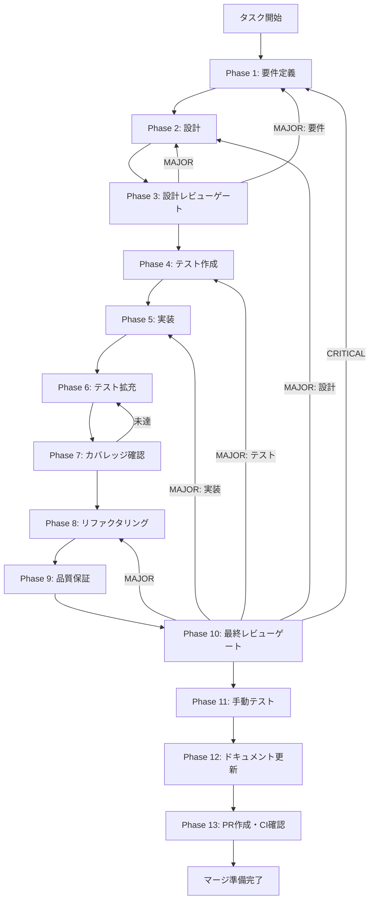

# search-panel-integration - タスク実行仕様書

## ユーザーからの元の指示

```
Phase 5 で作成した高品質な検索パネルコンポーネントを EditorView に統合し、
実際にユーザーが使用できる状態にする。
```

## メタ情報

| 項目         | 内容                                     |
| ------------ | ---------------------------------------- |
| タスクID     | TASK-SEARCH-INTEGRATE-001                |
| タスク名     | Phase 5 検索パネル実装の EditorView 統合 |
| 分類         | 改善                                     |
| 対象機能     | 検索・置換機能                           |
| 優先度       | 高                                       |
| 見積もり規模 | 中規模                                   |
| ステータス   | 未実施                                   |
| 作成日       | 2026-01-22                               |
| Issue番号    | #361                                     |

---

## タスク概要

### 目的

Phase 5 で TDD 手法を用いて作成した高品質な検索パネルコンポーネント（SearchPanel、WorkspaceSearchPanel）を EditorView に統合し、ユーザーが実際に検索・置換機能を使用できる状態にする。

### 背景

Phase 5 で TDD 手法を用いて高品質な検索・置換 UI コンポーネントを実装した：

- `apps/desktop/src/features/search/components/SearchPanel.tsx`
- `apps/desktop/src/features/search/components/WorkspaceSearchPanel.tsx`
- `apps/desktop/src/features/search/stores/useSearchStore.ts`
- `apps/desktop/src/features/search/hooks/useSearchKeyboardShortcuts.ts`

しかし、これらは EditorView に統合されておらず、実際には使用されていない状態。
現在 EditorView で使用されているのは既存の `UnifiedSearchPanel`（organisms/SearchPanel/）。

| 観点               | 既存実装（UnifiedSearchPanel） | Phase 5 実装             |
| ------------------ | ------------------------------ | ------------------------ |
| テストカバレッジ   | 不明                           | 71.23%（94テスト合格）   |
| TypeScript型安全性 | 不明                           | エラー0件                |
| WCAG 2.1 AA準拠    | 不明                           | 完全準拠（11テスト合格） |
| ESLint警告         | 不明                           | 0件                      |
| 統合状態           | EditorView統合済み             | 未統合                   |

### 最終ゴール

- `Cmd+F` / `Ctrl+F` で Phase 5 の SearchPanel が開く
- `Cmd+Shift+F` / `Ctrl+Shift+F` で Phase 5 の WorkspaceSearchPanel が開く
- 検索・置換・ナビゲーション機能が正常動作する
- 既存のテスト（94件）が全て合格する
- WCAG 2.1 AA 準拠が維持される

### 成果物一覧

| 種別         | 成果物                   | 配置先                                                               |
| ------------ | ------------------------ | -------------------------------------------------------------------- |
| 機能         | 更新された EditorView    | `apps/desktop/src/renderer/views/EditorView/index.tsx`               |
| 機能         | EditorInstanceアダプター | `apps/desktop/src/features/search/adapters/TextAreaEditorAdapter.ts` |
| 機能         | 統合用カスタムフック     | `apps/desktop/src/renderer/views/EditorView/hooks/`                  |
| テスト       | 統合テスト（追加）       | `apps/desktop/src/features/search/__tests__/integration/`            |
| ドキュメント | 実装ログ                 | `outputs/phase-*/`                                                   |
| PR           | GitHub Pull Request      | GitHub UI                                                            |

---

## 参照ファイル

本仕様書のコマンド選定は以下を参照：

### システム仕様（aiworkflow-requirements）

| 参照資料           | パス                                                                       | 内容                  |
| ------------------ | -------------------------------------------------------------------------- | --------------------- |
| 検索パネルUI設計   | `.claude/skills/aiworkflow-requirements/references/ui-ux-search-panel.md`  | 検索パネルのUI/UX仕様 |
| Search Service API | `.claude/skills/aiworkflow-requirements/references/api-internal-search.md` | 検索サービスAPI仕様   |
| パネルUI/UXガイド  | `.claude/skills/aiworkflow-requirements/references/ui-ux-panels.md`        | パネル共通UI/UX仕様   |
| エラーハンドリング | `.claude/skills/aiworkflow-requirements/references/error-handling.md`      | エラー処理パターン    |

### 既存実装

| 参照資料               | パス                                                                 | 内容           |
| ---------------------- | -------------------------------------------------------------------- | -------------- |
| Phase 5 コンポーネント | `apps/desktop/src/features/search/`                                  | 検索パネル実装 |
| 既存 EditorView        | `apps/desktop/src/renderer/views/EditorView/index.tsx`               | 統合先のビュー |
| 元のタスク指示書       | `docs/30-workflows/unassigned-task/task-search-panel-integration.md` | 元のタスク定義 |

---

## タスク分解サマリー

| ID     | フェーズ | サブタスク名       | 責務                              | 依存 |
| ------ | -------- | ------------------ | --------------------------------- | ---- |
| T-01-1 | Phase 1  | 要件定義           | 統合要件・受入基準の明確化        | -    |
| T-02-1 | Phase 2  | 設計               | アダプターパターン統合設計        | T-01 |
| T-03-1 | Phase 3  | 設計レビューゲート | Phase 5実装との整合性検証         | T-02 |
| T-04-1 | Phase 4  | テスト作成         | 統合テストの作成（TDD Red）       | T-03 |
| T-05-1 | Phase 5  | 実装               | EditorView統合の実装（TDD Green） | T-04 |
| T-06-1 | Phase 6  | テスト拡充         | カバレッジ向上のためのテスト追加  | T-05 |
| T-07-1 | Phase 7  | カバレッジ確認     | テストカバレッジ基準の検証        | T-06 |
| T-08-1 | Phase 8  | リファクタリング   | コード品質改善（TDD Refactor）    | T-07 |
| T-09-1 | Phase 9  | 品質保証           | 静的解析・アクセシビリティ確認    | T-08 |
| T-10-1 | Phase 10 | 最終レビューゲート | 全体品質・整合性検証              | T-09 |
| T-11-1 | Phase 11 | 手動テスト         | 実機動作確認・UX検証              | T-10 |
| T-12-1 | Phase 12 | ドキュメント更新   | 実装ガイド・仕様書更新            | T-11 |
| T-13-1 | Phase 13 | PR作成             | コミット・PR・CI確認              | T-12 |

**総サブタスク数**: 13個

---

## 実行フロー図



---

## Phase一覧

| Phase | 名称               | 仕様書                                                 | ステータス |
| ----- | ------------------ | ------------------------------------------------------ | ---------- |
| 1     | 要件定義           | [phase-1-requirements.md](phase-1-requirements.md)     | 未実施     |
| 2     | 設計               | [phase-2-design.md](phase-2-design.md)                 | 未実施     |
| 3     | 設計レビューゲート | [phase-3-design-review.md](phase-3-design-review.md)   | 未実施     |
| 4     | テスト作成         | [phase-4-test-creation.md](phase-4-test-creation.md)   | 未実施     |
| 5     | 実装               | [phase-5-implementation.md](phase-5-implementation.md) | 未実施     |
| 6     | テスト拡充         | [phase-6-test-expansion.md](phase-6-test-expansion.md) | 未実施     |
| 7     | カバレッジ確認     | [phase-7-coverage-check.md](phase-7-coverage-check.md) | 未実施     |
| 8     | リファクタリング   | [phase-8-refactoring.md](phase-8-refactoring.md)       | 未実施     |
| 9     | 品質保証           | [phase-9-quality.md](phase-9-quality.md)               | 未実施     |
| 10    | 最終レビューゲート | [phase-10-final-review.md](phase-10-final-review.md)   | 未実施     |
| 11    | 手動テスト         | [phase-11-manual-test.md](phase-11-manual-test.md)     | 未実施     |
| 12    | ドキュメント更新   | [phase-12-documentation.md](phase-12-documentation.md) | 未実施     |
| 13    | PR作成             | [phase-13-pr-creation.md](phase-13-pr-creation.md)     | 未実施     |

---

## テストカバレッジ目標

### ユニットテスト

| 指標              | 最低基準 | 推奨基準 | 現状（Phase 5） |
| ----------------- | -------- | -------- | --------------- |
| Line Coverage     | 80%      | 90%      | 71.23%          |
| Branch Coverage   | 60%      | 70%      | -               |
| Function Coverage | 80%      | 90%      | -               |

### 結合テスト

| 指標                         | 目標 |
| ---------------------------- | ---- |
| APIエンドポイント            | 100% |
| モジュール間インターフェース | 100% |
| 正常系シナリオ               | 100% |
| 異常系シナリオ               | 80%+ |
| 外部連携ポイント             | 100% |

---

## 統合テスト連携（Phase 1〜11で必須）

各Phaseで以下の統合テスト連携アクションを実施すること:

| Phase | 統合テスト連携アクション                                 |
| ----- | -------------------------------------------------------- |
| 1     | EditorView統合の接続要件を要件に明記                     |
| 2     | SearchPanel/EditorView間の統合ポイント・契約を設計に反映 |
| 3     | 統合テスト観点のレビューゲートを実施                     |
| 4     | 統合テストシナリオを全カテゴリで作成                     |
| 5     | SearchPanel/EditorView接続の実装とテスト支援コード整備   |
| 6     | 統合テストの拡充（全カテゴリのカバレッジ向上）           |
| 7     | 統合テストの再実行とゲート判定                           |
| 8     | リファクタ後の統合テスト継続成功を確認                   |
| 9     | 品質保証で統合テスト結果を確認                           |
| 10    | 最終レビューで統合テスト結果を確認                       |
| 11    | 手動統合テスト（UI/キーボードショートカット）を確認      |

---

## Phase完了時の必須アクション

**各Phase完了時に以下を必ず実行すること:**

1. **タスク100%実行**: Phase内で指定された全タスクを完全に実行
2. **成果物確認**: 全ての必須成果物が生成されていることを検証
3. **実行記録**: 実行タスクの結果を記録
4. **artifacts.json更新**: Phase完了ステータスを更新
5. **Phase末端の実行確認**: 各タスクを100%実行し、各タスクを完遂した旨を必ず明記

```bash
# Phase完了時の検証コマンド
node .claude/skills/task-specification-creator/scripts/validate-phase-output.js docs/30-workflows/search-panel-integration --phase {{PHASE_NUMBER}}

# Phase完了・成果物登録
node .claude/skills/task-specification-creator/scripts/complete-phase.js \
  --workflow docs/30-workflows/search-panel-integration --phase {{PHASE_NUMBER}} --artifacts "..."
```

---

## 検証方法

### テストケース

| #   | テストケース            | 期待結果                          |
| --- | ----------------------- | --------------------------------- |
| 1   | Cmd+F を押す            | SearchPanel が表示される          |
| 2   | Cmd+Shift+F を押す      | WorkspaceSearchPanel が表示される |
| 3   | 検索クエリを入力        | マッチがハイライトされる          |
| 4   | Enter を押す            | 次のマッチに移動                  |
| 5   | Shift+Enter を押す      | 前のマッチに移動                  |
| 6   | 置換テキスト入力 → 置換 | 現在のマッチが置換される          |
| 7   | 全置換ボタン            | 全マッチが置換される              |
| 8   | Escape を押す           | パネルが閉じる                    |

### 検証コマンド

```bash
# 1. ユニットテスト実行
pnpm --filter @repo/desktop test:run

# 2. TypeScript 型チェック
pnpm --filter @repo/desktop tsc --noEmit

# 3. ESLint
pnpm --filter @repo/desktop lint

# 4. 実機確認
pnpm --filter @repo/desktop dev
```

---

## リスクと対策

| リスク              | 影響度 | 発生確率 | 対策                           |
| ------------------- | ------ | -------- | ------------------------------ |
| TextArea API が不足 | 中     | 中       | アダプターで補完実装           |
| 既存テストが失敗    | 高     | 低       | 段階的に統合、問題を即座に修正 |
| パフォーマンス低下  | 中     | 低       | デバウンス処理を維持           |
