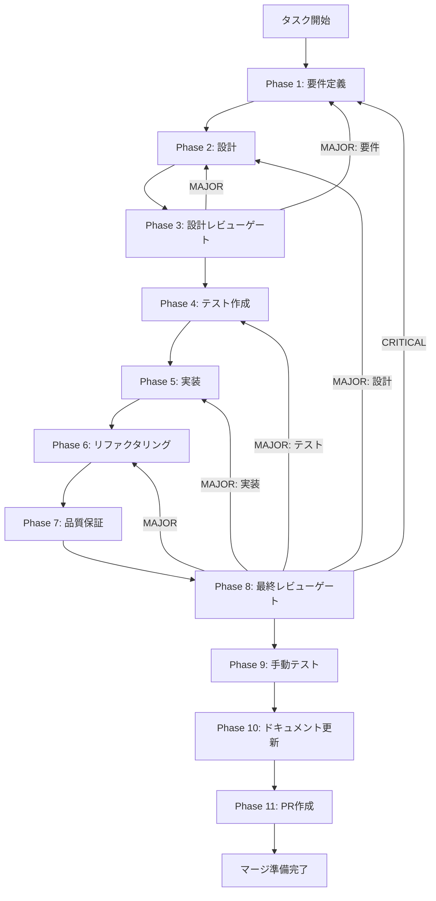

# 検索・置換機能 - タスク実行仕様書

## ユーザーからの元の指示

```
編集しているファイル内での文字検索、置換などできるようにしてほしいです。
あとはこのワークスペース全体での文字の検索、置換もできるようにしてほしいです。
```

## メタ情報

| 項目         | 内容                         |
| ------------ | ---------------------------- |
| タスクID     | TASK-SEARCH-REPLACE-001      |
| Worktreeパス | `.worktrees/task-20260104-*` |
| ブランチ名   | `feature/search-replace`     |
| タスク名     | 検索・置換機能               |
| 分類         | 新規機能                     |
| 対象機能     | エディター・ワークスペース   |
| 優先度       | 高                           |
| 見積もり規模 | 中規模                       |
| ステータス   | 未実施                       |
| 作成日       | 2026-01-04                   |
| 発見元       | ユーザー要望                 |

---

## タスク概要

### 目的

ファイル内およびワークスペース全体での検索・置換機能を実装し、効率的なテキスト編集を可能にする。

### 背景

テキストエディターの基本機能として、検索と置換は必須の機能である。現在、ファイル内での文字検索や置換ができず、外部エディターを使用する必要がある。また、ワークスペース全体での検索・置換も開発効率を大きく向上させる機能である。

### 最終ゴール

**ファイル内検索・置換**

- Ctrl+F で検索パネルを表示
- 検索結果のハイライト表示
- 次/前の検索結果への移動
- 単一置換・全置換
- 正規表現対応
- 大文字/小文字区別オプション
- 単語単位検索オプション

**ワークスペース検索・置換**

- Ctrl+Shift+F でワークスペース検索パネルを表示
- ファイルをまたいだ検索結果一覧
- 検索結果からファイルへのジャンプ
- ワークスペース全体での置換
- 除外パターン設定（node_modules等）
- ファイルタイプフィルタ

### 成果物一覧

| 種別         | 成果物                             | 配置先                                          |
| ------------ | ---------------------------------- | ----------------------------------------------- |
| 環境         | Git Worktree環境                   | `.worktrees/task-20260104-*`                    |
| 機能         | ファイル内検索UIコンポーネント     | `apps/desktop/src/components/search/`           |
| 機能         | ワークスペース検索UIコンポーネント | `apps/desktop/src/components/workspace-search/` |
| 機能         | 検索・置換ロジック                 | `packages/shared/src/search/`                   |
| テスト       | ユニットテスト・E2Eテスト          | `packages/shared/src/search/__tests__/`         |
| ドキュメント | 技術ドキュメント                   | `docs/`                                         |
| PR           | GitHub Pull Request                | GitHub UI                                       |

---

## Phase一覧

| Phase | 名称               | 仕様書                                                 | ステータス |
| ----- | ------------------ | ------------------------------------------------------ | ---------- |
| 1     | 要件定義           | [phase-1-requirements.md](phase-1-requirements.md)     | 未実施     |
| 2     | 設計               | [phase-2-design.md](phase-2-design.md)                 | 未実施     |
| 3     | 設計レビューゲート | [phase-3-design-review.md](phase-3-design-review.md)   | 未実施     |
| 4     | テスト作成         | [phase-4-testing.md](phase-4-testing.md)               | 未実施     |
| 5     | 実装               | [phase-5-implementation.md](phase-5-implementation.md) | 未実施     |
| 6     | リファクタリング   | [phase-6-refactoring.md](phase-6-refactoring.md)       | 未実施     |
| 7     | 品質保証           | [phase-7-quality.md](phase-7-quality.md)               | 未実施     |
| 8     | 最終レビューゲート | [phase-8-final-review.md](phase-8-final-review.md)     | 未実施     |
| 9     | 手動テスト検証     | [phase-9-manual-test.md](phase-9-manual-test.md)       | 未実施     |
| 10    | ドキュメント更新   | [phase-10-documentation.md](phase-10-documentation.md) | 未実施     |
| 11    | PR作成             | [phase-11-pr.md](phase-11-pr.md)                       | 未実施     |

---

## タスク分解サマリー

| ID     | フェーズ | サブタスク名             | 責務                                   | 依存   |
| ------ | -------- | ------------------------ | -------------------------------------- | ------ |
| T-01-1 | Phase 1  | 要件定義                 | 目的・スコープ・受け入れ基準定義       | -      |
| T-02-1 | Phase 2  | ファイル内検索UI設計     | 検索UIコンポーネント設計               | T-01   |
| T-02-2 | Phase 2  | ワークスペース検索UI設計 | ワークスペース検索UIコンポーネント設計 | T-01   |
| T-02-3 | Phase 2  | 検索エンジン設計         | 検索・置換ロジック設計                 | T-01   |
| T-03-1 | Phase 3  | 設計レビュー             | 要件・設計の妥当性検証                 | T-02   |
| T-04-1 | Phase 4  | 検索ロジックのテスト     | TDD: Red（失敗するテスト作成）         | T-03   |
| T-04-2 | Phase 4  | 検索UIのテスト           | UIコンポーネントのテスト作成           | T-03   |
| T-05-1 | Phase 5  | ファイル内検索実装       | ファイル内検索機能の実装               | T-04   |
| T-05-2 | Phase 5  | ファイル内置換実装       | ファイル内置換機能の実装               | T-05-1 |
| T-05-3 | Phase 5  | ワークスペース検索実装   | ワークスペース検索機能の実装           | T-05-2 |
| T-05-4 | Phase 5  | ワークスペース置換実装   | ワークスペース置換機能の実装           | T-05-3 |
| T-06-1 | Phase 6  | リファクタリング         | TDD: Refactor（品質改善）              | T-05   |
| T-07-1 | Phase 7  | 品質保証                 | 静的解析・セキュリティ・性能           | T-06   |
| T-08-1 | Phase 8  | 最終レビュー             | 全体品質・整合性検証                   | T-07   |
| T-09-1 | Phase 9  | 手動テスト               | UX・実環境動作確認                     | T-08   |
| T-10-1 | Phase 10 | ドキュメント更新         | ドキュメント更新・仕様反映             | T-09   |
| T-11-1 | Phase 11 | PR作成                   | コミット・PR・CI確認                   | T-10   |

**総サブタスク数**: 17個

---

## 実行フロー図



---

## 主要な使用エージェント

| Phase   | エージェント                        | 役割                     |
| ------- | ----------------------------------- | ------------------------ |
| Phase 2 | `.claude/agents/ui-designer.md`     | 検索UI/UXの設計・実装    |
| Phase 5 | `.claude/agents/logic-dev.md`       | 検索・置換ロジックの実装 |
| Phase 4 | `.claude/agents/unit-tester.md`     | TDDでのテスト作成        |
| Phase 4 | `.claude/agents/frontend-tester.md` | UIコンポーネントのテスト |

---

## リスクと対策

| リスク                     | 影響度 | 発生確率 | 対策                           |
| -------------------------- | ------ | -------- | ------------------------------ |
| 大きなファイルでの遅延     | 高     | 中       | 仮想スクロール、非同期検索     |
| 多数ファイルでのWS検索遅延 | 中     | 高       | インデックス化、ストリーミング |
| 正規表現のReDoS攻撃        | 高     | 低       | タイムアウト設定、パターン検証 |
| 置換での予期せぬ変更       | 高     | 中       | プレビュー、アンドゥ機能       |

---

## 参照情報

### 関連ドキュメント

- `docs/00-requirements/16-ui-ux-guidelines.md` - UI/UXガイドライン
- `docs/30-workflows/unassigned-task/task-search-replace-functionality.md` - 元のタスク指示書

### 参考資料

- [VS Code Search](https://code.visualstudio.com/docs/editor/codebasics#_search-and-replace)
- [Monaco Editor Find Widget](https://microsoft.github.io/monaco-editor/)
