# 検索・置換機能 - ユースケース図

## アクター

- **ユーザー**: エディターを使用してファイルを編集する開発者

---

## ユースケース一覧

```mermaid
graph TB
    User((ユーザー))

    subgraph "ファイル内検索"
        UC1[UC-001: 検索パネルを開く]
        UC2[UC-002: テキストを検索する]
        UC3[UC-003: 検索結果間を移動する]
        UC4[UC-004: 検索オプションを設定する]
    end

    subgraph "ファイル内置換"
        UC5[UC-005: 置換パネルを開く]
        UC6[UC-006: 単一置換を実行する]
        UC7[UC-007: 全置換を実行する]
    end

    subgraph "ワークスペース検索"
        UC8[UC-008: WS検索パネルを開く]
        UC9[UC-009: ワークスペースを検索する]
        UC10[UC-010: 検索結果からファイルを開く]
        UC11[UC-011: 除外パターンを設定する]
    end

    subgraph "ワークスペース置換"
        UC12[UC-012: WS置換を実行する]
        UC13[UC-013: 置換をプレビューする]
    end

    User --> UC1
    User --> UC2
    User --> UC3
    User --> UC4
    User --> UC5
    User --> UC6
    User --> UC7
    User --> UC8
    User --> UC9
    User --> UC10
    User --> UC11
    User --> UC12
    User --> UC13
```

---

## ユースケース詳細

### UC-001: 検索パネルを開く

| 項目       | 内容                                                                                                    |
| ---------- | ------------------------------------------------------------------------------------------------------- |
| アクター   | ユーザー                                                                                                |
| 事前条件   | エディターでファイルが開かれている                                                                      |
| トリガー   | Ctrl+F を押下                                                                                           |
| 基本フロー | 1. ユーザーがCtrl+Fを押下する 2. 検索パネルが表示される 3. 検索入力フィールドにフォーカスが当たる |
| 事後条件   | 検索パネルが表示されている                                                                              |

### UC-002: テキストを検索する

| 項目       | 内容                                                                                                                                                 |
| ---------- | ---------------------------------------------------------------------------------------------------------------------------------------------------- |
| アクター   | ユーザー                                                                                                                                             |
| 事前条件   | 検索パネルが開いている                                                                                                                               |
| トリガー   | 検索フィールドにテキストを入力                                                                                                                       |
| 基本フロー | 1. ユーザーが検索テキストを入力する 2. システムがリアルタイムで検索を実行する 3. マッチした箇所がハイライトされる 4. 検索結果数が表示される |
| 代替フロー | A1. マッチがない場合、「結果なし」と表示                                                                                                             |
| 事後条件   | 検索結果がハイライト表示されている                                                                                                                   |

### UC-003: 検索結果間を移動する

| 項目       | 内容                                                                                                    |
| ---------- | ------------------------------------------------------------------------------------------------------- |
| アクター   | ユーザー                                                                                                |
| 事前条件   | 検索結果が1件以上存在する                                                                               |
| トリガー   | F3 または Shift+F3 を押下                                                                               |
| 基本フロー | 1. ユーザーがF3を押下する 2. 次のマッチ位置にカーソルが移動する 3. 現在位置のカウントが更新される |
| 代替フロー | A1. 最後の結果でF3を押すと最初に戻る                                                                    |
| 事後条件   | カーソルが次/前のマッチ位置にある                                                                       |

### UC-004: 検索オプションを設定する

| 項目       | 内容                                                                                                              |
| ---------- | ----------------------------------------------------------------------------------------------------------------- |
| アクター   | ユーザー                                                                                                          |
| 事前条件   | 検索パネルが開いている                                                                                            |
| トリガー   | オプションボタンをクリック                                                                                        |
| 基本フロー | 1. ユーザーがオプションボタン（Aa/.\*等）をクリックする 2. オプションが切り替わる 3. 検索結果が再計算される |
| 事後条件   | 選択したオプションで検索が実行されている                                                                          |

### UC-005: 置換パネルを開く

| 項目       | 内容                                                                               |
| ---------- | ---------------------------------------------------------------------------------- |
| アクター   | ユーザー                                                                           |
| 事前条件   | エディターでファイルが開かれている                                                 |
| トリガー   | Ctrl+H を押下                                                                      |
| 基本フロー | 1. ユーザーがCtrl+Hを押下する 2. 置換入力フィールドを含む検索パネルが表示される |
| 事後条件   | 置換パネルが表示されている                                                         |

### UC-006: 単一置換を実行する

| 項目       | 内容                                                                                                                               |
| ---------- | ---------------------------------------------------------------------------------------------------------------------------------- |
| アクター   | ユーザー                                                                                                                           |
| 事前条件   | 検索結果が1件以上存在し、置換テキストが入力されている                                                                              |
| トリガー   | 単一置換ボタンをクリック                                                                                                           |
| 基本フロー | 1. ユーザーが単一置換ボタンをクリックする 2. 現在のマッチが置換される 3. 次のマッチに移動する 4. 結果カウントが更新される |
| 事後条件   | 1件の置換が完了している                                                                                                            |

### UC-007: 全置換を実行する

| 項目       | 内容                                                                                                  |
| ---------- | ----------------------------------------------------------------------------------------------------- |
| アクター   | ユーザー                                                                                              |
| 事前条件   | 検索結果が1件以上存在し、置換テキストが入力されている                                                 |
| トリガー   | 全置換ボタンをクリック                                                                                |
| 基本フロー | 1. ユーザーが全置換ボタンをクリックする 2. 全てのマッチが一括置換される 3. 置換件数が表示される |
| 事後条件   | 全ての置換が完了している                                                                              |

### UC-008: WS検索パネルを開く

| 項目       | 内容                                                                                                                        |
| ---------- | --------------------------------------------------------------------------------------------------------------------------- |
| アクター   | ユーザー                                                                                                                    |
| 事前条件   | ワークスペースが開かれている                                                                                                |
| トリガー   | Ctrl+Shift+F を押下                                                                                                         |
| 基本フロー | 1. ユーザーがCtrl+Shift+Fを押下する 2. ワークスペース検索パネルが表示される 3. 検索入力フィールドにフォーカスが当たる |
| 事後条件   | WS検索パネルが表示されている                                                                                                |

### UC-009: ワークスペースを検索する

| 項目       | 内容                                                                                                                                                                                   |
| ---------- | -------------------------------------------------------------------------------------------------------------------------------------------------------------------------------------- |
| アクター   | ユーザー                                                                                                                                                                               |
| 事前条件   | WS検索パネルが開いている                                                                                                                                                               |
| トリガー   | 検索フィールドにテキストを入力してEnter                                                                                                                                                |
| 基本フロー | 1. ユーザーが検索テキストを入力する 2. システムがワークスペース全体を検索する 3. 結果がファイル別にグループ化されて表示される 4. 各結果にコンテキスト（前後の行）が表示される |
| 代替フロー | A1. 検索中はプログレス表示 A2. マッチがない場合、「結果なし」と表示                                                                                                                 |
| 事後条件   | 検索結果がツリー形式で表示されている                                                                                                                                                   |

### UC-010: 検索結果からファイルを開く

| 項目       | 内容                                                                                                                                                     |
| ---------- | -------------------------------------------------------------------------------------------------------------------------------------------------------- |
| アクター   | ユーザー                                                                                                                                                 |
| 事前条件   | WS検索結果が表示されている                                                                                                                               |
| トリガー   | 検索結果をクリック                                                                                                                                       |
| 基本フロー | 1. ユーザーが検索結果の行をクリックする 2. 該当ファイルがエディターで開かれる 3. カーソルが該当行・列に移動する 4. マッチ箇所がハイライトされる |
| 事後条件   | 該当ファイルが開かれ、マッチ位置にカーソルがある                                                                                                         |

### UC-011: 除外パターンを設定する

| 項目       | 内容                                                                                                                                |
| ---------- | ----------------------------------------------------------------------------------------------------------------------------------- |
| アクター   | ユーザー                                                                                                                            |
| 事前条件   | WS検索パネルが開いている                                                                                                            |
| トリガー   | 除外パターンフィールドに入力                                                                                                        |
| 基本フロー | 1. ユーザーが除外パターンを入力する（例: node_modules, dist） 2. 検索時に指定パターンに一致するファイル/ディレクトリが除外される |
| 事後条件   | 除外パターンが適用されている                                                                                                        |

### UC-012: WS置換を実行する

| 項目       | 内容                                                                                                                                                      |
| ---------- | --------------------------------------------------------------------------------------------------------------------------------------------------------- |
| アクター   | ユーザー                                                                                                                                                  |
| 事前条件   | WS検索結果が存在し、置換テキストが入力されている                                                                                                          |
| トリガー   | 置換ボタンをクリック                                                                                                                                      |
| 基本フロー | 1. ユーザーが置換ボタンをクリックする 2. 確認ダイアログが表示される 3. ユーザーが確認する 4. 全ファイルで置換が実行される 5. 結果が表示される |
| 代替フロー | A1. キャンセルした場合、置換は実行されない                                                                                                                |
| 事後条件   | 全ファイルで置換が完了している                                                                                                                            |

### UC-013: 置換をプレビューする

| 項目       | 内容                                                                                                                            |
| ---------- | ------------------------------------------------------------------------------------------------------------------------------- |
| アクター   | ユーザー                                                                                                                        |
| 事前条件   | WS検索結果が存在し、置換テキストが入力されている                                                                                |
| トリガー   | プレビューボタンをクリック                                                                                                      |
| 基本フロー | 1. ユーザーがプレビューボタンをクリックする 2. 各ファイルの変更内容がdiff形式で表示される 3. ユーザーが変更内容を確認する |
| 事後条件   | 変更プレビューが表示されている                                                                                                  |
