# 検索・置換機能 - コンポーネント設計書

## 概要

本ドキュメントは、検索・置換機能のReactコンポーネント構成と依存関係を定義する。

---

## 1. コンポーネントツリー

### 1.1 ファイル内検索/置換

```
SearchPanel (Organism)
├── SearchPanelHeader (Molecule)
│   ├── CloseButton (Atom)
│   └── ExpandToggle (Atom)
├── SearchInputSection (Molecule)
│   ├── SearchInput (Atom)
│   │   └── Icon (Atom)
│   └── SearchOptions (Molecule)
│       ├── OptionButton - CaseSensitive (Atom)
│       ├── OptionButton - Regex (Atom)
│       └── OptionButton - WholeWord (Atom)
├── ReplaceInputSection (Molecule)
│   ├── ReplaceInput (Atom)
│   └── ReplaceActions (Molecule)
│       ├── ReplaceButton (Atom)
│       └── ReplaceAllButton (Atom)
├── SearchNavigation (Molecule)
│   ├── PrevButton (Atom)
│   └── NextButton (Atom)
└── SearchStatus (Atom)
```

### 1.2 ワークスペース検索/置換

```
WorkspaceSearchPanel (Organism)
├── WorkspaceSearchHeader (Molecule)
│   ├── Title (Atom)
│   └── CloseButton (Atom)
├── WorkspaceSearchInputSection (Molecule)
│   ├── SearchInput (Atom)
│   ├── SearchOptions (Molecule)
│   ├── ReplaceInput (Atom)
│   ├── FilePatternInput (Atom)
│   └── ExcludePatternInput (Atom)
├── SearchResultsSummary (Atom)
├── SearchResultsTree (Organism)
│   ├── FileResultGroup (Molecule)
│   │   ├── FileResultHeader (Molecule)
│   │   │   ├── FileIcon (Atom)
│   │   │   ├── FilePath (Atom)
│   │   │   └── MatchCount (Atom)
│   │   └── MatchResultList (Molecule)
│   │       └── MatchResultItem (Molecule)
│   │           ├── LineNumber (Atom)
│   │           ├── CodeLine (Atom)
│   │           └── MatchHighlight (Atom)
│   └── LoadingIndicator (Atom)
└── WorkspaceReplaceActions (Molecule)
    ├── PreviewButton (Atom)
    ├── ReplaceButton (Atom)
    └── ReplaceAllButton (Atom)
```

---

## 2. コンポーネント仕様

### 2.1 Atoms

#### SearchInput

```typescript
interface SearchInputProps {
  value: string;
  onChange: (value: string) => void;
  onKeyDown?: (event: KeyboardEvent) => void;
  placeholder?: string;
  isError?: boolean;
  autoFocus?: boolean;
  "aria-label"?: string;
  "aria-describedby"?: string;
}
```

#### OptionButton

```typescript
interface OptionButtonProps {
  icon: "case-sensitive" | "regex" | "whole-word";
  isActive: boolean;
  onClick: () => void;
  tooltip: string;
  "aria-label": string;
}
```

#### SearchStatus

```typescript
interface SearchStatusProps {
  currentIndex: number;
  totalCount: number;
  isSearching?: boolean;
}
```

#### LineNumber

```typescript
interface LineNumberProps {
  line: number;
  className?: string;
}
```

#### MatchHighlight

```typescript
interface MatchHighlightProps {
  text: string;
  matchStart: number;
  matchLength: number;
  isCurrent?: boolean;
}
```

### 2.2 Molecules

#### SearchOptions

```typescript
interface SearchOptionsProps {
  caseSensitive: boolean;
  onCaseSensitiveChange: (value: boolean) => void;
  regex: boolean;
  onRegexChange: (value: boolean) => void;
  wholeWord: boolean;
  onWholeWordChange: (value: boolean) => void;
}
```

#### SearchNavigation

```typescript
interface SearchNavigationProps {
  onPrevious: () => void;
  onNext: () => void;
  hasPrevious: boolean;
  hasNext: boolean;
}
```

#### ReplaceActions

```typescript
interface ReplaceActionsProps {
  onReplace: () => void;
  onReplaceAll: () => void;
  isReplaceDisabled: boolean;
  isReplaceAllDisabled: boolean;
}
```

#### FileResultHeader

```typescript
interface FileResultHeaderProps {
  filePath: string;
  matchCount: number;
  isExpanded: boolean;
  onToggle: () => void;
}
```

#### MatchResultItem

```typescript
interface MatchResultItemProps {
  lineNumber: number;
  lineContent: string;
  matchStart: number;
  matchLength: number;
  onClick: () => void;
  isCurrent?: boolean;
}
```

### 2.3 Organisms

#### SearchPanel

```typescript
interface SearchPanelProps {
  isOpen: boolean;
  onClose: () => void;
  initialSearchText?: string;
  showReplace?: boolean;
  editorRef: RefObject<EditorInstance>;
}
```

#### WorkspaceSearchPanel

```typescript
interface WorkspaceSearchPanelProps {
  isOpen: boolean;
  onClose: () => void;
  initialSearchText?: string;
  showReplace?: boolean;
  workspacePath: string;
  onFileOpen: (filePath: string, line: number) => void;
}
```

#### SearchResultsTree

```typescript
interface SearchResultsTreeProps {
  results: FileSearchResult[];
  isLoading: boolean;
  currentResultIndex: number;
  onResultClick: (filePath: string, line: number, column: number) => void;
  onExpandToggle: (filePath: string) => void;
  expandedFiles: Set<string>;
}
```

---

## 3. ディレクトリ構造

```
packages/shared/ui/
├── atoms/
│   ├── SearchInput/
│   │   ├── SearchInput.tsx
│   │   ├── SearchInput.test.tsx
│   │   └── index.ts
│   ├── OptionButton/
│   │   ├── OptionButton.tsx
│   │   ├── OptionButton.test.tsx
│   │   └── index.ts
│   ├── SearchStatus/
│   │   ├── SearchStatus.tsx
│   │   ├── SearchStatus.test.tsx
│   │   └── index.ts
│   ├── LineNumber/
│   │   ├── LineNumber.tsx
│   │   ├── LineNumber.test.tsx
│   │   └── index.ts
│   └── MatchHighlight/
│       ├── MatchHighlight.tsx
│       ├── MatchHighlight.test.tsx
│       └── index.ts
├── molecules/
│   ├── SearchOptions/
│   │   ├── SearchOptions.tsx
│   │   ├── SearchOptions.test.tsx
│   │   └── index.ts
│   ├── SearchNavigation/
│   │   ├── SearchNavigation.tsx
│   │   ├── SearchNavigation.test.tsx
│   │   └── index.ts
│   ├── ReplaceActions/
│   │   ├── ReplaceActions.tsx
│   │   ├── ReplaceActions.test.tsx
│   │   └── index.ts
│   ├── FileResultHeader/
│   │   ├── FileResultHeader.tsx
│   │   ├── FileResultHeader.test.tsx
│   │   └── index.ts
│   └── MatchResultItem/
│       ├── MatchResultItem.tsx
│       ├── MatchResultItem.test.tsx
│       └── index.ts
└── organisms/
    ├── SearchPanel/
    │   ├── SearchPanel.tsx
    │   ├── SearchPanel.test.tsx
    │   └── index.ts
    ├── WorkspaceSearchPanel/
    │   ├── WorkspaceSearchPanel.tsx
    │   ├── WorkspaceSearchPanel.test.tsx
    │   └── index.ts
    └── SearchResultsTree/
        ├── SearchResultsTree.tsx
        ├── SearchResultsTree.test.tsx
        └── index.ts

apps/desktop/src/
├── features/
│   └── search/
│       ├── components/
│       │   ├── EditorSearchOverlay.tsx
│       │   └── SidebarSearchPanel.tsx
│       ├── hooks/
│       │   ├── useSearch.ts
│       │   ├── useReplace.ts
│       │   ├── useWorkspaceSearch.ts
│       │   └── useSearchShortcuts.ts
│       └── index.ts
└── services/
    └── search/
        ├── SearchService.ts
        ├── FileSearchEngine.ts
        ├── WorkspaceSearchEngine.ts
        ├── ReplaceEngine.ts
        └── index.ts
```

---

## 4. コンポーネント依存関係図

```mermaid
graph TB
    subgraph "Atoms"
        SearchInput
        OptionButton
        SearchStatus
        LineNumber
        MatchHighlight
        Icon
        Button
    end

    subgraph "Molecules"
        SearchOptions
        SearchNavigation
        ReplaceActions
        FileResultHeader
        MatchResultItem
        SearchInputSection
        ReplaceInputSection
    end

    subgraph "Organisms"
        SearchPanel
        WorkspaceSearchPanel
        SearchResultsTree
    end

    subgraph "Features"
        EditorSearchOverlay
        SidebarSearchPanel
    end

    subgraph "Hooks"
        useSearch
        useReplace
        useWorkspaceSearch
        useSearchShortcuts
    end

    subgraph "Services"
        SearchService
        FileSearchEngine
        WorkspaceSearchEngine
        ReplaceEngine
    end

    SearchOptions --> OptionButton
    SearchNavigation --> Button
    ReplaceActions --> Button
    FileResultHeader --> Icon
    MatchResultItem --> LineNumber
    MatchResultItem --> MatchHighlight

    SearchInputSection --> SearchInput
    SearchInputSection --> SearchOptions
    ReplaceInputSection --> SearchInput
    ReplaceInputSection --> ReplaceActions

    SearchPanel --> SearchInputSection
    SearchPanel --> ReplaceInputSection
    SearchPanel --> SearchNavigation
    SearchPanel --> SearchStatus

    WorkspaceSearchPanel --> SearchInputSection
    WorkspaceSearchPanel --> ReplaceInputSection
    WorkspaceSearchPanel --> SearchResultsTree

    SearchResultsTree --> FileResultHeader
    SearchResultsTree --> MatchResultItem

    EditorSearchOverlay --> SearchPanel
    EditorSearchOverlay --> useSearch
    EditorSearchOverlay --> useReplace
    EditorSearchOverlay --> useSearchShortcuts

    SidebarSearchPanel --> WorkspaceSearchPanel
    SidebarSearchPanel --> useWorkspaceSearch
    SidebarSearchPanel --> useSearchShortcuts

    useSearch --> SearchService
    useReplace --> SearchService
    useWorkspaceSearch --> SearchService

    SearchService --> FileSearchEngine
    SearchService --> WorkspaceSearchEngine
    SearchService --> ReplaceEngine
```



---

## 5. スタイリング方針

### 5.1 CSS Module + Tailwind

```typescript
// SearchPanel.tsx
import styles from './SearchPanel.module.css';
import { cn } from '@repo/shared/utils';

export function SearchPanel({ isOpen, className }: SearchPanelProps) {
  return (
    <div
      className={cn(
        'fixed top-0 right-0 z-50',
        'bg-background border-l border-border',
        'shadow-lg',
        isOpen ? 'translate-x-0' : 'translate-x-full',
        'transition-transform duration-200',
        styles.panel,
        className
      )}
      role="dialog"
      aria-label="ファイル内検索"
    >
      {/* ... */}
    </div>
  );
}
```

### 5.2 デザイントークン

```css
/* SearchPanel.module.css */
.panel {
  width: var(--search-panel-width, 400px);
  max-height: var(--search-panel-max-height, 100vh);
}

.input {
  --input-bg: var(--color-surface);
  --input-border: var(--color-border);
  --input-focus: var(--color-primary);
}

.highlight {
  --highlight-bg: var(--color-search-highlight);
  --highlight-current: var(--color-search-current);
}
```

---

## 6. テスト戦略

### 6.1 単体テスト

```typescript
// SearchInput.test.tsx
describe('SearchInput', () => {
  it('入力値が変更されたときonChangeが呼ばれる', () => {
    const onChange = vi.fn();
    render(<SearchInput value="" onChange={onChange} />);

    fireEvent.change(screen.getByRole('searchbox'), {
      target: { value: 'test' }
    });

    expect(onChange).toHaveBeenCalledWith('test');
  });

  it('isErrorがtrueのとき警告スタイルが適用される', () => {
    render(<SearchInput value="" onChange={() => {}} isError />);

    expect(screen.getByRole('searchbox')).toHaveClass('error');
  });
});
```

### 6.2 統合テスト

```typescript
// SearchPanel.test.tsx
describe('SearchPanel', () => {
  it('検索テキスト入力でハイライトが更新される', async () => {
    const editorRef = createMockEditorRef('hello world hello');
    render(<SearchPanel isOpen editorRef={editorRef} onClose={() => {}} />);

    await userEvent.type(screen.getByRole('searchbox'), 'hello');

    expect(screen.getByText('1/2')).toBeInTheDocument();
    expect(editorRef.current.getHighlights()).toHaveLength(2);
  });

  it('F3キーで次の結果に移動する', async () => {
    const editorRef = createMockEditorRef('test test test');
    render(<SearchPanel isOpen editorRef={editorRef} onClose={() => {}} />);

    await userEvent.type(screen.getByRole('searchbox'), 'test');
    await userEvent.keyboard('{F3}');

    expect(screen.getByText('2/3')).toBeInTheDocument();
  });
});
```

---

## 7. パフォーマンス考慮事項

### 7.1 メモ化

```typescript
// SearchResultsTree.tsx
const MemoizedMatchResultItem = memo(MatchResultItem, (prev, next) => {
  return (
    prev.lineNumber === next.lineNumber &&
    prev.lineContent === next.lineContent &&
    prev.isCurrent === next.isCurrent
  );
});

export function SearchResultsTree({ results }: SearchResultsTreeProps) {
  const flattenedResults = useMemo(() =>
    results.flatMap(file =>
      file.matches.map(match => ({ ...match, filePath: file.filePath }))
    ),
    [results]
  );

  return (
    <VirtualList
      items={flattenedResults}
      renderItem={(item) => <MemoizedMatchResultItem {...item} />}
    />
  );
}
```

### 7.2 仮想スクロール

- 検索結果が100件を超える場合は仮想スクロールを使用
- `@tanstack/react-virtual` を使用
- 表示されているアイテムのみをDOMにレンダリング

### 7.3 デバウンス

```typescript
// useSearch.ts
export function useSearch() {
  const [searchTerm, setSearchTerm] = useState("");
  const debouncedSearchTerm = useDebounce(searchTerm, 150);

  useEffect(() => {
    if (debouncedSearchTerm) {
      performSearch(debouncedSearchTerm);
    }
  }, [debouncedSearchTerm]);
}
```
