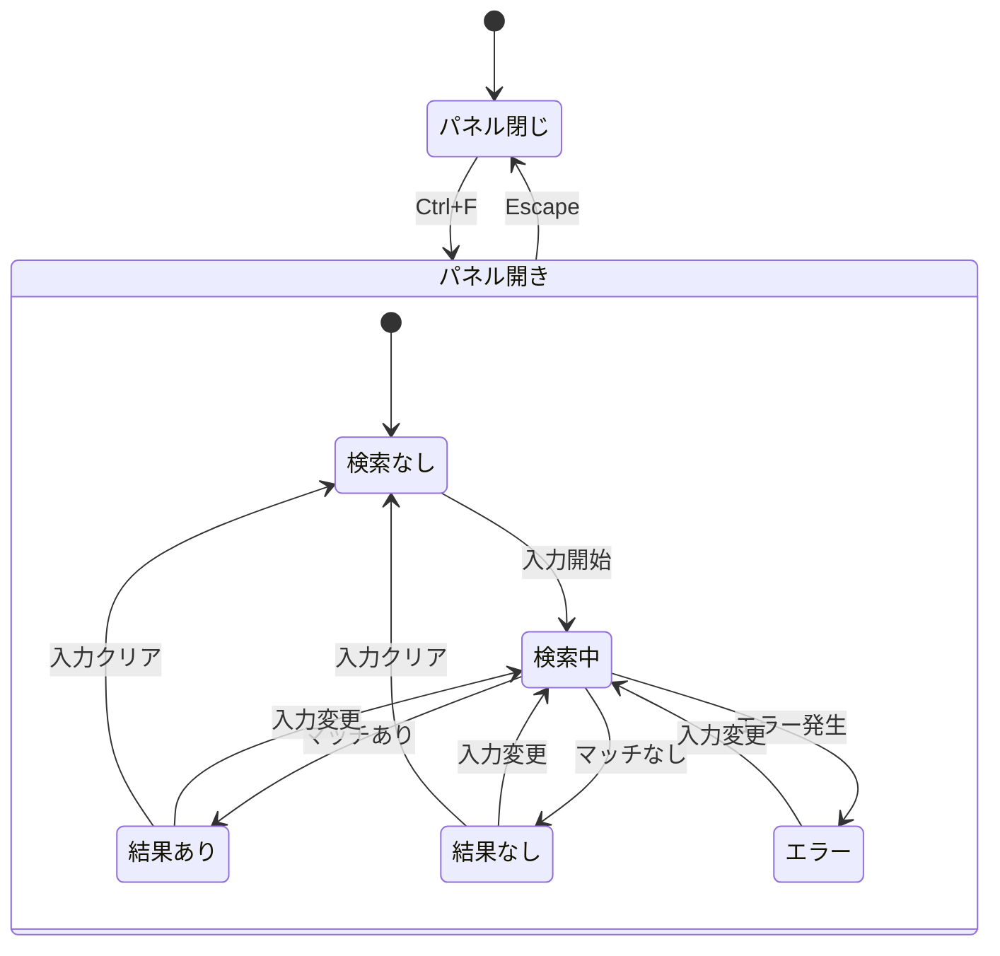
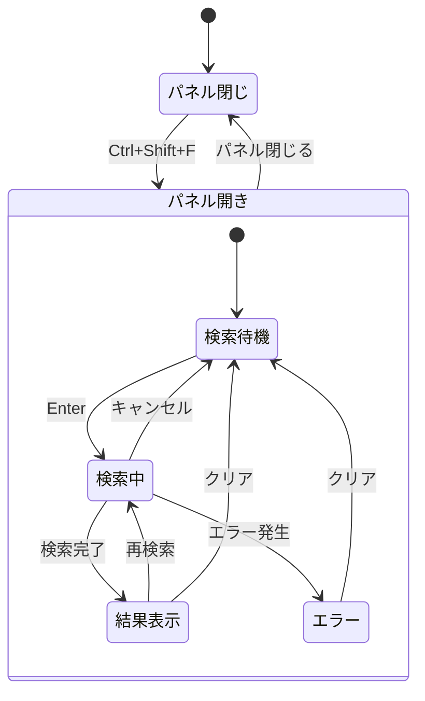

# 検索・置換機能 - 状態管理設計書

## 概要

本ドキュメントは、検索・置換機能の状態管理設計を定義する。

---

## 1. 状態構造

### 1.1 ファイル内検索状態

```typescript
interface FileSearchState {
  // 検索パネルの表示状態
  isOpen: boolean;
  // 置換パネルの展開状態
  isReplaceExpanded: boolean;

  // 検索入力
  searchTerm: string;
  replaceTerm: string;

  // 検索オプション
  options: {
    caseSensitive: boolean;
    wholeWord: boolean;
    regex: boolean;
  };

  // 検索結果
  matches: SearchMatch[];
  currentMatchIndex: number;

  // 検索状態
  isSearching: boolean;
  searchError: string | null;

  // 検索履歴
  searchHistory: string[];
  replaceHistory: string[];
}
```

### 1.2 ワークスペース検索状態

```typescript
interface WorkspaceSearchState {
  // パネルの表示状態
  isOpen: boolean;
  isReplaceExpanded: boolean;

  // 検索入力
  searchTerm: string;
  replaceTerm: string;
  filePattern: string;
  excludePattern: string;

  // 検索オプション
  options: {
    caseSensitive: boolean;
    wholeWord: boolean;
    regex: boolean;
  };

  // 検索結果
  results: FileSearchResult[];
  totalMatchCount: number;
  fileCount: number;

  // UI状態
  expandedFiles: Set<string>;
  selectedResultIndex: number;

  // 検索状態
  isSearching: boolean;
  searchProgress: number; // 0-100
  searchError: string | null;

  // 検索履歴
  searchHistory: string[];
  replaceHistory: string[];
}
```

### 1.3 グローバル検索設定

```typescript
interface SearchSettings {
  // デフォルト除外パターン
  defaultExcludePatterns: string[];

  // 検索履歴の最大保持数
  maxHistoryItems: number;

  // 検索結果の最大表示数
  maxResultsDisplay: number;

  // インクリメンタル検索の遅延 (ms)
  searchDebounceMs: number;

  // コンテキスト行数
  contextLines: number;
}
```

---

## 2. Zustand ストア設計

### 2.1 ファイル内検索ストア

```typescript
// stores/fileSearchStore.ts
import { create } from "zustand";
import { persist, subscribeWithSelector } from "zustand/middleware";
import { immer } from "zustand/middleware/immer";

interface FileSearchStore extends FileSearchState {
  // アクション: パネル操作
  openPanel: (initialTerm?: string) => void;
  closePanel: () => void;
  toggleReplacePanel: () => void;

  // アクション: 検索入力
  setSearchTerm: (term: string) => void;
  setReplaceTerm: (term: string) => void;

  // アクション: 検索オプション
  toggleCaseSensitive: () => void;
  toggleWholeWord: () => void;
  toggleRegex: () => void;

  // アクション: 検索実行
  search: (content: string) => void;
  clearSearch: () => void;

  // アクション: 結果ナビゲーション
  goToNextMatch: () => void;
  goToPreviousMatch: () => void;
  goToMatch: (index: number) => void;

  // アクション: 置換実行
  replaceCurrentMatch: (content: string) => {
    content: string;
    newIndex: number;
  };
  replaceAllMatches: (content: string) => { content: string; count: number };

  // アクション: 履歴
  addToSearchHistory: (term: string) => void;
  addToReplaceHistory: (term: string) => void;
}

export const useFileSearchStore = create<FileSearchStore>()(
  subscribeWithSelector(
    persist(
      immer((set, get) => ({
        // 初期状態
        isOpen: false,
        isReplaceExpanded: false,
        searchTerm: "",
        replaceTerm: "",
        options: {
          caseSensitive: false,
          wholeWord: false,
          regex: false,
        },
        matches: [],
        currentMatchIndex: -1,
        isSearching: false,
        searchError: null,
        searchHistory: [],
        replaceHistory: [],

        // アクション実装
        openPanel: (initialTerm) =>
          set((state) => {
            state.isOpen = true;
            if (initialTerm) {
              state.searchTerm = initialTerm;
            }
          }),

        closePanel: () =>
          set((state) => {
            state.isOpen = false;
          }),

        toggleReplacePanel: () =>
          set((state) => {
            state.isReplaceExpanded = !state.isReplaceExpanded;
          }),

        setSearchTerm: (term) =>
          set((state) => {
            state.searchTerm = term;
          }),

        setReplaceTerm: (term) =>
          set((state) => {
            state.replaceTerm = term;
          }),

        toggleCaseSensitive: () =>
          set((state) => {
            state.options.caseSensitive = !state.options.caseSensitive;
          }),

        toggleWholeWord: () =>
          set((state) => {
            state.options.wholeWord = !state.options.wholeWord;
          }),

        toggleRegex: () =>
          set((state) => {
            state.options.regex = !state.options.regex;
          }),

        search: (content) => {
          const { searchTerm, options } = get();
          if (!searchTerm) {
            set((state) => {
              state.matches = [];
              state.currentMatchIndex = -1;
            });
            return;
          }

          set((state) => {
            state.isSearching = true;
            state.searchError = null;
          });

          try {
            const searchService = new SearchService();
            const matches = searchService.searchInFile(
              content,
              searchTerm,
              options,
            );

            set((state) => {
              state.matches = matches;
              state.currentMatchIndex = matches.length > 0 ? 0 : -1;
              state.isSearching = false;
            });
          } catch (error) {
            set((state) => {
              state.searchError =
                error instanceof Error ? error.message : "Search error";
              state.isSearching = false;
            });
          }
        },

        clearSearch: () =>
          set((state) => {
            state.matches = [];
            state.currentMatchIndex = -1;
            state.searchError = null;
          }),

        goToNextMatch: () =>
          set((state) => {
            if (state.matches.length === 0) return;
            state.currentMatchIndex =
              (state.currentMatchIndex + 1) % state.matches.length;
          }),

        goToPreviousMatch: () =>
          set((state) => {
            if (state.matches.length === 0) return;
            state.currentMatchIndex =
              (state.currentMatchIndex - 1 + state.matches.length) %
              state.matches.length;
          }),

        goToMatch: (index) =>
          set((state) => {
            if (index >= 0 && index < state.matches.length) {
              state.currentMatchIndex = index;
            }
          }),

        replaceCurrentMatch: (content) => {
          const {
            searchTerm,
            replaceTerm,
            options,
            matches,
            currentMatchIndex,
          } = get();
          if (currentMatchIndex < 0 || currentMatchIndex >= matches.length) {
            return { content, newIndex: currentMatchIndex };
          }

          const searchService = new SearchService();
          const result = searchService.replaceInFile(
            content,
            searchTerm,
            replaceTerm,
            {
              ...options,
              replaceFirst: true,
              startAt: matches[currentMatchIndex],
            },
          );

          // 新しい検索を実行して結果を更新
          const newMatches = searchService.searchInFile(
            result.content,
            searchTerm,
            options,
          );
          const newIndex = Math.min(currentMatchIndex, newMatches.length - 1);

          set((state) => {
            state.matches = newMatches;
            state.currentMatchIndex = newIndex;
          });

          return { content: result.content, newIndex };
        },

        replaceAllMatches: (content) => {
          const { searchTerm, replaceTerm, options } = get();

          const searchService = new SearchService();
          const result = searchService.replaceInFile(
            content,
            searchTerm,
            replaceTerm,
            options,
          );

          set((state) => {
            state.matches = [];
            state.currentMatchIndex = -1;
          });

          return { content: result.content, count: result.count };
        },

        addToSearchHistory: (term) =>
          set((state) => {
            if (!term || state.searchHistory[0] === term) return;
            state.searchHistory = [term, ...state.searchHistory.slice(0, 49)];
          }),

        addToReplaceHistory: (term) =>
          set((state) => {
            if (!term || state.replaceHistory[0] === term) return;
            state.replaceHistory = [term, ...state.replaceHistory.slice(0, 49)];
          }),
      })),
      {
        name: "file-search-store",
        partialize: (state) => ({
          options: state.options,
          searchHistory: state.searchHistory,
          replaceHistory: state.replaceHistory,
        }),
      },
    ),
  ),
);
```

### 2.2 ワークスペース検索ストア

```typescript
// stores/workspaceSearchStore.ts
import { create } from "zustand";
import { persist, subscribeWithSelector } from "zustand/middleware";
import { immer } from "zustand/middleware/immer";

interface WorkspaceSearchStore extends WorkspaceSearchState {
  // アクション: パネル操作
  openPanel: (initialTerm?: string) => void;
  closePanel: () => void;
  toggleReplacePanel: () => void;

  // アクション: 検索入力
  setSearchTerm: (term: string) => void;
  setReplaceTerm: (term: string) => void;
  setFilePattern: (pattern: string) => void;
  setExcludePattern: (pattern: string) => void;

  // アクション: 検索オプション
  toggleCaseSensitive: () => void;
  toggleWholeWord: () => void;
  toggleRegex: () => void;

  // アクション: 検索実行
  search: (workspacePath: string) => Promise<void>;
  cancelSearch: () => void;
  clearSearch: () => void;

  // アクション: 結果操作
  toggleFileExpanded: (filePath: string) => void;
  expandAllFiles: () => void;
  collapseAllFiles: () => void;
  selectResult: (index: number) => void;

  // アクション: 置換実行
  replaceInFile: (
    filePath: string,
  ) => Promise<{ success: boolean; count: number }>;
  replaceAll: () => Promise<{
    success: boolean;
    totalCount: number;
    fileCount: number;
  }>;
}

export const useWorkspaceSearchStore = create<WorkspaceSearchStore>()(
  subscribeWithSelector(
    persist(
      immer((set, get) => ({
        // 初期状態
        isOpen: false,
        isReplaceExpanded: false,
        searchTerm: "",
        replaceTerm: "",
        filePattern: "",
        excludePattern: "",
        options: {
          caseSensitive: false,
          wholeWord: false,
          regex: false,
        },
        results: [],
        totalMatchCount: 0,
        fileCount: 0,
        expandedFiles: new Set<string>(),
        selectedResultIndex: -1,
        isSearching: false,
        searchProgress: 0,
        searchError: null,
        searchHistory: [],
        replaceHistory: [],

        // アクション実装
        openPanel: (initialTerm) =>
          set((state) => {
            state.isOpen = true;
            if (initialTerm) {
              state.searchTerm = initialTerm;
            }
          }),

        closePanel: () =>
          set((state) => {
            state.isOpen = false;
          }),

        // ... 他のアクション実装

        search: async (workspacePath) => {
          const { searchTerm, options, filePattern, excludePattern } = get();
          if (!searchTerm) return;

          set((state) => {
            state.isSearching = true;
            state.searchProgress = 0;
            state.results = [];
            state.totalMatchCount = 0;
            state.fileCount = 0;
            state.searchError = null;
          });

          try {
            const searchService = new SearchService();
            const searchOptions: WorkspaceSearchOptions = {
              ...options,
              include: filePattern
                ? filePattern.split(",").map((p) => p.trim())
                : undefined,
              exclude: excludePattern
                ? excludePattern.split(",").map((p) => p.trim())
                : undefined,
            };

            const results: FileSearchResult[] = [];
            let totalMatches = 0;

            for await (const result of searchService.searchInWorkspace(
              searchTerm,
              searchOptions,
            )) {
              results.push(result);
              totalMatches += result.matches.length;

              set((state) => {
                state.results = [...results];
                state.totalMatchCount = totalMatches;
                state.fileCount = results.length;
                // 最初の5ファイルは自動展開
                if (results.length <= 5) {
                  state.expandedFiles.add(result.filePath);
                }
              });
            }

            set((state) => {
              state.isSearching = false;
              state.searchProgress = 100;
            });
          } catch (error) {
            set((state) => {
              state.searchError =
                error instanceof Error ? error.message : "Search error";
              state.isSearching = false;
            });
          }
        },

        cancelSearch: () => {
          const searchService = new SearchService();
          searchService.cancelSearch();

          set((state) => {
            state.isSearching = false;
          });
        },

        toggleFileExpanded: (filePath) =>
          set((state) => {
            if (state.expandedFiles.has(filePath)) {
              state.expandedFiles.delete(filePath);
            } else {
              state.expandedFiles.add(filePath);
            }
          }),

        expandAllFiles: () =>
          set((state) => {
            state.expandedFiles = new Set(state.results.map((r) => r.filePath));
          }),

        collapseAllFiles: () =>
          set((state) => {
            state.expandedFiles = new Set();
          }),
      })),
      {
        name: "workspace-search-store",
        partialize: (state) => ({
          options: state.options,
          filePattern: state.filePattern,
          excludePattern: state.excludePattern,
          searchHistory: state.searchHistory,
          replaceHistory: state.replaceHistory,
        }),
      },
    ),
  ),
);
```

---

## 3. カスタムフック設計

### 3.1 useSearch

```typescript
// hooks/useSearch.ts
import { useCallback, useEffect } from "react";
import { useFileSearchStore } from "../stores/fileSearchStore";
import { useDebounce } from "./useDebounce";

interface UseSearchOptions {
  editorContent: string;
  debounceMs?: number;
}

export function useSearch({
  editorContent,
  debounceMs = 150,
}: UseSearchOptions) {
  const {
    searchTerm,
    options,
    matches,
    currentMatchIndex,
    isSearching,
    searchError,
    setSearchTerm,
    search,
    goToNextMatch,
    goToPreviousMatch,
    goToMatch,
    clearSearch,
    toggleCaseSensitive,
    toggleWholeWord,
    toggleRegex,
  } = useFileSearchStore();

  const debouncedSearchTerm = useDebounce(searchTerm, debounceMs);

  // 検索の自動実行
  useEffect(() => {
    if (debouncedSearchTerm) {
      search(editorContent);
    } else {
      clearSearch();
    }
  }, [debouncedSearchTerm, editorContent, options, search, clearSearch]);

  // 現在のマッチ情報
  const currentMatch =
    currentMatchIndex >= 0 ? matches[currentMatchIndex] : null;

  return {
    // 状態
    searchTerm,
    matches,
    currentMatch,
    currentMatchIndex,
    totalMatches: matches.length,
    isSearching,
    searchError,
    hasMatches: matches.length > 0,
    hasNoResults: searchTerm.length > 0 && matches.length === 0 && !isSearching,

    // 検索オプション
    options,

    // アクション
    setSearchTerm,
    goToNextMatch,
    goToPreviousMatch,
    goToMatch,
    toggleCaseSensitive,
    toggleWholeWord,
    toggleRegex,
  };
}
```

### 3.2 useReplace

```typescript
// hooks/useReplace.ts
import { useCallback } from "react";
import { useFileSearchStore } from "../stores/fileSearchStore";

interface UseReplaceOptions {
  onContentChange: (newContent: string) => void;
}

export function useReplace({ onContentChange }: UseReplaceOptions) {
  const {
    replaceTerm,
    matches,
    currentMatchIndex,
    setReplaceTerm,
    replaceCurrentMatch,
    replaceAllMatches,
    addToReplaceHistory,
  } = useFileSearchStore();

  const handleReplace = useCallback(
    (content: string) => {
      if (!replaceTerm || currentMatchIndex < 0) return;

      addToReplaceHistory(replaceTerm);
      const { content: newContent } = replaceCurrentMatch(content);
      onContentChange(newContent);
    },
    [
      replaceTerm,
      currentMatchIndex,
      replaceCurrentMatch,
      onContentChange,
      addToReplaceHistory,
    ],
  );

  const handleReplaceAll = useCallback(
    (content: string) => {
      if (!replaceTerm || matches.length === 0) return;

      addToReplaceHistory(replaceTerm);
      const { content: newContent, count } = replaceAllMatches(content);
      onContentChange(newContent);

      return count;
    },
    [
      replaceTerm,
      matches.length,
      replaceAllMatches,
      onContentChange,
      addToReplaceHistory,
    ],
  );

  return {
    replaceTerm,
    setReplaceTerm,
    canReplace: replaceTerm.length > 0 && currentMatchIndex >= 0,
    canReplaceAll: replaceTerm.length > 0 && matches.length > 0,
    replace: handleReplace,
    replaceAll: handleReplaceAll,
  };
}
```

### 3.3 useSearchShortcuts

```typescript
// hooks/useSearchShortcuts.ts
import { useEffect, useCallback } from "react";
import { useFileSearchStore } from "../stores/fileSearchStore";
import { useWorkspaceSearchStore } from "../stores/workspaceSearchStore";

interface UseSearchShortcutsOptions {
  enabled?: boolean;
  onOpenFile?: () => void;
}

export function useSearchShortcuts({
  enabled = true,
  onOpenFile,
}: UseSearchShortcutsOptions = {}) {
  const fileSearchStore = useFileSearchStore();
  const workspaceSearchStore = useWorkspaceSearchStore();

  const handleKeyDown = useCallback(
    (event: KeyboardEvent) => {
      if (!enabled) return;

      const isMac = navigator.platform.includes("Mac");
      const modKey = isMac ? event.metaKey : event.ctrlKey;

      // Ctrl+F / Cmd+F: ファイル内検索を開く
      if (modKey && event.key === "f" && !event.shiftKey) {
        event.preventDefault();
        fileSearchStore.openPanel();
        return;
      }

      // Ctrl+H / Cmd+H: 置換パネルを開く
      if (modKey && event.key === "h") {
        event.preventDefault();
        fileSearchStore.openPanel();
        fileSearchStore.toggleReplacePanel();
        return;
      }

      // Ctrl+Shift+F / Cmd+Shift+F: ワークスペース検索を開く
      if (modKey && event.shiftKey && event.key === "f") {
        event.preventDefault();
        workspaceSearchStore.openPanel();
        return;
      }

      // 検索パネルが開いている場合のショートカット
      if (fileSearchStore.isOpen) {
        // Escape: 検索パネルを閉じる
        if (event.key === "Escape") {
          event.preventDefault();
          fileSearchStore.closePanel();
          return;
        }

        // F3: 次の結果
        if (event.key === "F3" && !event.shiftKey) {
          event.preventDefault();
          fileSearchStore.goToNextMatch();
          return;
        }

        // Shift+F3: 前の結果
        if (event.key === "F3" && event.shiftKey) {
          event.preventDefault();
          fileSearchStore.goToPreviousMatch();
          return;
        }

        // Alt+C: 大文字/小文字区別を切替
        if (event.altKey && event.key === "c") {
          event.preventDefault();
          fileSearchStore.toggleCaseSensitive();
          return;
        }

        // Alt+R: 正規表現モードを切替
        if (event.altKey && event.key === "r") {
          event.preventDefault();
          fileSearchStore.toggleRegex();
          return;
        }

        // Alt+W: 単語単位検索を切替
        if (event.altKey && event.key === "w") {
          event.preventDefault();
          fileSearchStore.toggleWholeWord();
          return;
        }
      }
    },
    [enabled, fileSearchStore, workspaceSearchStore],
  );

  useEffect(() => {
    window.addEventListener("keydown", handleKeyDown);
    return () => window.removeEventListener("keydown", handleKeyDown);
  }, [handleKeyDown]);

  return {
    isFileSearchOpen: fileSearchStore.isOpen,
    isWorkspaceSearchOpen: workspaceSearchStore.isOpen,
  };
}
```

---

## 4. 状態の永続化

### 4.1 永続化対象

| 状態             | 永続化 | ストレージ   | 理由                         |
| ---------------- | ------ | ------------ | ---------------------------- |
| 検索オプション   | ○      | localStorage | ユーザー設定を保持           |
| 検索履歴         | ○      | localStorage | 利便性向上                   |
| 置換履歴         | ○      | localStorage | 利便性向上                   |
| ファイルパターン | ○      | localStorage | 頻繁に使用するパターンを保持 |
| 除外パターン     | ○      | localStorage | 頻繁に使用するパターンを保持 |
| 検索結果         | ×      | -            | セッション固有               |
| パネル表示状態   | ×      | -            | セッション固有               |

### 4.2 Zustand persist ミドルウェア設定

```typescript
persist(
  (set, get) => ({
    // ... ストア定義
  }),
  {
    name: "search-store",
    // 永続化対象のみ選択
    partialize: (state) => ({
      options: state.options,
      searchHistory: state.searchHistory,
      replaceHistory: state.replaceHistory,
    }),
    // セッション間でのマイグレーション
    version: 1,
    migrate: (persistedState, version) => {
      if (version === 0) {
        // v0 から v1 へのマイグレーション
        return {
          ...persistedState,
          options: {
            ...persistedState.options,
            // 新しいオプションのデフォルト値を設定
          },
        };
      }
      return persistedState;
    },
  },
);
```

---

## 5. 状態遷移図

### 5.1 ファイル内検索の状態遷移



### 5.2 ワークスペース検索の状態遷移



---

## 6. パフォーマンス最適化

### 6.1 セレクターの最適化

```typescript
// 必要な状態のみを購読
const searchTerm = useFileSearchStore((state) => state.searchTerm);
const matches = useFileSearchStore((state) => state.matches);

// 複数の状態を浅い比較で購読
const { searchTerm, options } = useFileSearchStore(
  useShallow((state) => ({
    searchTerm: state.searchTerm,
    options: state.options,
  })),
);
```

### 6.2 メモ化

```typescript
// 派生データのメモ化
const currentMatch = useMemo(() => {
  if (currentMatchIndex < 0 || currentMatchIndex >= matches.length) {
    return null;
  }
  return matches[currentMatchIndex];
}, [matches, currentMatchIndex]);

// コールバックのメモ化
const handleSearchChange = useCallback(
  (term: string) => {
    setSearchTerm(term);
  },
  [setSearchTerm],
);
```

### 6.3 バッチ更新

```typescript
// 複数の状態更新をバッチ化
set((state) => {
  state.searchTerm = term;
  state.matches = [];
  state.currentMatchIndex = -1;
  state.isSearching = true;
});
```
