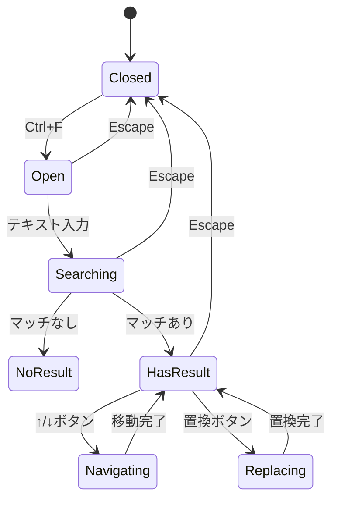

# 検索・置換機能 - UI設計書

## 概要

本ドキュメントは、ファイル内検索/置換およびワークスペース検索/置換のUI設計を定義する。

---

## 1. ファイル内検索パネル

### 1.1 ワイヤーフレーム

```
┌─────────────────────────────────────────────────────────────────┐
│ ┌───────────────────────────────────────┬───┬───┬───┬───┬───┐  │
│ │ 🔍 検索テキスト                       │Aa │.* │Ab │ ↑ │ ↓ │  │
│ └───────────────────────────────────────┴───┴───┴───┴───┴───┘  │
│ ┌───────────────────────────────────────┬───────┬───────────┐  │
│ │ ↔  置換テキスト                       │ 置換  │  全置換   │  │
│ └───────────────────────────────────────┴───────┴───────────┘  │
│                                                      3/10件    │
└─────────────────────────────────────────────────────────────────┘
```

### 1.2 コンポーネント配置

| 要素                         | 位置   | サイズ    | 説明             |
| ---------------------------- | ------ | --------- | ---------------- |
| 検索入力フィールド           | 上段左 | flex-1    | 検索テキスト入力 |
| Aaボタン (大文字/小文字区別) | 上段右 | 24x24px   | トグルボタン     |
| .\*ボタン (正規表現)         | 上段右 | 24x24px   | トグルボタン     |
| Abボタン (単語単位)          | 上段右 | 24x24px   | トグルボタン     |
| ↑/↓ボタン (前/次)            | 上段右 | 各24x24px | ナビゲーション   |
| 置換入力フィールド           | 下段左 | flex-1    | 置換テキスト入力 |
| 置換ボタン                   | 下段右 | auto      | 単一置換         |
| 全置換ボタン                 | 下段右 | auto      | 全置換           |
| 結果カウント                 | 右下   | auto      | "X/Y件" 形式     |

### 1.3 インタラクション

| 操作                       | 動作                 | フィードバック                        |
| -------------------------- | -------------------- | ------------------------------------- |
| 検索テキスト入力           | インクリメンタル検索 | リアルタイムでハイライト更新          |
| オプションボタンクリック   | オプション切替       | ボタン状態変更 + 検索再実行           |
| ↓ボタンクリック / F3       | 次の結果へ移動       | カーソル移動 + カウント更新           |
| ↑ボタンクリック / Shift+F3 | 前の結果へ移動       | カーソル移動 + カウント更新           |
| 置換ボタンクリック         | 現在のマッチを置換   | テキスト置換 + 次へ移動               |
| 全置換ボタンクリック       | 全マッチを置換       | 置換完了通知                          |
| Escape                     | パネルを閉じる       | パネル非表示 + エディターにフォーカス |

### 1.4 状態遷移



---

## 2. ワークスペース検索パネル

### 2.1 ワイヤーフレーム

```
┌────────────────────────────────────────────────────────────────┐
│ 🔍 ワークスペース検索                                    [×]  │
├────────────────────────────────────────────────────────────────┤
│ ┌──────────────────────────────────────┬───┬───┬───┐          │
│ │ 検索テキスト                         │Aa │.* │Ab │          │
│ └──────────────────────────────────────┴───┴───┴───┘          │
│ ┌──────────────────────────────────────┬────────┬────────┐    │
│ │ 置換テキスト                         │  置換  │ 全置換 │    │
│ └──────────────────────────────────────┴────────┴────────┘    │
│ ┌──────────────────────────────────────────────────────────┐  │
│ │ 📂 ファイルパターン (例: *.ts, *.tsx)                    │  │
│ └──────────────────────────────────────────────────────────┘  │
│ ┌──────────────────────────────────────────────────────────┐  │
│ │ 🚫 除外パターン (例: node_modules, dist)                 │  │
│ └──────────────────────────────────────────────────────────┘  │
├────────────────────────────────────────────────────────────────┤
│ 検索結果: 25件（5ファイル）                      [折りたたむ] │
├────────────────────────────────────────────────────────────────┤
│ ▼ 📁 src/components/Editor.tsx (5件)                          │
│   │ 23: const search = useSearch();                           │
│   │ 45: function searchText(query: string) {                  │
│   └ 67: return searchResult;                                  │
│                                                                │
│ ▼ 📁 src/hooks/useSearch.ts (3件)                             │
│   │ 12: export function useSearch() {                         │
│   └ 34: const [searchTerm, setSearchTerm] = useState('');     │
│                                                                │
│ ▶ 📁 src/services/SearchService.ts (10件)                     │
│                                                                │
│ ▶ 📁 packages/shared/search/index.ts (4件)                    │
│                                                                │
│ ▶ 📁 tests/search.test.ts (3件)                               │
└────────────────────────────────────────────────────────────────┘
```

### 2.2 コンポーネント配置

| 要素                 | 位置   | サイズ        | 説明                    |
| -------------------- | ------ | ------------- | ----------------------- |
| パネルヘッダー       | 最上部 | 固定高さ 32px | タイトル + 閉じるボタン |
| 検索入力セクション   | 上部   | auto          | 検索/置換/オプション    |
| ファイルパターン入力 | 中部   | 全幅          | 検索対象ファイルの指定  |
| 除外パターン入力     | 中部   | 全幅          | 除外対象の指定          |
| 結果サマリー         | 中部   | 固定高さ 24px | 件数表示                |
| 検索結果ツリー       | 下部   | flex-1        | スクロール可能なツリー  |

### 2.3 検索結果アイテム

```
┌─────────────────────────────────────────────────────────────┐
│ ▼ 📁 src/components/Editor.tsx (5件)          [□ 選択]     │
├─────────────────────────────────────────────────────────────┤
│   23│ const [search] = useSearch();                         │
│     │        ~~~~~~                                         │
│   45│ function searchText(query: string) {                  │
│     │          ~~~~~~~~~~                                   │
│   67│   return searchResult;                                │
│     │          ~~~~~~~~~~~~                                 │
└─────────────────────────────────────────────────────────────┘
```

### 2.4 インタラクション

| 操作                   | 動作                     | フィードバック             |
| ---------------------- | ------------------------ | -------------------------- |
| Enter (検索フィールド) | ワークスペース検索実行   | プログレス表示 → 結果表示  |
| ファイル名クリック     | ツリー展開/折りたたみ    | アニメーション付き         |
| 結果行クリック         | 該当ファイル・行を開く   | エディターにフォーカス移動 |
| 結果行ダブルクリック   | ファイルを開いて置換確認 | インライン置換UI表示       |
| 全置換ボタン           | 確認ダイアログ表示       | モーダル表示               |
| プレビュー             | Diff形式でプレビュー     | プレビューパネル表示       |

---

## 3. キーボードショートカット

### 3.1 グローバルショートカット

| ショートカット | macOS       | 機能                           |
| -------------- | ----------- | ------------------------------ |
| Ctrl+F         | Cmd+F       | ファイル内検索パネルを開く     |
| Ctrl+H         | Cmd+H       | ファイル内置換パネルを開く     |
| Ctrl+Shift+F   | Cmd+Shift+F | ワークスペース検索パネルを開く |
| Ctrl+Shift+H   | Cmd+Shift+H | ワークスペース置換パネルを開く |

### 3.2 検索パネル内ショートカット

| ショートカット                    | 機能                    |
| --------------------------------- | ----------------------- |
| Enter                             | 次の検索結果へ移動      |
| Shift+Enter                       | 前の検索結果へ移動      |
| F3                                | 次の検索結果へ移動      |
| Shift+F3                          | 前の検索結果へ移動      |
| Escape                            | 検索パネルを閉じる      |
| Alt+C                             | 大文字/小文字区別を切替 |
| Alt+R                             | 正規表現モードを切替    |
| Alt+W                             | 単語単位検索を切替      |
| Ctrl+Shift+1 (Cmd+Shift+1)        | 現在のマッチを置換      |
| Ctrl+Alt+Enter (Cmd+Option+Enter) | 全置換                  |

### 3.3 ワークスペース検索パネル内ショートカット

| ショートカット     | 機能                  |
| ------------------ | --------------------- |
| Enter              | 検索を実行            |
| ↑/↓                | 結果間を移動          |
| Enter (結果選択時) | 該当ファイルを開く    |
| Space              | 結果の展開/折りたたみ |

---

## 4. アクセシビリティ設計

### 4.1 ARIA属性

| 要素             | ARIA属性         | 値                 |
| ---------------- | ---------------- | ------------------ |
| 検索パネル       | role             | dialog             |
| 検索パネル       | aria-label       | ファイル内検索     |
| 検索入力         | role             | searchbox          |
| 検索入力         | aria-describedby | 検索オプション説明 |
| オプションボタン | role             | checkbox           |
| オプションボタン | aria-checked     | true/false         |
| 結果カウント     | aria-live        | polite             |
| 検索結果リスト   | role             | tree               |
| 検索結果アイテム | role             | treeitem           |

### 4.2 フォーカス管理

| イベント       | フォーカス先           |
| -------------- | ---------------------- |
| パネルを開く   | 検索入力フィールド     |
| 検索実行       | 最初の結果             |
| 結果クリック   | エディター内の該当位置 |
| パネルを閉じる | 元のエディター位置     |

### 4.3 キーボードトラップ

- 検索パネル内でTabキーは入力フィールドとボタン間を循環
- Shift+Tabで逆順に移動
- パネル外へのフォーカス移動はEscapeキーのみ

### 4.4 スクリーンリーダー対応

| イベント     | 読み上げ内容                   |
| ------------ | ------------------------------ |
| 検索結果更新 | "X件の結果が見つかりました"    |
| 結果間移動   | "Y件中X件目: [マッチテキスト]" |
| 置換実行     | "置換完了: [新テキスト]"       |
| 全置換実行   | "X件を置換しました"            |
| マッチなし   | "結果が見つかりませんでした"   |

---

## 5. 視覚デザイン

### 5.1 カラースキーム

| 要素                    | ライトモード  | ダークモード  |
| ----------------------- | ------------- | ------------- |
| パネル背景              | #FFFFFF       | #1E1E1E       |
| 入力フィールド背景      | #F5F5F5       | #3C3C3C       |
| 入力フィールドボーダー  | #E0E0E0       | #555555       |
| フォーカスボーダー      | #2196F3       | #64B5F6       |
| マッチハイライト背景    | #FFFF00 (50%) | #A88B00 (50%) |
| 現在のマッチ背景        | #FFA500       | #CC8400       |
| オプションボタン（OFF） | #757575       | #9E9E9E       |
| オプションボタン（ON）  | #2196F3       | #64B5F6       |
| 結果なし警告            | #F44336       | #EF5350       |

### 5.2 タイポグラフィ

| 要素             | フォント         | サイズ | 重み |
| ---------------- | ---------------- | ------ | ---- |
| 入力フィールド   | システムフォント | 13px   | 400  |
| オプションボタン | アイコンフォント | 14px   | 600  |
| 結果カウント     | システムフォント | 12px   | 400  |
| ファイル名       | システムフォント | 13px   | 600  |
| コード行         | Monospace        | 12px   | 400  |
| 行番号           | Monospace        | 12px   | 400  |

### 5.3 スペーシング

| 要素           | パディング/マージン             |
| -------------- | ------------------------------- |
| パネル全体     | padding: 8px                    |
| 入力フィールド | padding: 4px 8px                |
| ボタン間隔     | gap: 4px                        |
| セクション間隔 | margin-bottom: 8px              |
| ツリーアイテム | padding-left: 16px (インデント) |

---

## 6. レスポンシブ対応

### 6.1 パネル幅の調整

| ウィンドウ幅 | 検索パネル幅 | 配置                   |
| ------------ | ------------ | ---------------------- |
| < 600px      | 100%         | フルワイドオーバーレイ |
| 600-1200px   | 400px        | サイドパネル           |
| > 1200px     | 500px        | サイドパネル           |

### 6.2 ワークスペース検索パネルの幅

| ウィンドウ幅 | パネル幅 | 配置         |
| ------------ | -------- | ------------ |
| < 800px      | 100%     | 画面全体     |
| 800-1400px   | 350px    | サイドパネル |
| > 1400px     | 400px    | サイドパネル |
