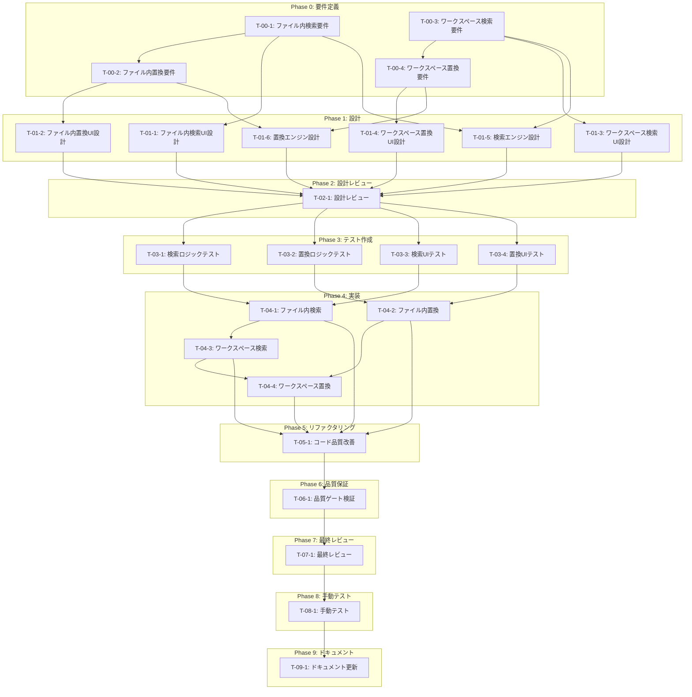

# 検索・置換機能 - タスク実行仕様書

## ユーザーからの元の指示

```
編集しているファイル内での文字検索、置換などできるようにしてほしいです。
あとはこのワークスペース全体での文字の検索、置換もできるようにしてほしいです。
```

## メタ情報

| 項目             | 内容                       |
| ---------------- | -------------------------- |
| タスクID         | TASK-SEARCH-REPLACE-001    |
| タスク名         | 検索・置換機能             |
| 分類             | 新規機能                   |
| 対象機能         | エディター・ワークスペース |
| 優先度           | 高                         |
| 見積もり規模     | 中規模                     |
| ステータス       | 未実施                     |
| 発見元           | ユーザー要望               |
| 発見日           | 2025-12-11                 |
| 発見エージェント | @product-manager           |

---

## タスク概要

### 目的

ファイル内およびワークスペース全体での検索・置換機能を実装し、効率的なテキスト編集を可能にする。テキストエディターの基本機能として必須であり、VS Code のような使い勝手を目指す。

### 背景

テキストエディターの基本機能として、検索と置換は必須の機能である。現在、ファイル内での文字検索や置換ができず、外部エディターを使用する必要がある。また、ワークスペース全体での検索・置換も開発効率を大きく向上させる機能である。

### 最終ゴール

**ファイル内検索・置換**

- Ctrl+F で検索パネルを表示
- 検索結果のハイライト表示
- 次/前の検索結果への移動
- 単一置換・全置換
- 正規表現対応
- 大文字/小文字区別オプション
- 単語単位検索オプション

**ワークスペース検索・置換**

- Ctrl+Shift+F でワークスペース検索パネルを表示
- ファイルをまたいだ検索結果一覧
- 検索結果からファイルへのジャンプ
- ワークスペース全体での置換
- 除外パターン設定（node_modules 等）
- ファイルタイプフィルタ

### 成果物一覧

| 種別         | 成果物                             | 配置先                                      |
| ------------ | ---------------------------------- | ------------------------------------------- |
| 機能         | ファイル内検索UIコンポーネント     | `apps/desktop/src/renderer/components/`     |
| 機能         | ワークスペース検索UIコンポーネント | `apps/desktop/src/renderer/components/`     |
| 機能         | 検索・置換ロジック                 | `apps/desktop/src/main/`, `packages/shared` |
| 機能         | キーボードショートカット設定       | `apps/desktop/src/renderer/hooks/`          |
| 品質         | ユニットテスト                     | `*.test.ts`                                 |
| 品質         | コンポーネントテスト               | `*.test.tsx`                                |
| ドキュメント | 技術ドキュメント                   | `docs/`                                     |

---

## 参照ファイル

本仕様書のコマンド・エージェント・スキル選定は以下を参照：

- `docs/00-requirements/master_system_design.md` - システム要件
- `.claude/commands/ai/command_list.md` - /ai:コマンド定義
- `.claude/agents/agent_list.md` - エージェント定義
- `.claude/skills/skill_list.md` - スキル定義

---

## タスク分解サマリー

| ID     | フェーズ         | サブタスク名               | 責務                               | 依存     |
| ------ | ---------------- | -------------------------- | ---------------------------------- | -------- |
| T-00-1 | 要件定義         | ファイル内検索要件定義     | ファイル内検索機能の要件明確化     | -        |
| T-00-2 | 要件定義         | ファイル内置換要件定義     | ファイル内置換機能の要件明確化     | T-00-1   |
| T-00-3 | 要件定義         | ワークスペース検索要件定義 | ワークスペース検索機能の要件明確化 | -        |
| T-00-4 | 要件定義         | ワークスペース置換要件定義 | ワークスペース置換機能の要件明確化 | T-00-3   |
| T-01-1 | 設計             | ファイル内検索UI設計       | 検索パネルUIの設計                 | T-00-1   |
| T-01-2 | 設計             | ファイル内置換UI設計       | 置換パネルUIの設計                 | T-00-2   |
| T-01-3 | 設計             | ワークスペース検索UI設計   | ワークスペース検索パネルUIの設計   | T-00-3   |
| T-01-4 | 設計             | ワークスペース置換UI設計   | ワークスペース置換パネルUIの設計   | T-00-4   |
| T-01-5 | 設計             | 検索エンジン設計           | 検索ロジックのアーキテクチャ設計   | T-00-1,3 |
| T-01-6 | 設計             | 置換エンジン設計           | 置換ロジックのアーキテクチャ設計   | T-00-2,4 |
| T-02-1 | 設計レビュー     | 設計レビュー実施           | 設計の妥当性検証                   | T-01-\*  |
| T-03-1 | テスト作成       | 検索ロジックテスト作成     | 検索エンジンのユニットテスト作成   | T-02-1   |
| T-03-2 | テスト作成       | 置換ロジックテスト作成     | 置換エンジンのユニットテスト作成   | T-02-1   |
| T-03-3 | テスト作成       | 検索UIテスト作成           | 検索UIコンポーネントのテスト作成   | T-02-1   |
| T-03-4 | テスト作成       | 置換UIテスト作成           | 置換UIコンポーネントのテスト作成   | T-02-1   |
| T-04-1 | 実装             | ファイル内検索実装         | ファイル内検索機能の実装           | T-03-1,3 |
| T-04-2 | 実装             | ファイル内置換実装         | ファイル内置換機能の実装           | T-03-2,4 |
| T-04-3 | 実装             | ワークスペース検索実装     | ワークスペース検索機能の実装       | T-04-1   |
| T-04-4 | 実装             | ワークスペース置換実装     | ワークスペース置換機能の実装       | T-04-2,3 |
| T-05-1 | リファクタリング | コード品質改善             | 重複排除・命名改善・構造最適化     | T-04-\*  |
| T-06-1 | 品質保証         | 品質ゲート検証             | テスト・Lint・型チェック           | T-05-1   |
| T-07-1 | 最終レビュー     | 最終レビュー実施           | 実装品質の最終確認                 | T-06-1   |
| T-08-1 | 手動テスト       | 手動テスト実施             | ユーザー視点での動作確認           | T-07-1   |
| T-09-1 | ドキュメント更新 | システムドキュメント更新   | 要件ドキュメントへの反映           | T-08-1   |

**総サブタスク数**: 24個

---

## 実行フロー図



---

## Phase 0: 要件定義

### T-00-1: ファイル内検索要件定義

#### 目的

ファイル内検索機能の要件を明確化し、実装の基盤となる仕様を確定する。

#### 背景

検索機能の実装前に、ユーザーが期待する機能と動作を明確にする必要がある。VS Code などの既存エディターを参考に、必要十分な機能セットを定義する。

#### 責務（単一責務）

ファイル内**検索**機能の要件定義のみを担当する。置換機能は T-00-2 で定義する。

#### Claude Code スラッシュコマンド

> ⚠️ 以下はターミナルコマンドではなく、Claude Code内で実行するスラッシュコマンドです

```
/ai:gather-requirements file-search
```

- **参照**: `.claude/commands/ai/command_list.md`

#### 使用エージェント

- **エージェント**: @req-analyst
- **選定理由**: 要求工学の専門家として、曖昧な要望を検証可能な要件に変換する能力を持つ
- **参照**: `.claude/agents/agent_list.md`

#### 活用スキル

| スキル名                               | 活用方法                                 |
| -------------------------------------- | ---------------------------------------- |
| requirements-engineering               | MoSCoW 優先度でファイル内検索要件を分類  |
| acceptance-criteria-writing            | Given-When-Then 形式で受け入れ基準を定義 |
| functional-non-functional-requirements | FR/NFR を明確に分類                      |

- **参照**: `.claude/skills/skill_list.md`

#### 成果物

| 成果物     | パス                                                                         | 内容                     |
| ---------- | ---------------------------------------------------------------------------- | ------------------------ |
| 要件定義書 | `docs/30-workflows/search-replace/task-step00-1-file-search-requirements.md` | ファイル内検索の詳細要件 |

#### 完了条件

- [ ] 機能要件が Given-When-Then 形式で定義されている
- [ ] 非機能要件（パフォーマンス、アクセシビリティ）が定義されている
- [ ] MoSCoW 優先度が付与されている
- [ ] キーボードショートカットが定義されている
- [ ] 検索オプション（大文字/小文字、正規表現、単語単位）が定義されている

#### 依存関係

- **前提**: なし
- **後続**: T-00-2, T-01-1, T-01-5

---

### T-00-2: ファイル内置換要件定義

#### 目的

ファイル内置換機能の要件を明確化する。検索結果に対する置換操作の仕様を定義する。

#### 背景

置換機能は検索機能と密接に関連するが、独自の要件（単一置換、全置換、正規表現キャプチャグループ対応等）を持つため、別途定義が必要。

#### 責務（単一責務）

ファイル内**置換**機能の要件定義のみを担当する。

#### Claude Code スラッシュコマンド

> ⚠️ 以下はターミナルコマンドではなく、Claude Code内で実行するスラッシュコマンドです

```
/ai:gather-requirements file-replace
```

- **参照**: `.claude/commands/ai/command_list.md`

#### 使用エージェント

- **エージェント**: @req-analyst
- **選定理由**: 検索機能との整合性を考慮した要件定義が可能
- **参照**: `.claude/agents/agent_list.md`

#### 活用スキル

| スキル名                    | 活用方法                                    |
| --------------------------- | ------------------------------------------- |
| requirements-engineering    | 置換機能の要件を体系的に整理                |
| acceptance-criteria-writing | 置換操作のシナリオを Given-When-Then で定義 |
| use-case-modeling           | 単一置換、全置換、Undo のユースケース定義   |

- **参照**: `.claude/skills/skill_list.md`

#### 成果物

| 成果物     | パス                                                                          | 内容                     |
| ---------- | ----------------------------------------------------------------------------- | ------------------------ |
| 要件定義書 | `docs/30-workflows/search-replace/task-step00-2-file-replace-requirements.md` | ファイル内置換の詳細要件 |

#### 完了条件

- [ ] 単一置換の要件が定義されている
- [ ] 全置換の要件が定義されている
- [ ] 正規表現キャプチャグループ（$1, $2 等）の要件が定義されている
- [ ] 置換プレビュー機能の要件が定義されている
- [ ] Undo/Redo との連携要件が定義されている

#### 依存関係

- **前提**: T-00-1（検索要件に基づいて置換要件を定義）
- **後続**: T-01-2, T-01-6

---

### T-00-3: ワークスペース検索要件定義

#### 目的

ワークスペース全体での検索機能の要件を明確化する。

#### 背景

複数ファイルにまたがる検索は、リファクタリングや一括変更時に必須の機能である。除外パターンやファイルタイプフィルタなど、実用的な要件を定義する。

#### 責務（単一責務）

ワークスペース**検索**機能の要件定義のみを担当する。置換機能は T-00-4 で定義する。

#### Claude Code スラッシュコマンド

> ⚠️ 以下はターミナルコマンドではなく、Claude Code内で実行するスラッシュコマンドです

```
/ai:gather-requirements workspace-search
```

- **参照**: `.claude/commands/ai/command_list.md`

#### 使用エージェント

- **エージェント**: @req-analyst
- **選定理由**: ステークホルダーヒアリングと要件整理の専門家
- **参照**: `.claude/agents/agent_list.md`

#### 活用スキル

| スキル名                 | 活用方法                                         |
| ------------------------ | ------------------------------------------------ |
| requirements-engineering | ワークスペース検索の要件を体系的に整理           |
| use-case-modeling        | 検索→結果表示→ジャンプのユースケースシナリオ作成 |
| interview-techniques     | ユーザー要望を 5W1H で深堀り                     |

- **参照**: `.claude/skills/skill_list.md`

#### 成果物

| 成果物     | パス                                                                              | 内容                         |
| ---------- | --------------------------------------------------------------------------------- | ---------------------------- |
| 要件定義書 | `docs/30-workflows/search-replace/task-step00-3-workspace-search-requirements.md` | ワークスペース検索の詳細要件 |

#### 完了条件

- [ ] 検索結果の表示形式（グルーピング、コンテキスト表示）が定義されている
- [ ] 除外パターン（.gitignore 連携含む）が定義されている
- [ ] ファイルタイプフィルタの仕様が定義されている
- [ ] パフォーマンス要件（大規模プロジェクト対応）が定義されている
- [ ] 検索結果からファイルへのジャンプ動作が定義されている

#### 依存関係

- **前提**: なし
- **後続**: T-00-4, T-01-3, T-01-5

---

### T-00-4: ワークスペース置換要件定義

#### 目的

ワークスペース全体での置換機能の要件を明確化する。複数ファイルへの影響が大きいため、安全性を重視した要件定義を行う。

#### 背景

複数ファイルの一括置換は強力な機能だが、誤操作によるリスクも高い。確認ダイアログ、プレビュー、元に戻す機能などの安全機構が必須。

#### 責務（単一責務）

ワークスペース**置換**機能の要件定義のみを担当する。

#### Claude Code スラッシュコマンド

> ⚠️ 以下はターミナルコマンドではなく、Claude Code内で実行するスラッシュコマンドです

```
/ai:gather-requirements workspace-replace
```

- **参照**: `.claude/commands/ai/command_list.md`

#### 使用エージェント

- **エージェント**: @req-analyst
- **選定理由**: リスクを考慮した要件定義が可能
- **参照**: `.claude/agents/agent_list.md`

#### 活用スキル

| スキル名                               | 活用方法                               |
| -------------------------------------- | -------------------------------------- |
| requirements-engineering               | 安全性要件を含めた体系的な整理         |
| functional-non-functional-requirements | セキュリティ・安全性の NFR を明確化    |
| use-case-modeling                      | 置換→確認→実行→Undo のユースケース定義 |

- **参照**: `.claude/skills/skill_list.md`

#### 成果物

| 成果物     | パス                                                                               | 内容                         |
| ---------- | ---------------------------------------------------------------------------------- | ---------------------------- |
| 要件定義書 | `docs/30-workflows/search-replace/task-step00-4-workspace-replace-requirements.md` | ワークスペース置換の詳細要件 |

#### 完了条件

- [ ] 複数ファイル一括置換の要件が定義されている
- [ ] 置換前の確認ダイアログ要件が定義されている
- [ ] 置換結果のプレビュー機能要件が定義されている
- [ ] 一括 Undo 機能の要件が定義されている
- [ ] 置換対象ファイルの選択/除外機能が定義されている

#### 依存関係

- **前提**: T-00-3（ワークスペース検索要件に基づいて定義）
- **後続**: T-01-4, T-01-6

---

## Phase 1: 設を求めている場合計

### T-01-1: ファイル内検索UI設計

#### 目的

ファイル内検索パネルのUIを設計し、ユーザビリティとアクセシビリティを確保する。

#### 背景

検索パネルは頻繁に使用されるUIであり、キーボード操作のみで完結できる設計が重要。Apple HIG と WCAG ガイドラインに準拠する。

#### 責務（単一責務）

ファイル内検索UIコンポーネントの設計のみを担当する。置換UIは T-01-2 で設計する。

#### Claude Code スラッシュコマンド

> ⚠️ 以下はターミナルコマンドではなく、Claude Code内で実行するスラッシュコマンドです

```
/ai:create-component FileSearchPanel organism
```

- **参照**: `.claude/commands/ai/command_list.md`

#### 使用エージェント

- **エージェント**: @ui-designer
- **選定理由**: モジュラー設計原則とアクセシビリティ基準（WCAG）を満たすUI設計の専門家
- **参照**: `.claude/agents/agent_list.md`

#### 活用スキル

| スキル名                       | 活用方法                                         |
| ------------------------------ | ------------------------------------------------ |
| design-system-architecture     | デザイントークンを活用した一貫性のあるUI設計     |
| component-composition-patterns | Slot/Compound パターンで拡張可能な検索パネル設計 |
| accessibility-wcag             | WCAG 2.1 AA 準拠、キーボードナビゲーション設計   |
| apple-hig-guidelines           | macOS ネイティブライクな検索パネル設計           |

- **参照**: `.claude/skills/skill_list.md`

#### 成果物

| 成果物           | パス                                                                      | 内容               |
| ---------------- | ------------------------------------------------------------------------- | ------------------ |
| UI設計書         | `docs/30-workflows/search-replace/task-step01-1-file-search-ui-design.md` | 検索パネルのUI仕様 |
| コンポーネント図 | Mermaid図として設計書内に含む                                             | コンポーネント構造 |

#### 完了条件

- [ ] 検索パネルのワイヤーフレームが作成されている
- [ ] キーボードショートカットマップが定義されている
- [ ] ARIA ラベルとフォーカス管理が設計されている
- [ ] デザイントークンの使用箇所が明記されている

#### 依存関係

- **前提**: T-00-1
- **後続**: T-02-1

---

### T-01-2: ファイル内置換UI設計

#### 目的

ファイル内置換パネルのUIを設計する。検索パネルとの統合・拡張形式を検討する。

#### 背景

置換UIは検索UIの拡張として設計されることが多い（VS Code のように検索パネルを展開して置換フィールドを表示）。操作の流れを考慮した設計が必要。

#### 責務（単一責務）

ファイル内置換UIコンポーネントの設計のみを担当する。

#### Claude Code スラッシュコマンド

> ⚠️ 以下はターミナルコマンドではなく、Claude Code内で実行するスラッシュコマンドです

```
/ai:create-component FileReplacePanel organism
```

- **参照**: `.claude/commands/ai/command_list.md`

#### 使用エージェント

- **エージェント**: @ui-designer
- **選定理由**: 検索UIとの一貫性を保ちながら置換固有のUIを設計できる
- **参照**: `.claude/agents/agent_list.md`

#### 活用スキル

| スキル名                       | 活用方法                             |
| ------------------------------ | ------------------------------------ |
| component-composition-patterns | 検索パネルを拡張する形での置換UI設計 |
| accessibility-wcag             | 置換操作のアクセシビリティ確保       |

- **参照**: `.claude/skills/skill_list.md`

#### 成果物

| 成果物   | パス                                                                       | 内容               |
| -------- | -------------------------------------------------------------------------- | ------------------ |
| UI設計書 | `docs/30-workflows/search-replace/task-step01-2-file-replace-ui-design.md` | 置換パネルのUI仕様 |

#### 完了条件

- [ ] 検索パネルとの統合方法が設計されている
- [ ] 置換ボタン、全置換ボタンの配置が決定されている
- [ ] 置換プレビュー表示の設計が完了している
- [ ] キーボードショートカット（Ctrl+H 等）が定義されている

#### 依存関係

- **前提**: T-00-2
- **後続**: T-02-1

---

### T-01-3: ワークスペース検索UI設計

#### 目的

ワークスペース検索パネルのUIを設計する。ファイル一覧、検索結果、フィルタ機能を含む複合的なUIとなる。

#### 背景

大量の検索結果を効率的に閲覧・操作できるUIが必要。仮想スクロールやグルーピング表示など、パフォーマンスを考慮した設計を行う。

#### 責務（単一責務）

ワークスペース検索UIコンポーネントの設計のみを担当する。置換UIは T-01-4 で設計する。

#### Claude Code スラッシュコマンド

> ⚠️ 以下はターミナルコマンドではなく、Claude Code内で実行するスラッシュコマンドです

```
/ai:create-component WorkspaceSearchPanel organism
```

- **参照**: `.claude/commands/ai/command_list.md`

#### 使用エージェント

- **エージェント**: @ui-designer
- **選定理由**: 複雑なUIコンポーネントの設計経験と、パフォーマンスを考慮した設計能力
- **参照**: `.claude/agents/agent_list.md`

#### 活用スキル

| スキル名                       | 活用方法                                       |
| ------------------------------ | ---------------------------------------------- |
| component-composition-patterns | 検索結果リスト、フィルタ、プレビューの複合設計 |
| headless-ui-principles         | ロジックとプレゼンテーションの分離設計         |
| tailwind-css-patterns          | レスポンシブな検索結果パネルのスタイリング     |

- **参照**: `.claude/skills/skill_list.md`

#### 成果物

| 成果物   | パス                                                                           | 内容                             |
| -------- | ------------------------------------------------------------------------------ | -------------------------------- |
| UI設計書 | `docs/30-workflows/search-replace/task-step01-3-workspace-search-ui-design.md` | ワークスペース検索パネルのUI仕様 |

#### 完了条件

- [ ] 検索結果のグルーピング表示が設計されている
- [ ] 仮想スクロールの適用範囲が明確化されている
- [ ] フィルタパネルのUI仕様が定義されている
- [ ] 検索結果からファイルへのジャンプ動作が設計されている

#### 依存関係

- **前提**: T-00-3
- **後続**: T-02-1

---

### T-01-4: ワークスペース置換UI設計

#### 目的

ワークスペース置換パネルのUIを設計する。複数ファイルへの置換操作の確認・実行フローを重視する。

#### 背景

複数ファイルへの一括置換は影響が大きいため、ユーザーが意図せず実行することを防ぐUI設計が重要。

#### 責務（単一責務）

ワークスペース置換UIコンポーネントの設計のみを担当する。

#### Claude Code スラッシュコマンド

> ⚠️ 以下はターミナルコマンドではなく、Claude Code内で実行するスラッシュコマンドです

```
/ai:create-component WorkspaceReplacePanel organism
```

- **参照**: `.claude/commands/ai/command_list.md`

#### 使用エージェント

- **エージェント**: @ui-designer
- **選定理由**: 安全性を考慮したUI設計が可能
- **参照**: `.claude/agents/agent_list.md`

#### 活用スキル

| スキル名                       | 活用方法                                   |
| ------------------------------ | ------------------------------------------ |
| component-composition-patterns | 確認ダイアログ、プレビューを含む複合UI設計 |
| accessibility-wcag             | 確認操作のアクセシビリティ確保             |

- **参照**: `.claude/skills/skill_list.md`

#### 成果物

| 成果物   | パス                                                                            | 内容                             |
| -------- | ------------------------------------------------------------------------------- | -------------------------------- |
| UI設計書 | `docs/30-workflows/search-replace/task-step01-4-workspace-replace-ui-design.md` | ワークスペース置換パネルのUI仕様 |

#### 完了条件

- [ ] 置換対象ファイルの選択/除外UIが設計されている
- [ ] 置換前確認ダイアログの設計が完了している
- [ ] 置換結果プレビューの表示形式が定義されている
- [ ] 一括置換ボタンの安全策（確認ステップ等）が設計されている

#### 依存関係

- **前提**: T-00-4
- **後続**: T-02-1

---

### T-01-5: 検索エンジン設計

#### 目的

検索ロジックのアーキテクチャを設計する。正規表現対応、パフォーマンス最適化、Electron IPC を考慮した設計を行う。

#### 背景

検索ロジックは Main プロセスと Renderer プロセスで適切に分離する必要がある。大きなファイルや大量のファイルを扱う際のパフォーマンスが重要。

#### 責務（単一責務）

検索エンジンのアーキテクチャ設計のみを担当する。置換エンジンは T-01-6 で設計する。

#### Claude Code スラッシュコマンド

> ⚠️ 以下はターミナルコマンドではなく、Claude Code内で実行するスラッシュコマンドです

```
/ai:design-architecture search-engine
```

- **参照**: `.claude/commands/ai/command_list.md`

#### 使用エージェント

- **エージェント**: @electron-architect
- **選定理由**: Electron アプリケーションの Main/Renderer 分離、IPC 設計の専門家
- **代替候補**: @logic-dev（純粋なロジック設計の場合）
- **参照**: `.claude/agents/agent_list.md`

#### 活用スキル

| スキル名                      | 活用方法                                       |
| ----------------------------- | ---------------------------------------------- |
| electron-architecture         | Main/Renderer プロセス間の検索ロジック分離設計 |
| clean-architecture-principles | 検索ロジックのレイヤー分離                     |
| interface-segregation         | 検索インターフェースの適切な分割               |

- **参照**: `.claude/skills/skill_list.md`

#### 成果物

| 成果物           | パス                                                                     | 内容                         |
| ---------------- | ------------------------------------------------------------------------ | ---------------------------- |
| 設計書           | `docs/30-workflows/search-replace/task-step01-5-search-engine-design.md` | 検索エンジンのアーキテクチャ |
| インターフェース | 設計書内に含む                                                           | ISearchEngine 等の定義       |

#### 完了条件

- [ ] Main/Renderer プロセスの責務が明確化されている
- [ ] IPC チャネル設計が完了している
- [ ] 正規表現処理の ReDoS 対策が設計されている
- [ ] パフォーマンス最適化戦略（インクリメンタル検索、デバウンス）が定義されている

#### 依存関係

- **前提**: T-00-1, T-00-3
- **後続**: T-02-1

---

### T-01-6: 置換エンジン設計

#### 目的

置換ロジックのアーキテクチャを設計する。トランザクション管理、Undo 連携を考慮した設計を行う。

#### 背景

置換操作は不可逆的な変更を伴うため、適切なトランザクション管理と Undo 機能との連携が重要。

#### 責務（単一責務）

置換エンジンのアーキテクチャ設計のみを担当する。

#### Claude Code スラッシュコマンド

> ⚠️ 以下はターミナルコマンドではなく、Claude Code内で実行するスラッシュコマンドです

```
/ai:design-architecture replace-engine
```

- **参照**: `.claude/commands/ai/command_list.md`

#### 使用エージェント

- **エージェント**: @electron-architect
- **選定理由**: トランザクション管理とIPC設計を統合した設計が可能
- **参照**: `.claude/agents/agent_list.md`

#### 活用スキル

| スキル名               | 活用方法                                 |
| ---------------------- | ---------------------------------------- |
| electron-architecture  | ファイル操作を伴う置換のプロセス分離設計 |
| transaction-management | 置換操作のトランザクション設計           |

- **参照**: `.claude/skills/skill_list.md`

#### 成果物

| 成果物           | パス                                                                      | 内容                         |
| ---------------- | ------------------------------------------------------------------------- | ---------------------------- |
| 設計書           | `docs/30-workflows/search-replace/task-step01-6-replace-engine-design.md` | 置換エンジンのアーキテクチャ |
| インターフェース | 設計書内に含む                                                            | IReplaceEngine 等の定義      |

#### 完了条件

- [ ] 置換操作のトランザクション境界が定義されている
- [ ] Undo スタックとの連携方法が設計されている
- [ ] 複数ファイル置換のエラーハンドリングが設計されている
- [ ] 正規表現キャプチャグループの処理方法が定義されている

#### 依存関係

- **前提**: T-00-2, T-00-4
- **後続**: T-02-1

---

## Phase 2: 設計レビューゲート

### T-02-1: 設計レビュー実施

#### 目的

実装開始前に要件・設計の妥当性を複数エージェントで検証し、問題を早期発見する。

#### 背景

設計ミスが実装後に発見されると修正コストが大幅に増加する。「Shift Left」原則に基づき、問題を可能な限り早期に検出する。

#### レビュー参加エージェント

| エージェント       | レビュー観点          | 選定理由                                |
| ------------------ | --------------------- | --------------------------------------- |
| @arch-police       | アーキテクチャ整合性  | Clean Architecture 違反・DIP 違反の検出 |
| @ui-designer       | UI/UX 設計            | アクセシビリティ・ユーザビリティの確認  |
| @electron-security | Electron セキュリティ | IPC 通信の安全性確認                    |
| @req-analyst       | 要件充足性            | 要件が設計に正しく反映されているか確認  |

- **参照**: `.claude/agents/agent_list.md`

#### レビューチェックリスト

**要件充足性** (@req-analyst)

- [ ] 検索要件（T-00-1, T-00-3）が設計に反映されているか
- [ ] 置換要件（T-00-2, T-00-4）が設計に反映されているか
- [ ] 受け入れ基準が設計で満たせるか

**アーキテクチャ整合性** (@arch-police)

- [ ] Clean Architecture のレイヤー違反がないか
- [ ] 依存関係逆転の原則(DIP)が守られているか
- [ ] 既存設計との整合性があるか

**UI/UX 設計** (@ui-designer)

- [ ] アクセシビリティが考慮されているか
- [ ] 検索UIと置換UIの一貫性があるか
- [ ] デザインシステムとの整合性があるか

**Electron セキュリティ** (@electron-security)

- [ ] IPC 通信のセキュリティが確保されているか
- [ ] contextBridge の適切な使用が設計されているか

#### レビュー結果判定

- **PASS**: 全レビュー観点で問題なし → Phase 3へ進行
- **MINOR**: 軽微な指摘あり → 指摘対応後 Phase 3へ進行
- **MAJOR**: 重大な問題あり → 影響範囲に応じて戻り先を決定

#### 戻り先決定（MAJOR の場合）

| 問題の種類 | 戻り先              |
| ---------- | ------------------- |
| 要件の問題 | Phase 0（要件定義） |
| 設計の問題 | Phase 1（設計）     |
| 両方の問題 | Phase 0（要件定義） |

#### 完了条件

- [ ] 全レビュー観点でチェック完了
- [ ] 指摘事項への対応方針が決定
- [ ] レビュー結果がドキュメント化

#### 依存関係

- **前提**: T-01-1, T-01-2, T-01-3, T-01-4, T-01-5, T-01-6
- **後続**: T-03-1, T-03-2, T-03-3, T-03-4

---

## Phase 3: テスト作成 (TDD: Red)

### T-03-1: 検索ロジックテスト作成

#### 目的

検索エンジンのユニットテストを実装より先に作成し、期待動作を明確化する。

#### 背景

TDD の原則に従い、テストを先に書くことで設計の妥当性を検証し、実装の指針とする。

#### 責務（単一責務）

検索ロジックのユニットテスト作成のみを担当する。置換ロジックのテストは T-03-2 で作成する。

#### Claude Code スラッシュコマンド

> ⚠️ 以下はターミナルコマンドではなく、Claude Code内で実行するスラッシュコマンドです

```
/ai:generate-unit-tests apps/desktop/src/main/services/search
```

- **参照**: `.claude/commands/ai/command_list.md`

#### 使用エージェント

- **エージェント**: @unit-tester
- **選定理由**: TDD の専門家として、境界値分析とモック活用に精通
- **参照**: `.claude/agents/agent_list.md`

#### 活用スキル

| スキル名                | 活用方法                                         |
| ----------------------- | ------------------------------------------------ |
| tdd-principles          | Red-Green-Refactor サイクルの Red フェーズ実行   |
| boundary-value-analysis | 空文字列、特殊文字、大きなファイルの境界値テスト |
| test-doubles            | ファイルシステムのモック作成                     |

- **参照**: `.claude/skills/skill_list.md`

#### 成果物

| 成果物         | パス                                            | 内容                   |
| -------------- | ----------------------------------------------- | ---------------------- |
| テストファイル | `apps/desktop/src/main/services/search.test.ts` | 検索ロジックのテスト   |
| テストファイル | `packages/shared/src/utils/search.test.ts`      | 共有検索ユーティリティ |

#### TDD 検証: Red 状態確認

```bash
pnpm --filter @repo/desktop test:run -- search.test.ts
```

- [ ] テストが失敗することを確認（Red 状態）

#### 完了条件

- [ ] 正常系テストケースが作成されている
- [ ] 境界値テストケースが作成されている
- [ ] 異常系テストケースが作成されている
- [ ] 正規表現パターンのテストケースが作成されている

#### 依存関係

- **前提**: T-02-1
- **後続**: T-04-1

---

### T-03-2: 置換ロジックテスト作成

#### 目的

置換エンジンのユニットテストを実装より先に作成する。

#### 背景

置換操作は不可逆的な変更を伴うため、テストによる品質保証が特に重要。

#### 責務（単一責務）

置換ロジックのユニットテスト作成のみを担当する。

#### Claude Code スラッシュコマンド

> ⚠️ 以下はターミナルコマンドではなく、Claude Code内で実行するスラッシュコマンドです

```
/ai:generate-unit-tests apps/desktop/src/main/services/replace
```

- **参照**: `.claude/commands/ai/command_list.md`

#### 使用エージェント

- **エージェント**: @unit-tester
- **選定理由**: トランザクション的な操作のテスト設計に精通
- **参照**: `.claude/agents/agent_list.md`

#### 活用スキル

| スキル名                | 活用方法                                       |
| ----------------------- | ---------------------------------------------- |
| tdd-principles          | Red-Green-Refactor サイクルの Red フェーズ実行 |
| test-doubles            | ファイル操作のモック作成                       |
| boundary-value-analysis | 空置換、大量置換の境界値テスト                 |

- **参照**: `.claude/skills/skill_list.md`

#### 成果物

| 成果物         | パス                                             | 内容                 |
| -------------- | ------------------------------------------------ | -------------------- |
| テストファイル | `apps/desktop/src/main/services/replace.test.ts` | 置換ロジックのテスト |

#### TDD 検証: Red 状態確認

```bash
pnpm --filter @repo/desktop test:run -- replace.test.ts
```

- [ ] テストが失敗することを確認（Red 状態）

#### 完了条件

- [ ] 単一置換のテストケースが作成されている
- [ ] 全置換のテストケースが作成されている
- [ ] 正規表現キャプチャグループのテストケースが作成されている
- [ ] エラーケース（ファイルアクセス失敗等）のテストが作成されている

#### 依存関係

- **前提**: T-02-1
- **後続**: T-04-2

---

### T-03-3: 検索UIテスト作成

#### 目的

検索パネルUIコンポーネントのテストを作成する。ユーザー操作シナリオに基づくテストを重視する。

#### 背景

UIコンポーネントはユーザーとの接点であり、アクセシビリティとユーザビリティの両面でテストが必要。

#### 責務（単一責務）

検索UIコンポーネントのテスト作成のみを担当する。置換UIのテストは T-03-4 で作成する。

#### Claude Code スラッシュコマンド

> ⚠️ 以下はターミナルコマンドではなく、Claude Code内で実行するスラッシュコマンドです

```
/ai:generate-component-tests apps/desktop/src/renderer/components/organisms/SearchPanel
```

- **参照**: `.claude/commands/ai/command_list.md`

#### 使用エージェント

- **エージェント**: @frontend-tester
- **選定理由**: コンポーネントテスト、アクセシビリティテストの専門家
- **参照**: `.claude/agents/agent_list.md`

#### 活用スキル

| スキル名             | 活用方法                                        |
| -------------------- | ----------------------------------------------- |
| vitest-advanced      | Vitest + React Testing Library によるテスト作成 |
| accessibility-wcag   | axe-core によるアクセシビリティテスト           |
| test-data-management | テストデータの分離と管理                        |

- **参照**: `.claude/skills/skill_list.md`

#### 成果物

| 成果物         | パス                                                                    | 内容               |
| -------------- | ----------------------------------------------------------------------- | ------------------ |
| テストファイル | `apps/desktop/src/renderer/components/organisms/SearchPanel/*.test.tsx` | 検索パネルのテスト |

#### TDD 検証: Red 状態確認

```bash
pnpm --filter @repo/desktop test:run -- SearchPanel.test.tsx
```

- [ ] テストが失敗することを確認（Red 状態）

#### 完了条件

- [ ] キーボード操作テストが作成されている
- [ ] アクセシビリティテストが作成されている
- [ ] 検索操作のシナリオテストが作成されている

#### 依存関係

- **前提**: T-02-1
- **後続**: T-04-1

---

### T-03-4: 置換UIテスト作成

#### 目的

置換パネルUIコンポーネントのテストを作成する。

#### 背景

置換UIは検索UIとの連携が重要であり、統合的なテストが必要。

#### 責務（単一責務）

置換UIコンポーネントのテスト作成のみを担当する。

#### Claude Code スラッシュコマンド

> ⚠️ 以下はターミナルコマンドではなく、Claude Code内で実行するスラッシュコマンドです

```
/ai:generate-component-tests apps/desktop/src/renderer/components/organisms/ReplacePanel
```

- **参照**: `.claude/commands/ai/command_list.md`

#### 使用エージェント

- **エージェント**: @frontend-tester
- **選定理由**: UIコンポーネントテストの専門家
- **参照**: `.claude/agents/agent_list.md`

#### 活用スキル

| スキル名           | 活用方法                                        |
| ------------------ | ----------------------------------------------- |
| vitest-advanced    | Vitest + React Testing Library によるテスト作成 |
| accessibility-wcag | 置換操作のアクセシビリティテスト                |

- **参照**: `.claude/skills/skill_list.md`

#### 成果物

| 成果物         | パス                                                                     | 内容               |
| -------------- | ------------------------------------------------------------------------ | ------------------ |
| テストファイル | `apps/desktop/src/renderer/components/organisms/ReplacePanel/*.test.tsx` | 置換パネルのテスト |

#### TDD 検証: Red 状態確認

```bash
pnpm --filter @repo/desktop test:run -- ReplacePanel.test.tsx
```

- [ ] テストが失敗することを確認（Red 状態）

#### 完了条件

- [ ] 単一置換操作のテストが作成されている
- [ ] 全置換操作のテストが作成されている
- [ ] 検索パネルとの連携テストが作成されている
- [ ] 確認ダイアログのテストが作成されている

#### 依存関係

- **前提**: T-02-1
- **後続**: T-04-2

---

## Phase 4: 実装 (TDD: Green)

### T-04-1: ファイル内検索実装

#### 目的

ファイル内検索機能を実装し、T-03-1, T-03-3 で作成したテストを通過させる。

#### 背景

TDD の Green フェーズとして、テストを通すための最小限の実装を行う。

#### 責務（単一責務）

ファイル内検索機能の実装のみを担当する。置換機能は T-04-2 で実装する。

#### Claude Code スラッシュコマンド

> ⚠️ 以下はターミナルコマンドではなく、Claude Code内で実行するスラッシュコマンドです

```
/ai:implement-business-logic file-search
```

- **参照**: `.claude/commands/ai/command_list.md`

#### 使用エージェント

- **エージェント**: @logic-dev
- **選定理由**: ビジネスロジック実装の専門家として、可読性とテスト容易性を重視した実装が可能
- **参照**: `.claude/agents/agent_list.md`

#### 活用スキル

| スキル名               | 活用方法                    |
| ---------------------- | --------------------------- |
| tdd-red-green-refactor | Green フェーズの実装        |
| clean-code-practices   | 可読性の高いコード作成      |
| type-safety-patterns   | TypeScript の型安全性を活用 |

- **参照**: `.claude/skills/skill_list.md`

#### 成果物

| 成果物       | パス                                                          | 内容         |
| ------------ | ------------------------------------------------------------- | ------------ |
| 実装ファイル | `apps/desktop/src/main/services/search.ts`                    | 検索エンジン |
| 実装ファイル | `apps/desktop/src/renderer/components/organisms/SearchPanel/` | 検索パネルUI |

#### TDD 検証: Green 状態確認

```bash
pnpm --filter @repo/desktop test:run -- search
```

- [ ] テストが成功することを確認（Green 状態）

#### 完了条件

- [ ] インクリメンタル検索が動作する
- [ ] 検索結果のハイライト表示が動作する
- [ ] 次/前の検索結果への移動が動作する
- [ ] 正規表現検索が動作する
- [ ] 大文字/小文字区別オプションが動作する

#### 依存関係

- **前提**: T-03-1, T-03-3
- **後続**: T-04-3, T-05-1

---

### T-04-2: ファイル内置換実装

#### 目的

ファイル内置換機能を実装し、T-03-2, T-03-4 で作成したテストを通過させる。

#### 背景

検索機能の拡張として、検索結果に対する置換操作を実装する。

#### 責務（単一責務）

ファイル内置換機能の実装のみを担当する。

#### Claude Code スラッシュコマンド

> ⚠️ 以下はターミナルコマンドではなく、Claude Code内で実行するスラッシュコマンドです

```
/ai:implement-business-logic file-replace
```

- **参照**: `.claude/commands/ai/command_list.md`

#### 使用エージェント

- **エージェント**: @logic-dev
- **選定理由**: トランザクション的な置換処理の実装に適している
- **参照**: `.claude/agents/agent_list.md`

#### 活用スキル

| スキル名           | 活用方法                       |
| ------------------ | ------------------------------ |
| transaction-script | 置換操作のトランザクション管理 |
| test-doubles       | ファイル操作のモック           |

- **参照**: `.claude/skills/skill_list.md`

#### 成果物

| 成果物       | パス                                                           | 内容         |
| ------------ | -------------------------------------------------------------- | ------------ |
| 実装ファイル | `apps/desktop/src/main/services/replace.ts`                    | 置換エンジン |
| 実装ファイル | `apps/desktop/src/renderer/components/organisms/ReplacePanel/` | 置換パネルUI |

#### TDD 検証: Green 状態確認

```bash
pnpm --filter @repo/desktop test:run -- replace
```

- [ ] テストが成功することを確認（Green 状態）

#### 完了条件

- [ ] 単一置換が動作する
- [ ] 全置換が動作する
- [ ] 正規表現キャプチャグループ（$1, $2 等）が動作する
- [ ] 元に戻す（Undo）と連携が動作する

#### 依存関係

- **前提**: T-03-2, T-03-4
- **後続**: T-04-4, T-05-1

---

### T-04-3: ワークスペース検索実装

#### 目的

ワークスペース全体での検索機能を実装する。複数ファイルの並列検索とストリーミング結果表示を含む。

#### 背景

大量のファイルを効率的に検索するため、非同期処理とパフォーマンス最適化が重要。

#### 責務（単一責務）

ワークスペース検索機能の実装のみを担当する。置換機能は T-04-4 で実装する。

#### Claude Code スラッシュコマンド

> ⚠️ 以下はターミナルコマンドではなく、Claude Code内で実行するスラッシュコマンドです

```
/ai:implement-business-logic workspace-search
```

- **参照**: `.claude/commands/ai/command_list.md`

#### 使用エージェント

- **エージェント**: @logic-dev
- **選定理由**: 複雑な非同期処理と並列処理の実装に適している
- **代替候補**: @local-watcher（ファイル監視連携の場合）
- **参照**: `.claude/agents/agent_list.md`

#### 活用スキル

| スキル名                   | 活用方法                          |
| -------------------------- | --------------------------------- |
| event-driven-file-watching | ファイルシステムの効率的な走査    |
| file-exclusion-patterns    | .gitignore 互換の除外パターン処理 |

- **参照**: `.claude/skills/skill_list.md`

#### 成果物

| 成果物       | パス                                                                   | 内容                       |
| ------------ | ---------------------------------------------------------------------- | -------------------------- |
| 実装ファイル | `apps/desktop/src/main/services/workspaceSearch.ts`                    | ワークスペース検索エンジン |
| 実装ファイル | `apps/desktop/src/renderer/components/organisms/WorkspaceSearchPanel/` | ワークスペース検索UI       |

#### TDD 検証: Green 状態確認

```bash
pnpm --filter @repo/desktop test:run -- workspaceSearch
```

- [ ] テストが成功することを確認（Green 状態）

#### 完了条件

- [ ] ファイルをまたいだ検索結果が表示される
- [ ] 検索結果からファイルにジャンプできる
- [ ] 除外パターンが機能する
- [ ] ファイルタイプフィルタが機能する
- [ ] 検索結果のグルーピング表示が動作する

#### 依存関係

- **前提**: T-04-1
- **後続**: T-04-4, T-05-1

---

### T-04-4: ワークスペース置換実装

#### 目的

ワークスペース全体での置換機能を実装する。複数ファイルの一括置換と確認ダイアログを含む。

#### 背景

複数ファイルへの影響が大きいため、プレビューと確認フローが重要。

#### 責務（単一責務）

ワークスペース置換機能の実装のみを担当する。

#### Claude Code スラッシュコマンド

> ⚠️ 以下はターミナルコマンドではなく、Claude Code内で実行するスラッシュコマンドです

```
/ai:implement-business-logic workspace-replace
```

- **参照**: `.claude/commands/ai/command_list.md`

#### 使用エージェント

- **エージェント**: @logic-dev
- **選定理由**: バッチ処理と確認フローの実装に適している
- **参照**: `.claude/agents/agent_list.md`

#### 活用スキル

| スキル名               | 活用方法                               |
| ---------------------- | -------------------------------------- |
| transaction-management | 複数ファイル置換のトランザクション管理 |

- **参照**: `.claude/skills/skill_list.md`

#### 成果物

| 成果物       | パス                                                                    | 内容                       |
| ------------ | ----------------------------------------------------------------------- | -------------------------- |
| 実装ファイル | `apps/desktop/src/main/services/workspaceReplace.ts`                    | ワークスペース置換エンジン |
| 実装ファイル | `apps/desktop/src/renderer/components/organisms/WorkspaceReplacePanel/` | ワークスペース置換UI       |

#### TDD 検証: Green 状態確認

```bash
pnpm --filter @repo/desktop test:run -- workspaceReplace
```

- [ ] テストが成功することを確認（Green 状態）

#### 完了条件

- [ ] 複数ファイル一括置換が動作する
- [ ] 置換前の確認ダイアログが表示される
- [ ] 置換結果のプレビューが動作する
- [ ] 一括 Undo が動作する

#### 依存関係

- **前提**: T-04-2, T-04-3
- **後続**: T-05-1

---

## Phase 5: リファクタリング (TDD: Refactor)

### T-05-1: コード品質改善

#### 目的

動作を変えずにコード品質を改善する。重複排除、命名改善、構造最適化を行う。

#### 背景

TDD の Refactor フェーズとして、Green を維持しながらコード品質を向上させる。

#### 責務（単一責務）

コードリファクタリングのみを担当する。

#### Claude Code スラッシュコマンド

> ⚠️ 以下はターミナルコマンドではなく、Claude Code内で実行するスラッシュコマンドです

```
/ai:refactor apps/desktop/src/main/services/search.ts
/ai:refactor apps/desktop/src/main/services/replace.ts
/ai:refactor apps/desktop/src/renderer/components/organisms/SearchPanel
/ai:refactor apps/desktop/src/renderer/components/organisms/ReplacePanel
```

- **参照**: `.claude/commands/ai/command_list.md`

#### 使用エージェント

- **エージェント**: @code-quality
- **選定理由**: コード品質管理の専門家として、リファクタリングパターンに精通
- **参照**: `.claude/agents/agent_list.md`

#### 活用スキル

| スキル名               | 活用方法                               |
| ---------------------- | -------------------------------------- |
| refactoring-techniques | Extract Method、重複排除パターンの適用 |
| clean-code-practices   | 意味のある命名、小さな関数への分割     |
| static-analysis        | 複雑度メトリクスの改善                 |

- **参照**: `.claude/skills/skill_list.md`

#### 成果物

| 成果物                     | パス             | 内容                 |
| -------------------------- | ---------------- | -------------------- |
| リファクタリング済みコード | 実装ファイル各所 | 品質改善されたコード |

#### TDD 検証: 継続 Green 確認

```bash
pnpm --filter @repo/desktop test:run
```

- [ ] リファクタリング後もテストが成功することを確認

#### 完了条件

- [ ] 検索・置換ロジック間の重複コードが排除されている
- [ ] 関数・クラスの命名が適切である
- [ ] 循環的複雑度が基準値以下である
- [ ] 全テストが引き続き成功する

#### 依存関係

- **前提**: T-04-1, T-04-2, T-04-3, T-04-4
- **後続**: T-06-1

---

## Phase 6: 品質保証

### T-06-1: 品質ゲート検証

#### 目的

定義された品質基準をすべて満たすことを検証する。

#### 背景

最終レビューに進む前に、自動検証可能な品質基準をクリアする必要がある。

#### 責務（単一責務）

品質ゲートの検証のみを担当する。

#### Claude Code スラッシュコマンド

> ⚠️ 以下はターミナルコマンドではなく、Claude Code内で実行するスラッシュコマンドです

```
/ai:run-all-tests --coverage
/ai:lint
/ai:analyze-code-quality apps/desktop/src
```

- **参照**: `.claude/commands/ai/command_list.md`

#### 使用エージェント

- **エージェント**: @code-quality
- **選定理由**: 品質基準の検証と報告の専門家
- **参照**: `.claude/agents/agent_list.md`

#### 活用スキル

| スキル名             | 活用方法                   |
| -------------------- | -------------------------- |
| static-analysis      | コード品質メトリクスの検証 |
| eslint-configuration | Lint ルール違反のチェック  |

- **参照**: `.claude/skills/skill_list.md`

#### 成果物

| 成果物       | パス                                                             | 内容               |
| ------------ | ---------------------------------------------------------------- | ------------------ |
| 品質レポート | `docs/30-workflows/search-replace/task-step06-quality-report.md` | 品質ゲート検証結果 |

#### 完了条件

- [ ] 全ユニットテスト成功
- [ ] 全コンポーネントテスト成功
- [ ] Lint エラーなし
- [ ] 型エラーなし
- [ ] コードフォーマット適用済み
- [ ] カバレッジ基準達成（80%以上）

#### 依存関係

- **前提**: T-05-1
- **後続**: T-07-1

---

## 品質ゲートチェックリスト

### 機能検証

- [ ] 全ユニットテスト成功
- [ ] 全コンポーネントテスト成功

### コード品質

- [ ] Lint エラーなし
- [ ] 型エラーなし
- [ ] コードフォーマット適用済み

### テスト網羅性

- [ ] カバレッジ 80% 以上達成

### セキュリティ

- [ ] 脆弱性スキャン完了
- [ ] 重大な脆弱性なし

---

## Phase 7: 最終レビューゲート

### T-07-1: 最終レビュー実施

#### 目的

実装完了後、複数の専門エージェントによる多角的レビューで品質を最終確認する。

#### 背景

自動検証だけでは検出できない設計判断やベストプラクティス違反を確認する。

#### レビュー参加エージェント

| エージェント     | レビュー観点       | 選定理由                               |
| ---------------- | ------------------ | -------------------------------------- |
| @code-quality    | コード品質         | コーディング規約・可読性・保守性の確認 |
| @arch-police     | アーキテクチャ遵守 | レイヤー違反・SOLID 原則の確認         |
| @sec-auditor     | セキュリティ       | 入力検証・XSS 対策の確認               |
| @frontend-tester | テスト品質         | テストカバレッジ・テスト設計の確認     |

- **参照**: `.claude/agents/agent_list.md`

#### レビューチェックリスト

**コード品質** (@code-quality)

- [ ] コーディング規約への準拠
- [ ] 可読性・保守性の確保
- [ ] 適切なエラーハンドリング
- [ ] 過度な複雑性の有無

**アーキテクチャ遵守** (@arch-police)

- [ ] 実装がアーキテクチャ設計に従っているか
- [ ] レイヤー間の依存関係が適切か
- [ ] SOLID 原則への準拠

**セキュリティ** (@sec-auditor)

- [ ] 入力検証・サニタイズの実装
- [ ] 正規表現の ReDoS 対策
- [ ] IPC 通信の安全性

**テスト品質** (@frontend-tester)

- [ ] テストカバレッジが十分か
- [ ] テストケースが適切に設計されているか
- [ ] 境界値・異常系のテストがあるか

#### レビュー結果判定

- **PASS**: 全レビュー観点で問題なし → Phase 8へ進行
- **MINOR**: 軽微な指摘あり → 指摘対応後 Phase 8へ進行
- **MAJOR**: 重大な問題あり → 影響範囲に応じて戻り先を決定
- **CRITICAL**: 致命的な問題あり → Phase 0へ戻りユーザーと要件を再確認

#### 戻り先決定（MAJOR/CRITICAL の場合）

| 問題の種類       | 戻り先                      |
| ---------------- | --------------------------- |
| 要件の問題       | Phase 0（要件定義）         |
| 設計の問題       | Phase 1（設計）             |
| テスト設計の問題 | Phase 3（テスト作成）       |
| 実装の問題       | Phase 4（実装）             |
| コード品質の問題 | Phase 5（リファクタリング） |

#### 完了条件

- [ ] 全レビュー観点でチェック完了
- [ ] 指摘事項への対応完了
- [ ] レビュー結果がドキュメント化

#### 依存関係

- **前提**: T-06-1
- **後続**: T-08-1

---

## Phase 8: 手動テスト検証

### T-08-1: 手動テスト実施

#### 目的

自動テストでは検証できないユーザー体験・UI/UX を手動で確認する。

#### 背景

自動テストはロジックの正しさを検証するが、実際のユーザー操作フローや視覚的な確認は手動テストが必要。

#### テスト分類

- 機能テスト
- UI/UX テスト
- リグレッションテスト

#### 使用エージェント

- **エージェント**: @frontend-tester
- **選定理由**: E2E テストとユーザビリティテストの専門家
- **参照**: `.claude/agents/agent_list.md`

#### 手動テストケース

| No  | カテゴリ         | テスト項目             | 前提条件               | 操作手順                    | 期待結果                         | 実行結果 | 備考 |
| --- | ---------------- | ---------------------- | ---------------------- | --------------------------- | -------------------------------- | -------- | ---- |
| 1   | ファイル検索     | 基本検索               | ファイルが開いている   | Ctrl+F → 文字入力           | 該当箇所がハイライト             |          |      |
| 2   | ファイル検索     | 次の検索結果           | 検索結果あり           | F3 または Enter             | 次の結果に移動                   |          |      |
| 3   | ファイル検索     | 前の検索結果           | 検索結果あり           | Shift+F3 または Shift+Enter | 前の結果に移動                   |          |      |
| 4   | ファイル検索     | 大文字小文字区別       | 検索パネル表示中       | オプション切り替え          | 区別された検索結果               |          |      |
| 5   | ファイル検索     | 正規表現検索           | 検索パネル表示中       | 正規表現オプション ON       | パターンマッチ                   |          |      |
| 6   | ファイル検索     | 単語単位検索           | 検索パネル表示中       | 単語単位オプション ON       | 単語境界でマッチ                 |          |      |
| 7   | ファイル置換     | 単一置換               | 検索結果選択中         | 置換ボタンクリック          | 現在の選択が置換される           |          |      |
| 8   | ファイル置換     | 全置換                 | 検索結果あり           | すべて置換ボタン            | 全ての該当箇所が置換             |          |      |
| 9   | ファイル置換     | 置換後 Undo            | 置換実行後             | Ctrl+Z                      | 置換が元に戻る                   |          |      |
| 10  | ファイル置換     | 正規表現置換           | 正規表現ON             | $1等を使用して置換          | キャプチャグループが適用         |          |      |
| 11  | WS検索           | 基本検索               | プロジェクト開いている | Ctrl+Shift+F → 文字入力     | ファイル別に結果表示             |          |      |
| 12  | WS検索           | ファイルジャンプ       | 検索結果あり           | 検索結果をクリック          | 該当ファイル・行に移動           |          |      |
| 13  | WS検索           | 除外パターン           | 検索パネル表示中       | node_modules 除外設定       | 除外されたファイルは検索されない |          |      |
| 14  | WS検索           | ファイルタイプフィルタ | 検索パネル表示中       | \*.ts でフィルタ            | TypeScript ファイルのみ検索      |          |      |
| 15  | WS置換           | 複数ファイル置換       | 検索結果あり           | 置換実行                    | 確認後、複数ファイルが置換       |          |      |
| 16  | WS置換           | 置換プレビュー         | 検索結果あり           | プレビューボタン            | 置換結果のプレビュー表示         |          |      |
| 17  | WS置換           | 一括Undo               | 一括置換実行後         | Ctrl+Z                      | 全ファイルの置換が元に戻る       |          |      |
| 18  | アクセシビリティ | キーボード操作         | 検索パネル表示中       | Tab キーで移動              | 全要素にフォーカス移動可能       |          |      |
| 19  | アクセシビリティ | スクリーンリーダー     | 検索パネル表示中       | VoiceOver で操作            | 適切に読み上げられる             |          |      |

#### 成果物

| 成果物     | パス                                                                 | 内容               |
| ---------- | -------------------------------------------------------------------- | ------------------ |
| テスト結果 | `docs/30-workflows/search-replace/task-step08-manual-test-result.md` | 手動テスト実行結果 |

#### 完了条件

- [ ] すべての手動テストケースが実行済み
- [ ] すべてのテストケースが PASS
- [ ] 発見された不具合が修正済みまたは記録済み

#### 依存関係

- **前提**: T-07-1
- **後続**: T-09-1

---

## Phase 9: ドキュメント更新・未完了タスク記録

### T-09-1: システムドキュメント更新

#### 目的

タスク完了後、実装した内容をシステム要件ドキュメントに反映する。

#### 前提条件

- [ ] Phase 6 の品質ゲートをすべて通過
- [ ] Phase 7 の最終レビューゲートを通過
- [ ] Phase 8 の手動テストが完了
- [ ] すべてのテストが成功

---

#### サブタスク 9.1: システムドキュメント更新

##### 更新対象ドキュメント

| ドキュメント                                  | 更新内容                             |
| --------------------------------------------- | ------------------------------------ |
| `docs/00-requirements/16-ui-ux-guidelines.md` | 検索・置換パネルのUIガイドライン追加 |

##### Claude Code スラッシュコマンド

> ⚠️ 以下はターミナルコマンドではなく、Claude Code内で実行するスラッシュコマンドです

```
/ai:update-all-docs
```

- **参照**: `.claude/commands/ai/command_list.md`

##### 使用エージェント

- **エージェント**: @spec-writer
- **選定理由**: ドキュメント作成・更新の専門家
- **参照**: `.claude/agents/agent_list.md`

##### 更新原則

- 概要のみ記載（詳細な実装説明は不要）
- システム構築に必要十分な情報のみ追記
- 既存ドキュメントの構造・フォーマットを維持
- Single Source of Truth 原則を遵守

---

#### サブタスク 9.2: 未完了タスク・追加タスク記録

##### 出力先

`docs/30-workflows/unassigned-task/`

##### 記録対象タスク一覧

レビューで発見された未対応の課題や、スコープ外だが将来対応が必要なタスクを記録する。

##### ファイル命名規則

- 要件系: `requirements-{{機能領域}}.md`
- 改善系: `task-{{改善領域}}-improvements.md`

---

#### 完了条件

- [ ] システムドキュメントが更新されている
- [ ] 未完了タスクがドキュメント化されている

---

## リスクと対策

| リスク                       | 影響度 | 発生確率 | 対策                             | 対応サブタスク |
| ---------------------------- | ------ | -------- | -------------------------------- | -------------- |
| 大きなファイルでの遅延       | 高     | 中       | 仮想スクロール、非同期検索       | T-04-1         |
| 多数ファイルでの WS 検索遅延 | 中     | 高       | ストリーミング結果表示、並列処理 | T-04-3         |
| 正規表現の ReDoS 攻撃        | 高     | 低       | タイムアウト設定、パターン検証   | T-01-5, T-04-1 |
| 置換での予期せぬ変更         | 高     | 中       | プレビュー、アンドゥ機能         | T-04-2, T-04-4 |
| アクセシビリティ不足         | 中     | 中       | WCAG 準拠チェックリスト          | T-01-1, T-01-2 |
| 検索・置換UIの一貫性欠如     | 中     | 中       | 設計レビューでの確認             | T-02-1         |

---

## 前提条件

- プロジェクトの開発環境がセットアップ済み
- エディターコンポーネントが実装済み
- ファイルツリーコンポーネントが実装済み
- Electron IPC 基盤が実装済み

---

## 備考

### 技術的制約

- Electron の Main/Renderer プロセス分離を遵守
- 検索ロジックは packages/shared で共有可能な設計とする
- パフォーマンス要件: 1MB ファイルで 100ms 以内の検索レスポンス

### 参考資料

- [VS Code Search](https://code.visualstudio.com/docs/editor/codebasics#_search-and-replace)
- [Monaco Editor Find Widget](https://microsoft.github.io/monaco-editor/)
- [Electron IPC Best Practices](https://www.electronjs.org/docs/latest/tutorial/ipc)
