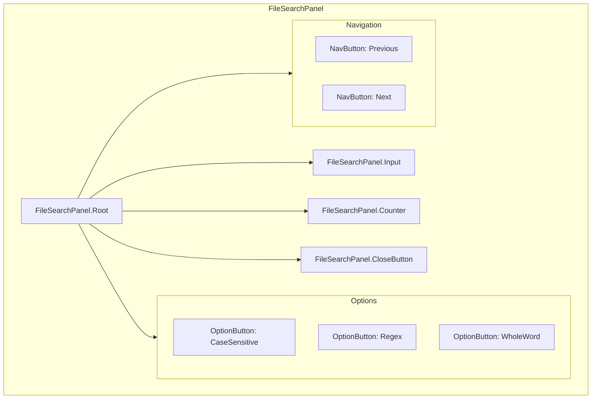
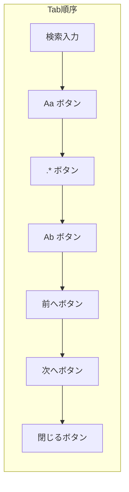
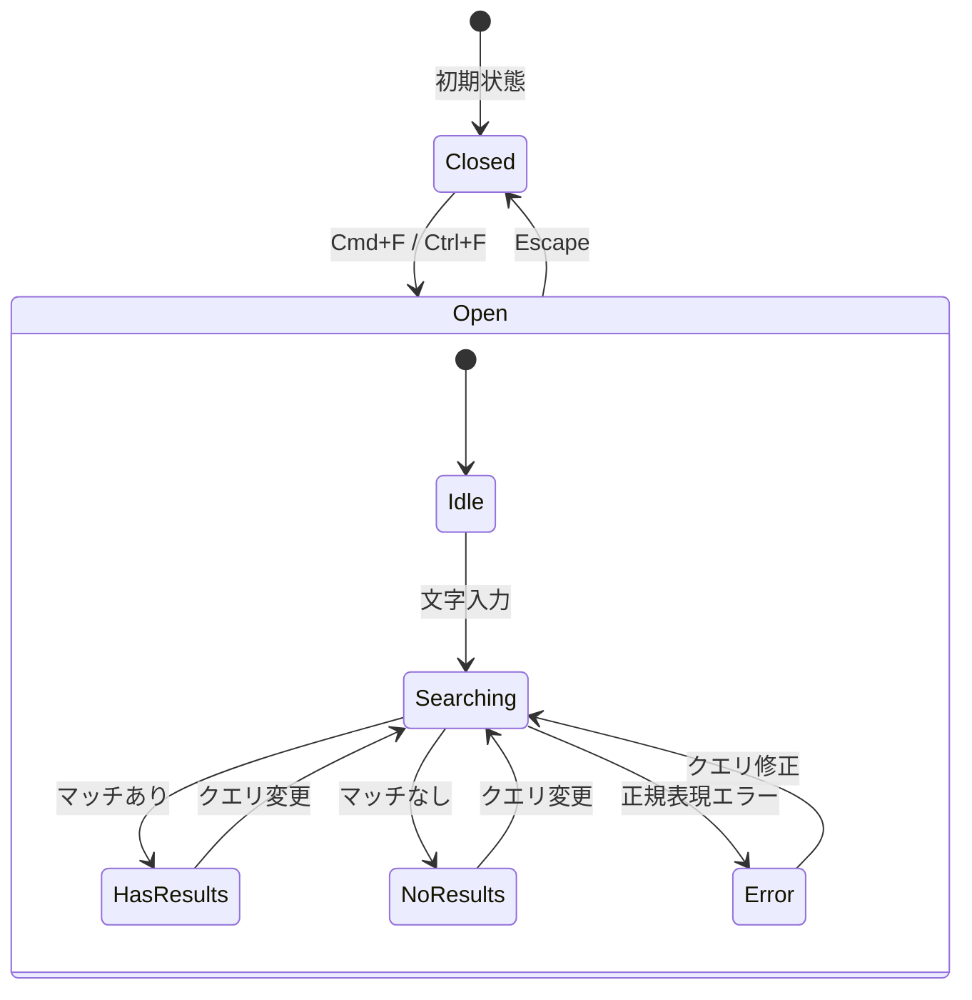

# T-01-1: ファイル内検索UI設計書 (FileSearchPanel)

## メタ情報

| 項目             | 内容                                        |
| ---------------- | ------------------------------------------- |
| サブタスクID     | T-01-1                                      |
| サブタスク名     | ファイル内検索UI設計                        |
| 親タスクID       | TASK-SEARCH-REPLACE-001                     |
| フェーズ         | Phase 1: 設計                               |
| ステータス       | 完了                                        |
| 担当エージェント | .claude/agents/ui-designer.md                                |
| 作成日           | 2025-12-12                                  |
| 参照要件定義書   | `task-step00-1-file-search-requirements.md` |

---

## 1. 設計概要

### 1.1 設計原則

本UI設計は以下の原則に従う：

| 原則                | 適用内容                                   |
| ------------------- | ------------------------------------------ |
| Apple HIG 準拠      | macOSネイティブライクな外観と操作感        |
| WCAG 2.1 AA 準拠    | アクセシビリティの確保                     |
| Compound Component  | 柔軟な構成と拡張性を持つコンポーネント設計 |
| Design Tokens First | 一貫性のあるスタイリング                   |
| Keyboard First      | すべての操作がキーボードで完結可能         |

### 1.2 設計スコープ

- FileSearchPanel コンポーネントの UI 設計
- 置換機能（FileReplacePanel）への拡張を考慮した設計
- アニメーション・トランジション仕様
- フォーカス管理とキーボードナビゲーション

---

## 2. コンポーネントアーキテクチャ

### 2.1 Compound Component 構造



### 2.2 コンポーネント階層

```
FileSearchPanel/
├── index.ts                    # エクスポート
├── FileSearchPanel.tsx         # Root コンポーネント
├── FileSearchPanelContext.tsx  # Context Provider
├── components/
│   ├── SearchInput.tsx         # 検索入力フィールド
│   ├── OptionButton.tsx        # オプショントグルボタン
│   ├── SearchCounter.tsx       # 結果カウンター
│   ├── NavigationButton.tsx    # 前へ/次へボタン
│   └── CloseButton.tsx         # 閉じるボタン
├── hooks/
│   ├── useFileSearch.ts        # 検索ロジックフック
│   ├── useSearchShortcuts.ts   # ショートカットフック
│   └── useSearchHistory.ts     # 履歴管理フック
└── types.ts                    # 型定義
```

### 2.3 Props インターフェース

```typescript
// FileSearchPanel の Props
interface FileSearchPanelProps {
  /** パネルの表示状態 */
  isOpen: boolean;
  /** パネルを閉じるコールバック */
  onClose: () => void;
  /** 検索オプション変更時のコールバック */
  onSearchOptionsChange?: (options: FileSearchOptions) => void;
  /** 検索結果変更時のコールバック */
  onSearchResultChange?: (result: FileSearchResult | null) => void;
  /** 現在のマッチ位置変更時のコールバック */
  onCurrentMatchChange?: (index: number) => void;
  /** 初期検索文字列（選択テキスト等） */
  initialQuery?: string;
  /** カスタムクラス名 */
  className?: string;
  /** 子要素（Compound Component用） */
  children?: React.ReactNode;
}

// 検索入力フィールドの Props
interface SearchInputProps {
  /** プレースホルダーテキスト */
  placeholder?: string;
  /** 入力変更時のデバウンス時間（ms） */
  debounceMs?: number;
  /** 自動フォーカス */
  autoFocus?: boolean;
}

// オプションボタンの Props
interface OptionButtonProps {
  /** オプション種別 */
  option: "caseSensitive" | "regex" | "wholeWord";
  /** ツールチップテキスト */
  tooltip?: string;
  /** ショートカットキー表示 */
  shortcutHint?: string;
}
```

---

## 3. ビジュアルデザイン

### 3.1 ワイヤーフレーム

#### 通常状態

```
┌─────────────────────────────────────────────────────────────────────────────┐
│ ┌───┐ ┌──────────────────────────────────────┐ ┌──┐┌──┐┌──┐ │ 3/42 │ ◀ ▶ × │
│ │ 🔍│ │ 検索テキスト                         │ │Aa││.*││Ab│ │      │       │
│ └───┘ └──────────────────────────────────────┘ └──┘└──┘└──┘ └──────┘       │
└─────────────────────────────────────────────────────────────────────────────┘
  │      │                                        │    │    │    │       │ │ │
  │      │                                        │    │    │    │       │ │ └─ 閉じるボタン
  │      │                                        │    │    │    │       │ └─ 次へボタン
  │      │                                        │    │    │    │       └─ 前へボタン
  │      │                                        │    │    │    └─ カウンター
  │      │                                        │    │    └─ 単語単位トグル
  │      │                                        │    └─ 正規表現トグル
  │      │                                        └─ 大文字/小文字トグル
  │      └─ 検索入力フィールド
  └─ 検索アイコン
```

#### マッチなし状態

```
┌─────────────────────────────────────────────────────────────────────────────┐
│ ┌───┐ ┌──────────────────────────────────────┐ ┌──┐┌──┐┌──┐ │ 0件  │ ◀ ▶ × │
│ │ 🔍│ │ 存在しないテキスト                   │ │Aa││.*││Ab│ │      │       │
│ └───┘ └─────────────── ❌ ────────────────────┘ └──┘└──┘└──┘ └──────┘       │
└─────────────────────────────────────────────────────────────────────────────┘
            └─ 赤色ボーダーでエラー状態を表示
```

#### 正規表現エラー状態

```
┌─────────────────────────────────────────────────────────────────────────────┐
│ ┌───┐ ┌──────────────────────────────────────┐ ┌──┐┌──┐┌──┐               × │
│ │ 🔍│ │ [invalid(regex                       │ │Aa││.*││Ab│                 │
│ └───┘ └─────────────── ❌ ────────────────────┘ └──┘└──┘└──┘                 │
│       └─ 無効な正規表現です ─────────────────────────────────────────────────│
└─────────────────────────────────────────────────────────────────────────────┘
```

### 3.2 寸法仕様

| 要素                   | 寸法                         | Design Token           |
| ---------------------- | ---------------------------- | ---------------------- |
| パネル高さ             | 48px                         | `h-12`                 |
| パネル左右パディング   | 16px                         | `px-4`                 |
| 検索アイコンサイズ     | 20px                         | `w-5 h-5`              |
| 入力フィールド高さ     | 32px                         | `h-8`                  |
| 入力フィールド幅       | 240px - 400px (レスポンシブ) | `w-60 lg:w-80 xl:w-96` |
| オプションボタンサイズ | 28px × 28px                  | `w-7 h-7`              |
| ナビボタンサイズ       | 28px × 28px                  | `w-7 h-7`              |
| 要素間ギャップ         | 8px                          | `gap-2`                |
| カウンター幅           | 64px (固定)                  | `w-16`                 |

### 3.3 カラートークン

| 要素                     | ライトモード             | ダークモード             |
| ------------------------ | ------------------------ | ------------------------ |
| パネル背景               | `bg-white`               | `bg-slate-800`           |
| パネルボーダー           | `border-slate-200`       | `border-slate-700`       |
| パネルシャドウ           | `shadow-md`              | `shadow-lg`              |
| 入力フィールド背景       | `bg-slate-50`            | `bg-slate-900`           |
| 入力フィールドボーダー   | `border-slate-300`       | `border-slate-600`       |
| 入力フィールドフォーカス | `ring-2 ring-blue-500`   | `ring-2 ring-blue-400`   |
| エラー状態ボーダー       | `border-red-500`         | `border-red-400`         |
| オプションボタン非活性   | `bg-slate-100`           | `bg-slate-700`           |
| オプションボタン活性     | `bg-blue-500 text-white` | `bg-blue-600 text-white` |
| カウンターテキスト       | `text-slate-600`         | `text-slate-400`         |
| ナビボタンアイコン       | `text-slate-500`         | `text-slate-400`         |
| ナビボタンホバー         | `bg-slate-100`           | `bg-slate-700`           |

### 3.4 タイポグラフィ

| 要素             | フォント設定                               |
| ---------------- | ------------------------------------------ |
| 入力フィールド   | `text-sm font-normal`（14px）              |
| カウンター       | `text-xs font-medium tabular-nums`（12px） |
| エラーメッセージ | `text-xs text-red-500`（12px）             |
| ツールチップ     | `text-xs`（12px）                          |

---

## 4. アニメーション・トランジション

### 4.1 パネル表示/非表示

```typescript
const panelAnimation = {
  initial: { opacity: 0, y: -8, height: 0 },
  animate: { opacity: 1, y: 0, height: "auto" },
  exit: { opacity: 0, y: -8, height: 0 },
  transition: { duration: 0.2, ease: "easeOut" },
};
```

| アニメーション | 継続時間 | イージング | 説明                          |
| -------------- | -------- | ---------- | ----------------------------- |
| 表示           | 200ms    | ease-out   | 上からスライドイン + フェード |
| 非表示         | 200ms    | ease-out   | 上へスライドアウト + フェード |

### 4.2 状態変化アニメーション

| 要素                     | トランジション                   |
| ------------------------ | -------------------------------- |
| オプションボタントグル   | `transition-colors duration-150` |
| 入力フィールドフォーカス | `transition-all duration-150`    |
| エラー状態切り替え       | `transition-colors duration-200` |
| ナビボタンホバー         | `transition-colors duration-100` |

### 4.3 `prefers-reduced-motion` 対応

```css
@media (prefers-reduced-motion: reduce) {
  * {
    animation-duration: 0.01ms !important;
    transition-duration: 0.01ms !important;
  }
}
```

---

## 5. アクセシビリティ設計

### 5.1 ARIA 属性マッピング

| コンポーネント   | ARIA 属性                                                                         |
| ---------------- | --------------------------------------------------------------------------------- |
| パネル全体       | `role="search"`, `aria-label="ファイル内検索"`                                    |
| 検索入力         | `role="searchbox"`, `aria-label="検索文字列"`, `aria-describedby="search-status"` |
| オプション：Aa   | `role="switch"`, `aria-checked`, `aria-label="大文字/小文字を区別"`               |
| オプション：.\*  | `role="switch"`, `aria-checked`, `aria-label="正規表現を使用"`                    |
| オプション：Ab   | `role="switch"`, `aria-checked`, `aria-label="単語単位で検索"`                    |
| カウンター       | `role="status"`, `aria-live="polite"`, `id="search-status"`                       |
| 前へボタン       | `aria-label="前の検索結果"`, `aria-disabled`（結果なし時）                        |
| 次へボタン       | `aria-label="次の検索結果"`, `aria-disabled`（結果なし時）                        |
| 閉じるボタン     | `aria-label="検索パネルを閉じる"`                                                 |
| エラーメッセージ | `role="alert"`, `aria-live="assertive"`                                           |

### 5.2 フォーカス管理



#### フォーカス移動ルール

| イベント                | フォーカス移動先                     |
| ----------------------- | ------------------------------------ |
| パネルを開く            | 検索入力フィールド                   |
| パネルを閉じる          | 前回フォーカスしていたエディター位置 |
| Escape キー押下         | パネルを閉じる → エディターへ        |
| Tab（閉じるボタンで）   | 検索入力フィールドへループ           |
| Shift+Tab（検索入力で） | 閉じるボタンへループ                 |

### 5.3 スクリーンリーダー通知

| 状態変化         | 読み上げ内容                         |
| ---------------- | ------------------------------------ |
| 検索結果更新     | 「{N}件中{M}件目」                   |
| マッチなし       | 「一致する結果がありません」         |
| 正規表現エラー   | 「エラー: 無効な正規表現です」       |
| オプション有効化 | 「{オプション名}がオンになりました」 |
| オプション無効化 | 「{オプション名}がオフになりました」 |

---

## 6. キーボードショートカット設計

### 6.1 ショートカットマップ

| ショートカット       | macOS                      | Windows/Linux              | 動作                   |
| -------------------- | -------------------------- | -------------------------- | ---------------------- |
| パネルを開く         | `Cmd+F`                    | `Ctrl+F`                   | 検索パネル表示         |
| パネルを閉じる       | `Escape`                   | `Escape`                   | 検索パネル非表示       |
| 次の結果             | `F3` / `Enter`             | `F3` / `Enter`             | 次のマッチへ移動       |
| 前の結果             | `Shift+F3` / `Shift+Enter` | `Shift+F3` / `Shift+Enter` | 前のマッチへ移動       |
| 大文字/小文字トグル  | `Alt+C`                    | `Alt+C`                    | オプション切り替え     |
| 正規表現トグル       | `Alt+R`                    | `Alt+R`                    | オプション切り替え     |
| 単語単位トグル       | `Alt+W`                    | `Alt+W`                    | オプション切り替え     |
| 履歴表示             | `↑` / `↓`                  | `↑` / `↓`                  | 検索履歴ナビゲーション |
| 全選択（検索入力内） | `Cmd+A`                    | `Ctrl+A`                   | 入力テキスト全選択     |

### 6.2 ショートカット実装方針

```typescript
// useSearchShortcuts.ts
const shortcuts: ShortcutDefinition[] = [
  {
    key: "f",
    modifiers: ["meta"], // macOS: Cmd, Windows: Ctrl
    action: "openPanel",
    when: "editorFocused",
  },
  {
    key: "Escape",
    action: "closePanel",
    when: "searchPanelOpen",
  },
  {
    key: "F3",
    action: "nextMatch",
    when: "searchPanelOpen",
  },
  {
    key: "F3",
    modifiers: ["shift"],
    action: "prevMatch",
    when: "searchPanelOpen",
  },
  // ... 他のショートカット
];
```

---

## 7. 状態管理設計

### 7.1 状態モデル

```typescript
interface FileSearchPanelState {
  /** パネル表示状態 */
  isOpen: boolean;
  /** 検索クエリ */
  query: string;
  /** 検索オプション */
  options: {
    caseSensitive: boolean;
    useRegex: boolean;
    wholeWord: boolean;
  };
  /** 検索結果 */
  result: {
    matches: SearchMatch[];
    totalCount: number;
    currentIndex: number;
  } | null;
  /** 検索状態 */
  status: "idle" | "searching" | "error";
  /** エラー情報 */
  error: string | null;
  /** 検索履歴 */
  history: string[];
}
```

### 7.2 状態遷移図



### 7.3 Context API 設計

```typescript
interface FileSearchPanelContextValue {
  // 状態
  state: FileSearchPanelState;

  // アクション
  setQuery: (query: string) => void;
  toggleOption: (option: keyof FileSearchOptions) => void;
  nextMatch: () => void;
  prevMatch: () => void;
  close: () => void;

  // 派生状態
  hasResults: boolean;
  isFirstMatch: boolean;
  isLastMatch: boolean;
}

const FileSearchPanelContext =
  createContext<FileSearchPanelContextValue | null>(null);
```

---

## 8. レスポンシブ設計

### 8.1 ブレイクポイント対応

| ブレイクポイント | 変更内容                                      |
| ---------------- | --------------------------------------------- |
| < 640px (sm)     | 入力フィールド幅: 160px、オプションボタン縮小 |
| 640-1024px (md)  | 入力フィールド幅: 240px                       |
| > 1024px (lg)    | 入力フィールド幅: 320px                       |
| > 1280px (xl)    | 入力フィールド幅: 400px                       |

### 8.2 最小ウィンドウサイズ対応

- 最小対応幅: 480px
- 480px未満ではオプションボタンをドロップダウンメニューに集約

---

## 9. エラー状態のUI設計

### 9.1 エラー種別と表示

| エラー種別     | 視覚表示                                      | 補足情報                       |
| -------------- | --------------------------------------------- | ------------------------------ |
| マッチなし     | 入力フィールド: 赤ボーダー、カウンター: "0件" | なし                           |
| 正規表現エラー | 入力フィールド: 赤ボーダー + エラーメッセージ | 「無効な正規表現です」         |
| タイムアウト   | 入力フィールド: 黄ボーダー + 警告メッセージ   | 「検索がタイムアウトしました」 |

### 9.2 エラーメッセージ表示位置

```
┌─────────────────────────────────────────────────────────────────────────────┐
│ ┌───┐ ┌──────────────────────────────────────┐ ┌──┐┌──┐┌──┐               × │
│ │ 🔍│ │ [invalid(regex                       │ │Aa││.*││Ab│                 │
│ └───┘ └─────────────────────────────────────┘ └──┘└──┘└──┘                 │
├─────────────────────────────────────────────────────────────────────────────┤
│ ⚠️ 無効な正規表現です                                                       │
└─────────────────────────────────────────────────────────────────────────────┘
```

- エラーメッセージはパネル下部に追加行として表示
- アイコン（⚠️）+ テキストで情報伝達
- エラー解消時は自動的に非表示

---

## 10. コンポーネント実装ガイドライン

### 10.1 ファイル構成

```
apps/desktop/src/renderer/components/organisms/FileSearchPanel/
├── index.ts
├── FileSearchPanel.tsx
├── FileSearchPanelContext.tsx
├── components/
│   ├── SearchInput.tsx
│   ├── SearchInput.test.tsx
│   ├── OptionButton.tsx
│   ├── OptionButton.test.tsx
│   ├── SearchCounter.tsx
│   ├── SearchCounter.test.tsx
│   ├── NavigationButton.tsx
│   ├── NavigationButton.test.tsx
│   └── CloseButton.tsx
├── hooks/
│   ├── useFileSearch.ts
│   ├── useFileSearch.test.ts
│   ├── useSearchShortcuts.ts
│   └── useSearchHistory.ts
├── types.ts
└── FileSearchPanel.test.tsx
```

### 10.2 使用例

```tsx
// 基本的な使用方法
<FileSearchPanel
  isOpen={isSearchOpen}
  onClose={() => setIsSearchOpen(false)}
  onSearchResultChange={handleSearchResult}
  initialQuery={selectedText}
/>

// Compound Component パターン（カスタマイズ時）
<FileSearchPanel.Root isOpen={isOpen} onClose={onClose}>
  <FileSearchPanel.Input placeholder="検索..." />
  <FileSearchPanel.Options>
    <FileSearchPanel.OptionButton option="caseSensitive" />
    <FileSearchPanel.OptionButton option="regex" />
    <FileSearchPanel.OptionButton option="wholeWord" />
  </FileSearchPanel.Options>
  <FileSearchPanel.Counter />
  <FileSearchPanel.Navigation />
  <FileSearchPanel.CloseButton />
</FileSearchPanel.Root>
```

---

## 11. 置換機能への拡張設計

### 11.1 FileReplacePanel との統合

FileSearchPanel は FileReplacePanel の基盤として設計されている。置換パネル展開時の構造：

```
┌─────────────────────────────────────────────────────────────────────────────┐
│ [▼] [🔍] [検索フィールド                 ] [Aa][.*][Ab] │ 3/42 │ ◀ ▶ × │
│     [➡️] [置換フィールド                 ] [Pp]         │      │ [置換][全]│
└─────────────────────────────────────────────────────────────────────────────┘
```

### 11.2 共有コンポーネント

以下のコンポーネントは FileReplacePanel と共有：

- `SearchInput` - 検索/置換入力フィールド
- `OptionButton` - オプショントグルボタン
- `NavigationButton` - ナビゲーションボタン

---

## 12. 完了条件チェックリスト

- [x] 検索パネルのワイヤーフレームが作成されている
- [x] キーボードショートカットマップが定義されている
- [x] ARIA ラベルとフォーカス管理が設計されている
- [x] デザイントークンの使用箇所が明記されている
- [x] Compound Component 構造が設計されている
- [x] 状態管理設計が完了している
- [x] レスポンシブ対応が考慮されている
- [x] エラー状態のUI設計が完了している

---

## 13. 参照ドキュメント

- `docs/30-workflows/search-replace/task-step00-1-file-search-requirements.md` - 要件定義
- `docs/00-requirements/16-ui-ux-guidelines.md` - UI/UXガイドライン
- [Apple Human Interface Guidelines - Search](https://developer.apple.com/design/human-interface-guidelines/search)
- [WCAG 2.1 - Search Forms](https://www.w3.org/WAI/tutorials/forms/search/)

---

## 14. 変更履歴

| 日付       | 版  | 変更内容 | 担当         |
| ---------- | --- | -------- | ------------ |
| 2025-12-12 | 1.0 | 初版作成 | .claude/agents/ui-designer.md |
