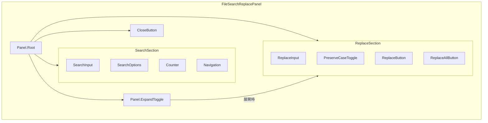
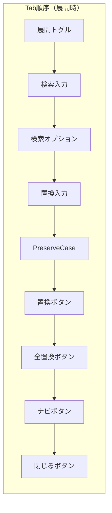
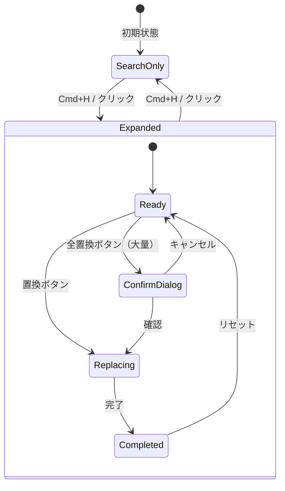

# T-01-2: ファイル内置換UI設計書 (FileReplacePanel)

## メタ情報

| 項目             | 内容                                         |
| ---------------- | -------------------------------------------- |
| サブタスクID     | T-01-2                                       |
| サブタスク名     | ファイル内置換UI設計                         |
| 親タスクID       | TASK-SEARCH-REPLACE-001                      |
| フェーズ         | Phase 1: 設計                                |
| ステータス       | 完了                                         |
| 担当エージェント | .claude/agents/ui-designer.md                                 |
| 作成日           | 2025-12-12                                   |
| 参照要件定義書   | `task-step00-2-file-replace-requirements.md` |
| 関連設計書       | `task-step01-1-file-search-ui-design.md`     |

---

## 1. 設計概要

### 1.1 設計原則

FileReplacePanel は FileSearchPanel の**拡張**として設計する。VS Code と同様に、検索パネルを展開することで置換フィールドが表示される形式を採用。

| 原則             | 適用内容                                           |
| ---------------- | -------------------------------------------------- |
| 拡張性           | FileSearchPanel との統合、共通コンポーネント再利用 |
| 安全性重視       | 大量置換時の確認ダイアログ必須                     |
| WCAG 2.1 AA 準拠 | 置換操作のアクセシビリティ確保                     |
| Undo 連携        | すべての置換操作は Undo 可能                       |

### 1.2 設計スコープ

- FileSearchPanel を拡張した FileReplacePanel コンポーネント
- 置換入力フィールド、置換ボタン、全置換ボタン
- 置換プレビュー機能
- 確認ダイアログ（大量置換時）
- キーボードショートカット

---

## 2. コンポーネントアーキテクチャ

### 2.1 FileSearchPanel との統合構造



### 2.2 コンポーネント階層

```
FileSearchReplacePanel/
├── index.ts                      # エクスポート
├── FileSearchReplacePanel.tsx    # 統合 Root コンポーネント
├── FileSearchReplacePanelContext.tsx  # Context Provider
├── components/
│   ├── ExpandToggle.tsx          # 展開/折りたたみトグル
│   ├── ReplaceInput.tsx          # 置換入力フィールド
│   ├── PreserveCaseToggle.tsx    # 大文字/小文字保持トグル
│   ├── ReplaceButton.tsx         # 単一置換ボタン
│   ├── ReplaceAllButton.tsx      # 全置換ボタン
│   ├── ReplacePreview.tsx        # 置換プレビュー表示
│   └── ConfirmDialog.tsx         # 確認ダイアログ
├── hooks/
│   ├── useFileReplace.ts         # 置換ロジックフック
│   └── useReplaceShortcuts.ts    # 置換ショートカットフック
└── types.ts                      # 型定義
```

### 2.3 Props インターフェース

```typescript
// FileSearchReplacePanel の Props
interface FileSearchReplacePanelProps {
  /** パネルの表示状態 */
  isOpen: boolean;
  /** 置換セクションの展開状態 */
  isExpanded: boolean;
  /** パネルを閉じるコールバック */
  onClose: () => void;
  /** 展開状態変更コールバック */
  onExpandChange?: (expanded: boolean) => void;
  /** 置換実行時のコールバック */
  onReplace?: (result: ReplaceResult) => void;
  /** 全置換実行時のコールバック */
  onReplaceAll?: (result: ReplaceResult) => void;
  /** 初期検索文字列 */
  initialQuery?: string;
  /** 初期置換文字列 */
  initialReplaceString?: string;
}

// 置換入力フィールドの Props
interface ReplaceInputProps {
  /** プレースホルダーテキスト */
  placeholder?: string;
  /** 変更時のコールバック */
  onChange?: (value: string) => void;
}

// 置換ボタンの Props
interface ReplaceButtonProps {
  /** ボタン種別 */
  variant: "single" | "all";
  /** 無効状態 */
  disabled?: boolean;
  /** クリック時のコールバック */
  onClick?: () => void;
}

// 確認ダイアログの Props
interface ConfirmDialogProps {
  /** 表示状態 */
  isOpen: boolean;
  /** 置換件数 */
  count: number;
  /** 確認時のコールバック */
  onConfirm: () => void;
  /** キャンセル時のコールバック */
  onCancel: () => void;
}
```

---

## 3. ビジュアルデザイン

### 3.1 ワイヤーフレーム

#### 折りたたみ状態（検索のみ）

```
┌──────────────────────────────────────────────────────────────────────────────┐
│ [▶] [🔍] [検索フィールド                   ] [Aa] [.*] [Ab] │ 3/42 │ ◀ ▶ × │
└──────────────────────────────────────────────────────────────────────────────┘
  │
  └─ クリックで置換セクションを展開
```

#### 展開状態（検索 + 置換）

```
┌──────────────────────────────────────────────────────────────────────────────┐
│ [▼] [🔍] [検索フィールド                   ] [Aa] [.*] [Ab] │ 3/42 │ ◀ ▶ × │
│     [➡️] [置換フィールド                   ] [Pp]     [置換] [すべて置換]    │
└──────────────────────────────────────────────────────────────────────────────┘
```

#### 置換プレビュー表示時

```
┌──────────────────────────────────────────────────────────────────────────────┐
│ [▼] [🔍] [検索フィールド                   ] [Aa] [.*] [Ab] │ 3/42 │ ◀ ▶ × │
│     [➡️] [置換フィールド                   ] [Pp]     [置換] [すべて置換]    │
├──────────────────────────────────────────────────────────────────────────────┤
│ プレビュー: "Button" → "Component"                                           │
│   L12: const ̶B̶u̶t̶t̶o̶n̶ Component = ({ ...                                    │
└──────────────────────────────────────────────────────────────────────────────┘
```

### 3.2 寸法仕様

| 要素                     | 寸法                   | Design Token           |
| ------------------------ | ---------------------- | ---------------------- |
| パネル高さ（折りたたみ） | 48px                   | `h-12`                 |
| パネル高さ（展開）       | 88px                   | `h-22`                 |
| パネル高さ（プレビュー） | 132px                  | `h-33`                 |
| 展開トグル幅             | 24px                   | `w-6`                  |
| 置換アイコンサイズ       | 16px                   | `w-4 h-4`              |
| 置換入力フィールド幅     | 検索フィールドと同幅   | `w-60 lg:w-80 xl:w-96` |
| 置換ボタン幅             | auto（テキストに依存） | `px-3`                 |
| 全置換ボタン幅           | auto                   | `px-3`                 |
| 行間（置換セクション）   | 8px                    | `gap-2`                |

### 3.3 カラートークン

| 要素                | ライトモード               | ダークモード                 |
| ------------------- | -------------------------- | ---------------------------- |
| 展開トグルアイコン  | `text-slate-500`           | `text-slate-400`             |
| 展開トグルホバー    | `bg-slate-100`             | `bg-slate-700`               |
| 置換アイコン（➡️）  | `text-blue-500`            | `text-blue-400`              |
| 置換入力背景        | `bg-slate-50`              | `bg-slate-900`               |
| PreserveCase 非活性 | `bg-slate-100`             | `bg-slate-700`               |
| PreserveCase 活性   | `bg-blue-500 text-white`   | `bg-blue-600 text-white`     |
| 置換ボタン          | `bg-blue-500 text-white`   | `bg-blue-600 text-white`     |
| 置換ボタンホバー    | `bg-blue-600`              | `bg-blue-700`                |
| 全置換ボタン        | `bg-orange-500 text-white` | `bg-orange-600 text-white`   |
| 全置換ボタンホバー  | `bg-orange-600`            | `bg-orange-700`              |
| プレビュー背景      | `bg-slate-50`              | `bg-slate-800`               |
| プレビュー削除部分  | `bg-red-100 line-through`  | `bg-red-900/50 line-through` |
| プレビュー追加部分  | `bg-green-100 underline`   | `bg-green-900/50 underline`  |

### 3.4 アイコン仕様

| アイコン         | Lucide アイコン名 | 用途                       |
| ---------------- | ----------------- | -------------------------- |
| 展開トグル（閉） | `chevron-right`   | 置換セクション折りたたみ時 |
| 展開トグル（開） | `chevron-down`    | 置換セクション展開時       |
| 置換アイコン     | `arrow-right`     | 置換入力フィールド左       |
| PreserveCase     | `type` (Pp)       | 大文字/小文字保持          |
| 置換ボタン       | （テキストのみ）  | 「置換」                   |
| 全置換ボタン     | （テキストのみ）  | 「すべて置換」             |

---

## 4. アニメーション・トランジション

### 4.1 展開/折りたたみアニメーション

```typescript
const expandAnimation = {
  initial: { height: 0, opacity: 0 },
  animate: { height: "auto", opacity: 1 },
  exit: { height: 0, opacity: 0 },
  transition: { duration: 0.15, ease: "easeOut" },
};
```

| アニメーション | 継続時間 | イージング | 説明                         |
| -------------- | -------- | ---------- | ---------------------------- |
| 展開           | 150ms    | ease-out   | 置換セクションスライドダウン |
| 折りたたみ     | 150ms    | ease-out   | 置換セクションスライドアップ |

### 4.2 プレビュー表示アニメーション

```typescript
const previewAnimation = {
  initial: { opacity: 0, y: -4 },
  animate: { opacity: 1, y: 0 },
  transition: { duration: 0.2, ease: "easeOut" },
};
```

### 4.3 ボタン状態変化

| 要素             | トランジション                    |
| ---------------- | --------------------------------- |
| 置換ボタンホバー | `transition-colors duration-100`  |
| ボタン無効化     | `transition-opacity duration-150` |

---

## 5. アクセシビリティ設計

### 5.1 ARIA 属性マッピング

| コンポーネント | ARIA 属性                                                                     |
| -------------- | ----------------------------------------------------------------------------- |
| 展開トグル     | `aria-expanded`, `aria-controls="replace-section"`, `aria-label="置換を展開"` |
| 置換セクション | `id="replace-section"`, `role="region"`, `aria-label="置換オプション"`        |
| 置換入力       | `aria-label="置換文字列"`, `aria-describedby="replace-status"`                |
| PreserveCase   | `role="switch"`, `aria-checked`, `aria-label="大文字/小文字を保持"`           |
| 置換ボタン     | `aria-label="現在のマッチを置換"`                                             |
| 全置換ボタン   | `aria-label="すべてのマッチを置換 ({count}件)"`                               |
| 置換結果通知   | `aria-live="polite"`, `role="status"`, `id="replace-status"`                  |
| 確認ダイアログ | `role="alertdialog"`, `aria-modal="true"`, `aria-labelledby="dialog-title"`   |

### 5.2 フォーカス管理



#### フォーカス移動ルール（置換固有）

| イベント             | フォーカス移動先               |
| -------------------- | ------------------------------ |
| Cmd+H / Ctrl+H       | 置換セクション展開 → 置換入力  |
| 置換セクション展開   | 置換入力フィールド             |
| 単一置換実行後       | 次のマッチ位置（エディター内） |
| 全置換実行後         | 結果通知（フォーカス維持）     |
| 確認ダイアログ表示   | 「キャンセル」ボタン           |
| 確認ダイアログ閉じる | 全置換ボタン                   |

### 5.3 スクリーンリーダー通知

| 状態変化           | 読み上げ内容                      |
| ------------------ | --------------------------------- |
| 単一置換実行       | 「1件を置換しました。残り{N}件」  |
| 全置換実行         | 「{N}件を置換しました」           |
| 置換対象なし       | 「置換対象がありません」          |
| 置換セクション展開 | 「置換オプションを展開しました」  |
| 置換セクション閉じ | 「置換オプションを閉じました」    |
| 確認ダイアログ表示 | 「{N}件のマッチを置換しますか？」 |

---

## 6. キーボードショートカット設計

### 6.1 ショートカットマップ

| ショートカット      | macOS                     | Windows/Linux      | 動作                       |
| ------------------- | ------------------------- | ------------------ | -------------------------- |
| 置換パネルを開く    | `Cmd+H`                   | `Ctrl+H`           | 置換セクション展開         |
| 単一置換            | `Cmd+Shift+1`             | `Ctrl+Shift+1`     | 現在のマッチを置換         |
| 全置換              | `Cmd+Shift+Enter`         | `Ctrl+Shift+Enter` | すべてのマッチを置換       |
| 置換して次へ        | `Enter`（置換入力内）     | `Enter`            | 置換 + 次のマッチへ移動    |
| PreserveCase トグル | `Alt+P`                   | `Alt+P`            | 大文字/小文字保持切替      |
| 検索入力へ移動      | `Shift+Tab`（置換入力内） | `Shift+Tab`        | 検索フィールドへフォーカス |

### 6.2 ショートカット実装方針

```typescript
// useReplaceShortcuts.ts
const replaceShortcuts: ShortcutDefinition[] = [
  {
    key: "h",
    modifiers: ["meta"],
    action: "expandReplaceSection",
    when: "editorFocused || searchPanelFocused",
  },
  {
    key: "1",
    modifiers: ["meta", "shift"],
    action: "replaceSingle",
    when: "replaceSectionExpanded && hasMatch",
  },
  {
    key: "Enter",
    modifiers: ["meta", "shift"],
    action: "replaceAll",
    when: "replaceSectionExpanded && hasMatches",
  },
  {
    key: "p",
    modifiers: ["alt"],
    action: "togglePreserveCase",
    when: "replaceSectionExpanded",
  },
];
```

---

## 7. 状態管理設計

### 7.1 状態モデル

```typescript
interface FileReplacePanelState extends FileSearchPanelState {
  /** 置換セクション展開状態 */
  isExpanded: boolean;
  /** 置換文字列 */
  replaceString: string;
  /** 置換オプション */
  replaceOptions: {
    preserveCase: boolean;
  };
  /** 確認ダイアログ表示状態 */
  isConfirmDialogOpen: boolean;
  /** 置換結果 */
  lastReplaceResult: ReplaceResult | null;
}
```

### 7.2 状態遷移図



### 7.3 Context 拡張

```typescript
interface FileReplacePanelContextValue extends FileSearchPanelContextValue {
  // 置換状態
  isExpanded: boolean;
  replaceString: string;
  preserveCase: boolean;

  // 置換アクション
  setReplaceString: (value: string) => void;
  togglePreserveCase: () => void;
  replaceSingle: () => Promise<ReplaceResult>;
  replaceAll: () => Promise<ReplaceResult>;
  toggleExpanded: () => void;

  // 派生状態
  canReplace: boolean;
  replacePreview: ReplacePreview | null;
}
```

---

## 8. 確認ダイアログ設計

### 8.1 ダイアログレイアウト

```
┌─────────────────────────────────────────────────────┐
│                                                     │
│  ⚠️  すべて置換                                     │
│                                                     │
├─────────────────────────────────────────────────────┤
│                                                     │
│  123件のマッチを置換しますか？                      │
│                                                     │
│  検索: "Button"                                     │
│  置換: "Component"                                  │
│                                                     │
│  ℹ️ この操作は Cmd+Z で取り消すことができます。     │
│                                                     │
├─────────────────────────────────────────────────────┤
│                        [キャンセル]  [置換する]     │
└─────────────────────────────────────────────────────┘
```

### 8.2 ダイアログ仕様

| 要素             | 仕様                              |
| ---------------- | --------------------------------- |
| 背景オーバーレイ | `bg-black/50`, クリックで閉じない |
| ダイアログ幅     | 400px                             |
| 角丸             | `rounded-lg`                      |
| シャドウ         | `shadow-xl`                       |
| ヘッダーアイコン | `alert-triangle` (amber-500)      |
| キャンセルボタン | `bg-slate-200` (secondary)        |
| 置換するボタン   | `bg-orange-500` (warning/action)  |

### 8.3 ダイアログ表示条件

| 条件            | 確認ダイアログ |
| --------------- | -------------- |
| 置換件数 < 100  | 表示しない     |
| 置換件数 >= 100 | 必ず表示       |

---

## 9. 置換プレビュー設計

### 9.1 プレビュー表示形式

```typescript
interface ReplacePreviewDisplay {
  /** 現在のマッチ行のテキスト */
  lineText: string;
  /** 行番号 */
  lineNumber: number;
  /** 置換前のマッチ部分 */
  before: string;
  /** 置換後のテキスト */
  after: string;
  /** マッチ位置（開始列） */
  startColumn: number;
  /** マッチ位置（終了列） */
  endColumn: number;
}
```

### 9.2 プレビュー更新タイミング

| トリガー             | プレビュー更新          |
| -------------------- | ----------------------- |
| 置換文字列入力       | デバウンス 100ms で更新 |
| 検索結果変更         | 即時更新                |
| 現在のマッチ位置変更 | 即時更新                |
| PreserveCase 変更    | 即時更新                |

### 9.3 プレビュースタイル

```
L12: const ̶B̶u̶t̶t̶o̶n̶ Component = ({
       └───┬───┘ └───┬───┘
           │         │
           │         └─ 追加: 緑背景 + 下線
           └─ 削除: 赤背景 + 取り消し線
```

---

## 10. エラー状態のUI設計

### 10.1 エラー種別と表示

| エラー種別           | 視覚表示                        | 補足情報                       |
| -------------------- | ------------------------------- | ------------------------------ |
| 置換対象なし         | 置換ボタン無効化 + ツールチップ | 「置換対象がありません」       |
| 置換タイムアウト     | トースト通知 (warning)          | 「置換がタイムアウトしました」 |
| Undo 失敗            | トースト通知 (error)            | 「変更を元に戻せませんでした」 |
| ファイル書き込み失敗 | トースト通知 (error)            | 「ファイルの書き込みに失敗」   |

### 10.2 ボタン無効化条件

| ボタン       | 無効化条件                     |
| ------------ | ------------------------------ |
| 置換ボタン   | マッチなし OR 置換文字列未変更 |
| 全置換ボタン | マッチなし                     |

---

## 11. コンポーネント実装ガイドライン

### 11.1 ファイル構成

```
apps/desktop/src/renderer/components/organisms/FileSearchReplacePanel/
├── index.ts
├── FileSearchReplacePanel.tsx
├── FileSearchReplacePanelContext.tsx
├── components/
│   ├── ExpandToggle.tsx
│   ├── ExpandToggle.test.tsx
│   ├── ReplaceInput.tsx
│   ├── ReplaceInput.test.tsx
│   ├── PreserveCaseToggle.tsx
│   ├── ReplaceButton.tsx
│   ├── ReplaceAllButton.tsx
│   ├── ReplacePreview.tsx
│   ├── ReplacePreview.test.tsx
│   ├── ConfirmDialog.tsx
│   └── ConfirmDialog.test.tsx
├── hooks/
│   ├── useFileReplace.ts
│   ├── useFileReplace.test.ts
│   └── useReplaceShortcuts.ts
├── types.ts
└── FileSearchReplacePanel.test.tsx
```

### 11.2 使用例

```tsx
// 基本的な使用方法
<FileSearchReplacePanel
  isOpen={isSearchOpen}
  isExpanded={isReplaceExpanded}
  onClose={() => setIsSearchOpen(false)}
  onExpandChange={setIsReplaceExpanded}
  onReplace={handleReplace}
  onReplaceAll={handleReplaceAll}
/>

// Compound Component パターン
<FileSearchReplacePanel.Root isOpen={isOpen} isExpanded={isExpanded}>
  <FileSearchReplacePanel.ExpandToggle />
  <FileSearchReplacePanel.SearchSection>
    {/* 検索コンポーネント */}
  </FileSearchReplacePanel.SearchSection>
  <FileSearchReplacePanel.ReplaceSection>
    <FileSearchReplacePanel.ReplaceInput />
    <FileSearchReplacePanel.PreserveCaseToggle />
    <FileSearchReplacePanel.ReplaceButton />
    <FileSearchReplacePanel.ReplaceAllButton />
  </FileSearchReplacePanel.ReplaceSection>
</FileSearchReplacePanel.Root>
```

---

## 12. 完了条件チェックリスト

- [x] 検索パネルとの統合方法が設計されている
- [x] 置換ボタン、全置換ボタンの配置が決定されている
- [x] 置換プレビュー表示の設計が完了している
- [x] キーボードショートカット（Ctrl+H 等）が定義されている
- [x] 確認ダイアログの設計が完了している
- [x] ARIA ラベルとフォーカス管理が設計されている
- [x] 状態管理設計が完了している

---

## 13. 参照ドキュメント

- `docs/30-workflows/search-replace/task-step00-2-file-replace-requirements.md` - 置換要件定義
- `docs/30-workflows/search-replace/task-step01-1-file-search-ui-design.md` - 検索UI設計（基盤）
- `docs/00-requirements/16-ui-ux-guidelines.md` - UI/UXガイドライン

---

## 14. 変更履歴

| 日付       | 版  | 変更内容 | 担当         |
| ---------- | --- | -------- | ------------ |
| 2025-12-12 | 1.0 | 初版作成 | .claude/agents/ui-designer.md |
