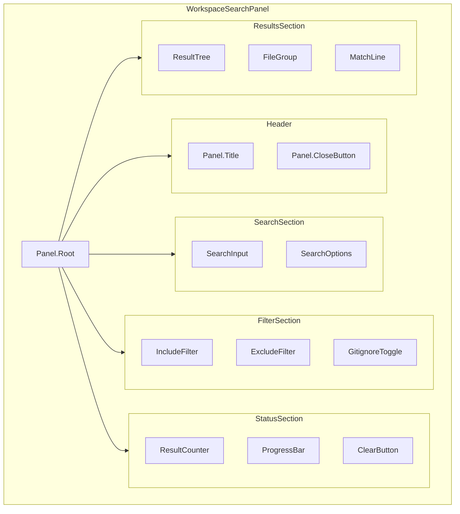
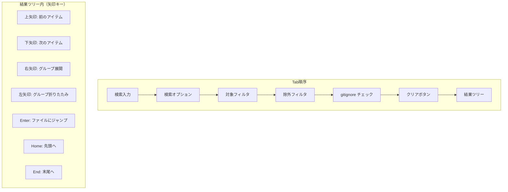

# T-01-3: ワークスペース検索UI設計書 (WorkspaceSearchPanel)

## メタ情報

| 項目             | 内容                                             |
| ---------------- | ------------------------------------------------ |
| サブタスクID     | T-01-3                                           |
| サブタスク名     | ワークスペース検索UI設計                         |
| 親タスクID       | TASK-SEARCH-REPLACE-001                          |
| フェーズ         | Phase 1: 設計                                    |
| ステータス       | 完了                                             |
| 担当エージェント | @ui-designer                                     |
| 作成日           | 2025-12-12                                       |
| 参照要件定義書   | `task-step00-3-workspace-search-requirements.md` |

---

## 1. 設計概要

### 1.1 設計原則

WorkspaceSearchPanel はサイドバー内に配置される複合的なUIコンポーネント。大量の検索結果を効率的に表示するため、仮想スクロールとグルーピング表示を採用。

| 原則               | 適用内容                           |
| ------------------ | ---------------------------------- |
| パフォーマンス重視 | 仮想スクロールで大量結果に対応     |
| 階層的情報表示     | ファイル別グルーピングで視認性向上 |
| Headless UI        | ロジックとプレゼンテーションの分離 |
| WCAG 2.1 AA 準拠   | Tree View のアクセシビリティ確保   |

### 1.2 設計スコープ

- サイドバー内 WorkspaceSearchPanel コンポーネント
- 検索入力・フィルタセクション
- 検索結果ツリービュー（仮想スクロール対応）
- ファイルへのジャンプ機能
- 検索進捗表示

---

## 2. コンポーネントアーキテクチャ

### 2.1 Compound Component 構造



### 2.2 コンポーネント階層

```
WorkspaceSearchPanel/
├── index.ts
├── WorkspaceSearchPanel.tsx
├── WorkspaceSearchPanelContext.tsx
├── components/
│   ├── Header/
│   │   ├── PanelHeader.tsx
│   │   └── CloseButton.tsx
│   ├── Search/
│   │   ├── SearchInput.tsx
│   │   ├── SearchOptions.tsx
│   │   └── SearchButton.tsx
│   ├── Filter/
│   │   ├── FilterSection.tsx
│   │   ├── IncludeFilter.tsx
│   │   ├── ExcludeFilter.tsx
│   │   └── GitignoreToggle.tsx
│   ├── Status/
│   │   ├── ResultCounter.tsx
│   │   ├── ProgressBar.tsx
│   │   └── ClearButton.tsx
│   └── Results/
│       ├── ResultTree.tsx
│       ├── FileGroup.tsx
│       ├── MatchLine.tsx
│       └── VirtualList.tsx
├── hooks/
│   ├── useWorkspaceSearch.ts
│   ├── useSearchResults.ts
│   ├── useVirtualScroll.ts
│   └── useResultNavigation.ts
└── types.ts
```

### 2.3 Props インターフェース

```typescript
// WorkspaceSearchPanel の Props
interface WorkspaceSearchPanelProps {
  /** パネルの表示状態 */
  isOpen: boolean;
  /** パネルを閉じるコールバック */
  onClose: () => void;
  /** ファイルにジャンプするコールバック */
  onJumpToFile: (filePath: string, line: number, column: number) => void;
  /** 検索状態変更のコールバック */
  onSearchStateChange?: (state: WorkspaceSearchState) => void;
}

// 検索結果ツリーの Props
interface ResultTreeProps {
  /** 検索結果 */
  results: WorkspaceSearchResult | null;
  /** 選択中のアイテム */
  selectedItem: SelectedItem | null;
  /** アイテム選択時のコールバック */
  onSelectItem: (item: SelectedItem) => void;
  /** ファイルグループ展開状態 */
  expandedGroups: Set<string>;
  /** 展開状態変更コールバック */
  onToggleGroup: (filePath: string) => void;
}

// ファイルグループの Props
interface FileGroupProps {
  /** ファイルパス */
  filePath: string;
  /** マッチ件数 */
  matchCount: number;
  /** 展開状態 */
  isExpanded: boolean;
  /** 選択状態 */
  isSelected: boolean;
  /** 子要素（マッチ行） */
  children?: React.ReactNode;
}

// マッチ行の Props
interface MatchLineProps {
  /** 行番号 */
  lineNumber: number;
  /** 行テキスト */
  lineText: string;
  /** マッチ位置（開始列、長さ） */
  matchPosition: { column: number; length: number };
  /** 選択状態 */
  isSelected: boolean;
  /** クリック時のコールバック */
  onClick: () => void;
}
```

---

## 3. ビジュアルデザイン

### 3.1 全体レイアウト

```
┌──────────────────────────────────────────────────────┐
│  🔍 ワークスペース検索                        [×]    │ ← ヘッダー
├──────────────────────────────────────────────────────┤
│  ┌────────────────────────────────────┐              │
│  │ Button                             │ [Aa][.*][Ab] │ ← 検索入力
│  └────────────────────────────────────┘              │
│  ─────────────────────────────────────────────────── │
│  対象: ┌───────────────────────────────────────────┐ │
│        │ *.ts, *.tsx                               │ │ ← フィルタ
│        └───────────────────────────────────────────┘ │
│  除外: ┌───────────────────────────────────────────┐ │
│        │ node_modules, dist                        │ │
│        └───────────────────────────────────────────┘ │
│  [☑] .gitignore を使用                               │
│  ─────────────────────────────────────────────────── │
│  ██████████████████░░░░ 75%  検索中...               │ ← 進捗
│  42件のファイル内 156件のマッチ          [クリア]    │ ← カウンター
├──────────────────────────────────────────────────────┤
│  ▼ src/components/Button.tsx (5)              ┌───┐  │
│     12: const Button = ({ label...            │   │  │
│     24: export const ButtonProps...           │   │  │
│     35: interface ButtonState...              │ S │  │ ← 結果リスト
│  ▼ src/hooks/useButton.ts (3)                 │ c │  │   (仮想スクロール)
│     8:  const { Button } = useComponent...    │ r │  │
│     15: return <Button onClick...             │ o │  │
│  ▶ src/types/button.ts (2)                    │ l │  │
│  ▶ tests/Button.test.tsx (8)                  │ l │  │
│  ...                                          │   │  │
│                                               └───┘  │
└──────────────────────────────────────────────────────┘
```

### 3.2 寸法仕様

| 要素                   | 寸法         | Design Token    |
| ---------------------- | ------------ | --------------- |
| パネル最小幅           | 250px        | `min-w-[250px]` |
| パネル推奨幅           | 320px        | `w-80`          |
| パネル最大幅           | 500px        | `max-w-[500px]` |
| ヘッダー高さ           | 40px         | `h-10`          |
| 検索入力高さ           | 32px         | `h-8`           |
| フィルタ入力高さ       | 28px         | `h-7`           |
| セクション間マージン   | 12px         | `my-3`          |
| ファイルグループ高さ   | 28px         | `h-7`           |
| マッチ行高さ           | 24px         | `h-6`           |
| 行番号幅               | 48px（固定） | `w-12`          |
| インデント（マッチ行） | 16px         | `pl-4`          |

### 3.3 カラートークン

| 要素                   | ライトモード       | ダークモード       |
| ---------------------- | ------------------ | ------------------ |
| パネル背景             | `bg-white`         | `bg-slate-900`     |
| ヘッダー背景           | `bg-slate-50`      | `bg-slate-800`     |
| 検索入力背景           | `bg-white`         | `bg-slate-800`     |
| フィルタ入力背景       | `bg-slate-50`      | `bg-slate-800`     |
| セパレーター           | `border-slate-200` | `border-slate-700` |
| ファイルグループ背景   | `bg-slate-50/50`   | `bg-slate-800/50`  |
| ファイルグループホバー | `bg-slate-100`     | `bg-slate-700`     |
| マッチ行ホバー         | `bg-blue-50`       | `bg-blue-900/30`   |
| マッチ行選択           | `bg-blue-100`      | `bg-blue-800/50`   |
| マッチハイライト       | `bg-yellow-200`    | `bg-yellow-500/40` |
| 行番号テキスト         | `text-slate-400`   | `text-slate-500`   |
| ファイルパステキスト   | `text-slate-700`   | `text-slate-300`   |
| マッチカウントバッジ   | `text-slate-500`   | `text-slate-400`   |
| プログレスバー         | `bg-blue-500`      | `bg-blue-400`      |

### 3.4 アイコン仕様

| アイコン   | Lucide アイコン名 | 用途                       |
| ---------- | ----------------- | -------------------------- |
| 検索       | `search`          | パネルタイトル             |
| 閉じる     | `x`               | パネルを閉じる             |
| 展開       | `chevron-down`    | ファイルグループ展開       |
| 折りたたみ | `chevron-right`   | ファイルグループ折りたたみ |
| ファイル   | `file-text`       | ファイルアイコン           |
| クリア     | `x-circle`        | 結果クリア                 |

---

## 4. 仮想スクロール設計

### 4.1 仮想化戦略

| 項目             | 仕様                                     |
| ---------------- | ---------------------------------------- |
| 仮想化ライブラリ | `@tanstack/react-virtual` または自前実装 |
| オーバースキャン | 5アイテム（上下各）                      |
| アイテム高さ     | 固定（ファイル: 28px、マッチ行: 24px）   |
| レンダリング閾値 | 50アイテム以上で仮想化有効               |

### 4.2 フラット化リスト構造

```typescript
type FlatListItem =
  | { type: "file"; filePath: string; matchCount: number; isExpanded: boolean }
  | {
      type: "match";
      filePath: string;
      line: number;
      column: number;
      text: string;
    };

// 展開状態に応じてフラットリストを生成
function flattenResults(
  results: WorkspaceSearchResult,
  expandedGroups: Set<string>,
): FlatListItem[] {
  const items: FlatListItem[] = [];
  for (const fileResult of results.fileResults) {
    items.push({
      type: "file",
      filePath: fileResult.filePath,
      matchCount: fileResult.matches.length,
      isExpanded: expandedGroups.has(fileResult.filePath),
    });
    if (expandedGroups.has(fileResult.filePath)) {
      for (const match of fileResult.matches) {
        items.push({
          type: "match",
          filePath: fileResult.filePath,
          line: match.line,
          column: match.column,
          text: match.lineText,
        });
      }
    }
  }
  return items;
}
```

### 4.3 スクロール位置復元

- 検索結果更新時はスクロール位置を先頭にリセット
- ファイルグループ展開/折りたたみ時はスクロール位置を維持
- パネル再表示時は前回のスクロール位置を復元

---

## 5. アクセシビリティ設計

### 5.1 ARIA 属性マッピング

| コンポーネント   | ARIA 属性                                                  |
| ---------------- | ---------------------------------------------------------- |
| パネル全体       | `role="search"`, `aria-label="ワークスペース検索"`         |
| 検索入力         | `role="searchbox"`, `aria-label="検索文字列"`              |
| 結果ツリー       | `role="tree"`, `aria-label="検索結果"`, `aria-busy`        |
| ファイルグループ | `role="treeitem"`, `aria-expanded`, `aria-level="1"`       |
| マッチ行         | `role="treeitem"`, `aria-level="2"`, `aria-selected`       |
| プログレスバー   | `role="progressbar"`, `aria-valuenow`, `aria-valuemin/max` |
| カウンター       | `role="status"`, `aria-live="polite"`                      |

### 5.2 キーボードナビゲーション



### 5.3 フォーカス管理

| イベント               | フォーカス移動先                  |
| ---------------------- | --------------------------------- |
| パネルを開く           | 検索入力フィールド                |
| 検索実行               | 結果ツリーの最初のアイテム        |
| ファイルにジャンプ     | エディター（該当行）              |
| ファイルダブルクリック | エディター + パネル非表示         |
| Escape                 | 検索入力フィールド → パネル閉じる |

---

## 6. 検索進捗表示設計

### 6.1 プログレスバー

```
検索中: ████████████████░░░░░░░░ 67%
        └── 進捗バー（アニメーション付き）

完了:   42件のファイル内 156件のマッチ（1.2秒）
        └── 最終結果サマリー
```

### 6.2 状態別表示

| 状態       | プログレス表示                    | カウンター表示          |
| ---------- | --------------------------------- | ----------------------- |
| 待機中     | 非表示                            | 非表示                  |
| 検索中     | プログレスバー（%表示）+ スピナー | 「検索中...」           |
| 完了       | 非表示                            | 「N件のファイル内 M件」 |
| キャンセル | 非表示                            | 「N件（中断）」         |
| エラー     | 非表示                            | エラーメッセージ        |

### 6.3 ストリーミング表示

- 検索結果は見つかり次第リアルタイムで表示
- カウンターは 100ms 間隔で更新（デバウンス）
- 新しい結果は既存リストの末尾に追加

---

## 7. フィルタセクション設計

### 7.1 フィルタUI

```
対象: ┌──────────────────────────────────────────┐
      │ *.ts, *.tsx, *.js                       │
      └──────────────────────────────────────────┘
      └── glob パターン入力（カンマ区切り）

除外: ┌──────────────────────────────────────────┐
      │ node_modules, dist, *.test.ts           │
      └──────────────────────────────────────────┘
      └── 除外パターン入力（カンマ区切り）

[☑] .gitignore を使用
    └── チェックボックス
```

### 7.2 フィルタ仕様

| フィルタ        | デフォルト値                      | 説明                          |
| --------------- | --------------------------------- | ----------------------------- |
| 対象パターン    | （空 = すべてのテキストファイル） | 検索対象ファイルの glob       |
| 除外パターン    | `node_modules, .git, dist`        | 除外するファイル/ディレクトリ |
| .gitignore 使用 | ON                                | .gitignore パターンを適用     |

### 7.3 パターンプリセット

| プリセット名 | 対象パターン            |
| ------------ | ----------------------- |
| TypeScript   | `*.ts, *.tsx`           |
| JavaScript   | `*.js, *.jsx`           |
| スタイル     | `*.css, *.scss, *.less` |
| ドキュメント | `*.md, *.mdx, *.txt`    |
| 設定ファイル | `*.json, *.yaml, *.yml` |

---

## 8. 状態管理設計

### 8.1 状態モデル

```typescript
interface WorkspaceSearchState {
  /** 検索クエリ */
  query: string;
  /** 検索オプション */
  options: {
    caseSensitive: boolean;
    useRegex: boolean;
    wholeWord: boolean;
  };
  /** フィルタ設定 */
  filters: {
    includePattern: string;
    excludePattern: string;
    useGitignore: boolean;
  };
  /** 検索状態 */
  status: "idle" | "searching" | "completed" | "cancelled" | "error";
  /** 検索進捗（0-100） */
  progress: number;
  /** 検索結果 */
  result: WorkspaceSearchResult | null;
  /** エラー情報 */
  error: string | null;
  /** 展開されているファイルグループ */
  expandedGroups: Set<string>;
  /** 選択中のアイテム */
  selectedItem: SelectedItem | null;
}

type SelectedItem =
  | { type: "file"; filePath: string }
  | { type: "match"; filePath: string; line: number; column: number };
```

### 8.2 Context API

```typescript
interface WorkspaceSearchContextValue {
  // 状態
  state: WorkspaceSearchState;

  // 検索アクション
  setQuery: (query: string) => void;
  toggleOption: (option: keyof SearchOptions) => void;
  setFilter: (filter: keyof Filters, value: string | boolean) => void;
  startSearch: () => void;
  cancelSearch: () => void;
  clearResults: () => void;

  // 結果操作
  toggleGroup: (filePath: string) => void;
  expandAllGroups: () => void;
  collapseAllGroups: () => void;
  selectItem: (item: SelectedItem) => void;
  jumpToFile: (filePath: string, line: number, column: number) => void;
}
```

---

## 9. 結果表示設計

### 9.1 ファイルグループ表示

```
▼ src/components/Button.tsx (5)
│ └── ファイル名                  └── マッチ件数
└── 展開/折りたたみアイコン
```

### 9.2 マッチ行表示

```
   12: const Button = ({ label, onClick }) => {
   │   └───────┬───────┘
   │           └── マッチ箇所（黄色ハイライト）
   └── 行番号（右寄せ、等幅フォント）
```

### 9.3 長い行の省略

- 行全体が 80 文字を超える場合は省略
- マッチ箇所を中心に表示
- 省略記号「...」で表示

```
   156: ...const { Button, IconButton, TextButton } = ...
                   └─────┬─────┘
                         └── マッチ箇所（前後にコンテキスト表示）
```

---

## 10. 完了条件チェックリスト

- [x] 検索結果のグルーピング表示が設計されている
- [x] 仮想スクロールの適用範囲が明確化されている
- [x] フィルタパネルのUI仕様が定義されている
- [x] 検索結果からファイルへのジャンプ動作が設計されている
- [x] ARIA ラベルとキーボードナビゲーションが設計されている
- [x] 検索進捗表示が設計されている

---

## 11. 参照ドキュメント

- `docs/30-workflows/search-replace/task-step00-3-workspace-search-requirements.md` - 要件定義
- `docs/00-requirements/16-ui-ux-guidelines.md` - UI/UXガイドライン
- [VS Code Search View](https://code.visualstudio.com/docs/editor/codebasics#_search-across-files)
- [WCAG Tree View Pattern](https://www.w3.org/WAI/ARIA/apg/patterns/treeview/)

---

## 12. 変更履歴

| 日付       | 版  | 変更内容 | 担当         |
| ---------- | --- | -------- | ------------ |
| 2025-12-12 | 1.0 | 初版作成 | @ui-designer |
