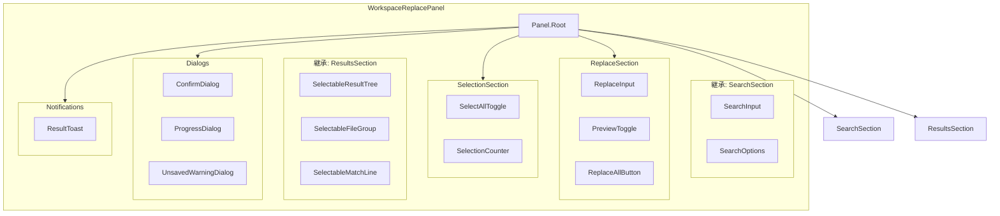
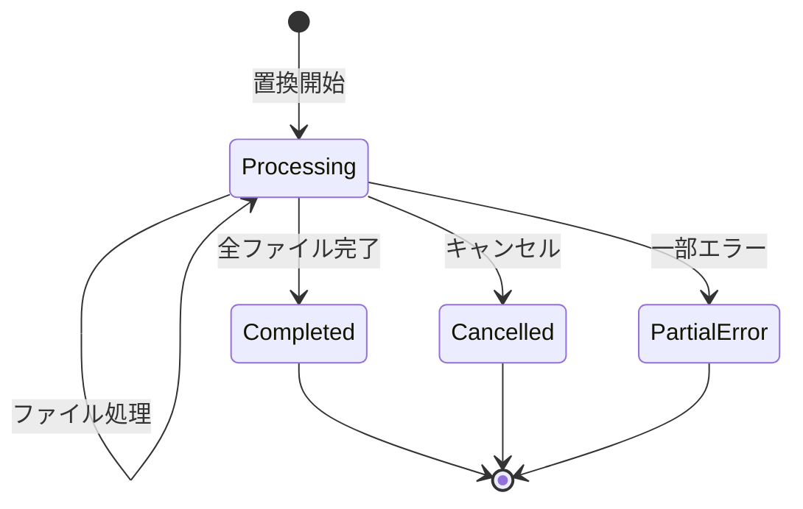

# T-01-4: ワークスペース置換UI設計書 (WorkspaceReplacePanel)

## メタ情報

| 項目             | 内容                                              |
| ---------------- | ------------------------------------------------- |
| サブタスクID     | T-01-4                                            |
| サブタスク名     | ワークスペース置換UI設計                          |
| 親タスクID       | TASK-SEARCH-REPLACE-001                           |
| フェーズ         | Phase 1: 設計                                     |
| ステータス       | 完了                                              |
| 担当エージェント | .claude/agents/ui-designer.md                                      |
| 作成日           | 2025-12-12                                        |
| 参照要件定義書   | `task-step00-4-workspace-replace-requirements.md` |
| 前提設計書       | `task-step01-3-workspace-search-ui-design.md`     |

---

## 1. 設計概要

### 1.1 設計原則

WorkspaceReplacePanel は WorkspaceSearchPanel を拡張し、複数ファイル一括置換機能を提供する。安全性を最優先とし、置換対象の選択・プレビュー・確認ダイアログによる誤操作防止を実現。

| 原則             | 適用内容                                 |
| ---------------- | ---------------------------------------- |
| 安全性最優先     | 確認ダイアログ・Undo説明・危険度警告     |
| 選択的操作       | ファイル/マッチ単位のチェックボックス    |
| リアルタイム     | 置換プレビューのリアルタイム更新         |
| 進捗の可視化     | 置換処理中のプログレス・キャンセル対応   |
| WCAG 2.1 AA 準拠 | 確認ダイアログのアクセシビリティ完全対応 |

### 1.2 設計スコープ

- WorkspaceSearchPanel への置換機能拡張
- 置換対象の選択的除外UI
- 置換プレビュー機能
- 確認ダイアログ
- 置換進捗ダイアログ
- 結果サマリートースト

---

## 2. コンポーネントアーキテクチャ

### 2.1 Compound Component 構造



### 2.2 コンポーネント階層

```
WorkspaceReplacePanel/
├── index.ts
├── WorkspaceReplacePanel.tsx
├── WorkspaceReplacePanelContext.tsx
├── components/
│   ├── Replace/
│   │   ├── ReplaceInput.tsx
│   │   ├── PreviewToggle.tsx
│   │   ├── ReplaceAllButton.tsx
│   │   └── PreviewBadge.tsx
│   ├── Selection/
│   │   ├── SelectAllToggle.tsx
│   │   ├── SelectionCounter.tsx
│   │   └── SelectionActions.tsx
│   ├── Results/
│   │   ├── SelectableResultTree.tsx
│   │   ├── SelectableFileGroup.tsx
│   │   ├── SelectableMatchLine.tsx
│   │   └── PreviewDiff.tsx
│   ├── Dialogs/
│   │   ├── ConfirmDialog.tsx
│   │   ├── ProgressDialog.tsx
│   │   └── UnsavedWarningDialog.tsx
│   └── Notifications/
│       └── ResultToast.tsx
├── hooks/
│   ├── useWorkspaceReplace.ts
│   ├── useReplacePreview.ts
│   ├── useSelectionState.ts
│   └── useReplaceProgress.ts
└── types.ts
```

### 2.3 Props インターフェース

```typescript
// WorkspaceReplacePanel の Props（SearchPanel を拡張）
interface WorkspaceReplacePanelProps extends WorkspaceSearchPanelProps {
  /** 置換完了コールバック */
  onReplaceComplete?: (result: WorkspaceReplaceResult) => void;
  /** Undo トリガーコールバック */
  onUndoRequest?: (undoGroupId: string) => void;
}

// 置換入力の Props
interface ReplaceInputProps {
  /** 置換文字列 */
  value: string;
  /** 値変更コールバック */
  onChange: (value: string) => void;
  /** 無効状態 */
  disabled: boolean;
  /** プレースホルダー */
  placeholder?: string;
}

// 選択可能なファイルグループの Props
interface SelectableFileGroupProps extends FileGroupProps {
  /** チェック状態 */
  checked: boolean;
  /** 部分選択状態 */
  indeterminate: boolean;
  /** チェック変更コールバック */
  onCheckedChange: (checked: boolean) => void;
  /** プレビューモード */
  previewMode: boolean;
}

// 選択可能なマッチ行の Props
interface SelectableMatchLineProps extends MatchLineProps {
  /** チェック状態 */
  checked: boolean;
  /** チェック変更コールバック */
  onCheckedChange: (checked: boolean) => void;
  /** プレビュー: 置換後テキスト */
  previewText?: string;
  /** プレビューモード */
  previewMode: boolean;
}

// 確認ダイアログの Props
interface ConfirmDialogProps {
  /** 表示状態 */
  isOpen: boolean;
  /** 閉じるコールバック */
  onClose: () => void;
  /** 確認コールバック */
  onConfirm: () => void;
  /** 検索文字列 */
  searchString: string;
  /** 置換文字列 */
  replaceString: string;
  /** 対象ファイル数 */
  fileCount: number;
  /** 対象マッチ数 */
  matchCount: number;
  /** 危険度レベル */
  dangerLevel: "normal" | "warning" | "danger";
}

// プログレスダイアログの Props
interface ProgressDialogProps {
  /** 表示状態 */
  isOpen: boolean;
  /** 現在処理中のファイル */
  currentFile: string;
  /** 処理済みファイル数 */
  processedFiles: number;
  /** 総ファイル数 */
  totalFiles: number;
  /** 置換済みマッチ数 */
  replacedCount: number;
  /** エラー数 */
  errorCount: number;
  /** キャンセルコールバック */
  onCancel: () => void;
}
```

---

## 3. ビジュアルデザイン

### 3.1 全体レイアウト（置換モード）

```
┌──────────────────────────────────────────────────────┐
│  🔍 ワークスペース検索                        [×]    │ ← ヘッダー
├──────────────────────────────────────────────────────┤
│  ┌────────────────────────────────────┐              │
│  │ Button                             │ [Aa][.*][Ab] │ ← 検索入力
│  └────────────────────────────────────┘              │
│  ┌────────────────────────────────────┐              │
│  │ Component                          │              │ ← 置換入力
│  └────────────────────────────────────┘              │
│  ─────────────────────────────────────────────────── │
│  対象: [*.ts, *.tsx                              ]   │
│  除外: [node_modules, dist                       ]   │
│  [☑] .gitignore を使用                               │
│  ─────────────────────────────────────────────────── │
│  [☑プレビュー]  [すべて置換]                         │ ← アクションボタン
│  42件のファイル内 156件のマッチ (148件選択) [クリア] │ ← 選択カウンター
├──────────────────────────────────────────────────────┤
│  [☑] ▼ src/components/Button.tsx (5件中5件選択)      │
│       [☑] 12: const Button → Component              │ ← プレビュー表示
│       [☑] 24: export Button → Component             │
│       [☑] 35: interface ButtonState...              │
│  [☐] ▼ src/hooks/useButton.ts (3件中0件選択)  ← 除外 │
│       [☐]  8: const { Button }...                   │
│       [☐] 15: return <Button...                     │
│  [☑] ▶ src/types/button.ts (2件中2件選択)            │
│  ...                                                │
└──────────────────────────────────────────────────────┘
```

### 3.2 寸法仕様

| 要素                   | 寸法  | Design Token    |
| ---------------------- | ----- | --------------- |
| 置換入力高さ           | 32px  | `h-8`           |
| チェックボックスサイズ | 16px  | `w-4 h-4`       |
| プレビュー差分高さ     | 20px  | `h-5`           |
| ダイアログ最小幅       | 400px | `min-w-[400px]` |
| ダイアログ最大幅       | 500px | `max-w-[500px]` |
| プログレスバー高さ     | 8px   | `h-2`           |

### 3.3 カラートークン（追加分）

| 要素                   | ライトモード      | ダークモード      |
| ---------------------- | ----------------- | ----------------- |
| チェックボックス       | `accent-blue-500` | `accent-blue-400` |
| 未選択行背景           | `bg-slate-100/50` | `bg-slate-800/30` |
| プレビュー削除テキスト | `text-red-600`    | `text-red-400`    |
| プレビュー削除背景     | `bg-red-100`      | `bg-red-900/30`   |
| プレビュー追加テキスト | `text-green-600`  | `text-green-400`  |
| プレビュー追加背景     | `bg-green-100`    | `bg-green-900/30` |
| 警告ダイアログ背景     | `bg-amber-50`     | `bg-amber-900/20` |
| 危険ダイアログ背景     | `bg-red-50`       | `bg-red-900/20`   |
| プログレス完了         | `bg-green-500`    | `bg-green-400`    |
| プログレスエラー       | `bg-red-500`      | `bg-red-400`      |

### 3.4 アイコン仕様（追加分）

| アイコン         | Lucide アイコン名 | 用途             |
| ---------------- | ----------------- | ---------------- |
| 置換             | `replace`         | 置換入力ラベル   |
| プレビュー       | `eye`             | プレビュートグル |
| プレビュー非表示 | `eye-off`         | プレビュー非表示 |
| すべて置換       | `replace-all`     | すべて置換ボタン |
| 警告             | `alert-triangle`  | 警告ダイアログ   |
| 危険             | `alert-circle`    | 危険ダイアログ   |
| 情報             | `info`            | Undo説明         |
| チェック         | `check`           | 完了状態         |
| チェックサークル | `check-circle`    | 置換完了トースト |
| 元に戻す         | `undo-2`          | Undoボタン       |

---

## 4. チェックボックス選択設計

### 4.1 選択状態モデル

```typescript
interface SelectionState {
  /** 選択されているマッチのセット（filePath:line:column形式） */
  selectedMatches: Set<string>;
  /** ファイル別の選択状態キャッシュ */
  fileSelectionCache: Map<string, FileSelectionStatus>;
}

interface FileSelectionStatus {
  /** 全選択 */
  allSelected: boolean;
  /** 部分選択 */
  partiallySelected: boolean;
  /** 選択数 */
  selectedCount: number;
  /** 総数 */
  totalCount: number;
}

// マッチの一意キー生成
function getMatchKey(filePath: string, line: number, column: number): string {
  return `${filePath}:${line}:${column}`;
}
```

### 4.2 チェックボックスの3状態

```
[☑] 全選択    - 子要素すべてが選択されている
[☐] 未選択    - 子要素すべてが未選択
[▣] 部分選択  - 一部の子要素のみ選択（indeterminate）
```

### 4.3 選択操作UI

```
┌──────────────────────────────────────────────────────┐
│  [☑すべて選択] [☐すべて解除]  148/156件選択          │
│  ─────────────────────────────────────────────────── │
│  [▣] ▼ src/components/Button.tsx (3/5件選択)         │
│       [☑] 12: const Button...                        │
│       [☑] 24: export Button...                       │
│       [☐] 35: interface ButtonState...   ← 除外      │
│       [☑] 48: const ButtonProps...                   │
│       [☐] 62: type ButtonVariant...      ← 除外      │
└──────────────────────────────────────────────────────┘
```

### 4.4 選択操作のキーボードショートカット

| 操作             | macOS       | Windows/Linux |
| ---------------- | ----------- | ------------- |
| すべて選択       | Cmd+A       | Ctrl+A        |
| すべて選択解除   | Cmd+Shift+A | Ctrl+Shift+A  |
| 選択反転         | Cmd+I       | Ctrl+I        |
| 現在行の選択切替 | Space       | Space         |

---

## 5. プレビュー表示設計

### 5.1 インライン差分表示

```
置換前: const Button = ({ label, onClick }) => {
              ~~~~~~
              └── 削除部分（取り消し線 + 赤背景）

置換後: const Component = ({ label, onClick }) => {
              ~~~~~~~~~
              └── 追加部分（下線 + 緑背景）

結合表示:
   12: const ~~Button~~ Component = ({ label, onClick }) => {
             └─削除─┘  └──追加──┘
```

### 5.2 プレビューコンポーネント

```typescript
interface PreviewDiffProps {
  /** 元テキスト */
  originalText: string;
  /** マッチ開始位置 */
  matchStart: number;
  /** マッチ長 */
  matchLength: number;
  /** 置換後テキスト */
  replacementText: string;
}

// レンダリング例
function PreviewDiff({
  originalText,
  matchStart,
  matchLength,
  replacementText,
}: PreviewDiffProps) {
  const before = originalText.slice(0, matchStart);
  const matched = originalText.slice(matchStart, matchStart + matchLength);
  const after = originalText.slice(matchStart + matchLength);

  return (
    <span>
      {before}
      <del className="bg-red-100 text-red-600 line-through">{matched}</del>
      <ins className="bg-green-100 text-green-600 underline">
        {replacementText}
      </ins>
      {after}
    </span>
  );
}
```

### 5.3 プレビュー更新戦略

| 条件               | 更新タイミング                     |
| ------------------ | ---------------------------------- |
| 置換文字列変更     | 200ms デバウンス後にプレビュー更新 |
| 正規表現キャプチャ | 各マッチごとに個別計算             |
| 大量マッチ         | 表示中の100件のみプレビュー計算    |

---

## 6. 確認ダイアログ設計

### 6.1 通常確認ダイアログ

```
┌─────────────────────────────────────────────────────────┐
│                                                         │
│  🔄  すべて置換                                [×]      │
│  ─────────────────────────────────────────────────────  │
│                                                         │
│  8件のファイル内 42件のマッチを置換しますか？           │
│                                                         │
│  ┌─────────────────────────────────────────────────┐   │
│  │  検索: Button                                    │   │
│  │  置換: Component                                 │   │
│  └─────────────────────────────────────────────────┘   │
│                                                         │
│  ℹ️ この操作は Cmd+Z で取り消すことができます。         │
│                                                         │
│                          [キャンセル]  [置換する]       │
│                                                         │
└─────────────────────────────────────────────────────────┘
```

### 6.2 警告レベル（10ファイル以上）

```
┌─────────────────────────────────────────────────────────┐
│  ⚠️ 多数のファイルが影響を受けます                      │
│  ─────────────────────────────────────────────────────  │
│  ┌─────────────────────────────────────────────────┐   │
│  │  42件のファイル内 156件のマッチを置換します       │   │
│  │                                                   │   │
│  │  この操作は多数のファイルに影響します。           │   │
│  │  続行する前に内容を確認してください。             │   │
│  └─────────────────────────────────────────────────┘   │
│                                                         │
│  ┌─────────────────────────────────────────────────┐   │
│  │  検索: Button                                    │   │
│  │  置換: Component                                 │   │
│  └─────────────────────────────────────────────────┘   │
│                                                         │
│  ℹ️ この操作は Cmd+Z で取り消すことができます。         │
│                                                         │
│                          [キャンセル]  [置換する]       │
│                                                         │
└─────────────────────────────────────────────────────────┘

背景色: bg-amber-50 (ライト) / bg-amber-900/20 (ダーク)
アイコン: alert-triangle (amber-500)
```

### 6.3 危険レベル（50ファイル以上）

```
┌─────────────────────────────────────────────────────────┐
│  🚨 大規模な変更が行われます                            │
│  ─────────────────────────────────────────────────────  │
│  ┌─────────────────────────────────────────────────┐   │
│  │  125件のファイル内 2,450件のマッチを置換します    │   │
│  │                                                   │   │
│  │  ⚠️ この操作は非常に多くのファイルに影響します。  │   │
│  │  予期しない変更が含まれている可能性があります。   │   │
│  └─────────────────────────────────────────────────┘   │
│                                                         │
│  ┌─────────────────────────────────────────────────┐   │
│  │  検索: import                                    │   │
│  │  置換: require                                   │   │
│  └─────────────────────────────────────────────────┘   │
│                                                         │
│  ℹ️ この操作は Cmd+Z で取り消すことができます。         │
│                                                         │
│                          [キャンセル]  [置換する]       │
│                                                         │
└─────────────────────────────────────────────────────────┘

背景色: bg-red-50 (ライト) / bg-red-900/20 (ダーク)
アイコン: alert-circle (red-500)
ボタン: [置換する] は赤色バリアント
```

### 6.4 危険度レベル判定

```typescript
function getDangerLevel(fileCount: number): "normal" | "warning" | "danger" {
  if (fileCount >= 50) return "danger";
  if (fileCount >= 10) return "warning";
  return "normal";
}
```

---

## 7. 未保存ファイル警告ダイアログ

### 7.1 ダイアログUI

```
┌─────────────────────────────────────────────────────────┐
│  📝 保存されていないファイルがあります            [×]   │
│  ─────────────────────────────────────────────────────  │
│                                                         │
│  以下のファイルに保存されていない変更があります:        │
│                                                         │
│  ┌─────────────────────────────────────────────────┐   │
│  │  • src/components/Button.tsx                     │   │
│  │  • src/hooks/useButton.ts                        │   │
│  └─────────────────────────────────────────────────┘   │
│                                                         │
│  これらのファイルをどのように処理しますか？             │
│                                                         │
│  [すべて保存して続行]  [スキップして続行]  [キャンセル] │
│                                                         │
└─────────────────────────────────────────────────────────┘
```

### 7.2 オプションの説明

| オプション         | 動作                                           |
| ------------------ | ---------------------------------------------- |
| すべて保存して続行 | 未保存ファイルを保存してから置換を実行         |
| スキップして続行   | 未保存ファイルを置換対象から除外して置換を実行 |
| キャンセル         | 何もせずにダイアログを閉じる                   |

---

## 8. 進捗ダイアログ設計

### 8.1 進捗表示UI

```
┌─────────────────────────────────────────────────────────┐
│  置換処理中...                                          │
│  ─────────────────────────────────────────────────────  │
│                                                         │
│  ██████████████████████░░░░░░░░  35/42 ファイル         │
│                                                         │
│  処理中: src/components/Layout.tsx                      │
│                                                         │
│  ┌─────────────────────────────────────────────────┐   │
│  │  ✓ 完了: 120件                                   │   │
│  │  ✗ エラー: 0件                                   │   │
│  └─────────────────────────────────────────────────┘   │
│                                                         │
│                                         [キャンセル]    │
│                                                         │
└─────────────────────────────────────────────────────────┘
```

### 8.2 進捗状態遷移



### 8.3 キャンセル時の動作

- 処理中のファイルは完了まで待機
- 未処理ファイルはスキップ
- 処理済みファイルは変更済み状態（Undoで戻せる）

---

## 9. 結果サマリートースト設計

### 9.1 成功トースト

```
┌─────────────────────────────────────────────────────────┐
│  ✅ 置換完了                                            │
│                                                         │
│  42件のファイル内 156件を置換しました                   │
│  処理時間: 2.3秒                                        │
│                                                         │
│  [元に戻す]                               [詳細]  [×]   │
└─────────────────────────────────────────────────────────┘

位置: 画面右下
表示時間: 自動非表示なし（ユーザーが閉じるまで表示）
```

### 9.2 部分成功トースト

```
┌─────────────────────────────────────────────────────────┐
│  ⚠️ 置換完了（一部エラー）                              │
│                                                         │
│  38件のファイル内 142件を置換しました                   │
│  4件のファイルでエラーが発生しました                    │
│                                                         │
│  [元に戻す]                               [詳細]  [×]   │
└─────────────────────────────────────────────────────────┘
```

### 9.3 キャンセルトースト

```
┌─────────────────────────────────────────────────────────┐
│  ℹ️ 置換を中断しました                                  │
│                                                         │
│  15件のファイル内 45件を置換しました（中断前）          │
│  残り 27件のファイルは処理されませんでした              │
│                                                         │
│  [元に戻す]                                       [×]   │
└─────────────────────────────────────────────────────────┘
```

---

## 10. アクセシビリティ設計

### 10.1 ARIA 属性マッピング（追加分）

| コンポーネント   | ARIA 属性                                                    |
| ---------------- | ------------------------------------------------------------ |
| 置換入力         | `aria-label="置換文字列"`                                    |
| チェックボックス | `role="checkbox"`, `aria-checked`, `aria-label`              |
| すべて置換ボタン | `aria-label="すべてのマッチを置換"`, `aria-disabled`         |
| 確認ダイアログ   | `role="alertdialog"`, `aria-modal="true"`, `aria-labelledby` |
| 進捗ダイアログ   | `role="dialog"`, `aria-modal="true"`, `aria-describedby`     |
| プログレスバー   | `role="progressbar"`, `aria-valuenow`, `aria-valuemin/max`   |
| 結果トースト     | `role="alert"`, `aria-live="polite"`                         |
| 選択カウンター   | `role="status"`, `aria-live="polite"`, `aria-atomic="true"`  |

### 10.2 フォーカストラップ

```typescript
// ダイアログ内のフォーカストラップ
function useFocusTrap(dialogRef: RefObject<HTMLElement>, isOpen: boolean) {
  useEffect(() => {
    if (!isOpen || !dialogRef.current) return;

    const focusableElements = dialogRef.current.querySelectorAll(
      'button, [href], input, select, textarea, [tabindex]:not([tabindex="-1"])',
    );
    const firstElement = focusableElements[0] as HTMLElement;
    const lastElement = focusableElements[
      focusableElements.length - 1
    ] as HTMLElement;

    function handleKeyDown(e: KeyboardEvent) {
      if (e.key !== "Tab") return;

      if (e.shiftKey && document.activeElement === firstElement) {
        e.preventDefault();
        lastElement.focus();
      } else if (!e.shiftKey && document.activeElement === lastElement) {
        e.preventDefault();
        firstElement.focus();
      }
    }

    document.addEventListener("keydown", handleKeyDown);
    firstElement?.focus();

    return () => document.removeEventListener("keydown", handleKeyDown);
  }, [isOpen, dialogRef]);
}
```

### 10.3 スクリーンリーダー通知

| イベント         | 通知内容                                          |
| ---------------- | ------------------------------------------------- |
| 選択変更         | 「{N}件選択中」                                   |
| プレビュー有効化 | 「プレビューモードが有効になりました」            |
| 置換開始         | 「{N}件のファイルで置換処理を開始します」         |
| 置換進捗         | 「{現在}/{総数}ファイル処理中」（10ファイルごと） |
| 置換完了         | 「{N}件のファイル内{M}件を置換しました」          |
| 置換エラー       | 「{N}件のファイルでエラーが発生しました」         |

---

## 11. 状態管理設計

### 11.1 状態モデル

```typescript
interface WorkspaceReplaceState extends WorkspaceSearchState {
  /** 置換文字列 */
  replaceString: string;
  /** 選択状態 */
  selection: SelectionState;
  /** プレビューモード */
  previewMode: boolean;
  /** 置換状態 */
  replaceStatus: "idle" | "confirming" | "replacing" | "completed" | "error";
  /** 置換進捗 */
  replaceProgress: ReplaceProgress | null;
  /** 置換結果 */
  replaceResult: WorkspaceReplaceResult | null;
  /** 未保存ファイル警告 */
  unsavedWarning: UnsavedWarning | null;
}

interface ReplaceProgress {
  /** 現在処理中のファイル */
  currentFile: string;
  /** 処理済みファイル数 */
  processedFiles: number;
  /** 総ファイル数 */
  totalFiles: number;
  /** 置換済み件数 */
  replacedCount: number;
  /** エラー件数 */
  errorCount: number;
}

interface UnsavedWarning {
  /** 未保存ファイルリスト */
  files: string[];
  /** ユーザーの選択待ち */
  awaitingResponse: boolean;
}
```

### 11.2 Context API 拡張

```typescript
interface WorkspaceReplaceContextValue extends WorkspaceSearchContextValue {
  // 置換アクション
  setReplaceString: (value: string) => void;
  togglePreviewMode: () => void;
  requestReplaceAll: () => void;
  confirmReplace: () => void;
  cancelReplace: () => void;

  // 選択アクション
  toggleMatchSelection: (key: string) => void;
  toggleFileSelection: (filePath: string) => void;
  selectAll: () => void;
  deselectAll: () => void;
  invertSelection: () => void;

  // 未保存ファイル処理
  handleUnsavedFiles: (action: "save" | "skip" | "cancel") => void;

  // Undo
  undoLastReplace: () => void;
}
```

---

## 12. キーボードショートカット（追加分）

| 操作                             | macOS         | Windows/Linux  |
| -------------------------------- | ------------- | -------------- |
| すべて置換（確認ダイアログ表示） | Cmd+Alt+Enter | Ctrl+Alt+Enter |
| プレビュートグル                 | Alt+P         | Alt+P          |
| すべて選択                       | Cmd+A         | Ctrl+A         |
| すべて選択解除                   | Cmd+Shift+A   | Ctrl+Shift+A   |
| 選択反転                         | Cmd+I         | Ctrl+I         |
| 現在行の選択切替                 | Space         | Space          |
| 確認ダイアログで「置換する」     | Enter         | Enter          |
| ダイアログをキャンセル           | Escape        | Escape         |

---

## 13. 完了条件チェックリスト

- [x] 置換対象ファイルの選択/除外UIが設計されている
- [x] 置換前確認ダイアログの設計が完了している
- [x] 置換結果プレビューの表示形式が定義されている
- [x] 一括置換ボタンの安全策（確認ステップ等）が設計されている
- [x] 危険度レベルによる視覚的警告が設計されている
- [x] 未保存ファイル警告ダイアログが設計されている
- [x] 進捗ダイアログが設計されている
- [x] 結果サマリートーストが設計されている
- [x] アクセシビリティ要件（WCAG 2.1 AA）が満たされている

---

## 14. 参照ドキュメント

- `docs/30-workflows/search-replace/task-step00-4-workspace-replace-requirements.md` - 要件定義
- `docs/30-workflows/search-replace/task-step01-3-workspace-search-ui-design.md` - 検索パネル設計
- `docs/30-workflows/search-replace/task-step01-2-file-replace-ui-design.md` - ファイル内置換設計
- `docs/00-requirements/16-ui-ux-guidelines.md` - UI/UXガイドライン
- [VS Code Search and Replace](https://code.visualstudio.com/docs/editor/codebasics#_search-and-replace)
- [ARIA Alert Dialog Pattern](https://www.w3.org/WAI/ARIA/apg/patterns/alertdialog/)

---

## 15. 変更履歴

| 日付       | 版  | 変更内容 | 担当         |
| ---------- | --- | -------- | ------------ |
| 2025-12-12 | 1.0 | 初版作成 | .claude/agents/ui-designer.md |
