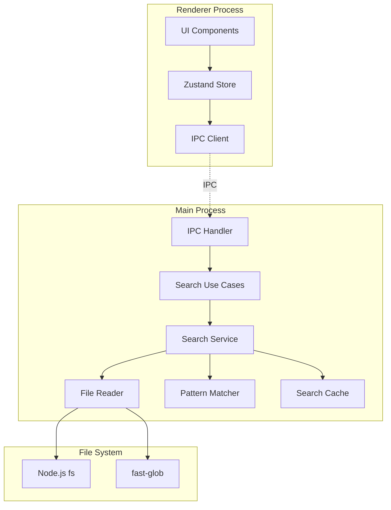
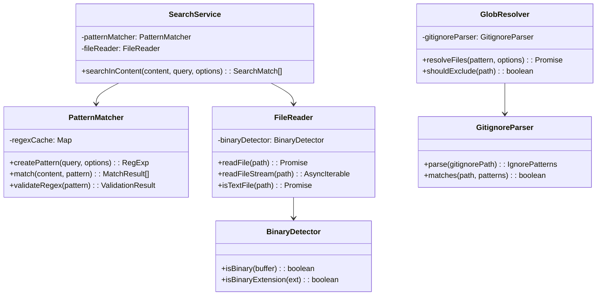

# T-01-5: 検索エンジンアーキテクチャ設計書

## メタ情報

| 項目             | 内容                             |
| ---------------- | -------------------------------- |
| サブタスクID     | T-01-5                           |
| サブタスク名     | 検索エンジンアーキテクチャ設計   |
| 親タスクID       | TASK-SEARCH-REPLACE-001          |
| フェーズ         | Phase 1: 設計                    |
| ステータス       | 完了                             |
| 担当エージェント | .claude/agents/electron-architect.md              |
| 作成日           | 2025-12-12                       |
| 参照要件定義書   | `task-step00-1`, `task-step00-3` |

---

## 1. 設計概要

### 1.1 設計原則

| 原則                 | 適用内容                                 |
| -------------------- | ---------------------------------------- |
| プロセス分離         | Main プロセスで検索実行、Renderer で表示 |
| Clean Architecture   | Use Case/Repository/Service の責務分離   |
| 非同期ストリーミング | 結果を逐次返却し、UIの応答性を維持       |
| セキュリティ         | ReDoS 対策、パストラバーサル防止         |
| スケーラビリティ     | 大規模プロジェクト（10万ファイル）対応   |

### 1.2 設計スコープ

- IPC チャネル設計（Main/Renderer 間通信）
- 検索エンジンコアアーキテクチャ
- ファイルシステムアクセス層
- パフォーマンス最適化戦略
- エラーハンドリング設計

---

## 2. アーキテクチャ概要

### 2.1 レイヤー構成



### 2.2 ディレクトリ構造

```
apps/desktop/src/
├── main/
│   ├── ipc/
│   │   ├── searchHandlers.ts        # IPC ハンドラー登録
│   │   └── searchChannels.ts        # チャネル定義
│   ├── search/
│   │   ├── index.ts
│   │   ├── SearchService.ts         # 検索サービス（メインロジック）
│   │   ├── FileSearchUseCase.ts     # ファイル内検索ユースケース
│   │   ├── WorkspaceSearchUseCase.ts # ワークスペース検索ユースケース
│   │   ├── PatternMatcher.ts        # パターンマッチング
│   │   ├── FileReader.ts            # ファイル読み込み
│   │   ├── GlobResolver.ts          # glob パターン解決
│   │   ├── GitignoreParser.ts       # .gitignore 解析
│   │   ├── BinaryDetector.ts        # バイナリファイル検出
│   │   └── SearchCache.ts           # 検索結果キャッシュ
│   └── types/
│       └── search.ts                # 型定義
├── renderer/
│   ├── hooks/
│   │   ├── useFileSearch.ts         # ファイル内検索 Hook
│   │   └── useWorkspaceSearch.ts    # ワークスペース検索 Hook
│   └── store/
│       └── slices/
│           └── search/
│               ├── fileSearchSlice.ts
│               └── workspaceSearchSlice.ts
└── shared/
    └── types/
        └── search.ts                # 共有型定義
```

---

## 3. IPC チャネル設計

### 3.1 チャネル定義

```typescript
// apps/desktop/src/main/ipc/searchChannels.ts

export const SEARCH_CHANNELS = {
  // ファイル内検索
  FILE_SEARCH: "search:file:execute",
  FILE_SEARCH_CANCEL: "search:file:cancel",

  // ワークスペース検索
  WORKSPACE_SEARCH: "search:workspace:execute",
  WORKSPACE_SEARCH_CANCEL: "search:workspace:cancel",
  WORKSPACE_SEARCH_PROGRESS: "search:workspace:progress",
  WORKSPACE_SEARCH_RESULT: "search:workspace:result",

  // 共通
  SEARCH_ERROR: "search:error",
} as const;
```

### 3.2 IPC メッセージ型定義

```typescript
// apps/desktop/src/shared/types/search.ts

// ========== ファイル内検索 ==========

export interface FileSearchRequest {
  /** リクエストID（キャンセル用） */
  requestId: string;
  /** ファイルパス */
  filePath: string;
  /** 検索クエリ */
  query: string;
  /** 検索オプション */
  options: SearchOptions;
}

export interface FileSearchResponse {
  requestId: string;
  result: FileSearchResult | null;
  error: SearchError | null;
}

// ========== ワークスペース検索 ==========

export interface WorkspaceSearchRequest {
  /** リクエストID */
  requestId: string;
  /** ワークスペースルートパス */
  workspacePath: string;
  /** 検索クエリ */
  query: string;
  /** 検索オプション */
  options: SearchOptions;
  /** フィルタオプション */
  filters: SearchFilters;
}

export interface WorkspaceSearchProgress {
  requestId: string;
  /** 検索済みファイル数 */
  searchedFiles: number;
  /** 対象ファイル総数 */
  totalFiles: number;
  /** 現在処理中のファイル */
  currentFile: string;
  /** これまでに見つかったマッチ数 */
  matchCount: number;
}

export interface WorkspaceSearchPartialResult {
  requestId: string;
  /** 部分結果（ストリーミング） */
  fileResult: FileSearchResult;
}

export interface WorkspaceSearchFinalResult {
  requestId: string;
  /** 最終結果サマリー */
  summary: WorkspaceSearchSummary;
  /** 検索が完了したか */
  isComplete: boolean;
}

// ========== 共通型 ==========

export interface SearchOptions {
  /** 大文字/小文字を区別 */
  caseSensitive: boolean;
  /** 正規表現として検索 */
  useRegex: boolean;
  /** 単語単位で検索 */
  wholeWord: boolean;
}

export interface SearchFilters {
  /** 対象パターン（glob） */
  includePattern: string;
  /** 除外パターン（glob） */
  excludePattern: string;
  /** .gitignore を使用 */
  useGitignore: boolean;
}

export interface SearchError {
  code: SearchErrorCode;
  message: string;
  details?: unknown;
}

export type SearchErrorCode =
  | "INVALID_REGEX"
  | "INVALID_GLOB"
  | "TIMEOUT"
  | "FILE_NOT_FOUND"
  | "PERMISSION_DENIED"
  | "CANCELLED"
  | "OUT_OF_MEMORY"
  | "UNKNOWN";
```

### 3.3 IPC ハンドラー実装

```typescript
// apps/desktop/src/main/ipc/searchHandlers.ts

import { ipcMain, BrowserWindow } from "electron";
import { SEARCH_CHANNELS } from "./searchChannels";
import { FileSearchUseCase } from "../search/FileSearchUseCase";
import { WorkspaceSearchUseCase } from "../search/WorkspaceSearchUseCase";

export function registerSearchHandlers(mainWindow: BrowserWindow): void {
  const fileSearchUseCase = new FileSearchUseCase();
  const workspaceSearchUseCase = new WorkspaceSearchUseCase();

  // ファイル内検索
  ipcMain.handle(
    SEARCH_CHANNELS.FILE_SEARCH,
    async (_, request: FileSearchRequest): Promise<FileSearchResponse> => {
      try {
        const result = await fileSearchUseCase.execute(request);
        return { requestId: request.requestId, result, error: null };
      } catch (error) {
        return {
          requestId: request.requestId,
          result: null,
          error: toSearchError(error),
        };
      }
    },
  );

  // ファイル内検索キャンセル
  ipcMain.on(SEARCH_CHANNELS.FILE_SEARCH_CANCEL, (_, requestId: string) => {
    fileSearchUseCase.cancel(requestId);
  });

  // ワークスペース検索
  ipcMain.handle(
    SEARCH_CHANNELS.WORKSPACE_SEARCH,
    async (_, request: WorkspaceSearchRequest) => {
      try {
        // ストリーミング結果を送信するコールバック
        const onProgress = (progress: WorkspaceSearchProgress) => {
          mainWindow.webContents.send(
            SEARCH_CHANNELS.WORKSPACE_SEARCH_PROGRESS,
            progress,
          );
        };

        const onPartialResult = (result: WorkspaceSearchPartialResult) => {
          mainWindow.webContents.send(
            SEARCH_CHANNELS.WORKSPACE_SEARCH_RESULT,
            result,
          );
        };

        const finalResult = await workspaceSearchUseCase.execute(
          request,
          onProgress,
          onPartialResult,
        );

        return { requestId: request.requestId, ...finalResult, error: null };
      } catch (error) {
        return {
          requestId: request.requestId,
          error: toSearchError(error),
        };
      }
    },
  );

  // ワークスペース検索キャンセル
  ipcMain.on(
    SEARCH_CHANNELS.WORKSPACE_SEARCH_CANCEL,
    (_, requestId: string) => {
      workspaceSearchUseCase.cancel(requestId);
    },
  );
}
```

---

## 4. 検索エンジンコア設計

### 4.1 クラス図



### 4.2 PatternMatcher 実装

```typescript
// apps/desktop/src/main/search/PatternMatcher.ts

export interface MatchResult {
  start: number;
  end: number;
  text: string;
}

export interface ValidationResult {
  isValid: boolean;
  error?: string;
}

export class PatternMatcher {
  private regexCache = new Map<string, RegExp>();
  private readonly REGEX_TIMEOUT_MS = 100;

  /**
   * 検索パターンを作成
   */
  createPattern(query: string, options: SearchOptions): RegExp {
    const cacheKey = this.getCacheKey(query, options);

    if (this.regexCache.has(cacheKey)) {
      return this.regexCache.get(cacheKey)!;
    }

    let pattern: string;

    if (options.useRegex) {
      pattern = query;
    } else {
      // 特殊文字をエスケープ
      pattern = this.escapeRegex(query);
    }

    if (options.wholeWord) {
      pattern = `\\b${pattern}\\b`;
    }

    const flags = options.caseSensitive ? "g" : "gi";
    const regex = new RegExp(pattern, flags);

    this.regexCache.set(cacheKey, regex);
    return regex;
  }

  /**
   * コンテンツ内でパターンマッチを実行
   */
  match(content: string, pattern: RegExp): MatchResult[] {
    const results: MatchResult[] = [];
    const startTime = Date.now();

    // ReDoS 対策: タイムアウト付きで実行
    let match: RegExpExecArray | null;
    pattern.lastIndex = 0;

    while ((match = pattern.exec(content)) !== null) {
      // タイムアウトチェック
      if (Date.now() - startTime > this.REGEX_TIMEOUT_MS) {
        throw new RegexTimeoutError(
          `Pattern matching timed out after ${this.REGEX_TIMEOUT_MS}ms`,
        );
      }

      results.push({
        start: match.index,
        end: match.index + match[0].length,
        text: match[0],
      });

      // 無限ループ防止
      if (match[0].length === 0) {
        pattern.lastIndex++;
      }
    }

    return results;
  }

  /**
   * 正規表現パターンを検証
   */
  validateRegex(pattern: string): ValidationResult {
    try {
      new RegExp(pattern);

      // ReDoS 脆弱性チェック
      if (this.isPotentiallyDangerous(pattern)) {
        return {
          isValid: false,
          error:
            "This pattern may cause performance issues. Please simplify it.",
        };
      }

      return { isValid: true };
    } catch (error) {
      return {
        isValid: false,
        error: error instanceof Error ? error.message : "Invalid regex",
      };
    }
  }

  /**
   * ReDoS 脆弱性の簡易チェック
   */
  private isPotentiallyDangerous(pattern: string): boolean {
    // ネストした量指定子のチェック (例: (a+)+)
    const nestedQuantifiers = /(\([^)]*[+*][^)]*\))[+*]/;
    // 重複した量指定子のチェック (例: .*.*/.*/
    const overlappingQuantifiers = /(\.[*+]){2,}/;

    return (
      nestedQuantifiers.test(pattern) || overlappingQuantifiers.test(pattern)
    );
  }

  private escapeRegex(str: string): string {
    return str.replace(/[.*+?^${}()|[\]\\]/g, "\\$&");
  }

  private getCacheKey(query: string, options: SearchOptions): string {
    return `${query}|${options.caseSensitive}|${options.useRegex}|${options.wholeWord}`;
  }
}

export class RegexTimeoutError extends Error {
  constructor(message: string) {
    super(message);
    this.name = "RegexTimeoutError";
  }
}
```

### 4.3 FileReader 実装

```typescript
// apps/desktop/src/main/search/FileReader.ts

import * as fs from "fs/promises";
import * as fsSync from "fs";
import * as readline from "readline";
import { BinaryDetector } from "./BinaryDetector";

export interface FileContent {
  content: string;
  encoding: BufferEncoding;
  size: number;
}

export interface LineContent {
  lineNumber: number;
  text: string;
}

export class FileReader {
  private binaryDetector = new BinaryDetector();
  private readonly MAX_FILE_SIZE = 10 * 1024 * 1024; // 10MB
  private readonly CHUNK_SIZE = 64 * 1024; // 64KB

  /**
   * ファイル全体を読み込み
   */
  async readFile(filePath: string): Promise<FileContent | null> {
    const stats = await fs.stat(filePath);

    // サイズチェック
    if (stats.size > this.MAX_FILE_SIZE) {
      return null; // 大きすぎるファイルはスキップ
    }

    // バイナリチェック（最初の 8KB を確認）
    const isBinary = await this.checkBinary(filePath);
    if (isBinary) {
      return null;
    }

    const content = await fs.readFile(filePath, "utf-8");

    return {
      content,
      encoding: "utf-8",
      size: stats.size,
    };
  }

  /**
   * ファイルを行単位でストリーム読み込み
   */
  async *readFileStream(filePath: string): AsyncGenerator<LineContent> {
    const fileStream = fsSync.createReadStream(filePath, { encoding: "utf-8" });
    const rl = readline.createInterface({
      input: fileStream,
      crlfDelay: Infinity,
    });

    let lineNumber = 1;

    for await (const line of rl) {
      yield { lineNumber, text: line };
      lineNumber++;
    }
  }

  /**
   * テキストファイルかどうかを判定
   */
  async isTextFile(filePath: string): Promise<boolean> {
    // 拡張子によるチェック
    if (this.binaryDetector.isBinaryExtension(filePath)) {
      return false;
    }

    // コンテンツによるチェック
    return !(await this.checkBinary(filePath));
  }

  /**
   * バイナリファイルチェック
   */
  private async checkBinary(filePath: string): Promise<boolean> {
    const fd = await fs.open(filePath, "r");
    try {
      const buffer = Buffer.alloc(8192);
      const { bytesRead } = await fd.read(buffer, 0, 8192, 0);

      if (bytesRead === 0) {
        return false; // 空ファイルはテキスト扱い
      }

      return this.binaryDetector.isBinary(buffer.slice(0, bytesRead));
    } finally {
      await fd.close();
    }
  }
}
```

### 4.4 BinaryDetector 実装

```typescript
// apps/desktop/src/main/search/BinaryDetector.ts

export class BinaryDetector {
  private readonly BINARY_EXTENSIONS = new Set([
    // 画像
    ".png",
    ".jpg",
    ".jpeg",
    ".gif",
    ".bmp",
    ".ico",
    ".webp",
    ".svg",
    // 動画/音声
    ".mp3",
    ".mp4",
    ".wav",
    ".avi",
    ".mov",
    ".flv",
    // アーカイブ
    ".zip",
    ".tar",
    ".gz",
    ".rar",
    ".7z",
    // 実行ファイル
    ".exe",
    ".dll",
    ".so",
    ".dylib",
    // フォント
    ".ttf",
    ".otf",
    ".woff",
    ".woff2",
    // その他
    ".pdf",
    ".doc",
    ".docx",
    ".xls",
    ".xlsx",
    ".ppt",
    ".pptx",
    ".sqlite",
    ".db",
  ]);

  /**
   * バッファがバイナリかどうかを判定
   */
  isBinary(buffer: Buffer): boolean {
    // NULL バイトチェック
    for (let i = 0; i < buffer.length; i++) {
      if (buffer[i] === 0) {
        return true;
      }
    }

    // 非テキスト制御文字の割合をチェック
    let nonTextCount = 0;
    for (let i = 0; i < buffer.length; i++) {
      const byte = buffer[i];
      // 制御文字（タブ、改行、キャリッジリターン以外）
      if (byte < 32 && byte !== 9 && byte !== 10 && byte !== 13) {
        nonTextCount++;
      }
    }

    // 非テキスト文字が 30% 以上ならバイナリ
    return nonTextCount / buffer.length > 0.3;
  }

  /**
   * 拡張子によるバイナリ判定
   */
  isBinaryExtension(filePath: string): boolean {
    const ext = filePath.slice(filePath.lastIndexOf(".")).toLowerCase();
    return this.BINARY_EXTENSIONS.has(ext);
  }
}
```

---

## 5. ワークスペース検索 Use Case

### 5.1 WorkspaceSearchUseCase 実装

```typescript
// apps/desktop/src/main/search/WorkspaceSearchUseCase.ts

import { GlobResolver } from "./GlobResolver";
import { SearchService } from "./SearchService";
import { FileReader } from "./FileReader";

export class WorkspaceSearchUseCase {
  private globResolver = new GlobResolver();
  private searchService = new SearchService();
  private fileReader = new FileReader();
  private activeRequests = new Map<string, AbortController>();

  private readonly PARALLEL_FILE_LIMIT = 10;
  private readonly MAX_RESULTS = 10000;

  async execute(
    request: WorkspaceSearchRequest,
    onProgress: (progress: WorkspaceSearchProgress) => void,
    onPartialResult: (result: WorkspaceSearchPartialResult) => void,
  ): Promise<WorkspaceSearchFinalResult> {
    const abortController = new AbortController();
    this.activeRequests.set(request.requestId, abortController);

    try {
      // 1. 検索対象ファイルを解決
      const files = await this.globResolver.resolveFiles(
        request.workspacePath,
        request.filters,
      );

      const startTime = Date.now();
      let searchedFiles = 0;
      let totalMatchCount = 0;
      const fileResults: FileSearchResult[] = [];
      const skippedFiles: SkippedFile[] = [];

      // 2. 並列でファイルを検索
      const chunks = this.chunkArray(files, this.PARALLEL_FILE_LIMIT);

      for (const chunk of chunks) {
        // キャンセルチェック
        if (abortController.signal.aborted) {
          break;
        }

        // 結果数上限チェック
        if (totalMatchCount >= this.MAX_RESULTS) {
          break;
        }

        const results = await Promise.all(
          chunk.map((filePath) =>
            this.searchFile(filePath, request, abortController.signal),
          ),
        );

        for (const result of results) {
          searchedFiles++;

          if (result.type === "skipped") {
            skippedFiles.push(result.file);
          } else if (result.type === "matched" && result.fileResult) {
            fileResults.push(result.fileResult);
            totalMatchCount += result.fileResult.matches.length;

            // 部分結果をストリーミング
            onPartialResult({
              requestId: request.requestId,
              fileResult: result.fileResult,
            });
          }

          // 進捗通知（100ファイルごと、または最初の10ファイル）
          if (searchedFiles <= 10 || searchedFiles % 100 === 0) {
            onProgress({
              requestId: request.requestId,
              searchedFiles,
              totalFiles: files.length,
              currentFile: result.filePath,
              matchCount: totalMatchCount,
            });
          }
        }
      }

      const executionTime = Date.now() - startTime;

      return {
        requestId: request.requestId,
        summary: {
          totalFilesSearched: searchedFiles,
          matchedFileCount: fileResults.length,
          totalMatchCount,
          executionTime,
          skippedFiles,
        },
        isComplete: !abortController.signal.aborted,
      };
    } finally {
      this.activeRequests.delete(request.requestId);
    }
  }

  cancel(requestId: string): void {
    const controller = this.activeRequests.get(requestId);
    if (controller) {
      controller.abort();
    }
  }

  private async searchFile(
    filePath: string,
    request: WorkspaceSearchRequest,
    signal: AbortSignal,
  ): Promise<FileSearchJobResult> {
    try {
      if (signal.aborted) {
        return { type: "cancelled", filePath };
      }

      // ファイル読み込み
      const fileContent = await this.fileReader.readFile(filePath);

      if (!fileContent) {
        return {
          type: "skipped",
          filePath,
          file: { filePath, reason: "binary" },
        };
      }

      // 検索実行
      const matches = this.searchService.searchInContent(
        fileContent.content,
        request.query,
        request.options,
      );

      if (matches.length === 0) {
        return { type: "no_match", filePath };
      }

      // 相対パスに変換
      const relativePath = filePath.replace(request.workspacePath + "/", "");

      return {
        type: "matched",
        filePath,
        fileResult: {
          filePath: relativePath,
          matches: matches.map((m) => ({
            line: m.line,
            column: m.column,
            length: m.length,
            lineText: m.lineText,
          })),
        },
      };
    } catch (error) {
      return {
        type: "skipped",
        filePath,
        file: { filePath, reason: "read_error" },
      };
    }
  }

  private chunkArray<T>(array: T[], size: number): T[][] {
    const chunks: T[][] = [];
    for (let i = 0; i < array.length; i += size) {
      chunks.push(array.slice(i, i + size));
    }
    return chunks;
  }
}

type FileSearchJobResult =
  | { type: "matched"; filePath: string; fileResult: FileSearchResult }
  | { type: "no_match"; filePath: string }
  | { type: "skipped"; filePath: string; file: SkippedFile }
  | { type: "cancelled"; filePath: string };
```

---

## 6. Glob 解決と .gitignore 連携

### 6.1 GlobResolver 実装

```typescript
// apps/desktop/src/main/search/GlobResolver.ts

import fg from "fast-glob";
import { GitignoreParser } from "./GitignoreParser";
import * as path from "path";

export class GlobResolver {
  private gitignoreParser = new GitignoreParser();

  async resolveFiles(
    workspacePath: string,
    filters: SearchFilters,
  ): Promise<string[]> {
    // デフォルト除外パターン
    const defaultIgnore = ["**/node_modules/**", "**/.git/**"];

    // 除外パターンを解析
    const userExclude = filters.excludePattern
      ? this.parsePatternList(filters.excludePattern)
      : [];

    // .gitignore パターン取得
    let gitignorePatterns: string[] = [];
    if (filters.useGitignore) {
      gitignorePatterns = await this.gitignoreParser.getPatterns(workspacePath);
    }

    // 対象パターン
    const includePattern = filters.includePattern
      ? this.parsePatternList(filters.includePattern)
      : ["**/*"];

    // fast-glob で検索
    const files = await fg(includePattern, {
      cwd: workspacePath,
      absolute: true,
      ignore: [...defaultIgnore, ...userExclude, ...gitignorePatterns],
      onlyFiles: true,
      followSymbolicLinks: false,
      suppressErrors: true, // 権限エラー等を無視
    });

    return files;
  }

  private parsePatternList(patterns: string): string[] {
    return patterns
      .split(",")
      .map((p) => p.trim())
      .filter((p) => p.length > 0)
      .map((p) => {
        // ディレクトリ名のみの場合は再帰パターンに変換
        if (!p.includes("*") && !p.includes("/")) {
          return `**/${p}/**`;
        }
        return p;
      });
  }
}
```

### 6.2 GitignoreParser 実装

```typescript
// apps/desktop/src/main/search/GitignoreParser.ts

import * as fs from "fs/promises";
import * as path from "path";

export class GitignoreParser {
  private cache = new Map<string, string[]>();

  async getPatterns(workspacePath: string): Promise<string[]> {
    // キャッシュチェック
    if (this.cache.has(workspacePath)) {
      return this.cache.get(workspacePath)!;
    }

    const gitignorePath = path.join(workspacePath, ".gitignore");

    try {
      const content = await fs.readFile(gitignorePath, "utf-8");
      const patterns = this.parse(content);
      this.cache.set(workspacePath, patterns);
      return patterns;
    } catch {
      // .gitignore が存在しない場合は空配列
      return [];
    }
  }

  parse(content: string): string[] {
    return content
      .split("\n")
      .map((line) => line.trim())
      .filter((line) => {
        // 空行とコメントを除外
        return line.length > 0 && !line.startsWith("#");
      })
      .map((pattern) => {
        // 否定パターンは除外（fast-glob では直接サポートされない）
        if (pattern.startsWith("!")) {
          return null;
        }

        // ディレクトリパターンを正規化
        if (pattern.endsWith("/")) {
          return `**/${pattern}**`;
        }

        // 絶対パスパターン
        if (pattern.startsWith("/")) {
          return pattern.slice(1);
        }

        // 相対パターンは再帰的に適用
        if (!pattern.includes("/")) {
          return `**/${pattern}`;
        }

        return pattern;
      })
      .filter((p): p is string => p !== null);
  }

  clearCache(): void {
    this.cache.clear();
  }
}
```

---

## 7. Renderer 側 Hook 実装

### 7.1 useFileSearch Hook

```typescript
// apps/desktop/src/renderer/hooks/useFileSearch.ts

import { useState, useCallback, useRef } from "react";
import { useSearchStore } from "../store/slices/search/fileSearchSlice";

export function useFileSearch() {
  const [isSearching, setIsSearching] = useState(false);
  const requestIdRef = useRef<string | null>(null);
  const { setResult, setError, clearResult } = useSearchStore();

  const search = useCallback(
    async (filePath: string, query: string, options: SearchOptions) => {
      if (!query) {
        clearResult();
        return;
      }

      const requestId = crypto.randomUUID();
      requestIdRef.current = requestId;
      setIsSearching(true);

      try {
        const response = await window.api.search.fileSearch({
          requestId,
          filePath,
          query,
          options,
        });

        // キャンセルされていないか確認
        if (requestIdRef.current === requestId) {
          if (response.error) {
            setError(response.error);
          } else {
            setResult(response.result);
          }
        }
      } catch (error) {
        setError({ code: "UNKNOWN", message: String(error) });
      } finally {
        if (requestIdRef.current === requestId) {
          setIsSearching(false);
        }
      }
    },
    [setResult, setError, clearResult],
  );

  const cancel = useCallback(() => {
    if (requestIdRef.current) {
      window.api.search.cancelFileSearch(requestIdRef.current);
      requestIdRef.current = null;
      setIsSearching(false);
    }
  }, []);

  return {
    search,
    cancel,
    isSearching,
  };
}
```

### 7.2 useWorkspaceSearch Hook

```typescript
// apps/desktop/src/renderer/hooks/useWorkspaceSearch.ts

import { useState, useCallback, useRef, useEffect } from "react";
import { useWorkspaceSearchStore } from "../store/slices/search/workspaceSearchSlice";

export function useWorkspaceSearch() {
  const [isSearching, setIsSearching] = useState(false);
  const requestIdRef = useRef<string | null>(null);
  const { setProgress, addFileResult, setSummary, setError, clearResults } =
    useWorkspaceSearchStore();

  // IPC イベントリスナー設定
  useEffect(() => {
    const unsubscribeProgress = window.api.search.onWorkspaceSearchProgress(
      (progress) => {
        if (progress.requestId === requestIdRef.current) {
          setProgress(progress);
        }
      },
    );

    const unsubscribeResult = window.api.search.onWorkspaceSearchResult(
      (result) => {
        if (result.requestId === requestIdRef.current) {
          addFileResult(result.fileResult);
        }
      },
    );

    return () => {
      unsubscribeProgress();
      unsubscribeResult();
    };
  }, [setProgress, addFileResult]);

  const search = useCallback(
    async (
      workspacePath: string,
      query: string,
      options: SearchOptions,
      filters: SearchFilters,
    ) => {
      if (!query) {
        clearResults();
        return;
      }

      const requestId = crypto.randomUUID();
      requestIdRef.current = requestId;
      setIsSearching(true);
      clearResults();

      try {
        const response = await window.api.search.workspaceSearch({
          requestId,
          workspacePath,
          query,
          options,
          filters,
        });

        if (requestIdRef.current === requestId) {
          if (response.error) {
            setError(response.error);
          } else {
            setSummary(response.summary);
          }
        }
      } catch (error) {
        setError({ code: "UNKNOWN", message: String(error) });
      } finally {
        if (requestIdRef.current === requestId) {
          setIsSearching(false);
        }
      }
    },
    [clearResults, setError, setSummary],
  );

  const cancel = useCallback(() => {
    if (requestIdRef.current) {
      window.api.search.cancelWorkspaceSearch(requestIdRef.current);
      requestIdRef.current = null;
      setIsSearching(false);
    }
  }, []);

  return {
    search,
    cancel,
    isSearching,
  };
}
```

---

## 8. パフォーマンス最適化戦略

### 8.1 最適化手法一覧

| 最適化手法         | 適用箇所               | 期待効果                   |
| ------------------ | ---------------------- | -------------------------- |
| 並列ファイル処理   | ワークスペース検索     | 検索時間 50-70% 短縮       |
| 正規表現キャッシュ | PatternMatcher         | パターン生成コスト削減     |
| ストリーミング結果 | WorkspaceSearchUseCase | 初回結果表示 500ms 以内    |
| バイナリ早期検出   | FileReader             | 不要なファイル読み込み防止 |
| 結果数上限         | WorkspaceSearchUseCase | メモリ使用量制限           |
| デバウンス         | UI層                   | 過剰な検索リクエスト防止   |

### 8.2 メモリ管理

```typescript
// apps/desktop/src/main/search/SearchCache.ts

export class SearchCache {
  private cache = new Map<string, CacheEntry>();
  private readonly MAX_CACHE_SIZE = 100;
  private readonly CACHE_TTL_MS = 5 * 60 * 1000; // 5分

  set(key: string, value: unknown): void {
    // キャッシュサイズ制限
    if (this.cache.size >= this.MAX_CACHE_SIZE) {
      this.evictOldest();
    }

    this.cache.set(key, {
      value,
      timestamp: Date.now(),
    });
  }

  get<T>(key: string): T | null {
    const entry = this.cache.get(key);

    if (!entry) {
      return null;
    }

    // TTL チェック
    if (Date.now() - entry.timestamp > this.CACHE_TTL_MS) {
      this.cache.delete(key);
      return null;
    }

    return entry.value as T;
  }

  private evictOldest(): void {
    let oldestKey: string | null = null;
    let oldestTime = Infinity;

    for (const [key, entry] of this.cache) {
      if (entry.timestamp < oldestTime) {
        oldestTime = entry.timestamp;
        oldestKey = key;
      }
    }

    if (oldestKey) {
      this.cache.delete(oldestKey);
    }
  }

  clear(): void {
    this.cache.clear();
  }
}

interface CacheEntry {
  value: unknown;
  timestamp: number;
}
```

---

## 9. エラーハンドリング設計

### 9.1 エラー分類

| エラーコード        | 原因                         | ユーザー向けメッセージ                 |
| ------------------- | ---------------------------- | -------------------------------------- |
| `INVALID_REGEX`     | 正規表現構文エラー           | 「無効な正規表現です: {詳細}」         |
| `INVALID_GLOB`      | glob パターンエラー          | 「無効なパターンです: {パターン}」     |
| `TIMEOUT`           | ReDoS または処理タイムアウト | 「検索がタイムアウトしました」         |
| `FILE_NOT_FOUND`    | ファイルが存在しない         | 「ファイルが見つかりません」           |
| `PERMISSION_DENIED` | 権限エラー                   | 「ファイルにアクセスできません」       |
| `CANCELLED`         | ユーザーによるキャンセル     | （エラー表示なし）                     |
| `OUT_OF_MEMORY`     | メモリ不足                   | 「メモリ不足のため検索を中断しました」 |
| `UNKNOWN`           | 予期しないエラー             | 「予期しないエラーが発生しました」     |

### 9.2 エラー変換関数

```typescript
// apps/desktop/src/main/search/errors.ts

export function toSearchError(error: unknown): SearchError {
  if (error instanceof RegexTimeoutError) {
    return { code: "TIMEOUT", message: error.message };
  }

  if (error instanceof Error) {
    if (error.message.includes("Invalid regular expression")) {
      return { code: "INVALID_REGEX", message: error.message };
    }
    if (error.message.includes("ENOENT")) {
      return { code: "FILE_NOT_FOUND", message: "File not found" };
    }
    if (error.message.includes("EACCES") || error.message.includes("EPERM")) {
      return { code: "PERMISSION_DENIED", message: "Permission denied" };
    }
    if (error.name === "AbortError") {
      return { code: "CANCELLED", message: "Search cancelled" };
    }
  }

  return {
    code: "UNKNOWN",
    message: error instanceof Error ? error.message : String(error),
  };
}
```

---

## 10. セキュリティ考慮事項

### 10.1 脅威と対策

| 脅威             | 対策                                         |
| ---------------- | -------------------------------------------- |
| ReDoS 攻撃       | パターン実行タイムアウト（100ms）            |
| パストラバーサル | ワークスペース外へのアクセス検証             |
| 大量リクエスト   | リクエストキャンセル、デバウンス             |
| メモリ枯渇       | 結果数上限、ファイルサイズ上限               |
| 任意コード実行   | 検索文字列のサニタイズ（正規表現モード以外） |

### 10.2 パストラバーサル防止

```typescript
// apps/desktop/src/main/search/pathValidator.ts

import * as path from "path";

export function isPathWithinWorkspace(
  targetPath: string,
  workspacePath: string,
): boolean {
  const normalizedTarget = path.normalize(path.resolve(targetPath));
  const normalizedWorkspace = path.normalize(path.resolve(workspacePath));

  return normalizedTarget.startsWith(normalizedWorkspace + path.sep);
}

export function validateFilePath(
  filePath: string,
  workspacePath: string,
): void {
  if (!isPathWithinWorkspace(filePath, workspacePath)) {
    throw new Error("Access denied: path is outside workspace");
  }
}
```

---

## 11. テスト戦略

### 11.1 単体テスト対象

| コンポーネント  | テスト観点                            |
| --------------- | ------------------------------------- |
| PatternMatcher  | パターン生成、マッチング、ReDoS 検出  |
| FileReader      | テキスト/バイナリ判定、大ファイル処理 |
| BinaryDetector  | 各種バイナリフォーマット検出          |
| GlobResolver    | パターン解決、除外パターン適用        |
| GitignoreParser | .gitignore 構文解析                   |
| SearchCache     | キャッシュ操作、TTL、サイズ制限       |

### 11.2 統合テスト対象

| シナリオ           | 検証内容                                 |
| ------------------ | ---------------------------------------- |
| ファイル内検索     | IPC → UseCase → 結果返却の一連のフロー   |
| ワークスペース検索 | 並列処理、ストリーミング結果、キャンセル |
| エラーハンドリング | 各エラーケースの適切なエラー変換         |
| パフォーマンス     | 大規模プロジェクトでの検索時間           |

---

## 12. 完了条件チェックリスト

- [x] Main/Renderer プロセス分離のIPC設計が完了している
- [x] 検索アルゴリズム（正規表現対応）が設計されている
- [x] ReDoS 対策が設計されている
- [x] パフォーマンス最適化戦略が定義されている
- [x] ファイル読み込み戦略（バイナリ検出含む）が設計されている
- [x] エラーハンドリング設計が完了している
- [x] セキュリティ考慮事項が文書化されている

---

## 13. 参照ドキュメント

- `docs/30-workflows/search-replace/task-step00-1-file-search-requirements.md`
- `docs/30-workflows/search-replace/task-step00-3-workspace-search-requirements.md`
- [Electron IPC Documentation](https://www.electronjs.org/docs/latest/tutorial/ipc)
- [fast-glob](https://github.com/mrmlnc/fast-glob)
- [ripgrep Architecture](https://blog.burntsushi.net/ripgrep/)

---

## 14. 変更履歴

| 日付       | 版  | 変更内容 | 担当                |
| ---------- | --- | -------- | ------------------- |
| 2025-12-12 | 1.0 | 初版作成 | .claude/agents/electron-architect.md |
