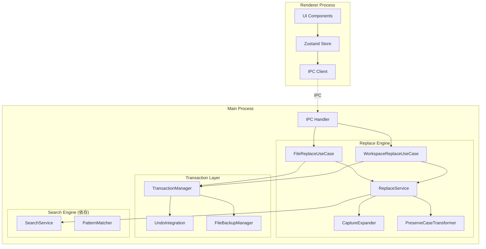
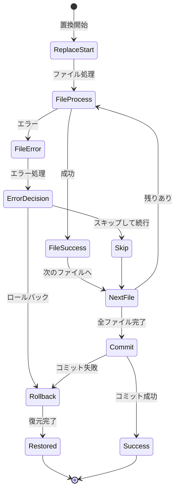

# T-01-6: 置換エンジンアーキテクチャ設計書

## メタ情報

| 項目             | 内容                                    |
| ---------------- | --------------------------------------- |
| サブタスクID     | T-01-6                                  |
| サブタスク名     | 置換エンジンアーキテクチャ設計          |
| 親タスクID       | TASK-SEARCH-REPLACE-001                 |
| フェーズ         | Phase 1: 設計                           |
| ステータス       | 完了                                    |
| 担当エージェント | @electron-architect                     |
| 作成日           | 2025-12-12                              |
| 参照要件定義書   | `task-step00-2`, `task-step00-4`        |
| 前提設計書       | `task-step01-5-search-engine-design.md` |

---

## 1. 設計概要

### 1.1 設計原則

| 原則               | 適用内容                                   |
| ------------------ | ------------------------------------------ |
| トランザクション   | 置換操作の原子性保証（全成功/全失敗）      |
| Undo 統合          | エディター Undo スタックとの完全連携       |
| Clean Architecture | 検索エンジンとの責務分離、依存関係の明確化 |
| 安全性優先         | 確認ダイアログ、プレビュー、バックアップ   |
| スケーラビリティ   | 大量ファイル一括置換のパフォーマンス確保   |

### 1.2 設計スコープ

- 置換エンジンコアアーキテクチャ
- トランザクション管理設計
- Undo/Redo 統合設計
- IPC チャネル設計（置換用）
- ワークスペース一括置換の並列処理
- エラーリカバリー設計

---

## 2. アーキテクチャ概要

### 2.1 レイヤー構成



### 2.2 ディレクトリ構造

```
apps/desktop/src/
├── main/
│   ├── ipc/
│   │   ├── replaceHandlers.ts       # 置換 IPC ハンドラー
│   │   └── replaceChannels.ts       # チャネル定義
│   ├── replace/
│   │   ├── index.ts
│   │   ├── ReplaceService.ts        # 置換サービス（コアロジック）
│   │   ├── FileReplaceUseCase.ts    # ファイル内置換ユースケース
│   │   ├── WorkspaceReplaceUseCase.ts # ワークスペース置換ユースケース
│   │   ├── CaptureExpander.ts       # 正規表現キャプチャ展開
│   │   ├── PreserveCaseTransformer.ts # 大文字小文字保持変換
│   │   └── ReplacePreviewGenerator.ts # プレビュー生成
│   ├── transaction/
│   │   ├── TransactionManager.ts    # トランザクション管理
│   │   ├── UndoIntegration.ts       # Undo/Redo 統合
│   │   ├── FileBackupManager.ts     # ファイルバックアップ
│   │   └── UndoGroup.ts             # Undo グループ定義
│   └── types/
│       └── replace.ts               # 置換関連型定義
├── renderer/
│   ├── hooks/
│   │   ├── useFileReplace.ts        # ファイル内置換 Hook
│   │   └── useWorkspaceReplace.ts   # ワークスペース置換 Hook
│   └── store/
│       └── slices/
│           └── replace/
│               ├── fileReplaceSlice.ts
│               └── workspaceReplaceSlice.ts
└── shared/
    └── types/
        └── replace.ts               # 共有型定義
```

---

## 3. IPC チャネル設計

### 3.1 チャネル定義

```typescript
// apps/desktop/src/main/ipc/replaceChannels.ts

export const REPLACE_CHANNELS = {
  // ファイル内置換
  FILE_REPLACE_SINGLE: "replace:file:single",
  FILE_REPLACE_ALL: "replace:file:all",
  FILE_REPLACE_PREVIEW: "replace:file:preview",

  // ワークスペース置換
  WORKSPACE_REPLACE: "replace:workspace:execute",
  WORKSPACE_REPLACE_CANCEL: "replace:workspace:cancel",
  WORKSPACE_REPLACE_PROGRESS: "replace:workspace:progress",
  WORKSPACE_REPLACE_FILE_RESULT: "replace:workspace:fileResult",

  // Undo/Redo
  UNDO_REPLACE: "replace:undo",
  REDO_REPLACE: "replace:redo",

  // 共通
  REPLACE_ERROR: "replace:error",
} as const;
```

### 3.2 IPC メッセージ型定義

```typescript
// apps/desktop/src/shared/types/replace.ts

// ========== ファイル内置換 ==========

export interface FileReplaceSingleRequest {
  requestId: string;
  /** ファイルパス */
  filePath: string;
  /** 置換対象のマッチ */
  match: SearchMatch;
  /** 置換文字列 */
  replaceString: string;
  /** 検索オプション */
  searchOptions: SearchOptions;
  /** 置換オプション */
  replaceOptions: ReplaceOptions;
}

export interface FileReplaceAllRequest {
  requestId: string;
  filePath: string;
  /** すべてのマッチ */
  matches: SearchMatch[];
  replaceString: string;
  searchOptions: SearchOptions;
  replaceOptions: ReplaceOptions;
}

export interface FileReplaceResponse {
  requestId: string;
  result: FileReplaceResult | null;
  error: ReplaceError | null;
}

export interface FileReplaceResult {
  /** 置換件数 */
  replacedCount: number;
  /** 実行時間（ms） */
  executionTime: number;
  /** Undo グループ ID */
  undoGroupId: string;
  /** 新しいファイル内容（オプション） */
  newContent?: string;
}

// ========== ワークスペース置換 ==========

export interface WorkspaceReplaceRequest {
  requestId: string;
  workspacePath: string;
  /** 検索クエリ（選択されたマッチのみ） */
  selectedMatches: SelectedMatchGroup[];
  replaceString: string;
  searchOptions: SearchOptions;
  replaceOptions: ReplaceOptions;
}

export interface SelectedMatchGroup {
  filePath: string;
  matches: SearchMatch[];
}

export interface WorkspaceReplaceProgress {
  requestId: string;
  /** 処理済みファイル数 */
  processedFiles: number;
  /** 総ファイル数 */
  totalFiles: number;
  /** 現在処理中のファイル */
  currentFile: string;
  /** 置換済みマッチ数 */
  replacedCount: number;
  /** エラー数 */
  errorCount: number;
}

export interface WorkspaceReplaceFileResult {
  requestId: string;
  filePath: string;
  status: "success" | "error" | "skipped";
  replacedCount: number;
  errorMessage?: string;
}

export interface WorkspaceReplaceFinalResult {
  requestId: string;
  summary: WorkspaceReplaceSummary;
  undoGroupId: string;
  isComplete: boolean;
}

export interface WorkspaceReplaceSummary {
  /** 置換されたファイル数 */
  replacedFileCount: number;
  /** 置換された総マッチ数 */
  totalReplacedCount: number;
  /** 処理時間（ms） */
  executionTime: number;
  /** スキップされたファイル */
  skippedFiles: SkippedFile[];
  /** エラーが発生したファイル */
  errorFiles: ErrorFile[];
}

// ========== 共通型 ==========

export interface ReplaceOptions {
  /** 大文字/小文字を保持 */
  preserveCase: boolean;
}

export interface ReplacePreviewRequest {
  /** 元テキスト */
  originalText: string;
  /** マッチ情報 */
  match: SearchMatch;
  /** 置換文字列 */
  replaceString: string;
  /** 検索オプション */
  searchOptions: SearchOptions;
  /** 置換オプション */
  replaceOptions: ReplaceOptions;
}

export interface ReplacePreview {
  /** 置換前テキスト */
  beforeText: string;
  /** 置換後テキスト */
  afterText: string;
  /** 差分情報 */
  diff: ReplaceDiff;
}

export interface ReplaceDiff {
  /** 削除部分 */
  removed: { start: number; end: number; text: string };
  /** 追加部分 */
  added: { start: number; text: string };
}

export interface ReplaceError {
  code: ReplaceErrorCode;
  message: string;
  details?: unknown;
}

export type ReplaceErrorCode =
  | "NO_MATCHES"
  | "FILE_NOT_FOUND"
  | "PERMISSION_DENIED"
  | "FILE_MODIFIED"
  | "UNDO_FAILED"
  | "TIMEOUT"
  | "CANCELLED"
  | "UNKNOWN";

export interface SkippedFile {
  filePath: string;
  reason: "unsaved_changes" | "read_only" | "external_change" | "user_excluded";
}

export interface ErrorFile {
  filePath: string;
  errorMessage: string;
}
```

---

## 4. 置換エンジンコア設計

### 4.1 ReplaceService 実装

```typescript
// apps/desktop/src/main/replace/ReplaceService.ts

import { PatternMatcher } from "../search/PatternMatcher";
import { CaptureExpander } from "./CaptureExpander";
import { PreserveCaseTransformer } from "./PreserveCaseTransformer";

export interface ReplaceResult {
  newContent: string;
  replacements: Replacement[];
}

export interface Replacement {
  originalStart: number;
  originalEnd: number;
  originalText: string;
  newText: string;
}

export class ReplaceService {
  private captureExpander = new CaptureExpander();
  private preserveCaseTransformer = new PreserveCaseTransformer();
  private patternMatcher: PatternMatcher;

  constructor(patternMatcher: PatternMatcher) {
    this.patternMatcher = patternMatcher;
  }

  /**
   * コンテンツ内の指定マッチを置換
   */
  replaceMatches(
    content: string,
    matches: SearchMatch[],
    replaceString: string,
    options: SearchOptions,
    replaceOptions: ReplaceOptions,
  ): ReplaceResult {
    // マッチを位置の降順でソート（後ろから置換することで位置ずれを防ぐ）
    const sortedMatches = [...matches].sort(
      (a, b) => this.getOffset(content, b) - this.getOffset(content, a),
    );

    const replacements: Replacement[] = [];
    let newContent = content;

    for (const match of sortedMatches) {
      const offset = this.getOffset(newContent, match);
      const originalText = newContent.slice(offset, offset + match.length);

      // 置換文字列を計算
      let finalReplaceString = replaceString;

      // 正規表現キャプチャグループ展開
      if (options.useRegex) {
        const pattern = this.patternMatcher.createPattern(match.text, options);
        finalReplaceString = this.captureExpander.expand(
          originalText,
          pattern,
          replaceString,
        );
      }

      // 大文字/小文字保持
      if (replaceOptions.preserveCase && !options.caseSensitive) {
        finalReplaceString = this.preserveCaseTransformer.transform(
          originalText,
          finalReplaceString,
        );
      }

      // 置換実行
      newContent =
        newContent.slice(0, offset) +
        finalReplaceString +
        newContent.slice(offset + match.length);

      replacements.push({
        originalStart: offset,
        originalEnd: offset + match.length,
        originalText,
        newText: finalReplaceString,
      });
    }

    // 置換順を元に戻す（先頭から順に）
    replacements.reverse();

    return { newContent, replacements };
  }

  /**
   * 単一マッチの置換
   */
  replaceSingle(
    content: string,
    match: SearchMatch,
    replaceString: string,
    options: SearchOptions,
    replaceOptions: ReplaceOptions,
  ): ReplaceResult {
    return this.replaceMatches(
      content,
      [match],
      replaceString,
      options,
      replaceOptions,
    );
  }

  /**
   * プレビュー生成
   */
  generatePreview(
    lineText: string,
    match: SearchMatch,
    replaceString: string,
    options: SearchOptions,
    replaceOptions: ReplaceOptions,
  ): ReplacePreview {
    const result = this.replaceSingle(
      lineText,
      { ...match, line: 1, column: match.column },
      replaceString,
      options,
      replaceOptions,
    );

    const replacement = result.replacements[0];

    return {
      beforeText: lineText,
      afterText: result.newContent,
      diff: {
        removed: {
          start: replacement.originalStart,
          end: replacement.originalEnd,
          text: replacement.originalText,
        },
        added: {
          start: replacement.originalStart,
          text: replacement.newText,
        },
      },
    };
  }

  private getOffset(content: string, match: SearchMatch): number {
    const lines = content.split("\n");
    let offset = 0;

    for (let i = 0; i < match.line - 1; i++) {
      offset += lines[i].length + 1; // +1 for newline
    }

    return offset + match.column - 1;
  }
}
```

### 4.2 CaptureExpander 実装

```typescript
// apps/desktop/src/main/replace/CaptureExpander.ts

export class CaptureExpander {
  /**
   * 正規表現キャプチャグループを展開
   */
  expand(matchedText: string, pattern: RegExp, replaceString: string): string {
    // パターンを実行してキャプチャグループを取得
    const match = pattern.exec(matchedText);

    if (!match) {
      return replaceString;
    }

    let result = replaceString;

    // $$ → $ (エスケープされた$)
    result = result.replace(/\$\$/g, "\x00DOLLAR\x00");

    // $0 → マッチ全体
    result = result.replace(/\$0/g, match[0]);

    // $1 〜 $9 → キャプチャグループ
    for (let i = 1; i <= 9; i++) {
      const groupValue = match[i] ?? "";
      result = result.replace(new RegExp(`\\$${i}`, "g"), groupValue);
    }

    // エスケープされた$を復元
    result = result.replace(/\x00DOLLAR\x00/g, "$");

    return result;
  }

  /**
   * 置換文字列にキャプチャ参照が含まれるかチェック
   */
  hasCaptures(replaceString: string): boolean {
    // $$ を除外して $0-$9 をチェック
    const withoutEscaped = replaceString.replace(/\$\$/g, "");
    return /\$[0-9]/.test(withoutEscaped);
  }
}
```

### 4.3 PreserveCaseTransformer 実装

```typescript
// apps/desktop/src/main/replace/PreserveCaseTransformer.ts

export class PreserveCaseTransformer {
  /**
   * 元テキストの大文字/小文字パターンを保持して変換
   */
  transform(originalText: string, replaceText: string): string {
    const casePattern = this.detectCasePattern(originalText);

    switch (casePattern) {
      case "all_upper":
        return replaceText.toUpperCase();

      case "all_lower":
        return replaceText.toLowerCase();

      case "first_upper":
        return this.capitalizeFirst(replaceText);

      case "mixed":
      default:
        return replaceText;
    }
  }

  private detectCasePattern(
    text: string,
  ): "all_upper" | "all_lower" | "first_upper" | "mixed" {
    if (text.length === 0) {
      return "mixed";
    }

    const hasLower = /[a-z]/.test(text);
    const hasUpper = /[A-Z]/.test(text);

    if (hasUpper && !hasLower) {
      return "all_upper";
    }

    if (hasLower && !hasUpper) {
      return "all_lower";
    }

    // 先頭のみ大文字かチェック
    if (/^[A-Z][a-z]*$/.test(text)) {
      return "first_upper";
    }

    return "mixed";
  }

  private capitalizeFirst(text: string): string {
    if (text.length === 0) {
      return text;
    }
    return text[0].toUpperCase() + text.slice(1).toLowerCase();
  }
}
```

---

## 5. トランザクション管理設計

### 5.1 TransactionManager 実装

```typescript
// apps/desktop/src/main/transaction/TransactionManager.ts

import { FileBackupManager } from "./FileBackupManager";
import { UndoIntegration } from "./UndoIntegration";

export interface Transaction {
  id: string;
  type: "file_replace" | "workspace_replace";
  status: "pending" | "committed" | "rolled_back";
  operations: TransactionOperation[];
  createdAt: number;
}

export interface TransactionOperation {
  filePath: string;
  originalContent: string;
  newContent: string;
  replacements: Replacement[];
}

export class TransactionManager {
  private backupManager = new FileBackupManager();
  private undoIntegration: UndoIntegration;
  private activeTransactions = new Map<string, Transaction>();

  constructor(undoIntegration: UndoIntegration) {
    this.undoIntegration = undoIntegration;
  }

  /**
   * トランザクションを開始
   */
  begin(type: "file_replace" | "workspace_replace"): Transaction {
    const transaction: Transaction = {
      id: crypto.randomUUID(),
      type,
      status: "pending",
      operations: [],
      createdAt: Date.now(),
    };

    this.activeTransactions.set(transaction.id, transaction);
    return transaction;
  }

  /**
   * 操作を追加
   */
  addOperation(transactionId: string, operation: TransactionOperation): void {
    const tx = this.activeTransactions.get(transactionId);
    if (!tx) {
      throw new Error(`Transaction ${transactionId} not found`);
    }

    if (tx.status !== "pending") {
      throw new Error(`Transaction ${transactionId} is not pending`);
    }

    // バックアップを作成
    this.backupManager.backup(operation.filePath, operation.originalContent);

    tx.operations.push(operation);
  }

  /**
   * トランザクションをコミット
   */
  async commit(transactionId: string): Promise<string> {
    const tx = this.activeTransactions.get(transactionId);
    if (!tx) {
      throw new Error(`Transaction ${transactionId} not found`);
    }

    try {
      // Undo グループを作成
      const undoGroupId = await this.undoIntegration.createUndoGroup(
        tx.operations,
        tx.type,
      );

      tx.status = "committed";

      // バックアップをクリア（成功したため）
      for (const op of tx.operations) {
        this.backupManager.clearBackup(op.filePath);
      }

      return undoGroupId;
    } catch (error) {
      // エラー時はロールバック
      await this.rollback(transactionId);
      throw error;
    } finally {
      this.activeTransactions.delete(transactionId);
    }
  }

  /**
   * トランザクションをロールバック
   */
  async rollback(transactionId: string): Promise<void> {
    const tx = this.activeTransactions.get(transactionId);
    if (!tx) {
      return;
    }

    // バックアップから復元
    for (const op of tx.operations) {
      const backup = this.backupManager.getBackup(op.filePath);
      if (backup) {
        // ファイルを元に戻す処理（Renderer 経由でエディターに通知）
        await this.restoreFile(op.filePath, backup);
      }
      this.backupManager.clearBackup(op.filePath);
    }

    tx.status = "rolled_back";
    this.activeTransactions.delete(transactionId);
  }

  private async restoreFile(filePath: string, content: string): Promise<void> {
    // Renderer プロセスに復元を通知
    // 実際の実装ではIPCを通じてエディターコンテンツを復元
  }
}
```

### 5.2 UndoIntegration 実装

```typescript
// apps/desktop/src/main/transaction/UndoIntegration.ts

import { BrowserWindow, ipcMain } from "electron";

export interface UndoGroup {
  id: string;
  type: "file_replace" | "workspace_replace";
  operations: UndoOperation[];
  createdAt: number;
}

export interface UndoOperation {
  filePath: string;
  beforeContent: string;
  afterContent: string;
}

export class UndoIntegration {
  private undoGroups = new Map<string, UndoGroup>();
  private mainWindow: BrowserWindow;

  constructor(mainWindow: BrowserWindow) {
    this.mainWindow = mainWindow;
  }

  /**
   * Undo グループを作成
   */
  async createUndoGroup(
    operations: TransactionOperation[],
    type: "file_replace" | "workspace_replace",
  ): Promise<string> {
    const undoGroup: UndoGroup = {
      id: crypto.randomUUID(),
      type,
      operations: operations.map((op) => ({
        filePath: op.filePath,
        beforeContent: op.originalContent,
        afterContent: op.newContent,
      })),
      createdAt: Date.now(),
    };

    this.undoGroups.set(undoGroup.id, undoGroup);

    // Renderer に Undo グループを登録
    this.mainWindow.webContents.send("undo:register-group", {
      groupId: undoGroup.id,
      type: undoGroup.type,
      fileCount: operations.length,
    });

    return undoGroup.id;
  }

  /**
   * Undo を実行
   */
  async undo(groupId: string): Promise<boolean> {
    const group = this.undoGroups.get(groupId);
    if (!group) {
      return false;
    }

    // 各ファイルを元に戻す
    for (const op of group.operations) {
      this.mainWindow.webContents.send("editor:set-content", {
        filePath: op.filePath,
        content: op.beforeContent,
        isUndo: true,
      });
    }

    // Redo 用に保持
    return true;
  }

  /**
   * Redo を実行
   */
  async redo(groupId: string): Promise<boolean> {
    const group = this.undoGroups.get(groupId);
    if (!group) {
      return false;
    }

    // 各ファイルを再適用
    for (const op of group.operations) {
      this.mainWindow.webContents.send("editor:set-content", {
        filePath: op.filePath,
        content: op.afterContent,
        isRedo: true,
      });
    }

    return true;
  }

  /**
   * Undo グループを削除（古いものをクリーンアップ）
   */
  cleanup(maxAge: number = 30 * 60 * 1000): void {
    const now = Date.now();
    for (const [id, group] of this.undoGroups) {
      if (now - group.createdAt > maxAge) {
        this.undoGroups.delete(id);
      }
    }
  }
}
```

### 5.3 FileBackupManager 実装

```typescript
// apps/desktop/src/main/transaction/FileBackupManager.ts

export class FileBackupManager {
  private backups = new Map<string, FileBackup>();
  private readonly MAX_BACKUP_SIZE = 100 * 1024 * 1024; // 100MB total
  private currentSize = 0;

  /**
   * ファイルをバックアップ
   */
  backup(filePath: string, content: string): void {
    const contentSize = Buffer.byteLength(content, "utf-8");

    // サイズ制限チェック
    if (this.currentSize + contentSize > this.MAX_BACKUP_SIZE) {
      this.evictOldest();
    }

    // 既存バックアップがあれば更新
    const existing = this.backups.get(filePath);
    if (existing) {
      this.currentSize -= existing.size;
    }

    this.backups.set(filePath, {
      content,
      size: contentSize,
      timestamp: Date.now(),
    });

    this.currentSize += contentSize;
  }

  /**
   * バックアップを取得
   */
  getBackup(filePath: string): string | null {
    const backup = this.backups.get(filePath);
    return backup?.content ?? null;
  }

  /**
   * バックアップをクリア
   */
  clearBackup(filePath: string): void {
    const backup = this.backups.get(filePath);
    if (backup) {
      this.currentSize -= backup.size;
      this.backups.delete(filePath);
    }
  }

  /**
   * 全バックアップをクリア
   */
  clearAll(): void {
    this.backups.clear();
    this.currentSize = 0;
  }

  private evictOldest(): void {
    let oldestPath: string | null = null;
    let oldestTime = Infinity;

    for (const [path, backup] of this.backups) {
      if (backup.timestamp < oldestTime) {
        oldestTime = backup.timestamp;
        oldestPath = path;
      }
    }

    if (oldestPath) {
      this.clearBackup(oldestPath);
    }
  }
}

interface FileBackup {
  content: string;
  size: number;
  timestamp: number;
}
```

---

## 6. ワークスペース置換 Use Case

### 6.1 WorkspaceReplaceUseCase 実装

```typescript
// apps/desktop/src/main/replace/WorkspaceReplaceUseCase.ts

import * as fs from "fs/promises";
import { ReplaceService } from "./ReplaceService";
import { TransactionManager } from "../transaction/TransactionManager";
import { FileReader } from "../search/FileReader";

export class WorkspaceReplaceUseCase {
  private replaceService: ReplaceService;
  private transactionManager: TransactionManager;
  private fileReader = new FileReader();
  private activeRequests = new Map<string, AbortController>();

  private readonly PARALLEL_FILE_LIMIT = 5;

  constructor(
    replaceService: ReplaceService,
    transactionManager: TransactionManager,
  ) {
    this.replaceService = replaceService;
    this.transactionManager = transactionManager;
  }

  async execute(
    request: WorkspaceReplaceRequest,
    onProgress: (progress: WorkspaceReplaceProgress) => void,
    onFileResult: (result: WorkspaceReplaceFileResult) => void,
  ): Promise<WorkspaceReplaceFinalResult> {
    const abortController = new AbortController();
    this.activeRequests.set(request.requestId, abortController);

    // トランザクション開始
    const transaction = this.transactionManager.begin("workspace_replace");

    try {
      const startTime = Date.now();
      let processedFiles = 0;
      let totalReplacedCount = 0;
      let errorCount = 0;
      const skippedFiles: SkippedFile[] = [];
      const errorFiles: ErrorFile[] = [];

      const totalFiles = request.selectedMatches.length;

      // 並列でファイルを処理
      const chunks = this.chunkArray(
        request.selectedMatches,
        this.PARALLEL_FILE_LIMIT,
      );

      for (const chunk of chunks) {
        if (abortController.signal.aborted) {
          break;
        }

        const results = await Promise.all(
          chunk.map((group) =>
            this.replaceInFile(
              group,
              request,
              transaction.id,
              abortController.signal,
            ),
          ),
        );

        for (const result of results) {
          processedFiles++;

          if (result.status === "success") {
            totalReplacedCount += result.replacedCount;
          } else if (result.status === "skipped") {
            skippedFiles.push({
              filePath: result.filePath,
              reason: result.skipReason!,
            });
          } else if (result.status === "error") {
            errorCount++;
            errorFiles.push({
              filePath: result.filePath,
              errorMessage: result.errorMessage!,
            });
          }

          // 進捗とファイル結果を通知
          onProgress({
            requestId: request.requestId,
            processedFiles,
            totalFiles,
            currentFile: result.filePath,
            replacedCount: totalReplacedCount,
            errorCount,
          });

          onFileResult({
            requestId: request.requestId,
            filePath: result.filePath,
            status: result.status,
            replacedCount: result.replacedCount,
            errorMessage: result.errorMessage,
          });
        }
      }

      // トランザクションコミット
      const undoGroupId = await this.transactionManager.commit(transaction.id);

      const executionTime = Date.now() - startTime;

      return {
        requestId: request.requestId,
        summary: {
          replacedFileCount:
            processedFiles - skippedFiles.length - errorFiles.length,
          totalReplacedCount,
          executionTime,
          skippedFiles,
          errorFiles,
        },
        undoGroupId,
        isComplete: !abortController.signal.aborted,
      };
    } catch (error) {
      // エラー時はロールバック
      await this.transactionManager.rollback(transaction.id);
      throw error;
    } finally {
      this.activeRequests.delete(request.requestId);
    }
  }

  cancel(requestId: string): void {
    const controller = this.activeRequests.get(requestId);
    if (controller) {
      controller.abort();
    }
  }

  private async replaceInFile(
    group: SelectedMatchGroup,
    request: WorkspaceReplaceRequest,
    transactionId: string,
    signal: AbortSignal,
  ): Promise<FileReplaceJobResult> {
    const fullPath = `${request.workspacePath}/${group.filePath}`;

    try {
      if (signal.aborted) {
        return {
          filePath: group.filePath,
          status: "skipped",
          replacedCount: 0,
          skipReason: "user_excluded",
        };
      }

      // ファイル読み込み
      const fileContent = await this.fileReader.readFile(fullPath);

      if (!fileContent) {
        return {
          filePath: group.filePath,
          status: "skipped",
          replacedCount: 0,
          skipReason: "read_only",
        };
      }

      // 置換実行
      const result = this.replaceService.replaceMatches(
        fileContent.content,
        group.matches,
        request.replaceString,
        request.searchOptions,
        request.replaceOptions,
      );

      // トランザクションに追加
      this.transactionManager.addOperation(transactionId, {
        filePath: fullPath,
        originalContent: fileContent.content,
        newContent: result.newContent,
        replacements: result.replacements,
      });

      // ファイルに書き込み
      await fs.writeFile(fullPath, result.newContent, "utf-8");

      return {
        filePath: group.filePath,
        status: "success",
        replacedCount: result.replacements.length,
      };
    } catch (error) {
      return {
        filePath: group.filePath,
        status: "error",
        replacedCount: 0,
        errorMessage: error instanceof Error ? error.message : String(error),
      };
    }
  }

  private chunkArray<T>(array: T[], size: number): T[][] {
    const chunks: T[][] = [];
    for (let i = 0; i < array.length; i += size) {
      chunks.push(array.slice(i, i + size));
    }
    return chunks;
  }
}

interface FileReplaceJobResult {
  filePath: string;
  status: "success" | "skipped" | "error";
  replacedCount: number;
  skipReason?: SkippedFile["reason"];
  errorMessage?: string;
}
```

---

## 7. IPC ハンドラー実装

```typescript
// apps/desktop/src/main/ipc/replaceHandlers.ts

import { ipcMain, BrowserWindow } from "electron";
import { REPLACE_CHANNELS } from "./replaceChannels";
import { FileReplaceUseCase } from "../replace/FileReplaceUseCase";
import { WorkspaceReplaceUseCase } from "../replace/WorkspaceReplaceUseCase";
import { UndoIntegration } from "../transaction/UndoIntegration";

export function registerReplaceHandlers(mainWindow: BrowserWindow): void {
  const undoIntegration = new UndoIntegration(mainWindow);
  const fileReplaceUseCase = new FileReplaceUseCase(undoIntegration);
  const workspaceReplaceUseCase = new WorkspaceReplaceUseCase(undoIntegration);

  // ファイル内単一置換
  ipcMain.handle(
    REPLACE_CHANNELS.FILE_REPLACE_SINGLE,
    async (_, request: FileReplaceSingleRequest) => {
      try {
        const result = await fileReplaceUseCase.replaceSingle(request);
        return { requestId: request.requestId, result, error: null };
      } catch (error) {
        return {
          requestId: request.requestId,
          result: null,
          error: toReplaceError(error),
        };
      }
    },
  );

  // ファイル内全置換
  ipcMain.handle(
    REPLACE_CHANNELS.FILE_REPLACE_ALL,
    async (_, request: FileReplaceAllRequest) => {
      try {
        const result = await fileReplaceUseCase.replaceAll(request);
        return { requestId: request.requestId, result, error: null };
      } catch (error) {
        return {
          requestId: request.requestId,
          result: null,
          error: toReplaceError(error),
        };
      }
    },
  );

  // プレビュー生成
  ipcMain.handle(
    REPLACE_CHANNELS.FILE_REPLACE_PREVIEW,
    async (_, request: ReplacePreviewRequest) => {
      try {
        const preview = fileReplaceUseCase.generatePreview(request);
        return { preview, error: null };
      } catch (error) {
        return { preview: null, error: toReplaceError(error) };
      }
    },
  );

  // ワークスペース置換
  ipcMain.handle(
    REPLACE_CHANNELS.WORKSPACE_REPLACE,
    async (_, request: WorkspaceReplaceRequest) => {
      try {
        const onProgress = (progress: WorkspaceReplaceProgress) => {
          mainWindow.webContents.send(
            REPLACE_CHANNELS.WORKSPACE_REPLACE_PROGRESS,
            progress,
          );
        };

        const onFileResult = (result: WorkspaceReplaceFileResult) => {
          mainWindow.webContents.send(
            REPLACE_CHANNELS.WORKSPACE_REPLACE_FILE_RESULT,
            result,
          );
        };

        const finalResult = await workspaceReplaceUseCase.execute(
          request,
          onProgress,
          onFileResult,
        );

        return { requestId: request.requestId, ...finalResult, error: null };
      } catch (error) {
        return {
          requestId: request.requestId,
          error: toReplaceError(error),
        };
      }
    },
  );

  // ワークスペース置換キャンセル
  ipcMain.on(
    REPLACE_CHANNELS.WORKSPACE_REPLACE_CANCEL,
    (_, requestId: string) => {
      workspaceReplaceUseCase.cancel(requestId);
    },
  );

  // Undo
  ipcMain.handle(REPLACE_CHANNELS.UNDO_REPLACE, async (_, groupId: string) => {
    return undoIntegration.undo(groupId);
  });

  // Redo
  ipcMain.handle(REPLACE_CHANNELS.REDO_REPLACE, async (_, groupId: string) => {
    return undoIntegration.redo(groupId);
  });
}

function toReplaceError(error: unknown): ReplaceError {
  if (error instanceof Error) {
    if (error.message.includes("ENOENT")) {
      return { code: "FILE_NOT_FOUND", message: "File not found" };
    }
    if (error.message.includes("EACCES") || error.message.includes("EPERM")) {
      return { code: "PERMISSION_DENIED", message: "Permission denied" };
    }
    if (error.name === "AbortError") {
      return { code: "CANCELLED", message: "Replace cancelled" };
    }
  }

  return {
    code: "UNKNOWN",
    message: error instanceof Error ? error.message : String(error),
  };
}
```

---

## 8. Renderer 側 Hook 実装

### 8.1 useFileReplace Hook

```typescript
// apps/desktop/src/renderer/hooks/useFileReplace.ts

import { useState, useCallback, useRef } from "react";
import { useReplaceStore } from "../store/slices/replace/fileReplaceSlice";

export function useFileReplace() {
  const [isReplacing, setIsReplacing] = useState(false);
  const lastUndoGroupIdRef = useRef<string | null>(null);
  const { setResult, setError, clearResult } = useReplaceStore();

  const replaceSingle = useCallback(
    async (
      filePath: string,
      match: SearchMatch,
      replaceString: string,
      searchOptions: SearchOptions,
      replaceOptions: ReplaceOptions,
    ) => {
      const requestId = crypto.randomUUID();
      setIsReplacing(true);

      try {
        const response = await window.api.replace.fileSingle({
          requestId,
          filePath,
          match,
          replaceString,
          searchOptions,
          replaceOptions,
        });

        if (response.error) {
          setError(response.error);
        } else {
          setResult(response.result);
          lastUndoGroupIdRef.current = response.result?.undoGroupId ?? null;
        }
      } catch (error) {
        setError({ code: "UNKNOWN", message: String(error) });
      } finally {
        setIsReplacing(false);
      }
    },
    [setResult, setError],
  );

  const replaceAll = useCallback(
    async (
      filePath: string,
      matches: SearchMatch[],
      replaceString: string,
      searchOptions: SearchOptions,
      replaceOptions: ReplaceOptions,
    ) => {
      const requestId = crypto.randomUUID();
      setIsReplacing(true);

      try {
        const response = await window.api.replace.fileAll({
          requestId,
          filePath,
          matches,
          replaceString,
          searchOptions,
          replaceOptions,
        });

        if (response.error) {
          setError(response.error);
        } else {
          setResult(response.result);
          lastUndoGroupIdRef.current = response.result?.undoGroupId ?? null;
        }
      } catch (error) {
        setError({ code: "UNKNOWN", message: String(error) });
      } finally {
        setIsReplacing(false);
      }
    },
    [setResult, setError],
  );

  const undo = useCallback(async () => {
    if (!lastUndoGroupIdRef.current) {
      return false;
    }
    return window.api.replace.undo(lastUndoGroupIdRef.current);
  }, []);

  const redo = useCallback(async () => {
    if (!lastUndoGroupIdRef.current) {
      return false;
    }
    return window.api.replace.redo(lastUndoGroupIdRef.current);
  }, []);

  return {
    replaceSingle,
    replaceAll,
    undo,
    redo,
    isReplacing,
  };
}
```

---

## 9. エラーリカバリー設計

### 9.1 エラーリカバリーフロー



### 9.2 エラーハンドリング戦略

| エラー種別             | 戦略                                     |
| ---------------------- | ---------------------------------------- |
| ファイル読み込みエラー | スキップして継続、最後にサマリー報告     |
| ファイル書き込みエラー | スキップして継続、バックアップ保持       |
| メモリ不足             | 即座に中断、処理済みファイルは保持       |
| ユーザーキャンセル     | 即座に中断、処理済みファイルは Undo 可能 |
| トランザクションエラー | 全ファイルをロールバック                 |

---

## 10. パフォーマンス最適化

### 10.1 最適化手法

| 最適化手法             | 適用箇所                | 期待効果             |
| ---------------------- | ----------------------- | -------------------- |
| 並列ファイル処理       | ワークスペース置換      | 処理時間 50-70% 短縮 |
| バッチ書き込み         | 大量マッチ置換          | I/O 負荷軽減         |
| インメモリバックアップ | TransactionManager      | ディスクI/O 削減     |
| プレビューキャッシュ   | ReplacePreviewGenerator | 再計算コスト削減     |
| 遅延Undoグループ作成   | UndoIntegration         | メモリ使用量削減     |

### 10.2 メモリ管理

```typescript
// メモリ使用量の監視と制限
const MEMORY_LIMIT = 500 * 1024 * 1024; // 500MB

function checkMemoryUsage(): boolean {
  const usage = process.memoryUsage();
  return usage.heapUsed < MEMORY_LIMIT;
}
```

---

## 11. 完了条件チェックリスト

- [x] トランザクション管理設計が完了している
- [x] Undo/Redo との統合設計が完了している
- [x] 正規表現キャプチャグループ展開が設計されている
- [x] 大文字/小文字保持機能が設計されている
- [x] ワークスペース一括置換の並列処理が設計されている
- [x] エラーリカバリー設計が完了している
- [x] IPC チャネル設計が完了している
- [x] バックアップ管理が設計されている

---

## 12. 参照ドキュメント

- `docs/30-workflows/search-replace/task-step00-2-file-replace-requirements.md`
- `docs/30-workflows/search-replace/task-step00-4-workspace-replace-requirements.md`
- `docs/30-workflows/search-replace/task-step01-5-search-engine-design.md`
- [Electron IPC Documentation](https://www.electronjs.org/docs/latest/tutorial/ipc)

---

## 13. 変更履歴

| 日付       | 版  | 変更内容 | 担当                |
| ---------- | --- | -------- | ------------------- |
| 2025-12-12 | 1.0 | 初版作成 | @electron-architect |
