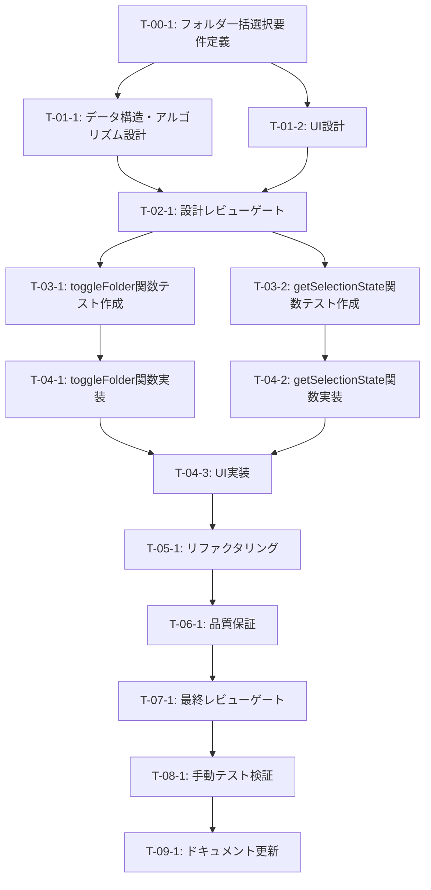

# フォルダ一括選択機能 - タスク実行仕様書

## ユーザーからの元の指示

```
@docs/30-workflows/unassigned-task/task-01-selectable-directory-tree.md のタスクを実行するために、
次のプロンプトを使ってタスク仕様書を作成してください。
タスク仕様書のみ作成して、次のステップには移らないようにしてほしいです。
タスク仕様書は指定のフォーマットに従って作成するようにしてください。
.kamui/prompt/custom-prompt.txt
```

## メタ情報

| 項目             | 内容                                       |
| ---------------- | ------------------------------------------ |
| タスクID         | TASK-DT-001                                |
| タスク名         | フォルダ一括選択機能                       |
| 分類             | 機能拡張                                   |
| 対象機能         | WorkspaceFileSelector                      |
| 優先度           | 低                                         |
| 見積もり規模     | 小規模                                     |
| ステータス       | 未実施                                     |
| 発見元           | Phase 1: 設計（file-selector-integration） |
| 発見日           | 2025-12-16                                 |
| 更新日           | 2025-12-18                                 |
| 発見エージェント | @arch-police                               |

---

## タスク概要

### 目的

WorkspaceFileSelectorにフォルダ一括選択機能を追加し、ユーザーがフォルダをクリックするだけで配下の全ファイルを選択できるようにする。これにより、大量ファイル選択時の操作効率を大幅に向上させる。

### 背景

WorkspaceFileSelectorの基本実装が完了し、ファイルの個別選択が可能になった。しかし、フォルダをクリックして配下の全ファイルを一括選択する機能が未実装のため、大量ファイルの選択時にユーザーの操作負担が大きい。RAGデータ変換など、複数ファイルを扱うワークフローにおいて、この機能は必須である。

### 最終ゴール

- フォルダクリックで配下の全ファイルが自動選択される
- 部分選択状態（indeterminate）がチェックボックスで視覚的に表現される
- 再クリックで配下ファイルの選択が全解除される
- 既存の個別ファイル選択機能との共存

### 成果物一覧

| 種別         | 成果物                            | 配置先                                                                      |
| ------------ | --------------------------------- | --------------------------------------------------------------------------- |
| 修正         | SelectableFileTreeItem.tsx        | apps/desktop/src/renderer/components/organisms/WorkspaceFileSelector/       |
| 修正         | useWorkspaceFileSelection.ts      | apps/desktop/src/renderer/components/organisms/WorkspaceFileSelector/hooks/ |
| テスト       | SelectableFileTreeItem.test.tsx   | apps/desktop/src/renderer/components/organisms/WorkspaceFileSelector/       |
| テスト       | useWorkspaceFileSelection.test.ts | apps/desktop/src/renderer/components/organisms/WorkspaceFileSelector/hooks/ |
| 品質         | テストカバレッジレポート          | coverage/                                                                   |
| ドキュメント | 16-ui-ux-guidelines.md（更新）    | docs/00-requirements/                                                       |

---

## 参照ファイル

本仕様書のコマンド・エージェント・スキル選定は以下を参照：

- `docs/00-requirements/master_system_design.md` - システム要件
- `.claude/commands/ai/command_list.md` - /ai:コマンド定義
- `.claude/agents/agent_list.md` - エージェント定義
- `.claude/skills/skill_list.md` - スキル定義

---

## タスク分解サマリー

| ID     | フェーズ                       | サブタスク名                            | 責務                                                | 依存           |
| ------ | ------------------------------ | --------------------------------------- | --------------------------------------------------- | -------------- |
| T-00-1 | Phase 0: 要件定義              | フォルダ一括選択要件定義                | 機能要件・UI/UX要件の明確化                         | なし           |
| T-01-1 | Phase 1: 設計                  | データ構造・アルゴリズム設計            | toggleFolder関数とindeterminate状態計算ロジック設計 | T-00-1         |
| T-01-2 | Phase 1: 設計                  | UI設計（チェックボックスindeterminate） | チェックボックス3状態の視覚的表現設計               | T-00-1         |
| T-02-1 | Phase 2: 設計レビューゲート    | 要件・設計レビュー                      | 要件充足性・UI/UX妥当性の検証                       | T-01-1, T-01-2 |
| T-03-1 | Phase 3: テスト作成 (TDD: Red) | toggleFolder関数テスト作成              | フォルダ一括選択・解除のテストケース作成            | T-02-1         |
| T-03-2 | Phase 3: テスト作成 (TDD: Red) | getSelectionState関数テスト作成         | 選択状態判定のテストケース作成                      | T-02-1         |
| T-04-1 | Phase 4: 実装 (TDD: Green)     | toggleFolder関数実装                    | フォルダ配下ファイル一括選択・解除ロジック実装      | T-03-1         |
| T-04-2 | Phase 4: 実装 (TDD: Green)     | getSelectionState関数実装               | 選択状態計算ロジック実装                            | T-03-2         |
| T-04-3 | Phase 4: 実装 (TDD: Green)     | UI実装（indeterminateチェックボックス） | チェックボックスindeterminate状態の実装             | T-04-1, T-04-2 |
| T-05-1 | Phase 5: リファクタリング      | コード品質改善                          | 可読性向上・パフォーマンス最適化                    | T-04-3         |
| T-06-1 | Phase 6: 品質保証              | テスト実行・カバレッジ検証              | テスト網羅性確認・品質ゲート通過                    | T-05-1         |
| T-07-1 | Phase 7: 最終レビューゲート    | 実装品質レビュー                        | コード品質・UI/UX・アクセシビリティ検証             | T-06-1         |
| T-08-1 | Phase 8: 手動テスト検証        | 機能テスト・UI/UXテスト                 | 実際のユーザー操作での動作確認                      | T-07-1         |
| T-09-1 | Phase 9: ドキュメント更新      | UI/UXガイドライン更新                   | フォルダ一括選択機能の説明追加                      | T-08-1         |

**総サブタスク数**: 13個

---

## 実行フロー図



---

## Phase 0: 要件定義

### T-00-1: フォルダ一括選択要件定義

#### 目的

フォルダ一括選択機能の機能要件・非機能要件・UI/UX要件を明確に定義し、実装の指針を確立する。

#### 背景

WorkspaceFileSelectorはファイル個別選択が可能だが、フォルダ内の大量ファイルを選択する際の操作効率が低い。フォルダをクリックするだけで配下ファイルを一括選択できる機能が必要。

#### 責務（単一責務）

フォルダ一括選択機能の要件を明確化し、機能スコープと受け入れ基準を定義する。

#### Claude Code スラッシュコマンド

> ⚠️ 以下はターミナルコマンドではなく、Claude Code内で実行するスラッシュコマンドです

```
/ai:gather-requirements フォルダ一括選択機能
```

- **参照**: `.claude/commands/ai/command_list.md`

#### 使用エージェント

- **エージェント**: @req-analyst
- **選定理由**: 要件工学の専門家として、機能要件と非機能要件を明確に定義し、曖昧性を排除できる
- **参照**: `.claude/agents/agent_list.md`

#### 活用スキル

| スキル名                               | 活用方法                                           |
| -------------------------------------- | -------------------------------------------------- |
| requirements-engineering               | 機能要件・非機能要件の構造化定義、MoSCoW優先度付け |
| acceptance-criteria-writing            | Given-When-Then形式での受け入れ基準明確化          |
| functional-non-functional-requirements | FR/NFR分類、測定可能な目標定義                     |

- **参照**: `.claude/skills/skill_list.md`

#### 成果物

| 成果物               | パス                                                                    | 内容                                      |
| -------------------- | ----------------------------------------------------------------------- | ----------------------------------------- |
| 要件定義ドキュメント | docs/30-workflows/selectable-directory-tree/task-step01-requirements.md | 機能要件・非機能要件・UI/UX要件の詳細定義 |

#### 完了条件

- [ ] 機能要件（フォルダ一括選択・解除、indeterminate状態表示）が明確に定義されている
- [ ] 非機能要件（パフォーマンス、アクセシビリティ）が定義されている
- [ ] UI/UX要件（チェックボックス3状態の視覚表現）が定義されている
- [ ] 受け入れ基準がGiven-When-Then形式で記述されている
- [ ] スコープ（含む/含まない）が明記されている

#### 依存関係

- **前提**: なし
- **後続**: T-01-1（データ構造・アルゴリズム設計）, T-01-2（UI設計）

---

## Phase 1: 設計

### T-01-1: データ構造・アルゴリズム設計

#### 目的

toggleFolder関数とgetSelectionState関数のアルゴリズムを設計し、効率的なフォルダ一括選択ロジックを確立する。

#### 背景

フォルダ配下のファイルを再帰的に取得し、選択状態を効率的に管理するアルゴリズムが必要。

#### 責務（単一責務）

フォルダ一括選択のアルゴリズムとデータ構造を設計する。

#### Claude Code スラッシュコマンド

> ⚠️ 以下はターミナルコマンドではなく、Claude Code内で実行するスラッシュコマンドです

```
/ai:design-architecture clean
```

- **参照**: `.claude/commands/ai/command_list.md`

#### 使用エージェント

- **エージェント**: @arch-police
- **選定理由**: クリーンアーキテクチャ準拠の設計と、既存useWorkspaceFileSelectionとの整合性確保
- **参照**: `.claude/agents/agent_list.md`

#### 活用スキル

| スキル名                      | 活用方法                                     |
| ----------------------------- | -------------------------------------------- |
| clean-architecture-principles | 依存関係ルール遵守、レイヤー構造の適切な配置 |
| refactoring-techniques        | 既存コードとの統合、重複排除                 |
| solid-principles              | SRP（単一責務原則）に基づいた関数設計        |

- **参照**: `.claude/skills/skill_list.md`

#### 成果物

| 成果物             | パス                                                                        | 内容                                                 |
| ------------------ | --------------------------------------------------------------------------- | ---------------------------------------------------- |
| アルゴリズム設計書 | docs/30-workflows/selectable-directory-tree/task-step02-algorithm-design.md | toggleFolder/getSelectionState関数のアルゴリズム詳細 |

#### 完了条件

- [ ] getAllFilesInFolderヘルパー関数の再帰アルゴリズムが定義されている
- [ ] toggleFolder関数のロジック（全選択/全解除判定）が設計されている
- [ ] getSelectionState関数の状態計算ロジック（unselected/indeterminate/selected）が設計されている
- [ ] パフォーマンス考慮（setState呼び出し回数の最適化）が含まれている
- [ ] 既存のtoggleFile/removeFile関数との整合性が確保されている

#### 依存関係

- **前提**: T-00-1（要件定義）
- **後続**: T-02-1（設計レビューゲート）

---

### T-01-2: UI設計（チェックボックスindeterminate）

#### 目的

チェックボックスのindeterminate状態を視覚的に表現するUI設計を確立する。

#### 背景

フォルダの選択状態（未選択/部分選択/全選択）をユーザーが直感的に理解できるUIが必要。

#### 責務（単一責務）

チェックボックス3状態の視覚的表現とアクセシビリティを設計する。

#### Claude Code スラッシュコマンド

> ⚠️ 以下はターミナルコマンドではなく、Claude Code内で実行するスラッシュコマンドです

```
/ai:create-component SelectableFileTreeItem atom
```

- **参照**: `.claude/commands/ai/command_list.md`

#### 使用エージェント

- **エージェント**: @ui-designer
- **選定理由**: モジュラー設計原則とWCAGアクセシビリティ基準を満たすUI設計の専門家
- **参照**: `.claude/agents/agent_list.md`

#### 活用スキル

| スキル名                   | 活用方法                                          |
| -------------------------- | ------------------------------------------------- |
| accessibility-wcag         | WCAG 2.1 AA準拠、ARIAパターン、キーボード操作対応 |
| apple-hig-guidelines       | macOS HIG準拠のチェックボックスデザイン           |
| design-system-architecture | デザイントークン活用、一貫性のある視覚表現        |

- **参照**: `.claude/skills/skill_list.md`

#### 成果物

| 成果物   | パス                                                                 | 内容                                            |
| -------- | -------------------------------------------------------------------- | ----------------------------------------------- |
| UI設計書 | docs/30-workflows/selectable-directory-tree/task-step03-ui-design.md | チェックボックスindeterminate状態の視覚デザイン |

#### 完了条件

- [ ] チェックボックス3状態（☐/☑/☑ indeterminate）の視覚的表現が定義されている
- [ ] indeterminate状態のCSS/スタイル設計が完了している
- [ ] ARIA属性（aria-checked="mixed"）の設定が定義されている
- [ ] キーボード操作（Space/Enterキー）での動作が設計されている
- [ ] デザイントークンとの整合性が確保されている

#### 依存関係

- **前提**: T-00-1（要件定義）
- **後続**: T-02-1（設計レビューゲート）

---

## Phase 2: 設計レビューゲート

### T-02-1: 要件・設計レビュー

#### 目的

実装開始前に要件定義と設計の妥当性を複数の専門エージェントで検証し、問題を早期発見する。

#### 背景

設計ミスが実装後に発見されると修正コストが大幅に増加する。「Shift Left」原則に基づき、問題を可能な限り早期に検出する。

#### レビュー参加エージェント

| エージェント | レビュー観点         | 選定理由                                                         |
| ------------ | -------------------- | ---------------------------------------------------------------- |
| @req-analyst | 要件充足性           | 要件が明確かつ検証可能か、スコープが適切に定義されているか       |
| @arch-police | アーキテクチャ整合性 | 既存useWorkspaceFileSelectionとの依存関係、レイヤー違反の有無    |
| @ui-designer | UI/UX設計            | アクセシビリティ考慮、デザインシステムとの整合性、ユーザビリティ |

- **参照**: `.claude/agents/agent_list.md`

#### レビューチェックリスト

**要件充足性** (@req-analyst)

- [ ] 機能要件が明確かつ検証可能である
- [ ] 非機能要件（パフォーマンス、アクセシビリティ）が具体的である
- [ ] 受け入れ基準がGiven-When-Then形式で明確である
- [ ] スコープ（含む/含まない）が適切に定義されている

**アーキテクチャ整合性** (@arch-police)

- [ ] 既存のuseWorkspaceFileSelectionフックとの依存関係が適切である
- [ ] 単一責務原則（SRP）に従った関数設計である
- [ ] setState呼び出し回数が最適化されている（パフォーマンス考慮）
- [ ] クリーンアーキテクチャのレイヤー違反がない

**UI/UX設計** (@ui-designer)

- [ ] WCAG 2.1 AA基準を満たすアクセシビリティ設計である
- [ ] チェックボックスindeterminate状態が直感的に理解できる
- [ ] キーボード操作が適切にサポートされている
- [ ] デザインシステム（デザイントークン）と整合性がある

#### レビュー結果

- **判定**: （レビュー実施後に記入）
- **指摘事項**: （レビュー実施後に記入）
- **対応方針**: （レビュー実施後に記入）

#### 戻り先決定（MAJORの場合）

| 問題の種類             | 戻り先                |
| ---------------------- | --------------------- |
| 要件の問題             | Phase 0（要件定義）   |
| アルゴリズム設計の問題 | Phase 1（設計）T-01-1 |
| UI設計の問題           | Phase 1（設計）T-01-2 |

#### 完了条件

- [ ] 全レビュー観点でPASSまたはMINOR判定
- [ ] MINOR指摘事項がすべて対応済み
- [ ] レビュー結果が文書化されている

#### 依存関係

- **前提**: T-01-1（アルゴリズム設計）, T-01-2（UI設計）
- **後続**: T-03-1（toggleFolder関数テスト作成）, T-03-2（getSelectionState関数テスト作成）

---

## Phase 3: テスト作成 (TDD: Red)

### T-03-1: toggleFolder関数テスト作成

#### 目的

toggleFolder関数の期待される動作を検証するテストを実装より先に作成する（TDD Red）。

#### 背景

テストファーストにより、実装が要件を満たすことを保証し、リグレッションを防ぐ。

#### 責務（単一責務）

toggleFolder関数のテストケース作成（一括選択・一括解除・境界値）。

#### Claude Code スラッシュコマンド

> ⚠️ 以下はターミナルコマンドではなく、Claude Code内で実行するスラッシュコマンドです

```
/ai:generate-unit-tests apps/desktop/src/renderer/components/organisms/WorkspaceFileSelector/hooks/useWorkspaceFileSelection.ts
```

- **参照**: `.claude/commands/ai/command_list.md`

#### 使用エージェント

- **エージェント**: @unit-tester
- **選定理由**: TDD原則に基づいたテスト設計の専門家、境界値分析・等価分割の実践
- **参照**: `.claude/agents/agent_list.md`

#### 活用スキル

| スキル名                | 活用方法                                                     |
| ----------------------- | ------------------------------------------------------------ |
| tdd-principles          | Red-Green-Refactorサイクル、テストファースト                 |
| boundary-value-analysis | エッジケース網羅（空フォルダ、ネストフォルダ、大量ファイル） |
| test-doubles            | モック・スタブの適切な使い分け                               |

- **参照**: `.claude/skills/skill_list.md`

#### 成果物

| 成果物         | パス                                                                                                         | 内容                           |
| -------------- | ------------------------------------------------------------------------------------------------------------ | ------------------------------ |
| ユニットテスト | apps/desktop/src/renderer/components/organisms/WorkspaceFileSelector/hooks/useWorkspaceFileSelection.test.ts | toggleFolder関数のテストケース |

#### TDD検証: Red状態確認

```bash
pnpm --filter @repo/desktop test:run useWorkspaceFileSelection
```

- [ ] テストが失敗することを確認（Red状態）

#### 完了条件

- [ ] フォルダクリックで配下の全ファイルが選択されるテストが作成されている
- [ ] 選択済みフォルダ再クリックで配下ファイルが全解除されるテストが作成されている
- [ ] 空フォルダのテストケースが含まれている
- [ ] ネストフォルダ（深い階層）のテストケースが含まれている
- [ ] テストがRed状態（失敗）で実行される

#### 依存関係

- **前提**: T-02-1（設計レビューゲート）
- **後続**: T-04-1（toggleFolder関数実装）

---

### T-03-2: getSelectionState関数テスト作成

#### 目的

getSelectionState関数の選択状態判定ロジックを検証するテストを作成する（TDD Red）。

#### 背景

フォルダの選択状態（未選択/部分選択/全選択）を正確に判定するロジックの正しさを保証する。

#### 責務（単一責務）

getSelectionState関数のテストケース作成（3つの選択状態の判定）。

#### Claude Code スラッシュコマンド

> ⚠️ 以下はターミナルコマンドではなく、Claude Code内で実行するスラッシュコマンドです

```
/ai:generate-unit-tests apps/desktop/src/renderer/components/organisms/WorkspaceFileSelector/hooks/useWorkspaceFileSelection.ts
```

- **参照**: `.claude/commands/ai/command_list.md`

#### 使用エージェント

- **エージェント**: @unit-tester
- **選定理由**: 状態遷移テスト、境界値分析の専門家
- **参照**: `.claude/agents/agent_list.md`

#### 活用スキル

| スキル名                | 活用方法                                             |
| ----------------------- | ---------------------------------------------------- |
| tdd-principles          | テストファースト、小さなステップでの実装             |
| boundary-value-analysis | 境界値テスト（0ファイル、1ファイル、全ファイル選択） |
| test-naming-conventions | Should形式での明確なテスト名                         |

- **参照**: `.claude/skills/skill_list.md`

#### 成果物

| 成果物         | パス                                                                                                         | 内容                                |
| -------------- | ------------------------------------------------------------------------------------------------------------ | ----------------------------------- |
| ユニットテスト | apps/desktop/src/renderer/components/organisms/WorkspaceFileSelector/hooks/useWorkspaceFileSelection.test.ts | getSelectionState関数のテストケース |

#### TDD検証: Red状態確認

```bash
pnpm --filter @repo/desktop test:run useWorkspaceFileSelection
```

- [ ] テストが失敗することを確認（Red状態）

#### 完了条件

- [ ] 全ファイル選択時に"selected"を返すテストが作成されている
- [ ] 一部ファイル選択時に"indeterminate"を返すテストが作成されている
- [ ] 未選択時に"unselected"を返すテストが作成されている
- [ ] 空フォルダ（0ファイル）のテストケースが含まれている
- [ ] テストがRed状態（失敗）で実行される

#### 依存関係

- **前提**: T-02-1（設計レビューゲート）
- **後続**: T-04-2（getSelectionState関数実装）

---

## Phase 4: 実装 (TDD: Green)

### T-04-1: toggleFolder関数実装

#### 目的

フォルダ配下の全ファイルを一括選択・解除する関数を実装し、テストをGreen状態にする。

#### 背景

再帰的にフォルダ配下のファイルを取得し、既存のtoggleFile/removeFile関数を活用して選択状態を管理する。

#### 責務（単一責務）

toggleFolder関数とgetAllFilesInFolderヘルパー関数の実装。

#### Claude Code スラッシュコマンド

> ⚠️ 以下はターミナルコマンドではなく、Claude Code内で実行するスラッシュコマンドです

```
/ai:implement-business-logic toggleFolder
```

- **参照**: `.claude/commands/ai/command_list.md`

#### 使用エージェント

- **エージェント**: @logic-dev
- **選定理由**: ビジネスロジック実装の専門家、TDD準拠の実装
- **参照**: `.claude/agents/agent_list.md`

#### 活用スキル

| スキル名               | 活用方法                                  |
| ---------------------- | ----------------------------------------- |
| tdd-red-green-refactor | Greenフェーズの実装、最小限のコードで実装 |
| clean-code-practices   | 意味のある命名、小さな関数、DRY原則       |
| react-hooks-advanced   | useCallbackの適切な使用、依存配列の管理   |

- **参照**: `.claude/skills/skill_list.md`

#### 成果物

| 成果物     | パス                                                                                                    | 内容                                 |
| ---------- | ------------------------------------------------------------------------------------------------------- | ------------------------------------ |
| 実装コード | apps/desktop/src/renderer/components/organisms/WorkspaceFileSelector/hooks/useWorkspaceFileSelection.ts | toggleFolder/getAllFilesInFolder関数 |

#### TDD検証: Green状態確認

```bash
pnpm --filter @repo/desktop test:run useWorkspaceFileSelection
```

- [ ] テストが成功することを確認（Green状態）

#### 完了条件

- [ ] getAllFilesInFolder関数が再帰的にファイルを取得している
- [ ] toggleFolder関数が全選択/全解除を正しく判定している
- [ ] 既存のtoggleFile/removeFile関数を活用している
- [ ] useCallbackで適切にメモ化されている
- [ ] テストがGreen状態（成功）で実行される

#### 依存関係

- **前提**: T-03-1（toggleFolder関数テスト作成）
- **後続**: T-04-3（UI実装）

---

### T-04-2: getSelectionState関数実装

#### 目的

フォルダの選択状態（未選択/部分選択/全選択）を計算する関数を実装し、テストをGreen状態にする。

#### 背景

フォルダ配下のファイルの選択状態を集計し、UIに反映するための状態を返す。

#### 責務（単一責務）

getSelectionState関数の実装。

#### Claude Code スラッシュコマンド

> ⚠️ 以下はターミナルコマンドではなく、Claude Code内で実行するスラッシュコマンドです

```
/ai:implement-business-logic getSelectionState
```

- **参照**: `.claude/commands/ai/command_list.md`

#### 使用エージェント

- **エージェント**: @logic-dev
- **選定理由**: 状態計算ロジックの実装専門家
- **参照**: `.claude/agents/agent_list.md`

#### 活用スキル

| スキル名               | 活用方法                           |
| ---------------------- | ---------------------------------- |
| tdd-red-green-refactor | Greenフェーズの実装                |
| clean-code-practices   | 早期リターン、可読性の高い条件分岐 |
| react-hooks-advanced   | useCallbackの依存配列最適化        |

- **参照**: `.claude/skills/skill_list.md`

#### 成果物

| 成果物     | パス                                                                                                    | 内容                  |
| ---------- | ------------------------------------------------------------------------------------------------------- | --------------------- |
| 実装コード | apps/desktop/src/renderer/components/organisms/WorkspaceFileSelector/hooks/useWorkspaceFileSelection.ts | getSelectionState関数 |

#### TDD検証: Green状態確認

```bash
pnpm --filter @repo/desktop test:run useWorkspaceFileSelection
```

- [ ] テストが成功することを確認（Green状態）

#### 完了条件

- [ ] getAllFilesInFolder関数を活用して配下ファイルを取得している
- [ ] selectedCountに基づいて正しい状態（unselected/indeterminate/selected）を返している
- [ ] 空フォルダ（0ファイル）のケースが適切に処理されている
- [ ] useCallbackで適切にメモ化されている
- [ ] テストがGreen状態（成功）で実行される

#### 依存関係

- **前提**: T-03-2（getSelectionState関数テスト作成）
- **後続**: T-04-3（UI実装）

---

### T-04-3: UI実装（indeterminateチェックボックス）

#### 目的

SelectableFileTreeItemコンポーネントにindeterminate状態のチェックボックスUIを実装する。

#### 背景

フォルダの選択状態を視覚的に表現し、ユーザーが直感的に理解できるUIを提供する。

#### 責務（単一責務）

チェックボックスindeterminate状態の実装とフォルダクリック時のtoggleFolderハンドラー実装。

#### Claude Code スラッシュコマンド

> ⚠️ 以下はターミナルコマンドではなく、Claude Code内で実行するスラッシュコマンドです

```
/ai:create-component SelectableFileTreeItem atom
```

- **参照**: `.claude/commands/ai/command_list.md`

#### 使用エージェント

- **エージェント**: @ui-designer
- **選定理由**: WCAG準拠のアクセシブルUI実装の専門家
- **参照**: `.claude/agents/agent_list.md`

#### 活用スキル

| スキル名             | 活用方法                                   |
| -------------------- | ------------------------------------------ |
| accessibility-wcag   | ARIA属性（aria-checked="mixed"）の実装     |
| react-hooks-advanced | useRefによるDOM操作、useEffectの適切な使用 |
| apple-hig-guidelines | macOS HIG準拠のチェックボックスデザイン    |

- **参照**: `.claude/skills/skill_list.md`

#### 成果物

| 成果物     | パス                                                                                            | 内容                            |
| ---------- | ----------------------------------------------------------------------------------------------- | ------------------------------- |
| 実装コード | apps/desktop/src/renderer/components/organisms/WorkspaceFileSelector/SelectableFileTreeItem.tsx | indeterminateチェックボックスUI |

#### TDD検証: Green状態確認

```bash
pnpm --filter @repo/desktop test:run SelectableFileTreeItem
```

- [ ] テストが成功することを確認（Green状態）

#### 完了条件

- [ ] チェックボックスのref経由でindeterminateプロパティが設定されている
- [ ] getSelectionState関数を呼び出して状態を取得している
- [ ] フォルダクリック時にtoggleFolderが呼ばれている
- [ ] ARIA属性（aria-checked="mixed"）が適切に設定されている
- [ ] 視覚的に3状態（☐/☑/☑ indeterminate）が区別できる
- [ ] テストがGreen状態（成功）で実行される

#### 依存関係

- **前提**: T-04-1（toggleFolder関数実装）, T-04-2（getSelectionState関数実装）
- **後続**: T-05-1（リファクタリング）

---

## Phase 5: リファクタリング (TDD: Refactor)

### T-05-1: コード品質改善

#### 目的

動作を変えずにコード品質を改善し、可読性とパフォーマンスを向上させる。

#### 背景

TDDのRefactorフェーズとして、テストが通っている状態でコードの内部品質を高める。

#### 責務（単一責務）

コードの可読性向上、パフォーマンス最適化、重複コード排除。

#### Claude Code スラッシュコマンド

> ⚠️ 以下はターミナルコマンドではなく、Claude Code内で実行するスラッシュコマンドです

```
/ai:refactor apps/desktop/src/renderer/components/organisms/WorkspaceFileSelector/
```

- **参照**: `.claude/commands/ai/command_list.md`

#### 使用エージェント

- **エージェント**: @code-quality
- **選定理由**: リファクタリング技法とClean Code原則の専門家
- **参照**: `.claude/agents/agent_list.md`

#### 活用スキル

| スキル名                       | 活用方法                                     |
| ------------------------------ | -------------------------------------------- |
| refactoring-techniques         | Extract Method、変数名改善、Magic Number排除 |
| clean-code-practices           | 意味のある命名、関数の単一責務化             |
| performance-optimization-react | setState呼び出し最適化、メモ化の確認         |

- **参照**: `.claude/skills/skill_list.md`

#### 成果物

| 成果物                     | パス                                                                  | 内容                 |
| -------------------------- | --------------------------------------------------------------------- | -------------------- |
| リファクタリング済みコード | apps/desktop/src/renderer/components/organisms/WorkspaceFileSelector/ | 品質改善されたコード |

#### TDD検証: 継続Green確認

```bash
pnpm --filter @repo/desktop test:run WorkspaceFileSelector
```

- [ ] リファクタリング後もテストが成功することを確認

#### 完了条件

- [ ] 変数名・関数名が意図を明確に表している
- [ ] Magic Numberが定数化されている
- [ ] 重複コードが排除されている
- [ ] 複雑度が適切（Cyclomatic Complexity < 10）
- [ ] テストが継続してGreen状態

#### 依存関係

- **前提**: T-04-3（UI実装）
- **後続**: T-06-1（品質保証）

---

## Phase 6: 品質保証

### T-06-1: テスト実行・カバレッジ検証

#### 目的

定義された品質基準をすべて満たすことを検証し、品質ゲートを通過させる。

#### 背景

自動テスト、Lint、型チェック、カバレッジ基準をすべて満たすことで、次フェーズへの進行を許可する。

#### 責務（単一責務）

品質ゲートの全項目検証とレポート作成。

#### Claude Code スラッシュコマンド

> ⚠️ 以下はターミナルコマンドではなく、Claude Code内で実行するスラッシュコマンドです

```
/ai:run-all-tests --coverage
```

- **参照**: `.claude/commands/ai/command_list.md`

#### 使用エージェント

- **エージェント**: @code-quality
- **選定理由**: 品質基準の包括的検証とレポート作成の専門家
- **参照**: `.claude/agents/agent_list.md`

#### 活用スキル

| スキル名             | 活用方法                                   |
| -------------------- | ------------------------------------------ |
| vitest-advanced      | カバレッジレポート分析、未カバー箇所の特定 |
| eslint-configuration | Lintルール遵守確認                         |
| static-analysis      | コード品質メトリクス測定                   |

- **参照**: `.claude/skills/skill_list.md`

#### 成果物

| 成果物             | パス                                                                      | 内容                     |
| ------------------ | ------------------------------------------------------------------------- | ------------------------ |
| カバレッジレポート | coverage/                                                                 | テストカバレッジレポート |
| 品質レポート       | docs/30-workflows/selectable-directory-tree/task-step07-quality-report.md | 品質ゲート検証結果       |

#### 完了条件

- [ ] 全ユニットテスト成功
- [ ] テストカバレッジ80%以上達成
- [ ] Lintエラーなし
- [ ] TypeScript型エラーなし
- [ ] セキュリティスキャン（重大な脆弱性なし）

#### 依存関係

- **前提**: T-05-1（リファクタリング）
- **後続**: T-07-1（最終レビューゲート）

---

## 品質ゲートチェックリスト

### 機能検証

- [ ] 全ユニットテスト成功
- [ ] フォルダ一括選択テスト成功
- [ ] 選択状態計算テスト成功

### コード品質

- [ ] Lintエラーなし
- [ ] TypeScript型エラーなし
- [ ] コードフォーマット適用済み

### テスト網羅性

- [ ] カバレッジ80%以上達成
- [ ] 境界値テストケース網羅

### セキュリティ

- [ ] 依存関係脆弱性スキャン完了
- [ ] 重大な脆弱性なし

---

## Phase 7: 最終レビューゲート

### T-07-1: 実装品質レビュー

#### 目的

実装完了後、ドキュメント更新前に全体的な品質・整合性を検証する。

#### 背景

Phase 6の自動検証だけでは検出できない設計判断やベストプラクティス違反を人間的視点で確認する。

#### レビュー参加エージェント

| エージェント  | レビュー観点       | 選定理由                                                       |
| ------------- | ------------------ | -------------------------------------------------------------- |
| @code-quality | コード品質         | コーディング規約準拠、可読性・保守性、エラーハンドリング適切性 |
| @arch-police  | アーキテクチャ遵守 | クリーンアーキテクチャ遵守、SOLID原則準拠                      |
| @unit-tester  | テスト品質         | テストカバレッジ十分性、境界値テスト網羅、テスト可読性         |
| @ui-designer  | UI/UX品質          | アクセシビリティ準拠、ユーザビリティ、デザインシステム整合性   |

- **参照**: `.claude/agents/agent_list.md`

#### レビューチェックリスト

**コード品質** (@code-quality)

- [ ] コーディング規約への準拠
- [ ] 可読性・保守性の確保
- [ ] 適切なエラーハンドリング
- [ ] 過度な複雑性の有無

**アーキテクチャ遵守** (@arch-police)

- [ ] 実装がアーキテクチャ設計に従っている
- [ ] 既存useWorkspaceFileSelectionとの依存関係が適切
- [ ] SOLID原則への準拠

**テスト品質** (@unit-tester)

- [ ] テストカバレッジが十分（80%以上）
- [ ] テストケースが適切に設計されている
- [ ] 境界値・異常系のテストがある
- [ ] テストの可読性・保守性

**UI/UX品質** (@ui-designer)

- [ ] WCAG 2.1 AA基準準拠
- [ ] チェックボックスindeterminate状態が直感的
- [ ] キーボード操作が適切に動作
- [ ] デザインシステムとの整合性

#### レビュー結果

- **判定**: （レビュー実施後に記入）
- **指摘事項**: （レビュー実施後に記入）
- **対応方針**: （レビュー実施後に記入）
- **未完了タスク数**: 0件

#### 戻り先決定（MAJOR/CRITICALの場合）

| 問題の種類       | 戻り先                      |
| ---------------- | --------------------------- |
| 要件の問題       | Phase 0（要件定義）         |
| 設計の問題       | Phase 1（設計）             |
| テスト設計の問題 | Phase 3（テスト作成）       |
| 実装の問題       | Phase 4（実装）             |
| コード品質の問題 | Phase 5（リファクタリング） |

#### エスカレーション条件

- 戻り先の判断が困難な場合
- 複数フェーズにまたがる問題の場合
- 要件自体の見直しが必要な場合

#### 完了条件

- [ ] 全レビュー観点でPASSまたはMINOR判定
- [ ] MINOR指摘事項がすべて対応済み
- [ ] 未完了タスクが記録済み（該当する場合）

#### 依存関係

- **前提**: T-06-1（品質保証）
- **後続**: T-08-1（手動テスト検証）

---

## Phase 8: 手動テスト検証

### T-08-1: 機能テスト・UI/UXテスト

#### 目的

自動テストでは検証できないユーザー体験・UI/UX・実環境動作を手動で確認し、実際のユーザー視点での品質を担保する。

#### 背景

自動テストはロジックの正しさを検証するが、実際のユーザー操作フロー、視覚的なUI/UX、チェックボックスindeterminate状態の視認性は手動確認が必要。

#### テスト分類

機能テスト、UI/UXテスト

#### 使用エージェント

- **エージェント**: @frontend-tester
- **選定理由**: フロントエンドテスト戦略の専門家、UI/UXテストの実施
- **参照**: `.claude/agents/agent_list.md`

#### 手動テストケース

| No  | カテゴリ | テスト項目             | 前提条件                              | 操作手順                               | 期待結果                                                | 実行結果 | 備考 |
| --- | -------- | ---------------------- | ------------------------------------- | -------------------------------------- | ------------------------------------------------------- | -------- | ---- |
| 1   | 機能     | フォルダ一括選択       | WorkspaceFileSelectorが表示されている | フォルダのチェックボックスをクリック   | 配下の全ファイルが選択される                            | -        |      |
| 2   | 機能     | フォルダ一括解除       | フォルダ配下の全ファイルが選択済み    | フォルダのチェックボックスを再クリック | 配下の全ファイルが解除される                            | -        |      |
| 3   | UI/UX    | indeterminate状態表示  | フォルダ配下の一部ファイルのみ選択    | フォルダのチェックボックスを確認       | indeterminate状態（☑ハイフン）が表示される              | -        |      |
| 4   | UI/UX    | 全選択状態表示         | フォルダ配下の全ファイルが選択済み    | フォルダのチェックボックスを確認       | 全選択状態（☑チェック）が表示される                     | -        |      |
| 5   | UI/UX    | 未選択状態表示         | フォルダ配下のファイルが未選択        | フォルダのチェックボックスを確認       | 未選択状態（☐空）が表示される                           | -        |      |
| 6   | 機能     | ネストフォルダ一括選択 | 深い階層のフォルダツリーが表示        | 親フォルダのチェックボックスをクリック | 全階層のファイルが選択される                            | -        |      |
| 7   | 機能     | 空フォルダ選択         | 空のフォルダが表示                    | 空フォルダのチェックボックスをクリック | エラーが発生せず、何も選択されない                      | -        |      |
| 8   | UI/UX    | キーボード操作         | フォルダにフォーカス                  | Spaceキー押下                          | フォルダが一括選択される                                | -        |      |
| 9   | 統合     | 個別選択との共存       | フォルダ一括選択後                    | 個別ファイルを解除                     | 個別ファイルのみ解除され、フォルダはindeterminateになる | -        |      |
| 10  | 統合     | 選択状態パネル連携     | フォルダ一括選択後                    | 選択状態パネルを確認                   | 選択されたファイルが正しく表示される                    | -        |      |

#### テスト実行手順

1. `pnpm --filter @repo/desktop dev` でアプリを起動
2. WorkspaceFileSelectorを開く
3. 上記テストケースを順次実行
4. 実行結果を記録
5. 不具合があれば未完了タスクとして記録

#### 成果物

| 成果物         | パス                                                                           | 内容               |
| -------------- | ------------------------------------------------------------------------------ | ------------------ |
| 手動テスト結果 | docs/30-workflows/selectable-directory-tree/task-step09-manual-test-results.md | 手動テスト実行結果 |

#### 完了条件

- [ ] すべての手動テストケースが実行済み
- [ ] すべてのテストケースがPASS（または既知の問題として記録）
- [ ] 発見された不具合が修正済みまたは未完了タスクとして記録済み

#### 依存関係

- **前提**: T-07-1（最終レビューゲート）
- **後続**: T-09-1（ドキュメント更新）

---

## Phase 9: ドキュメント更新・未完了タスク記録

### T-09-1: UI/UXガイドライン更新

#### 目的

タスク完了後、実装した内容をシステム要件ドキュメントに反映する。

#### 前提条件

- [ ] Phase 6の品質ゲートをすべて通過
- [ ] Phase 7の最終レビューゲートを通過
- [ ] Phase 8の手動テストが完了
- [ ] すべてのテストが成功

---

#### サブタスク 9.1: システムドキュメント更新

##### 更新対象ドキュメント

`docs/00-requirements/16-ui-ux-guidelines.md`

- フォルダ一括選択機能の説明追加
- チェックボックスindeterminate状態の視覚表現説明

##### Claude Code スラッシュコマンド

> ⚠️ 以下はターミナルコマンドではなく、Claude Code内で実行するスラッシュコマンドです

```
/ai:update-all-docs
```

- **参照**: `.claude/commands/ai/command_list.md`

##### 使用エージェント

- **エージェント**: @spec-writer
- **選定理由**: 技術ドキュメント作成の専門家、仕様駆動開発の実践者
- **参照**: `.claude/agents/agent_list.md`

##### 更新原則

- 概要のみ記載（詳細な実装説明は不要）
- システム構築に必要十分な情報のみ追記
- 既存ドキュメントの構造・フォーマットを維持
- Single Source of Truth原則を遵守

---

#### サブタスク 9.2: 未完了タスク・追加タスク記録

##### 出力先

`docs/30-workflows/unassigned-task/`

##### 記録対象タスク一覧

現時点で未完了タスク・追加タスクはなし（Phase 7レビュー結果により追加される可能性あり）

##### ファイル命名規則

- 要件系: `requirements-{{機能領域}}.md`
- 改善系: `task-{{改善領域}}-improvements.md`

##### Claude Code スラッシュコマンド

> ⚠️ 以下はターミナルコマンドではなく、Claude Code内で実行するスラッシュコマンドです

（該当タスクが発生した場合に実行）

```
/ai:write-spec [feature-name]
```

- **参照**: `.claude/commands/ai/command_list.md`

##### 使用エージェント

- **エージェント**: @spec-writer
- **選定理由**: 未完了タスク指示書の作成専門家
- **参照**: `.claude/agents/agent_list.md`

##### 指示書としての品質基準

生成されるタスク指示書は以下を満たすこと：

**Why（なぜ必要か）**

- [ ] 背景が明確に記述されている
- [ ] 問題点・課題が具体的に説明されている
- [ ] 放置した場合の影響が記載されている

**What（何を達成するか）**

- [ ] 目的が明確に定義されている
- [ ] 最終ゴールが具体的に記述されている
- [ ] スコープ（含む/含まない）が明記されている
- [ ] 成果物が一覧化されている

**How（どのように実行するか）**

- [ ] 前提条件が明記されている
- [ ] 依存タスクが特定されている
- [ ] 必要な知識・スキルが記載されている
- [ ] 推奨アプローチが説明されている

**実行手順**

- [ ] フェーズ構成が明確である
- [ ] 各フェーズにClaude Codeスラッシュコマンド（/ai:xxx形式）が記載されている
- [ ] 使用エージェント・スキルが選定されている
- [ ] 各フェーズの成果物・完了条件が定義されている

**検証・完了**

- [ ] 完了条件チェックリストがある
- [ ] テストケース/検証方法が記載されている
- [ ] リスクと対策が検討されている

---

#### 完了条件

- [ ] `docs/00-requirements/16-ui-ux-guidelines.md`が更新されている
- [ ] 未完了タスクがすべて記録されている（該当する場合）
- [ ] ドキュメント更新がGitコミットされている

---

## リスクと対策

| リスク                                            | 影響度 | 発生確率 | 対策                                           | 対応サブタスク |
| ------------------------------------------------- | ------ | -------- | ---------------------------------------------- | -------------- |
| 大量ファイルでの選択パフォーマンス                | 中     | 低       | バッチ処理でsetState呼び出し回数を削減         | T-04-1         |
| 深いネスト構造での再帰処理                        | 低     | 低       | 既存ツリー構造を使用（問題なし）               | T-04-1         |
| チェックボックスindeterminate状態のブラウザ互換性 | 低     | 低       | Electron（Chromium）でのみ動作、互換性問題なし | T-04-3         |

---

## 前提条件

- WorkspaceFileSelectorが実装済み（完了）
- useWorkspaceFileSelectionフックが動作している（完了）
- Electronアプリケーションが起動可能な状態
- pnpm環境が構築済み

---

## 備考

### 技術的制約

- Electronアプリケーションのため、Chromiumのみ対応（ブラウザ互換性考慮不要）
- チェックボックスindeterminateプロパティはDOMプロパティ（CSS/HTML属性では設定不可）

### 参考資料

- [MDN: indeterminate](https://developer.mozilla.org/en-US/docs/Web/HTML/Element/input/checkbox#indeterminate_state_checkboxes)
- [React: 制御されていないコンポーネント](https://react.dev/learn/manipulating-the-dom-with-refs)
- [WCAG 2.1 AA](https://www.w3.org/WAI/WCAG21/quickref/)

### 補足事項

- 本タスクはWorkspaceFileSelector完了後に着手可能
- D&D機能は別タスク（task-file-selector-drag-drop.md）で管理
- アクセシビリティ改善は別タスク（task-file-selector-accessibility-improvements.md）で管理
