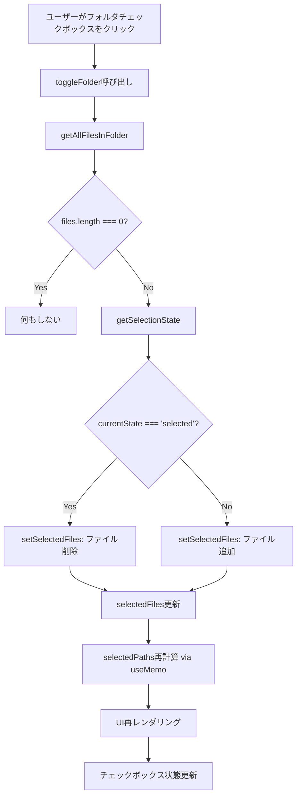
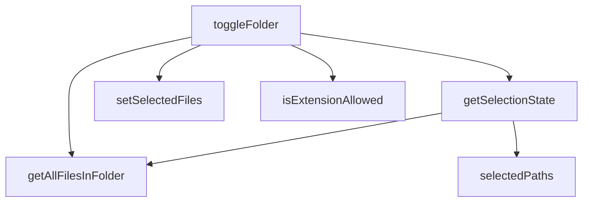

# フォルダ一括選択機能 - アルゴリズム設計書

## メタ情報

| 項目             | 内容                         |
| ---------------- | ---------------------------- |
| タスクID         | T-01-1                       |
| ドキュメントID   | ALGO-001                     |
| バージョン       | 1.0.0                        |
| ステータス       | Draft                        |
| 作成日           | 2025-12-18                   |
| 作成エージェント | .claude/agents/arch-police.md                 |
| 対象ファイル     | useWorkspaceFileSelection.ts |

---

## 1. 設計概要

### 1.1 目的

`useWorkspaceFileSelection`フックに以下の機能を追加し、フォルダ一括選択を実現する：

1. **getAllFilesInFolder**: フォルダ配下の全ファイルを再帰的に取得
2. **getSelectionState**: フォルダの選択状態を計算
3. **toggleFolder**: フォルダの一括選択/解除

### 1.2 設計原則

| 原則                  | 適用方法                                   |
| --------------------- | ------------------------------------------ |
| 単一責務原則（SRP）   | 各関数は1つの責務のみ持つ                  |
| 開放閉鎖原則（OCP）   | 既存関数を変更せず、新規関数を追加         |
| 依存性逆転原則（DIP） | 具象ではなくインターフェース（型）に依存   |
| 既存API互換性         | 既存の`toggleFile`, `removeFile`は変更なし |
| パフォーマンス最適化  | setState呼び出し回数の最小化、バッチ処理   |

---

## 2. 既存実装の分析

### 2.1 現在の状態管理

```typescript
// 現在の状態
const [selectedFiles, setSelectedFiles] = useState<WorkspaceSelectedFile[]>([]);

// 派生状態（メモ化）
const selectedPaths = useMemo(
  () => new Set(selectedFiles.map((f) => f.path)),
  [selectedFiles],
);
```

### 2.2 既存関数のシグネチャ

```typescript
interface UseWorkspaceFileSelectionReturn {
  selectedPaths: Set<string>;
  selectedFiles: WorkspaceSelectedFile[];
  toggleFile: (filePath: string, file: FileNode, folderId: string) => void;
  clearSelection: () => void;
  removeFile: (filePath: string) => void;
  canSelect: (filePath: string) => boolean;
}
```

### 2.3 拡張後のインターフェース

```typescript
// 追加する型定義
type SelectionState = "unselected" | "indeterminate" | "selected";

// 拡張後のインターフェース
interface UseWorkspaceFileSelectionReturn {
  // 既存（変更なし）
  selectedPaths: Set<string>;
  selectedFiles: WorkspaceSelectedFile[];
  toggleFile: (filePath: string, file: FileNode, folderId: string) => void;
  clearSelection: () => void;
  removeFile: (filePath: string) => void;
  canSelect: (filePath: string) => boolean;

  // 新規追加
  toggleFolder: (
    folderPath: string,
    folder: FileNode,
    folderId: string,
  ) => void;
  getSelectionState: (folder: FileNode) => SelectionState;
}
```

---

## 3. アルゴリズム詳細設計

### 3.1 getAllFilesInFolder（ヘルパー関数）

#### 目的

FileNode構造を再帰的に走査し、配下の全ファイルを配列で返す。

#### アルゴリズム

```typescript
/**
 * フォルダ配下の全ファイルを再帰的に取得
 *
 * @param node - 走査開始ノード
 * @returns 配下の全ファイル（フォルダは含まない）
 *
 * @example
 * const folder: FileNode = {
 *   type: "folder",
 *   children: [
 *     { type: "file", path: "/a.txt" },
 *     { type: "folder", children: [{ type: "file", path: "/b.txt" }] }
 *   ]
 * };
 * getAllFilesInFolder(folder); // => [{ type: "file", path: "/a.txt" }, { type: "file", path: "/b.txt" }]
 */
function getAllFilesInFolder(node: FileNode): FileNode[] {
  // ベースケース: ファイルノードの場合、自身を返す
  if (node.type === "file") {
    return [node];
  }

  // 再帰ケース: フォルダノードの場合、子ノードを再帰的に処理
  // flatMapで結果を平坦化
  return node.children?.flatMap(getAllFilesInFolder) ?? [];
}
```

#### 計算量分析

| 指標       | 値   | 説明                                  |
| ---------- | ---- | ------------------------------------- |
| 時間計算量 | O(n) | n = ノード総数。各ノードを1回だけ訪問 |
| 空間計算量 | O(n) | 結果配列 + コールスタック（深さd）    |

#### 境界値ケース

| ケース         | 入力                                 | 出力           |
| -------------- | ------------------------------------ | -------------- |
| ファイルノード | `{ type: "file" }`                   | `[自身]`       |
| 空フォルダ     | `{ type: "folder", children: [] }`   | `[]`           |
| childrenがnull | `{ type: "folder", children: null }` | `[]`           |
| 深いネスト     | 10階層のネスト                       | 全ファイル配列 |

---

### 3.2 getSelectionState

#### 目的

フォルダ配下のファイル選択状況を分析し、3つの状態のいずれかを返す。

#### 状態定義

```
状態遷移図:

  [unselected] ──(1ファイル以上選択)──▶ [indeterminate]
       ▲                                      │
       │                                      │
  (全ファイル解除)                      (全ファイル選択)
       │                                      │
       │                                      ▼
       └────────────────────────────────[selected]
```

#### アルゴリズム

```typescript
/**
 * フォルダの選択状態を計算
 *
 * @param folder - 選択状態を計算するフォルダノード
 * @returns 選択状態（unselected | indeterminate | selected）
 *
 * @complexity O(n) where n = フォルダ配下のファイル数
 */
const getSelectionState = useCallback(
  (folder: FileNode): SelectionState => {
    // Step 1: 配下の全ファイルを取得
    const files = getAllFilesInFolder(folder);

    // Step 2: 空フォルダの場合は未選択扱い
    if (files.length === 0) {
      return "unselected";
    }

    // Step 3: 選択されているファイル数をカウント
    const selectedCount = files.filter((file) =>
      selectedPaths.has(file.path),
    ).length;

    // Step 4: 選択状態を判定
    if (selectedCount === 0) {
      return "unselected";
    }
    if (selectedCount === files.length) {
      return "selected";
    }
    return "indeterminate";
  },
  [selectedPaths], // selectedPathsの変更時に再計算
);
```

#### 最適化オプション（将来検討）

```typescript
// オプション1: 早期リターン最適化
// 全件カウントせずindeterminate判定可能
const getSelectionStateOptimized = useCallback(
  (folder: FileNode): SelectionState => {
    const files = getAllFilesInFolder(folder);
    if (files.length === 0) return "unselected";

    let hasSelected = false;
    let hasUnselected = false;

    for (const file of files) {
      if (selectedPaths.has(file.path)) {
        hasSelected = true;
      } else {
        hasUnselected = true;
      }

      // 早期リターン: 両方見つかったらindeterminate確定
      if (hasSelected && hasUnselected) {
        return "indeterminate";
      }
    }

    return hasSelected ? "selected" : "unselected";
  },
  [selectedPaths],
);
```

#### 計算量分析

| 指標       | 標準版 | 最適化版（最良） | 最適化版（最悪） |
| ---------- | ------ | ---------------- | ---------------- |
| 時間計算量 | O(n)   | O(1)             | O(n)             |
| 空間計算量 | O(n)   | O(n)             | O(n)             |

---

### 3.3 toggleFolder

#### 目的

フォルダのチェックボックスクリック時の動作を制御する。

#### 状態遷移ロジック

| 現在の状態    | アクション           | 次の状態   |
| ------------- | -------------------- | ---------- |
| unselected    | 全ファイルを追加選択 | selected   |
| indeterminate | 未選択ファイルを追加 | selected   |
| selected      | 全ファイルを解除     | unselected |

#### アルゴリズム

```typescript
/**
 * フォルダの一括選択/解除を切り替え
 *
 * @param folderPath - フォルダのパス（将来拡張用）
 * @param folder - フォルダノード
 * @param folderId - 所属フォルダID
 *
 * @behavior
 * - 全選択状態: 全ファイルを解除
 * - 未選択/部分選択状態: 全ファイルを選択
 */
const toggleFolder = useCallback(
  (folderPath: string, folder: FileNode, folderId: string) => {
    // Step 1: 配下の全ファイルを取得
    const files = getAllFilesInFolder(folder);

    // Step 2: 空フォルダの場合は何もしない
    if (files.length === 0) {
      return;
    }

    // Step 3: 現在の選択状態を取得
    const currentState = getSelectionState(folder);

    // Step 4: 状態に応じた処理
    if (currentState === "selected") {
      // 全選択 → 全解除: 配下ファイルをすべて削除
      setSelectedFiles((prev) => {
        const filePaths = new Set(files.map((f) => f.path));
        return prev.filter((f) => !filePaths.has(f.path));
      });
    } else {
      // 未選択/部分選択 → 全選択: 未選択ファイルを追加
      setSelectedFiles((prev) => {
        const existingPaths = new Set(prev.map((f) => f.path));

        // 未選択かつ拡張子フィルターを通過するファイルのみ追加
        const newFiles = files
          .filter(
            (file) =>
              !existingPaths.has(file.path) &&
              isExtensionAllowed(file.name, allowedExtensions),
          )
          .map((file) => ({
            id: file.id,
            name: file.name,
            path: file.path,
            folderId,
          }));

        // maxSelection制限の適用
        if (maxSelection > 0) {
          const remainingSlots = maxSelection - prev.length;
          return [...prev, ...newFiles.slice(0, remainingSlots)];
        }

        return [...prev, ...newFiles];
      });
    }
  },
  [getSelectionState, allowedExtensions, maxSelection],
);
```

#### パフォーマンス最適化

**問題**: 大量ファイルの選択時、`setSelectedFiles`が1回だけ呼ばれるが、新配列の作成コストが高い。

**解決策**: バッチ処理は既に実現済み（1回のsetState呼び出し）。

```typescript
// 現在の実装: 1回のsetState呼び出し（最適）
setSelectedFiles((prev) => {
  // ... 新配列を一度に作成
  return [...prev, ...newFiles];
});

// アンチパターン: 複数回のsetState呼び出し（避けるべき）
files.forEach((file) => {
  setSelectedFiles((prev) => [...prev, file]); // 🚫 N回の再レンダリング
});
```

#### 計算量分析

| 操作         | 時間計算量 | 説明                            |
| ------------ | ---------- | ------------------------------- |
| ファイル取得 | O(n)       | getAllFilesInFolder             |
| 状態計算     | O(n)       | getSelectionState               |
| 配列操作     | O(n + m)   | n=既存選択数, m=新規追加/削除数 |
| **合計**     | **O(n)**   | 線形時間                        |

---

## 4. データフロー図



---

## 5. 型定義

### 5.1 新規型定義

```typescript
/**
 * フォルダの選択状態
 */
export type SelectionState = "unselected" | "indeterminate" | "selected";
```

### 5.2 拡張されたインターフェース

```typescript
export interface UseWorkspaceFileSelectionReturn {
  // === 既存（変更なし） ===
  /** 選択されたファイルパスのSet */
  selectedPaths: Set<string>;

  /** 選択されたファイル情報の配列 */
  selectedFiles: WorkspaceSelectedFile[];

  /** ファイル選択/選択解除 */
  toggleFile: (filePath: string, file: FileNode, folderId: string) => void;

  /** 選択をクリア */
  clearSelection: () => void;

  /** 特定ファイルを削除 */
  removeFile: (filePath: string) => void;

  /** 選択可能かどうか */
  canSelect: (filePath: string) => boolean;

  // === 新規追加 ===
  /**
   * フォルダ一括選択/解除
   *
   * @param folderPath - フォルダのパス
   * @param folder - フォルダノード
   * @param folderId - 所属フォルダID
   */
  toggleFolder: (
    folderPath: string,
    folder: FileNode,
    folderId: string,
  ) => void;

  /**
   * フォルダの選択状態を取得
   *
   * @param folder - フォルダノード
   * @returns 選択状態（unselected | indeterminate | selected）
   */
  getSelectionState: (folder: FileNode) => SelectionState;
}
```

---

## 6. 依存関係

### 6.1 関数依存グラフ



### 6.2 外部依存

| 依存先                    | 用途                           |
| ------------------------- | ------------------------------ |
| `FileNode`型              | ツリーノード構造               |
| `WorkspaceSelectedFile`型 | 選択ファイル情報               |
| `isExtensionAllowed`関数  | 拡張子フィルター               |
| React Hooks               | useState, useCallback, useMemo |

---

## 7. エラーハンドリング

### 7.1 エラーケース

| ケース                   | 処理                                     |
| ------------------------ | ---------------------------------------- |
| `folder`がnull/undefined | TypeScriptの型システムで防止             |
| `children`がnull         | `?? []`で空配列にフォールバック          |
| 循環参照                 | FileNode構造上は発生しない（木構造保証） |

### 7.2 防御的コーディング

```typescript
function getAllFilesInFolder(node: FileNode): FileNode[] {
  // 型ガード: nodeがundefinedの場合
  if (!node) {
    return [];
  }

  if (node.type === "file") {
    return [node];
  }

  // children が undefined/null の場合のフォールバック
  return node.children?.flatMap(getAllFilesInFolder) ?? [];
}
```

---

## 8. テスト戦略

### 8.1 ユニットテスト対象

| 関数                | テストケース                                          |
| ------------------- | ----------------------------------------------------- |
| getAllFilesInFolder | 空フォルダ、ファイル、ネストフォルダ、深い階層        |
| getSelectionState   | 未選択、部分選択、全選択、空フォルダ、境界値          |
| toggleFolder        | 全選択→解除、未選択→選択、部分選択→全選択、空フォルダ |

### 8.2 テストダブル

```typescript
// FileNodeのモックファクトリ
const createMockFolder = (files: string[]): FileNode => ({
  id: "folder-1",
  name: "test-folder",
  type: "folder",
  path: "/test-folder",
  children: files.map((name, i) => ({
    id: `file-${i}`,
    name,
    type: "file",
    path: `/test-folder/${name}`,
  })),
});
```

---

## 9. 実装チェックリスト

### 9.1 完了条件

- [ ] `SelectionState`型が定義されている
- [ ] `getAllFilesInFolder`関数が実装されている
- [ ] `getSelectionState`関数が実装されている
- [ ] `toggleFolder`関数が実装されている
- [ ] `UseWorkspaceFileSelectionReturn`型が拡張されている
- [ ] 既存の`toggleFile`, `removeFile`は変更なし
- [ ] JSDocコメントが追加されている
- [ ] TypeScript型エラーなし

### 9.2 品質基準

- [ ] Cyclomatic Complexity < 10（各関数）
- [ ] 関数行数 < 50行
- [ ] 依存関係ルール違反なし
- [ ] Lintエラーなし

---

## 10. 更新履歴

| バージョン | 日付       | 更新者       | 更新内容 |
| ---------- | ---------- | ------------ | -------- |
| 1.0.0      | 2025-12-18 | .claude/agents/arch-police.md | 初版作成 |
