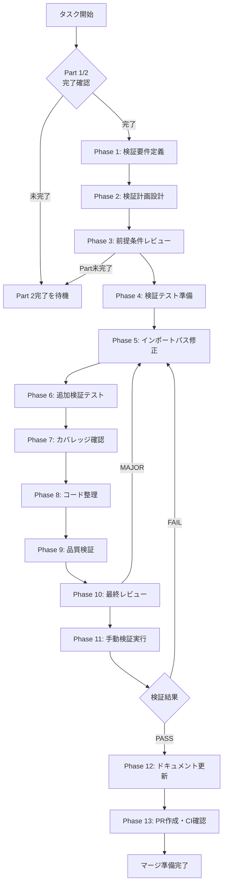

# shared-type-export-03-verification - タスク実行仕様書

## ユーザーからの元の指示

```
Part 1（型整理）とPart 2（メインエクスポート）の完了後、実際にデスクトップアプリからの型インポートが正常に動作することを検証する。
```

## メタ情報

| 項目         | 内容                                         |
| ------------ | -------------------------------------------- |
| タスクID     | SHARED-TYPE-EXPORT-03                        |
| タスク名     | @repo/shared Community型エクスポート（検証） |
| 分類         | リファクタリング                             |
| 対象機能     | @repo/shared, @repo/desktop                  |
| 優先度       | 高                                           |
| 見積もり規模 | 小規模                                       |
| ステータス   | 未実施                                       |
| 作成日       | 2026-01-23                                   |
| 関連Issue    | #373                                         |

---

## タスク概要

### 目的

Part 1（SHARED-TYPE-EXPORT-01: 型整理）とPart 2（SHARED-TYPE-EXPORT-02: メインエクスポート）の完了後、型エクスポートが正しく機能し、デスクトップアプリのビルドが成功することを検証する。

### 背景

型エクスポートを追加しても、以下の問題が残る可能性がある:

- デスクトップアプリのインポートパスが不正
- モジュール解決の設定問題
- ビルド時の型解決エラー

これらの問題を早期に検出し、Part 1, 2の作業が正しく機能していることを確認する必要がある。

### 最終ゴール

以下のコマンドが全てエラーなく完了する:

```bash
pnpm typecheck        # 型チェック成功
pnpm build            # ビルド成功
git push              # pre-push hookが通過
```

### 成果物一覧

| 種別           | 成果物                     | 配置先                                     |
| -------------- | -------------------------- | ------------------------------------------ |
| 検証レポート   | 型チェック・ビルド検証結果 | `outputs/phase-11/verification-report.md`  |
| 修正（必要時） | インポートパス修正         | `apps/desktop/src/**/*.ts`                 |
| ドキュメント   | 実装ガイド                 | `outputs/phase-12/implementation-guide.md` |
| PR             | GitHub Pull Request        | GitHub UI                                  |

---

## 参照ファイル

本仕様書は以下のシステム仕様を参照：

### システム仕様（aiworkflow-requirements）

| 参照資料                      | パス                                                                                      | 内容                   |
| ----------------------------- | ----------------------------------------------------------------------------------------- | ---------------------- |
| モノレポアーキテクチャ        | `.claude/skills/aiworkflow-requirements/references/architecture-monorepo.md`              | 型エクスポートパターン |
| Community検出インターフェース | `.claude/skills/aiworkflow-requirements/references/interfaces-rag-community-detection.md` | Community型定義        |

### 関連タスク仕様書

| タスクID              | 内容               | ステータス |
| --------------------- | ------------------ | ---------- |
| SHARED-TYPE-EXPORT-01 | 型整理（Part 1）   | 完了       |
| SHARED-TYPE-EXPORT-02 | メインエクスポート | 前提条件   |

---

## タスク分解サマリー

| ID     | フェーズ | サブタスク名       | 責務                     | 依存 |
| ------ | -------- | ------------------ | ------------------------ | ---- |
| T-01-1 | Phase 1  | 検証要件定義       | 検証対象・基準を明確化   | -    |
| T-02-1 | Phase 2  | 検証計画設計       | 検証手順・順序を設計     | T-01 |
| T-03-1 | Phase 3  | 前提条件レビュー   | Part 1/2完了確認         | T-02 |
| T-04-1 | Phase 4  | 検証テスト準備     | 検証コマンド・手順の整理 | T-03 |
| T-05-1 | Phase 5  | インポートパス修正 | 必要な場合のみ修正実施   | T-04 |
| T-06-1 | Phase 6  | 追加検証テスト     | 修正後の再検証           | T-05 |
| T-07-1 | Phase 7  | カバレッジ確認     | 型チェック網羅性確認     | T-06 |
| T-08-1 | Phase 8  | コード整理         | 不要コードの除去         | T-07 |
| T-09-1 | Phase 9  | 品質検証           | Lint/型チェック最終確認  | T-08 |
| T-10-1 | Phase 10 | 最終レビュー       | 全体整合性確認           | T-09 |
| T-11-1 | Phase 11 | 手動検証実行       | ビルド・push検証         | T-10 |
| T-12-1 | Phase 12 | ドキュメント更新   | 実装ガイド・仕様書更新   | T-11 |
| T-13-1 | Phase 13 | PR作成             | コミット・PR・CI確認     | T-12 |

**総サブタスク数**: 13個

---

## 実行フロー図



---

## Phase一覧

| Phase | 名称               | 仕様書                                                 | ステータス |
| ----- | ------------------ | ------------------------------------------------------ | ---------- |
| 1     | 検証要件定義       | [phase-1-requirements.md](phase-1-requirements.md)     | 未実施     |
| 2     | 検証計画設計       | [phase-2-design.md](phase-2-design.md)                 | 未実施     |
| 3     | 前提条件レビュー   | [phase-3-design-review.md](phase-3-design-review.md)   | 未実施     |
| 4     | 検証テスト準備     | [phase-4-test-creation.md](phase-4-test-creation.md)   | 未実施     |
| 5     | インポートパス修正 | [phase-5-implementation.md](phase-5-implementation.md) | 未実施     |
| 6     | 追加検証テスト     | [phase-6-test-expansion.md](phase-6-test-expansion.md) | 未実施     |
| 7     | カバレッジ確認     | [phase-7-coverage-check.md](phase-7-coverage-check.md) | 未実施     |
| 8     | コード整理         | [phase-8-refactoring.md](phase-8-refactoring.md)       | 未実施     |
| 9     | 品質検証           | [phase-9-quality.md](phase-9-quality.md)               | 未実施     |
| 10    | 最終レビュー       | [phase-10-final-review.md](phase-10-final-review.md)   | 未実施     |
| 11    | 手動検証実行       | [phase-11-manual-test.md](phase-11-manual-test.md)     | 未実施     |
| 12    | ドキュメント更新   | [phase-12-documentation.md](phase-12-documentation.md) | 未実施     |
| 13    | PR作成             | [phase-13-pr-creation.md](phase-13-pr-creation.md)     | 未実施     |

---

## 検証基準

### 型チェック検証

| 対象パッケージ | コマンド                                | 期待結果   |
| -------------- | --------------------------------------- | ---------- |
| @repo/shared   | `pnpm --filter @repo/shared typecheck`  | エラーなし |
| @repo/desktop  | `pnpm --filter @repo/desktop typecheck` | エラーなし |
| 全体           | `pnpm typecheck`                        | エラーなし |

### ビルド検証

| 対象パッケージ | コマンド                            | 期待結果                             |
| -------------- | ----------------------------------- | ------------------------------------ |
| @repo/shared   | `pnpm --filter @repo/shared build`  | ビルド成功                           |
| @repo/desktop  | `pnpm --filter @repo/desktop build` | ビルド成功（既存Renderer問題を除く） |
| 全体           | `pnpm build`                        | ビルド成功                           |

### Push検証

| 検証項目         | コマンド   | 期待結果     |
| ---------------- | ---------- | ------------ |
| pre-push hook    | `git push` | hook通過     |
| リモートプッシュ | -          | プッシュ成功 |

---

## トラブルシューティング

| エラー                          | 対処法                        |
| ------------------------------- | ----------------------------- |
| `Module has no exported member` | Part 1, 2のエクスポートを確認 |
| `Cannot find module`            | パッケージのビルド順序を確認  |
| `Circular dependency`           | インポート構造を見直し        |

---

## Phase完了時の必須アクション

**各Phase完了時に以下を必ず実行すること:**

1. **タスク100%実行**: Phase内で指定された全タスクを完全に実行
2. **成果物確認**: 全ての必須成果物が生成されていることを検証
3. **実行記録**: 実行タスクの結果を記録
4. **artifacts.json更新**: Phase完了ステータスを更新
5. **Phase末端の実行確認**: 各タスクを100%実行し、各タスクを完遂した旨を必ず明記

```bash
# Phase完了時の検証コマンド
node .claude/skills/task-specification-creator/scripts/validate-phase-output.js docs/30-workflows/shared-type-export-03-verification --phase {{PHASE_NUMBER}}

# Phase完了・成果物登録
node .claude/skills/task-specification-creator/scripts/complete-phase.js \
  --workflow docs/30-workflows/shared-type-export-03-verification --phase {{PHASE_NUMBER}} --artifacts "..."
```
