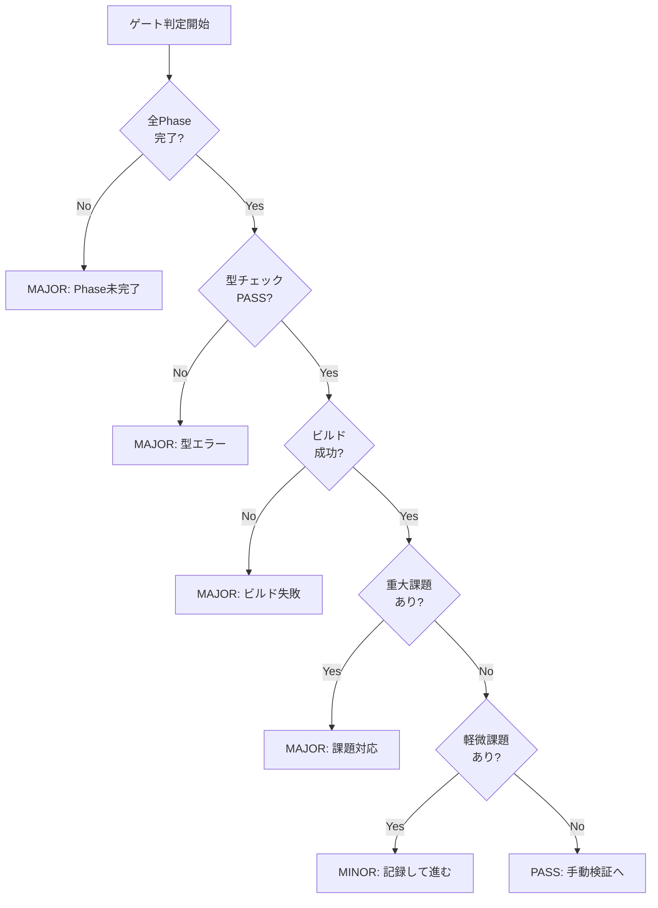

# Phase 10: 最終レビューゲート

## メタ情報

| 項目       | 内容                |
| ---------- | ------------------- |
| Phase番号  | 10                  |
| Phase名    | 最終レビューゲート  |
| 目的       | 全体整合性確認      |
| 前提Phase  | Phase 9（品質検証） |
| 推定作業量 | 小                  |

---

## 1. 目的

型エクスポート検証タスクの全工程が完了し、マージ準備が整っていることを最終確認する。

---

## 2. 実行タスク

### Task 10-1: 完了条件チェック

#### 目的

全Phaseの完了条件が満たされていることを確認する。

#### チェックリスト

| Phase | 名称               | 完了状態 | 成果物確認 |
| ----- | ------------------ | -------- | ---------- |
| 1     | 検証要件定義       | 要確認   | 要確認     |
| 2     | 検証計画設計       | 要確認   | 要確認     |
| 3     | 前提条件レビュー   | 要確認   | 要確認     |
| 4     | 検証テスト準備     | 要確認   | 要確認     |
| 5     | インポートパス修正 | 要確認   | 要確認     |
| 6     | 追加検証テスト     | 要確認   | 要確認     |
| 7     | カバレッジ確認     | 要確認   | 要確認     |
| 8     | コード整理         | 要確認   | 要確認     |
| 9     | 品質検証           | 要確認   | 要確認     |

#### 成果物

| 成果物               | 配置先                                     |
| -------------------- | ------------------------------------------ |
| 完了条件チェック結果 | `outputs/phase-10/completion-checklist.md` |

#### 完了条件

- [ ] 全Phaseが完了している
- [ ] 全成果物が出力されている

---

### Task 10-2: 検証結果サマリー

#### 目的

検証結果の全体サマリーを作成する。

#### サマリー項目

| 項目       | 内容                         | 結果   |
| ---------- | ---------------------------- | ------ |
| 型チェック | 全パッケージの型チェック結果 | 要記録 |
| ビルド     | 全パッケージのビルド結果     | 要記録 |
| 修正内容   | 実施した修正の概要           | 要記録 |
| 影響範囲   | 変更の影響範囲               | 要記録 |
| 残課題     | 本タスクで対応しなかった課題 | 要記録 |

#### 成果物

| 成果物           | 配置先                                     |
| ---------------- | ------------------------------------------ |
| 検証結果サマリー | `outputs/phase-10/verification-summary.md` |

#### 完了条件

- [ ] 全検証結果が記録されている
- [ ] 修正内容が明確に記録されている
- [ ] 残課題が特定されている

---

### Task 10-3: ゲート判定

#### 目的

手動検証（Phase 11）へ進む準備が整っているかを判定する。

#### 判定基準

| 判定結果 | 条件                             | 次アクション             |
| -------- | -------------------------------- | ------------------------ |
| PASS     | 全ての検証がPASS、重大な課題なし | Phase 11へ進む           |
| MINOR    | 軽微な課題あり（非ブロッキング） | 課題を記録してPhase 11へ |
| MAJOR    | 重大な課題あり                   | 該当Phaseに戻り修正      |
| CRITICAL | 要件変更が必要                   | Phase 1に戻り再検討      |

#### 判定フロー

#### 成果物

| 成果物         | 配置先                              |
| -------------- | ----------------------------------- |
| ゲート判定結果 | `outputs/phase-10/gate-decision.md` |

#### 完了条件

- [ ] ゲート判定が実施されている
- [ ] 判定結果（PASS/MINOR/MAJOR/CRITICAL）が明記されている
- [ ] MAJOR/CRITICAL の場合は対応方針が記載されている

---

## 3. 参照資料

### Phase 1-9成果物

| Phase | 主要成果物                  | 参照目的     |
| ----- | --------------------------- | ------------ |
| 1     | verification-criteria.md    | 検証基準     |
| 5     | modifications.md            | 修正内容     |
| 7     | integration-verification.md | 統合検証結果 |
| 9     | static-analysis.md          | 品質検証結果 |

---

## 4. 成果物一覧

| 成果物               | ファイル名                | 必須 |
| -------------------- | ------------------------- | ---- |
| 完了条件チェック結果 | `completion-checklist.md` | ✅   |
| 検証結果サマリー     | `verification-summary.md` | ✅   |
| ゲート判定結果       | `gate-decision.md`        | ✅   |

---

## 5. 完了条件

### 機能要件

- [ ] 全Phaseの完了が確認されている
- [ ] 検証結果サマリーが作成されている
- [ ] ゲート判定がPASSまたはMINOR

### 品質要件

- [ ] 全ての検証結果が正確に記録されている
- [ ] 残課題が明確に特定されている
- [ ] 判定基準が明確で再現可能

### Phase完了時の必須アクション

1. 上記成果物を `outputs/phase-10/` に出力
2. artifacts.json の phase-10 ステータスを更新
3. ゲート判定結果を明記
4. 各タスクを100%実行し、完遂した旨を明記

### ゲート判定後のアクション

- **PASS/MINOR**: Phase 11（手動検証実行）へ進む
- **MAJOR**: 該当Phaseに戻り修正
- **CRITICAL**: Phase 1に戻り要件を再検討
