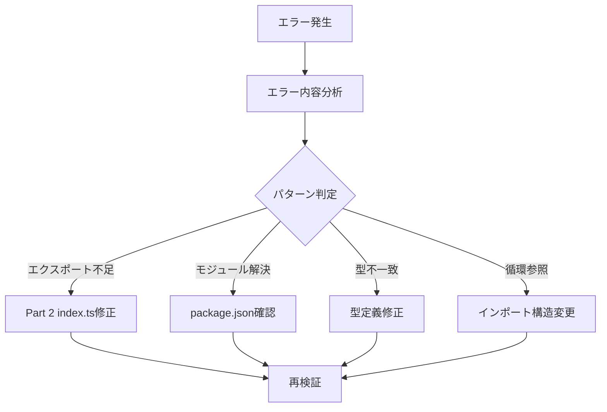

# Phase 2: 検証計画設計

## メタ情報

| 項目       | 内容                           |
| ---------- | ------------------------------ |
| Phase番号  | 2                              |
| Phase名    | 検証計画設計                   |
| 目的       | 検証手順・順序・修正方針の設計 |
| 前提Phase  | Phase 1（検証要件定義）        |
| 推定作業量 | 小                             |

---

## 1. 目的

Phase 1で定義した検証要件に基づき、検証の実行手順と修正が必要な場合の対応方針を設計する。

---

## 2. 実行タスク

### Task 2-1: 検証実行順序の設計

#### 目的

最も効率的かつ確実な検証順序を設計する。

#### 検証順序

```
Step 1: @repo/shared 単体検証
├── 1.1 型チェック (typecheck)
└── 1.2 ビルド (build)
        ↓
Step 2: @repo/desktop 単体検証
├── 2.1 型チェック (typecheck)
└── 2.2 ビルド (build)
        ↓
Step 3: 全体検証
├── 3.1 全体型チェック (pnpm typecheck)
├── 3.2 全体ビルド (pnpm build)
└── 3.3 pre-push hook検証 (git push --dry-run)
```

#### 理由

1. 依存関係の方向（shared → desktop）に沿って検証
2. 単体で問題を切り分けてから全体検証
3. ビルド前に型チェックでエラーを早期発見

#### 成果物

| 成果物         | 配置先                                     |
| -------------- | ------------------------------------------ |
| 検証順序設計書 | `outputs/phase-2/verification-sequence.md` |

#### 完了条件

- [ ] 検証順序が明確に定義されている
- [ ] 各ステップの依存関係が明記されている
- [ ] 順序の理由が説明されている

---

### Task 2-2: エラー修正方針の設計

#### 目的

検証でエラーが発生した場合の修正方針を設計する。

#### エラーパターンと修正方針

| エラーパターン                    | 原因                         | 修正方針                            |
| --------------------------------- | ---------------------------- | ----------------------------------- |
| `Module has no exported member X` | 型がエクスポートされていない | Part 2のindex.tsにexportを追加      |
| `Cannot find module`              | モジュール解決失敗           | package.jsonのexportsフィールド確認 |
| `Type X is not assignable to Y`   | 型の不一致                   | 型定義の確認・修正                  |
| `Circular dependency detected`    | 循環参照                     | インポート構造の見直し              |

#### 修正フロー



#### 成果物

| 成果物           | 配置先                                     |
| ---------------- | ------------------------------------------ |
| エラー修正方針書 | `outputs/phase-2/error-resolution-plan.md` |

#### 完了条件

- [ ] 想定されるエラーパターンが網羅されている
- [ ] 各パターンの修正方針が明確に定義されている
- [ ] 修正フローが図示されている

---

### Task 2-3: 修正スコープの定義

#### 目的

本タスクで許容される修正範囲を明確に定義する。

#### 修正スコープ

| スコープ内（修正可）                | スコープ外（修正不可）   |
| ----------------------------------- | ------------------------ |
| インポートパスの修正                | 新規機能の追加           |
| export文の追加（Part 2補完）        | 既存ロジックの変更       |
| package.jsonのexportsフィールド修正 | テストの追加             |
| 型定義ファイルの軽微な修正          | 大規模なリファクタリング |

#### 成果物

| 成果物           | 配置先                                  |
| ---------------- | --------------------------------------- |
| 修正スコープ定義 | `outputs/phase-2/modification-scope.md` |

#### 完了条件

- [ ] スコープ内/外が明確に定義されている
- [ ] スコープ外の作業が発生した場合の対応方針が明記されている

---

## 3. 参照資料

### システム仕様（aiworkflow-requirements）

> 実装前に必ず以下のシステム仕様を確認し、既存設計との整合性を確保してください。

| 参照資料               | パス                                                                         | 内容                   |
| ---------------------- | ---------------------------------------------------------------------------- | ---------------------- |
| モノレポアーキテクチャ | `.claude/skills/aiworkflow-requirements/references/architecture-monorepo.md` | 型エクスポートパターン |

### Phase 1成果物

| 成果物                   | 参照目的       |
| ------------------------ | -------------- |
| verification-scope.md    | 検証対象の確認 |
| verification-criteria.md | 検証基準の確認 |

---

## 4. 成果物一覧

| 成果物           | ファイル名                 | 必須 |
| ---------------- | -------------------------- | ---- |
| 検証順序設計書   | `verification-sequence.md` | ✅   |
| エラー修正方針書 | `error-resolution-plan.md` | ✅   |
| 修正スコープ定義 | `modification-scope.md`    | ✅   |

---

## 5. 完了条件

### 機能要件

- [ ] 検証順序が明確に設計されている
- [ ] エラー修正方針が全パターンで定義されている
- [ ] 修正スコープが明確に定義されている

### 品質要件

- [ ] 100人中100人が同じ手順で検証を実行できる
- [ ] 修正判断に曖昧さがない
- [ ] スコープ外の作業が発生した場合の対応が明記されている

### Phase完了時の必須アクション

1. 上記成果物を `outputs/phase-2/` に出力
2. artifacts.json の phase-2 ステータスを更新
3. 各タスクを100%実行し、完遂した旨を明記
