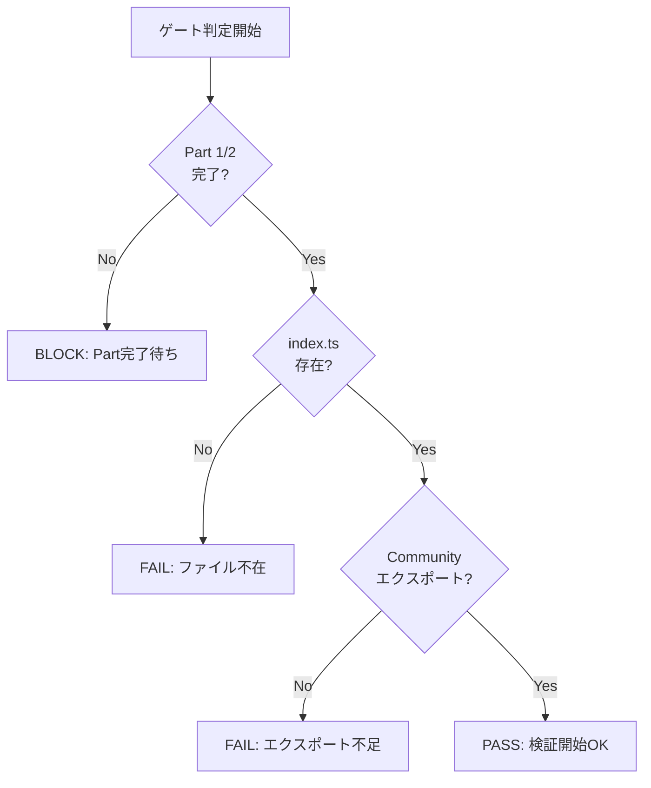

# Phase 3: 前提条件レビューゲート

## メタ情報

| 項目       | 内容                             |
| ---------- | -------------------------------- |
| Phase番号  | 3                                |
| Phase名    | 前提条件レビューゲート           |
| 目的       | Part 1/2完了確認・検証準備OK判定 |
| 前提Phase  | Phase 2（検証計画設計）          |
| 推定作業量 | 小                               |

---

## 1. 目的

本検証タスクを実行するための前提条件が全て満たされていることを確認し、検証を開始してよいかのゲート判定を行う。

---

## 2. 実行タスク

### Task 3-1: Part 1/2 完了状態確認

#### 目的

依存タスクが完了していることを確認する。

#### 確認項目

| 確認項目                    | 確認方法                                         | 期待結果     |
| --------------------------- | ------------------------------------------------ | ------------ |
| SHARED-TYPE-EXPORT-01完了   | タスク仕様書のステータス確認                     | 「完了」     |
| SHARED-TYPE-EXPORT-02完了   | タスク仕様書のステータス確認                     | 「完了」     |
| services/graph/index.ts存在 | `ls packages/shared/src/services/graph/index.ts` | ファイル存在 |

#### 確認コマンド

```bash
# Part 2の成果物（index.ts）が存在するか確認
test -f packages/shared/src/services/graph/index.ts && echo "EXISTS" || echo "NOT FOUND"

# Community型のエクスポートが存在するか確認
grep -c "export.*Community" packages/shared/src/services/graph/index.ts
```

#### 成果物

| 成果物             | 配置先                                       |
| ------------------ | -------------------------------------------- |
| 依存タスク確認結果 | `outputs/phase-3/dependency-check-result.md` |

#### 完了条件

- [ ] SHARED-TYPE-EXPORT-01が完了している
- [ ] SHARED-TYPE-EXPORT-02が完了している
- [ ] services/graph/index.tsが存在する

---

### Task 3-2: エクスポート内容確認

#### 目的

Part 2で追加されたエクスポートが正しく存在することを確認する。

#### 確認項目

| エクスポート対象              | 確認コマンド                                             | 期待結果 |
| ----------------------------- | -------------------------------------------------------- | -------- |
| Community型                   | `grep "export type.*Community" index.ts`                 | 存在     |
| CommunitySummary型            | `grep "export type.*CommunitySummary" index.ts`          | 存在     |
| CommunityDetectionOptions型   | `grep "export type.*CommunityDetectionOptions" index.ts` | 存在     |
| CommunityErrorCode enum       | `grep "export.*CommunityErrorCode" index.ts`             | 存在     |
| CommunityDetectionError class | `grep "export.*CommunityDetectionError" index.ts`        | 存在     |

#### 確認コマンド

```bash
# 全エクスポートを一覧表示
grep -E "^export" packages/shared/src/services/graph/index.ts

# Community関連のエクスポートをカウント
grep -c "Community" packages/shared/src/services/graph/index.ts
```

#### 成果物

| 成果物               | 配置先                                   |
| -------------------- | ---------------------------------------- |
| エクスポート確認結果 | `outputs/phase-3/export-verification.md` |

#### 完了条件

- [ ] 必要なCommunity関連型が全てエクスポートされている
- [ ] 型エクスポート（export type）と値エクスポート（export）が正しく区別されている

---

### Task 3-3: ゲート判定

#### 目的

検証を開始してよいかの最終判定を行う。

#### 判定基準

| 判定結果 | 条件                           | 次アクション       |
| -------- | ------------------------------ | ------------------ |
| PASS     | 全ての前提条件を満たす         | Phase 4へ進む      |
| FAIL     | 前提条件を満たさない項目がある | 原因特定・対応検討 |
| BLOCK    | Part 2が未完了                 | Part 2完了を待機   |

#### 判定フロー



#### 成果物

| 成果物         | 配置先                             |
| -------------- | ---------------------------------- |
| ゲート判定結果 | `outputs/phase-3/gate-decision.md` |

#### 完了条件

- [ ] ゲート判定が実施されている
- [ ] 判定結果（PASS/FAIL/BLOCK）が明記されている
- [ ] FAILの場合は原因と対応方針が記載されている

---

## 3. 参照資料

### システム仕様（aiworkflow-requirements）

> 実装前に必ず以下のシステム仕様を確認し、既存設計との整合性を確保してください。

| 参照資料               | パス                                                                         | 内容                   |
| ---------------------- | ---------------------------------------------------------------------------- | ---------------------- |
| モノレポアーキテクチャ | `.claude/skills/aiworkflow-requirements/references/architecture-monorepo.md` | 型エクスポートパターン |

### Phase 1/2成果物

| 成果物                     | 参照目的           |
| -------------------------- | ------------------ |
| prerequisites-checklist.md | 前提条件の詳細確認 |
| verification-sequence.md   | 検証順序の確認     |

---

## 4. 成果物一覧

| 成果物               | ファイル名                   | 必須 |
| -------------------- | ---------------------------- | ---- |
| 依存タスク確認結果   | `dependency-check-result.md` | ✅   |
| エクスポート確認結果 | `export-verification.md`     | ✅   |
| ゲート判定結果       | `gate-decision.md`           | ✅   |

---

## 5. 完了条件

### 機能要件

- [ ] 全ての依存タスクが完了していることを確認
- [ ] 必要なエクスポートが存在することを確認
- [ ] ゲート判定がPASSである

### 品質要件

- [ ] 確認項目の漏れがない
- [ ] 判定基準が明確で再現可能
- [ ] FAILの場合の対応方針が明記されている

### Phase完了時の必須アクション

1. 上記成果物を `outputs/phase-3/` に出力
2. artifacts.json の phase-3 ステータスを更新
3. ゲート判定結果を明記
4. 各タスクを100%実行し、完遂した旨を明記

### ゲート判定後のアクション

- **PASS**: Phase 4（検証テスト準備）へ進む
- **FAIL**: 原因を特定し、Part 1/2の修正を実施
- **BLOCK**: Part 2の完了を待機し、再度ゲート判定を実施
