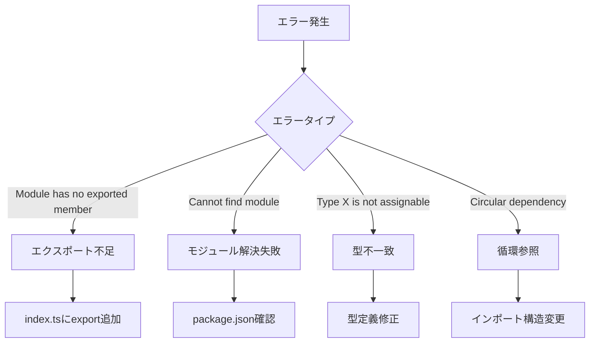

# Phase 5: インポートパス修正

## メタ情報

| 項目       | 内容                      |
| ---------- | ------------------------- |
| Phase番号  | 5                         |
| Phase名    | インポートパス修正        |
| 目的       | 必要な場合のみ修正実施    |
| 前提Phase  | Phase 4（検証テスト準備） |
| 推定作業量 | 小〜中                    |

---

## 1. 目的

Phase 4で準備した検証を実行し、エラーが発生した場合は設計に基づいてインポートパスを修正する。

---

## 2. 実行タスク

### Task 5-1: 初期検証の実行

#### 目的

現状の型エクスポートが正しく機能しているかを検証する。

#### 手順

1. @repo/shared の型チェック実行

   ```bash
   pnpm --filter @repo/shared typecheck
   ```

2. @repo/shared のビルド実行

   ```bash
   pnpm --filter @repo/shared build
   ```

3. @repo/desktop の型チェック実行

   ```bash
   pnpm --filter @repo/desktop typecheck
   ```

4. @repo/desktop のビルド実行

   ```bash
   pnpm --filter @repo/desktop build
   ```

5. 結果を記録

#### 成果物

| 成果物       | 配置先                                    |
| ------------ | ----------------------------------------- |
| 初期検証結果 | `outputs/phase-5/initial-verification.md` |

#### 完了条件

- [ ] 全検証コマンドが実行されている
- [ ] 結果（PASS/FAIL）が記録されている
- [ ] FAILの場合はエラー内容が記録されている

---

### Task 5-2: エラー分析（エラー発生時のみ）

#### 目的

検証でエラーが発生した場合、原因を特定する。

#### エラー分析手順



#### エラーパターン別対応

| エラーパターン                    | 確認箇所                                      | 修正方法                      |
| --------------------------------- | --------------------------------------------- | ----------------------------- |
| `Module has no exported member X` | `packages/shared/src/services/graph/index.ts` | 該当の型をexportに追加        |
| `Cannot find module`              | `packages/shared/package.json`                | exportsフィールドを確認・修正 |
| `Type X is not assignable to Y`   | 該当の型定義ファイル                          | 型定義を確認・修正            |
| `Circular dependency detected`    | インポートグラフ                              | インポート順序を見直し        |

#### 成果物

| 成果物         | 配置先                              |
| -------------- | ----------------------------------- |
| エラー分析結果 | `outputs/phase-5/error-analysis.md` |

#### 完了条件

- [ ] エラーの原因が特定されている
- [ ] 修正方法が決定されている
- [ ] 修正がスコープ内であることを確認

---

### Task 5-3: インポートパス修正（必要時のみ）

#### 目的

特定されたエラーを修正する。

#### 修正対象候補

| 修正対象                                      | 修正内容                | スコープ |
| --------------------------------------------- | ----------------------- | -------- |
| `packages/shared/src/services/graph/index.ts` | export文の追加          | 内       |
| `apps/desktop/src/**/*.ts`                    | インポートパスの修正    | 内       |
| `packages/shared/package.json`                | exportsフィールドの修正 | 内       |

#### 修正手順

1. 修正対象ファイルを特定
2. バックアップ（git stashまたはコミット前状態を保持）
3. 修正を実施
4. 再検証を実行

#### 成果物

| 成果物       | 配置先                             |
| ------------ | ---------------------------------- |
| 修正内容記録 | `outputs/phase-5/modifications.md` |

#### 完了条件

- [ ] 必要な修正が全て実施されている
- [ ] 修正内容が記録されている
- [ ] 修正がスコープ内に収まっている

---

### Task 5-4: 修正後検証

#### 目的

修正後に全検証がPASSすることを確認する。

#### 手順

1. @repo/shared の型チェック再実行
2. @repo/shared のビルド再実行
3. @repo/desktop の型チェック再実行
4. @repo/desktop のビルド再実行
5. 全体型チェック実行
6. 全体ビルド実行

#### 成果物

| 成果物         | 配置先                                     |
| -------------- | ------------------------------------------ |
| 修正後検証結果 | `outputs/phase-5/post-fix-verification.md` |

#### 完了条件

- [ ] 全検証がPASSしている
- [ ] FAILの場合はTask 5-2に戻って再分析

---

## 3. 参照資料

### システム仕様（aiworkflow-requirements）

> 実装前に必ず以下のシステム仕様を確認し、既存設計との整合性を確保してください。

| 参照資料                      | パス                                                                                      | 内容                   |
| ----------------------------- | ----------------------------------------------------------------------------------------- | ---------------------- |
| モノレポアーキテクチャ        | `.claude/skills/aiworkflow-requirements/references/architecture-monorepo.md`              | 型エクスポートパターン |
| Community検出インターフェース | `.claude/skills/aiworkflow-requirements/references/interfaces-rag-community-detection.md` | Community型定義        |

### Phase 2/4成果物

| 成果物                   | 参照目的         |
| ------------------------ | ---------------- |
| error-resolution-plan.md | エラー修正方針   |
| modification-scope.md    | 修正スコープ確認 |
| verification-commands.md | 検証コマンド     |

---

## 4. 成果物一覧

| 成果物         | ファイル名                 | 必須     |
| -------------- | -------------------------- | -------- |
| 初期検証結果   | `initial-verification.md`  | ✅       |
| エラー分析結果 | `error-analysis.md`        | 条件付き |
| 修正内容記録   | `modifications.md`         | 条件付き |
| 修正後検証結果 | `post-fix-verification.md` | 条件付き |

※ 初期検証がPASSの場合、エラー分析・修正・修正後検証は不要

---

## 5. 完了条件

### 機能要件

- [ ] 初期検証が実行されている
- [ ] エラーがある場合は分析・修正が完了している
- [ ] 最終的に全検証がPASSしている

### 品質要件

- [ ] 修正がスコープ内に収まっている
- [ ] 修正内容が正確に記録されている
- [ ] 既存機能が壊れていない

### Phase完了時の必須アクション

1. 上記成果物を `outputs/phase-5/` に出力
2. artifacts.json の phase-5 ステータスを更新
3. 各タスクを100%実行し、完遂した旨を明記

### 注意事項

- **修正がスコープ外の場合**: 新規タスクとして切り出し、本タスクはブロック状態とする
- **大規模な修正が必要な場合**: Phase 2に戻り、修正方針を再検討
