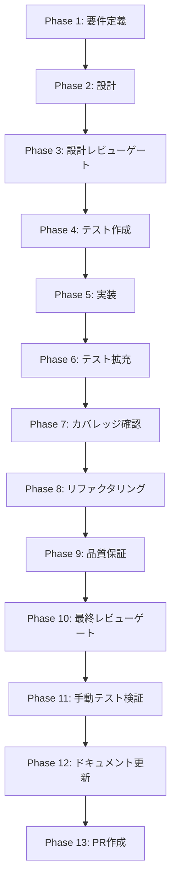

# UT-SDK-L34-UI-DISPLAY-SEVERITY-FILTER-001: SkillCreator Layer3/4 verify detail の severity フィルタ追加

## ユーザー指示

> SkillCreator の Layer3/4 verify detail に severity フィルタを追加し、`all` / `warning+` / `error only` の切り替えで表示粒度を調整できるようにする。

## メタ情報

| 項目         | 内容                                                         |
| ------------ | ------------------------------------------------------------ |
| タスクID     | UT-SDK-L34-UI-DISPLAY-SEVERITY-FILTER-001                    |
| タスク名     | SkillCreator Layer3/4 verify detail の severity フィルタ追加 |
| 分類         | 改善                                                         |
| タスク種別   | UI task（Renderer コンポーネントの変更あり）                 |
| 優先度       | 中                                                           |
| 見積もり規模 | 小規模                                                       |
| ステータス   | Phase 12 完了（PR 未作成）                                   |
| 作成日       | 2026-04-03                                                   |
| 依存タスク   | UT-SDK-L34-UI-DISPLAY-001（完了済み）                        |

## タスク概要

### 目的

Layer3/4 の checks 件数が増えると `info` を含む全件表示では重要な問題が埋もれる。severity フィルタにより、ユーザーが重要度に応じて表示を絞り込めるようにする。

### 背景

UT-SDK-L34-UI-DISPLAY-001 で Layer grouping が実装済みだが、情報量が多いとスキャンコストが残る。フィルタリングで「先に直すべきもの」への集中を可能にする。

### 最終ゴール

- severity フィルタで表示対象を `all` / `warning+` / `error` に切り替えられる
- フィルタをかけても Layer grouping と accordion の状態が破綻しない
- 既定は `all` で、現行表示を壊さない
- reverify 後もフィルタ状態が維持される

### 成果物

- severity フィルタ付き verify detail UI（`SkillLifecyclePanel.tsx`）
- フィルタ条件ごとのコンポーネントテスト（`SkillLifecyclePanel.test.tsx`）
- Phase 11 visual capture artifacts（`outputs/phase-11/screenshots/*`）
- Phase 1-13 タスク仕様書

## 関連ファイル

| ファイル                                                                            | 責務     | 変更 |
| ----------------------------------------------------------------------------------- | -------- | ---- |
| `apps/desktop/src/renderer/components/skill/SkillLifecyclePanel.tsx`                | メインUI | 変更 |
| `apps/desktop/src/renderer/components/skill/__tests__/SkillLifecyclePanel.test.tsx` | テスト   | 変更 |

## タスク分解

| タスクID | タスク名                                | 責務                             | 依存   | 優先度 |
| -------- | --------------------------------------- | -------------------------------- | ------ | ------ |
| T-01-1   | 型定義・定数・フィルタ関数の追加        | SeverityFilterLevel 型と関連定数 | なし   | 高     |
| T-01-2   | filter state と useMemo の追加          | state管理とメモ化                | T-01-1 | 高     |
| T-01-3   | フィルタバー UI の追加                  | セグメントボタン UI              | T-01-2 | 高     |
| T-01-4   | VerifyLayerGroup への filteredData 適用 | 表示データ差し替え               | T-01-2 | 高     |
| T-01-5   | reverify 時の state 維持                | activeWorkflowId 変更時リセット  | T-01-2 | 中     |
| T-01-6   | コンポーネントテスト SF-01〜SF-09       | フィルタ動作の検証               | T-01-4 | 高     |

## 実行フロー



## Phase一覧

| Phase | 名称               | 仕様書                                                 | カテゴリ     |
| ----- | ------------------ | ------------------------------------------------------ | ------------ |
| 1     | 要件定義           | [phase-1-requirements.md](phase-1-requirements.md)     | 要件         |
| 2     | 設計               | [phase-2-design.md](phase-2-design.md)                 | 設計         |
| 3     | 設計レビューゲート | [phase-3-design-review.md](phase-3-design-review.md)   | ゲート       |
| 4     | テスト作成         | [phase-4-test-creation.md](phase-4-test-creation.md)   | TDD-Red      |
| 5     | 実装               | [phase-5-implementation.md](phase-5-implementation.md) | TDD-Green    |
| 6     | テスト拡充         | [phase-6-test-expansion.md](phase-6-test-expansion.md) | 品質         |
| 7     | カバレッジ確認     | [phase-7-coverage.md](phase-7-coverage.md)             | 品質         |
| 8     | リファクタリング   | [phase-8-refactoring.md](phase-8-refactoring.md)       | TDD-Refactor |
| 9     | 品質保証           | [phase-9-quality.md](phase-9-quality.md)               | 品質         |
| 10    | 最終レビューゲート | [phase-10-final-review.md](phase-10-final-review.md)   | ゲート       |
| 11    | 手動テスト検証     | [phase-11-manual-test.md](phase-11-manual-test.md)     | 検証         |
| 12    | ドキュメント更新   | [phase-12-documentation.md](phase-12-documentation.md) | 文書化       |
| 13    | PR作成             | [phase-13-pr-creation.md](phase-13-pr-creation.md)     | 完了         |

## テストカバレッジ目標

| 指標     | 目標 |
| -------- | ---- |
| Line     | 80%+ |
| Branch   | 60%+ |
| Function | 80%+ |

## Phase完了チェックリスト

- [x] Phase 1: 要件定義 完了
- [x] Phase 2: 設計 完了
- [x] Phase 3: 設計レビューゲート PASS
- [x] Phase 4: テスト作成 完了
- [x] Phase 5: 実装 完了
- [x] Phase 6: テスト拡充 完了
- [x] Phase 7: カバレッジ確認 完了
- [x] Phase 8: リファクタリング 完了
- [x] Phase 9: 品質保証 完了
- [x] Phase 10: 最終レビューゲート PASS
- [x] Phase 11: 手動テスト検証 完了
- [x] Phase 12: ドキュメント更新 完了
- [ ] Phase 13: PR作成 完了

> Phase 13 は PR 作成のため、ユーザー指示待ちで未実施。

## 出力ファイル構成

```
docs/30-workflows/skill-creator-layer34-ui-display-severity-filter/
├── index.md
├── phase-1-requirements.md
├── phase-2-design.md
├── phase-3-design-review.md
├── phase-4-test-creation.md
├── phase-5-implementation.md
├── phase-6-test-expansion.md
├── phase-7-coverage.md
├── phase-8-refactoring.md
├── phase-9-quality.md
├── phase-10-final-review.md
├── phase-11-manual-test.md
├── phase-12-documentation.md
├── phase-13-pr-creation.md
└── outputs/
    ├── phase-1/
    ├── ...
    └── phase-13/
```
