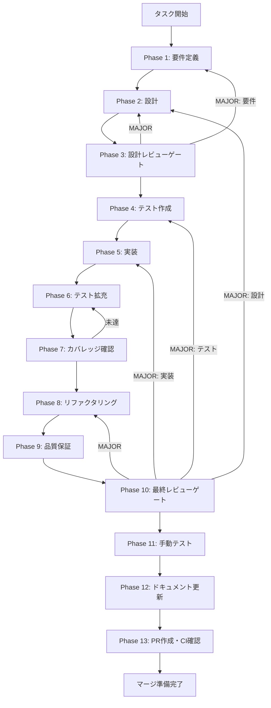

# skill-info-step-category-ui-icon - タスク実行仕様書

## ユーザーからの元の指示

```
GitHub Issue #2028: [UT-SKILL-WIZARD-CATEGORY-UI-ICON-001]
SkillInfoStep カテゴリ選択 UI 改善（アイコン・ツールチップ追加）
```

## メタ情報

| 項目         | 内容                                                                     |
| ------------ | ------------------------------------------------------------------------ |
| タスクID     | UT-SKILL-WIZARD-CATEGORY-UI-ICON-001                                     |
| タスク名     | skill-info-step-category-ui-icon                                         |
| 分類         | 改善（UI/UX）                                                            |
| 対象機能     | スキルウィザード Step 0 カテゴリ選択 UI                                  |
| 優先度       | 中                                                                       |
| 見積もり規模 | 小規模                                                                   |
| ステータス   | 完了                                                                     |
| 作成日       | 2026-04-11                                                               |
| Issue        | https://github.com/daishiman/AIWorkflowOrchestrator/issues/2028          |
| 発見元       | W1-par-02a-skill-info-step-2 Phase 12 未タスク検出レポート（2026-04-08） |

---

## 完了記録

- Phase 11: 4枚のスクリーンショットを `outputs/phase-11/screenshots/` に保存
- Phase 12: `implementation-guide.md` / `system-spec-update-summary.md` / `documentation-changelog.md` / `unassigned-task-detection.md` / `skill-feedback-report.md` / `phase12-task-spec-compliance-check.md` を current facts に同期
- `index.md` / `artifacts.json` / `outputs/artifacts.json` を `completed / blocked` 状態へ更新
- `task-workflow-completed.md` と `.claude` の LOGS を同波更新

---

## タスク概要

### 目的

`SkillInfoStep.tsx` のカテゴリ選択 UI（現在テキストラベルのみ）にアイコンとツールチップを追加し、ユーザーが直感的にカテゴリを選択できるよう UX を改善する。

### 背景

現状のカテゴリボタンはテキストラベルのみで構成されており、以下の問題がある：

1. 各カテゴリのボタンがテキストラベルのみで視覚的識別が困難
2. カテゴリの用途説明（ツールチップ）がなく、ユーザーが選択に迷う
3. `aria-label` / `title` 属性なしでアクセシビリティに改善余地あり

### 最終ゴール

- `CATEGORY_OPTIONS` に `icon`・`description` フィールドを追加
- ボタン UI にアイコン表示（絵文字またはアイコンコンポーネント）を実装
- ホバー時のツールチップ（`title` 属性 or カスタムツールチップ）を実装
- `aria-label` 属性を追加してアクセシビリティを改善
- テスト（`SkillInfoStep.test.tsx`）を更新して新フィールドを検証

### 注意事項

> `UT-SKILL-WIZARD-VALIDATION-MIN-LENGTH-001` と同一ファイルが変更対象のため、並列実施時は PR を分離すること。

### 成果物一覧

| 種別         | 成果物                         | 配置先                                                                               |
| ------------ | ------------------------------ | ------------------------------------------------------------------------------------ |
| 機能         | SkillInfoStep.tsx（更新）      | `apps/desktop/src/renderer/components/skill/wizard/SkillInfoStep.tsx`                |
| テスト       | SkillInfoStep.test.tsx（更新） | `apps/desktop/src/renderer/components/skill/wizard/__tests__/SkillInfoStep.test.tsx` |
| ドキュメント | Phase別仕様書・実装ガイド      | `docs/30-workflows/skill-info-step-category-ui-icon/outputs/`                        |
| PR           | GitHub Pull Request            | GitHub UI                                                                            |

---

## 参照ファイル

- `apps/desktop/src/renderer/components/skill/wizard/SkillInfoStep.tsx` - 変更対象コンポーネント
- `apps/desktop/src/renderer/components/skill/wizard/__tests__/SkillInfoStep.test.tsx` - 変更対象テスト
- `packages/shared/src/types/skillCreator.ts` - SkillCategory 型定義
- `.claude/skills/task-specification-creator/` - タスク仕様書スキル
- `.claude/skills/aiworkflow-requirements/references/` - システム仕様

---

## タスク分解サマリー

| ID     | フェーズ | サブタスク名                     | 責務                                         | 依存 |
| ------ | -------- | -------------------------------- | -------------------------------------------- | ---- |
| T-01-1 | Phase 1  | 要件定義・スコープ固定           | AC定義、既存コード調査、UIタスク分類宣言     | -    |
| T-02-1 | Phase 2  | UI設計・CATEGORY_OPTIONS拡張設計 | アイコン・ツールチップ実装方針決定           | T-01 |
| T-03-1 | Phase 3  | 設計レビューゲート               | PASS/MINOR/MAJOR判定                         | T-02 |
| T-04-1 | Phase 4  | テスト作成（TDD Red）            | アイコン・ツールチップ・A11yテストケース作成 | T-03 |
| T-05-1 | Phase 5  | 実装（TDD Green）                | CATEGORY_OPTIONS拡張・UI実装                 | T-04 |
| T-06-1 | Phase 6  | テスト拡充                       | エッジケース・A11y・回帰テスト追加           | T-05 |
| T-07-1 | Phase 7  | カバレッジ確認                   | 変更ブロックのLine/Branch coverage確認       | T-06 |
| T-08-1 | Phase 8  | リファクタリング                 | コード整理・重複除去                         | T-07 |
| T-09-1 | Phase 9  | 品質保証                         | lint/typecheck/test 総合確認                 | T-08 |
| T-10-1 | Phase 10 | 最終レビューゲート               | AC充足・PASS/MAJOR判定                       | T-09 |
| T-11-1 | Phase 11 | 手動テスト（Visual）             | スクリーンショット・UI/UX視覚検証            | T-10 |
| T-12-1 | Phase 12 | ドキュメント更新                 | 実装ガイド・仕様同期・未タスク検出           | T-11 |
| T-13-1 | Phase 13 | PR作成                           | ユーザー承認後のPR作成・CI確認               | T-12 |

**総サブタスク数**: 13個

---

## 実行フロー図



---

## Phase一覧

| Phase | 名称               | 仕様書                                                       | ステータス |
| ----- | ------------------ | ------------------------------------------------------------ | ---------- |
| 1     | 要件定義           | [phase-1-requirements.md](phase-1-requirements.md)           | 完了       |
| 2     | 設計               | [phase-2-design.md](phase-2-design.md)                       | 完了       |
| 3     | 設計レビューゲート | [phase-3-design-review.md](phase-3-design-review.md)         | 完了       |
| 4     | テスト作成         | [phase-4-test-creation.md](phase-4-test-creation.md)         | 完了       |
| 5     | 実装               | [phase-5-implementation.md](phase-5-implementation.md)       | 完了       |
| 6     | テスト拡充         | [phase-6-test-expansion.md](phase-6-test-expansion.md)       | 完了       |
| 7     | カバレッジ確認     | [phase-7-coverage-check.md](phase-7-coverage-check.md)       | 完了       |
| 8     | リファクタリング   | [phase-8-refactoring.md](phase-8-refactoring.md)             | 完了       |
| 9     | 品質保証           | [phase-9-quality-assurance.md](phase-9-quality-assurance.md) | 完了       |
| 10    | 最終レビューゲート | [phase-10-final-review.md](phase-10-final-review.md)         | 完了       |
| 11    | 手動テスト         | [phase-11-manual-test.md](phase-11-manual-test.md)           | 完了       |
| 12    | ドキュメント更新   | [phase-12-documentation.md](phase-12-documentation.md)       | 完了       |
| 13    | PR作成             | [phase-13-pr-creation.md](phase-13-pr-creation.md)           | blocked    |

---

## テストカバレッジ目標

### ユニットテスト

| 指標              | 最低基準 | 推奨基準 |
| ----------------- | -------- | -------- |
| Line Coverage     | 80%      | 90%      |
| Branch Coverage   | 60%      | 70%      |
| Function Coverage | 80%      | 90%      |

---

## 統合テスト連携（Phase 1〜11で必須）

| Phase | 統合テスト連携アクション                                           |
| ----- | ------------------------------------------------------------------ |
| 1     | UIコンポーネント変更の影響範囲を要件に明記                         |
| 2     | SkillInfoStep props interface 変更影響を設計に反映                 |
| 3     | アクセシビリティ（A11y）テスト観点のレビューゲートを実施           |
| 4     | アイコン・ツールチップ・A11y統合テストシナリオを作成               |
| 5     | コンポーネント実装とテスト支援コード整備                           |
| 6     | ビジュアル回帰・A11y拡充                                           |
| 7     | カバレッジ再実行とゲート判定                                       |
| 8     | リファクタ後のテスト継続成功を確認                                 |
| 9     | 品質保証で全テスト結果を確認                                       |
| 10    | 最終レビューでAC充足を確認                                         |
| 11    | 手動UI検証（アイコン表示・ツールチップ動作・アクセシビリティ確認） |

---

## Phase完了時の必須アクション

**各Phase完了時に以下を必ず実行すること:**

1. **タスク100%実行**: Phase内で指定された全タスクを完全に実行
2. **成果物確認**: 全ての必須成果物が生成されていることを検証
3. **実行記録**: 実行タスクの結果を記録
4. **artifacts.json更新**: Phase完了ステータスを更新
5. **Phase末端の実行確認**: 各タスクを100%実行し、各タスクを完遂した旨を必ず明記

```bash
# Phase完了時の検証コマンド
node .claude/skills/task-specification-creator/scripts/validate-phase-output.js \
  docs/30-workflows/skill-info-step-category-ui-icon --phase {{PHASE_NUMBER}}

# Phase完了・成果物登録
node .claude/skills/task-specification-creator/scripts/complete-phase.js \
  --workflow docs/30-workflows/skill-info-step-category-ui-icon \
  --phase {{PHASE_NUMBER}} --artifacts "..."
```
