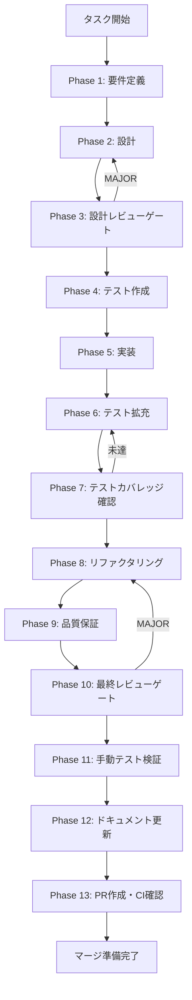

# skill-ipc-handlers-registration - タスク実行仕様書

## ユーザーからの元の指示

```
Error occurred in handler for 'skill:list-imported': Error: No handler registered for 'skill:list-imported'
    at Session.<anonymous> (node:electron/js2c/browser_init:2:107393)
    at Session.emit (node:events:519:28)

次のエラー解決のタスク仕様書を作成して。
```

## メタ情報

| 項目         | 内容                            |
| ------------ | ------------------------------- |
| タスクID     | SKILL-IPC-001                   |
| タスク名     | skill-ipc-handlers-registration |
| 分類         | バグ修正                        |
| 対象機能     | Agent画面 - スキル管理IPC通信   |
| 優先度       | 高                              |
| 見積もり規模 | 小規模                          |
| ステータス   | 未実施                          |
| 作成日       | 2026-01-16                      |

---

## タスク概要

### 目的

`registerSkillHandlers` を `registerAllIpcHandlers` から呼び出し、スキル管理IPCハンドラーを正しく登録することで、Agent画面のスキル管理機能を動作可能にする。

### 背景

Agent画面でスキル一覧を表示するために `skillAPI.listImported()` が呼び出されるが、対応するIPCハンドラー `skill:list-imported` がメインプロセスに登録されていないため、画面が無限ローディング状態になる。

**根本原因**:

- `apps/desktop/src/main/ipc/skillHandlers.ts` にハンドラー実装は存在する
- しかし `apps/desktop/src/main/ipc/index.ts` の `registerAllIpcHandlers()` で呼び出されていない

**発生エラー**:

```
Error occurred in handler for 'skill:list-imported': Error: No handler registered for 'skill:list-imported'
    at Session.<anonymous> (node:electron/js2c/browser_init:2:107393)
    at Session.emit (node:events:519:28)
```

### 最終ゴール

- Agent画面でスキル一覧が正常に表示される
- スキルのインポート・削除機能が動作する
- エラーログ `No handler registered for 'skill:list-imported'` が出なくなる
- 既存のテストが全てパスする

### 成果物一覧

| 種別         | 成果物                         | 配置先                                 |
| ------------ | ------------------------------ | -------------------------------------- |
| 機能         | IPCハンドラー登録修正          | `apps/desktop/src/main/ipc/index.ts`   |
| テスト       | 統合テスト（既存テストの活用） | `apps/desktop/src/main/ipc/__tests__/` |
| ドキュメント | Phase出力                      | `outputs/phase-*/`                     |
| PR           | GitHub Pull Request            | GitHub UI                              |

---

## 参照ファイル

本仕様書のコマンド選定は以下を参照:

- `.claude/skills/aiworkflow-requirements/references/architecture-patterns.md` - スキル管理サービス仕様
- `.claude/skills/aiworkflow-requirements/references/security-api-electron.md` - IPC通信セキュリティ

---

## タスク分解サマリー

| ID     | フェーズ | サブタスク名         | 責務                       | 依存 |
| ------ | -------- | -------------------- | -------------------------- | ---- |
| T-01-1 | Phase 1  | 要件定義             | 修正スコープ・影響範囲確認 | -    |
| T-02-1 | Phase 2  | 設計                 | 修正方針・依存関係確認     | T-01 |
| T-03-1 | Phase 3  | 設計レビュー         | 修正方針の妥当性検証       | T-02 |
| T-04-1 | Phase 4  | テスト作成           | 既存テストでRed状態確認    | T-03 |
| T-05-1 | Phase 5  | 実装                 | IPCハンドラー登録追加      | T-04 |
| T-06-1 | Phase 6  | テスト拡充           | 追加テストケース作成       | T-05 |
| T-07-1 | Phase 7  | テストカバレッジ確認 | テストカバレッジ検証       | T-06 |
| T-08-1 | Phase 8  | リファクタリング     | コード品質改善             | T-07 |
| T-09-1 | Phase 9  | 品質保証             | Lint・型チェック           | T-08 |
| T-10-1 | Phase 10 | 最終レビュー         | 全体品質確認               | T-09 |
| T-11-1 | Phase 11 | 手動テスト検証       | Agent画面動作確認          | T-10 |
| T-12-1 | Phase 12 | ドキュメント更新     | 完了報告・ドキュメント整備 | T-11 |
| T-13-1 | Phase 13 | PR作成               | コミット・PR・CI確認       | T-12 |

**総サブタスク数**: 13個

---

## 実行フロー図



---

## Phase一覧

| Phase | 名称                 | 仕様書                                                       | ステータス |
| ----- | -------------------- | ------------------------------------------------------------ | ---------- |
| 1     | 要件定義             | [phase-1-requirements.md](phase-1-requirements.md)           | 未実施     |
| 2     | 設計                 | [phase-2-design.md](phase-2-design.md)                       | 未実施     |
| 3     | 設計レビューゲート   | [phase-3-design-review.md](phase-3-design-review.md)         | 未実施     |
| 4     | テスト作成           | [phase-4-test-creation.md](phase-4-test-creation.md)         | 未実施     |
| 5     | 実装                 | [phase-5-implementation.md](phase-5-implementation.md)       | 未実施     |
| 6     | テスト拡充           | [phase-6-test-expansion.md](phase-6-test-expansion.md)       | 未実施     |
| 7     | テストカバレッジ確認 | [phase-7-coverage-check.md](phase-7-coverage-check.md)       | 未実施     |
| 8     | リファクタリング     | [phase-8-refactoring.md](phase-8-refactoring.md)             | 未実施     |
| 9     | 品質保証             | [phase-9-quality-assurance.md](phase-9-quality-assurance.md) | 未実施     |
| 10    | 最終レビューゲート   | [phase-10-final-review.md](phase-10-final-review.md)         | 未実施     |
| 11    | 手動テスト検証       | [phase-11-manual-test.md](phase-11-manual-test.md)           | 未実施     |
| 12    | ドキュメント更新     | [phase-12-documentation.md](phase-12-documentation.md)       | 未実施     |
| 13    | PR作成               | [phase-13-pr-creation.md](phase-13-pr-creation.md)           | 未実施     |

---

## テストカバレッジ目標

### ユニットテスト

| 指標              | 最低基準 | 推奨基準 |
| ----------------- | -------- | -------- |
| Line Coverage     | 80%      | 90%      |
| Branch Coverage   | 60%      | 70%      |
| Function Coverage | 80%      | 90%      |

### 結合テスト

| 指標                        | 目標 |
| --------------------------- | ---- |
| IPCハンドラー登録           | 100% |
| スキル管理APIエンドポイント | 100% |
| 正常系シナリオ              | 100% |
| 異常系シナリオ              | 80%+ |

---

## 統合テスト連携（Phase 1〜11で必須）

| Phase | 統合テスト連携アクション                    |
| ----- | ------------------------------------------- |
| 1     | IPC通信要件を要件に明記                     |
| 2     | IPCハンドラー登録設計を確認                 |
| 3     | IPC通信観点のレビューゲートを実施           |
| 4     | 既存テストでRed状態確認                     |
| 5     | IPCハンドラー登録実装                       |
| 6     | 統合テストの拡充                            |
| 7     | 統合テストの再実行とゲート判定              |
| 8     | リファクタ後の統合テスト継続成功を確認      |
| 9     | 品質保証で統合テスト結果を確認              |
| 10    | 最終レビューで統合テスト結果を確認          |
| 11    | 手動統合テスト（Agent画面UI/IPC接続）を確認 |

---

## Phase完了時の必須アクション

**各Phase完了時に以下を必ず実行すること:**

1. **タスク100%実行**: Phase内で指定された全タスクを完全に実行
2. **成果物確認**: 全ての必須成果物が生成されていることを検証
3. **実行記録**: 実行タスクの結果を記録
4. **artifacts.json更新**: Phase完了ステータスを更新
5. **Phase末端の実行確認**: 各タスクを100%実行し、各タスクを完遂した旨を必ず明記

```bash
# Phase完了時の検証コマンド
node .claude/skills/task-specification-creator/scripts/validate-phase-output.mjs \
  docs/30-workflows/skill-ipc-handlers-registration --phase {{PHASE_NUMBER}}

# Phase完了・成果物登録
node .claude/skills/task-specification-creator/scripts/complete-phase.mjs \
  --workflow docs/30-workflows/skill-ipc-handlers-registration \
  --phase {{PHASE_NUMBER}} --artifacts "..."
```

---

## 関連コード

| ファイル                                               | 役割                                           |
| ------------------------------------------------------ | ---------------------------------------------- |
| `apps/desktop/src/main/ipc/skillHandlers.ts`           | IPCハンドラー実装（既存・正常動作）            |
| `apps/desktop/src/main/services/skill/SkillService.ts` | スキルサービス（既存・正常動作）               |
| `apps/desktop/src/main/ipc/index.ts`                   | ハンドラー登録エントリポイント（**修正対象**） |
| `apps/desktop/src/renderer/views/AgentView/index.tsx`  | Agent画面UI                                    |
| `apps/desktop/src/preload/channels.ts`                 | IPCチャネル定義                                |

---

## リスクと対策

| リスク                            | 影響度 | 発生確率 | 対策                                             |
| --------------------------------- | ------ | -------- | ------------------------------------------------ |
| `SkillScanner` のbasePath設定ミス | 中     | 低       | 既存のスキルディレクトリ構造を確認してパスを設定 |
| `electron-store` の設定競合       | 低     | 低       | 専用のstore名 `skills` を使用                    |
| 他のIPCハンドラーへの影響         | 低     | 低       | 既存テストで回帰確認                             |

---

## 変更履歴

| 日付       | 変更内容                   |
| ---------- | -------------------------- |
| 2026-01-16 | 初版作成（Phase 1-13形式） |
