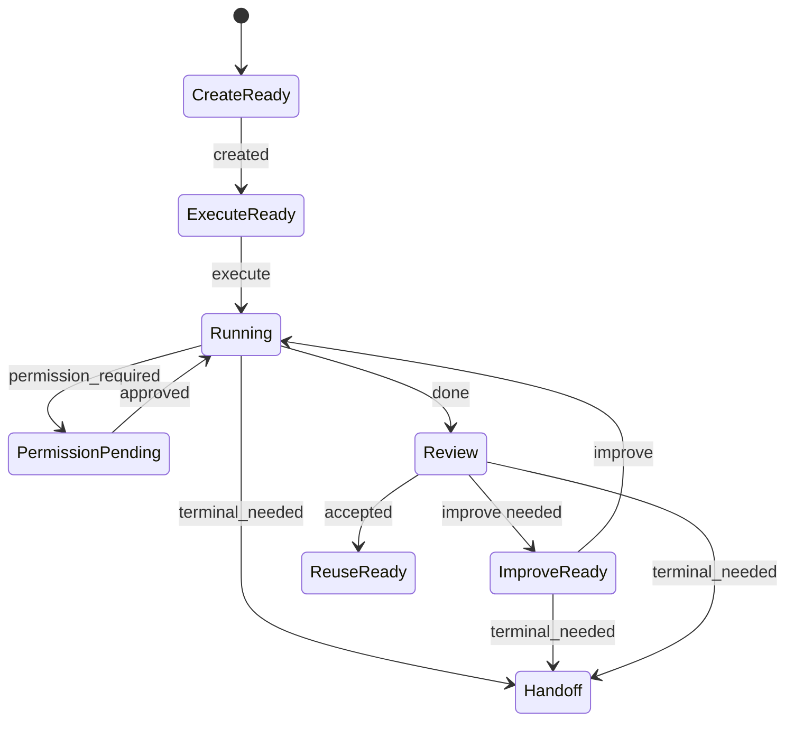
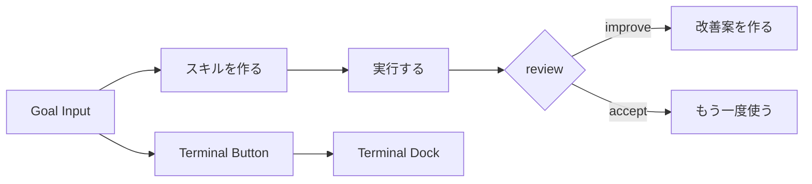
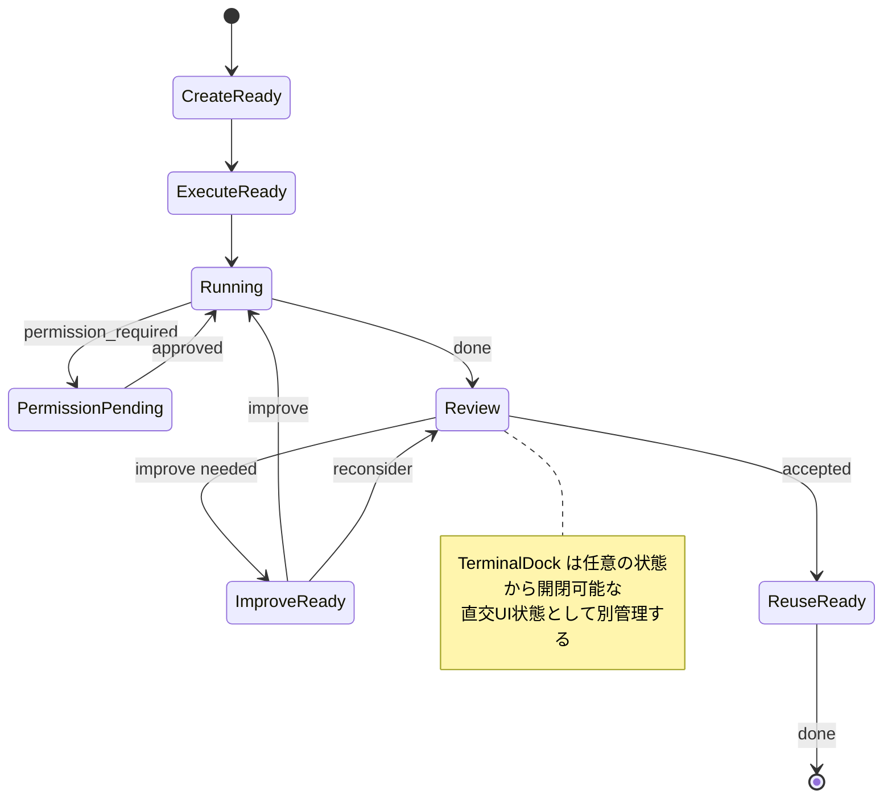
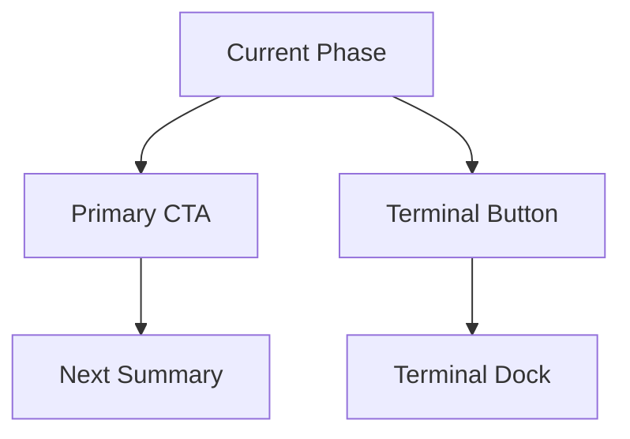
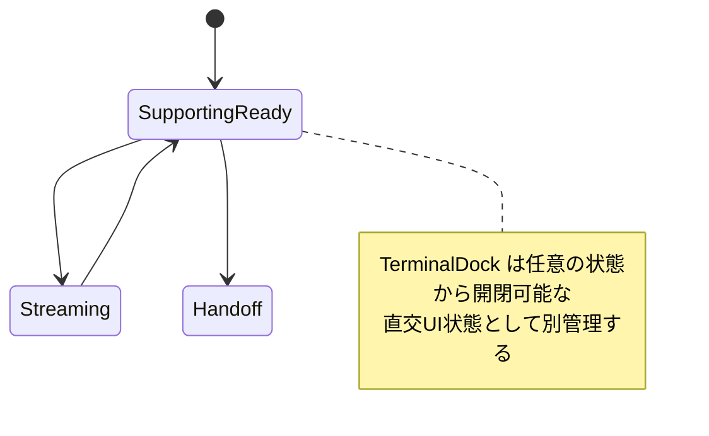
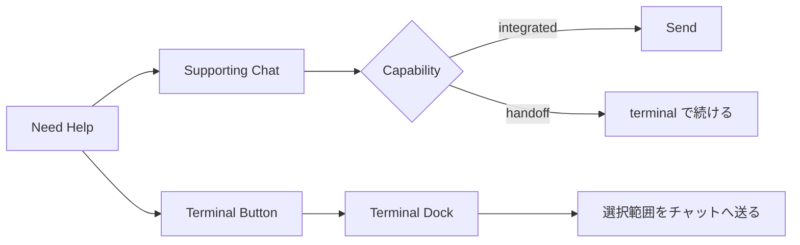

# Skill Lifecycle UI/UX 図解

## 図解フォーマット

各主要 surface ごとに、次の 5 図をそろえる。

1. 核となる責務図
2. 画面構成図
3. 状態遷移図
4. 必要マイコンポーネント図
5. CTA / handoff flow 図

## Core Journey

### 1. 核となる責務図

```text
Create -> Execute -> Improve -> Reuse
   |         |          |         |
   +---------+----------+---------+
        Supporting Chat / Terminal Continuation / Review
```

### 2. 画面構成図

```text
+------------------------------------------------------------------+
| Skill Lifecycle Header                               [Terminal]  |
+------------------------------------------------------------------+
| Goal / Constraints / Current Output                              |
+------------------------------------------------------------------+
| Primary Action / Review Summary / Handoff                        |
+------------------------------------------------------------------+
| Supporting Chat / Terminal Transcript                            |
+------------------------------------------------------------------+
```

### 3. 状態遷移図



### 4. 必要マイコンポーネント図

```text
LifecycleHeader
GoalInput
ConstraintChips
ExecutionSummary
RuntimeBanner
ImprovementSummary
QualityGateLabel
PrimaryActionButton
SupportingChatPanel
TerminalHandoffCard
PersistentTerminalLauncher
TerminalDock
```

> 注記: Core Journey 図の `ConstraintChips` は atom（単一チップ）に対応し、Skill Lifecycle Panel 図の `ConstraintChipList` は molecule（チップ一覧 + 入力）に対応する。

### 5. CTA / handoff flow 図



## Skill Lifecycle Panel

### 1. 核となる責務図

```text
SkillLifecyclePanel
  -> single visible journey
  -> one primary action
  -> current phase summary
  -> terminal always reachable
```

### 2. 画面構成図

```text
+------------------------------------------------------------------+
| Current Phase / Stepper                              [Terminal]  |
+------------------------------------------------------------------+
| Goal + Constraints                                               |
+------------------------------------------------------------------+
| Current Output Summary                                           |
+------------------------------------------------------------------+
| Primary CTA | Secondary CTA                                      |
+------------------------------------------------------------------+
| Terminal Dock / Supporting Guidance                              |
+------------------------------------------------------------------+
```

### 3. 状態遷移図



### 4. 必要マイコンポーネント図

```text
LifecycleStepper
GoalEditor
ConstraintChipList
CurrentOutputSummary
RuntimeBanner
QualityGateLabel
PrimaryActionButton
SecondaryActionLink
PersistentTerminalLauncher
TerminalDock
```

### 5. CTA / handoff flow 図



## Supporting Chat Surface

### 1. 核となる責務図

```text
Supporting Chat
  -> explain context
  -> assist current job
  -> never replace primary journey
  -> terminal escape hatch always visible
  -> transcript share is always explicit
```

### 2. 画面構成図

```text
+------------------------------------------------------------------+
| Supporting Chat Header                               [Terminal]  |
+------------------------------------------------------------------+
| Context Summary                                                  |
+------------------------------------------------------------------+
| Message Log                                                      |
+------------------------------------------------------------------+
| Composer / Handoff / Terminal Dock                               |
+------------------------------------------------------------------+
```

### 3. 状態遷移図



### 4. 必要マイコンポーネント図

```text
SupportingChatHeader
ContextSummary
MessageLog
Composer
HandoffCard
PersistentTerminalLauncher
TerminalDock
```

### 5. CTA / handoff flow 図



## 実装ギャップ一覧（GAP ID 正本）

> Task09-12 の各仕様書はこのテーブルを正本として参照する。

### UI コンポーネント GAP

| GAP ID | 説明                                                                   | 対応タスク | 関連図                         |
| ------ | ---------------------------------------------------------------------- | ---------- | ------------------------------ |
| C-02   | ヘッダーに固定 Terminal ボタンが存在しない                             | Task09     | 画面構成図 L28                 |
| C-03   | TerminalHandoffCard が import されておらず未接続                       | Task09     | マイコンポーネント図 L65       |
| C-04   | chip / constraint UI 要素が存在しない                                  | Task10     | マイコンポーネント図 L61, L139 |
| C-05   | improve ステップで quality gate 判定結果が文字ラベルで表示されていない | Task11     | マイコンポーネント図 L65       |
| C-06   | execute ステップで runtime banner が StatusBadge にとどまる            | Task11     | マイコンポーネント図 L142      |
| C-07   | improve → terminal で前回改善結果の要約転送が未実装                    | Task09     | Core Journey 図 L40            |

### 状態遷移 GAP

| GAP ID | 説明                                          | 対応タスク | 関連図                           |
| ------ | --------------------------------------------- | ---------- | -------------------------------- |
| D-01   | ReuseReady 状態が未実装                       | Task12     | Core Journey 状態遷移図 L48      |
| D-02   | TerminalDock が未接続                         | Task09     | 画面構成図 L28                   |
| D-03   | ImproveReady → Running 再実行サイクルが未実装 | Task12     | Skill Lifecycle Panel 状態遷移図 |
