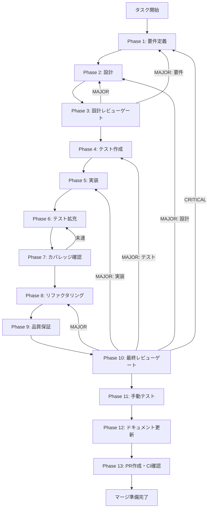

# skill-management-ui - タスク実行仕様書

## ユーザーからの元の指示

```
スキル管理UI - AGENT-002
AgentView内にスキルインポート・一覧・検索・詳細表示機能を実装し、ユーザーが必要なスキルを選択的にインポートして管理・実行できるようにする。
```

## メタ情報

| 項目         | 内容                |
| ------------ | ------------------- |
| タスクID     | AGENT-002           |
| タスク名     | skill-management-ui |
| 分類         | 要件                |
| 対象機能     | エージェント機能    |
| 優先度       | 高                  |
| 見積もり規模 | 中規模              |
| ステータス   | 未実施              |
| 作成日       | 2026-01-10          |
| 発見元       | ユーザー要求        |

---

## 依存関係と並行実行

### 依存関係マップ

```
task-agent-01-dashboard-foundation.md (AGENT-001)
    │
    ├──► task-agent-02-skill-management-ui.md (AGENT-002/本タスク)
    │
    └──► task-agent-03-skill-management-backend.md (AGENT-003) ※本タスクと並行可能
              │
              └──► task-agent-04-execution-ui.md (AGENT-004)
```

### 本タスクの位置づけ

| 項目                     | 内容                                                         |
| ------------------------ | ------------------------------------------------------------ |
| 直接依存                 | AGENT-001（エージェントダッシュボード基盤）                  |
| 並行実行可能             | AGENT-003（スキル管理バックエンド）※モックデータで並行開発可 |
| 本タスク完了後に開始可能 | AGENT-004（エージェント実行UI）                              |

---

## タスク概要

### 目的

AgentView内にスキルインポート・一覧・検索・詳細表示機能を実装し、ユーザーが必要なスキルを選択的にインポートして管理・実行できるようにする。

### 背景

Claude Codeの`.claude/skills/`ディレクトリに存在するスキルをユーザーが視覚的に確認・選択・管理できるUIが必要。現状、スキルはCLI経由でのみアクセス可能で、GUIからの管理機能がない。

**問題点・課題**:

- スキルの一覧を確認するUIがない
- スキルの詳細情報（Trigger、Anchor、説明）を表示する手段がない
- スキルを検索・フィルタリングする機能がない
- スキルを選択して実行する導線がない

**放置した場合の影響**:

- ユーザーが利用可能なスキルを把握できない
- スキル選択が困難になり、エージェント機能の利用率が低下
- スキル管理のためにCLIへ戻る必要があり、UXが悪化

### 最終ゴール

- `.claude/skills/`から利用可能なスキルを一覧表示し、インポートするスキルを選択できる
- インポート済みスキルがカード形式で表示される
- スキルを名前・Triggerキーワードで検索できる
- スキルをカテゴリでフィルタリングできる
- スキルをクリックすると詳細パネルが表示される
- 詳細パネルから実行画面へ遷移できる
- インポートしたスキル設定が永続化される

### スコープ

#### 含むもの

- SkillImportDialogコンポーネント（スキルインポート選択ダイアログ）
- SkillListコンポーネント（インポート済みカード一覧）
- SkillCardコンポーネント（個別カード）
- SkillDetailPanelコンポーネント（詳細表示）
- SkillSearchBarコンポーネント（検索バー）
- SkillCategoryFilterコンポーネント（カテゴリフィルター）
- スキルインポート/削除のIPC呼び出し
- インポート設定の永続化

#### 含まないもの

- スキル実行機能（別タスク: AGENT-004）
- スキル編集機能（スコープ外）
- スキル新規作成機能（スコープ外）
- バックエンド実装（別タスク: AGENT-003）

### 成果物一覧

| 種別         | 成果物                    | 配置先                                                                         |
| ------------ | ------------------------- | ------------------------------------------------------------------------------ |
| 機能         | SkillImportDialog         | `apps/desktop/src/renderer/components/organisms/SkillImportDialog/index.tsx`   |
| 機能         | SkillList                 | `apps/desktop/src/renderer/components/organisms/SkillList/index.tsx`           |
| 機能         | SkillCard                 | `apps/desktop/src/renderer/components/molecules/SkillCard/index.tsx`           |
| 機能         | SkillDetailPanel          | `apps/desktop/src/renderer/components/organisms/SkillDetailPanel/index.tsx`    |
| 機能         | SkillSearchBar            | `apps/desktop/src/renderer/components/molecules/SkillSearchBar/index.tsx`      |
| 機能         | SkillCategoryFilter       | `apps/desktop/src/renderer/components/molecules/SkillCategoryFilter/index.tsx` |
| 機能         | AgentView更新             | `apps/desktop/src/renderer/views/AgentView/index.tsx`                          |
| テスト       | ユニットテスト/統合テスト | `apps/desktop/src/renderer/components/**/__tests__/`                           |
| ドキュメント | 実装ガイド                | `outputs/phase-12/implementation-guide.md`                                     |
| PR           | GitHub Pull Request       | GitHub UI                                                                      |

---

## 参照ファイル

本仕様書の実装は以下のシステム仕様を参照:

| 参照資料                   | パス                                                                               | 内容                                |
| -------------------------- | ---------------------------------------------------------------------------------- | ----------------------------------- |
| UI/UXコンポーネント仕様    | `.claude/skills/aiworkflow-requirements/references/ui-ux-components.md`            | Atomic Design、コンポーネント設計   |
| UI/UXデザインシステム仕様  | `.claude/skills/aiworkflow-requirements/references/ui-ux-design-system.md`         | Glass Panel、カラー、タイポグラフィ |
| アーキテクチャパターン     | `.claude/skills/aiworkflow-requirements/references/architecture-patterns.md`       | Zustand Sliceパターン               |
| Agent SDK インターフェース | `.claude/skills/aiworkflow-requirements/references/interfaces-agent-sdk.md`        | Skill型定義、AgentState             |
| Claude Codeスキル概念      | `.claude/skills/aiworkflow-requirements/references/claude-code-skills-overview.md` | Skill定義、Progressive Disclosure   |
| 未タスク指示書（元）       | `docs/30-workflows/unassigned-task/task-agent-02-skill-management-ui.md`           | 元のタスク指示書                    |

---

## タスク分解サマリー

| ID     | フェーズ | サブタスク名               | 責務                            | 依存 |
| ------ | -------- | -------------------------- | ------------------------------- | ---- |
| T-01-1 | Phase 1  | 要件定義・受け入れ基準作成 | 機能要件・非機能要件の明確化    | -    |
| T-02-1 | Phase 2  | コンポーネント設計・型定義 | Skill型、コンポーネント構造設計 | T-01 |
| T-03-1 | Phase 3  | 設計レビュー               | 設計品質検証                    | T-02 |
| T-04-1 | Phase 4  | TDD: テストケース作成      | コンポーネントテスト作成        | T-03 |
| T-05-1 | Phase 5  | コンポーネント実装         | UI実装（Green）                 | T-04 |
| T-06-1 | Phase 6  | テスト拡充・統合テスト     | カバレッジ向上                  | T-05 |
| T-07-1 | Phase 7  | カバレッジ確認             | カバレッジゲート                | T-06 |
| T-08-1 | Phase 8  | リファクタリング           | コード品質改善                  | T-07 |
| T-09-1 | Phase 9  | 品質保証                   | Lint/型チェック/セキュリティ    | T-08 |
| T-10-1 | Phase 10 | 最終レビュー               | 全体品質検証                    | T-09 |
| T-11-1 | Phase 11 | 手動テスト                 | UX・実環境動作確認              | T-10 |
| T-12-1 | Phase 12 | ドキュメント更新           | 実装ガイド・仕様更新            | T-11 |
| T-13-1 | Phase 13 | PR作成・CI確認             | コミット・PR・マージ準備        | T-12 |

**総サブタスク数**: 13個

---

## 実行フロー図



---

## Phase一覧

| Phase | 名称               | 仕様書                                                 | ステータス |
| ----- | ------------------ | ------------------------------------------------------ | ---------- |
| 1     | 要件定義           | [phase-1-requirements.md](phase-1-requirements.md)     | 未実施     |
| 2     | 設計               | [phase-2-design.md](phase-2-design.md)                 | 未実施     |
| 3     | 設計レビューゲート | [phase-3-design-review.md](phase-3-design-review.md)   | 未実施     |
| 4     | テスト作成         | [phase-4-test-creation.md](phase-4-test-creation.md)   | 未実施     |
| 5     | 実装               | [phase-5-implementation.md](phase-5-implementation.md) | 未実施     |
| 6     | テスト拡充         | [phase-6-test-expansion.md](phase-6-test-expansion.md) | 未実施     |
| 7     | カバレッジ確認     | [phase-7-coverage-check.md](phase-7-coverage-check.md) | 未実施     |
| 8     | リファクタリング   | [phase-8-refactoring.md](phase-8-refactoring.md)       | 未実施     |
| 9     | 品質保証           | [phase-9-quality.md](phase-9-quality.md)               | 未実施     |
| 10    | 最終レビューゲート | [phase-10-final-review.md](phase-10-final-review.md)   | 未実施     |
| 11    | 手動テスト         | [phase-11-manual-test.md](phase-11-manual-test.md)     | 未実施     |
| 12    | ドキュメント更新   | [phase-12-documentation.md](phase-12-documentation.md) | 未実施     |
| 13    | PR作成             | [phase-13-pr-creation.md](phase-13-pr-creation.md)     | 未実施     |

---

## テストカバレッジ目標

### ユニットテスト

| 指標              | 最低基準 | 推奨基準 |
| ----------------- | -------- | -------- |
| Line Coverage     | 80%      | 90%      |
| Branch Coverage   | 60%      | 70%      |
| Function Coverage | 80%      | 90%      |

### 結合テスト

| 指標                         | 目標 |
| ---------------------------- | ---- |
| APIエンドポイント            | 100% |
| モジュール間インターフェース | 100% |
| 正常系シナリオ               | 100% |
| 異常系シナリオ               | 80%+ |
| 外部連携ポイント             | 100% |

---

## 統合テスト連携（Phase 1〜11で必須）

各Phaseで以下の統合テスト連携アクションを実施すること:

| Phase | 統合テスト連携アクション                                |
| ----- | ------------------------------------------------------- |
| 1     | 接続要件（IPC/スキルパーサー/データフロー）を要件に明記 |
| 2     | 統合ポイント/契約（IPC API・Skill型）を設計に反映       |
| 3     | 統合テスト観点のレビューゲートを実施                    |
| 4     | 統合テストシナリオを全カテゴリで作成                    |
| 5     | UI/IPC接続の実装とテスト支援コード整備                  |
| 6     | 統合テストの拡充（全カテゴリのカバレッジ向上）          |
| 7     | 統合テストの再実行とゲート判定                          |
| 8     | リファクタ後の統合テスト継続成功を確認                  |
| 9     | 品質保証で統合テスト結果を確認                          |
| 10    | 最終レビューで統合テスト結果を確認                      |
| 11    | 手動統合テスト（UI/IPC接続）を確認                      |

---

## Phase完了時の必須アクション

**各Phase完了時に以下を必ず実行すること:**

1. **タスク100%実行**: Phase内で指定された全タスクを完全に実行
2. **成果物確認**: 全ての必須成果物が生成されていることを検証
3. **実行記録**: 実行タスクの結果を記録
4. **artifacts.json更新**: Phase完了ステータスを更新
5. **Phase末端の実行確認**: 各タスクを100%実行し、各タスクを完遂した旨を必ず明記

```bash
# Phase完了時の検証コマンド
node .claude/skills/task-specification-creator/scripts/validate-phase-output.mjs docs/30-workflows/skill-management-ui --phase <PHASE_NUMBER>

# Phase完了・成果物登録
node .claude/skills/task-specification-creator/scripts/complete-phase.mjs \
  --workflow docs/30-workflows/skill-management-ui --phase <PHASE_NUMBER> --artifacts "..."
```

---

## 変更履歴

| Version | Date       | Changes                                |
| ------- | ---------- | -------------------------------------- |
| 1.0.0   | 2026-01-10 | 初版作成（タスク仕様書生成スキル使用） |
