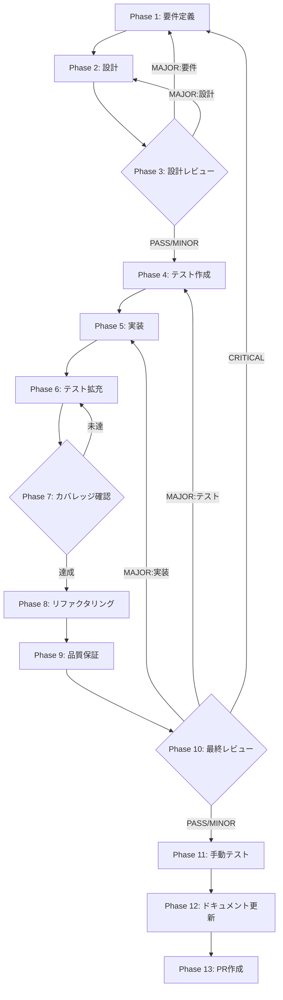

# SkillExecutor リトライ機構実装 - タスク仕様書

## ユーザーの元の指示

GitHub Issue #584: SkillExecutorにExponential Backoff with Jitterパターンのリトライ機構を実装し、一時的なエラーからの自動回復を可能にする。

## メタ情報

| 項目         | 内容                                                                      |
| ------------ | ------------------------------------------------------------------------- |
| タスクID     | TASK-SKILL-RETRY-001                                                      |
| タスク名     | SkillExecutor リトライ機構実装                                            |
| 機能名       | skillexecutor-retry-mechanism                                             |
| 分類         | feat（改善）                                                              |
| 対象機能     | SkillExecutor (Main Process)                                              |
| 優先度       | 中                                                                        |
| 見積もり規模 | 中規模                                                                    |
| ステータス   | 未実施                                                                    |
| GitHub Issue | [#584](https://github.com/daishiman/AIWorkflowOrchestrator/issues/584)    |
| 発見元       | aiworkflow-requirements残課題                                             |
| 発見日       | 2026-01-30                                                                |
| 仕様書パス   | `docs/30-workflows/unassigned-task/task-skillexecutor-retry-mechanism.md` |

---

## タスク概要

### 目的

SkillExecutorにExponential Backoff with Jitterパターンのリトライ機構を実装し、一時的なネットワーク障害やAPI rate limitからの自動回復を可能にする。

### 背景

TASK-3-1-A（SkillExecutor実装）でClaude Agent SDK query() API統合を完了したが、一時的なネットワーク障害やAPI rate limitに対するリトライ機構は未実装である。現在はエラー発生時に即座に失敗として処理されるため、ユーザーが手動で再実行する必要がある。

### 最終ゴール

- 一時的なネットワークエラー（ECONNRESET, ETIMEDOUT）で自動リトライ
- API rate limit (429) 発生時にRetry-Afterヘッダーに基づくリトライ
- 5xxサーバーエラーで自動リトライ
- 設定可能なリトライ回数・間隔
- リトライ状態のストリーミング通知（`skill:retry`イベント）
- abort()によるリトライキャンセル

### 成果物

| 成果物                   | ファイルパス                                                                 | 種別 |
| ------------------------ | ---------------------------------------------------------------------------- | ---- |
| リトライロジック         | `apps/desktop/src/main/services/skill/SkillExecutor.ts`（更新）              | code |
| リトライ設定型           | `packages/shared/src/types/skill.ts`（追加）                                 | code |
| ストリーミングイベント型 | `packages/shared/src/types/skill.ts`（追加）                                 | code |
| ユニットテスト           | `apps/desktop/src/main/services/skill/__tests__/SkillExecutor.retry.test.ts` | test |

---

## 参照ファイル

| ドキュメント                         | パス                                                                                    | 用途                    |
| ------------------------------------ | --------------------------------------------------------------------------------------- | ----------------------- |
| SkillExecutor/PermissionResolver仕様 | `.claude/skills/aiworkflow-requirements/references/interfaces-agent-sdk-executor.md`    | 現在のSkillExecutor仕様 |
| エラーハンドリング仕様               | `.claude/skills/aiworkflow-requirements/references/error-handling.md`                   | リトライ戦略定義        |
| Agent SDK統合仕様                    | `.claude/skills/aiworkflow-requirements/references/interfaces-agent-sdk-integration.md` | 型定義参照              |
| アーキテクチャ概要                   | `.claude/skills/aiworkflow-requirements/references/architecture-overview.md`            | 層構成確認              |
| 元タスク指示書                       | `docs/30-workflows/unassigned-task/task-skillexecutor-retry-mechanism.md`               | 元タスク定義            |

---

## タスク分解サマリー

| Phase | 名称                 | カテゴリ     | 主要タスク                                        |
| ----- | -------------------- | ------------ | ------------------------------------------------- |
| 1     | 要件定義             | 要件         | 既存実装分析、リトライ対象エラー定義、要件確定    |
| 2     | 設計                 | 設計         | リトライアルゴリズム設計、型定義設計、API設計     |
| 3     | 設計レビューゲート   | ゲート       | 設計品質検証、リトライ戦略妥当性確認              |
| 4     | テスト作成           | TDD-Red      | リトライテスト先行作成（全テストFail状態）        |
| 5     | 実装                 | TDD-Green    | RetryConfig型、isRetryableError、executeWithRetry |
| 6     | テスト拡充           | 品質         | エッジケース、並行リトライ、abort連携テスト       |
| 7     | テストカバレッジ確認 | 品質         | カバレッジ計測、不足分の補完                      |
| 8     | リファクタリング     | TDD-Refactor | コード品質改善、関数分離、命名統一                |
| 9     | 品質保証             | 品質         | TypeScript strict、ESLint、Prettier               |
| 10    | 最終レビューゲート   | ゲート       | 全体品質検証、完了条件確認                        |
| 11    | 手動テスト検証       | 検証         | 開発環境でのリトライ動作確認                      |
| 12    | ドキュメント更新     | 文書化       | 実装ガイド、仕様書更新、未タスク検出              |
| 13    | PR作成               | 完了         | PR作成・CI確認                                    |

---

## 実行フロー



---

## Phase一覧

| Phase | 仕様書ファイル                                           |
| ----- | -------------------------------------------------------- |
| 1     | [phase-1-requirements.md](./phase-1-requirements.md)     |
| 2     | [phase-2-design.md](./phase-2-design.md)                 |
| 3     | [phase-3-design-review.md](./phase-3-design-review.md)   |
| 4     | [phase-4-test-creation.md](./phase-4-test-creation.md)   |
| 5     | [phase-5-implementation.md](./phase-5-implementation.md) |
| 6     | [phase-6-test-expansion.md](./phase-6-test-expansion.md) |
| 7     | [phase-7-coverage-check.md](./phase-7-coverage-check.md) |
| 8     | [phase-8-refactoring.md](./phase-8-refactoring.md)       |
| 9     | [phase-9-quality.md](./phase-9-quality.md)               |
| 10    | [phase-10-final-review.md](./phase-10-final-review.md)   |
| 11    | [phase-11-manual-test.md](./phase-11-manual-test.md)     |
| 12    | [phase-12-documentation.md](./phase-12-documentation.md) |
| 13    | [phase-13-pr-creation.md](./phase-13-pr-creation.md)     |

---

## テストカバレッジ目標

### ユニットテスト

| メトリクス | 最低基準 | 推奨基準 |
| ---------- | -------- | -------- |
| Line       | 80%      | 90%      |
| Branch     | 60%      | 70%      |
| Function   | 80%      | 90%      |

### 統合テスト

| メトリクス                 | 基準 |
| -------------------------- | ---- |
| リトライ対象エラーシナリオ | 100% |
| 正常系シナリオ             | 100% |
| 異常系シナリオ             | 80%  |

---

## 統合テスト連携アクション

| Phase | 統合テスト連携アクション                                   |
| ----- | ---------------------------------------------------------- |
| 1     | リトライ対象エラーパターンの統合テスト観点を要件に含める   |
| 2     | SkillExecutor既存テストとの統合設計                        |
| 3     | 統合テスト設計の妥当性をレビュー                           |
| 4     | リトライ→正常完了の統合テストケースを作成                  |
| 5     | 既存テストがGreenであることを維持しながら実装              |
| 6     | abort連携、並行実行との統合テストを追加                    |
| 7     | リトライロジック単体 + SkillExecutor統合のカバレッジを計測 |
| 8     | リファクタリング後の既存テスト全パス確認                   |
| 9     | TypeScript strict + ESLint + 既存テストとの整合性確認      |
| 10    | 全テスト実行 + カバレッジ基準達成を最終確認                |
| 11    | 開発環境でネットワーク障害シミュレーション実行             |

---

## Phase完了時必須アクション

各Phase完了時に以下を実行:

```bash
# Phase完了処理
node .claude/skills/task-specification-creator/scripts/complete-phase.js \
  --workflow docs/30-workflows/skillexecutor-retry-mechanism \
  --phase {{N}} \
  --artifacts "outputs/phase-{{N}}/{{FILE}}.md:{{DESCRIPTION}}"
```

---

## 出力ファイル構成

```
docs/30-workflows/skillexecutor-retry-mechanism/
  index.md                        # このファイル
  artifacts.json                  # 成果物レジストリ
  phase-1-requirements.md         # Phase 1: 要件定義
  phase-2-design.md               # Phase 2: 設計
  phase-3-design-review.md        # Phase 3: 設計レビューゲート
  phase-4-test-creation.md        # Phase 4: テスト作成
  phase-5-implementation.md       # Phase 5: 実装
  phase-6-test-expansion.md       # Phase 6: テスト拡充
  phase-7-coverage-check.md       # Phase 7: テストカバレッジ確認
  phase-8-refactoring.md          # Phase 8: リファクタリング
  phase-9-quality.md              # Phase 9: 品質保証
  phase-10-final-review.md        # Phase 10: 最終レビューゲート
  phase-11-manual-test.md         # Phase 11: 手動テスト検証
  phase-12-documentation.md       # Phase 12: ドキュメント更新
  phase-13-pr-creation.md         # Phase 13: PR作成
  outputs/                        # Phase別成果物
    phase-1/
    phase-2/
    ...
```
