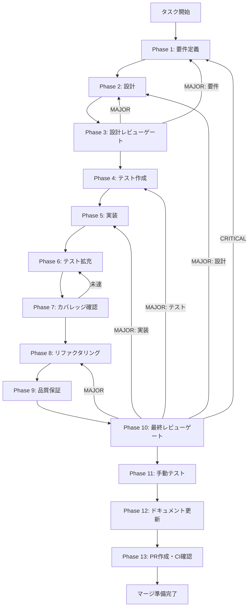

# slide-agent-sdk-integration - タスク実行仕様書

## ユーザーからの元の指示

```
skill-executor.tsおよびagent-client.tsにClaude Agent SDKを統合し、
スキルフェーズ（hearing/structure/html/modifier）を実際に実行できるようにする。
現在のシミュレーション実装を実際のAgent SDK呼び出しに置換する。
```

## メタ情報

| 項目         | 内容                                     |
| ------------ | ---------------------------------------- |
| タスクID     | task-imp-slide-agent-sdk-integration-001 |
| タスク名     | slide-agent-sdk-integration              |
| 分類         | 改善 (imp)                               |
| 対象機能     | スライド依存関係管理・スキル実行機能     |
| 優先度       | 中                                       |
| 見積もり規模 | 中規模（2-3 Phase、2-5日）               |
| ステータス   | 未実施                                   |
| 作成日       | 2026-01-16                               |

---

## タスク概要

### 目的

skill-executor.tsおよびagent-client.tsに Claude Agent SDK（`@anthropic-ai/claude-agent-sdk`）を統合し、スライドプレゼンテーション機能で使用するスキルフェーズ（hearing/structure/html/modifier）を実際に実行できるようにする。現在のシミュレーション（スタブ）実装を実際のAPI呼び出しに置換することで、ファイル変更検知からスキル実行、ファイル更新までの一連のフローを動作させる。

### 背景

slide-dependency-management機能およびslide-reverse-sync機能の実装において、skill-executor.tsとagent-client.tsにスキル実行ロジックが実装されています。しかし、現在の実装ではスキル実行部分がスタブ（シミュレーション）となっており、実際のClaude Agent SDKとの統合が未完了です。

- `skill-executor.ts:87-89` にTODOコメント
- `agent-client.ts:192` にTODOコメント
- 両ファイルともシミュレーション実装で1秒後に応答を返すダミー処理

### 最終ゴール

1. skill-executor.tsがClaude Agent SDKを通じてスキルを実行できる
2. agent-client.tsが実際のAgent SDK API呼び出しを行う
3. structure.md変更検知 → html-generatorスキル自動実行 → index.html更新の一連のフローが動作する
4. ModifierSkill（HTML→structure.md逆同期）が実動作する
5. 進捗コールバックが正しくUI（SyncStatusIndicator）に反映される
6. APIキーがsafeStorageで暗号化保存される
7. 30秒タイムアウト・キャンセル機能が正常動作する

### 成果物一覧

| 種別         | 成果物                | 配置先                                     |
| ------------ | --------------------- | ------------------------------------------ |
| 機能         | skill-executor.ts更新 | `apps/desktop/src/main/slide/`             |
| 機能         | agent-client.ts更新   | `apps/desktop/src/main/slide/`             |
| テスト       | 統合テスト追加        | `apps/desktop/src/**/*.test.ts`            |
| ドキュメント | 実装ガイド            | `outputs/phase-12/implementation-guide.md` |
| PR           | GitHub Pull Request   | GitHub UI                                  |

---

## 参照ファイル

本仕様書のコマンド選定は以下を参照：

- `docs/00-requirements/master_system_design.md` - システム要件
- `.claude/skills/aiworkflow-requirements/references/` - システム仕様
- `.claude/skills/aiworkflow-requirements/references/interfaces-agent-sdk.md` - Agent SDK仕様

---

## タスク分解サマリー

| ID     | フェーズ | サブタスク名          | 責務                        | 依存 |
| ------ | -------- | --------------------- | --------------------------- | ---- |
| T-01-1 | Phase 1  | 要件抽出              | SDK統合要件・非機能要件定義 | -    |
| T-01-2 | Phase 1  | 受け入れ基準作成      | 検証可能なAC定義            | -    |
| T-02-1 | Phase 2  | アーキテクチャ設計    | SDK統合アーキテクチャ設計   | T-01 |
| T-02-2 | Phase 2  | API設計               | Agent SDK呼び出しAPI設計    | T-01 |
| T-03-1 | Phase 3  | 設計レビュー          | 設計妥当性検証              | T-02 |
| T-04-1 | Phase 4  | ユニットテスト作成    | SDK連携のテスト作成（Red）  | T-03 |
| T-04-2 | Phase 4  | 統合テスト作成        | エンドツーエンドテスト作成  | T-03 |
| T-05-1 | Phase 5  | skill-executor.ts更新 | SDK統合実装                 | T-04 |
| T-05-2 | Phase 5  | agent-client.ts更新   | 実API呼び出し実装           | T-04 |
| T-06-1 | Phase 6  | テスト拡充            | カバレッジ向上              | T-05 |
| T-07-1 | Phase 7  | カバレッジ確認        | 基準達成確認                | T-06 |
| T-08-1 | Phase 8  | リファクタリング      | コード品質改善              | T-07 |
| T-09-1 | Phase 9  | 品質保証              | 品質ゲートクリア確認        | T-08 |
| T-10-1 | Phase 10 | 最終レビュー          | 全体品質検証                | T-09 |
| T-11-1 | Phase 11 | 手動テスト            | UI/UX・実環境動作確認       | T-10 |
| T-12-1 | Phase 12 | ドキュメント作成      | 実装ガイド・API参照         | T-11 |
| T-13-1 | Phase 13 | PR作成                | PR作成・CI確認              | T-12 |

**総サブタスク数**: 17個

---

## 実行フロー図



---

## Phase一覧

| Phase | 名称               | 仕様書                                                 | ステータス |
| ----- | ------------------ | ------------------------------------------------------ | ---------- |
| 1     | 要件定義           | [phase-1-requirements.md](phase-1-requirements.md)     | 未実施     |
| 2     | 設計               | [phase-2-design.md](phase-2-design.md)                 | 未実施     |
| 3     | 設計レビューゲート | [phase-3-design-review.md](phase-3-design-review.md)   | 未実施     |
| 4     | テスト作成         | [phase-4-test-creation.md](phase-4-test-creation.md)   | 未実施     |
| 5     | 実装               | [phase-5-implementation.md](phase-5-implementation.md) | 未実施     |
| 6     | テスト拡充         | [phase-6-test-expansion.md](phase-6-test-expansion.md) | 未実施     |
| 7     | カバレッジ確認     | [phase-7-coverage-check.md](phase-7-coverage-check.md) | 未実施     |
| 8     | リファクタリング   | [phase-8-refactoring.md](phase-8-refactoring.md)       | 未実施     |
| 9     | 品質保証           | [phase-9-quality.md](phase-9-quality.md)               | 未実施     |
| 10    | 最終レビューゲート | [phase-10-final-review.md](phase-10-final-review.md)   | 未実施     |
| 11    | 手動テスト         | [phase-11-manual-test.md](phase-11-manual-test.md)     | 未実施     |
| 12    | ドキュメント更新   | [phase-12-documentation.md](phase-12-documentation.md) | 未実施     |
| 13    | PR作成             | [phase-13-pr-creation.md](phase-13-pr-creation.md)     | 未実施     |

---

## テストカバレッジ目標

### ユニットテスト

| 指標              | 最低基準 | 推奨基準 |
| ----------------- | -------- | -------- |
| Line Coverage     | 80%      | 90%      |
| Branch Coverage   | 60%      | 70%      |
| Function Coverage | 80%      | 90%      |

### 結合テスト

| 指標                         | 目標 |
| ---------------------------- | ---- |
| APIエンドポイント            | 100% |
| モジュール間インターフェース | 100% |
| 正常系シナリオ               | 100% |
| 異常系シナリオ               | 80%+ |
| 外部連携ポイント             | 100% |

---

## 統合テスト連携（Phase 1〜11で必須）

各Phaseで以下の統合テスト連携アクションを実施すること:

| Phase | 統合テスト連携アクション                                     |
| ----- | ------------------------------------------------------------ |
| 1     | SDK接続要件（API認証・タイムアウト・エラー処理）を要件に明記 |
| 2     | Agent SDK統合ポイント・APIスキーマを設計に反映               |
| 3     | SDK統合観点のレビューゲートを実施                            |
| 4     | SDK統合テストシナリオを全カテゴリで作成                      |
| 5     | SDK接続実装とモック統合テスト支援コード整備                  |
| 6     | SDK統合テストの拡充（全カテゴリのカバレッジ向上）            |
| 7     | SDK統合テストの再実行とゲート判定                            |
| 8     | リファクタ後のSDK統合テスト継続成功を確認                    |
| 9     | 品質保証でSDK統合テスト結果を確認                            |
| 10    | 最終レビューでSDK統合テスト結果を確認                        |
| 11    | 手動SDK統合テスト（実API接続・UI表示）を確認                 |

---

## Phase完了時の必須アクション

**各Phase完了時に以下を必ず実行すること:**

1. **タスク100%実行**: Phase内で指定された全タスクを完全に実行
2. **成果物確認**: 全ての必須成果物が生成されていることを検証
3. **実行記録**: 実行タスクの結果を記録
4. **artifacts.json更新**: Phase完了ステータスを更新
5. **Phase末端の実行確認**: 各タスクを100%実行し、各タスクを完遂した旨を必ず明記

```bash
# Phase完了時の検証コマンド
node .claude/skills/task-specification-creator/scripts/validate-phase-output.mjs docs/30-workflows/slide-agent-sdk-integration --phase {{PHASE_NUMBER}}

# Phase完了・成果物登録
node .claude/skills/task-specification-creator/scripts/complete-phase.mjs \
  --workflow docs/30-workflows/slide-agent-sdk-integration --phase {{PHASE_NUMBER}} --artifacts "..."
```

---

## 対象ファイル一覧

| ファイル                                        | 変更内容                             |
| ----------------------------------------------- | ------------------------------------ |
| `apps/desktop/src/main/slide/skill-executor.ts` | シミュレーション→実SDK呼び出しに置換 |
| `apps/desktop/src/main/slide/agent-client.ts`   | シミュレーション→実SDK API呼び出し   |
| `packages/shared/package.json`                  | SDK依存追加（必要時）                |
| `apps/desktop/package.json`                     | SDK依存追加（必要時）                |

---

## 前提条件

- Claude Agent SDK（`@anthropic-ai/claude-agent-sdk`）がインストールされていること
- 既存のslide-dependency-management実装が理解されていること
- 既存のslide-reverse-sync実装が理解されていること
- Agent SDK統合基盤（interfaces-agent-sdk.md）の仕様を理解していること

---

## リスクと対策

| リスク                       | 対策                                                       |
| ---------------------------- | ---------------------------------------------------------- |
| Agent SDKのAPIが想定と異なる | interfaces-agent-sdk.mdの成果物を参照し、API仕様を確認     |
| 非同期処理のタイミング問題   | AbortController + async/awaitで適切に制御                  |
| メモリリーク                 | 使用後のリソース解放を明示的に実装                         |
| スキル実行の失敗             | リトライロジックの検討（ただし本タスクスコープ外の可能性） |
| APIキーの漏洩                | safeStorageで暗号化保存、環境変数経由で取得                |

---

## 参照リソース

### システム仕様（aiworkflow-requirements）

> 実装前に必ず以下のシステム仕様を確認し、既存設計との整合性を確保してください。

| 参照資料       | パス                                                                        | 内容                    |
| -------------- | --------------------------------------------------------------------------- | ----------------------- |
| Agent SDK仕様  | `.claude/skills/aiworkflow-requirements/references/interfaces-agent-sdk.md` | SDK統合インターフェース |
| アーキテクチャ | `.claude/skills/aiworkflow-requirements/references/architecture-*.md`       | システムアーキテクチャ  |
| 技術スタック   | `.claude/skills/aiworkflow-requirements/references/technology-*.md`         | 技術選定・環境設定      |

### 関連タスク

| ドキュメント                    | パス                                                                            |
| ------------------------------- | ------------------------------------------------------------------------------- |
| slide-dependency-management実装 | `docs/30-workflows/slide-dependency-management/`                                |
| slide-reverse-sync実装          | `docs/30-workflows/slide-reverse-sync/`                                         |
| Agent SDK統合基盤               | `docs/30-workflows/agent-sdk-integration/`                                      |
| 未完了タスク元指示書            | `docs/30-workflows/unassigned-task/task-imp-slide-agent-sdk-integration-001.md` |

---

**最終更新**: 2026-01-16
