# シーケンス設計書 - slide-agent-sdk-integration

## メタ情報

| 項目       | 内容                                     |
| ---------- | ---------------------------------------- |
| タスクID   | task-imp-slide-agent-sdk-integration-001 |
| Phase      | 2                                        |
| 作成日     | 2026-01-17                               |
| ステータス | 完了                                     |

---

## 概要

本ドキュメントは、Claude Agent SDK統合における処理シーケンスを設計する。正常系、異常系、キャンセルの各フローを定義する。

---

## 正常系シーケンス

### スキル実行フロー（順方向同期）

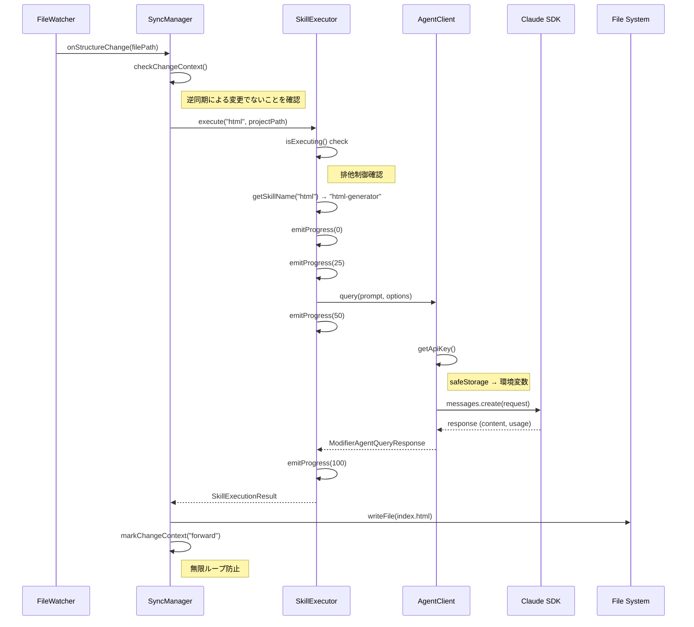

### スキル実行フロー（逆方向同期 - ModifierSkill）

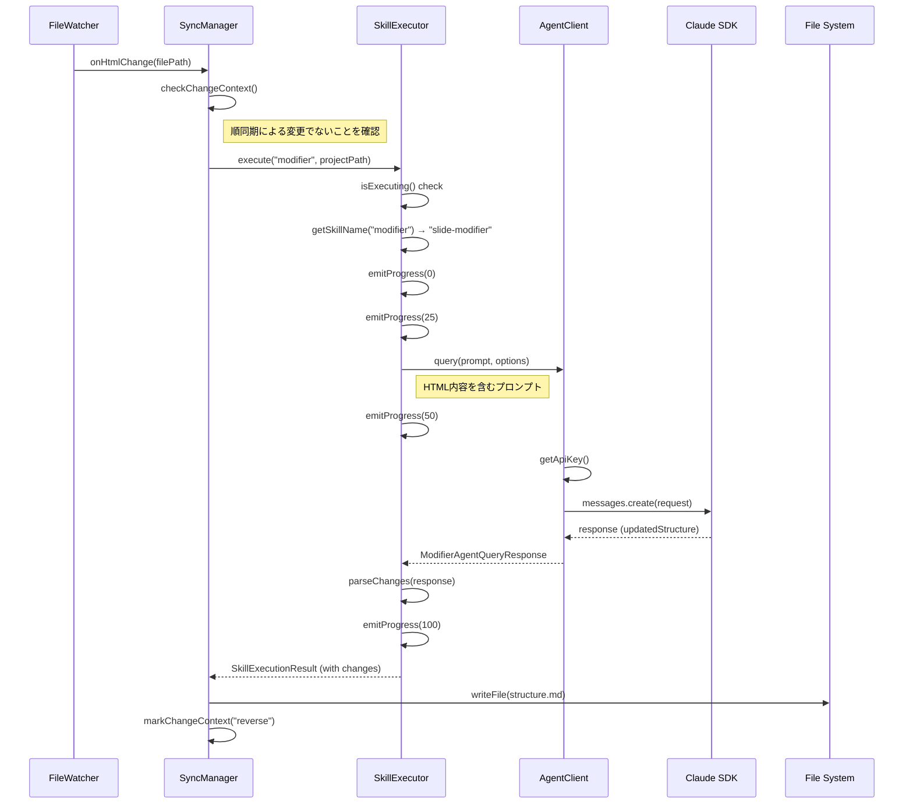

---

## キャンセルシーケンス

### ユーザーキャンセルフロー

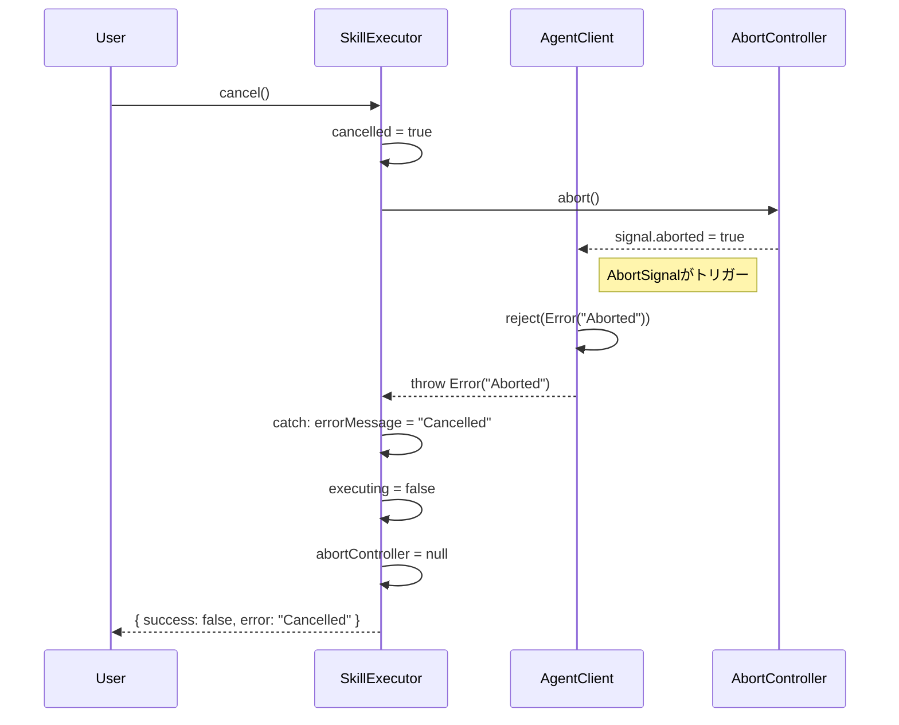

### AbortController詳細フロー

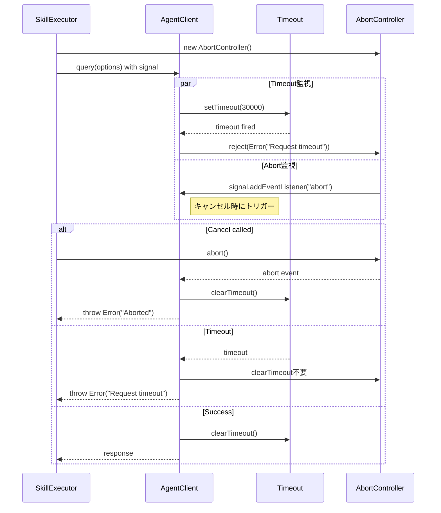

---

## エラーシーケンス

### タイムアウトエラーフロー

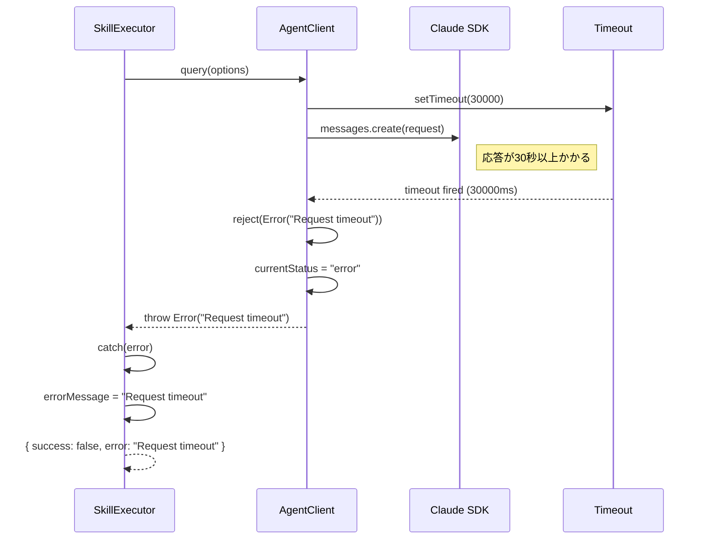

### API認証エラーフロー

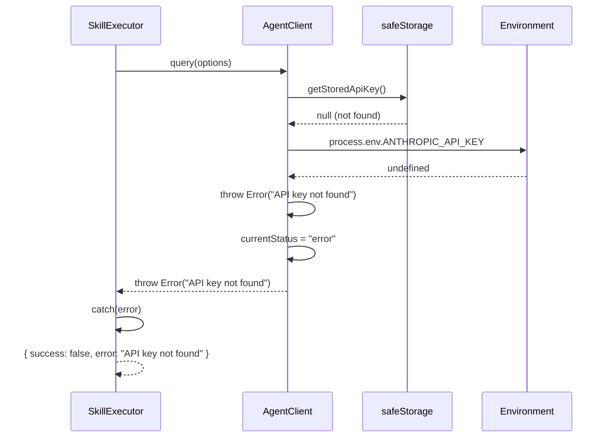

### SDK呼び出しエラーフロー

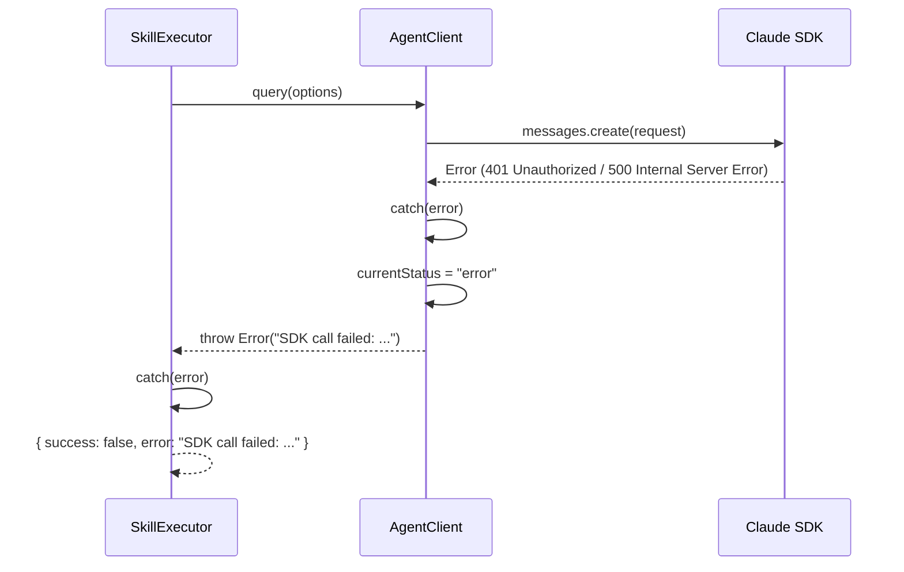

### 排他エラーフロー

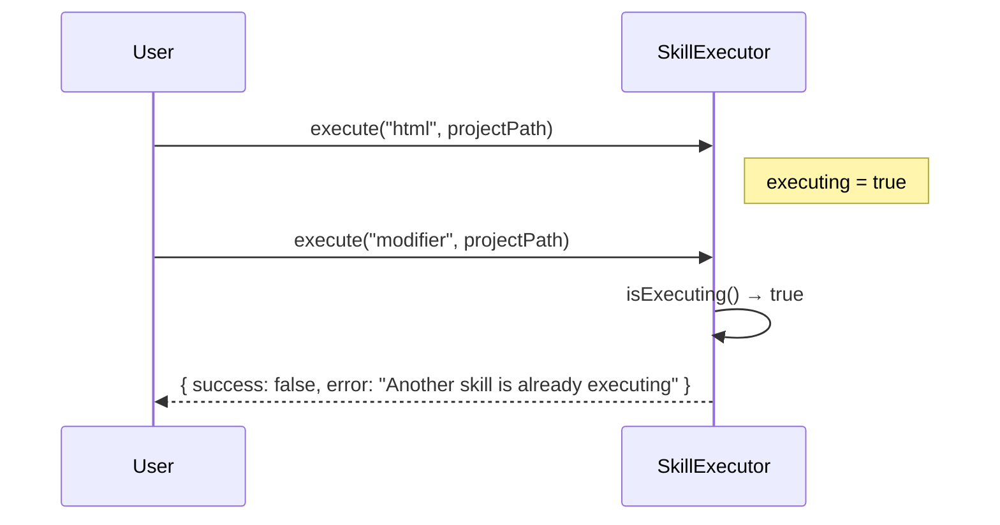

---

## 進捗通知シーケンス

### 進捗コールバックフロー

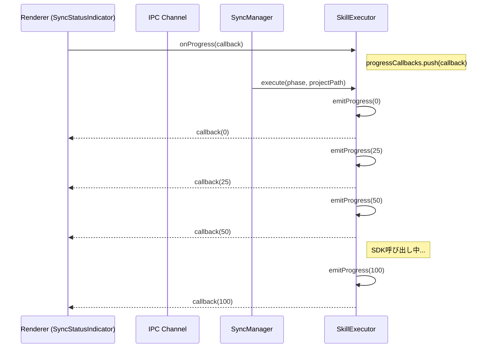

---

## メッセージ通知シーケンス

### SDKメッセージフロー

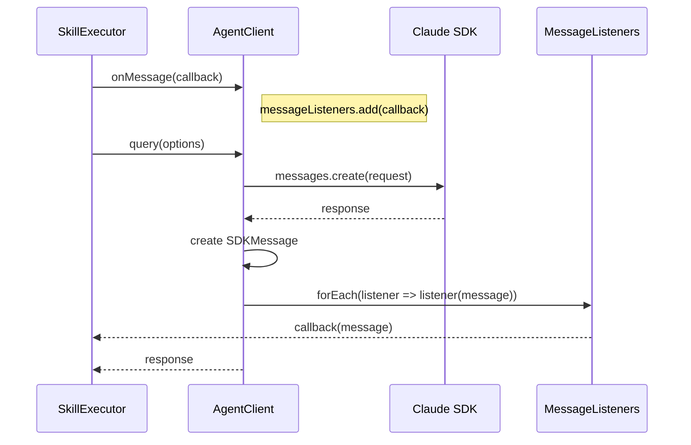

---

## 状態遷移図

### AgentClient状態

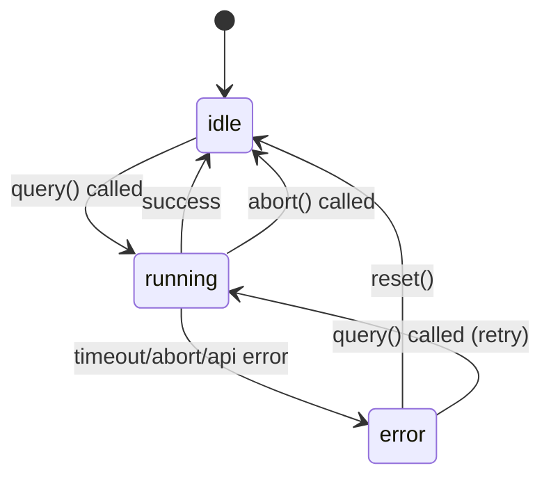

### SkillExecutor状態

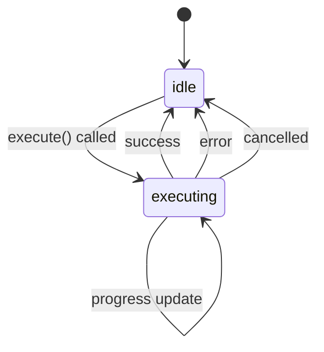

---

## タイミング図

### 正常実行タイミング

```
Time:  0ms    25ms   50ms   ------   2000ms  2100ms
       |      |      |              |       |
       v      v      v              v       v
SE:    [START][SKILL_NAME][API_CALL]........[COMPLETE]
AC:           |      [QUERY_START]--[RESPONSE]
SDK:                 |----[PROCESSING]-----|
Progress: 0%   25%   50%                   100%
```

### タイムアウトタイミング

```
Time:  0ms    25ms   50ms   ------   30000ms 30100ms
       |      |      |              |       |
       v      v      v              v       v
SE:    [START][SKILL_NAME][API_CALL]........[TIMEOUT_ERROR]
AC:           |      [QUERY_START]--[TIMEOUT]
SDK:                 |----[PROCESSING...]---|
Progress: 0%   25%   50%                   (error)
```

---

## エラーリカバリ設計

### リカバリ戦略

| エラー種別        | リカバリ | 説明                   |
| ----------------- | -------- | ---------------------- |
| タイムアウト      | なし     | ユーザーに再試行を促す |
| 認証エラー        | なし     | APIキー設定を促す      |
| SDK呼び出しエラー | なし     | エラーメッセージ表示   |
| キャンセル        | なし     | 正常なキャンセル処理   |
| 排他エラー        | なし     | 前の実行完了を待つ     |

**注**: リトライロジックは本タスクのスコープ外（将来タスク）

### リソースクリーンアップ

```typescript
// SkillExecutor finally ブロック
finally {
  executing = false;
  abortController = null;
}

// AgentClient finally ブロック
finally {
  currentAbortController = null;
  currentStatus = currentStatus === "running" ? "idle" : currentStatus;
}
```

---

## IPC通信シーケンス（参考）

### 進捗通知IPC

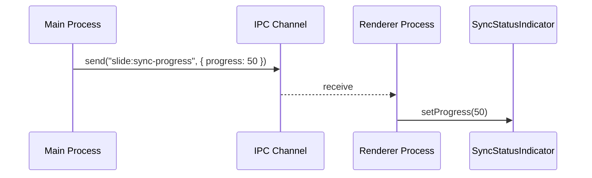

### エラー通知IPC

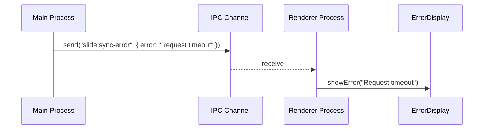

---

## 次のステップ

Phase 3: 設計レビューゲート - 設計の妥当性検証

---

**作成日**: 2026-01-17
**Phase 2 タスク3 完了**
