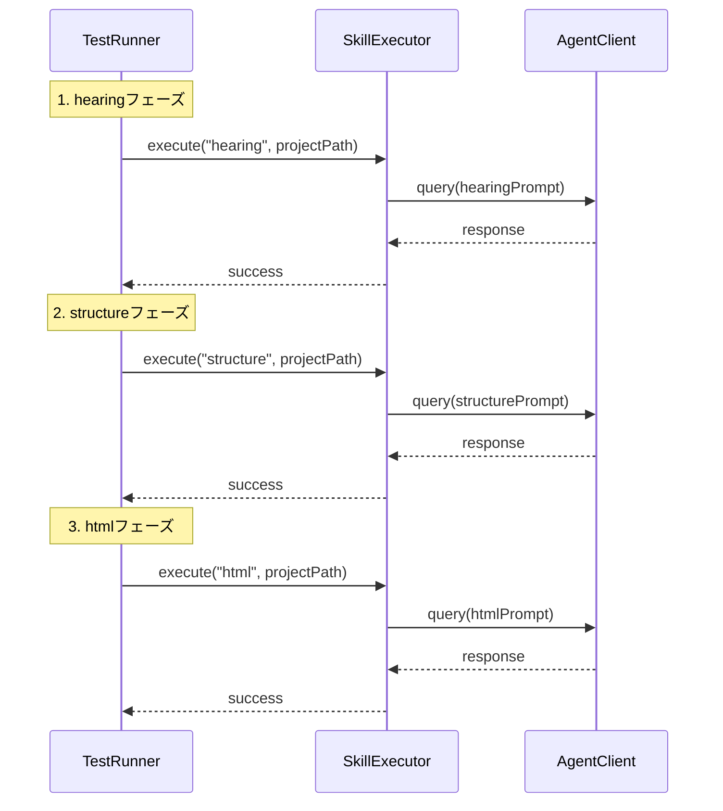
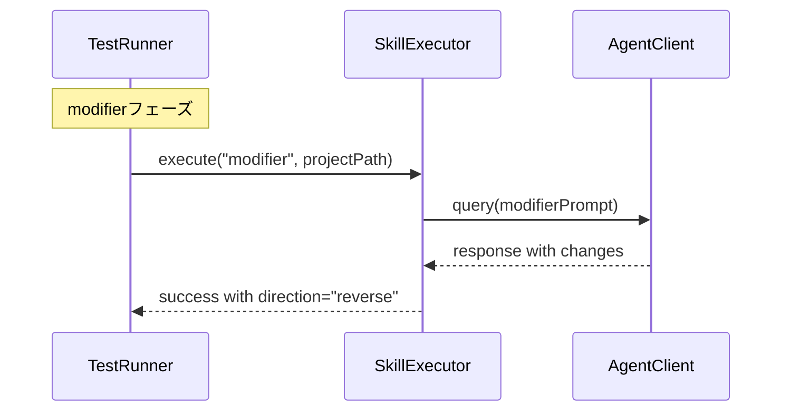

# 統合テスト設計書 - slide-agent-sdk-integration

## メタ情報

| 項目       | 内容                                     |
| ---------- | ---------------------------------------- |
| タスクID   | task-imp-slide-agent-sdk-integration-001 |
| Phase      | 4                                        |
| 作成日     | 2026-01-17                               |
| ステータス | 完了                                     |

---

## 概要

本ドキュメントは、Claude Agent SDK統合の統合テスト設計を定義する。ユニットテストでカバーできないモジュール間連携、エンドツーエンドフロー、エラー伝播をテストする。

---

## 統合テスト戦略

### テスト対象

| コンポーネント | 説明                              |
| -------------- | --------------------------------- |
| SkillExecutor  | スキル実行のオーケストレーション  |
| AgentClient    | Claude Agent SDKとの通信          |
| SDK連携        | SkillExecutor → AgentClient → SDK |

### テストスコープ

```
┌─────────────────────────────────────────────────────────────┐
│                    統合テストスコープ                        │
│  ┌─────────────────────────────────────────────────────────┐│
│  │                   SkillExecutor                          ││
│  │           execute() / cancel() / onProgress()           ││
│  └──────────────────────────┬──────────────────────────────┘│
│                              │ 統合ポイント1                 │
│  ┌──────────────────────────┴──────────────────────────────┐│
│  │                    AgentClient                           ││
│  │         query() / abort() / getStatus() / onMessage()   ││
│  └──────────────────────────┬──────────────────────────────┘│
│                              │ 統合ポイント2                 │
│  ┌──────────────────────────┴──────────────────────────────┐│
│  │                 Claude Agent SDK (モック)                ││
│  │               messages.create() / streaming              ││
│  └─────────────────────────────────────────────────────────┘│
└─────────────────────────────────────────────────────────────┘
```

---

## テストシナリオ設計

### 1. API接続テスト

#### INT-01: SDK初期化と認証成功

```
シナリオ:
  Given: APIキーが設定されている
  When: スキル実行を開始する
  Then: SDK初期化と認証が正常に行われる
  And: スキルが正常に実行される

検証ポイント:
  - SkillExecutor.execute()が成功を返す
  - エラーが発生しない
```

#### INT-02: 無効なAPIキーでエラー

```
シナリオ:
  Given: 無効なAPIキーが設定されている
  When: スキル実行を開始する
  Then: 認証エラーが発生する
  And: エラーメッセージが返される

検証ポイント:
  - result.success === false
  - result.errorに認証関連メッセージが含まれる
```

### 2. データフローテスト

#### INT-03: 順方向同期フロー

```
シーケンス:
  structure.md変更
       ↓
  html-generatorスキル実行
       ↓
  index.html更新

検証ポイント:
  - SkillExecutor.execute("html", projectPath)が成功
  - result.phaseが"html"
  - result.outputに"html-generator"が含まれる
```

#### INT-04: 逆方向同期フロー

```
シーケンス:
  index.html変更
       ↓
  modifierスキル実行
       ↓
  structure.md更新

検証ポイント:
  - SkillExecutor.execute("modifier", projectPath)が成功
  - result.directionが"reverse"
  - result.changesが定義されている
```

### 3. エラーハンドリングテスト

#### INT-05: SDK障害時のエラー表示

```
シナリオ:
  Given: SDK呼び出しが失敗する状況
  When: スキル実行を開始する
  Then: エラーが適切に処理される
  And: エラーメッセージが結果に含まれる

検証ポイント:
  - result.success === false
  - result.errorが定義されている
```

#### INT-06: タイムアウトエラー

```
シナリオ:
  Given: SDK応答が30秒以上かかる
  When: スキル実行を開始する
  Then: タイムアウトエラーが発生する
  And: "Request timeout"メッセージが返される

検証ポイント:
  - 30秒後にタイムアウト
  - エラーメッセージが"Request timeout"
```

### 4. 状態同期テスト

#### INT-07: 進捗コールバック反映

```
シナリオ:
  Given: 進捗コールバックが登録されている
  When: スキル実行を開始する
  Then: 進捗コールバックが発火する
  And: 0%, 25%, 50%, 100%の進捗が通知される

検証ポイント:
  - progressValues.includes(0)
  - progressValues.includes(100)
```

### 5. キャンセルテスト

#### INT-08: 実行中キャンセル

```
シナリオ:
  Given: スキルが実行中
  When: cancel()を呼び出す
  Then: 実行がキャンセルされる
  And: Cancelledエラーが返される

検証ポイント:
  - executor.isExecuting() === false
  - result.error === "Cancelled"
```

---

## E2Eフローテスト設計

### INT-09: 完全な順方向同期フロー



### INT-10: 完全な逆方向同期フロー



### INT-11: 連続実行テスト

```
テストシナリオ:
  1. hearing → structure → html → modifier の順で実行
  2. 各フェーズが成功すること
  3. すべてのフェーズで進捗が報告されること
```

### INT-12: キャンセル後リカバリ

```
テストシナリオ:
  1. スキル実行を開始
  2. 実行中にキャンセル
  3. キャンセルエラーを確認
  4. 新しい実行を開始
  5. 新しい実行が成功すること
```

---

## 境界値テスト設計

### INT-13: 長いプロジェクトパス

```
入力: "/tmp/" + "a".repeat(1000)
期待結果: 正常に処理される
```

### INT-14: 特殊文字を含むパス

```
入力: "/tmp/project-with-spaces and 日本語"
期待結果: 正常に処理される
```

### INT-15: 高速連続実行

```
テストシナリオ:
  1. 最初の実行を開始
  2. 即座に10回実行を試みる
  3. 追加の実行はすべて排他エラーで失敗
  4. 最初の実行は成功
```

---

## モックファクトリ設計

### SDKモックファクトリ

```typescript
/**
 * Claude Agent SDKモックファクトリ
 * テストシナリオに応じたモックを生成
 */
const createSDKMock = (options?: {
  shouldFail?: boolean;
  failureMessage?: string;
  responseContent?: string;
  responseDelay?: number;
}) => ({
  default: vi.fn().mockImplementation(() => ({
    messages: {
      create: vi.fn().mockImplementation(async () => {
        if (options?.shouldFail) {
          throw new Error(options.failureMessage || "SDK call failed");
        }

        if (options?.responseDelay) {
          await new Promise((resolve) =>
            setTimeout(resolve, options.responseDelay),
          );
        }

        return {
          content: [
            {
              type: "text",
              text: options?.responseContent || JSON.stringify({ changes: [] }),
            },
          ],
          usage: { input_tokens: 100, output_tokens: 50 },
        };
      }),
    },
  })),
});
```

### テストヘルパー

```typescript
/**
 * テスト用プロジェクトパス生成
 */
const createTestProjectPath = (suffix?: string): string => {
  return `/tmp/test-project-${Date.now()}${suffix ? `-${suffix}` : ""}`;
};

/**
 * 進捗コールバックコレクター
 */
const createProgressCollector = () => {
  const progressValues: number[] = [];
  return {
    callback: (progress: number) => progressValues.push(progress),
    values: progressValues,
  };
};
```

---

## テスト実行設定

### Vitest設定

```typescript
// vitest.config.ts
export default defineConfig({
  test: {
    include: ["**/__tests__/**/*.test.ts"],
    environment: "node",
    globals: true,
    coverage: {
      provider: "v8",
      reporter: ["text", "html"],
      include: ["src/main/slide/**/*.ts"],
      exclude: ["**/__tests__/**"],
    },
  },
});
```

### テスト実行コマンド

```bash
# 統合テストのみ実行
pnpm --filter @repo/desktop test sdk-integration

# カバレッジ付きで実行
pnpm --filter @repo/desktop test:coverage
```

---

## テスト環境要件

| 要件         | 説明                               |
| ------------ | ---------------------------------- |
| Node.js      | v20.x以上                          |
| Vitest       | v1.x以上                           |
| モック環境   | vi.mock, vi.fn, vi.useFakeTimers   |
| 非同期テスト | async/await, vi.advanceTimersAsync |

---

## テスト品質基準

| 基準             | 目標                       |
| ---------------- | -------------------------- |
| テスト独立性     | 各テストが独立して実行可能 |
| 再現性           | 同じ結果が常に得られる     |
| 明確な検証       | expect()で明確な検証を行う |
| エラーメッセージ | 失敗時に明確なメッセージ   |
| 実行時間         | 各テストが1秒以内に完了    |

---

## 次のステップ

Phase 5: 実装（TDD: Green）でテストをパスさせる

---

**作成日**: 2026-01-17
**Phase 4 統合テスト設計書 完了**
