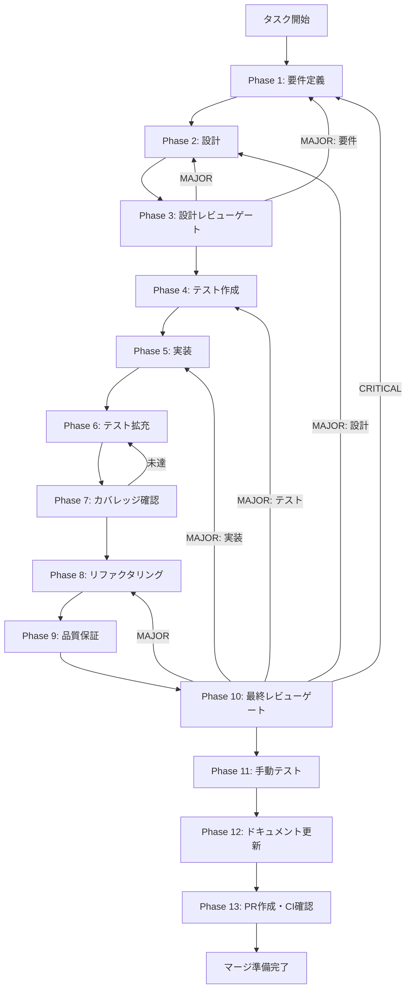

# slide-dependency-management - タスク実行仕様書

## ユーザーからの元の指示

```
スライド依存関係管理システムを構築する。
structure.mdとindex.htmlの依存関係を自動管理し、4つのスキルフェーズをシームレスに呼び出せるシステムを実装する。
```

## メタ情報

| 項目         | 内容                                      |
| ------------ | ----------------------------------------- |
| タスクID     | task-feat-slide-dependency-management-003 |
| タスク名     | slide-dependency-management               |
| 分類         | 要件（新機能）                            |
| 対象機能     | スライド作成システム                      |
| 優先度       | 高                                        |
| 見積もり規模 | 中規模                                    |
| ステータス   | 未実施                                    |
| 作成日       | 2026-01-08                                |

---

## タスク概要

### 目的

structure.mdとindex.htmlの依存関係を自動管理し、4つのスキルフェーズをシームレスに呼び出せるシステムを構築する。

### 背景

presentation-slide-generatorスキルでは、以下の2ファイルが密接に連携している：

- **structure.md**: スライドの構造化データ（メタ情報、スライド一覧、各スライド詳細）
- **index.html**: 実際のプレゼンテーションファイル

スキルの仕様では「index.htmlを修正したら必ずstructure.mdも同期更新する」「structure.mdを修正したらindex.htmlを再生成する」という整合性維持ルールがある。この依存関係をアプリ上で自動管理することで、ユーザーの手動操作を減らし、整合性を保証する。

### 問題点・課題

- structure.md更新時に手動でhtml-generatorを呼び出す必要がある
- index.html修正時にstructure.mdへの反映を忘れやすい
- 両ファイルの整合性が崩れると、次回修正時に意図しない結果になる
- 4つのスキルフェーズの連携が煩雑

### 最終ゴール

1. structure.md更新時にindex.htmlが自動再生成される
2. ファイルウォッチャーがリアルタイムで変更を検知する
3. アプリUIから4つのスキルフェーズを呼び出せる
   - ヒアリング（hearing-facilitator）
   - 構成設計（structure-designer）
   - HTML生成（html-generator）
   - スライド修正（slide-modifier）
4. 依存関係の状態（同期/非同期）がUIに表示される

### 成果物一覧

| 種別         | 成果物                               | 配置先                             |
| ------------ | ------------------------------------ | ---------------------------------- |
| 機能         | スライド依存関係管理モジュール       | `packages/shared/src/slide/`       |
| 機能         | ファイルウォッチャー・スキル呼び出し | `apps/desktop/src/main/slide/`     |
| 機能         | スライド管理UIコンポーネント         | `apps/desktop/src/renderer/slide/` |
| テスト       | ユニットテスト・統合テスト           | `packages/*/src/**/*.test.ts`      |
| ドキュメント | 各Phase成果物                        | `outputs/phase-*/`                 |
| PR           | GitHub Pull Request                  | GitHub UI                          |

---

## 参照ファイル

本仕様書のスキル選定は以下を参照：

- `docs/00-requirements/master_system_design.md` - システム要件
- `.claude/skills/aiworkflow-requirements/references/` - システム仕様
- `docs/30-workflows/unassigned-task/task-slide-dependency-management.md` - 元タスク指示書

---

## 前提条件・依存タスク

| タスクID                               | 依存内容                   |
| -------------------------------------- | -------------------------- |
| task-feat-agent-sdk-integration-001    | Agent SDKの基盤が必要      |
| task-feat-slide-directory-settings-002 | 出力ディレクトリ設定が必要 |

---

## タスク分解サマリー

| ID     | フェーズ | サブタスク名       | 責務                       | 依存 |
| ------ | -------- | ------------------ | -------------------------- | ---- |
| T-01-1 | Phase 1  | 要件定義           | 要件・受け入れ基準定義     | -    |
| T-02-1 | Phase 2  | 設計               | アーキテクチャ・詳細設計   | T-01 |
| T-03-1 | Phase 3  | 設計レビューゲート | 設計妥当性検証             | T-02 |
| T-04-1 | Phase 4  | テスト作成         | TDD: Red（失敗するテスト） | T-03 |
| T-05-1 | Phase 5  | 実装               | TDD: Green（テストを通す） | T-04 |
| T-06-1 | Phase 6  | テスト拡充         | カバレッジ目標達成         | T-05 |
| T-07-1 | Phase 7  | カバレッジ確認     | カバレッジ目標検証         | T-06 |
| T-08-1 | Phase 8  | リファクタリング   | TDD: Refactor（品質改善）  | T-07 |
| T-09-1 | Phase 9  | 品質保証           | 静的解析・セキュリティ     | T-08 |
| T-10-1 | Phase 10 | 最終レビューゲート | 全体品質検証               | T-09 |
| T-11-1 | Phase 11 | 手動テスト         | UX・実環境動作確認         | T-10 |
| T-12-1 | Phase 12 | ドキュメント更新   | ドキュメント・仕様反映     | T-11 |
| T-13-1 | Phase 13 | PR作成             | コミット・PR・CI確認       | T-12 |

**総サブタスク数**: 13個

---

## 実行フロー図



---

## Phase一覧

| Phase | 名称               | 仕様書                                                 | ステータス |
| ----- | ------------------ | ------------------------------------------------------ | ---------- |
| 1     | 要件定義           | [phase-1-requirements.md](phase-1-requirements.md)     | 未実施     |
| 2     | 設計               | [phase-2-design.md](phase-2-design.md)                 | 未実施     |
| 3     | 設計レビューゲート | [phase-3-design-review.md](phase-3-design-review.md)   | 未実施     |
| 4     | テスト作成         | [phase-4-test-creation.md](phase-4-test-creation.md)   | 未実施     |
| 5     | 実装               | [phase-5-implementation.md](phase-5-implementation.md) | 未実施     |
| 6     | テスト拡充         | [phase-6-test-expansion.md](phase-6-test-expansion.md) | 未実施     |
| 7     | カバレッジ確認     | [phase-7-coverage-check.md](phase-7-coverage-check.md) | 未実施     |
| 8     | リファクタリング   | [phase-8-refactoring.md](phase-8-refactoring.md)       | 未実施     |
| 9     | 品質保証           | [phase-9-quality.md](phase-9-quality.md)               | 未実施     |
| 10    | 最終レビューゲート | [phase-10-final-review.md](phase-10-final-review.md)   | 未実施     |
| 11    | 手動テスト         | [phase-11-manual-test.md](phase-11-manual-test.md)     | 未実施     |
| 12    | ドキュメント更新   | [phase-12-documentation.md](phase-12-documentation.md) | 未実施     |
| 13    | PR作成             | [phase-13-pr-creation.md](phase-13-pr-creation.md)     | 未実施     |

---

## テストカバレッジ目標

### ユニットテスト

| 指標              | 最低基準 | 推奨基準 |
| ----------------- | -------- | -------- |
| Line Coverage     | 80%      | 90%      |
| Branch Coverage   | 60%      | 70%      |
| Function Coverage | 80%      | 90%      |

### 結合テスト

| 指標                         | 目標 |
| ---------------------------- | ---- |
| APIエンドポイント            | 100% |
| モジュール間インターフェース | 100% |
| 正常系シナリオ               | 100% |
| 異常系シナリオ               | 80%+ |
| 外部連携ポイント             | 100% |

---

## 統合テスト連携（Phase 1〜11で必須）

各Phaseで以下の統合テスト連携アクションを実施すること:

| Phase | 統合テスト連携アクション                        |
| ----- | ----------------------------------------------- |
| 1     | 接続要件（API/認証/データフロー）を要件に明記   |
| 2     | 統合ポイント/契約（API・スキーマ）を設計に反映  |
| 3     | 統合テスト観点のレビューゲートを実施            |
| 4     | 統合テストシナリオを全カテゴリで作成            |
| 5     | フロント/バック接続の実装とテスト支援コード整備 |
| 6     | 統合テストの拡充（全カテゴリのカバレッジ向上）  |
| 7     | 統合テストの再実行とゲート判定                  |
| 8     | リファクタ後の統合テスト継続成功を確認          |
| 9     | 品質保証で統合テスト結果を確認                  |
| 10    | 最終レビューで統合テスト結果を確認              |
| 11    | 手動統合テスト（UI/API接続）を確認              |

---

## Phase完了時の必須アクション

**各Phase完了時に以下を必ず実行すること:**

1. **スキル100%実行**: Phase内で指定された全スキルを完全に実行
2. **成果物確認**: 全ての必須成果物が生成されていることを検証
3. **フィードバック記録**: 使用スキルの結果をLOGS.mdに記録
4. **artifacts.json更新**: Phase完了ステータスを更新
5. **Phase末端の実行確認**: 各スキルを100%実行し、各タスクを完遂した旨を必ず明記

### フィードバック記録コマンド

```bash
# 各スキルのフィードバックを記録（各スキルごとに実行）
node .claude/skills/task-specification-creator/scripts/log_usage.mjs \
  --skill {{SKILL_NAME}} --result {{success|failure|partial}} --phase {{PHASE_NUMBER}} \
  --issue "{{発見した問題点}}" --proposal "{{改善提案}}"
```

### Phase完了検証コマンド

```bash
# Phase完了時の検証コマンド
node .claude/skills/task-specification-creator/scripts/validate-phase-output.mjs docs/30-workflows/slide-dependency-management --phase {{PHASE_NUMBER}}

# Phase完了・成果物登録
node .claude/skills/task-specification-creator/scripts/complete-phase.mjs \
  --workflow docs/30-workflows/slide-dependency-management --phase {{PHASE_NUMBER}} --artifacts "..."
```

---

## リスクと対策

| リスク                           | 影響度 | 発生確率 | 対策                               |
| -------------------------------- | ------ | -------- | ---------------------------------- |
| ファイルウォッチャーの無限ループ | 高     | 中       | デバウンス処理、変更元の識別       |
| スキル実行の長時間化             | 中     | 中       | 進捗表示、キャンセル機能           |
| 大量ファイル監視のパフォーマンス | 中     | 低       | 監視対象の制限、ポーリング間隔調整 |
| スキル実行中のファイル変更       | 中     | 中       | ロック機構、キュー管理             |

---

## 参照情報

### 関連ドキュメント

- `.claude/skills/presentation-slide-generator/SKILL.md`
- `.claude/skills/presentation-slide-generator/agents/hearing-facilitator.md`
- `.claude/skills/presentation-slide-generator/agents/structure-designer.md`
- `.claude/skills/presentation-slide-generator/agents/html-generator.md`
- `.claude/skills/presentation-slide-generator/agents/slide-modifier.md`
- `task-feat-agent-sdk-integration-001`
- `task-feat-slide-directory-settings-002`

### 参考資料

| リソース | URL                                   |
| -------- | ------------------------------------- |
| chokidar | https://github.com/paulmillr/chokidar |
| Zustand  | https://github.com/pmndrs/zustand     |
