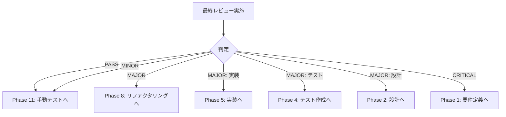

# Phase 10: 最終レビューゲート - スライド依存関係管理システム

## メタ情報

| 項目       | 内容                                      |
| ---------- | ----------------------------------------- |
| Phase      | 10                                        |
| タスクID   | task-feat-slide-dependency-management-003 |
| 名称       | 最終レビューゲート                        |
| ステータス | 未実施                                    |
| 依存Phase  | Phase 1, 2, 5                             |

---

## 目的

全体品質・整合性を検証し、手動テストフェーズへの移行可否を判定する。

---

## 使用スキル

| スキル名      | パス                                    | 選定理由                              |
| ------------- | --------------------------------------- | ------------------------------------- |
| final-review  | `.claude/skills/final-review/SKILL.md`  | 最終レビュー（Trigger: 最終レビュー） |
| design-review | `.claude/skills/design-review/SKILL.md` | 設計確認（Trigger: 設計レビュー）     |

**実行方法**: 各スキルのSKILL.mdを読み込み、スキルを参照して実行

---

## 統合テスト連携【必須】

### Phase 10での統合テスト連携アクション

最終レビューで統合テスト結果を確認する。

**確認項目**:

1. 全統合テストの成功確認
2. 全機能要件の実装確認
3. 全非機能要件の達成確認

---

## 実行手順

### Step 1: 要件充足確認

| 要件ID | 要件概要                       | 実装状況 | 動作確認 |
| ------ | ------------------------------ | -------- | -------- |
| FR-01  | structure.md変更時の自動再生成 | ☐        | ☐        |
| FR-02  | リアルタイム変更検知           | ☐        | ☐        |
| FR-03  | hearing-facilitator呼び出し    | ☐        | ☐        |
| FR-04  | structure-designer呼び出し     | ☐        | ☐        |
| FR-05  | html-generator呼び出し         | ☐        | ☐        |
| FR-06  | slide-modifier呼び出し         | ☐        | ☐        |
| FR-07  | 同期状態UIへの表示             | ☐        | ☐        |
| FR-08  | 手動同期ボタン                 | ☐        | ☐        |
| FR-09  | 進捗表示                       | ☐        | ☐        |
| FR-10  | キャンセル機能                 | ☐        | ☐        |

### Step 2: 非機能要件確認

| 要件ID | 要件                           | 指標        | 達成状況 |
| ------ | ------------------------------ | ----------- | -------- |
| NFR-01 | ファイル変更検知のレイテンシ   | 500ms以内   | ☐        |
| NFR-02 | スキル実行中のUI応答性         | 操作可能    | ☐        |
| NFR-03 | ファイルウォッチャーのリソース | 100MB以下   | ☐        |
| NFR-04 | 無限ループ防止                 | デバウンス  | ☐        |
| NFR-05 | エラー発生時のリカバリー       | リトライ3回 | ☐        |

### Step 3: コード品質確認

| 項目               | 基準       | 達成状況 |
| ------------------ | ---------- | -------- |
| ESLintエラー       | 0件        | ☐        |
| TypeScriptエラー   | 0件        | ☐        |
| テストカバレッジ   | Line 80%+  | ☐        |
| セキュリティ脆弱性 | 高・中 0件 | ☐        |

### Step 4: レビューゲート判定

#### 判定基準

| 判定     | 条件                                       |
| -------- | ------------------------------------------ |
| PASS     | 全項目OK、または軽微な指摘のみ             |
| MINOR    | 軽微な修正が必要だが、手動テストと並行可能 |
| MAJOR    | 重大な問題あり、Phase 8リファクタリングへ  |
| CRITICAL | 要件・設計レベルの問題、Phase 1/2/4/5へ    |

#### 判定結果テンプレート

```markdown
## 最終レビュー結果

**判定**: [PASS / MINOR / MAJOR / CRITICAL]
**レビュー日**: YYYY-MM-DD
**レビュアー**: [レビュアー名]

### 指摘事項

| #   | 種別   | 内容   | 対応       |
| --- | ------ | ------ | ---------- |
| 1   | [種別] | [内容] | [対応方針] |

### 承認事項

- [ ] 全機能要件が実装されている
- [ ] 全非機能要件を達成している
- [ ] コード品質基準を満たしている
- [ ] 統合テストが全て成功している
```

---

## サブタスク管理

Phase実行開始時に、TodoWriteツールで以下のサブタスクを作成すること:

1. 参照資料の確認
2. 使用スキルの実行（各スキルごとに1タスク）
3. 統合テスト連携の実施
4. 成果物の作成・配置
5. 完了条件の検証

**重要**: 各サブタスクは実行完了後すぐにcompletedに更新すること。

---

## 成果物

| 成果物           | パス                                      | 説明                   | 必須 |
| ---------------- | ----------------------------------------- | ---------------------- | ---- |
| 最終レビュー結果 | `outputs/phase-10/final-review-result.md` | レビュー判定と指摘事項 | ✅   |

---

## 参照資料

### システム仕様（aiworkflow-requirements）

> 最終レビュー時に必ず以下のシステム仕様を確認し、仕様との整合性を検証してください。

| 参照資料             | パス                                                                     | 内容                    |
| -------------------- | ------------------------------------------------------------------------ | ----------------------- |
| Electron IPC設計     | `.claude/skills/aiworkflow-requirements/references/electron-ipc-spec.md` | IPC通信仕様             |
| Agent SDK統合        | `.claude/skills/aiworkflow-requirements/references/agent-sdk-spec.md`    | Agent SDK統合仕様       |
| 状態管理ガイドライン | `.claude/skills/aiworkflow-requirements/references/state-management.md`  | Zustand使用ガイドライン |

---

## スキル100%実行確認【必須】

Phase完了前に以下を確認:

- [ ] 本Phase内の全スキルを100%実行完了
- [ ] 各スキルの成果物が生成されている
- [ ] スキルフィードバックがLOGS.mdに記録されている
- [ ] artifacts.jsonが更新されている
- [ ] Phase末端で各タスクを100%完了し、完了を明記している

```bash
# Phase完了時の検証コマンド
node .claude/skills/task-specification-creator/scripts/validate-phase-output.mjs docs/30-workflows/slide-dependency-management --phase 10

# Phase完了・成果物登録
node .claude/skills/task-specification-creator/scripts/complete-phase.mjs \
  --workflow docs/30-workflows/slide-dependency-management --phase 10 --artifacts "final-review-result.md"
```

---

## 完了条件チェックリスト

- [ ] 全機能要件の実装が確認できている
- [ ] 全非機能要件の達成が確認できている
- [ ] コード品質基準を満たしている
- [ ] 統合テスト結果が確認されている
- [ ] レビュー判定が「PASS」または「MINOR」である
- [ ] **本Phase内の全スキルを100%実行完了**

---

## 分岐ロジック



---

## スキルフィードバック記録

| スキル        | 結果    | 備考 |
| ------------- | ------- | ---- |
| final-review  | pending | -    |
| design-review | pending | -    |

---

## 前後Phase

- 前: [Phase 9: 品質保証](phase-9-quality.md)
- 次: [Phase 11: 手動テスト](phase-11-manual-test.md)
