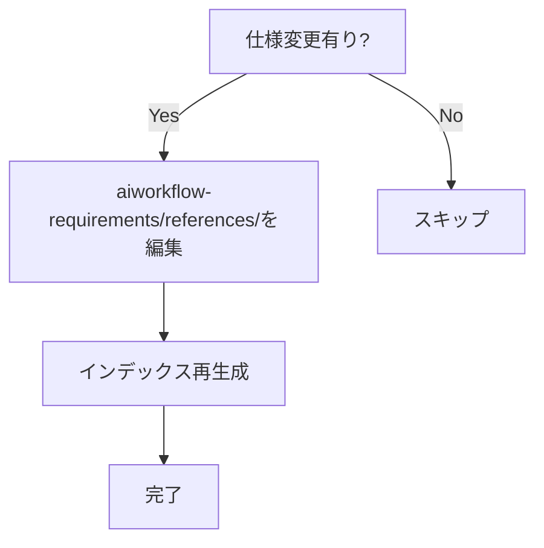

# Phase 12: ドキュメント更新 - スライド依存関係管理システム

## メタ情報

| 項目       | 内容                                      |
| ---------- | ----------------------------------------- |
| Phase      | 12                                        |
| タスクID   | task-feat-slide-dependency-management-003 |
| 名称       | ドキュメント更新                          |
| ステータス | 未実施                                    |
| 依存Phase  | Phase 11                                  |

---

## 目的

ドキュメント更新・仕様反映・未タスク検出・スキルフィードバックを行う。

---

## 使用スキル

| スキル名          | パス                                        | 選定理由                                    |
| ----------------- | ------------------------------------------- | ------------------------------------------- |
| technical-writing | `.claude/skills/technical-writing/SKILL.md` | 技術文書作成（Trigger: ドキュメント）       |
| skill-creator     | `.claude/skills/skill-creator/SKILL.md`     | スキルフィードバック（Trigger: スキル改善） |

**実行方法**: 各スキルのSKILL.mdを読み込み、スキルを参照して実行

---

## 実行手順

### Phase 12-1: 実装ガイド作成

#### 必須セクション

1. **概念的な説明**: 中学生にもわかる比喩・例え話を使った説明
2. **全体アーキテクチャ**: ASCII図解付きのレイヤー構造説明
3. **各層の実装詳細**: コード例 + 設計意図の説明
4. **用語集**: 専門用語の読み方・意味・コンテキスト

#### テンプレート

```markdown
# スライド依存関係管理システム 実装ガイド

## Part 1: 概念的な説明

### 何をするシステム？

[比喩を使った説明]

### なぜ必要？

[課題と解決策の説明]

## Part 2: 技術的な詳細

### アーキテクチャ

[ASCII図解]

### 各層の実装

[コード例と設計意図]

## 用語集

| 用語     | 読み方     | 意味                   |
| -------- | ---------- | ---------------------- |
| chokidar | チョキダー | ファイル監視ライブラリ |
```

### Phase 12-2: システムドキュメント更新

更新対象:

- `docs/00-requirements/` 配下
- `.claude/skills/aiworkflow-requirements/references/`

#### システム仕様更新フロー



#### 具体的な更新手順

```bash
# 1. 該当する仕様ファイルを編集
# 例: IPC通信仕様の更新
vim .claude/skills/aiworkflow-requirements/references/electron-ipc-spec.md

# 2. インデックス再生成【必須】
node .claude/skills/aiworkflow-requirements/scripts/generate-index.mjs

# 3. 変更をコミット
git add .claude/skills/aiworkflow-requirements/
git commit -m "docs(aiworkflow-requirements): スライド依存関係管理の仕様を追加"
```

#### 新規仕様の追加手順

```bash
# 1. テンプレートをコピー
cp .claude/skills/aiworkflow-requirements/assets/spec-template.md \
   .claude/skills/aiworkflow-requirements/references/{prefix}-{topic}.md

# 2. 内容を記述（spec-guidelines.md参照）

# 3. インデックス再生成
node .claude/skills/aiworkflow-requirements/scripts/generate-index.mjs
```

### Phase 12-3: 未タスク検出

| ソース                 | 確認項目             | Grepパターン例                             |
| ---------------------- | -------------------- | ------------------------------------------ |
| Phase 3レビュー結果    | MINOR判定の指摘事項  | `outputs/phase-3/`                         |
| Phase 10レビュー結果   | MINOR判定の指摘事項  | `outputs/phase-10/`                        |
| Phase 11手動テスト結果 | スコープ外の発見事項 | `outputs/phase-11/`                        |
| 各Phase成果物          | 「将来対応」「TODO」 | `grep -r "TODO\|FIXME\|将来対応" outputs/` |
| コードベース           | TODO/FIXMEコメント   | `grep -rn "TODO\|FIXME" packages/ apps/`   |
| スキルLOGS.md          | partial/failure記録  | 各使用スキルのLOGS.md                      |

### Phase 12-4: スキルフィードバック・改善・新規作成

#### 12-4-1: フィードバック収集

各Phaseで使用したスキルの実行結果を評価し記録する。

```bash
# フィードバック記録
node .claude/skills/task-specification-creator/scripts/log_usage.mjs \
  --skill {{SKILL_NAME}} --result {{success|failure|partial}} --phase {{PHASE_NUMBER}}
```

#### 12-4-2: 既存スキル改善判定

skill-creatorで改善必要性を判定し、必要な場合は更新する。

```bash
# 改善判定コマンド
node .claude/skills/skill-creator/scripts/check_improvement_needed.mjs \
  --skill {{SKILL_NAME}}
```

##### 改善判定基準テーブル

| 条件                  | 判定     | アクション               |
| --------------------- | -------- | ------------------------ |
| 同じ問題が3回以上発生 | 既存改善 | ベストプラクティスに追加 |
| ワークフロー不足      | 既存改善 | Phase/アクション追加     |
| Trigger選定ミスが多発 | 既存改善 | Trigger条件見直し        |
| 成果物形式が不統一    | 既存改善 | テンプレート追加         |
| 上記以外              | 保留     | LOGS.mdに記録のみ        |

##### 改善実行コマンド

```bash
# スキル改善モードで実行
node .claude/skills/skill-creator/scripts/detect_mode.mjs \
  --request "スキルを更新" --skill-path .claude/skills/{{SKILL_NAME}}
```

#### 12-4-3: 新規スキル必要性判定

| 検出条件           | 新規スキル作成の判断基準                   |
| ------------------ | ------------------------------------------ |
| 手動作業の繰り返し | 同じ手順を3回以上手動で実行した            |
| 既存スキル不在     | 必要なスキルが見つからず自前で対応した     |
| スキルの責務超過   | 1つのスキルに複数責務を詰め込んだ          |
| ドメイン知識の欠落 | 特定ドメインの専門知識が必要だった         |
| 再利用性の発見     | 他タスクでも使える汎用的な処理パターン発見 |

#### 12-4-4: 新規スキル作成

新規スキルが必要と判定された場合、skill-creatorのcreateモードで作成する。

```bash
# 1. 新規スキル作成
node .claude/skills/skill-creator/scripts/detect_mode.mjs \
  --request "{{NEW_SKILL_DESCRIPTION}}"

# 2. 作成後の検証【必須】
node .claude/skills/skill-creator/scripts/validate_all.mjs \
  .claude/skills/{{NEW_SKILL_NAME}}

# 3. スキルリスト更新【必須】
node .claude/skills/skill-creator/scripts/update_skill_list.mjs \
  --skill-path .claude/skills/{{NEW_SKILL_NAME}}
```

---

#### スキルフィードバックレポートの出力形式

`outputs/phase-12/skill-feedback-report.md` には以下の形式で記録:

```markdown
## {{DATE}} - タスク実行フィードバック

### コンテキスト

- タスク: スライド依存関係管理システム
- Phase: {{PHASE_NUMBER}}
- 実行者: Claude Code

### 結果

- ステータス: {{success|partial|failure}}
- 所要時間: {{DURATION}}分

### 発見事項

- **良かった点**: {{GOOD_POINTS}}
- **問題点**: {{ISSUES}}
- **改善提案**: {{PROPOSALS}}

### 次のアクション

- [ ] {{ACTION_ITEM_1}}
- [ ] {{ACTION_ITEM_2}}
```

---

## サブタスク管理

Phase実行開始時に、TodoWriteツールで以下のサブタスクを作成すること:

1. 参照資料の確認
2. 使用スキルの実行（各スキルごとに1タスク）
3. 成果物の作成・配置
4. 完了条件の検証

**重要**: 各サブタスクは実行完了後すぐにcompletedに更新すること。

---

## 成果物

| 成果物                   | パス                                           | 説明                         | 必須 |
| ------------------------ | ---------------------------------------------- | ---------------------------- | ---- |
| 実装ガイド               | `outputs/phase-12/implementation-guide.md`     | 概念的説明と技術的詳細       | ✅   |
| ドキュメント更新記録     | `outputs/phase-12/documentation-update-log.md` | 更新したドキュメントの一覧   | ✅   |
| 未タスク検出レポート     | `outputs/phase-12/unassigned-task-report.md`   | 検出された未タスクの一覧     | ✅   |
| スキルフィードバック     | `outputs/phase-12/skill-feedback-report.md`    | 各スキルの使用結果と改善提案 | ✅   |
| 未タスク指示書（該当時） | `docs/30-workflows/unassigned-task/`           | 検出された未タスクの指示書   | 条件 |

---

## スキル100%実行確認【必須】

Phase完了前に以下を確認:

- [ ] 本Phase内の全スキルを100%実行完了
- [ ] 各スキルの成果物が生成されている
- [ ] スキルフィードバックがLOGS.mdに記録されている
- [ ] artifacts.jsonが更新されている
- [ ] Phase末端で各タスクを100%完了し、完了を明記している

```bash
# Phase完了時の検証コマンド
node .claude/skills/task-specification-creator/scripts/validate-phase-output.mjs docs/30-workflows/slide-dependency-management --phase 12

# Phase完了・成果物登録
node .claude/skills/task-specification-creator/scripts/complete-phase.mjs \
  --workflow docs/30-workflows/slide-dependency-management --phase 12 --artifacts "implementation-guide.md,documentation-update-log.md,unassigned-task-report.md,skill-feedback-report.md"
```

---

## 完了条件チェックリスト

- [ ] 実装ガイド（Part 1: 概念的説明 + Part 2: 技術的詳細）が作成されている
- [ ] ドキュメント更新記録が出力されている
- [ ] 未タスク検出レポートが出力されている
- [ ] 検出された未タスクに対して指示書が作成されている（該当する場合）
- [ ] スキルフィードバックがskill-creatorで記録されている
- [ ] スキル改善/新規作成が必要な場合、skill-creatorで実行されている
- [ ] aiworkflow-requirementsのインデックス再生成が完了している（仕様変更時）
- [ ] **本Phase内の全スキルを100%実行完了**

---

## スキルフィードバック記録

| スキル            | 結果    | 備考 |
| ----------------- | ------- | ---- |
| technical-writing | pending | -    |
| skill-creator     | pending | -    |

---

## 前後Phase

- 前: [Phase 11: 手動テスト](phase-11-manual-test.md)
- 次: [Phase 13: PR作成](phase-13-pr-creation.md)
