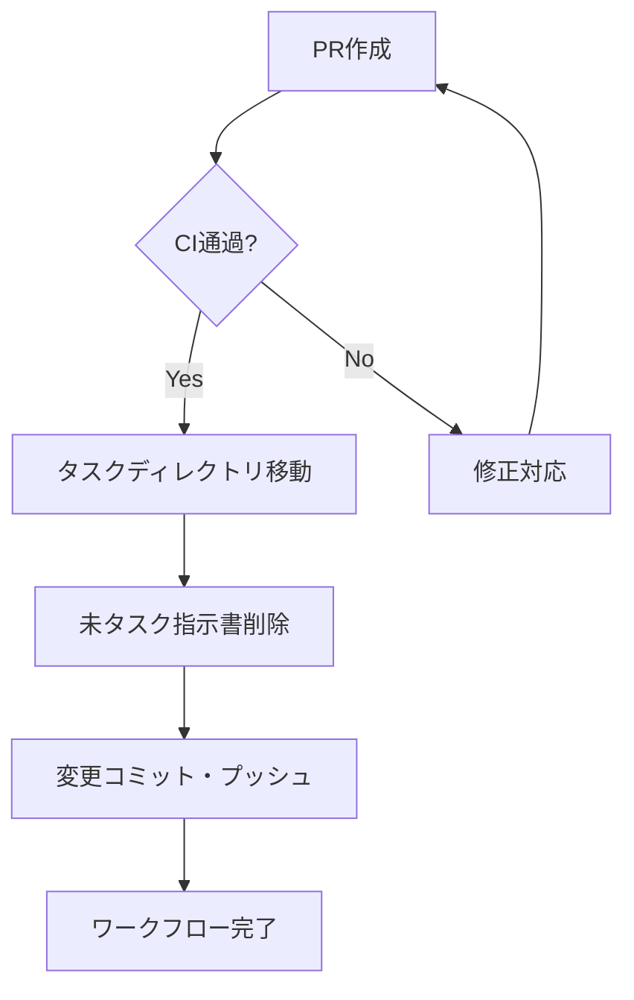

# Phase 13: PR作成 - スライド依存関係管理システム

## メタ情報

| 項目       | 内容                                      |
| ---------- | ----------------------------------------- |
| Phase      | 13                                        |
| タスクID   | task-feat-slide-dependency-management-003 |
| 名称       | PR作成                                    |
| ステータス | 未実施                                    |
| 依存Phase  | Phase 12                                  |

---

## 目的

`/ai:diff-to-pr` でコミット・PR・CI確認を行い、タスクを完了する。

---

## 使用スキル

| スキル名   | パス             | 選定理由                  |
| ---------- | ---------------- | ------------------------- |
| diff-to-pr | `/ai:diff-to-pr` | PR作成（Trigger: PR作成） |

**実行方法**: `/ai:diff-to-pr` スキルを呼び出し

---

## 実行手順

### Step 1: diff-to-pr スキル実行

```bash
# diff-to-pr スキルを呼び出し
/ai:diff-to-pr
```

このスキルが自動的に以下を実行:

1. 変更差分の確認
2. コミットメッセージ生成
3. PR作成
4. CI結果確認

### Step 2: CI確認

CI通過を確認する。

### Step 3: タスク完了処理

#### タスクディレクトリの移動

```bash
# タスクディレクトリをcompleted-tasksに移動
mv docs/30-workflows/slide-dependency-management/ docs/30-workflows/completed-tasks/

# 移動を確認
ls docs/30-workflows/completed-tasks/ | grep slide-dependency-management

# 変更をコミット
git add docs/30-workflows/
git commit -m "docs(workflows): slide-dependency-managementをcompleted-tasksに移動"
git push
```

#### 未タスク指示書の削除

```bash
# 元のタスク指示書を削除
rm docs/30-workflows/unassigned-task/task-slide-dependency-management.md

# 変更をコミット
git add docs/30-workflows/unassigned-task/
git commit -m "docs(workflows): task-slide-dependency-management指示書を削除"
git push
```

---

## サブタスク管理

Phase実行開始時に、TodoWriteツールで以下のサブタスクを作成すること:

1. 参照資料の確認
2. 使用スキルの実行（各スキルごとに1タスク）
3. 成果物の作成・配置
4. 完了条件の検証

**重要**: 各サブタスクは実行完了後すぐにcompletedに更新すること。

---

## 成果物

| 成果物 | パス                          | 説明           | 必須 |
| ------ | ----------------------------- | -------------- | ---- |
| PR情報 | `outputs/phase-13/pr-info.md` | PR URL等の情報 | ✅   |

---

## スキル100%実行確認【必須】

Phase完了前に以下を確認:

- [ ] 本Phase内の全スキルを100%実行完了
- [ ] 各スキルの成果物が生成されている
- [ ] スキルフィードバックがLOGS.mdに記録されている
- [ ] artifacts.jsonが更新されている
- [ ] Phase末端で各タスクを100%完了し、完了を明記している

```bash
# Phase完了時の検証コマンド
node .claude/skills/task-specification-creator/scripts/validate-phase-output.mjs docs/30-workflows/slide-dependency-management --phase 13

# Phase完了・成果物登録
node .claude/skills/task-specification-creator/scripts/complete-phase.mjs \
  --workflow docs/30-workflows/slide-dependency-management --phase 13 --artifacts "pr-info.md"
```

---

## 完了条件チェックリスト

| #   | 項目                                               | 必須 |
| --- | -------------------------------------------------- | ---- |
| 1   | PRが作成されている                                 | ✅   |
| 2   | CIが全て通過している                               | ✅   |
| 3   | タスクディレクトリが `completed-tasks/` に移動済み | ✅   |
| 4   | `artifacts.json` の `status` が `"completed"`      | ✅   |
| 5   | 未タスク指示書が削除済み                           | 条件 |
| 6   | **本Phase内の全作業を100%完了**                    | ✅   |

---

## タスク完了フロー



---

## スキルフィードバック記録

| スキル     | 結果    | 備考 |
| ---------- | ------- | ---- |
| diff-to-pr | pending | -    |

---

## 前Phase

- 前: [Phase 12: ドキュメント更新](phase-12-documentation.md)
