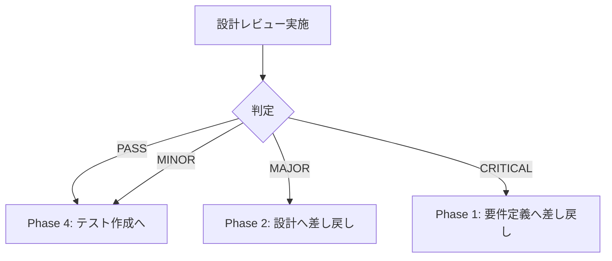

# Phase 3: 設計レビューゲート - スライド依存関係管理システム

## メタ情報

| 項目       | 内容                                      |
| ---------- | ----------------------------------------- |
| Phase      | 3                                         |
| タスクID   | task-feat-slide-dependency-management-003 |
| 名称       | 設計レビューゲート                        |
| ステータス | 未実施                                    |
| 依存Phase  | Phase 1, 2                                |

---

## 目的

要件・設計の妥当性を検証し、実装フェーズへの移行可否を判定する。

---

## 使用スキル

| スキル名             | パス                                           | 選定理由                                    |
| -------------------- | ---------------------------------------------- | ------------------------------------------- |
| design-review        | `.claude/skills/design-review/SKILL.md`        | 設計レビュー（Trigger: 設計レビュー）       |
| code-smell-detection | `.claude/skills/code-smell-detection/SKILL.md` | 設計品質チェック（Trigger: アンチパターン） |

**実行方法**: 各スキルのSKILL.mdを読み込み、スキルを参照して実行

---

## 統合テスト連携【必須】

### Phase 3での統合テスト連携アクション

統合テスト観点のレビューゲートを実施する。

**具体的なレビュー項目**:

1. **IPC通信の整合性**
   - Main/Renderer間のインターフェース一致
   - イベント伝播の完全性
   - エラーハンドリングの網羅性

2. **状態同期の整合性**
   - Zustand Storeの状態遷移の正当性
   - ファイル変更→UI更新の遅延許容範囲
   - 競合状態の考慮

3. **外部依存の検証**
   - Agent SDK連携のインターフェース確認
   - chokidarの設定妥当性
   - Electronバージョン互換性

---

## 実行手順

### Step 1: 要件-設計トレーサビリティ確認

| 要件ID | 要件概要                       | 設計対応箇所                            | 対応状況 |
| ------ | ------------------------------ | --------------------------------------- | -------- |
| FR-01  | structure.md変更時の自動再生成 | FileWatcher + SkillExecutor             | ☐        |
| FR-02  | リアルタイム変更検知           | chokidar設定（awaitWriteFinish:500ms）  | ☐        |
| FR-03  | hearing-facilitator呼び出し    | SkillExecutor.execute('hearing', ...)   | ☐        |
| FR-04  | structure-designer呼び出し     | SkillExecutor.execute('structure', ...) | ☐        |
| FR-05  | html-generator呼び出し         | SkillExecutor.execute('html', ...)      | ☐        |
| FR-06  | slide-modifier呼び出し         | SkillExecutor.execute('modifier', ...)  | ☐        |
| FR-07  | 同期状態UIへの表示             | SyncStatusIndicator + Zustand Store     | ☐        |
| FR-08  | 手動同期ボタン                 | SyncManager.sync() + UI Button          | ☐        |
| FR-09  | 進捗表示                       | onExecutionProgress イベント            | ☐        |
| FR-10  | キャンセル機能                 | SkillExecutor.cancel()                  | ☐        |

### Step 2: 設計品質チェック

#### アーキテクチャ原則チェック

| チェック項目               | 判定 | 備考                                |
| -------------------------- | ---- | ----------------------------------- |
| 単一責務の原則（SRP）      | ☐    | 各モジュールの責務が明確か          |
| 依存関係逆転の原則（DIP）  | ☐    | インターフェースによる疎結合か      |
| Main/Renderer分離          | ☐    | Electronベストプラクティス準拠か    |
| 状態管理の一元化           | ☐    | Zustandで状態が一元管理されているか |
| エラーハンドリングの一貫性 | ☐    | エラー処理が統一されているか        |

#### 潜在的な設計リスク

| リスク                           | 影響度 | 対策状況 | 備考                              |
| -------------------------------- | ------ | -------- | --------------------------------- |
| ファイルウォッチャーの無限ループ | 高     | ☐        | デバウンス+変更元識別で対策       |
| スキル実行の長時間化             | 中     | ☐        | キャンセル機能+タイムアウトで対策 |
| メモリリーク                     | 中     | ☐        | ウォッチャーの適切な破棄で対策    |
| IPC通信の競合                    | 中     | ☐        | キュー管理で対策                  |

### Step 3: レビューゲート判定

#### 判定基準

| 判定     | 条件                                                 |
| -------- | ---------------------------------------------------- |
| PASS     | 全てのチェック項目がOK、または軽微な指摘のみ         |
| MINOR    | 軽微な修正が必要だが、実装フェーズと並行して対応可能 |
| MAJOR    | 重大な設計変更が必要、Phase 2に差し戻し              |
| CRITICAL | 要件レベルの問題、Phase 1に差し戻し                  |

#### 判定結果テンプレート

```markdown
## レビュー結果

**判定**: [PASS / MINOR / MAJOR / CRITICAL]
**レビュー日**: YYYY-MM-DD
**レビュアー**: [レビュアー名]

### 指摘事項

| #   | 種別   | 内容   | 対応       |
| --- | ------ | ------ | ---------- |
| 1   | [種別] | [内容] | [対応方針] |

### 承認事項

- [ ] 要件-設計トレーサビリティが確認できた
- [ ] アーキテクチャ原則に準拠している
- [ ] 統合テスト観点のレビューが完了した
- [ ] 潜在的リスクの対策が設計されている
```

---

## サブタスク管理

Phase実行開始時に、TodoWriteツールで以下のサブタスクを作成すること:

1. 参照資料の確認
2. 使用スキルの実行（各スキルごとに1タスク）
3. 統合テスト連携の実施
4. 成果物の作成・配置
5. 完了条件の検証

**重要**: 各サブタスクは実行完了後すぐにcompletedに更新すること。

---

## 成果物

| 成果物             | パス                                      | 説明                   | 必須 |
| ------------------ | ----------------------------------------- | ---------------------- | ---- |
| 設計レビュー結果   | `outputs/phase-3/design-review-result.md` | レビュー判定と指摘事項 | ✅   |
| トレーサビリティ表 | `outputs/phase-3/traceability-matrix.md`  | 要件-設計の対応関係    | ✅   |

---

## 参照資料

### システム仕様（aiworkflow-requirements）

> 設計レビュー時に必ず以下のシステム仕様を確認し、既存設計との整合性を確保してください。

| 参照資料             | パス                                                                     | 内容                    |
| -------------------- | ------------------------------------------------------------------------ | ----------------------- |
| Electron IPC設計     | `.claude/skills/aiworkflow-requirements/references/electron-ipc-spec.md` | IPC通信仕様             |
| Agent SDK統合        | `.claude/skills/aiworkflow-requirements/references/agent-sdk-spec.md`    | Agent SDK統合仕様       |
| 状態管理ガイドライン | `.claude/skills/aiworkflow-requirements/references/state-management.md`  | Zustand使用ガイドライン |

### Phase 1成果物

| 参照資料     | パス                                         | 説明                 |
| ------------ | -------------------------------------------- | -------------------- |
| 要件定義書   | `outputs/phase-1/requirements-definition.md` | 機能要件・非機能要件 |
| 受け入れ基準 | `outputs/phase-1/acceptance-criteria.md`     | 受け入れ条件         |

### Phase 2成果物

| 参照資料           | パス                                     | 説明               |
| ------------------ | ---------------------------------------- | ------------------ |
| アーキテクチャ設計 | `outputs/phase-2/architecture-design.md` | コンポーネント構成 |
| 状態管理設計       | `outputs/phase-2/state-design.md`        | Zustand Store設計  |
| API仕様            | `outputs/phase-2/api-specification.md`   | IPC通信仕様        |

---

## スキル100%実行確認【必須】

Phase完了前に以下を確認:

- [ ] 本Phase内の全スキルを100%実行完了
- [ ] 各スキルの成果物が生成されている
- [ ] スキルフィードバックがLOGS.mdに記録されている
- [ ] artifacts.jsonが更新されている
- [ ] Phase末端で各タスクを100%完了し、完了を明記している

```bash
# Phase完了時の検証コマンド
node .claude/skills/task-specification-creator/scripts/validate-phase-output.mjs docs/30-workflows/slide-dependency-management --phase 3

# Phase完了・成果物登録
node .claude/skills/task-specification-creator/scripts/complete-phase.mjs \
  --workflow docs/30-workflows/slide-dependency-management --phase 3 --artifacts "design-review-result.md,traceability-matrix.md"
```

---

## 完了条件チェックリスト

- [ ] 要件-設計トレーサビリティが100%確認できている
- [ ] アーキテクチャ原則チェックが完了している
- [ ] 統合テスト観点のレビューが完了している
- [ ] 潜在的リスクの対策が確認できている
- [ ] レビュー判定が「PASS」または「MINOR」である
- [ ] **本Phase内の全スキルを100%実行完了**

---

## スキルフィードバック記録

| スキル               | 結果    | 備考 |
| -------------------- | ------- | ---- |
| design-review        | pending | -    |
| code-smell-detection | pending | -    |

---

## 分岐ロジック



---

## 前後Phase

- 前: [Phase 2: 設計](phase-2-design.md)
- 次: [Phase 4: テスト作成](phase-4-test-creation.md)
